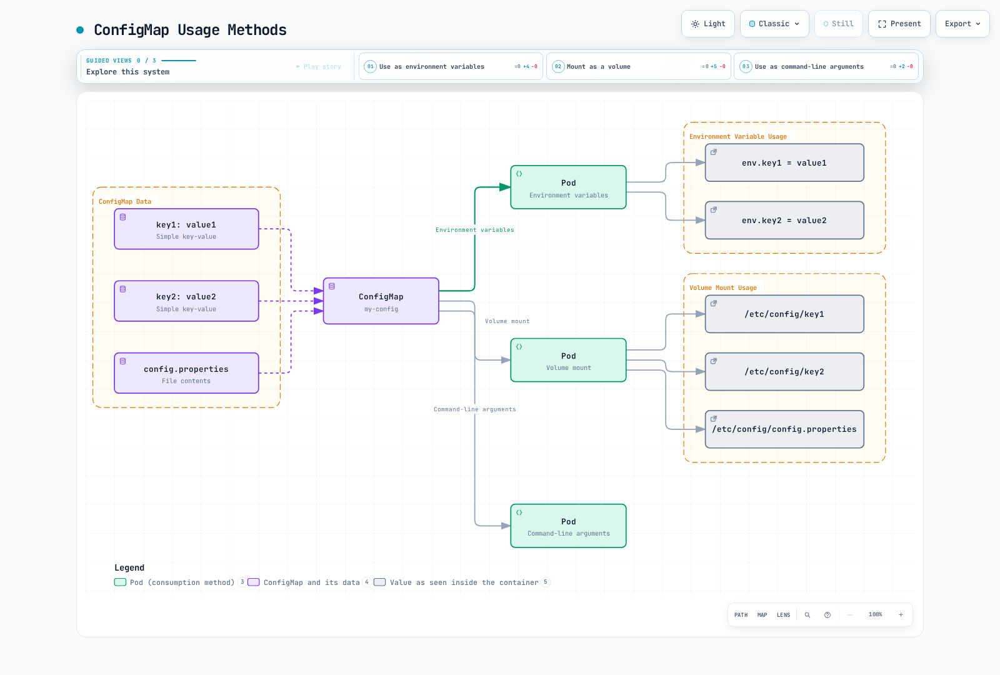
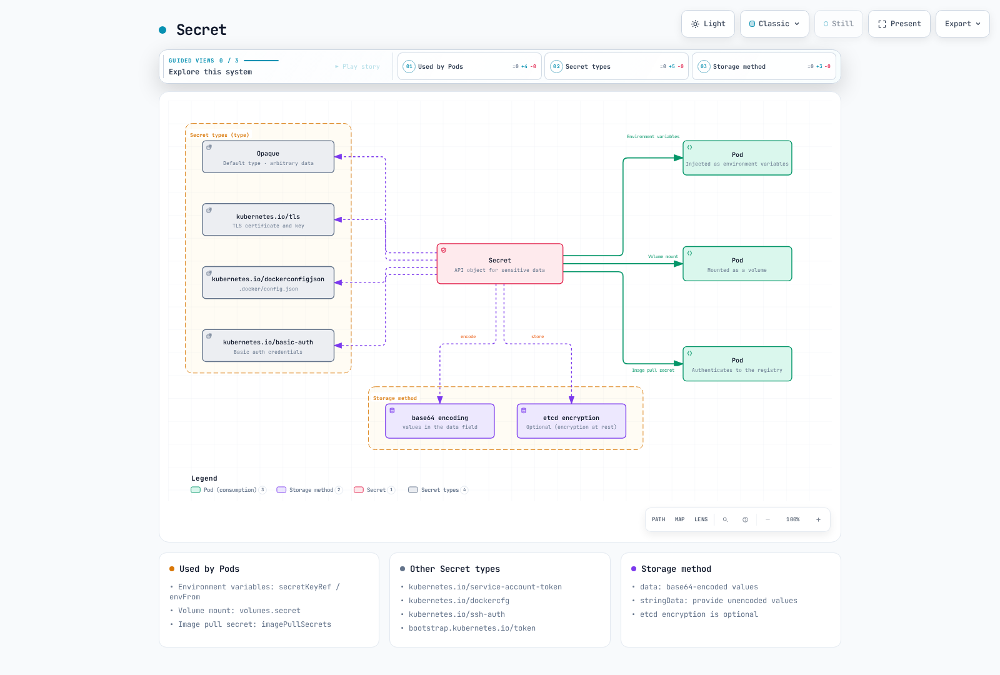
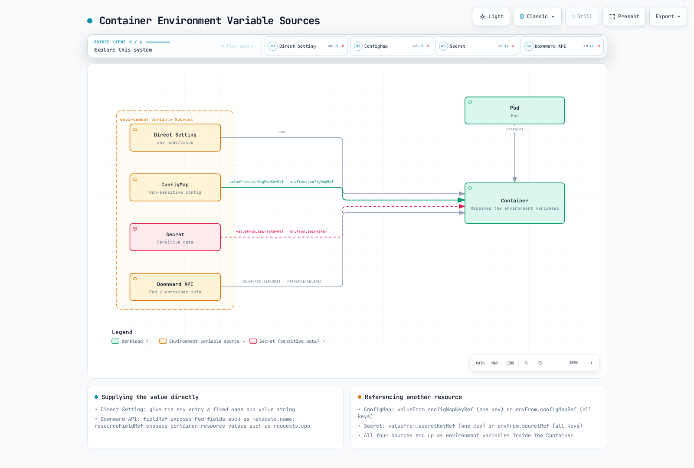

# 配置与 Secret

> **支持的版本**: Kubernetes 1.32, 1.33, 1.34
> **最后更新**: February 22, 2026

在 Kubernetes 中，配置管理是将应用程序设置与代码分离管理的重要部分。本章将详细介绍 Kubernetes 配置管理方法，包括 ConfigMap、Secret、环境变量，以及通过 volume 挂载配置。

## 实验环境设置

要跟随本文档中的示例操作，你需要以下工具和环境：

### 必需工具
- kubectl v1.34 或更高版本
- 可用的 Kubernetes 集群（EKS、minikube、kind 等）

### 配置示例设置

```bash
# Create namespace
kubectl create namespace config-demo

# Create ConfigMap
kubectl -n config-demo create configmap app-config \
  --from-literal=APP_ENV=production \
  --from-literal=APP_DEBUG=false \
  --from-literal=APP_PORT=8080

# Create Secret
kubectl -n config-demo create secret generic app-secrets \
  --from-literal=DB_USER=admin \
  --from-literal=DB_PASSWORD=s3cr3t \
  --from-literal=API_KEY=abcdef123456

# Create Pod using ConfigMap and Secret
kubectl -n config-demo apply -f - <<EOF
apiVersion: v1
kind: Pod
metadata:
  name: config-test-pod
spec:
  containers:
  - name: test-container
    image: busybox
    command: ["sh", "-c", "env | sort && sleep 3600"]
    env:
    - name: APP_ENV
      valueFrom:
        configMapKeyRef:
          name: app-config
          key: APP_ENV
    - name: DB_PASSWORD
      valueFrom:
        secretKeyRef:
          name: app-secrets
          key: DB_PASSWORD
  restartPolicy: Never
EOF

# Check Pod logs
kubectl -n config-demo logs config-test-pod
```

## 配置管理概览


[🔍 查看交互式图表](https://www.atomai.click/kubernetes-docs/archmaps/en-core-05-configuration-secrets-0.html)

## 目录

1. [ConfigMap](#configmap)
2. [Secret](#secret)
3. [环境变量](#environment-variables)
4. [通过 Volume 挂载配置](#mounting-configuration-through-volumes)
5. [配置最佳实践](#configuration-best-practices)
6. [外部配置管理工具](#external-configuration-management-tools)

## ConfigMap

> **核心概念**：ConfigMap 以键值对形式存储配置数据，将应用程序代码与配置分离。

ConfigMap 是以键值对形式存储配置数据的 API 对象。使用 ConfigMap 可将配置数据与 container image 分离，使应用程序更具可移植性。

### ConfigMap 与 Secret 对比

| 特性 | ConfigMap | Secret |
|---------|-----------|--------|
| **用途** | 通用配置数据 | 敏感配置数据 |
| **存储格式** | 纯文本 | Base64 编码（默认） |
| **大小限制** | 1MB | 1MB |
| **加密** | 默认无 | 支持 etcd 加密 |
| **Volume 类型** | configMap | secret |
| **使用场景** | 环境变量、配置文件 | 密码、token、证书 |
| **自动更新** | 作为 volume 挂载时可能存在延迟 | 作为 volume 挂载时可能存在延迟 |

### ConfigMap 创建方法

可以通过多种方式创建 ConfigMap：

1. **命令式创建**：

```bash
# Create from literal values
kubectl create configmap my-config --from-literal=key1=value1 --from-literal=key2=value2

# Create from file
kubectl create configmap my-config --from-file=config.properties

# Create from directory
kubectl create configmap my-config --from-file=config-dir/
```

2. **声明式创建**：

```yaml
apiVersion: v1
kind: ConfigMap
metadata:
  name: my-config
data:
  # Simple key-value pairs
  database.host: "mysql"
  database.port: "3306"

  # File-like configuration
  config.yaml: |
    server:
      port: 8080
    logging:
      level: INFO
    features:
      enabled: true
```

### ConfigMap 使用方法

可以通过以下方式使用 ConfigMap：

1. **作为环境变量使用**：

```yaml
apiVersion: v1
kind: Pod
metadata:
  name: config-env-pod
spec:
  containers:
  - name: app
    image: nginx
    env:
    # Single key-value reference
    - name: DB_HOST
      valueFrom:
        configMapKeyRef:
          name: my-config
          key: database.host
    # All key-value references
    envFrom:
    - configMapRef:
        name: my-config
```



[🔍 查看交互式图表](https://www.atomai.click/kubernetes-docs/archmaps/en-core-05-configuration-secrets-1.html)

### ConfigMap 创建

可以通过多种方式创建 ConfigMap：

#### 命令式

```bash
# Create from literal values
kubectl create configmap my-config --from-literal=key1=value1 --from-literal=key2=value2

# Create from file
kubectl create configmap my-config --from-file=config.properties

# Create from directory
kubectl create configmap my-config --from-file=config-dir/
```

#### 声明式

```yaml
apiVersion: v1
kind: ConfigMap
metadata:
  name: my-config
data:
  # Simple key-value pairs
  key1: value1
  key2: value2
  # File-like configuration
  config.properties: |
    property1=value1
    property2=value2
  # JSON configuration
  config.json: |
    {
      "property1": "value1",
      "property2": "value2"
    }
```

### ConfigMap 使用

可以通过以下方式在 Pod 中使用 ConfigMap：

#### 作为环境变量使用

```yaml
apiVersion: v1
kind: Pod
metadata:
  name: configmap-pod
spec:
  containers:
  - name: test-container
    image: busybox
    command: [ "/bin/sh", "-c", "env" ]
    env:
    # Use single key-value pair
    - name: SPECIAL_KEY
      valueFrom:
        configMapKeyRef:
          name: my-config
          key: key1
    # Use all key-value pairs as environment variables
    envFrom:
    - configMapRef:
        name: my-config
  restartPolicy: Never
```

#### 作为 Volume 挂载

```yaml
apiVersion: v1
kind: Pod
metadata:
  name: configmap-pod
spec:
  containers:
  - name: test-container
    image: busybox
    command: [ "/bin/sh", "-c", "ls /etc/config/" ]
    volumeMounts:
    - name: config-volume
      mountPath: /etc/config
  volumes:
  - name: config-volume
    configMap:
      name: my-config
  restartPolicy: Never
```

#### 仅挂载特定键

```yaml
apiVersion: v1
kind: Pod
metadata:
  name: configmap-pod
spec:
  containers:
  - name: test-container
    image: busybox
    command: [ "/bin/sh", "-c", "cat /etc/config/key1" ]
    volumeMounts:
    - name: config-volume
      mountPath: /etc/config
  volumes:
  - name: config-volume
    configMap:
      name: my-config
      items:
      - key: key1
        path: key1
  restartPolicy: Never
```

### ConfigMap 更新

更新 ConfigMap 时，作为 volume 挂载的 ConfigMap 内容会自动更新。但作为环境变量使用的 ConfigMap 需要重启 Pod 后才会更新。

```bash
kubectl edit configmap my-config
```

或者

```yaml
apiVersion: v1
kind: ConfigMap
metadata:
  name: my-config
data:
  key1: updated-value1
  key2: value2
```

```bash
kubectl apply -f updated-configmap.yaml
```

## Secret

Secret 是存储密码、OAuth token 和 SSH key 等敏感信息的 API 对象。Secret 与 ConfigMap 类似，但为存储敏感数据提供了额外的安全功能。



[🔍 查看交互式图表](https://www.atomai.click/kubernetes-docs/archmaps/en-core-05-configuration-secrets-2.html)

### Secret 类型

Kubernetes 提供多种 Secret 类型：

- **Opaque**：默认类型，存储任意用户定义的数据。
- **kubernetes.io/service-account-token**：存储 service account token。
- **kubernetes.io/dockercfg**：存储 `.dockercfg` 文件的序列化形式。
- **kubernetes.io/dockerconfigjson**：存储 `.docker/config.json` 文件的序列化形式。
- **kubernetes.io/basic-auth**：存储 basic authentication 的凭据。
- **kubernetes.io/ssh-auth**：存储 SSH authentication 的凭据。
- **kubernetes.io/tls**：存储 TLS 证书和 key。
- **bootstrap.kubernetes.io/token**：存储 bootstrap token 数据。

### Secret 创建

可以通过多种方式创建 Secret：

#### 命令式

```bash
# Create from literal values
kubectl create secret generic my-secret --from-literal=username=admin --from-literal=password=secret

# Create from files
kubectl create secret generic my-secret --from-file=username.txt --from-file=password.txt

# Create TLS secret
kubectl create secret tls my-tls-secret --cert=path/to/cert.crt --key=path/to/key.key

# Create Docker registry secret
kubectl create secret docker-registry my-registry-secret \
  --docker-server=DOCKER_REGISTRY_SERVER \
  --docker-username=DOCKER_USER \
  --docker-password=DOCKER_PASSWORD \
  --docker-email=DOCKER_EMAIL
```

#### 声明式

```yaml
apiVersion: v1
kind: Secret
metadata:
  name: my-secret
type: Opaque
data:
  # base64 encoded values
  username: YWRtaW4=  # admin
  password: c2VjcmV0  # secret
```

或者，你可以使用 `stringData` 字段提供未编码的值：

```yaml
apiVersion: v1
kind: Secret
metadata:
  name: my-secret
type: Opaque
stringData:
  # Unencoded values
  username: admin
  password: secret
```

### Secret 使用

可以通过以下方式在 Pod 中使用 Secret：

#### 作为环境变量使用

```yaml
apiVersion: v1
kind: Pod
metadata:
  name: secret-pod
spec:
  containers:
  - name: test-container
    image: busybox
    command: [ "/bin/sh", "-c", "env" ]
    env:
    # Use single key-value pair
    - name: USERNAME
      valueFrom:
        secretKeyRef:
          name: my-secret
          key: username
    # Use all key-value pairs as environment variables
    envFrom:
    - secretRef:
        name: my-secret
  restartPolicy: Never
```

#### 作为 Volume 挂载

```yaml
apiVersion: v1
kind: Pod
metadata:
  name: secret-pod
spec:
  containers:
  - name: test-container
    image: busybox
    command: [ "/bin/sh", "-c", "ls /etc/secret/" ]
    volumeMounts:
    - name: secret-volume
      mountPath: /etc/secret
  volumes:
  - name: secret-volume
    secret:
      secretName: my-secret
  restartPolicy: Never
```

#### Image Pull Secret

```yaml
apiVersion: v1
kind: Pod
metadata:
  name: private-image-pod
spec:
  containers:
  - name: private-image-container
    image: private-registry.example.com/my-app:v1
  imagePullSecrets:
  - name: my-registry-secret
```

### Secret 安全注意事项

Secret 默认采用 Base64 编码，但这并不是加密。为增强 Secret 安全性，请考虑以下方法：

1. **etcd 加密**：加密存储在 etcd 中的 Secret。
2. **RBAC**：限制对 Secret 的访问。
3. **Network Policy**：限制可以访问 Secret 的 Pod。
4. **外部 Secret 管理工具**：使用 AWS Secrets Manager、HashiCorp Vault 等外部 Secret 管理工具。

#### etcd 加密配置

```yaml
apiVersion: apiserver.config.k8s.io/v1
kind: EncryptionConfiguration
resources:
  - resources:
    - secrets
    providers:
    - aescbc:
        keys:
        - name: key1
          secret: <base64 encoded key>
    - identity: {}
```

## 环境变量

环境变量是向 container 传递配置信息的简单方式。Kubernetes 提供了多种设置环境变量的方法。



[🔍 查看交互式图表](https://www.atomai.click/kubernetes-docs/archmaps/en-core-05-configuration-secrets-3.html)

### 直接设置

```yaml
apiVersion: v1
kind: Pod
metadata:
  name: env-pod
spec:
  containers:
  - name: test-container
    image: busybox
    command: [ "/bin/sh", "-c", "env" ]
    env:
    - name: ENVIRONMENT
      value: "production"
    - name: LOG_LEVEL
      value: "INFO"
  restartPolicy: Never
```

### 从 ConfigMap 设置

```yaml
apiVersion: v1
kind: Pod
metadata:
  name: env-pod
spec:
  containers:
  - name: test-container
    image: busybox
    command: [ "/bin/sh", "-c", "env" ]
    env:
    - name: ENVIRONMENT
      valueFrom:
        configMapKeyRef:
          name: my-config
          key: environment
  restartPolicy: Never
```

### 从 Secret 设置

```yaml
apiVersion: v1
kind: Pod
metadata:
  name: env-pod
spec:
  containers:
  - name: test-container
    image: busybox
    command: [ "/bin/sh", "-c", "env" ]
    env:
    - name: DATABASE_PASSWORD
      valueFrom:
        secretKeyRef:
          name: my-secret
          key: password
  restartPolicy: Never
```

### 通过 Downward API 设置

Downward API 允许你将 Pod 和 container 信息作为环境变量公开。

```yaml
apiVersion: v1
kind: Pod
metadata:
  name: downward-api-pod
  labels:
    app: myapp
spec:
  containers:
  - name: test-container
    image: busybox
    command: [ "/bin/sh", "-c", "env" ]
    env:
    - name: POD_NAME
      valueFrom:
        fieldRef:
          fieldPath: metadata.name
    - name: POD_NAMESPACE
      valueFrom:
        fieldRef:
          fieldPath: metadata.namespace
    - name: POD_IP
      valueFrom:
        fieldRef:
          fieldPath: status.podIP
    - name: NODE_NAME
      valueFrom:
        fieldRef:
          fieldPath: spec.nodeName
    - name: CONTAINER_CPU_REQUEST
      valueFrom:
        resourceFieldRef:
          containerName: test-container
          resource: requests.cpu
  restartPolicy: Never
```

## 通过 Volume 挂载配置

通过 volume 将配置文件挂载到 container 中，提供了比环境变量更灵活的配置管理方法。


[🔍 查看交互式图表](https://www.atomai.click/kubernetes-docs/archmaps/en-core-05-configuration-secrets-4.html)

### ConfigMap Volume

```yaml
apiVersion: v1
kind: Pod
metadata:
  name: configmap-volume-pod
spec:
  containers:
  - name: test-container
    image: busybox
    command: [ "/bin/sh", "-c", "ls -la /etc/config" ]
    volumeMounts:
    - name: config-volume
      mountPath: /etc/config
  volumes:
  - name: config-volume
    configMap:
      name: my-config
  restartPolicy: Never
```

### Secret Volume

```yaml
apiVersion: v1
kind: Pod
metadata:
  name: secret-volume-pod
spec:
  containers:
  - name: test-container
    image: busybox
    command: [ "/bin/sh", "-c", "ls -la /etc/secret" ]
    volumeMounts:
    - name: secret-volume
      mountPath: /etc/secret
  volumes:
  - name: secret-volume
    secret:
      secretName: my-secret
  restartPolicy: Never
```

### 特定文件挂载

```yaml
apiVersion: v1
kind: Pod
metadata:
  name: specific-file-pod
spec:
  containers:
  - name: test-container
    image: busybox
    command: [ "/bin/sh", "-c", "cat /etc/config/config.properties" ]
    volumeMounts:
    - name: config-volume
      mountPath: /etc/config
  volumes:
  - name: config-volume
    configMap:
      name: my-config
      items:
      - key: config.properties
        path: config.properties
  restartPolicy: Never
```

### 只读挂载

```yaml
apiVersion: v1
kind: Pod
metadata:
  name: readonly-mount-pod
spec:
  containers:
  - name: test-container
    image: busybox
    command: [ "/bin/sh", "-c", "ls -la /etc/config" ]
    volumeMounts:
    - name: config-volume
      mountPath: /etc/config
      readOnly: true
  volumes:
  - name: config-volume
    configMap:
      name: my-config
  restartPolicy: Never
```

### SubPath 挂载

```yaml
apiVersion: v1
kind: Pod
metadata:
  name: subpath-mount-pod
spec:
  containers:
  - name: test-container
    image: busybox
    command: [ "/bin/sh", "-c", "cat /etc/nginx/nginx.conf" ]
    volumeMounts:
    - name: config-volume
      mountPath: /etc/nginx/nginx.conf
      subPath: nginx.conf
  volumes:
  - name: config-volume
    configMap:
      name: my-config
  restartPolicy: Never
```

## 配置最佳实践

在 Kubernetes 中管理配置时，请考虑以下最佳实践：

### 1. 将配置与代码分离

分别管理应用程序代码和配置。这样在更改配置时无需重新构建应用程序。

### 2. 特定环境的配置管理

针对开发、测试和生产等不同环境分别管理配置。你可以使用 namespace 隔离环境，并为每个环境使用不同的 ConfigMap 和 Secret。

```yaml
apiVersion: v1
kind: ConfigMap
metadata:
  name: my-config
  namespace: development
data:
  environment: development
  log_level: DEBUG
---
apiVersion: v1
kind: ConfigMap
metadata:
  name: my-config
  namespace: production
data:
  environment: production
  log_level: INFO
```

### 3. 对敏感信息使用 Secret

始终使用 Secret 存储密码、API key 和证书等敏感信息。ConfigMap 仅用于非敏感配置数据。

### 4. 保持不可变性

更改配置时，请创建新版本，而不是修改现有版本。这使回滚更容易，并可跟踪配置变更历史。

```yaml
apiVersion: v1
kind: ConfigMap
metadata:
  name: my-config-v1
data:
  # Configuration data
---
apiVersion: v1
kind: ConfigMap
metadata:
  name: my-config-v2
data:
  # Updated configuration data
```

### 5. 在配置变更时重启 Pod

作为环境变量使用的配置需要重启 Pod 后才能更新。使用 Deployment 执行 rolling update。

```bash
kubectl rollout restart deployment/my-deployment
```

### 6. 验证配置

在应用配置前对其进行验证。无效配置可能导致应用程序失败。

### 7. 记录配置

记录配置选项及其影响。这有助于团队成员理解和管理配置。

## Amazon EKS 中的配置管理

在 Amazon EKS 中，除 Kubernetes 的基本配置管理功能外，还可以使用 AWS 的各种服务来管理配置和 Secret。本节介绍在 EKS 中管理配置以及与 AWS 服务集成的多种方法。


[🔍 查看交互式图表](https://www.atomai.click/kubernetes-docs/archmaps/en-core-05-configuration-secrets-5.html)

### AWS Secrets Manager 集成

AWS Secrets Manager 是一项可让你安全存储和管理数据库凭据、API key 及其他敏感信息的服务。在 EKS 中，你可以使用 External Secrets Operator 或 AWS Secrets and Configuration Provider (ASCP) 将 AWS Secrets Manager 中的 Secret 同步到 Kubernetes Secret。

#### 安装 External Secrets Operator

```bash
# Install External Secrets Operator using Helm
helm repo add external-secrets https://charts.external-secrets.io
helm install external-secrets external-secrets/external-secrets \
  --namespace external-secrets \
  --create-namespace
```

#### 创建 SecretStore

```yaml
apiVersion: external-secrets.io/v1beta1
kind: SecretStore
metadata:
  name: aws-secretsmanager
  namespace: my-namespace
spec:
  provider:
    aws:
      service: SecretsManager
      region: us-west-2
      auth:
        jwt:
          serviceAccountRef:
            name: my-serviceaccount
```

#### 创建 ExternalSecret

```yaml
apiVersion: external-secrets.io/v1beta1
kind: ExternalSecret
metadata:
  name: database-credentials
  namespace: my-namespace
spec:
  refreshInterval: 1h
  secretStoreRef:
    name: aws-secretsmanager
    kind: SecretStore
  target:
    name: db-credentials
  data:
  - secretKey: username
    remoteRef:
      key: prod/db/credentials
      property: username
  - secretKey: password
    remoteRef:
      key: prod/db/credentials
      property: password
```

#### IRSA（IAM Roles for Service Accounts）设置

External Secrets Operator 需要适当的 IAM 权限才能访问 AWS Secrets Manager。你可以使用 IRSA 将 IAM role 与 Kubernetes service account 关联。

```bash
# Create OIDC provider
eksctl utils associate-iam-oidc-provider \
  --cluster my-cluster \
  --approve

# Create IAM role and service account
eksctl create iamserviceaccount \
  --cluster my-cluster \
  --namespace my-namespace \
  --name my-serviceaccount \
  --attach-policy-arn arn:aws:iam::aws:policy/SecretsManagerReadWrite \
  --approve
```

### 使用 AWS Parameter Store

AWS Systems Manager Parameter Store 是一项可让你分层存储和管理配置数据及 Secret 值的服务。Parameter Store 比 Secrets Manager 更便宜，适合存储简单的配置值。

#### 安装 ASCP（AWS Secrets and Configuration Provider）

```bash
# Install ASCP
helm repo add secrets-store-csi-driver https://kubernetes-sigs.github.io/secrets-store-csi-driver/charts
helm install csi-secrets-store secrets-store-csi-driver/secrets-store-csi-driver \
  --namespace kube-system

# Install AWS provider
kubectl apply -f https://raw.githubusercontent.com/aws/secrets-store-csi-driver-provider-aws/main/deployment/aws-provider-installer.yaml
```

#### 创建 SecretProviderClass

```yaml
apiVersion: secrets-store.csi.x-k8s.io/v1
kind: SecretProviderClass
metadata:
  name: aws-parameters
  namespace: my-namespace
spec:
  provider: aws
  parameters:
    objects: |
      - objectName: /my-app/config/log-level
        objectType: ssmparameter
      - objectName: /my-app/config/environment
        objectType: ssmparameter
```

#### 在 Pod 中使用 Parameter Store 值

```yaml
apiVersion: v1
kind: Pod
metadata:
  name: parameter-store-pod
  namespace: my-namespace
spec:
  containers:
  - name: app
    image: my-app:latest
    volumeMounts:
    - name: parameters-store-volume
      mountPath: "/mnt/parameters"
      readOnly: true
  volumes:
  - name: parameters-store-volume
    csi:
      driver: secrets-store.csi.k8s.io
      readOnly: true
      volumeAttributes:
        secretProviderClass: aws-parameters
```

### 使用 AWS AppConfig 进行动态配置

AWS AppConfig 是一项管理和部署应用程序配置的服务。使用 AppConfig 可在不重新部署应用程序的情况下动态更新配置。

#### AppConfig Agent Sidecar 模式

```yaml
apiVersion: apps/v1
kind: Deployment
metadata:
  name: my-app
  namespace: my-namespace
spec:
  replicas: 3
  selector:
    matchLabels:
      app: my-app
  template:
    metadata:
      labels:
        app: my-app
    spec:
      containers:
      - name: app
        image: my-app:latest
        env:
        - name: CONFIG_PATH
          value: /config/config.json
        volumeMounts:
        - name: config-volume
          mountPath: /config
      - name: appconfig-agent
        image: public.ecr.aws/aws-appconfig/aws-appconfig-agent:2.0
        env:
        - name: AWS_APPCONFIG_EXTENSION_POLL_INTERVAL_SECONDS
          value: "45"
        - name: AWS_APPCONFIG_EXTENSION_POLL_TIMEOUT_SECONDS
          value: "15"
        - name: AWS_APPCONFIG_EXTENSION_HTTP_PORT
          value: "2772"
        - name: AWS_APPCONFIG_EXTENSION_PREFETCH_LIST
          value: '{"Applications":[{"ApplicationId":"MyApp","Environments":[{"EnvironmentId":"Production","Configurations":[{"ConfigurationProfileId":"MyConfig","VersionNumber":null}]}]}]}'
        volumeMounts:
        - name: config-volume
          mountPath: /config
      volumes:
      - name: config-volume
        emptyDir: {}
```

### 使用 EKS Fargate Profile 配置

使用 EKS Fargate 可在无需管理 node 的情况下运行 Kubernetes Pod。你可以使用 Fargate profile 配置 Pod 执行环境。

```yaml
apiVersion: eks.amazonaws.com/v1beta1
kind: FargateProfile
metadata:
  name: my-profile
  namespace: my-namespace
spec:
  clusterName: my-cluster
  podExecutionRoleArn: arn:aws:iam::123456789012:role/my-pod-execution-role
  selectors:
  - namespace: my-namespace
    labels:
      environment: production
  subnets:
  - subnet-1234567890abcdef0
  - subnet-0abcdef1234567890
```

### 使用 AWS KMS 加密 Secret

Kubernetes Secret 默认采用 Base64 编码，这并不是加密。你可以使用 AWS KMS（Key Management Service）加密 EKS 集群中的 Secret。

#### 创建 KMS Key

```bash
# Create KMS key
aws kms create-key --description "EKS Secret Encryption Key"

# Store key ID
KEY_ID=$(aws kms create-key --query KeyMetadata.KeyId --output text)

# Create key alias
aws kms create-alias --alias-name alias/eks-secrets --target-key-id $KEY_ID
```

#### 将加密配置应用于 EKS 集群

```bash
# Apply encryption configuration
aws eks update-cluster-config \
  --name my-cluster \
  --encryption-config '[{"resources":["secrets"],"provider":{"keyArn":"arn:aws:kms:us-west-2:123456789012:key/'$KEY_ID'"}}]'
```

### 使用 AWS IAM 控制 Secret 访问

使用 IRSA（IAM Roles for Service Accounts）将 IAM role 与 Kubernetes service account 关联，可使 Pod 安全访问 AWS 服务。

#### 创建 Service Account

```yaml
apiVersion: v1
kind: ServiceAccount
metadata:
  name: my-service-account
  namespace: my-namespace
  annotations:
    eks.amazonaws.com/role-arn: arn:aws:iam::123456789012:role/my-iam-role
```

#### 在 Pod 中使用 Service Account

```yaml
apiVersion: v1
kind: Pod
metadata:
  name: my-pod
  namespace: my-namespace
spec:
  serviceAccountName: my-service-account
  containers:
  - name: app
    image: my-app:latest
```

### EKS 配置最佳实践

在 EKS 中管理配置时，请考虑以下最佳实践：

1. **使用 IRSA**：访问 AWS 服务时，始终使用 IRSA 向 Pod 授予最小权限。

2. **加密 Secret**：使用 KMS 加密 EKS 集群中的 Secret。

3. **外部 Secret 管理**：使用 AWS Secrets Manager 或 Parameter Store 等外部 Secret 管理服务管理敏感信息。

4. **配置版本管理**：使用 AWS AppConfig 或 Parameter Store 管理配置版本。

5. **特定环境的配置隔离**：分别管理开发、测试和生产环境的配置。使用 Kubernetes namespace 和 AWS resource tag。

6. **最小化 IAM Policy**：访问 AWS 服务时遵循最小权限原则。

7. **配置自动化**：使用 AWS CloudFormation、AWS CDK 或 Terraform 等工具自动化配置管理。

### EKS 配置管理工具

让我们看看有助于管理 EKS 配置的工具：

#### AWS Controllers for Kubernetes (ACK)

ACK 是一款可让你从 Kubernetes 管理 AWS resource 的工具。使用 ACK，你可以通过 Kubernetes manifest 创建和管理 AWS resource。

```yaml
apiVersion: secretsmanager.services.k8s.aws/v1alpha1
kind: Secret
metadata:
  name: my-secret
spec:
  name: my-secret
  description: "My secret created via ACK"
  forceDeleteWithoutRecovery: true
  generateSecretString:
    excludeCharacters: "\"@/\\"
    excludePunctuation: true
    includeSpace: false
    passwordLength: 16
```

#### eksctl

eksctl 是用于创建和管理 EKS 集群的 command-line 工具。你可以使用 eksctl 管理集群配置。

```yaml
# cluster.yaml
apiVersion: eksctl.io/v1alpha5
kind: ClusterConfig
metadata:
  name: my-cluster
  region: us-west-2
secretsEncryption:
  keyARN: arn:aws:kms:us-west-2:123456789012:key/1234abcd-12ab-34cd-56ef-1234567890ab
```

```bash
eksctl create cluster -f cluster.yaml
```

#### AWS CDK

AWS CDK（Cloud Development Kit）是一款使用编程语言定义 AWS resource 的工具。你可以使用 CDK 定义 EKS 集群及相关 resource。

```typescript
import * as cdk from 'aws-cdk-lib';
import * as eks from 'aws-cdk-lib/aws-eks';
import * as iam from 'aws-cdk-lib/aws-iam';

const app = new cdk.App();
const stack = new cdk.Stack(app, 'EksStack');

// Create EKS cluster
const cluster = new eks.Cluster(stack, 'Cluster', {
  version: eks.KubernetesVersion.V1_21,
  secretsEncryptionKey: new kms.Key(stack, 'Key'),
});

// Create service account
const serviceAccount = cluster.addServiceAccount('ServiceAccount', {
  name: 'my-service-account',
  namespace: 'my-namespace',
});

// Attach IAM policy
serviceAccount.role.addManagedPolicy(
  iam.ManagedPolicy.fromAwsManagedPolicyName('SecretsManagerReadWrite')
);
```

## 总结

本章介绍了 Kubernetes 配置管理方法。ConfigMap 和 Secret 提供了管理应用程序配置的基本方式，你可以通过环境变量和 volume 将这些配置传递给 container。我们还介绍了配置管理最佳实践和外部配置管理工具。

在 Amazon EKS 环境中，通过将 AWS 服务与 Kubernetes 的基本配置管理功能结合使用，可以实现更强大、更安全的配置管理。你可以集成 AWS Secrets Manager、Parameter Store、KMS 和 IAM 等服务来安全管理 Secret，并通过 IRSA 向 Pod 授予最小权限。此外，还可以使用 AWS AppConfig 在不重新部署应用程序的情况下动态更新配置。

有效的配置管理对于提升 Kubernetes 应用程序的可维护性、可扩展性和安全性至关重要。应根据应用程序需求选择合适的配置管理策略，并遵循最佳实践。在 EKS 环境中，可以通过与 AWS 服务集成构建更强大的配置管理解决方案。

下一章将介绍 Kubernetes 安全性。

## 测验

要测试你在本章所学的内容，请尝试 [配置与 Secret 测验](../quizzes/core/05-configuration-secrets-quiz.md)。

## 参考资料

- [Kubernetes 官方文档 - ConfigMap](https://kubernetes.io/docs/concepts/configuration/configmap/)
- [Kubernetes 官方文档 - Secret](https://kubernetes.io/docs/concepts/configuration/secret/)
- [Kubernetes 官方文档 - 环境变量](https://kubernetes.io/docs/tasks/inject-data-application/define-environment-variable-container/)
- [Kubernetes 官方文档 - 配置 Pod 以使用 ConfigMap](https://kubernetes.io/docs/tasks/configure-pod-container/configure-pod-configmap/)
- [Kubernetes 官方文档 - 使用 Secret 安全分发凭据](https://kubernetes.io/docs/tasks/inject-data-application/distribute-credentials-secure/)
- [Helm 官方文档](https://helm.sh/docs/)
- [Kustomize 官方文档](https://kustomize.io/)
- [External Secrets Operator 官方文档](https://external-secrets.io/latest/)
- [AWS Secrets Manager 官方文档](https://docs.aws.amazon.com/secretsmanager/latest/userguide/intro.html)
- [AWS Systems Manager Parameter Store 官方文档](https://docs.aws.amazon.com/systems-manager/latest/userguide/systems-manager-parameter-store.html)
- [AWS AppConfig 官方文档](https://docs.aws.amazon.com/appconfig/latest/userguide/what-is-appconfig.html)
- [EKS 官方文档 - IRSA](https://docs.aws.amazon.com/eks/latest/userguide/iam-roles-for-service-accounts.html)
- [EKS 官方文档 - Secret 加密](https://docs.aws.amazon.com/eks/latest/userguide/enable-kms.html)
- [AWS Controllers for Kubernetes (ACK) 官方文档](https://aws-controllers-k8s.github.io/community/)
