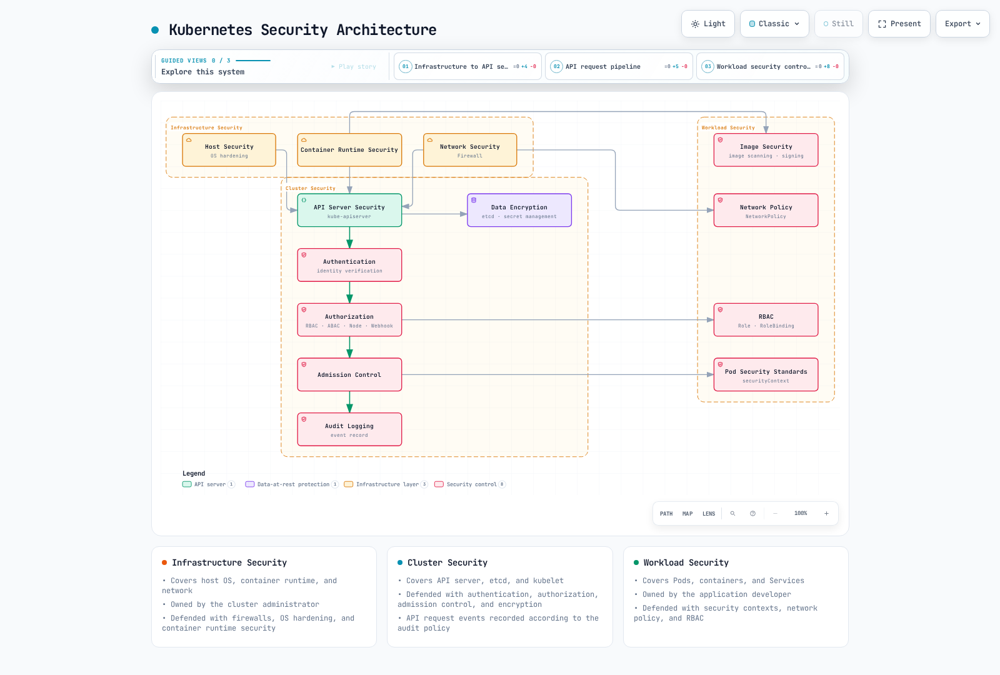
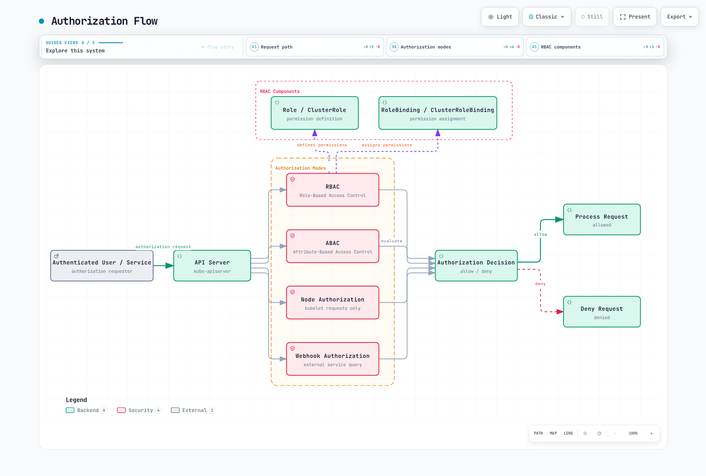
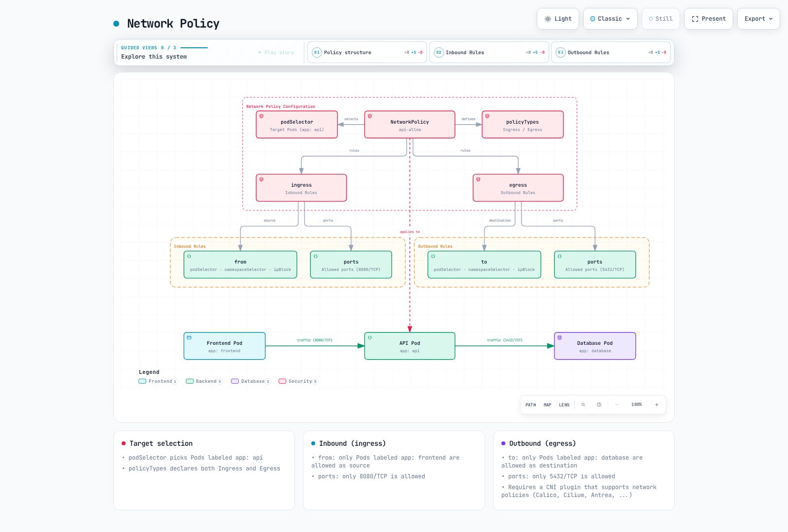

# Kubernetes 安全

> **支持的版本**: Kubernetes 1.32, 1.33, 1.34
> **最后更新**: February 23, 2026

在 Kubernetes 中，安全性是保护集群和应用程序的关键要素。本章将探讨 Kubernetes 安全概念、身份验证和授权机制、网络策略、安全上下文，以及如何增强 Amazon EKS 中的安全性。

## 实验环境设置

要跟随本文档中的示例操作，您需要以下工具和环境：

### 必需工具
- kubectl v1.34 或更高版本
- 可用的 Kubernetes 集群（EKS、minikube、kind 等）
- OpenSSL（用于创建证书）

### 安全示例设置

```bash
# Create namespace
kubectl create namespace security-demo

# Create service account
kubectl -n security-demo create serviceaccount demo-sa

# Create role
kubectl -n security-demo apply -f - <<EOF
apiVersion: rbac.authorization.k8s.io/v1
kind: Role
metadata:
  name: pod-reader
rules:
- apiGroups: [""]
  resources: ["pods"]
  verbs: ["get", "watch", "list"]
EOF

# Create role binding
kubectl -n security-demo apply -f - <<EOF
apiVersion: rbac.authorization.k8s.io/v1
kind: RoleBinding
metadata:
  name: read-pods
subjects:
- kind: ServiceAccount
  name: demo-sa
  namespace: security-demo
roleRef:
  kind: Role
  name: pod-reader
  apiGroup: rbac.authorization.k8s.io
EOF

# Create Pod with security context
kubectl -n security-demo apply -f - <<EOF
apiVersion: v1
kind: Pod
metadata:
  name: security-context-demo
spec:
  serviceAccountName: demo-sa
  securityContext:
    runAsUser: 1000
    runAsGroup: 3000
    fsGroup: 2000
  containers:
  - name: sec-ctx-demo
    image: busybox
    command: ["sh", "-c", "sleep 3600"]
    securityContext:
      allowPrivilegeEscalation: false
      readOnlyRootFilesystem: true
EOF
```

## Kubernetes 安全架构



[🔍 查看交互式图表](https://www.atomai.click/kubernetes-docs/archmaps/en-core-06-security-0.html)

## 目录
1. [安全概述](#security-overview)
2. [身份验证](#authentication)
3. [授权](#authorization)
4. [安全上下文](#security-context)
5. [网络策略](#network-policy)
6. [Secret 管理](#secret-management)
7. [镜像安全](#image-security)
8. [Pod Security Standards](#pod-security-standards)
9. [审计日志](#audit-logging)
10. [EKS 安全最佳实践](#eks-security-best-practices)

## 安全概述

> **核心概念**: Kubernetes 安全遵循纵深防御方法，在基础设施、集群和工作负载层面提供多重安全机制。

Kubernetes 安全包含以下主要领域：

### 安全领域比较

| 安全领域 | 主要组件 | 负责方 | 安全机制 |
|--------------|-----------------|-------------------|---------------------|
| **基础设施安全** | 主机 OS、Container Runtime、网络 | 集群管理员 | 防火墙、OS 加固、Container runtime 安全 |
| **集群安全** | API Server、etcd、kubelet | 集群管理员 | 身份验证、授权、准入控制、加密 |
| **工作负载安全** | Pods、Containers、Services | 应用程序开发者 | 安全上下文、网络策略、RBAC |

### 安全原则

1. **最小权限原则**: 仅授予必要的最小权限
2. **纵深防御**: 通过多层安全防护实现防御
3. **默认拒绝**: 拒绝所有未明确允许的内容
4. **安全加固**: 应用比默认值更严格的安全设置
5. **持续监控**: 检测并响应安全事件

## 身份验证

身份验证是验证用户或 Service Account 身份的过程。Kubernetes 支持多种身份验证方法：

### 身份验证方法

1. **X.509 Certificates**: 使用 TLS 客户端证书进行身份验证
2. **Service Account Tokens**: 使用 JWT token 进行 Service Account 身份验证
3. **OpenID Connect (OIDC)**: 通过外部身份提供商进行身份验证
4. **Webhook Token Authentication**: 通过外部身份验证服务进行身份验证
5. **Authentication Proxy**: 通过代理进行身份验证

### Service Account 示例

```yaml
apiVersion: v1
kind: ServiceAccount
metadata:
  name: my-service-account
  namespace: default
---
apiVersion: v1
kind: Secret
metadata:
  name: my-service-account-token
  annotations:
    kubernetes.io/service-account.name: my-service-account
type: kubernetes.io/service-account-token
```

## 身份验证

要访问 Kubernetes API server，必须经过身份验证过程。Kubernetes 支持多种身份验证方法：


[🔍 查看交互式图表](https://www.atomai.click/kubernetes-docs/archmaps/en-core-06-security-1.html)

### X.509 Certificates

Kubernetes 使用 TLS 证书对客户端进行身份验证。这主要用于集群内部通信和管理员身份验证。

```bash
# Example kubeconfig setup for certificate-based authentication
kubectl config set-credentials admin --client-certificate=admin.crt --client-key=admin.key
```

### Service Account Tokens

Service Account 是供运行在 Pods 中的进程与 API server 通信时使用的账户。每个 Service Account 都有一个自动生成的 token，并会自动挂载到 Pods。

```yaml
apiVersion: v1
kind: ServiceAccount
metadata:
  name: my-service-account
  namespace: default
```

```yaml
apiVersion: v1
kind: Pod
metadata:
  name: my-pod
spec:
  serviceAccountName: my-service-account
  containers:
  - name: my-container
    image: nginx:1.19
```

### OpenID Connect (OIDC)

支持通过外部身份提供商（例如 AWS IAM、Google、Azure AD）进行身份验证。这有助于在企业环境中实现单点登录（SSO）。

```bash
# Example kubeconfig setup using OIDC
kubectl config set-credentials oidc-user \
  --auth-provider=oidc \
  --auth-provider-arg=idp-issuer-url=https://accounts.google.com \
  --auth-provider-arg=client-id=<CLIENT_ID> \
  --auth-provider-arg=client-secret=<CLIENT_SECRET>
```

### Webhook Token Authentication

一种通过外部身份验证服务验证 token 的方法。API server 将 token 转发给外部服务，后者验证 token 并返回用户信息。

### Authentication Proxy

一种在 API server 前放置 Authentication Proxy 以处理用户身份验证的方法。该代理会在 HTTP headers 中包含经过身份验证的用户信息，并将其转发给 API server。

## 授权

如果身份验证是验证“您是谁”的过程，那么授权就是确定“您可以做什么”的过程。Kubernetes 支持多种授权模式：



[🔍 查看交互式图表](https://www.atomai.click/kubernetes-docs/archmaps/en-core-06-security-2.html)

### RBAC (Role-Based Access Control)

RBAC 是 Kubernetes 中使用最广泛的授权机制。通过 Roles 和 RoleBindings，您可以为用户或 Service Accounts 授予特定资源的特定权限。

#### Role 和 ClusterRole

Role 定义命名空间内的权限，而 ClusterRole 定义适用于整个集群的权限。

```yaml
# Namespace Role example
apiVersion: rbac.authorization.k8s.io/v1
kind: Role
metadata:
  namespace: default
  name: pod-reader
rules:
- apiGroups: [""]
  resources: ["pods"]
  verbs: ["get", "watch", "list"]
```

```yaml
# Cluster-wide ClusterRole example
apiVersion: rbac.authorization.k8s.io/v1
kind: ClusterRole
metadata:
  name: secret-reader
rules:
- apiGroups: [""]
  resources: ["secrets"]
  verbs: ["get", "watch", "list"]
```

#### RoleBinding 和 ClusterRoleBinding

RoleBinding 将 Role 或 ClusterRole 绑定到特定命名空间中的用户、组或 Service Accounts。ClusterRoleBinding 将 ClusterRole 绑定到整个集群中的用户、组或 Service Accounts。

```yaml
# RoleBinding example
apiVersion: rbac.authorization.k8s.io/v1
kind: RoleBinding
metadata:
  name: read-pods
  namespace: default
subjects:
- kind: User
  name: jane
  apiGroup: rbac.authorization.k8s.io
roleRef:
  kind: Role
  name: pod-reader
  apiGroup: rbac.authorization.k8s.io
```

```yaml
# ClusterRoleBinding example
apiVersion: rbac.authorization.k8s.io/v1
kind: ClusterRoleBinding
metadata:
  name: read-secrets-global
subjects:
- kind: Group
  name: manager
  apiGroup: rbac.authorization.k8s.io
roleRef:
  kind: ClusterRole
  name: secret-reader
  apiGroup: rbac.authorization.k8s.io
```

### ABAC (Attribute-Based Access Control)

ABAC 是一种基于用户属性、资源属性、环境属性等授予权限的方法。在 Kubernetes 中，策略通过 JSON 文件定义。尽管更加灵活，但由于管理复杂性，其使用频率低于 RBAC。

### Node 授权

Node 授权是一种供 kubelets 访问 API server 时使用的特殊授权模式。kubelets 只能访问与其运行所在节点相关的资源（Pods、节点状态等）。

### Webhook 授权

一种通过外部服务作出授权决策的方法。API server 将授权请求转发到外部服务，由该服务决定允许还是拒绝请求。

## 安全上下文

安全上下文定义 Pod 或 container 层面的安全设置。这可以对权限、访问控制、capabilities 等进行细粒度控制。


[🔍 查看交互式图表](https://www.atomai.click/kubernetes-docs/archmaps/en-core-06-security-3.html)

### Pod 安全上下文

```yaml
apiVersion: v1
kind: Pod
metadata:
  name: security-context-pod
spec:
  securityContext:
    runAsUser: 1000
    runAsGroup: 3000
    fsGroup: 2000
  containers:
  - name: security-context-container
    image: nginx:1.19
    securityContext:
      allowPrivilegeEscalation: false
      capabilities:
        drop:
        - ALL
      readOnlyRootFilesystem: true
```

在上面的示例中：
- `runAsUser`: container 进程运行时使用的用户 ID
- `runAsGroup`: container 进程运行时使用的组 ID
- `fsGroup`: 访问 volumes 时使用的组 ID
- `allowPrivilegeEscalation`: 进程是否可以获得高于其父进程的权限
- `capabilities`: 添加或移除 Linux kernel capabilities
- `readOnlyRootFilesystem`: 将 root filesystem 挂载为只读

### Pod Security Standards

从 Kubernetes 1.25 开始，Pod Security Policy 被 Pod Security Standards 取代。Pod Security Standards 定义了三个策略级别：

1. **Privileged**: 无限制，允许所有权限
2. **Baseline**: 阻止已知的权限提升路径
3. **Restricted**: 强化程度高的安全策略

```yaml
# Example applying Pod Security Standards to namespace
apiVersion: v1
kind: Namespace
metadata:
  name: my-namespace
  labels:
    pod-security.kubernetes.io/enforce: restricted
    pod-security.kubernetes.io/audit: restricted
    pod-security.kubernetes.io/warn: restricted
```

## 网络策略

网络策略提供了一种控制 Pods 之间通信的方式。默认情况下，Kubernetes 集群中的所有 Pods 都可以彼此通信，但可以使用网络策略加以限制。



[🔍 查看交互式图表](https://www.atomai.click/kubernetes-docs/archmaps/en-core-06-security-4.html)

```yaml
apiVersion: networking.k8s.io/v1
kind: NetworkPolicy
metadata:
  name: api-allow
  namespace: default
spec:
  podSelector:
    matchLabels:
      app: api
  policyTypes:
  - Ingress
  - Egress
  ingress:
  - from:
    - podSelector:
        matchLabels:
          app: frontend
    ports:
    - protocol: TCP
      port: 8080
  egress:
  - to:
    - podSelector:
        matchLabels:
          app: database
    ports:
    - protocol: TCP
      port: 5432
```

在上面的示例中：
- 为带有 `api` 标签的 Pods 定义网络策略
- 仅允许来自带有 `frontend` 标签的 Pods 的、指向端口 8080 的入站流量
- 仅允许到带有 `database` 标签的 Pods 的、指向端口 5432 的出站流量

要使用网络策略，集群的网络插件必须支持网络策略。Calico、Cilium 和 Antrea 等 CNI 插件支持网络策略。

## Secret 管理

Kubernetes Secrets 用于存储和管理密码、API keys 和证书等敏感信息。但是，默认情况下，secrets 仅采用 base64 编码，并未加密。因此，需要额外的安全措施。

### Secret 加密

要加密存储在 etcd 中的 secrets，需要配置 API server 的加密配置：

```yaml
apiVersion: apiserver.config.k8s.io/v1
kind: EncryptionConfiguration
resources:
  - resources:
      - secrets
    providers:
      - aescbc:
          keys:
            - name: key1
              secret: <base64-encoded-key>
      - identity: {}
```

### 外部 Secret 管理

为了更安全地管理 secrets，您可以使用外部 Secret 管理系统：

- HashiCorp Vault
- AWS Secrets Manager
- Azure Key Vault
- Google Secret Manager
- External Secrets Operator

## 镜像安全

Container 镜像安全是 Kubernetes 安全的重要组成部分。

### 镜像漏洞扫描

扫描 Container 镜像中的漏洞，以识别并解决已知安全问题：

- Trivy
- Clair
- Anchore
- AWS ECR Scan
- Docker Hub Scan

### 镜像签名和验证

通过镜像签名验证镜像的来源和完整性：

- Notary
- Cosign
- Portieris
- AWS Signer
- Connaisseur

### 镜像策略

通过镜像策略限制只能从受信任的 registries 拉取镜像：

```yaml
apiVersion: admission.k8s.io/v1
kind: AdmissionConfiguration
plugins:
- name: ImagePolicyWebhook
  configuration:
    imagePolicy:
      kubeConfigFile: /path/to/kubeconfig
      allowTTL: 50
      denyTTL: 50
      retryBackoff: 500
      defaultAllow: false
```

## 审计

Kubernetes 审计提供了一种记录和分析集群中发生事件的机制。

### 审计策略

审计策略定义要记录哪些事件：

```yaml
apiVersion: audit.k8s.io/v1
kind: Policy
rules:
- level: Metadata
  resources:
  - group: ""
    resources: ["pods"]
- level: Request
  resources:
  - group: ""
    resources: ["secrets"]
- level: None
  users: ["system:kube-proxy"]
  resources:
  - group: ""
    resources: ["endpoints", "services"]
```

审计级别：
- `None`: 不记录事件
- `Metadata`: 仅记录请求元数据（用户、时间、资源等）
- `Request`: 记录请求元数据和请求正文
- `RequestResponse`: 记录请求元数据、请求正文和响应正文

### 审计日志后端

审计日志可以存储在多种后端中：
- 文件
- Webhook
- 动态后端（例如 Elasticsearch、Loki）

## Amazon EKS 安全增强

除 Kubernetes 的基本安全功能外，Amazon EKS 还可通过与 AWS 安全服务集成来增强安全性。


[🔍 查看交互式图表](https://www.atomai.click/kubernetes-docs/archmaps/en-core-06-security-5.html)

### IAM Roles and Service Accounts (IRSA)

通过使用 IRSA（IAM Roles for Service Accounts），您可以将 IAM roles 与 Kubernetes Service Accounts 关联，以安全地访问 AWS services。

```bash
# Create OIDC provider
eksctl utils associate-iam-oidc-provider --cluster my-cluster --approve

# Create IAM role and associate with service account
eksctl create iamserviceaccount \
  --name my-service-account \
  --namespace default \
  --cluster my-cluster \
  --attach-policy-arn arn:aws:iam::aws:policy/AmazonS3ReadOnlyAccess \
  --approve
```

### 使用 AWS KMS 加密 Secret

您可以使用 AWS KMS 加密 EKS 集群中的 Kubernetes secrets。

```bash
# Create KMS key
aws kms create-key --description "EKS Secret Encryption Key"

# Specify KMS key when creating EKS cluster
eksctl create cluster --name my-cluster --encryption-provider-key-arn arn:aws:kms:region:account-id:key/key-id
```

### AWS Security Groups

将 AWS Security Groups 应用于 EKS 集群 nodes 和 Pods，以控制网络流量。

```bash
# Create security group
aws ec2 create-security-group --group-name eks-cluster-sg --description "EKS Cluster Security Group"

# Add inbound rule
aws ec2 authorize-security-group-ingress \
  --group-id sg-12345 \
  --protocol tcp \
  --port 443 \
  --cidr 10.0.0.0/16
```

### AWS WAF

将 AWS WAF（Web Application Firewall）置于 EKS 集群前方以保护 Web 应用程序。

```bash
# Create WAF Web ACL
aws wafv2 create-web-acl \
  --name eks-web-acl \
  --scope REGIONAL \
  --default-action Allow={} \
  --visibility-config SampledRequestsEnabled=true,CloudWatchMetricsEnabled=true,MetricName=eks-web-acl
```

### AWS GuardDuty

使用 AWS GuardDuty 检测并响应 EKS 集群中的安全威胁。

```bash
# Enable GuardDuty
aws guardduty create-detector --enable

# Enable EKS protection
aws guardduty update-detector \
  --detector-id 12abc34d567e8fa901bc2d34e56789f0 \
  --features '[{"Name": "EKS_RUNTIME_MONITORING", "Status": "ENABLED"}]'
```

## 安全最佳实践

以下是增强 Kubernetes 集群和工作负载安全性的最佳实践。

### 集群安全

1. **保持版本最新**: 保持 Kubernetes 和所有组件为最新版本，以修补已知漏洞。
2. **限制 API Server 访问**: 限制对 API server 的访问，仅在必要时允许公开访问。
3. **etcd 加密**: 加密存储在 etcd 中的数据以保护敏感信息。
4. **启用审计日志**: 启用审计日志以监控和分析集群活动。
5. **实施网络策略**: 实施网络策略以限制 Pod 到 Pod 的通信。

### 工作负载安全

1. **最小权限原则**: 仅向 Pods 和 containers 授予必要的最小权限。
2. **非 root 用户**: 以非 root 用户运行 containers。
3. **只读文件系统**: 尽可能将 container root filesystems 挂载为只读。
4. **资源限制**: 设置 CPU 和内存资源限制以防止 DoS 攻击。
5. **配置安全上下文**: 正确配置 Pod 和 container 的安全上下文。

### 镜像安全

1. **最小基础镜像**: 使用包含最少 packages 的基础镜像。
2. **镜像漏洞扫描**: 定期扫描 Container 镜像中的漏洞。
3. **镜像签名和验证**: 通过镜像签名验证镜像的来源和完整性。
4. **受信任的 Registries**: 仅从受信任的 registries 拉取镜像。
5. **使用最新镜像**: 定期更新镜像以修补已知漏洞。

### Secret 管理

1. **外部 Secret 管理**: 使用外部 Secret 管理系统安全地管理 secrets。
2. **Secret 加密**: 加密存储在 etcd 中的 secrets。
3. **Secret 轮换**: 定期轮换 secrets 以增强安全性。
4. **最小权限访问**: 限制仅必要的 Pods 访问 secrets。
5. **使用 Volumes 而非环境变量**: 通过 volumes 挂载 secrets，而非使用环境变量。

## 结论

Kubernetes 安全必须在多个层面实施，涵盖集群基础设施、Kubernetes 组件和应用程序工作负载等所有领域。除 Kubernetes 的身份验证、授权、网络策略和安全上下文等基本安全功能外，还可以通过镜像安全、Secret 管理和审计日志等额外安全措施增强集群和工作负载安全性。

使用 Amazon EKS 时，可以通过集成各种 AWS 安全服务进一步增强安全性。IAM Roles and Service Accounts (IRSA)、使用 AWS KMS 加密 Secret、AWS Security Groups、AWS WAF 和 AWS GuardDuty 等服务都可用于提升 EKS 集群安全性。

安全是一个持续的过程，因此通过定期安全评估和更新来维护集群与工作负载的安全态势非常重要。

## 测验

要测试您在本章中学到的知识，请尝试[安全测验](../quizzes/core/06-security-quiz.md)。

## 参考资料

- [Kubernetes 官方文档 - 安全](https://kubernetes.io/docs/concepts/security/)
- [Kubernetes 官方文档 - 身份验证](https://kubernetes.io/docs/reference/access-authn-authz/authentication/)
- [Kubernetes 官方文档 - 授权](https://kubernetes.io/docs/reference/access-authn-authz/authorization/)
- [Kubernetes 官方文档 - RBAC](https://kubernetes.io/docs/reference/access-authn-authz/rbac/)
- [Kubernetes 官方文档 - 网络策略](https://kubernetes.io/docs/concepts/services-networking/network-policies/)
- [Kubernetes 官方文档 - 安全上下文](https://kubernetes.io/docs/tasks/configure-pod-container/security-context/)
- [Kubernetes 官方文档 - Pod Security Standards](https://kubernetes.io/docs/concepts/security/pod-security-standards/)
- [Kubernetes 官方文档 - Secrets](https://kubernetes.io/docs/concepts/configuration/secret/)
- [Kubernetes 官方文档 - 审计](https://kubernetes.io/docs/tasks/debug-application-cluster/audit/)
- [Amazon EKS 官方文档 - 安全](https://docs.aws.amazon.com/eks/latest/userguide/security.html)
- [Amazon EKS 官方文档 - IAM Roles for Service Accounts](https://docs.aws.amazon.com/eks/latest/userguide/iam-roles-for-service-accounts.html)
- [Amazon EKS 官方文档 - Secret 加密](https://docs.aws.amazon.com/eks/latest/userguide/enable-kms.html)
- [AWS Security Blog - EKS 安全最佳实践](https://aws.amazon.com/blogs/containers/amazon-eks-security-best-practices/)
