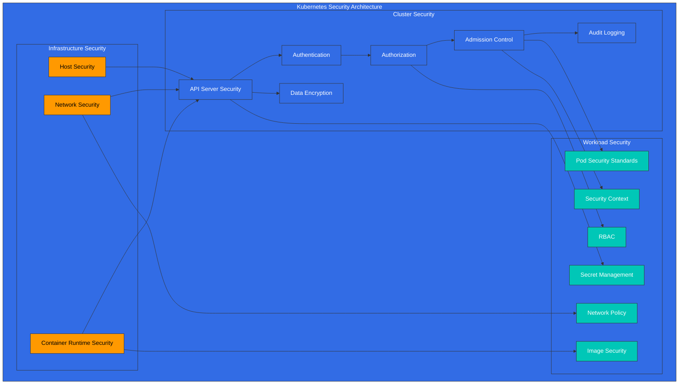
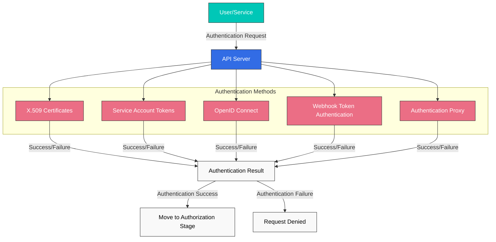
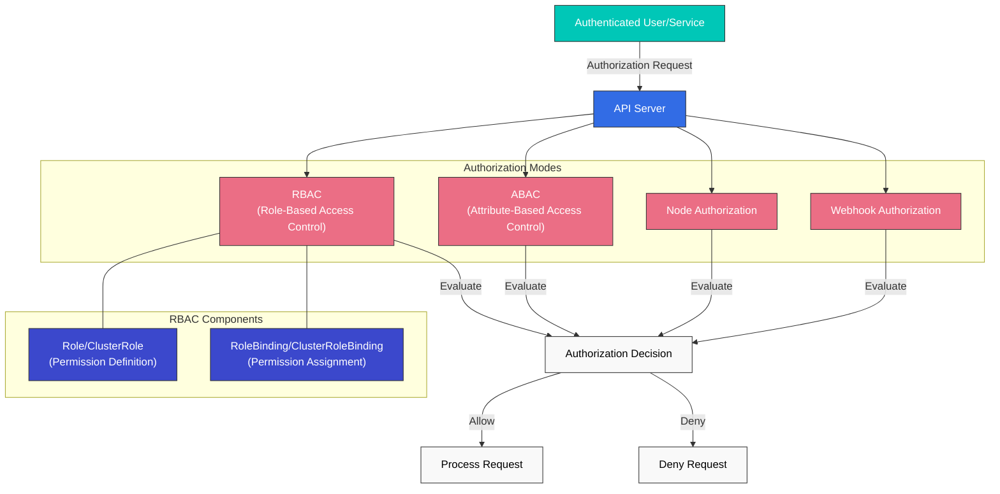
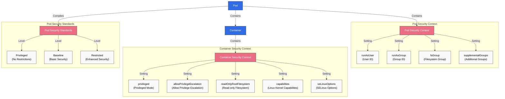
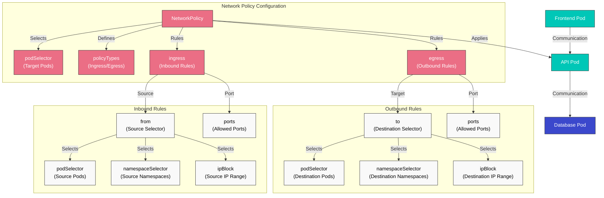
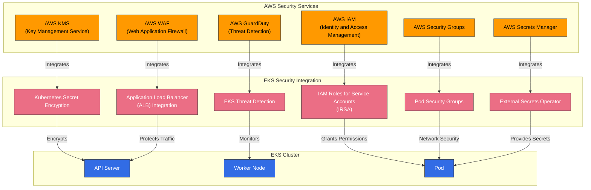

# Kubernetes 安全

> **支持的版本**: Kubernetes 1.32, 1.33, 1.34
> **最后更新**: February 23, 2026

在 Kubernetes 中，安全是保护 cluster 和 applications 的关键要素。在本章中，我们将探讨 Kubernetes 安全概念、身份认证和授权机制、network policies、security contexts，以及如何在 Amazon EKS 中增强安全性。

## 实验环境设置

要跟随本文档中的示例进行操作，你需要以下工具和环境：

### 必需工具
- kubectl v1.34 或更高版本
- 可用的 Kubernetes cluster（EKS、minikube、kind 等）
- OpenSSL（用于创建证书）

### 安全示例设置

```bash
# Create namespace
kubectl create namespace security-demo

# Create service account
kubectl -n security-demo create serviceaccount demo-sa

# Create role
kubectl -n security-demo apply -f - <<EOF
apiVersion: rbac.authorization.k8s.io/v1
kind: Role
metadata:
  name: pod-reader
rules:
- apiGroups: [""]
  resources: ["pods"]
  verbs: ["get", "watch", "list"]
EOF

# Create role binding
kubectl -n security-demo apply -f - <<EOF
apiVersion: rbac.authorization.k8s.io/v1
kind: RoleBinding
metadata:
  name: read-pods
subjects:
- kind: ServiceAccount
  name: demo-sa
  namespace: security-demo
roleRef:
  kind: Role
  name: pod-reader
  apiGroup: rbac.authorization.k8s.io
EOF

# Create Pod with security context
kubectl -n security-demo apply -f - <<EOF
apiVersion: v1
kind: Pod
metadata:
  name: security-context-demo
spec:
  serviceAccountName: demo-sa
  securityContext:
    runAsUser: 1000
    runAsGroup: 3000
    fsGroup: 2000
  containers:
  - name: sec-ctx-demo
    image: busybox
    command: ["sh", "-c", "sleep 3600"]
    securityContext:
      allowPrivilegeEscalation: false
      readOnlyRootFilesystem: true
EOF
```

## Kubernetes 安全架构



## 目录
1. [安全概览](#security-overview)
2. [身份认证](#authentication)
3. [授权](#authorization)
4. [Security Context](#security-context)
5. [Network Policy](#network-policy)
6. [Secret 管理](#secret-management)
7. [Image 安全](#image-security)
8. [Pod Security Standards](#pod-security-standards)
9. [Audit Logging](#audit-logging)
10. [EKS 安全最佳实践](#eks-security-best-practices)

## 安全概览

> **核心概念**: Kubernetes 安全遵循纵深防御方法，在基础设施、cluster 和 workload 层级提供多种安全机制。

Kubernetes 安全由以下主要领域组成：

### 安全领域对比

| 安全领域 | 主要组件 | 责任方 | 安全机制 |
|--------------|-----------------|-------------------|---------------------|
| **Infrastructure Security** | Host OS、Container Runtime、Network | Cluster Administrator | Firewall、OS hardening、Container runtime security |
| **Cluster Security** | API Server、etcd、kubelet | Cluster Administrator | Authentication、Authorization、Admission Control、Encryption |
| **Workload Security** | Pods、Containers、Services | Application Developer | Security Context、Network Policy、RBAC |

### 安全原则

1. **最小权限原则**: 仅授予所需的最低权限
2. **纵深防御**: 通过多个安全层进行防御
3. **默认拒绝**: 拒绝所有未明确允许的内容
4. **安全加固**: 应用比默认值更强的安全设置
5. **持续监控**: 检测并响应安全事件

## 身份认证

身份认证是验证用户或 service account 身份的过程。Kubernetes 支持多种身份认证方法：

### 身份认证方法

1. **X.509 Certificates**: 使用 TLS client certificates 进行身份认证
2. **Service Account Tokens**: 使用 JWT tokens 进行 service account 身份认证
3. **OpenID Connect (OIDC)**: 通过外部 identity providers 进行身份认证
4. **Webhook Token Authentication**: 通过外部 authentication services 进行身份认证
5. **Authentication Proxy**: 通过 proxy 进行身份认证

### Service Account 示例

```yaml
apiVersion: v1
kind: ServiceAccount
metadata:
  name: my-service-account
  namespace: default
---
apiVersion: v1
kind: Secret
metadata:
  name: my-service-account-token
  annotations:
    kubernetes.io/service-account.name: my-service-account
type: kubernetes.io/service-account-token
```

## 身份认证

要访问 Kubernetes API server，必须经过身份认证过程。Kubernetes 支持多种身份认证方法：



### X.509 Certificates

Kubernetes 使用 TLS certificates 对 clients 进行身份认证。这主要用于 cluster 内部通信和 administrator 身份认证。

```bash
# Example kubeconfig setup for certificate-based authentication
kubectl config set-credentials admin --client-certificate=admin.crt --client-key=admin.key
```

### Service Account Tokens

Service accounts 是 Pods 中运行的 processes 用来与 API server 通信的 accounts。每个 service account 都有一个自动生成的 token，并且会自动挂载到 Pods。

```yaml
apiVersion: v1
kind: ServiceAccount
metadata:
  name: my-service-account
  namespace: default
```

```yaml
apiVersion: v1
kind: Pod
metadata:
  name: my-pod
spec:
  serviceAccountName: my-service-account
  containers:
  - name: my-container
    image: nginx:1.19
```

### OpenID Connect (OIDC)

支持通过外部 identity providers（例如 AWS IAM、Google、Azure AD）进行身份认证。这有助于在企业环境中实现 Single Sign-On (SSO)。

```bash
# Example kubeconfig setup using OIDC
kubectl config set-credentials oidc-user \
  --auth-provider=oidc \
  --auth-provider-arg=idp-issuer-url=https://accounts.google.com \
  --auth-provider-arg=client-id=<CLIENT_ID> \
  --auth-provider-arg=client-secret=<CLIENT_SECRET>
```

### Webhook Token Authentication

这是一种通过外部 authentication service 验证 tokens 的方法。API server 将 tokens 转发给外部 service，该 service 验证 token 并返回用户信息。

### Authentication Proxy

这是一种在 API server 前放置 authentication proxy 来处理用户身份认证的方法。proxy 会在 HTTP headers 中包含已认证的用户信息，并将它们转发给 API server。

## 授权

如果说身份认证是验证“你是谁”的过程，那么授权就是确定“你能做什么”的过程。Kubernetes 支持多种授权模式：



### RBAC (Role-Based Access Control)

RBAC 是 Kubernetes 中使用最广泛的授权机制。通过 Roles 和 RoleBindings，你可以为用户或 service accounts 授予对特定 resources 的特定权限。

#### Role 和 ClusterRole

Roles 定义 namespace 内的权限，ClusterRoles 定义适用于整个 cluster 的权限。

```yaml
# Namespace Role example
apiVersion: rbac.authorization.k8s.io/v1
kind: Role
metadata:
  namespace: default
  name: pod-reader
rules:
- apiGroups: [""]
  resources: ["pods"]
  verbs: ["get", "watch", "list"]
```

```yaml
# Cluster-wide ClusterRole example
apiVersion: rbac.authorization.k8s.io/v1
kind: ClusterRole
metadata:
  name: secret-reader
rules:
- apiGroups: [""]
  resources: ["secrets"]
  verbs: ["get", "watch", "list"]
```

#### RoleBinding 和 ClusterRoleBinding

RoleBinding 将 Role 或 ClusterRole 绑定到特定 namespace 中的 users、groups 或 service accounts。ClusterRoleBinding 将 ClusterRole 绑定到整个 cluster 范围内的 users、groups 或 service accounts。

```yaml
# RoleBinding example
apiVersion: rbac.authorization.k8s.io/v1
kind: RoleBinding
metadata:
  name: read-pods
  namespace: default
subjects:
- kind: User
  name: jane
  apiGroup: rbac.authorization.k8s.io
roleRef:
  kind: Role
  name: pod-reader
  apiGroup: rbac.authorization.k8s.io
```

```yaml
# ClusterRoleBinding example
apiVersion: rbac.authorization.k8s.io/v1
kind: ClusterRoleBinding
metadata:
  name: read-secrets-global
subjects:
- kind: Group
  name: manager
  apiGroup: rbac.authorization.k8s.io
roleRef:
  kind: ClusterRole
  name: secret-reader
  apiGroup: rbac.authorization.k8s.io
```

### ABAC (Attribute-Based Access Control)

ABAC 是一种基于用户属性、resource 属性、环境属性等授予权限的方法。在 Kubernetes 中，policies 通过 JSON files 定义。尽管它更灵活，但由于管理复杂度较高，因此不如 RBAC 常用。

### Node Authorization

Node authorization 是 kubelets 访问 API server 时使用的一种特殊授权模式。Kubelets 只能访问与其运行所在 nodes 相关的 resources（Pods、node status 等）。

### Webhook Authorization

这是一种通过外部 service 做出授权决策的方法。API server 将授权请求转发给外部 service，该 service 决定是允许还是拒绝该请求。

## Security Context

Security context 定义 Pod 或 container 级别的安全设置。这样可以对权限、访问控制、capabilities 等进行细粒度控制。



### Pod Security Context

```yaml
apiVersion: v1
kind: Pod
metadata:
  name: security-context-pod
spec:
  securityContext:
    runAsUser: 1000
    runAsGroup: 3000
    fsGroup: 2000
  containers:
  - name: security-context-container
    image: nginx:1.19
    securityContext:
      allowPrivilegeEscalation: false
      capabilities:
        drop:
        - ALL
      readOnlyRootFilesystem: true
```

在上面的示例中：
- `runAsUser`: container process 运行时使用的 User ID
- `runAsGroup`: container process 运行时使用的 Group ID
- `fsGroup`: 访问 volumes 时使用的 Group ID
- `allowPrivilegeEscalation`: process 是否可以获得比其 parent process 更多的权限
- `capabilities`: 添加或移除 Linux kernel capabilities
- `readOnlyRootFilesystem`: 将 root filesystem 挂载为只读

### Pod Security Standards

从 Kubernetes 1.25 开始，Pod Security Policy 被 Pod Security Standards 取代。Pod Security Standards 定义了三个 policy levels：

1. **Privileged**: 无限制，允许所有权限
2. **Baseline**: 阻止已知的 privilege escalation 路径
3. **Restricted**: 强化程度较高的 security policy

```yaml
# Example applying Pod Security Standards to namespace
apiVersion: v1
kind: Namespace
metadata:
  name: my-namespace
  labels:
    pod-security.kubernetes.io/enforce: restricted
    pod-security.kubernetes.io/audit: restricted
    pod-security.kubernetes.io/warn: restricted
```

## Network Policy

Network policies 提供了一种控制 Pods 之间通信的方式。默认情况下，Kubernetes cluster 中的所有 Pods 都可以相互通信，但可以使用 network policies 对其进行限制。



```yaml
apiVersion: networking.k8s.io/v1
kind: NetworkPolicy
metadata:
  name: api-allow
  namespace: default
spec:
  podSelector:
    matchLabels:
      app: api
  policyTypes:
  - Ingress
  - Egress
  ingress:
  - from:
    - podSelector:
        matchLabels:
          app: frontend
    ports:
    - protocol: TCP
      port: 8080
  egress:
  - to:
    - podSelector:
        matchLabels:
          app: database
    ports:
    - protocol: TCP
      port: 5432
```

在上面的示例中：
- 为带有 `api` label 的 Pods 定义 network policy
- 仅允许来自带有 `frontend` label 的 Pods 到端口 8080 的 inbound traffic
- 仅允许到带有 `database` label 的 Pods 上端口 5432 的 outbound traffic

要使用 network policies，cluster 的 network plugin 必须支持 network policies。Calico、Cilium 和 Antrea 等 CNI plugins 支持 network policies。

## Secret 管理

Kubernetes Secrets 用于存储和管理敏感信息，例如密码、API keys 和 certificates。不过，默认情况下，secrets 只是经过 base64 编码，并未加密。因此，需要额外的安全措施。

### Secret 加密

要加密存储在 etcd 中的 secrets，需要配置 API server 的 encryption configuration：

```yaml
apiVersion: apiserver.config.k8s.io/v1
kind: EncryptionConfiguration
resources:
  - resources:
      - secrets
    providers:
      - aescbc:
          keys:
            - name: key1
              secret: <base64-encoded-key>
      - identity: {}
```

### 外部 Secret 管理

为了实现更安全的 secret 管理，可以使用外部 secret management systems：

- HashiCorp Vault
- AWS Secrets Manager
- Azure Key Vault
- Google Secret Manager
- External Secrets Operator

## Image 安全

Container image 安全是 Kubernetes 安全的重要组成部分。

### Image 漏洞扫描

扫描 container images 中的漏洞，以识别并解决已知安全问题：

- Trivy
- Clair
- Anchore
- AWS ECR Scan
- Docker Hub Scan

### Image 签名和验证

通过 image signing 验证 images 的来源和完整性：

- Notary
- Cosign
- Portieris
- AWS Signer
- Connaisseur

### Image Policies

通过 image policies 限制只能从受信任的 registries 拉取 images：

```yaml
apiVersion: admission.k8s.io/v1
kind: AdmissionConfiguration
plugins:
- name: ImagePolicyWebhook
  configuration:
    imagePolicy:
      kubeConfigFile: /path/to/kubeconfig
      allowTTL: 50
      denyTTL: 50
      retryBackoff: 500
      defaultAllow: false
```

## Audit

Kubernetes auditing 提供了一种记录和分析 cluster 中发生事件的机制。

### Audit Policy

Audit policies 定义要记录哪些事件：

```yaml
apiVersion: audit.k8s.io/v1
kind: Policy
rules:
- level: Metadata
  resources:
  - group: ""
    resources: ["pods"]
- level: Request
  resources:
  - group: ""
    resources: ["secrets"]
- level: None
  users: ["system:kube-proxy"]
  resources:
  - group: ""
    resources: ["endpoints", "services"]
```

Audit levels：
- `None`: 不记录事件
- `Metadata`: 仅记录 request metadata（用户、时间、resource 等）
- `Request`: 记录 request metadata 和 request body
- `RequestResponse`: 记录 request metadata、request body 和 response body

### Audit Log Backends

Audit logs 可以存储在多种 backends 中：
- File
- Webhook
- Dynamic backends（例如 Elasticsearch、Loki）

## Amazon EKS 安全增强

除了 Kubernetes 的基础安全功能之外，Amazon EKS 还可以通过与 AWS security services 集成来增强安全性。



### IAM Roles and Service Accounts (IRSA)

使用 IRSA (IAM Roles for Service Accounts)，你可以将 IAM roles 与 Kubernetes service accounts 关联，以安全地访问 AWS services。

```bash
# Create OIDC provider
eksctl utils associate-iam-oidc-provider --cluster my-cluster --approve

# Create IAM role and associate with service account
eksctl create iamserviceaccount \
  --name my-service-account \
  --namespace default \
  --cluster my-cluster \
  --attach-policy-arn arn:aws:iam::aws:policy/AmazonS3ReadOnlyAccess \
  --approve
```

### 使用 AWS KMS 进行 Secret 加密

你可以使用 AWS KMS 加密 EKS cluster 中的 Kubernetes secrets。

```bash
# Create KMS key
aws kms create-key --description "EKS Secret Encryption Key"

# Specify KMS key when creating EKS cluster
eksctl create cluster --name my-cluster --encryption-provider-key-arn arn:aws:kms:region:account-id:key/key-id
```

### AWS Security Groups

将 AWS security groups 应用于 EKS cluster nodes 和 Pods，以控制 network traffic。

```bash
# Create security group
aws ec2 create-security-group --group-name eks-cluster-sg --description "EKS Cluster Security Group"

# Add inbound rule
aws ec2 authorize-security-group-ingress \
  --group-id sg-12345 \
  --protocol tcp \
  --port 443 \
  --cidr 10.0.0.0/16
```

### AWS WAF

将 AWS WAF (Web Application Firewall) 放置在 EKS clusters 前面，以保护 web applications。

```bash
# Create WAF Web ACL
aws wafv2 create-web-acl \
  --name eks-web-acl \
  --scope REGIONAL \
  --default-action Allow={} \
  --visibility-config SampledRequestsEnabled=true,CloudWatchMetricsEnabled=true,MetricName=eks-web-acl
```

### AWS GuardDuty

使用 AWS GuardDuty 检测并响应 EKS clusters 中的安全威胁。

```bash
# Enable GuardDuty
aws guardduty create-detector --enable

# Enable EKS protection
aws guardduty update-detector \
  --detector-id 12abc34d567e8fa901bc2d34e56789f0 \
  --features '[{"Name": "EKS_RUNTIME_MONITORING", "Status": "ENABLED"}]'
```

## 安全最佳实践

以下是增强 Kubernetes clusters 和 workloads 安全性的最佳实践。

### Cluster 安全

1. **保持版本最新**: 保持 Kubernetes 和所有 components 为最新版本，以修补已知漏洞。
2. **限制 API Server 访问**: 限制对 API server 的访问，仅在必要时允许 public access。
3. **etcd 加密**: 加密存储在 etcd 中的数据，以保护敏感信息。
4. **启用 Audit Logging**: 启用 audit logging 来监控和分析 cluster 活动。
5. **实施 Network Policies**: 实施 network policies 以限制 Pod 到 Pod 的通信。

### Workload 安全

1. **最小权限原则**: 仅向 Pods 和 containers 授予所需的最低权限。
2. **非 root 用户**: 以非 root 用户运行 containers。
3. **只读 Filesystem**: 尽可能将 container root filesystems 挂载为只读。
4. **Resource Limits**: 设置 CPU 和 memory resource limits，以防止 DoS attacks。
5. **配置 Security Context**: 正确配置 Pod 和 container security contexts。

### Image 安全

1. **最小 Base Images**: 使用包含最少 packages 的 base images。
2. **Image 漏洞扫描**: 定期扫描 container images 中的漏洞。
3. **Image 签名和验证**: 通过 image signing 验证 images 的来源和完整性。
4. **受信任的 Registries**: 仅从受信任的 registries 拉取 images。
5. **使用最新 Images**: 定期更新 images，以修补已知漏洞。

### Secret 管理

1. **外部 Secret 管理**: 使用外部 secret management systems 安全地管理 secrets。
2. **Secret 加密**: 加密存储在 etcd 中的 secrets。
3. **Secret Rotation**: 定期轮换 secrets 以增强安全性。
4. **最小权限访问**: 将 secrets 的访问限制为仅必要的 Pods。
5. **使用 Volumes 而不是 Environment Variables**: 通过 volumes 挂载 secrets，而不是使用 environment variables。

## 结论

Kubernetes 安全必须在多个层面实施，在 cluster infrastructure、Kubernetes components 和 application workloads 等所有领域都考虑安全性。除了 Kubernetes 的基础安全功能（如身份认证、授权、network policies 和 security contexts）之外，还可以通过 image security、secret management 和 audit logging 等额外安全措施来增强 cluster 和 workload 安全性。

使用 Amazon EKS 时，可以通过与各种 AWS security services 集成进一步增强安全性。IAM Roles and Service Accounts (IRSA)、使用 AWS KMS 的 secret encryption、AWS Security Groups、AWS WAF 和 AWS GuardDuty 等 services 可用于提升 EKS cluster 安全性。

安全是一个持续过程，因此通过定期安全评估和更新来维护 clusters 和 workloads 的安全态势非常重要。

## 测验

要测试你在本章中学到的内容，请尝试完成 [安全测验](../quizzes/core/06-security-quiz.md)。

## 参考资料

- [Kubernetes 官方文档 - Security](https://kubernetes.io/docs/concepts/security/)
- [Kubernetes 官方文档 - Authentication](https://kubernetes.io/docs/reference/access-authn-authz/authentication/)
- [Kubernetes 官方文档 - Authorization](https://kubernetes.io/docs/reference/access-authn-authz/authorization/)
- [Kubernetes 官方文档 - RBAC](https://kubernetes.io/docs/reference/access-authn-authz/rbac/)
- [Kubernetes 官方文档 - Network Policies](https://kubernetes.io/docs/concepts/services-networking/network-policies/)
- [Kubernetes 官方文档 - Security Context](https://kubernetes.io/docs/tasks/configure-pod-container/security-context/)
- [Kubernetes 官方文档 - Pod Security Standards](https://kubernetes.io/docs/concepts/security/pod-security-standards/)
- [Kubernetes 官方文档 - Secrets](https://kubernetes.io/docs/concepts/configuration/secret/)
- [Kubernetes 官方文档 - Audit](https://kubernetes.io/docs/tasks/debug-application-cluster/audit/)
- [Amazon EKS 官方文档 - Security](https://docs.aws.amazon.com/eks/latest/userguide/security.html)
- [Amazon EKS 官方文档 - IAM Roles for Service Accounts](https://docs.aws.amazon.com/eks/latest/userguide/iam-roles-for-service-accounts.html)
- [Amazon EKS 官方文档 - Secret Encryption](https://docs.aws.amazon.com/eks/latest/userguide/enable-kms.html)
- [AWS Security Blog - EKS Security Best Practices](https://aws.amazon.com/blogs/containers/amazon-eks-security-best-practices/)
