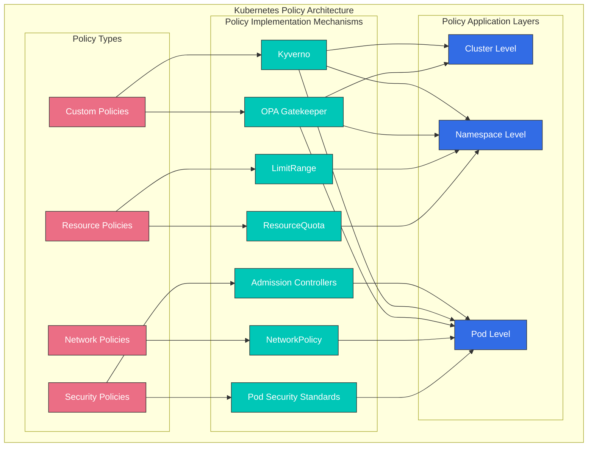
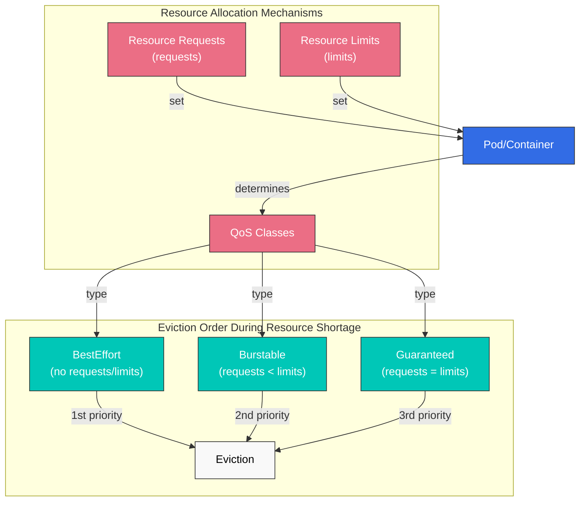
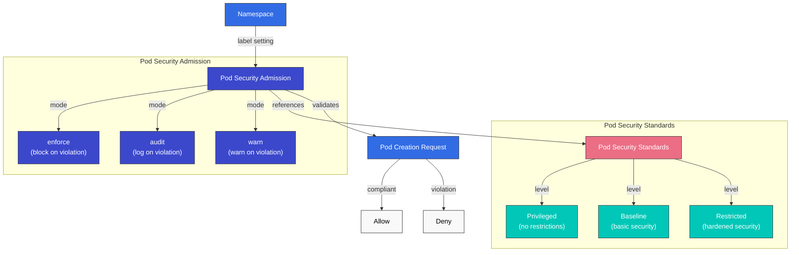
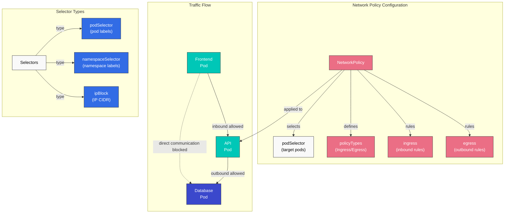
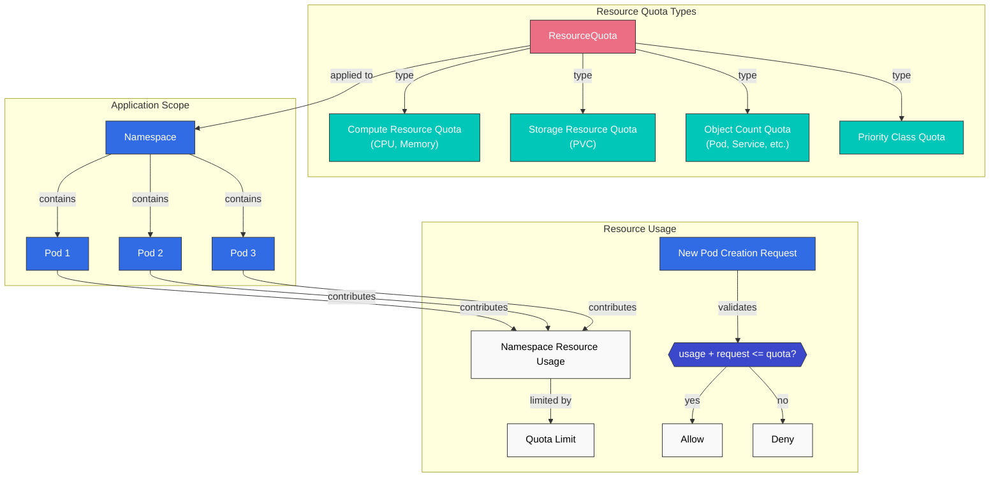
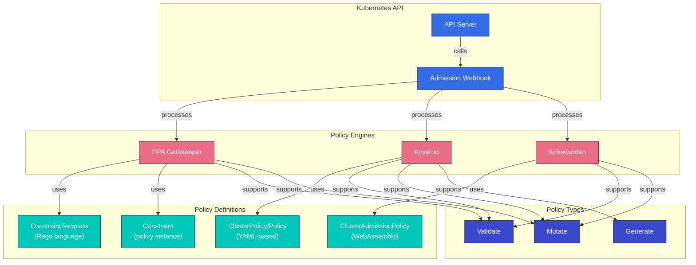
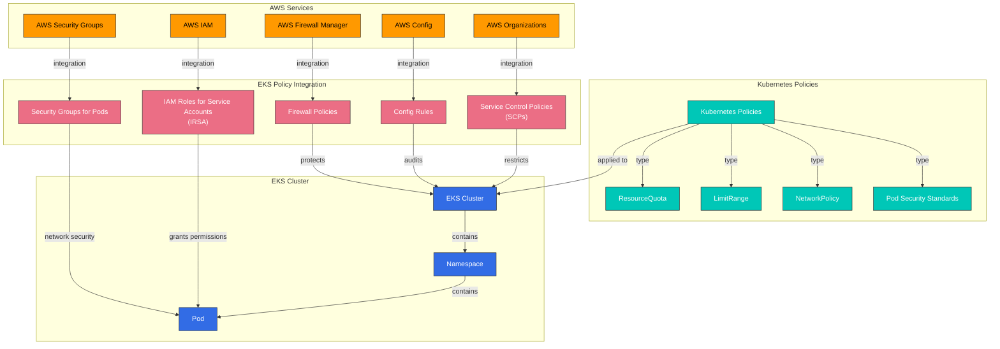

# Kubernetes 策略

> **支持的版本**: Kubernetes 1.32 - 1.34
> **最后更新**: February 22, 2026

在 Kubernetes 中，策略是一组用于控制和规范 cluster 与 workload 行为的规则。通过策略，你可以管理安全性、resource 使用量和网络通信等各个方面。本章将学习 Kubernetes 中不同类型的策略、如何实现这些策略，以及 Amazon EKS 中的策略管理。

## 实验环境设置

要跟随本文档中的示例进行操作，你需要以下工具和环境：

### 必需工具
- kubectl v1.34 或更高版本
- 可用的 Kubernetes cluster（EKS、minikube、kind 等）
- Kyverno CLI（可选）
- OPA Gatekeeper（可选）

### 策略示例设置

```bash
# Create namespace
kubectl create namespace policy-demo

# Create resource quota
kubectl -n policy-demo apply -f - <<EOF
apiVersion: v1
kind: ResourceQuota
metadata:
  name: demo-quota
spec:
  hard:
    requests.cpu: "1"
    requests.memory: 1Gi
    limits.cpu: "2"
    limits.memory: 2Gi
    pods: "10"
EOF

# Create network policy
kubectl -n policy-demo apply -f - <<EOF
apiVersion: networking.k8s.io/v1
kind: NetworkPolicy
metadata:
  name: default-deny
spec:
  podSelector: {}
  policyTypes:
  - Ingress
  - Egress
EOF

# Verify policies
kubectl -n policy-demo get resourcequota,networkpolicy
```

## Kubernetes 策略架构



## 策略类型对比

| 策略类型 | 实现机制 | 应用级别 | 主要目的 | Kubernetes 版本支持 |
|------------|--------------------------|-------------------|-----------------|---------------------------|
| **Resource Policies** | ResourceQuota, LimitRange | Namespace | Resource 使用限制与管理 | 所有版本 |
| **Security Policies** | Pod Security Standards, PodSecurityPolicy(deprecated) | Pod, Namespace | Security context 限制 | PSP: ~1.24, PSS: 1.22+ |
| **Network Policies** | NetworkPolicy | Pod | Network traffic 控制 | 1.8+ |
| **Custom Policies** | OPA Gatekeeper, Kyverno | Cluster, Namespace, Pod | 用户定义的策略强制执行 | 所有版本（add-ons） |

## Resource Policies

Resource policies 是用于限制和管理 Kubernetes cluster 内计算资源（CPU、memory 等）以及 object 数量（pods、services 等）的机制。

### ResourceQuota

ResourceQuota 限制 namespace 内可以使用的资源总量。

```yaml
apiVersion: v1
kind: ResourceQuota
metadata:
  name: compute-resources
  namespace: dev
spec:
  hard:
    requests.cpu: "1"
    requests.memory: 1Gi
    limits.cpu: "2"
    limits.memory: 2Gi
    pods: "10"
    services: "5"
    persistentvolumeclaims: "5"
    secrets: "10"
    configmaps: "10"
```

### LimitRange

LimitRange 为 namespace 内的单个 containers 或 pods 设置默认 resource limits 和 requests。

```yaml
apiVersion: v1
kind: LimitRange
metadata:
  name: limit-mem-cpu-per-container
  namespace: dev
spec:
  limits:
  - default:
      cpu: 500m
      memory: 512Mi
    defaultRequest:
      cpu: 100m
      memory: 256Mi
    max:
      cpu: "1"
      memory: 1Gi
    min:
      cpu: 50m
      memory: 128Mi
    type: Container
```

## 目录
1. [策略概述](#policy-overview)
2. [Resource 分配策略](#resource-allocation-policies)
3. [Pod Security Policies](#pod-security-policies)
4. [Network Policies](#network-policies)
5. [Resource Quotas](#resource-quotas)
6. [LimitRange](#limitrange)
7. [Policy Engines](#policy-engines)
8. [Amazon EKS 中的策略管理](#policy-management-in-amazon-eks)
9. [策略最佳实践](#policy-best-practices)
10. [结论](#conclusion)

## 策略概述

Kubernetes 策略为 cluster 管理员提供了一种方式，用于定义 cluster 内 resources 和 workloads 的约束。策略用于以下目的：

1. **安全增强**：防止未经授权的操作，并应用安全最佳实践
2. **Resource 管理**：限制 resource 使用量并确保公平的 resource 分配
3. **合规性**：确保符合组织策略和法规要求
4. **标准化**：应用一致的配置和 deployment 实践

Kubernetes 可以通过内置 resources（例如 NetworkPolicy、ResourceQuota、LimitRange）或第三方 policy engines（例如 OPA Gatekeeper、Kyverno）实现多种类型的策略。

## Resource 分配策略

Resource 分配策略控制 pods 和 containers 可以使用的 CPU、memory 等资源量。



### Resource Requests 和 Limits

你可以通过为 pods 和 containers 设置 resource requests 和 limits 来管理 resource 使用量：

```yaml
apiVersion: v1
kind: Pod
metadata:
  name: resource-demo
spec:
  containers:
  - name: resource-demo-container
    image: nginx
    resources:
      requests:
        memory: "64Mi"
        cpu: "250m"
      limits:
        memory: "128Mi"
        cpu: "500m"
```

- **requests**：为 container 保证的最小 resource 数量
- **limits**：container 可以使用的最大 resource 数量

设置 resource requests 和 limits 可以带来以下好处：

1. **Resource 保证**：Pods 可以获得它们所需的最小 resources 保证
2. **Resource 隔离**：防止一个 pod 独占另一个 pod 的 resources
3. **高效调度**：scheduler 在放置 pods 时会考虑 node resource 容量

### QoS (Quality of Service) Classes

Kubernetes 会根据 pod resource request 和 limit 设置自动分配 QoS classes：

1. **Guaranteed**：所有 containers 都设置了 resource requests 和 limits，且 requests 等于 limits
2. **Burstable**：至少一个 container 设置了 resource requests，但不满足 Guaranteed 条件
3. **BestEffort**：没有 containers 设置 resource requests 和 limits

QoS classes 决定 resource 短缺时的 pod 驱逐顺序：
1. BestEffort pods 首先被驱逐
2. Burstable pods 接着被驱逐
3. Guaranteed pods 最后被驱逐

## Pod Security Policies

Pod Security Policy (PSP) 从 Kubernetes 1.21 开始被弃用，并在 1.25 版本中完全移除。取而代之的是引入了 Pod Security Standards 和 Pod Security Admission。



### Pod Security Standards

Pod Security Standards 定义了三个策略级别：

1. **Privileged**：无限制，允许所有权限
2. **Baseline**：阻止已知的 privilege escalation 路径
3. **Restricted**：强强化的安全策略

### Pod Security Admission

Pod Security Admission 通过 namespace labels 应用 Pod Security Standards：

```yaml
apiVersion: v1
kind: Namespace
metadata:
  name: my-namespace
  labels:
    pod-security.kubernetes.io/enforce: restricted
    pod-security.kubernetes.io/audit: restricted
    pod-security.kubernetes.io/warn: restricted
```

每个 label 的含义：
- **enforce**：阻止违反策略的 pod 创建
- **audit**：在 audit logs 中记录违规
- **warn**：针对违规显示 warning messages

## Network Policies

Network Policy 提供了一种控制 pods 之间通信的方式。默认情况下，Kubernetes cluster 中的所有 pods 都可以相互通信，但 network policies 可以对此进行限制。



```yaml
apiVersion: networking.k8s.io/v1
kind: NetworkPolicy
metadata:
  name: api-allow
  namespace: default
spec:
  podSelector:
    matchLabels:
      app: api
  policyTypes:
  - Ingress
  - Egress
  ingress:
  - from:
    - podSelector:
        matchLabels:
          app: frontend
    ports:
    - protocol: TCP
      port: 8080
  egress:
  - to:
    - podSelector:
        matchLabels:
          app: database
    ports:
    - protocol: TCP
      port: 5432
```

在上面的示例中：
- 为带有 `api` label 的 pods 定义 network policy
- 仅允许来自带有 `frontend` label 的 pods 在 8080 端口上的入站 traffic
- 仅允许到带有 `database` label 的 pods 在 5432 端口上的出站 traffic

要使用 network policies，cluster 的 network plugin 必须支持 network policies。Calico、Cilium 和 Antrea 等 CNI plugins 支持 network policies。

### Network Policy 类型

1. **Ingress Policy**：控制进入 pod 的 traffic
2. **Egress Policy**：控制离开 pod 的 traffic
3. **Ingress and Egress Policy**：控制两个方向的 traffic

### Network Policy Selectors

Network policies 可以通过多种 selectors 过滤 traffic：

1. **podSelector**：基于 pod labels 选择
2. **namespaceSelector**：基于 namespace labels 选择
3. **ipBlock**：基于 IP CIDR 范围选择

```yaml
# Example combining multiple selectors
ingress:
- from:
  - podSelector:
      matchLabels:
        app: frontend
    namespaceSelector:
      matchLabels:
        env: prod
  - ipBlock:
      cidr: 172.17.0.0/16
      except:
      - 172.17.1.0/24
```

## Resource Quotas

ResourceQuota 限制 namespace 内可以使用的 resource 总量。当多个团队或项目共享 cluster resources 时，这可以防止某个团队独占所有 resources。



```yaml
apiVersion: v1
kind: ResourceQuota
metadata:
  name: compute-resources
  namespace: team-a
spec:
  hard:
    pods: "10"
    requests.cpu: "4"
    requests.memory: 8Gi
    limits.cpu: "8"
    limits.memory: 16Gi
```

在上面的示例中：
- `team-a` namespace 最多可以创建 10 个 pods
- 所有 pod CPU requests 的总和不能超过 4 cores
- 所有 pod memory requests 的总和不能超过 8Gi
- 所有 pod CPU limits 的总和不能超过 8 cores
- 所有 pod memory limits 的总和不能超过 16Gi

### Object Count Quota

Resource quotas 还可以在 CPU 和 memory 之外限制 namespace 内可创建的 objects 数量：

```yaml
apiVersion: v1
kind: ResourceQuota
metadata:
  name: object-counts
  namespace: team-b
spec:
  hard:
    configmaps: "10"
    persistentvolumeclaims: "5"
    replicationcontrollers: "20"
    secrets: "10"
    services: "10"
    services.loadbalancers: "2"
```

### Priority Class Quota

你还可以为特定 priority classes 的 pods 设置 quotas：

```yaml
apiVersion: v1
kind: ResourceQuota
metadata:
  name: priority-class-quota
  namespace: team-c
spec:
  hard:
    pods: "10"
    pods.high: "5"
    pods.medium: "3"
    pods.low: "2"
  scopeSelector:
    matchExpressions:
    - operator: In
      scopeName: PriorityClass
      values: ["high", "medium", "low"]
```

## LimitRange

LimitRange 为 namespace 内创建的单个 resources（pods、containers 等）设置默认 resource limits 和 requests。当开发者没有显式设置 resource requests 和 limits 时会应用这些默认值。

```yaml
apiVersion: v1
kind: LimitRange
metadata:
  name: cpu-limit-range
  namespace: default
spec:
  limits:
  - default:
      cpu: 1
      memory: 512Mi
    defaultRequest:
      cpu: 500m
      memory: 256Mi
    max:
      cpu: 2
      memory: 1Gi
    min:
      cpu: 100m
      memory: 128Mi
    type: Container
```

在上面的示例中：
- **default**：当 container 没有显式 limit 时应用的默认 limit
- **defaultRequest**：当 container 没有显式 request 时应用的默认 request
- **max**：container 可以设置的最大 limit
- **min**：container 可以设置的最小 request

LimitRange 可以应用于以下 resource types：
- Container
- Pod
- PersistentVolumeClaim

## Policy Engines

Kubernetes 生态系统中有几个 policy engines，可以实现更复杂、更灵活的策略。



### OPA Gatekeeper

OPA (Open Policy Agent) Gatekeeper 是一个开源项目，用于在 Kubernetes clusters 上定义和强制执行策略。Gatekeeper 作为 Kubernetes admission controller 工作，会拦截发送到 API server 的 requests 并应用策略。

Gatekeeper 由以下组件组成：

1. **ConstraintTemplate**：定义策略逻辑的 template
2. **Constraint**：ConstraintTemplate 的实例，用于将策略应用到特定 resources

```yaml
# ConstraintTemplate example
apiVersion: templates.gatekeeper.sh/v1beta1
kind: ConstraintTemplate
metadata:
  name: k8srequiredlabels
spec:
  crd:
    spec:
      names:
        kind: K8sRequiredLabels
      validation:
        openAPIV3Schema:
          properties:
            labels:
              type: array
              items: string
  targets:
    - target: admission.k8s.gatekeeper.sh
      rego: |
        package k8srequiredlabels
        violation[{"msg": msg, "details": {"missing_labels": missing}}] {
          provided := {label | input.review.object.metadata.labels[label]}
          required := {label | label := input.parameters.labels[_]}
          missing := required - provided
          count(missing) > 0
          msg := sprintf("missing required labels: %v", [missing])
        }
```

```yaml
# Constraint example
apiVersion: constraints.gatekeeper.sh/v1beta1
kind: K8sRequiredLabels
metadata:
  name: require-app-label
spec:
  match:
    kinds:
      - apiGroups: [""]
        kinds: ["Pod"]
  parameters:
    labels: ["app", "owner"]
```

### Kyverno

Kyverno 是一个 Kubernetes-native policy engine，可以使用基于 YAML 的策略对 Kubernetes resources 进行 validate、mutate 和 generate。你可以使用类似 Kubernetes resources 的语法编写策略，而无需学习 Rego 语言。

```yaml
# Kyverno policy example
apiVersion: kyverno.io/v1
kind: ClusterPolicy
metadata:
  name: require-labels
spec:
  validationFailureAction: enforce
  rules:
  - name: check-for-labels
    match:
      resources:
        kinds:
        - Pod
    validate:
      message: "The labels 'app' and 'owner' are required."
      pattern:
        metadata:
          labels:
            app: "?*"
            owner: "?*"
```

Kyverno 支持以下策略类型：

1. **Validate**：验证 resources 是否满足特定条件
2. **Mutate**：自动修改 resources
3. **Generate**：创建某个 resource 时自动创建其他 resources
4. **Verify Images**：验证 image signatures
5. **Clean Up**：删除某个 resource 时自动清理相关 resources

### Kubewarden

Kubewarden 是一个基于 WebAssembly 的 policy engine，允许使用多种编程语言编写策略。策略会被编译为 WebAssembly modules，并在 Kubewarden policy server 上运行。

```yaml
# Kubewarden policy example
apiVersion: policies.kubewarden.io/v1alpha2
kind: ClusterAdmissionPolicy
metadata:
  name: require-labels
spec:
  module: registry://ghcr.io/kubewarden/policies/require-labels:v0.1.0
  rules:
  - apiGroups: [""]
    apiVersions: ["v1"]
    resources: ["pods"]
    operations:
    - CREATE
    - UPDATE
  settings:
    required_labels:
      - app
      - owner
```

## Amazon EKS 中的策略管理

在 Amazon EKS 中，你可以结合多种 AWS services，使用 Kubernetes 的默认策略机制来管理策略。



### 与 AWS IAM 集成

Amazon EKS 可以通过 IAM Roles for Service Accounts (IRSA) 向 pods 授予访问 AWS services 的权限。这允许应用 least privilege principle。

```bash
# Create OIDC provider
eksctl utils associate-iam-oidc-provider --cluster my-cluster --approve

# Create IAM role and link to service account
eksctl create iamserviceaccount \
  --name my-service-account \
  --namespace default \
  --cluster my-cluster \
  --attach-policy-arn arn:aws:iam::aws:policy/AmazonS3ReadOnlyAccess \
  --approve
```

### AWS Security Groups for Pods

Amazon EKS 提供在 pod 级别应用 AWS security groups 的能力。这可以更细粒度地控制 pods 之间的通信。

```yaml
apiVersion: vpcresources.k8s.aws/v1beta1
kind: SecurityGroupPolicy
metadata:
  name: allow-db-access
  namespace: default
spec:
  podSelector:
    matchLabels:
      app: web
  securityGroups:
    groupIds:
      - sg-12345
```

### AWS Config 和 AWS Organizations

你可以使用 AWS Config 和 AWS Organizations 将组织级策略应用到 EKS clusters。例如，你可以限制创建没有特定 tags 的 EKS clusters。

```json
{
  "Version": "2012-10-17",
  "Statement": [
    {
      "Effect": "Deny",
      "Action": "eks:CreateCluster",
      "Resource": "*",
      "Condition": {
        "Null": {
          "aws:RequestTag/Environment": "true"
        }
      }
    }
  ]
}
```

### AWS Firewall Manager

你可以使用 AWS Firewall Manager 集中管理多个 EKS clusters 的 network policies。这允许在整个组织内应用一致的安全策略。

## 策略最佳实践

以下是在 Kubernetes clusters 中有效管理策略的最佳实践。

### 策略设计

1. **最小权限原则**：设计只授予最低必要权限的策略。
2. **逐步应用**：不要一次性应用所有策略；应逐步应用以尽量减少影响。
3. **Audit Mode**：在强制执行之前以 audit mode 运行策略，以评估影响。
4. **清晰文档**：清楚记录每项策略的目的和影响。

### Resource 管理

1. **Namespace 隔离**：按团队或项目划分 namespaces，并为每个 namespace 设置适当的 resource quotas。
2. **默认 Limits**：使用 LimitRange 为所有 containers 设置默认 resource limits。
3. **QoS Class 考量**：根据 workload 重要性设置适当的 QoS classes。

### 网络安全

1. **Default Deny Policy**：设置默认拒绝所有 traffic 的策略，并仅显式允许必要通信。
2. **Granular Policies**：设置精细控制 pods 之间通信的 network policies。
3. **定期审查**：定期审查并更新 network policies。

### 策略自动化

1. **CI/CD 集成**：将策略验证集成到 CI/CD pipelines 中，以在 deployment 前检测策略违规。
2. **策略测试**：先在测试环境中测试策略，确认没有问题后再应用到 production。
3. **策略版本控制**：将策略作为代码进行管理，并使用 version control systems 跟踪变更。

## 结论

Kubernetes 策略是用于控制 clusters 和 workloads 的安全性、resource 使用量及网络通信的强大工具。通过将内置策略机制（ResourceQuota、LimitRange、NetworkPolicy 等）与第三方 policy engines（OPA Gatekeeper、Kyverno 等）结合使用，你可以构建符合组织需求的策略框架。

使用 Amazon EKS 时，你可以利用多种 AWS services（IAM、Security Groups、AWS Config、AWS Organizations、AWS Firewall Manager 等）进一步加强策略管理。通过集成这些 services，你可以有效管理 clusters 和 workloads 的安全性、合规性与 resource 管理。

策略是一个持续演进的领域，因此定期审查和更新策略以应对新的威胁和需求非常重要。此外，建议将策略作为代码进行管理并实现自动化，以提高一致性和效率。

## 测验

要测试你在本章中学到的内容，请尝试 [策略测验](../quizzes/core/07-policies-quiz.md)。

## 参考资料

- [Kubernetes 官方文档 - Resource Quotas](https://kubernetes.io/docs/concepts/policy/resource-quotas/)
- [Kubernetes 官方文档 - LimitRange](https://kubernetes.io/docs/concepts/policy/limit-range/)
- [Kubernetes 官方文档 - Network Policies](https://kubernetes.io/docs/concepts/services-networking/network-policies/)
- [Kubernetes 官方文档 - Pod Security Standards](https://kubernetes.io/docs/concepts/security/pod-security-standards/)
- [Kubernetes 官方文档 - Pod Security Admission](https://kubernetes.io/docs/concepts/security/pod-security-admission/)
- [OPA Gatekeeper 官方文档](https://open-policy-agent.github.io/gatekeeper/website/docs/)
- [Kyverno 官方文档](https://kyverno.io/docs/)
- [Kubewarden 官方文档](https://docs.kubewarden.io/)
- [Amazon EKS 官方文档 - IAM Roles for Service Accounts](https://docs.aws.amazon.com/eks/latest/userguide/iam-roles-for-service-accounts.html)
- [Amazon EKS 官方文档 - Security Groups for Pods](https://docs.aws.amazon.com/eks/latest/userguide/security-groups-for-pods.html)
- [AWS Config 官方文档](https://docs.aws.amazon.com/config/latest/developerguide/WhatIsConfig.html)
- [AWS Organizations 官方文档](https://docs.aws.amazon.com/organizations/latest/userguide/orgs_introduction.html)
- [AWS Firewall Manager 官方文档](https://docs.aws.amazon.com/waf/latest/developerguide/fms-chapter.html)
