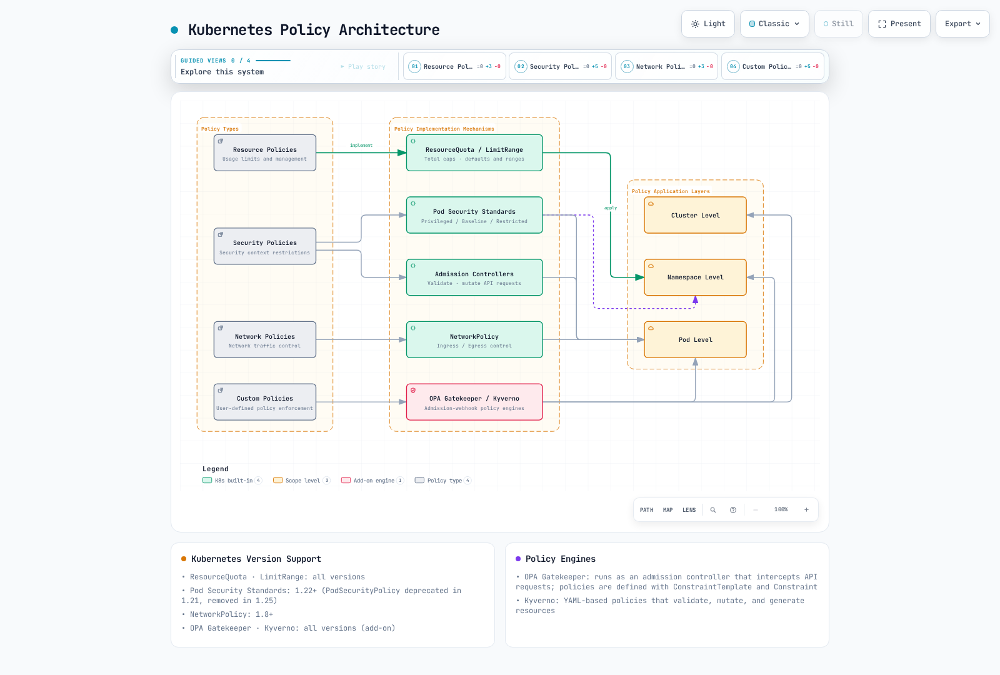
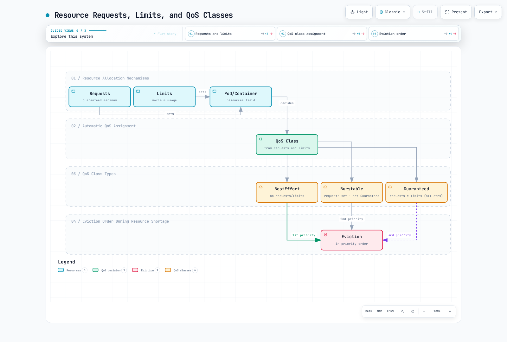
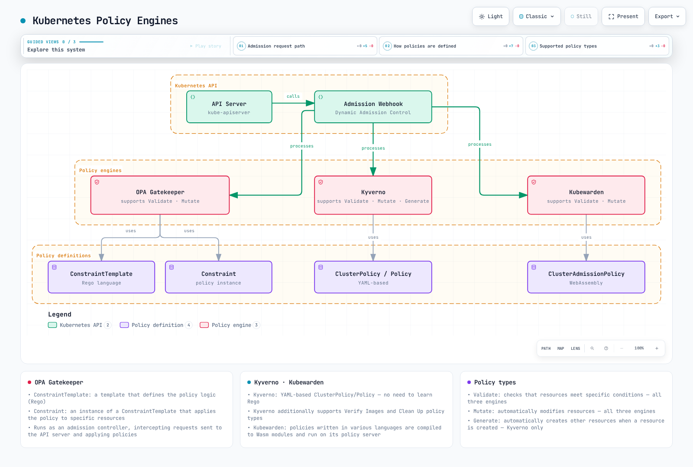
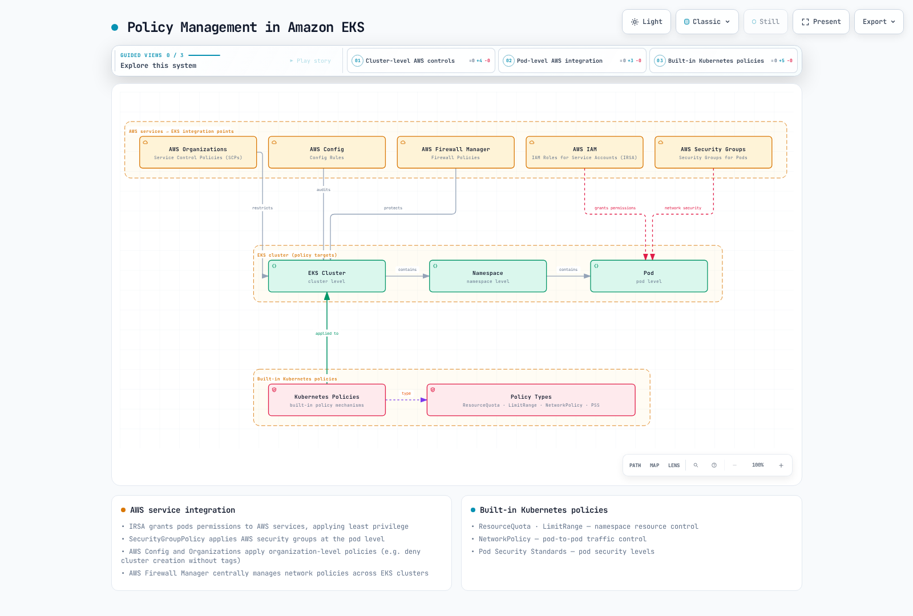

# Kubernetes 策略

> **支持的版本**: Kubernetes 1.32 - 1.34
> **最后更新**: February 22, 2026

在 Kubernetes 中，策略是一组用于控制和规范集群及工作负载行为的规则。通过策略，您可以管理安全性、资源使用和网络通信等各个方面。本章将学习 Kubernetes 中不同类型的策略、如何实施这些策略，以及 Amazon EKS 中的策略管理。

## 实验环境设置

要按照本文档中的示例操作，您需要以下工具和环境：

### 必需工具
- kubectl v1.34 或更高版本
- 可用的 Kubernetes 集群（EKS、minikube、kind 等）
- Kyverno CLI（可选）
- OPA Gatekeeper（可选）

### 策略示例设置

```bash
# Create namespace
kubectl create namespace policy-demo

# Create resource quota
kubectl -n policy-demo apply -f - <<EOF
apiVersion: v1
kind: ResourceQuota
metadata:
  name: demo-quota
spec:
  hard:
    requests.cpu: "1"
    requests.memory: 1Gi
    limits.cpu: "2"
    limits.memory: 2Gi
    pods: "10"
EOF

# Create network policy
kubectl -n policy-demo apply -f - <<EOF
apiVersion: networking.k8s.io/v1
kind: NetworkPolicy
metadata:
  name: default-deny
spec:
  podSelector: {}
  policyTypes:
  - Ingress
  - Egress
EOF

# Verify policies
kubectl -n policy-demo get resourcequota,networkpolicy
```

## Kubernetes 策略架构



[🔍 查看交互式图表](https://www.atomai.click/kubernetes-docs/archmaps/en-core-07-policies-0.html)

## 策略类型比较

| 策略类型 | 实现机制 | 应用层级 | 主要用途 | Kubernetes 版本支持 |
|------------|--------------------------|-------------------|-----------------|---------------------------|
| **资源策略** | ResourceQuota、LimitRange | Namespace | 资源使用限制和管理 | 所有版本 |
| **安全策略** | Pod Security Standards、PodSecurityPolicy（已弃用） | Pod、Namespace | 安全上下文限制 | PSP：~1.24，PSS：1.22+ |
| **网络策略** | NetworkPolicy | Pod | 网络流量控制 | 1.8+ |
| **自定义策略** | OPA Gatekeeper、Kyverno | Cluster、Namespace、Pod | 用户定义的策略强制执行 | 所有版本（附加组件） |

## 资源策略

资源策略是在 Kubernetes 集群内限制和管理计算资源（CPU、内存等）及对象数量（Pod、Service 等）的机制。

### ResourceQuota

ResourceQuota 限制一个 namespace 内可使用的资源总量。

```yaml
apiVersion: v1
kind: ResourceQuota
metadata:
  name: compute-resources
  namespace: dev
spec:
  hard:
    requests.cpu: "1"
    requests.memory: 1Gi
    limits.cpu: "2"
    limits.memory: 2Gi
    pods: "10"
    services: "5"
    persistentvolumeclaims: "5"
    secrets: "10"
    configmaps: "10"
```

### LimitRange

LimitRange 为 namespace 内的各个 container 或 Pod 设置默认资源限制和请求。

```yaml
apiVersion: v1
kind: LimitRange
metadata:
  name: limit-mem-cpu-per-container
  namespace: dev
spec:
  limits:
  - default:
      cpu: 500m
      memory: 512Mi
    defaultRequest:
      cpu: 100m
      memory: 256Mi
    max:
      cpu: "1"
      memory: 1Gi
    min:
      cpu: 50m
      memory: 128Mi
    type: Container
```

## 目录
1. [策略概述](#policy-overview)
2. [资源分配策略](#resource-allocation-policies)
3. [Pod 安全策略](#pod-security-policies)
4. [网络策略](#network-policies)
5. [资源配额](#resource-quotas)
6. [LimitRange](#limitrange)
7. [策略引擎](#policy-engines)
8. [Amazon EKS 中的策略管理](#policy-management-in-amazon-eks)
9. [策略最佳实践](#policy-best-practices)
10. [结论](#conclusion)

## 策略概述

Kubernetes 策略为集群管理员提供了一种定义集群内资源和工作负载约束的方法。策略用于以下目的：

1. **增强安全性**：防止未经授权的操作，并应用安全最佳实践
2. **资源管理**：限制资源使用，并确保资源公平分配
3. **合规性**：确保符合组织策略和法规
4. **标准化**：应用一致的配置和部署实践

Kubernetes 可以通过内置资源（例如 NetworkPolicy、ResourceQuota、LimitRange）或第三方策略引擎（例如 OPA Gatekeeper、Kyverno）实施各种类型的策略。

## 资源分配策略

资源分配策略控制 Pod 和 container 可使用的 CPU、内存等资源量。



[🔍 查看交互式图表](https://www.atomai.click/kubernetes-docs/archmaps/en-core-07-policies-1.html)

### 资源请求和限制

您可以通过为 Pod 和 container 设置资源请求和限制来管理资源使用：

```yaml
apiVersion: v1
kind: Pod
metadata:
  name: resource-demo
spec:
  containers:
  - name: resource-demo-container
    image: nginx
    resources:
      requests:
        memory: "64Mi"
        cpu: "250m"
      limits:
        memory: "128Mi"
        cpu: "500m"
```

- **requests**：为 container 保证的最小资源量
- **limits**：container 可使用的最大资源量

设置资源请求和限制具有以下优势：

1. **资源保障**：确保 Pod 获得所需的最小资源
2. **资源隔离**：防止一个 Pod 独占其他 Pod 的资源
3. **高效调度**：调度器在放置 Pod 时会考虑节点资源容量

### QoS（服务质量）类别

Kubernetes 根据 Pod 的资源请求和限制设置自动分配 QoS 类别：

1. **Guaranteed**：所有 container 都设置了资源请求和限制，并且 requests 等于 limits
2. **Burstable**：至少一个 container 设置了资源请求，但不满足 Guaranteed 条件
3. **BestEffort**：没有任何 container 设置资源请求和限制

QoS 类别决定资源短缺时的 Pod 驱逐顺序：
1. 首先驱逐 BestEffort Pod
2. 随后驱逐 Burstable Pod
3. 最后驱逐 Guaranteed Pod

## Pod 安全策略

Pod Security Policy（PSP）从 Kubernetes 1.21 开始弃用，并在 1.25 版本中完全移除。取而代之的是 Pod Security Standards 和 Pod Security Admission。


[🔍 查看交互式图表](https://www.atomai.click/kubernetes-docs/archmaps/en-core-07-policies-2.html)

### Pod Security Standards

Pod Security Standards 定义了三个策略级别：

1. **Privileged**：无限制，允许所有权限
2. **Baseline**：阻止已知的权限提升路径
3. **Restricted**：强力加固的安全策略

### Pod Security Admission

Pod Security Admission 通过 namespace 标签应用 Pod Security Standards：

```yaml
apiVersion: v1
kind: Namespace
metadata:
  name: my-namespace
  labels:
    pod-security.kubernetes.io/enforce: restricted
    pod-security.kubernetes.io/audit: restricted
    pod-security.kubernetes.io/warn: restricted
```

各标签的含义：
- **enforce**：阻止创建违反策略的 Pod
- **audit**：在审计日志中记录违规行为
- **warn**：显示违规警告消息

## 网络策略

Network Policy 提供了一种控制 Pod 之间通信的方法。默认情况下，Kubernetes 集群中的所有 Pod 都可以相互通信，但网络策略可以限制这种通信。


[🔍 查看交互式图表](https://www.atomai.click/kubernetes-docs/archmaps/en-core-07-policies-3.html)

```yaml
apiVersion: networking.k8s.io/v1
kind: NetworkPolicy
metadata:
  name: api-allow
  namespace: default
spec:
  podSelector:
    matchLabels:
      app: api
  policyTypes:
  - Ingress
  - Egress
  ingress:
  - from:
    - podSelector:
        matchLabels:
          app: frontend
    ports:
    - protocol: TCP
      port: 8080
  egress:
  - to:
    - podSelector:
        matchLabels:
          app: database
    ports:
    - protocol: TCP
      port: 5432
```

在上述示例中：
- 为带有 `api` 标签的 Pod 定义网络策略
- 仅允许带有 `frontend` 标签的 Pod 通过端口 8080 发送入站流量
- 仅允许通过端口 5432 向带有 `database` 标签的 Pod 发送出站流量

要使用网络策略，集群的网络插件必须支持网络策略。Calico、Cilium 和 Antrea 等 CNI 插件均支持网络策略。

### 网络策略类型

1. **Ingress 策略**：控制进入 Pod 的流量
2. **Egress 策略**：控制离开 Pod 的流量
3. **Ingress 和 Egress 策略**：控制两个方向的流量

### 网络策略选择器

网络策略可以通过各种选择器过滤流量：

1. **podSelector**：基于 Pod 标签选择
2. **namespaceSelector**：基于 namespace 标签选择
3. **ipBlock**：基于 IP CIDR 范围选择

```yaml
# Example combining multiple selectors
ingress:
- from:
  - podSelector:
      matchLabels:
        app: frontend
    namespaceSelector:
      matchLabels:
        env: prod
  - ipBlock:
      cidr: 172.17.0.0/16
      except:
      - 172.17.1.0/24
```

## 资源配额

ResourceQuota 限制一个 namespace 内可使用的资源总量。当多个团队或项目共享集群资源时，这可防止一个团队独占所有资源。


[🔍 查看交互式图表](https://www.atomai.click/kubernetes-docs/archmaps/en-core-07-policies-4.html)

```yaml
apiVersion: v1
kind: ResourceQuota
metadata:
  name: compute-resources
  namespace: team-a
spec:
  hard:
    pods: "10"
    requests.cpu: "4"
    requests.memory: 8Gi
    limits.cpu: "8"
    limits.memory: 16Gi
```

在上述示例中：
- `team-a` namespace 最多可创建 10 个 Pod
- 所有 Pod CPU requests 的总和不得超过 4 核
- 所有 Pod 内存 requests 的总和不得超过 8Gi
- 所有 Pod CPU limits 的总和不得超过 8 核
- 所有 Pod 内存 limits 的总和不得超过 16Gi

### 对象数量配额

除 CPU 和内存外，资源配额还可以限制在 namespace 内创建的对象数量：

```yaml
apiVersion: v1
kind: ResourceQuota
metadata:
  name: object-counts
  namespace: team-b
spec:
  hard:
    configmaps: "10"
    persistentvolumeclaims: "5"
    replicationcontrollers: "20"
    secrets: "10"
    services: "10"
    services.loadbalancers: "2"
```

### Priority Class 配额

您还可以为特定优先级类别的 Pod 设置配额：

```yaml
apiVersion: v1
kind: ResourceQuota
metadata:
  name: priority-class-quota
  namespace: team-c
spec:
  hard:
    pods: "10"
    pods.high: "5"
    pods.medium: "3"
    pods.low: "2"
  scopeSelector:
    matchExpressions:
    - operator: In
      scopeName: PriorityClass
      values: ["high", "medium", "low"]
```

## LimitRange

LimitRange 为 namespace 内创建的各个资源（Pod、container 等）设置默认资源限制和请求。当开发人员未显式设置资源请求和限制时，将应用此设置。

```yaml
apiVersion: v1
kind: LimitRange
metadata:
  name: cpu-limit-range
  namespace: default
spec:
  limits:
  - default:
      cpu: 1
      memory: 512Mi
    defaultRequest:
      cpu: 500m
      memory: 256Mi
    max:
      cpu: 2
      memory: 1Gi
    min:
      cpu: 100m
      memory: 128Mi
    type: Container
```

在上述示例中：
- **default**：当 container 未设置显式限制时应用的默认限制
- **defaultRequest**：当 container 未设置显式请求时应用的默认请求
- **max**：container 可设置的最大限制
- **min**：container 可设置的最小请求

LimitRange 可以应用于以下资源类型：
- Container
- Pod
- PersistentVolumeClaim

## 策略引擎

Kubernetes 生态系统拥有多个策略引擎，可实施更复杂且灵活的策略。



[🔍 查看交互式图表](https://www.atomai.click/kubernetes-docs/archmaps/en-core-07-policies-5.html)

### OPA Gatekeeper

OPA（Open Policy Agent）Gatekeeper 是一个用于在 Kubernetes 集群上定义和强制执行策略的开源项目。Gatekeeper 作为 Kubernetes admission controller 运行，拦截发送到 API server 的请求并应用策略。

Gatekeeper 包含以下组件：

1. **ConstraintTemplate**：定义策略逻辑的模板
2. **Constraint**：将策略应用于特定资源的 ConstraintTemplate 实例

```yaml
# ConstraintTemplate example
apiVersion: templates.gatekeeper.sh/v1beta1
kind: ConstraintTemplate
metadata:
  name: k8srequiredlabels
spec:
  crd:
    spec:
      names:
        kind: K8sRequiredLabels
      validation:
        openAPIV3Schema:
          properties:
            labels:
              type: array
              items: string
  targets:
    - target: admission.k8s.gatekeeper.sh
      rego: |
        package k8srequiredlabels
        violation[{"msg": msg, "details": {"missing_labels": missing}}] {
          provided := {label | input.review.object.metadata.labels[label]}
          required := {label | label := input.parameters.labels[_]}
          missing := required - provided
          count(missing) > 0
          msg := sprintf("missing required labels: %v", [missing])
        }
```

```yaml
# Constraint example
apiVersion: constraints.gatekeeper.sh/v1beta1
kind: K8sRequiredLabels
metadata:
  name: require-app-label
spec:
  match:
    kinds:
      - apiGroups: [""]
        kinds: ["Pod"]
  parameters:
    labels: ["app", "owner"]
```

### Kyverno

Kyverno 是 Kubernetes 原生策略引擎，可使用基于 YAML 的策略来验证、变更和生成 Kubernetes 资源。您无需学习 Rego 语言，即可使用与 Kubernetes 资源类似的语法编写策略。

```yaml
# Kyverno policy example
apiVersion: kyverno.io/v1
kind: ClusterPolicy
metadata:
  name: require-labels
spec:
  validationFailureAction: enforce
  rules:
  - name: check-for-labels
    match:
      resources:
        kinds:
        - Pod
    validate:
      message: "The labels 'app' and 'owner' are required."
      pattern:
        metadata:
          labels:
            app: "?*"
            owner: "?*"
```

Kyverno 支持以下策略类型：

1. **Validate**：验证资源是否满足特定条件
2. **Mutate**：自动修改资源
3. **Generate**：在创建资源时自动创建其他资源
4. **Verify Images**：验证镜像签名
5. **Clean Up**：删除资源时自动清理相关资源

### Kubewarden

Kubewarden 是一个基于 WebAssembly 的策略引擎，允许使用各种编程语言编写策略。策略会被编译为 WebAssembly 模块，并在 Kubewarden policy server 上运行。

```yaml
# Kubewarden policy example
apiVersion: policies.kubewarden.io/v1alpha2
kind: ClusterAdmissionPolicy
metadata:
  name: require-labels
spec:
  module: registry://ghcr.io/kubewarden/policies/require-labels:v0.1.0
  rules:
  - apiGroups: [""]
    apiVersions: ["v1"]
    resources: ["pods"]
    operations:
    - CREATE
    - UPDATE
  settings:
    required_labels:
      - app
      - owner
```

## Amazon EKS 中的策略管理

在 Amazon EKS 中，您可以使用 Kubernetes 的默认策略机制以及各种 AWS 服务来管理策略。



[🔍 查看交互式图表](https://www.atomai.click/kubernetes-docs/archmaps/en-core-07-policies-6.html)

### 与 AWS IAM 集成

Amazon EKS 可以通过 IAM Roles for Service Accounts（IRSA）为 Pod 授予 AWS 服务权限。这使得可以应用最小权限原则。

```bash
# Create OIDC provider
eksctl utils associate-iam-oidc-provider --cluster my-cluster --approve

# Create IAM role and link to service account
eksctl create iamserviceaccount \
  --name my-service-account \
  --namespace default \
  --cluster my-cluster \
  --attach-policy-arn arn:aws:iam::aws:policy/AmazonS3ReadOnlyAccess \
  --approve
```

### 用于 Pod 的 AWS Security Groups

Amazon EKS 提供了在 Pod 层级应用 AWS security groups 的功能。这使得能够更精细地控制 Pod 之间的通信。

```yaml
apiVersion: vpcresources.k8s.aws/v1beta1
kind: SecurityGroupPolicy
metadata:
  name: allow-db-access
  namespace: default
spec:
  podSelector:
    matchLabels:
      app: web
  securityGroups:
    groupIds:
      - sg-12345
```

### AWS Config 和 AWS Organizations

您可以使用 AWS Config 和 AWS Organizations 向 EKS 集群应用组织级策略。例如，您可以限制创建没有特定标签的 EKS 集群。

```json
{
  "Version": "2012-10-17",
  "Statement": [
    {
      "Effect": "Deny",
      "Action": "eks:CreateCluster",
      "Resource": "*",
      "Condition": {
        "Null": {
          "aws:RequestTag/Environment": "true"
        }
      }
    }
  ]
}
```

### AWS Firewall Manager

您可以使用 AWS Firewall Manager 集中管理多个 EKS 集群的网络策略。这使得可以在整个组织中应用一致的安全策略。

## 策略最佳实践

以下是在 Kubernetes 集群中有效管理策略的最佳实践。

### 策略设计

1. **最小权限原则**：设计仅授予所需最低权限的策略。
2. **逐步应用**：不要一次应用所有策略；应逐步应用以尽量减少影响。
3. **审计模式**：在强制执行前，以审计模式运行策略以评估影响。
4. **清晰的文档**：清楚记录每个策略的目的和影响。

### 资源管理

1. **Namespace 隔离**：按团队或项目分隔 namespace，并为每个 namespace 设置适当的资源配额。
2. **默认限制**：使用 LimitRange 为所有 container 设置默认资源限制。
3. **QoS 类别考量**：根据工作负载的重要性设置适当的 QoS 类别。

### 网络安全

1. **默认拒绝策略**：设置默认拒绝所有流量的策略，并仅显式允许必要的通信。
2. **细粒度策略**：设置精细控制 Pod 之间通信的网络策略。
3. **定期审查**：定期审查和更新网络策略。

### 策略自动化

1. **CI/CD 集成**：将策略验证集成到 CI/CD 管道中，以便在部署前检测策略违规。
2. **策略测试**：先在测试环境中测试策略，确认无问题后再应用到生产环境。
3. **策略版本控制**：将策略作为代码进行管理，并使用版本控制系统跟踪变更。

## 结论

Kubernetes 策略是用于控制集群和工作负载的安全性、资源使用及网络通信的强大工具。通过将内置策略机制（ResourceQuota、LimitRange、NetworkPolicy 等）与第三方策略引擎（OPA Gatekeeper、Kyverno 等）相结合，您可以构建符合组织需求的策略框架。

使用 Amazon EKS 时，您可以利用各种 AWS 服务（IAM、Security Groups、AWS Config、AWS Organizations、AWS Firewall Manager 等）进一步加强策略管理。通过集成这些服务，您可以有效管理集群和工作负载的安全性、合规性及资源管理。

策略是一个持续演进的领域，因此定期审查和更新策略以应对新的威胁和需求非常重要。此外，建议将策略作为代码进行管理并实现自动化，以提高一致性和效率。

## 测验

要测试本章所学内容，请尝试[策略测验](../quizzes/core/07-policies-quiz.md)。

## 参考资料

- [Kubernetes 官方文档 - 资源配额](https://kubernetes.io/docs/concepts/policy/resource-quotas/)
- [Kubernetes 官方文档 - LimitRange](https://kubernetes.io/docs/concepts/policy/limit-range/)
- [Kubernetes 官方文档 - 网络策略](https://kubernetes.io/docs/concepts/services-networking/network-policies/)
- [Kubernetes 官方文档 - Pod Security Standards](https://kubernetes.io/docs/concepts/security/pod-security-standards/)
- [Kubernetes 官方文档 - Pod Security Admission](https://kubernetes.io/docs/concepts/security/pod-security-admission/)
- [OPA Gatekeeper 官方文档](https://open-policy-agent.github.io/gatekeeper/website/docs/)
- [Kyverno 官方文档](https://kyverno.io/docs/)
- [Kubewarden 官方文档](https://docs.kubewarden.io/)
- [Amazon EKS 官方文档 - IAM Roles for Service Accounts](https://docs.aws.amazon.com/eks/latest/userguide/iam-roles-for-service-accounts.html)
- [Amazon EKS 官方文档 - 用于 Pod 的 Security Groups](https://docs.aws.amazon.com/eks/latest/userguide/security-groups-for-pods.html)
- [AWS Config 官方文档](https://docs.aws.amazon.com/config/latest/developerguide/WhatIsConfig.html)
- [AWS Organizations 官方文档](https://docs.aws.amazon.com/organizations/latest/userguide/orgs_introduction.html)
- [AWS Firewall Manager 官方文档](https://docs.aws.amazon.com/waf/latest/developerguide/fms-chapter.html)
