# Kubernetes 调度、抢占和驱逐

> **支持的版本**: Kubernetes 1.32 - 1.34
> **最后更新**: February 22, 2026

在 Kubernetes 中，调度是将 Pod（容器组）放置到合适 Node（节点）上的过程。抢占是移除低优先级 Pod 以便为高优先级 Pod 腾出空间的过程，而驱逐是在 Node 出现问题时安全迁移 Pod 的过程。在本章中，我们将学习 Kubernetes 调度机制、Node 选择、抢占、驱逐，以及 Amazon EKS 中的调度优化方法。

## 实验环境设置

要跟随本文档中的示例进行操作，你需要以下工具和环境：

### 必需工具
- kubectl v1.34 或更高版本
- 可用的 Kubernetes cluster（EKS、minikube、kind 等）
- 具有多个 Node 的 cluster（用于调度测试）

### 调度示例设置

```bash
# Create namespace
kubectl create namespace scheduling-demo

# Add labels to nodes (if you have multiple nodes)
kubectl label nodes <node-name> disktype=ssd
kubectl label nodes <node-name> gpu=true

# Create a pod using node affinity
kubectl -n scheduling-demo apply -f - <<EOF
apiVersion: v1
kind: Pod
metadata:
  name: nginx-ssd
spec:
  affinity:
    nodeAffinity:
      requiredDuringSchedulingIgnoredDuringExecution:
        nodeSelectorTerms:
        - matchExpressions:
          - key: disktype
            operator: In
            values:
            - ssd
  containers:
  - name: nginx
    image: nginx
EOF

# Create priority class
kubectl apply -f - <<EOF
apiVersion: scheduling.k8s.io/v1
kind: PriorityClass
metadata:
  name: high-priority
value: 1000000
globalDefault: false
description: "This priority class should be used for critical service pods only."
EOF

# Create Pod Disruption Budget (PDB)
kubectl -n scheduling-demo apply -f - <<EOF
apiVersion: policy/v1
kind: PodDisruptionBudget
metadata:
  name: nginx-pdb
spec:
  minAvailable: 1
  selector:
    matchLabels:
      app: nginx
EOF
```

## Kubernetes 调度架构

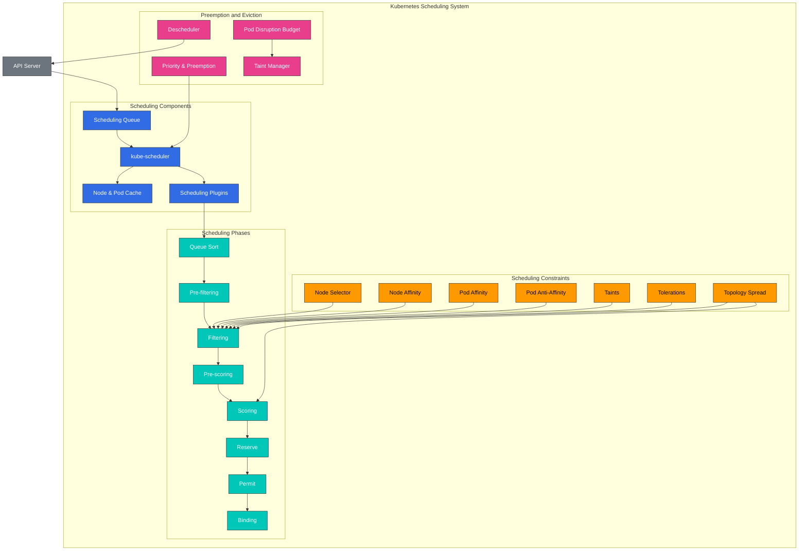

## 调度概念对比

| 概念 | 目的 | 使用场景 | Kubernetes 版本 |
|---------|---------|-----------|-------------------|
| **Node Selector** | 将 Pod 放置到具有特定 label 的 Node 上 | 简单的 Node 选择 | 所有版本 |
| **Node Affinity** | 定义复杂的 Node 选择规则 | 高级 Node 选择 | 1.6+ |
| **Pod Affinity** | 将 Pod 放置在靠近其他 Pod 的位置 | 相关 Service 的共置 | 1.6+ |
| **Pod Anti-Affinity** | 将 Pod 放置在远离其他 Pod 的位置 | 确保高可用性 | 1.6+ |
| **Taints and Tolerations** | 仅允许特定 Pod 位于 Node 上 | 专用 Node、Node 隔离 | 1.6+ |
| **Topology Spread Constraints** | 在拓扑域之间分散 Pod | 跨可用区分布 | 1.16+（1.19 GA） |
| **Priority and Preemption** | 优先处理重要 workload | 关键 Service 保障 | 1.8+（1.11 GA） |
| **Pod Disruption Budget** | 限制同时被中断的 Pod 数量 | 确保高可用性 | 1.4+（1.21 GA） |

## 基本调度概念

> **核心概念**: Kubernetes scheduler 是一个 control plane 组件，用于选择运行 Pod 的最佳 Node，并以两个阶段运行：过滤和评分。

### 调度过程

1. **过滤阶段（Predicates）**
   - 识别一组合适的、可以运行该 Pod 的 Node
   - 考虑资源需求、Node selector、affinity 规则、taint/toleration 等
   - 如果任何条件不满足，则排除该 Node

2. **评分阶段（Priorities）**
   - 为通过过滤的 Node 分配分数
   - 考虑资源利用率、Pod 分布、affinity 偏好等
   - 选择分数最高的 Node

3. **绑定阶段**
   - 将 Pod 分配给选定的 Node
   - 将绑定信息更新到 API server

## 目录
1. [调度概览](#scheduling-overview)
2. [Scheduler 如何工作](#how-the-scheduler-works)
3. [Node 选择](#node-selection)
4. [Pod Affinity 和 Anti-Affinity](#pod-affinity-and-anti-affinity)
5. [Taints 和 Tolerations](#taints-and-tolerations)
6. [Node Affinity](#node-affinity)
7. [Pod Priority 和 Preemption](#pod-priority-and-preemption)
8. [Pod Eviction](#pod-eviction)
9. [Pod Disruption Budget (PDB)](#pod-disruption-budget-pdb)
10. [Node Pressure Eviction](#node-pressure-eviction)
11. [TopologySpreadConstraints](#topologyspreadconstraints)
12. [Pod Deletion Cost](#pod-deletion-cost)
13. [Descheduler](#descheduler)
14. [Amazon EKS 中的调度优化](#scheduling-optimization-in-amazon-eks)
15. [调度最佳实践](#scheduling-best-practices)
16. [结论](#conclusion)

## 调度概览

Kubernetes scheduler 是一个 control plane 组件，用于将 Pod 放置到合适的 Node 上。Scheduler 会考虑各种因素来确定放置 Pod 的最佳 Node：

1. **资源需求**: Pod 请求的 CPU、内存和其他资源
2. **硬件/软件/策略约束**: Node selector、Node affinity、taint 等
3. **Affinity/Anti-Affinity 规范**: 与其他 Pod 的放置关系
4. **数据局部性**: 将 Pod 放置在靠近数据的位置
5. **Workload 间干扰**: 最小化不同 workload 之间的干扰
6. **截止期限**: 考虑有时间约束的 workload

### 调度过程

调度过程大致分为两个阶段：

1. **过滤**: 识别一组可以运行该 Pod 的 Node
   - 检查是否满足资源需求
   - 检查 Node selector、affinity、taint 等约束

2. **评分**: 对过滤后的 Node 评分以选择最佳 Node
   - 资源利用率平衡
   - Pod 间 affinity/anti-affinity
   - 数据局部性
   - Taint/toleration

## Scheduler 如何工作

Kubernetes scheduler 通过以下过程运行：

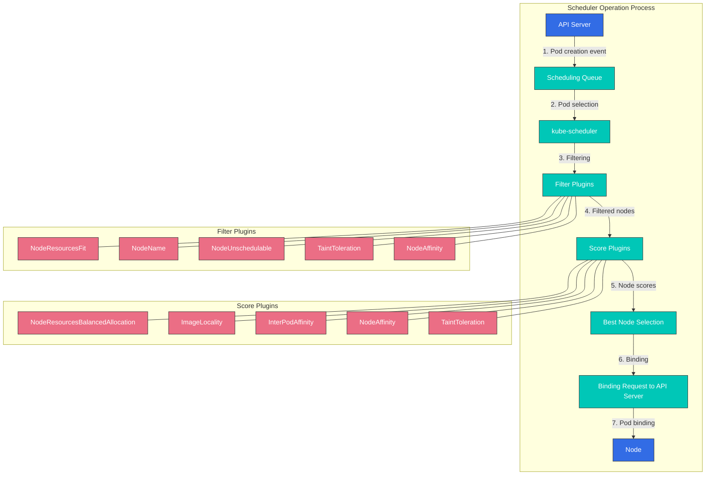

1. **Pod 队列监听**: Scheduler 监听 API server 中未调度的 Pod。
2. **Node 过滤**: 识别一组可以运行该 Pod 的 Node。
3. **Node 评分**: 对过滤后的 Node 进行评分。
4. **Node 选择**: 选择得分最高的 Node。
5. **绑定**: 将 Pod 绑定到选定的 Node。

### Scheduling Plugins

Kubernetes scheduler 设计为可使用 plugin 架构进行扩展。各种 plugin 在调度过程的不同阶段运行：

1. **Filter Plugins**: 过滤掉 Pod 无法运行的 Node
   - NodeResourcesFit: 检查 Node 资源容量
   - NodeName: 检查 Pod 的 nodeName 字段
   - NodeUnschedulable: 检查 Node 可调度性
   - TaintToleration: 检查 taint 和 toleration

2. **Score Plugins**: 为 Node 分配分数
   - NodeResourcesBalancedAllocation: 考虑资源使用平衡
   - ImageLocality: 考虑 image 局部性
   - InterPodAffinity: 考虑 Pod 间 affinity
   - NodeAffinity: 考虑 Node affinity

### 多个 Scheduler

Kubernetes 可以同时运行多个 scheduler。这允许为特定 workload 实现自定义调度逻辑。

```yaml
apiVersion: v1
kind: Pod
metadata:
  name: custom-scheduled-pod
spec:
  schedulerName: my-custom-scheduler
  containers:
  - name: container
    image: nginx
```

在上面的示例中，`schedulerName` 字段指定用于调度该 Pod 的 scheduler。

## Node 选择

Kubernetes 提供了多种机制，用于将 Pod 放置到特定 Node 上。

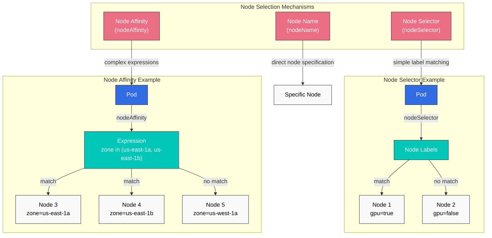

### Node Selector

Node selector 是将 Pod 限制为只能放置在具有特定 label 的 Node 上的最简单方法。

```yaml
apiVersion: v1
kind: Pod
metadata:
  name: gpu-pod
spec:
  nodeSelector:
    gpu: "true"
  containers:
  - name: gpu-container
    image: nvidia/cuda
```

在上面的示例中，该 Pod 只会被放置在具有 `gpu=true` label 的 Node 上。

### nodeName

你可以使用 `nodeName` 字段将 Pod 直接放置到特定 Node 上。此方法会绕过 scheduler，通常不建议使用。

```yaml
apiVersion: v1
kind: Pod
metadata:
  name: specific-node-pod
spec:
  nodeName: worker-node-1
  containers:
  - name: container
    image: nginx
```

在上面的示例中，该 Pod 被直接放置到名为 `worker-node-1` 的 Node 上。

## Pod Affinity 和 Anti-Affinity

Pod affinity 和 anti-affinity 提供了根据 Pod 之间关系放置 Pod 的方法。

```mermaid
graph TD
    subgraph "Pod Affinity"
        PA["podAffinity"]
        PA -->|place on same node/topology| Together["Co-location"]

        subgraph "Affinity Example"
            WebPod["Web Pod<br>app=web"]
            CachePod["Cache Pod<br>app=cache"]
            WebPod -->|co-locate| CachePod
            Node1["Node 1"] -->|contains| WebPod
            Node1 -->|contains| CachePod
        end
    end

    subgraph "Pod Anti-Affinity"
        PAA["podAntiAffinity"]
        PAA -->|place on different node/topology| Apart["Separation"]

        subgraph "Anti-Affinity Example"
            WebPod1["Web Pod 1<br>app=web"]
            WebPod2["Web Pod 2<br>app=web"]
            WebPod1 -->|separate| WebPod2
            Node2["Node 2"] -->|contains| WebPod1
            Node3["Node 3"] -->|contains| WebPod2
        end
    end

    subgraph "Affinity Types"
        Required["requiredDuringSchedulingIgnoredDuringExecution<br>(hard requirement)"]
        Preferred["preferredDuringSchedulingIgnoredDuringExecution<br>(soft requirement)"]
    end

    PA -->|type| Required
    PA -->|type| Preferred
    PAA -->|type| Required
    PAA -->|type| Preferred

    %% Style definitions
    classDef affinityType fill:#EB6E85,stroke:#333,stroke-width:1px,color:white;
    classDef affinityResult fill:#00C7B7,stroke:#333,stroke-width:1px,color:white;
    classDef k8sComponent fill:#326CE5,stroke:#333,stroke-width:1px,color:white;
    classDef nodeComponent fill:#f9f9f9,stroke:#333,stroke-width:1px,color:black;
    classDef affinityKind fill:#3B48CC,stroke:#333,stroke-width:1px,color:white;

    %% Apply classes
    class PA,PAA affinityType;
    class Together,Apart affinityResult;
    class WebPod,CachePod,WebPod1,WebPod2 k8sComponent;
    class Node1,Node2,Node3 nodeComponent;
    class Required,Preferred affinityKind;
```

### Pod Affinity

Pod affinity 会使 Pod 被放置在与具有特定 label 的 Pod 相同的 Node 或 topology domain 上。

```yaml
apiVersion: v1
kind: Pod
metadata:
  name: frontend
spec:
  affinity:
    podAffinity:
      requiredDuringSchedulingIgnoredDuringExecution:
      - labelSelector:
          matchExpressions:
          - key: app
            operator: In
            values:
            - cache
        topologyKey: kubernetes.io/hostname
  containers:
  - name: frontend
    image: nginx
```

在上面的示例中，`frontend` Pod 会被放置在与具有 `app=cache` label 的 Pod 相同的 host 上。

### Pod Anti-Affinity

Pod anti-affinity 会使 Pod 被放置在与具有特定 label 的 Pod 不同的 Node 或 topology domain 上。

```yaml
apiVersion: v1
kind: Pod
metadata:
  name: frontend
  labels:
    app: frontend
spec:
  affinity:
    podAntiAffinity:
      requiredDuringSchedulingIgnoredDuringExecution:
      - labelSelector:
          matchExpressions:
          - key: app
            operator: In
            values:
            - frontend
        topologyKey: kubernetes.io/hostname
  containers:
  - name: frontend
    image: nginx
```

在上面的示例中，`frontend` Pod 会被放置在与其他具有 `app=frontend` label 的 Pod 不同的 host 上。这有助于将同一应用程序的实例分布到多个 Node 上，以实现高可用性。

### Affinity 类型

Pod affinity 和 anti-affinity 有两种类型：

1. **requiredDuringSchedulingIgnoredDuringExecution**: 调度期间必须满足的硬性要求
2. **preferredDuringSchedulingIgnoredDuringExecution**: 首选但非必需的软性要求

```yaml
# preferredDuringSchedulingIgnoredDuringExecution example
affinity:
  podAffinity:
    preferredDuringSchedulingIgnoredDuringExecution:
    - weight: 100
      podAffinityTerm:
        labelSelector:
          matchExpressions:
          - key: app
            operator: In
            values:
            - cache
        topologyKey: kubernetes.io/hostname
```

在上面的示例中，`weight` 字段表示此偏好的权重。当存在多个偏好时，权重更高的偏好会被视为更重要。

## Taints 和 Tolerations

Taints 和 tolerations 是允许 Node 拒绝特定 Pod 的机制。

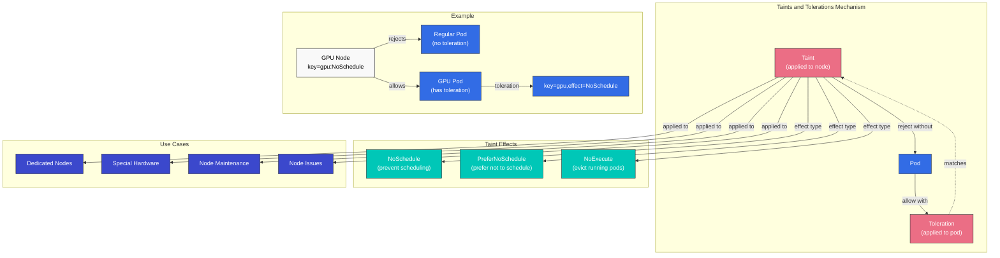

### Taints

Taint 应用于 Node，用于限制 Pod 被调度到这些 Node 上。

```bash
# Add taint to node
kubectl taint nodes node1 key=value:NoSchedule
```

有三种 taint effect：

1. **NoSchedule**: 没有 toleration 的 Pod 不会被调度到该 Node 上
2. **PreferNoSchedule**: 倾向于不将没有 toleration 的 Pod 调度到该 Node 上
3. **NoExecute**: 没有 toleration 的 Pod 会从该 Node 上被驱逐

### Tolerations

Toleration 应用于 Pod，使其可以被调度到带有 taint 的 Node 上。

```yaml
apiVersion: v1
kind: Pod
metadata:
  name: nginx
spec:
  tolerations:
  - key: "key"
    operator: "Equal"
    value: "value"
    effect: "NoSchedule"
  containers:
  - name: nginx
    image: nginx
```

在上面的示例中，该 Pod 可以被调度到具有 `key=value:NoSchedule` taint 的 Node 上。

### 使用场景

Taint 和 toleration 的常见使用场景：

1. **专用 Node**: 指定 Node 仅运行特定 workload
2. **特殊硬件**: 管理具有 GPU 等特殊硬件的 Node
3. **Node 维护**: 防止新的 Pod 被调度到正在维护的 Node 上
4. **Node 问题**: 从有问题的 Node 上驱逐 Pod

### 默认 Taints

Kubernetes 会将默认 taint 应用于某些 Node：

- **node.kubernetes.io/not-ready**: Node 未就绪
- **node.kubernetes.io/unreachable**: Node 不可达
- **node.kubernetes.io/memory-pressure**: Node 存在内存压力
- **node.kubernetes.io/disk-pressure**: Node 存在磁盘压力
- **node.kubernetes.io/pid-pressure**: Node 存在 PID 压力
- **node.kubernetes.io/network-unavailable**: Node 网络不可用
- **node.kubernetes.io/unschedulable**: Node 不可调度

## Node Affinity

Node affinity 提供了一种更具表达力的方式，用于将 Pod 放置到特定 Node 集合上。相比 node selector，它允许指定更复杂的条件。

### Node Affinity 类型

Node affinity 有两种类型：

1. **requiredDuringSchedulingIgnoredDuringExecution**: 调度期间必须满足的硬性要求
2. **preferredDuringSchedulingIgnoredDuringExecution**: 首选但非必需的软性要求

```yaml
apiVersion: v1
kind: Pod
metadata:
  name: with-node-affinity
spec:
  affinity:
    nodeAffinity:
      requiredDuringSchedulingIgnoredDuringExecution:
        nodeSelectorTerms:
        - matchExpressions:
          - key: kubernetes.io/e2e-az-name
            operator: In
            values:
            - e2e-az1
            - e2e-az2
      preferredDuringSchedulingIgnoredDuringExecution:
      - weight: 1
        preference:
          matchExpressions:
          - key: another-node-label-key
            operator: In
            values:
            - another-node-label-value
  containers:
  - name: with-node-affinity
    image: nginx
```

在上面的示例中，该 Pod 只会被放置在 `kubernetes.io/e2e-az-name` label 为 `e2e-az1` 或 `e2e-az2` 的 Node 上。此外，它最好被放置在具有 `another-node-label-key=another-node-label-value` label 的 Node 上。

### Operators

Node affinity 支持多种 operator：

- **In**: Label 值匹配指定值之一
- **NotIn**: Label 值不匹配指定值
- **Exists**: 存在具有指定 key 的 label
- **DoesNotExist**: 不存在具有指定 key 的 label
- **Gt**: Label 值大于指定值
- **Lt**: Label 值小于指定值

## Pod Priority 和 Preemption

Kubernetes 提供 Pod priority 和 preemption 功能，以确保重要 workload 能够获得 cluster 资源。

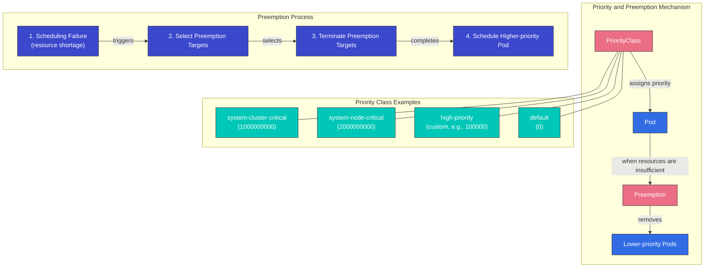

### PriorityClass

PriorityClass 定义 Pod 的相对重要性。priority 值越高，Pod 越重要。

```yaml
apiVersion: scheduling.k8s.io/v1
kind: PriorityClass
metadata:
  name: high-priority
value: 1000000
globalDefault: false
description: "This priority class should be used for critical workloads."
```

在上面的示例中，`value` 字段表示 priority 值。值越高，priority 越高。如果 `globalDefault` 字段设置为 `true`，此 priority class 会应用于没有指定 priority class 的 Pod。

### 将 PriorityClass 应用于 Pod

要将 priority class 应用于 Pod，请使用 `priorityClassName` 字段。

```yaml
apiVersion: v1
kind: Pod
metadata:
  name: high-priority-pod
spec:
  priorityClassName: high-priority
  containers:
  - name: container
    image: nginx
```

### Preemption

Preemption 是移除低优先级 Pod 以调度高优先级 Pod 的过程。当 scheduler 找不到可以调度高优先级 Pod 的 Node 时，它会抢占低优先级 Pod 以获得资源。

Preemption 过程：
1. Scheduler 找不到可以调度高优先级 Pod 的 Node
2. Scheduler 选择一个 Node，通过 preemption 移除低优先级 Pod
3. 向选定 Node 上的低优先级 Pod 发送终止信号
4. 当 Pod 优雅终止后，将高优先级 Pod 调度到该 Node 上

### Preemption 注意事项

使用 preemption 时需要考虑的事项：

1. **优雅终止期**: 被抢占的 Pod 会在 `terminationGracePeriodSeconds` 中指定的时间内经历优雅终止过程
2. **PodDisruptionBudget**: Preemption 不遵守 PodDisruptionBudget
3. **系统 Priority Classes**: Kubernetes 为系统组件提供 priority class
   - `system-cluster-critical`: 对 cluster 运行至关重要的 Pod
   - `system-node-critical`: 对 Node 运行至关重要的 Pod

## Pod Eviction

Pod eviction 是在 Node 出现问题时安全迁移 Pod 的过程。Eviction 可能因多种原因发生。

```mermaid
graph TD
    subgraph "Eviction Types"
        ControllerEviction["kube-controller-manager<br>Eviction"]
        KubeletEviction["kubelet Eviction"]
        UserEviction["User Eviction"]
    end

    subgraph "Eviction Causes"
        NodeNotReady["Node NotReady"]
        NodeUnreachable["Node Unreachable"]
        ResourcePressure["Resource Shortage<br>(memory, disk, etc.)"]
        HardwareIssue["Hardware Issues"]
        Maintenance["Maintenance"]
    end

    subgraph "kubelet Eviction Signals"
        MemoryAvailable["memory.available"]
        NodefsAvailable["nodefs.available"]
        NodefsInodesFree["nodefs.inodesFree"]
        ImagefsAvailable["imagefs.available"]
        ImagefsInodesFree["imagefs.inodesFree"]
        PidAvailable["pid.available"]
    end

    ControllerEviction -->|cause| NodeNotReady
    ControllerEviction -->|cause| NodeUnreachable
    KubeletEviction -->|cause| ResourcePressure
    KubeletEviction -->|cause| HardwareIssue
    UserEviction -->|cause| Maintenance

    KubeletEviction -->|monitors| MemoryAvailable
    KubeletEviction -->|monitors| NodefsAvailable
    KubeletEviction -->|monitors| NodefsInodesFree
    KubeletEviction -->|monitors| ImagefsAvailable
    KubeletEviction -->|monitors| ImagefsInodesFree
    KubeletEviction -->|monitors| PidAvailable

    %% Style definitions
    classDef evictionType fill:#EB6E85,stroke:#333,stroke-width:1px,color:white;
    classDef evictionCause fill:#00C7B7,stroke:#333,stroke-width:1px,color:white;
    classDef evictionSignal fill:#3B48CC,stroke:#333,stroke-width:1px,color:white;

    %% Apply classes
    class ControllerEviction,KubeletEviction,UserEviction evictionType;
    class NodeNotReady,NodeUnreachable,ResourcePressure,HardwareIssue,Maintenance evictionCause;
    class MemoryAvailable,NodefsAvailable,NodefsInodesFree,ImagefsAvailable,ImagefsInodesFree,PidAvailable evictionSignal;
```

### Eviction 类型

1. **由 kube-controller-manager 执行的 Eviction**:
   - 当 Node 在 `pod-eviction-timeout` 周期内保持 NotReady 状态时（默认 5 分钟）
   - 当 Node 处于 Unreachable 状态时

2. **由 kubelet 执行的 Eviction**:
   - Node 资源不足（内存、磁盘等）
   - 硬件问题

3. **由用户执行的 Eviction**:
   - 执行 `kubectl drain` 命令
   - Node 维护任务

### kubelet Eviction Signals

kubelet 监控以下 eviction signal：

1. **memory.available**: 可用内存
2. **nodefs.available**: Node file system 中的可用空间
3. **nodefs.inodesFree**: Node file system 中的可用 inode
4. **imagefs.available**: Image file system 中的可用空间
5. **imagefs.inodesFree**: Image file system 中的可用 inode
6. **pid.available**: 可用 process ID

可以为每个 signal 设置软阈值和硬阈值：

- **软阈值**: 超过阈值后，在 `grace-period` 之后驱逐 Pod
- **硬阈值**: 超过阈值后立即驱逐 Pod

```yaml
# kubelet configuration example
evictionHard:
  memory.available: "100Mi"
  nodefs.available: "10%"
  nodefs.inodesFree: "5%"
  imagefs.available: "15%"
evictionSoft:
  memory.available: "200Mi"
  nodefs.available: "15%"
evictionSoftGracePeriod:
  memory.available: "1m"
  nodefs.available: "2m"
evictionPressureTransitionPeriod: "30s"
```

### Eviction 优先级

kubelet 按以下顺序驱逐 Pod：

1. 具有 BestEffort QoS class 的 Pod
2. 具有 Burstable QoS class 的 Pod（从资源使用量超过 requests 的 Pod 开始）
3. 具有 Guaranteed QoS class 的 Pod（requests 和 limits 相等的 Pod）

## Pod Disruption Budget (PDB)

Pod Disruption Budget (PDB) 是在自愿中断期间维护应用程序可用性的一种方式。PDB 限制可以同时被中断的 Pod 数量。

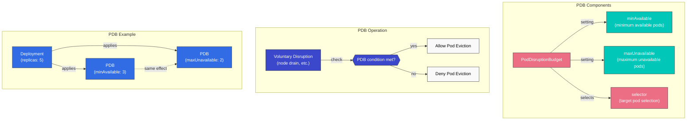

### PDB 定义

```yaml
apiVersion: policy/v1
kind: PodDisruptionBudget
metadata:
  name: frontend-pdb
spec:
  minAvailable: 2
  selector:
    matchLabels:
      app: frontend
```

或

```yaml
apiVersion: policy/v1
kind: PodDisruptionBudget
metadata:
  name: frontend-pdb
spec:
  maxUnavailable: 1
  selector:
    matchLabels:
      app: frontend
```

在上面的示例中：
- `minAvailable`: 必须始终可用的 Pod 最小数量
- `maxUnavailable`: 同一时间可以不可用的 Pod 最大数量
- `selector`: 选择 PDB 适用的 Pod 的 label selector

### PDB 运行方式

1. 当发生 Node drain 等自愿中断时，Kubernetes 会检查 PDB
2. 如果满足 PDB 条件，则继续执行 Pod eviction
3. 如果不满足 PDB 条件，则拒绝 Pod eviction

### PDB 最佳实践

1. **为所有关键 workload 设置 PDB**: 为所有需要高可用性的 workload 设置 PDB
2. **选择合适的值**: 根据 workload 特征选择合适的 `minAvailable` 或 `maxUnavailable` 值
3. **考虑 replica 数量**: PDB 值必须小于 replica 数量
4. **定期测试**: 通过 Node drain 和类似任务测试 PDB 运行情况

## Node Pressure Eviction

Node pressure eviction 是由于 Node 资源不足而驱逐 Pod 的机制。

### Node Condition Status

kubelet 报告以下 Node condition status：

1. **MemoryPressure**: Node 内存不足
2. **DiskPressure**: Node 磁盘空间不足
3. **PIDPressure**: Node process ID 不足

当这些条件发生时，kubelet 会驱逐 Pod 以获得资源。

### Eviction Policy 配置

Eviction policy 可以在 kubelet 配置中设置：

```yaml
# kubelet configuration example
evictionHard:
  memory.available: "100Mi"
  nodefs.available: "10%"
  nodefs.inodesFree: "5%"
  imagefs.available: "15%"
evictionSoft:
  memory.available: "200Mi"
  nodefs.available: "15%"
evictionSoftGracePeriod:
  memory.available: "1m"
  nodefs.available: "2m"
evictionMinimumReclaim:
  memory.available: "50Mi"
  nodefs.available: "5%"
evictionPressureTransitionPeriod: "30s"
```

在上面的示例中：
- `evictionMinimumReclaim`: eviction 后必须回收的最小资源量
- `evictionPressureTransitionPeriod`: pressure 状态转换之间的等待时间

## TopologySpreadConstraints

TopologySpreadConstraints 提供了细粒度控制，用于控制 Pod 如何分布在可用区、Node 或 Region 等 topology domain 中。与 Pod anti-affinity 相比，此功能在实现高可用性和高效资源利用方面提供了更高的灵活性。

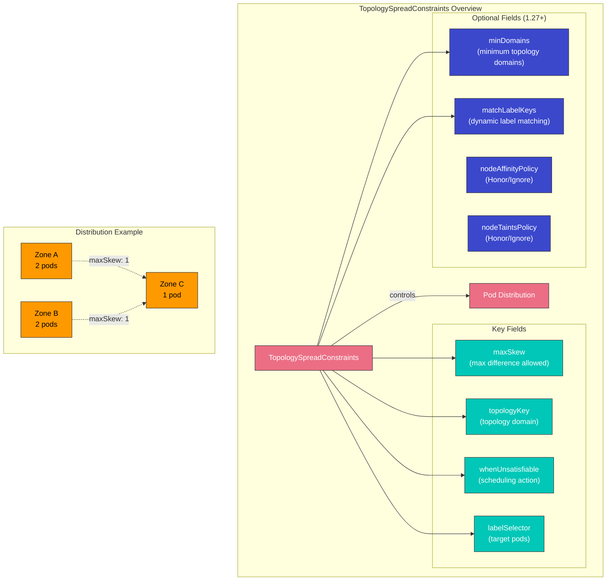

### 关键字段

| 字段 | 描述 | 必需 |
|-------|-------------|----------|
| **maxSkew** | 任意两个 topology domain 之间允许的最大 Pod 数量差异 | 是 |
| **topologyKey** | 定义 topology domain 的 Node label key | 是 |
| **whenUnsatisfiable** | 约束无法满足时的操作：`DoNotSchedule` 或 `ScheduleAnyway` | 是 |
| **labelSelector** | 选择哪些 Pod 参与 spread 计算 | 是 |
| **minDomains** | 所需的 topology domain 最小数量（1.27+） | 否 |
| **matchLabelKeys** | 用于 spread 计算匹配的 Pod label key（1.27+） | 否 |

### whenUnsatisfiable 选项

- **DoNotSchedule**: 如果无法满足约束，scheduler 不会调度该 Pod（硬性约束）
- **ScheduleAnyway**: Scheduler 仍会调度该 Pod，但会给最小化 skew 的 Node 更高优先级（软性约束）

### EKS 可用区分散示例

```yaml
apiVersion: apps/v1
kind: Deployment
metadata:
  name: web-app
spec:
  replicas: 6
  selector:
    matchLabels:
      app: web
  template:
    metadata:
      labels:
        app: web
    spec:
      topologySpreadConstraints:
      - maxSkew: 1
        topologyKey: topology.kubernetes.io/zone
        whenUnsatisfiable: DoNotSchedule
        labelSelector:
          matchLabels:
            app: web
      - maxSkew: 1
        topologyKey: kubernetes.io/hostname
        whenUnsatisfiable: ScheduleAnyway
        labelSelector:
          matchLabels:
            app: web
      containers:
      - name: web
        image: nginx:1.25
        resources:
          requests:
            cpu: 100m
            memory: 128Mi
```

此配置确保：
1. Pod 在可用区之间均匀分布（硬性约束）
2. Pod 最好在每个可用区内的 Node 之间分布（软性约束）

### minDomains 和 matchLabelKeys（Kubernetes 1.27+）

```yaml
apiVersion: apps/v1
kind: Deployment
metadata:
  name: app-with-min-domains
spec:
  replicas: 4
  selector:
    matchLabels:
      app: distributed-app
  template:
    metadata:
      labels:
        app: distributed-app
        version: v1
    spec:
      topologySpreadConstraints:
      - maxSkew: 1
        topologyKey: topology.kubernetes.io/zone
        whenUnsatisfiable: DoNotSchedule
        labelSelector:
          matchLabels:
            app: distributed-app
        minDomains: 3
        matchLabelKeys:
        - version
      containers:
      - name: app
        image: myapp:v1
```

- **minDomains**: 确保 Pod 至少分布在 3 个可用区中。如果可用区数量更少，调度会被阻止。
- **matchLabelKeys**: 自动在 selector 中使用 Pod 的 `version` label 值，从而无需修改 selector 即可按 revision 进行分散。

### 相比 Pod Anti-Affinity 的优势

| 方面 | TopologySpreadConstraints | Pod Anti-Affinity |
|--------|---------------------------|-------------------|
| **灵活性** | 允许受控 skew（maxSkew > 1） | 二元：要么相同 domain，要么不同 domain |
| **软性约束** | 使用 `ScheduleAnyway` 进行 best-effort | `preferredDuringScheduling`，但控制较少 |
| **多级别** | 可使用不同 topologyKey 的多个约束 | 需要复杂的嵌套规则 |
| **性能** | 大规模场景下 scheduler 性能更好 | Pod 数量多时可能减慢调度 |
| **使用场景** | 允许一定容忍度的均匀分布 | 严格分离 |

## Pod Deletion Cost

Pod Deletion Cost 是一项功能，允许你控制在 scale-down 操作期间优先移除哪些 Pod。通过设置 `controller.kubernetes.io/pod-deletion-cost` annotation，你可以影响 Pod 被终止的顺序。

### 工作方式

当 controller（如 HPA 或手动 scale-down）需要减少 replica 时，它会考虑：
1. deletion cost 更低的 Pod 会先被移除
2. 默认 deletion cost 为 0
3. 有效范围：-2147483648 到 2147483647

### 基本示例

```yaml
apiVersion: v1
kind: Pod
metadata:
  name: worker-pod
  annotations:
    controller.kubernetes.io/pod-deletion-cost: "100"
spec:
  containers:
  - name: worker
    image: worker:latest
```

### HPA Scale-Down 优先级控制

使用 deletion cost 在 HPA scale-down 期间保护重要 Pod：

```yaml
apiVersion: apps/v1
kind: Deployment
metadata:
  name: web-service
spec:
  replicas: 5
  selector:
    matchLabels:
      app: web
  template:
    metadata:
      labels:
        app: web
      # Lower cost pods are deleted first during scale-down
      annotations:
        controller.kubernetes.io/pod-deletion-cost: "0"
    spec:
      containers:
      - name: web
        image: nginx:1.25
```

### Cache 保护模式

通过动态调整 deletion cost 来保护具有 warm cache 的 Pod：

```yaml
apiVersion: apps/v1
kind: Deployment
metadata:
  name: cache-service
spec:
  replicas: 3
  selector:
    matchLabels:
      app: cache
  template:
    metadata:
      labels:
        app: cache
    spec:
      containers:
      - name: cache
        image: redis:7
      - name: cost-updater
        image: bitnami/kubectl:latest
        command:
        - /bin/sh
        - -c
        - |
          # Update deletion cost based on cache warmth
          while true; do
            CACHE_SIZE=$(redis-cli DBSIZE | awk '{print $2}')
            # Higher cache size = higher cost = less likely to be deleted
            kubectl annotate pod $POD_NAME \
              controller.kubernetes.io/pod-deletion-cost="$CACHE_SIZE" \
              --overwrite
            sleep 60
          done
        env:
        - name: POD_NAME
          valueFrom:
            fieldRef:
              fieldPath: metadata.name
```

### 实际使用场景

1. **Stateful workload**: 保护具有累积状态的 Pod
2. **Leader election**: 让 leader Pod 运行更久
3. **Connection draining**: 为长连接留出时间
4. **Cache warming**: 保留具有 warm cache 的 Pod
5. **Batch processing**: 保留正在处理大型 job 的 Pod

## Descheduler

Descheduler 是一个 Kubernetes 组件，它会从 Node 中驱逐 Pod，使 scheduler 能够将它们重新调度到更合适的 Node。与只放置新 Pod 的 scheduler 不同，descheduler 有助于随着时间推移维持最佳 Pod 放置。

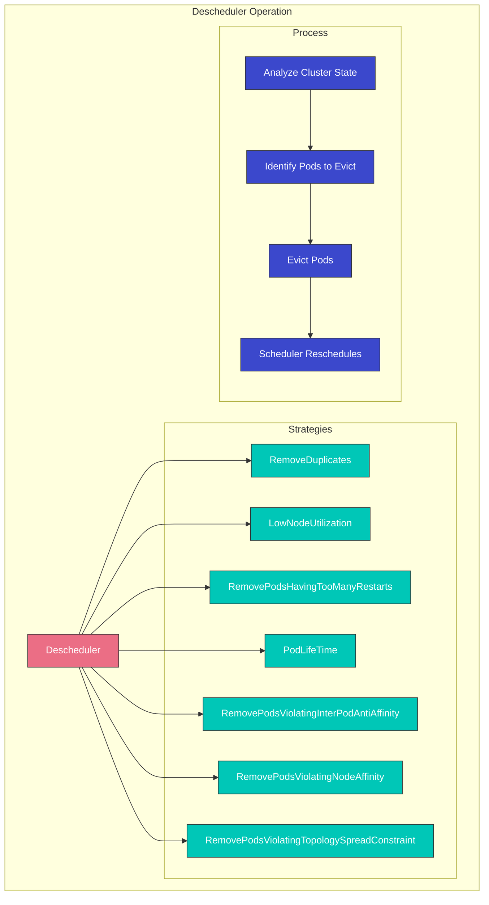

### 为什么需要 Descheduling

1. **Cluster 变化**: 添加了新 Node，Node label 发生变化
2. **Pod 漂移**: 初始放置随着时间推移变得不再最优
3. **Affinity 违规**: Cluster 变化后规则被违反
4. **资源不均衡**: 一些 Node 过度利用，另一些 Node 利用不足
5. **失败的 Pod**: Pod 卡在重启循环中

### 关键策略

| 策略 | 描述 | 使用场景 |
|----------|-------------|----------|
| **RemoveDuplicates** | 从同一 Node 中移除重复 Pod | 在 Node 故障后确保 HA |
| **LowNodeUtilization** | 将 Pod 从过度利用的 Node 移动到利用不足的 Node | 平衡 cluster 资源 |
| **RemovePodsHavingTooManyRestarts** | 驱逐重启次数过多的 Pod | 清理有问题的 Pod |
| **PodLifeTime** | 驱逐超过指定年龄的 Pod | 强制重新调度 |
| **RemovePodsViolatingInterPodAntiAffinity** | 驱逐违反 anti-affinity 规则的 Pod | 恢复 affinity 合规性 |
| **RemovePodsViolatingNodeAffinity** | 驱逐违反 Node affinity 的 Pod | 恢复 affinity 合规性 |
| **RemovePodsViolatingTopologySpreadConstraint** | 驱逐违反 spread 约束的 Pod | 恢复均匀分布 |

### Helm 安装

```bash
# Add the descheduler Helm repository
helm repo add descheduler https://kubernetes-sigs.github.io/descheduler/

# Install descheduler
helm install descheduler descheduler/descheduler \
  --namespace kube-system \
  --set schedule="*/5 * * * *" \
  --set deschedulerPolicy.strategies.RemoveDuplicates.enabled=true \
  --set deschedulerPolicy.strategies.LowNodeUtilization.enabled=true
```

### DeschedulerPolicy 配置

```yaml
apiVersion: "descheduler/v1alpha2"
kind: "DeschedulerPolicy"
profiles:
- name: default
  pluginConfig:
  - name: RemoveDuplicates
    args:
      excludeOwnerKinds:
      - DaemonSet
  - name: LowNodeUtilization
    args:
      thresholds:
        cpu: 20
        memory: 20
        pods: 20
      targetThresholds:
        cpu: 50
        memory: 50
        pods: 50
      useDeviationThresholds: false
  - name: RemovePodsHavingTooManyRestarts
    args:
      podRestartThreshold: 10
      includingInitContainers: true
  - name: PodLifeTime
    args:
      maxPodLifeTimeSeconds: 86400  # 24 hours
      podStatusPhases:
      - Running
  - name: RemovePodsViolatingTopologySpreadConstraint
    args:
      constraints:
      - DoNotSchedule
  plugins:
    deschedule:
      enabled:
      - RemoveDuplicates
      - LowNodeUtilization
      - RemovePodsHavingTooManyRestarts
      - PodLifeTime
      - RemovePodsViolatingTopologySpreadConstraint
```

### PDB 遵守

Descheduler 遵守 Pod Disruption Budget (PDB)。如果驱逐 Pod 会违反 PDB，descheduler 将不会驱逐该 Pod：

```yaml
apiVersion: policy/v1
kind: PodDisruptionBudget
metadata:
  name: web-pdb
spec:
  minAvailable: 2
  selector:
    matchLabels:
      app: web
```

有了这个 PDB，descheduler 将确保在 descheduling 操作期间至少有 2 个带有 `app: web` label 的 Pod 保持可用。

### Descheduler CronJob 示例

```yaml
apiVersion: batch/v1
kind: CronJob
metadata:
  name: descheduler
  namespace: kube-system
spec:
  schedule: "*/30 * * * *"
  jobTemplate:
    spec:
      template:
        spec:
          serviceAccountName: descheduler
          containers:
          - name: descheduler
            image: registry.k8s.io/descheduler/descheduler:v0.28.0
            args:
            - --policy-config-file=/policy/policy.yaml
            - --v=3
            volumeMounts:
            - name: policy
              mountPath: /policy
          volumes:
          - name: policy
            configMap:
              name: descheduler-policy
          restartPolicy: OnFailure
```

> **深入探讨**: 有关 custom scheduler 的详细信息，请参阅：
> - [Custom Scheduler 第 1 部分：基本概念](../scheduling/01-custom-scheduler-part1.md)
> - [Custom Scheduler 第 2 部分：实现](../scheduling/02-custom-scheduler-part2.md)
> - [Custom Scheduler 第 3 部分：高级功能](../scheduling/03-custom-scheduler-part3.md)

## Amazon EKS 中的调度优化

在 Amazon EKS 中，你可以使用 Kubernetes 调度功能来优化 workload。

```mermaid
graph TD
    subgraph "EKS Scheduling Optimization"
        NodeGroups["Node Groups &<br>Instance Types"]
        AZSpread["Availability Zone Distribution"]
        Karpenter["Karpenter<br>Auto Scaling"]
        ResourceOpt["Resource Request &<br>Limit Optimization"]
    end

    subgraph "Node Group Strategies"
        ComputeOpt["Compute Optimized<br>Instances"]
        MemoryOpt["Memory Optimized<br>Instances"]
        SpotInst["Spot Instances"]
        GPUInst["GPU Instances"]
    end

    subgraph "Availability Strategies"
        PodAntiAffinity["Pod Anti-Affinity"]
        TopologySpread["Topology Spread<br>Constraints"]
        MultiAZ["Multi-AZ<br>Deployment"]
    end

    subgraph "Automation Tools"
        VPA["Vertical Pod<br>Autoscaler"]
        HPA["Horizontal Pod<br>Autoscaler"]
        CA["Cluster<br>Autoscaler"]
        KarpenterProv["Karpenter<br>Provisioner"]
    end

    NodeGroups -->|type| ComputeOpt
    NodeGroups -->|type| MemoryOpt
    NodeGroups -->|type| SpotInst
    NodeGroups -->|type| GPUInst

    AZSpread -->|method| PodAntiAffinity
    AZSpread -->|method| TopologySpread
    AZSpread -->|result| MultiAZ

    Karpenter -->|uses| KarpenterProv
    ResourceOpt -->|tool| VPA
    ResourceOpt -->|tool| HPA
    NodeGroups -->|tool| CA

    %% Style definitions
    classDef eksComponent fill:#FF9900,stroke:#333,stroke-width:1px,color:black;
    classDef strategyComponent fill:#EB6E85,stroke:#333,stroke-width:1px,color:white;
    classDef instanceType fill:#00C7B7,stroke:#333,stroke-width:1px,color:white;
    classDef availabilityStrategy fill:#326CE5,stroke:#333,stroke-width:1px,color:white;
    classDef autoTool fill:#3B48CC,stroke:#333,stroke-width:1px,color:white;

    %% Apply classes
    class NodeGroups,AZSpread,Karpenter,ResourceOpt eksComponent;
    class ComputeOpt,MemoryOpt,SpotInst,GPUInst strategyComponent;
    class PodAntiAffinity,TopologySpread,MultiAZ availabilityStrategy;
    class VPA,HPA,CA,KarpenterProv autoTool;
```

### Node Groups 和 Instance Types

在 EKS 中，你可以通过利用各种 node group 和 instance type，为 workload 提供合适的资源：

1. **各种 Instance Types**: Compute optimized、memory optimized、storage optimized 等
2. **Spot Instances**: 用于成本效益型 workload 的 Spot instance
3. **GPU Instances**: 用于 AI/ML workload 的 GPU instance

你可以使用 Node label 和 taint 将特定 workload 放置到特定 node group 上：

```bash
# Set labels and taints when creating node group
eksctl create nodegroup \
  --cluster my-cluster \
  --name gpu-nodes \
  --node-labels="workload-type=gpu" \
  --node-type=p3.2xlarge \
  --taints="gpu=true:NoSchedule"
```

### 可用区分布

在 EKS 中，你可以使用 Pod anti-affinity 和 topology spread constraints 将 workload 分布到多个可用区：

```yaml
apiVersion: apps/v1
kind: Deployment
metadata:
  name: web-server
spec:
  replicas: 3
  selector:
    matchLabels:
      app: web
  template:
    metadata:
      labels:
        app: web
    spec:
      topologySpreadConstraints:
      - maxSkew: 1
        topologyKey: topology.kubernetes.io/zone
        whenUnsatisfiable: DoNotSchedule
        labelSelector:
          matchLabels:
            app: web
      containers:
      - name: web
        image: nginx
```

在上面的示例中，`topologySpreadConstraints` 会将 Pod 均匀分布到多个可用区。

### 使用 Karpenter 进行 Auto Scaling

在 Amazon EKS 中，你可以使用 Karpenter 自动 provision 适合 workload 的 Node：

```yaml
apiVersion: karpenter.sh/v1
kind: NodePool
metadata:
  name: default
spec:
  template:
    spec:
      requirements:
        - key: karpenter.sh/capacity-type
          operator: In
          values: ["spot", "on-demand"]
        - key: kubernetes.io/arch
          operator: In
          values: ["amd64", "arm64"]
      nodeClassRef:
        name: default-class
  limits:
    cpu: 1000
    memory: 1000Gi
  disruption:
    consolidationPolicy: WhenEmpty
    consolidateAfter: 30s
---
apiVersion: karpenter.k8s.aws/v1
kind: EC2NodeClass
metadata:
  name: default-class
spec:
  subnetSelector:
    karpenter.sh/discovery: my-cluster
  securityGroupSelector:
    karpenter.sh/discovery: my-cluster
```

Karpenter 通过为 Pod 资源需求选择最佳 instance type 来优化成本。

### Resource Request 和 Limit 优化

在 EKS 中优化 workload resource request 和 limit 非常重要：

1. **Vertical Pod Autoscaler (VPA)**: 根据实际 workload 资源使用情况优化 resource request
2. **Goldilocks**: 可视化 VPA 建议，以支持 resource request 优化
3. **Resource Quotas**: 限制每个 namespace 的资源使用

```yaml
# VPA example
apiVersion: autoscaling.k8s.io/v1
kind: VerticalPodAutoscaler
metadata:
  name: frontend-vpa
spec:
  targetRef:
    apiVersion: apps/v1
    kind: Deployment
    name: frontend
  updatePolicy:
    updateMode: "Auto"
```

## 调度最佳实践

在 Kubernetes 和 EKS 中优化调度的最佳实践：

1. **设置合适的 resource request 和 limit**:
   - 根据实际 workload 资源使用情况设置 resource request
   - 为重要 workload 设置合适的 resource limit
   - 使用 VPA 自动优化 resource request

2. **Workload 分布**:
   - 使用 Pod anti-affinity 将重要 workload 分布到多个 Node
   - 使用 topology spread constraints 将 workload 分布到多个可用区
   - 使用 Node affinity 将特定 workload 放置到特定 Node

3. **Node 资源优化**:
   - 使用各种 instance type 为 workload 提供合适的资源
   - 使用 Spot instance 进行成本优化
   - 使用 Karpenter 自动 provision 适合 workload 的 Node

4. **PDB 配置**:
   - 为重要 workload 设置 PDB
   - 根据 workload 特征选择合适的 `minAvailable` 或 `maxUnavailable` 值
   - 定期测试 PDB 运行情况

5. **Priority 和 preemption 配置**:
   - 为重要 workload 设置高 priority class
   - 为系统组件使用 `system-cluster-critical` 或 `system-node-critical` priority class
   - 理解并测试 preemption 影响

6. **Node taint 和 toleration**:
   - 为专用 workload 设置专用 Node
   - 对正在维护的 Node 应用 taint
   - 设置合适的 toleration

## 结论

Kubernetes 调度、抢占和驱逐机制在高效管理 cluster 资源和维护 workload 可用性方面发挥着重要作用。通过理解并利用这些功能，你可以在 Amazon EKS cluster 中优化并可靠地运行 workload。

调度优化是一个持续的过程，应根据 workload 特征和 cluster 状态持续进行调整。使用监控工具跟踪 cluster 资源使用情况，并根据需要调整调度策略，这一点非常重要。

## 测验

要测试你在本章中学到的内容，请尝试 [调度、抢占和驱逐测验](../quizzes/core/08-scheduling-preemption-eviction-quiz.md)。
