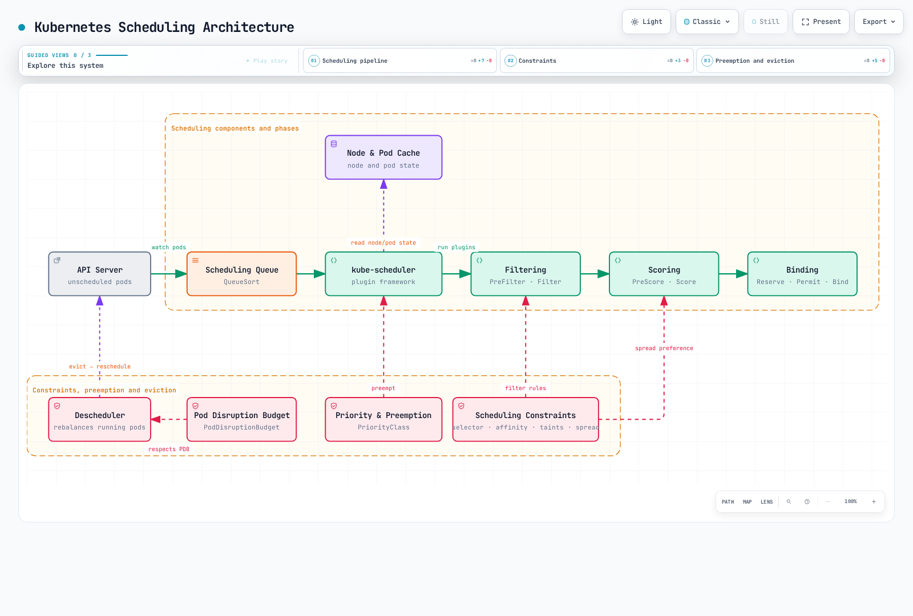
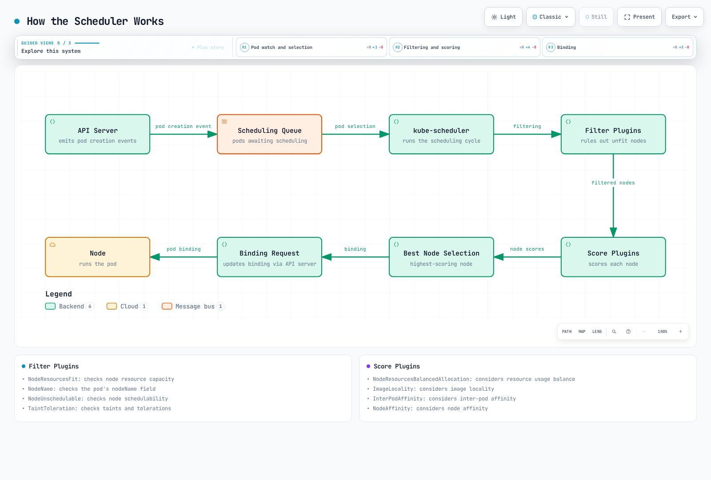
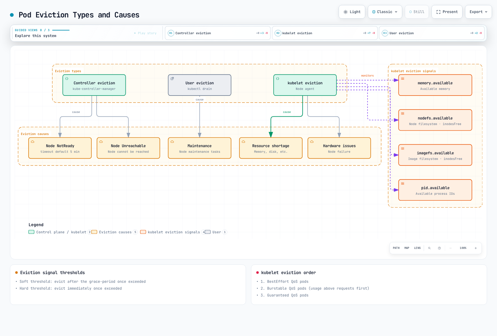
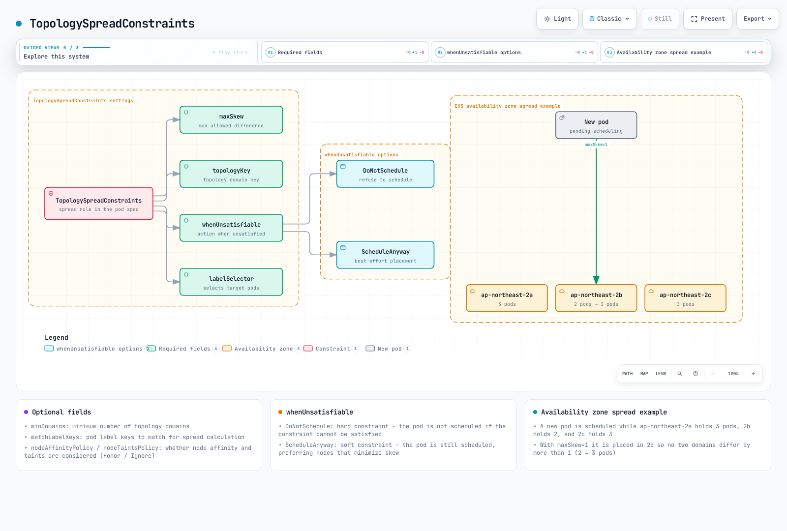
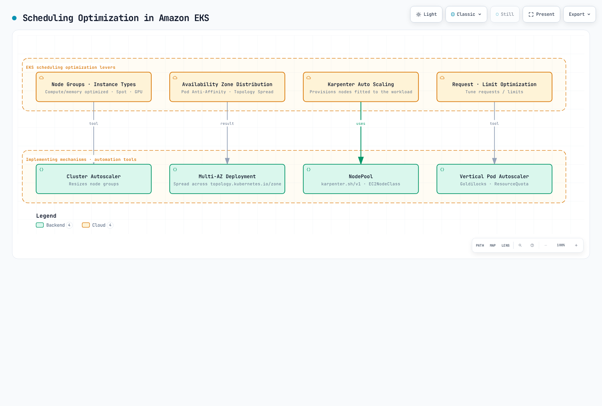

# Kubernetes 调度、抢占与驱逐

> **支持的版本**: Kubernetes 1.32 - 1.34
> **最后更新**: February 22, 2026

在 Kubernetes 中，调度是将 Pod 放置到合适 Node 上的过程。抢占是移除较低优先级 Pod 以为较高优先级 Pod 腾出空间的过程，而驱逐是在发生 Node 问题时安全迁移 Pod 的过程。本章将学习 Kubernetes 调度机制、Node 选择、抢占、驱逐，以及 Amazon EKS 中的调度优化方法。

## 实验环境设置

要跟随本文档中的示例，您需要以下工具和环境：

### 必需工具
- kubectl v1.34 或更高版本
- 可正常工作的 Kubernetes 集群（EKS、minikube、kind 等）
- 具有多个 Node 的集群（用于调度测试）

### 调度示例设置

```bash
# Create namespace
kubectl create namespace scheduling-demo

# Add labels to nodes (if you have multiple nodes)
kubectl label nodes <node-name> disktype=ssd
kubectl label nodes <node-name> gpu=true

# Create a pod using node affinity
kubectl -n scheduling-demo apply -f - <<EOF
apiVersion: v1
kind: Pod
metadata:
  name: nginx-ssd
spec:
  affinity:
    nodeAffinity:
      requiredDuringSchedulingIgnoredDuringExecution:
        nodeSelectorTerms:
        - matchExpressions:
          - key: disktype
            operator: In
            values:
            - ssd
  containers:
  - name: nginx
    image: nginx
EOF

# Create priority class
kubectl apply -f - <<EOF
apiVersion: scheduling.k8s.io/v1
kind: PriorityClass
metadata:
  name: high-priority
value: 1000000
globalDefault: false
description: "This priority class should be used for critical service pods only."
EOF

# Create Pod Disruption Budget (PDB)
kubectl -n scheduling-demo apply -f - <<EOF
apiVersion: policy/v1
kind: PodDisruptionBudget
metadata:
  name: nginx-pdb
spec:
  minAvailable: 1
  selector:
    matchLabels:
      app: nginx
EOF
```

## Kubernetes 调度架构



[🔍 查看交互式图表](https://www.atomai.click/kubernetes-docs/archmaps/en-core-08-scheduling-preemption-eviction-0.html)

## 调度概念对比

| 概念 | 目的 | 使用场景 | Kubernetes 版本 |
|---------|---------|-----------|-------------------|
| **Node Selector** | 将 Pod 放置在具有特定标签的 Node 上 | 简单 Node 选择 | 所有版本 |
| **Node Affinity** | 定义复杂的 Node 选择规则 | 高级 Node 选择 | 1.6+ |
| **Pod Affinity** | 将 Pod 放置在其他 Pod 附近 | 将相关 Service 共同放置 | 1.6+ |
| **Pod Anti-Affinity** | 将 Pod 放置在远离其他 Pod 的位置 | 确保高可用性 | 1.6+ |
| **Taints and Tolerations** | 仅允许特定 Pod 位于 Node 上 | 专用 Node、Node 隔离 | 1.6+ |
| **Topology Spread Constraints** | 将 Pod 分散到拓扑域中 | 跨可用区分布 | 1.16+（在 1.19 中 GA） |
| **Priority and Preemption** | 对重要工作负载进行优先排序 | 关键 Service 保障 | 1.8+（在 1.11 中 GA） |
| **Pod Disruption Budget** | 限制同时被中断的 Pod 数量 | 确保高可用性 | 1.4+（在 1.21 中 GA） |

## 基本调度概念

> **关键概念**：Kubernetes scheduler 是一个控制平面组件，用于选择运行 Pod 的最佳 Node，并分为过滤和评分两个阶段运行。

### 调度流程

1. **过滤阶段（Predicates）**
   - 确定可运行 Pod 的一组合适 Node
   - 考虑资源要求、Node selector、affinity 规则、taints/tolerations 等
   - 如果有任何条件不满足，则排除该 Node

2. **评分阶段（Priorities）**
   - 为通过过滤的 Node 分配分数
   - 考虑资源利用率、Pod 分布、affinity 偏好等
   - 选择得分最高的 Node

3. **绑定阶段**
   - 将 Pod 分配给所选 Node
   - 将绑定信息更新到 API server

## 目录
1. [调度概览](#scheduling-overview)
2. [Scheduler 的工作方式](#how-the-scheduler-works)
3. [Node 选择](#node-selection)
4. [Pod Affinity 和 Anti-Affinity](#pod-affinity-and-anti-affinity)
5. [Taints 和 Tolerations](#taints-and-tolerations)
6. [Node Affinity](#node-affinity)
7. [Pod 优先级和抢占](#pod-priority-and-preemption)
8. [Pod 驱逐](#pod-eviction)
9. [Pod Disruption Budget (PDB)](#pod-disruption-budget-pdb)
10. [Node 压力驱逐](#node-pressure-eviction)
11. [TopologySpreadConstraints](#topologyspreadconstraints)
12. [Pod 删除成本](#pod-deletion-cost)
13. [Descheduler](#descheduler)
14. [Amazon EKS 中的调度优化](#scheduling-optimization-in-amazon-eks)
15. [调度最佳实践](#scheduling-best-practices)
16. [结论](#conclusion)

## 调度概览

Kubernetes scheduler 是一个控制平面组件，可将 Pod 放置在合适的 Node 上。scheduler 会考虑多种因素来确定放置 Pod 的最佳 Node：

1. **资源要求**：Pod 请求的 CPU、内存和其他资源
2. **硬件/软件/策略约束**：Node selector、Node affinity、taints 等
3. **Affinity/Anti-Affinity 规范**：与其他 Pod 的放置关系
4. **数据本地性**：将 Pod 放置在靠近数据的位置
5. **工作负载间干扰**：最大程度减少不同工作负载之间的干扰
6. **截止时间**：考虑受时间约束的工作负载

### 调度流程

调度流程大体分为两个阶段：

1. **过滤**：确定可运行 Pod 的一组 Node
   - 检查是否满足资源要求
   - 检查 Node selector、affinity、taints 等约束

2. **评分**：对经过过滤的 Node 评分，以选择最佳 Node
   - 资源利用率平衡
   - Pod 间 affinity/anti-affinity
   - 数据本地性
   - Taints/tolerations

## Scheduler 的工作方式

Kubernetes scheduler 通过以下流程运行：



[🔍 查看交互式图表](https://www.atomai.click/kubernetes-docs/archmaps/en-core-08-scheduling-preemption-eviction-1.html)

1. **Pod 队列监视**：scheduler 监视 API server 中尚未调度的 Pod。
2. **Node 过滤**：确定可运行 Pod 的一组 Node。
3. **Node 评分**：对经过过滤的 Node 评分。
4. **Node 选择**：选择得分最高的 Node。
5. **绑定**：将 Pod 绑定到所选 Node。

### 调度 Plugin

Kubernetes scheduler 采用 Plugin 架构设计，具有可扩展性。各种 Plugin 会在调度流程的不同阶段运行：

1. **Filter Plugin**：过滤 Pod 无法运行的 Node
   - NodeResourcesFit：检查 Node 资源容量
   - NodeName：检查 Pod 的 nodeName 字段
   - NodeUnschedulable：检查 Node 是否可调度
   - TaintToleration：检查 taints 和 tolerations

2. **Score Plugin**：为 Node 分配分数
   - NodeResourcesBalancedAllocation：考虑资源使用平衡
   - ImageLocality：考虑镜像本地性
   - InterPodAffinity：考虑 Pod 间 affinity
   - NodeAffinity：考虑 Node affinity

### 多个 Scheduler

Kubernetes 可以同时运行多个 scheduler。这样可以为特定工作负载实现自定义调度逻辑。

```yaml
apiVersion: v1
kind: Pod
metadata:
  name: custom-scheduled-pod
spec:
  schedulerName: my-custom-scheduler
  containers:
  - name: container
    image: nginx
```

在上面的示例中，`schedulerName` 字段指定用于调度该 Pod 的 scheduler。

## Node 选择

Kubernetes 提供多种机制，可将 Pod 放置在特定 Node 上。


[🔍 查看交互式图表](https://www.atomai.click/kubernetes-docs/archmaps/en-core-08-scheduling-preemption-eviction-2.html)

### Node Selector

Node selector 是限制 Pod 只能放置在具有特定标签的 Node 上的最简单方法。

```yaml
apiVersion: v1
kind: Pod
metadata:
  name: gpu-pod
spec:
  nodeSelector:
    gpu: "true"
  containers:
  - name: gpu-container
    image: nvidia/cuda
```

在上面的示例中，该 Pod 仅放置在带有 `gpu=true` 标签的 Node 上。

### nodeName

您可以使用 `nodeName` 字段将 Pod 直接放置在特定 Node 上。该方法会绕过 scheduler，通常不建议使用。

```yaml
apiVersion: v1
kind: Pod
metadata:
  name: specific-node-pod
spec:
  nodeName: worker-node-1
  containers:
  - name: container
    image: nginx
```

在上面的示例中，该 Pod 被直接放置在名为 `worker-node-1` 的 Node 上。

## Pod Affinity 和 Anti-Affinity

Pod affinity 和 anti-affinity 提供了根据 Pod 之间关系放置 Pod 的方法。


[🔍 查看交互式图表](https://www.atomai.click/kubernetes-docs/archmaps/en-core-08-scheduling-preemption-eviction-3.html)

### Pod Affinity

Pod affinity 会使 Pod 与具有特定标签的 Pod 放置在同一 Node 或拓扑域中。

```yaml
apiVersion: v1
kind: Pod
metadata:
  name: frontend
spec:
  affinity:
    podAffinity:
      requiredDuringSchedulingIgnoredDuringExecution:
      - labelSelector:
          matchExpressions:
          - key: app
            operator: In
            values:
            - cache
        topologyKey: kubernetes.io/hostname
  containers:
  - name: frontend
    image: nginx
```

在上面的示例中，`frontend` Pod 与带有 `app=cache` 标签的 Pod 放置在同一 Host 上。

### Pod Anti-Affinity

Pod anti-affinity 会使 Pod 与具有特定标签的 Pod 放置在不同的 Node 或拓扑域中。

```yaml
apiVersion: v1
kind: Pod
metadata:
  name: frontend
  labels:
    app: frontend
spec:
  affinity:
    podAntiAffinity:
      requiredDuringSchedulingIgnoredDuringExecution:
      - labelSelector:
          matchExpressions:
          - key: app
            operator: In
            values:
            - frontend
        topologyKey: kubernetes.io/hostname
  containers:
  - name: frontend
    image: nginx
```

在上面的示例中，`frontend` Pod 与其他带有 `app=frontend` 标签的 Pod 放置在不同 Host 上。这有助于将同一应用程序的实例分散到多个 Node 上以实现高可用性。

### Affinity 类型

Pod affinity 和 anti-affinity 有两种类型：

1. **requiredDuringSchedulingIgnoredDuringExecution**：调度期间必须满足的硬性要求
2. **preferredDuringSchedulingIgnoredDuringExecution**：优先满足但并非必需的软性要求

```yaml
# preferredDuringSchedulingIgnoredDuringExecution example
affinity:
  podAffinity:
    preferredDuringSchedulingIgnoredDuringExecution:
    - weight: 100
      podAffinityTerm:
        labelSelector:
          matchExpressions:
          - key: app
            operator: In
            values:
            - cache
        topologyKey: kubernetes.io/hostname
```

在上面的示例中，`weight` 字段表示此偏好的权重。当存在多个偏好时，权重较高的偏好被视为更重要。

## Taints 和 Tolerations

Taints 和 tolerations 是允许 Node 拒绝特定 Pod 的机制。


[🔍 查看交互式图表](https://www.atomai.click/kubernetes-docs/archmaps/en-core-08-scheduling-preemption-eviction-4.html)

### Taints

Taints 应用于 Node，以限制 Pod 被调度到其上。

```bash
# Add taint to node
kubectl taint nodes node1 key=value:NoSchedule
```

有三种 taint effect：

1. **NoSchedule**：没有 toleration 的 Pod 不会被调度到该 Node 上
2. **PreferNoSchedule**：优先不将没有 toleration 的 Pod 调度到该 Node 上
3. **NoExecute**：没有 toleration 的 Pod 会从该 Node 驱逐

### Tolerations

Tolerations 应用于 Pod，使其能够被调度到带有 taint 的 Node 上。

```yaml
apiVersion: v1
kind: Pod
metadata:
  name: nginx
spec:
  tolerations:
  - key: "key"
    operator: "Equal"
    value: "value"
    effect: "NoSchedule"
  containers:
  - name: nginx
    image: nginx
```

在上面的示例中，该 Pod 可以被调度到具有 `key=value:NoSchedule` taint 的 Node 上。

### 使用场景

Taints 和 tolerations 的常见使用场景：

1. **专用 Node**：指定 Node 仅运行特定工作负载
2. **特殊硬件**：管理具有 GPU 等特殊硬件的 Node
3. **Node 维护**：阻止向维护中的 Node 调度新的 Pod
4. **Node 问题**：从存在问题的 Node 驱逐 Pod

### 默认 Taints

Kubernetes 会对一些 Node 应用默认 taint：

- **node.kubernetes.io/not-ready**：Node 未就绪
- **node.kubernetes.io/unreachable**：Node 不可达
- **node.kubernetes.io/memory-pressure**：Node 存在内存压力
- **node.kubernetes.io/disk-pressure**：Node 存在磁盘压力
- **node.kubernetes.io/pid-pressure**：Node 存在 PID 压力
- **node.kubernetes.io/network-unavailable**：Node 网络不可用
- **node.kubernetes.io/unschedulable**：Node 不可调度

## Node Affinity

Node affinity 提供了将 Pod 放置在特定 Node 集合上的更具表达力的方法。它能够指定比 Node selector 更复杂的条件。

### Node Affinity 类型

Node affinity 有两种类型：

1. **requiredDuringSchedulingIgnoredDuringExecution**：调度期间必须满足的硬性要求
2. **preferredDuringSchedulingIgnoredDuringExecution**：优先满足但并非必需的软性要求

```yaml
apiVersion: v1
kind: Pod
metadata:
  name: with-node-affinity
spec:
  affinity:
    nodeAffinity:
      requiredDuringSchedulingIgnoredDuringExecution:
        nodeSelectorTerms:
        - matchExpressions:
          - key: kubernetes.io/e2e-az-name
            operator: In
            values:
            - e2e-az1
            - e2e-az2
      preferredDuringSchedulingIgnoredDuringExecution:
      - weight: 1
        preference:
          matchExpressions:
          - key: another-node-label-key
            operator: In
            values:
            - another-node-label-value
  containers:
  - name: with-node-affinity
    image: nginx
```

在上面的示例中，该 Pod 仅放置在 `kubernetes.io/e2e-az-name` 标签为 `e2e-az1` 或 `e2e-az2` 的 Node 上。此外，优先将其放置在具有 `another-node-label-key=another-node-label-value` 标签的 Node 上。

### Operators

Node affinity 支持多种 operator：

- **In**：标签值匹配指定值之一
- **NotIn**：标签值不匹配指定值
- **Exists**：存在具有指定 key 的标签
- **DoesNotExist**：不存在具有指定 key 的标签
- **Gt**：标签值大于指定值
- **Lt**：标签值小于指定值

## Pod 优先级和抢占

Kubernetes 提供 Pod 优先级和抢占功能，以确保重要工作负载能够获得集群资源。


[🔍 查看交互式图表](https://www.atomai.click/kubernetes-docs/archmaps/en-core-08-scheduling-preemption-eviction-5.html)

### PriorityClass

PriorityClass 定义 Pod 的相对重要性。优先级值越高，Pod 越重要。

```yaml
apiVersion: scheduling.k8s.io/v1
kind: PriorityClass
metadata:
  name: high-priority
value: 1000000
globalDefault: false
description: "This priority class should be used for critical workloads."
```

在上面的示例中，`value` 字段表示优先级值。值越高，优先级越高。如果将 `globalDefault` 字段设为 `true`，则此 PriorityClass 会应用于未指定 PriorityClass 的 Pod。

### 将 PriorityClass 应用于 Pod

要将 PriorityClass 应用于 Pod，请使用 `priorityClassName` 字段。

```yaml
apiVersion: v1
kind: Pod
metadata:
  name: high-priority-pod
spec:
  priorityClassName: high-priority
  containers:
  - name: container
    image: nginx
```

### 抢占

抢占是移除较低优先级 Pod 以调度较高优先级 Pod 的过程。当 scheduler 找不到可调度较高优先级 Pod 的 Node 时，它会抢占较低优先级 Pod 以获得资源。

抢占流程：
1. Scheduler 找不到可调度较高优先级 Pod 的 Node
2. Scheduler 选择一个 Node，通过抢占移除较低优先级 Pod
3. 向所选 Node 上的较低优先级 Pod 发送终止信号
4. 当 Pod 优雅终止后，在该 Node 上调度较高优先级 Pod

### 抢占注意事项

使用抢占时需要考虑的事项：

1. **优雅终止期**：被抢占的 Pod 会在 `terminationGracePeriodSeconds` 指定的时间内经历优雅终止流程
2. **PodDisruptionBudget**：抢占不遵守 PodDisruptionBudget
3. **系统 PriorityClass**：Kubernetes 为系统组件提供 PriorityClass
   - `system-cluster-critical`：对集群运行至关重要的 Pod
   - `system-node-critical`：对 Node 运行至关重要的 Pod

## Pod 驱逐

Pod 驱逐是在发生 Node 问题时安全迁移 Pod 的过程。驱逐可能因多种原因发生。



[🔍 查看交互式图表](https://www.atomai.click/kubernetes-docs/archmaps/en-core-08-scheduling-preemption-eviction-6.html)

### 驱逐类型

1. **由 kube-controller-manager 驱逐**：
   - 当 Node 保持 NotReady 状态超过 `pod-eviction-timeout` 时长（默认 5 分钟）
   - 当 Node 处于 Unreachable 状态时

2. **由 kubelet 驱逐**：
   - Node 资源不足（内存、磁盘等）
   - 硬件问题

3. **由用户驱逐**：
   - 执行 `kubectl drain` 命令
   - Node 维护任务

### kubelet 驱逐信号

kubelet 监视以下驱逐信号：

1. **memory.available**：可用内存
2. **nodefs.available**：Node 文件系统中的可用空间
3. **nodefs.inodesFree**：Node 文件系统中的可用 inode
4. **imagefs.available**：镜像文件系统中的可用空间
5. **imagefs.inodesFree**：镜像文件系统中的可用 inode
6. **pid.available**：可用进程 ID

可以为每个信号设置软阈值和硬阈值：

- **软阈值**：超过阈值后，在 `grace-period` 之后驱逐 Pod
- **硬阈值**：超过阈值后立即驱逐 Pod

```yaml
# kubelet configuration example
evictionHard:
  memory.available: "100Mi"
  nodefs.available: "10%"
  nodefs.inodesFree: "5%"
  imagefs.available: "15%"
evictionSoft:
  memory.available: "200Mi"
  nodefs.available: "15%"
evictionSoftGracePeriod:
  memory.available: "1m"
  nodefs.available: "2m"
evictionPressureTransitionPeriod: "30s"
```

### 驱逐优先级

kubelet 按以下顺序驱逐 Pod：

1. 具有 BestEffort QoS class 的 Pod
2. 具有 Burstable QoS class 的 Pod（从资源使用量超过请求量的 Pod 开始）
3. 具有 Guaranteed QoS class 的 Pod（请求量与限制相等的 Pod）

## Pod Disruption Budget (PDB)

Pod Disruption Budget (PDB) 是在自愿中断期间维持应用程序可用性的方法。PDB 限制可同时中断的 Pod 数量。


[🔍 查看交互式图表](https://www.atomai.click/kubernetes-docs/archmaps/en-core-08-scheduling-preemption-eviction-7.html)

### PDB 定义

```yaml
apiVersion: policy/v1
kind: PodDisruptionBudget
metadata:
  name: frontend-pdb
spec:
  minAvailable: 2
  selector:
    matchLabels:
      app: frontend
```

或

```yaml
apiVersion: policy/v1
kind: PodDisruptionBudget
metadata:
  name: frontend-pdb
spec:
  maxUnavailable: 1
  selector:
    matchLabels:
      app: frontend
```

在上面的示例中：
- `minAvailable`：必须始终保持可用的最小 Pod 数量
- `maxUnavailable`：可同时不可用的最大 Pod 数量
- `selector`：选择 PDB 所适用 Pod 的标签 selector

### PDB 运行方式

1. 当发生 Node drain 等自愿中断时，Kubernetes 会检查 PDB
2. 如果满足 PDB 条件，则继续驱逐 Pod
3. 如果不满足 PDB 条件，则拒绝驱逐 Pod

### PDB 最佳实践

1. **为所有关键工作负载设置 PDB**：为所有需要高可用性的工作负载设置 PDB
2. **选择合适的值**：选择适合工作负载特性的 `minAvailable` 或 `maxUnavailable` 值
3. **考虑副本数**：PDB 值必须小于副本数
4. **定期测试**：通过 Node drain 和类似任务测试 PDB 运行情况

## Node 压力驱逐

Node 压力驱逐是因 Node 资源不足而驱逐 Pod 的机制。

### Node Condition 状态

kubelet 报告以下 Node condition 状态：

1. **MemoryPressure**：Node 内存不足
2. **DiskPressure**：Node 磁盘空间不足
3. **PIDPressure**：Node 可用进程 ID 不足

发生这些 condition 时，kubelet 会驱逐 Pod 以获得资源。

### 驱逐策略配置

可在 kubelet 配置中设置驱逐策略：

```yaml
# kubelet configuration example
evictionHard:
  memory.available: "100Mi"
  nodefs.available: "10%"
  nodefs.inodesFree: "5%"
  imagefs.available: "15%"
evictionSoft:
  memory.available: "200Mi"
  nodefs.available: "15%"
evictionSoftGracePeriod:
  memory.available: "1m"
  nodefs.available: "2m"
evictionMinimumReclaim:
  memory.available: "50Mi"
  nodefs.available: "5%"
evictionPressureTransitionPeriod: "30s"
```

在上面的示例中：
- `evictionMinimumReclaim`：驱逐后必须回收的最小资源量
- `evictionPressureTransitionPeriod`：压力状态转换之间的等待时间

## TopologySpreadConstraints

TopologySpreadConstraints 可以精细控制 Pod 如何跨可用区、Node 或 Region 等拓扑域进行分布。与 Pod anti-affinity 相比，该功能在实现高可用性和高效资源利用方面提供更大的灵活性。



[🔍 查看交互式图表](https://www.atomai.click/kubernetes-docs/archmaps/en-core-08-scheduling-preemption-eviction-8.html)

### 关键字段

| 字段 | 描述 | 必需 |
|-------|-------------|----------|
| **maxSkew** | 任意两个拓扑域之间允许的最大 Pod 数量差异 | 是 |
| **topologyKey** | 定义拓扑域的 Node 标签 key | 是 |
| **whenUnsatisfiable** | 无法满足约束时的操作：`DoNotSchedule` 或 `ScheduleAnyway` | 是 |
| **labelSelector** | 选择用于计算分布的 Pod | 是 |
| **minDomains** | 所需的最小拓扑域数量（1.27+） | 否 |
| **matchLabelKeys** | 用于分布计算的待匹配 Pod 标签 key（1.27+） | 否 |

### whenUnsatisfiable 选项

- **DoNotSchedule**：如果无法满足约束，scheduler 不会调度 Pod（硬约束）
- **ScheduleAnyway**：scheduler 仍会调度 Pod，并优先选择可最小化偏差的 Node（软约束）

### EKS 可用区分布示例

```yaml
apiVersion: apps/v1
kind: Deployment
metadata:
  name: web-app
spec:
  replicas: 6
  selector:
    matchLabels:
      app: web
  template:
    metadata:
      labels:
        app: web
    spec:
      topologySpreadConstraints:
      - maxSkew: 1
        topologyKey: topology.kubernetes.io/zone
        whenUnsatisfiable: DoNotSchedule
        labelSelector:
          matchLabels:
            app: web
      - maxSkew: 1
        topologyKey: kubernetes.io/hostname
        whenUnsatisfiable: ScheduleAnyway
        labelSelector:
          matchLabels:
            app: web
      containers:
      - name: web
        image: nginx:1.25
        resources:
          requests:
            cpu: 100m
            memory: 128Mi
```

此配置确保：
1. Pod 在可用区之间均匀分布（硬约束）
2. Pod 优先在每个区内的 Node 之间分布（软约束）

### minDomains 和 matchLabelKeys (Kubernetes 1.27+)

```yaml
apiVersion: apps/v1
kind: Deployment
metadata:
  name: app-with-min-domains
spec:
  replicas: 4
  selector:
    matchLabels:
      app: distributed-app
  template:
    metadata:
      labels:
        app: distributed-app
        version: v1
    spec:
      topologySpreadConstraints:
      - maxSkew: 1
        topologyKey: topology.kubernetes.io/zone
        whenUnsatisfiable: DoNotSchedule
        labelSelector:
          matchLabels:
            app: distributed-app
        minDomains: 3
        matchLabelKeys:
        - version
      containers:
      - name: app
        image: myapp:v1
```

- **minDomains**：确保 Pod 分布在至少 3 个 zone 中。如果可用 zone 少于该数量，调度将被阻止。
- **matchLabelKeys**：在 selector 中自动使用 Pod 的 `version` 标签值，从而无需修改 selector 即可按 revision 分布。

### 相对于 Pod Anti-Affinity 的优势

| 方面 | TopologySpreadConstraints | Pod Anti-Affinity |
|--------|---------------------------|-------------------|
| **灵活性** | 允许受控偏差（maxSkew > 1） | 二元选择：同一域或不同域 |
| **软约束** | 使用 `ScheduleAnyway` 实现尽力而为 | `preferredDuringScheduling`，但控制能力较弱 |
| **多层级** | 使用不同 topologyKey 的多个约束 | 需要复杂的嵌套规则 |
| **性能** | 大规模场景下 scheduler 性能更好 | Pod 较多时可能减慢调度 |
| **使用场景** | 可容忍偏差的均匀分布 | 严格隔离 |

## Pod 删除成本

Pod 删除成本是一项功能，可让您控制在缩容操作期间优先移除哪些 Pod。通过设置 `controller.kubernetes.io/pod-deletion-cost` annotation，您可以影响 Pod 的终止顺序。

### 工作原理

当 controller（如 HPA 或手动缩容）需要减少副本时，它会考虑：
1. 删除成本较低的 Pod 会先被移除
2. 默认删除成本为 0
3. 有效范围：-2147483648 到 2147483647

### 基本示例

```yaml
apiVersion: v1
kind: Pod
metadata:
  name: worker-pod
  annotations:
    controller.kubernetes.io/pod-deletion-cost: "100"
spec:
  containers:
  - name: worker
    image: worker:latest
```

### HPA 缩容优先级控制

使用删除成本在 HPA 缩容期间保护重要 Pod：

```yaml
apiVersion: apps/v1
kind: Deployment
metadata:
  name: web-service
spec:
  replicas: 5
  selector:
    matchLabels:
      app: web
  template:
    metadata:
      labels:
        app: web
      # Lower cost pods are deleted first during scale-down
      annotations:
        controller.kubernetes.io/pod-deletion-cost: "0"
    spec:
      containers:
      - name: web
        image: nginx:1.25
```

### 缓存保护模式

通过动态调整删除成本来保护具有热缓存的 Pod：

```yaml
apiVersion: apps/v1
kind: Deployment
metadata:
  name: cache-service
spec:
  replicas: 3
  selector:
    matchLabels:
      app: cache
  template:
    metadata:
      labels:
        app: cache
    spec:
      containers:
      - name: cache
        image: redis:7
      - name: cost-updater
        image: bitnami/kubectl:latest
        command:
        - /bin/sh
        - -c
        - |
          # Update deletion cost based on cache warmth
          while true; do
            CACHE_SIZE=$(redis-cli DBSIZE | awk '{print $2}')
            # Higher cache size = higher cost = less likely to be deleted
            kubectl annotate pod $POD_NAME \
              controller.kubernetes.io/pod-deletion-cost="$CACHE_SIZE" \
              --overwrite
            sleep 60
          done
        env:
        - name: POD_NAME
          valueFrom:
            fieldRef:
              fieldPath: metadata.name
```

### 实际使用场景

1. **有状态工作负载**：保护积累了状态的 Pod
2. **Leader 选举**：让 Leader Pod 保持运行更长时间
3. **连接排空**：为长期运行的连接留出时间
4. **缓存预热**：保留具有热缓存的 Pod
5. **批处理**：保留正在处理大型作业的 Pod

## Descheduler

Descheduler 是一个 Kubernetes 组件，它从 Node 驱逐 Pod，以允许 scheduler 将其重新调度到更合适的 Node。不同于只放置新 Pod 的 scheduler，descheduler 有助于长期维持最佳 Pod 放置。


[🔍 查看交互式图表](https://www.atomai.click/kubernetes-docs/archmaps/en-core-08-scheduling-preemption-eviction-9.html)

### 为什么需要重新调度

1. **集群变化**：添加了新的 Node、Node 标签发生变化
2. **Pod 漂移**：初始放置随时间推移变得不再最佳
3. **Affinity 违规**：集群变化后违反规则
4. **资源不平衡**：部分 Node 使用过度，其他 Node 使用不足
5. **失败的 Pod**：Pod 卡在重启循环中

### 关键策略

| 策略 | 描述 | 使用场景 |
|----------|-------------|----------|
| **RemoveDuplicates** | 从同一 Node 移除重复 Pod | 在 Node 故障后确保 HA |
| **LowNodeUtilization** | 将 Pod 从使用过度的 Node 移至使用不足的 Node | 平衡集群资源 |
| **RemovePodsHavingTooManyRestarts** | 驱逐重启次数过多的 Pod | 清理有问题的 Pod |
| **PodLifeTime** | 驱逐超过指定存活时间的 Pod | 强制重新调度 |
| **RemovePodsViolatingInterPodAntiAffinity** | 驱逐违反 anti-affinity 规则的 Pod | 恢复 affinity 合规性 |
| **RemovePodsViolatingNodeAffinity** | 驱逐违反 Node affinity 的 Pod | 恢复 affinity 合规性 |
| **RemovePodsViolatingTopologySpreadConstraint** | 驱逐违反分布约束的 Pod | 恢复均匀分布 |

### Helm 安装

```bash
# Add the descheduler Helm repository
helm repo add descheduler https://kubernetes-sigs.github.io/descheduler/

# Install descheduler
helm install descheduler descheduler/descheduler \
  --namespace kube-system \
  --set schedule="*/5 * * * *" \
  --set deschedulerPolicy.strategies.RemoveDuplicates.enabled=true \
  --set deschedulerPolicy.strategies.LowNodeUtilization.enabled=true
```

### DeschedulerPolicy 配置

```yaml
apiVersion: "descheduler/v1alpha2"
kind: "DeschedulerPolicy"
profiles:
- name: default
  pluginConfig:
  - name: RemoveDuplicates
    args:
      excludeOwnerKinds:
      - DaemonSet
  - name: LowNodeUtilization
    args:
      thresholds:
        cpu: 20
        memory: 20
        pods: 20
      targetThresholds:
        cpu: 50
        memory: 50
        pods: 50
      useDeviationThresholds: false
  - name: RemovePodsHavingTooManyRestarts
    args:
      podRestartThreshold: 10
      includingInitContainers: true
  - name: PodLifeTime
    args:
      maxPodLifeTimeSeconds: 86400  # 24 hours
      podStatusPhases:
      - Running
  - name: RemovePodsViolatingTopologySpreadConstraint
    args:
      constraints:
      - DoNotSchedule
  plugins:
    deschedule:
      enabled:
      - RemoveDuplicates
      - LowNodeUtilization
      - RemovePodsHavingTooManyRestarts
      - PodLifeTime
      - RemovePodsViolatingTopologySpreadConstraint
```

### 遵守 PDB

Descheduler 会遵守 Pod Disruption Budget (PDB)。如果驱逐某个 Pod 会违反 PDB，descheduler 不会驱逐该 Pod：

```yaml
apiVersion: policy/v1
kind: PodDisruptionBudget
metadata:
  name: web-pdb
spec:
  minAvailable: 2
  selector:
    matchLabels:
      app: web
```

设置此 PDB 后，descheduler 将确保在重新调度操作期间，至少 2 个带有 `app: web` 标签的 Pod 保持可用。

### Descheduler CronJob 示例

```yaml
apiVersion: batch/v1
kind: CronJob
metadata:
  name: descheduler
  namespace: kube-system
spec:
  schedule: "*/30 * * * *"
  jobTemplate:
    spec:
      template:
        spec:
          serviceAccountName: descheduler
          containers:
          - name: descheduler
            image: registry.k8s.io/descheduler/descheduler:v0.28.0
            args:
            - --policy-config-file=/policy/policy.yaml
            - --v=3
            volumeMounts:
            - name: policy
              mountPath: /policy
          volumes:
          - name: policy
            configMap:
              name: descheduler-policy
          restartPolicy: OnFailure
```

> **深入学习**：有关自定义 scheduler 的详细信息，请参阅：
> - [自定义 Scheduler 第 1 部分：基本概念](../scheduling/01-custom-scheduler-part1.md)
> - [自定义 Scheduler 第 2 部分：实现](../scheduling/02-custom-scheduler-part2.md)
> - [自定义 Scheduler 第 3 部分：高级功能](../scheduling/03-custom-scheduler-part3.md)

## Amazon EKS 中的调度优化

在 Amazon EKS 中，您可以使用 Kubernetes 调度功能优化工作负载。



[🔍 查看交互式图表](https://www.atomai.click/kubernetes-docs/archmaps/en-core-08-scheduling-preemption-eviction-11.html)

### Node Group 和 Instance Type

在 EKS 中，您可以利用各种 Node group 和 instance type 来提供适合工作负载的资源：

1. **多种 Instance Type**：计算优化、内存优化、存储优化等
2. **Spot Instance**：用于成本效益型工作负载的 Spot Instance
3. **GPU Instance**：用于 AI/ML 工作负载的 GPU Instance

您可以使用 Node 标签和 taint 将特定工作负载放置在特定 Node group 上：

```bash
# Set labels and taints when creating node group
eksctl create nodegroup \
  --cluster my-cluster \
  --name gpu-nodes \
  --node-labels="workload-type=gpu" \
  --node-type=p3.2xlarge \
  --taints="gpu=true:NoSchedule"
```

### 可用区分布

在 EKS 中，您可以使用 Pod anti-affinity 和 topology spread constraints 将工作负载分布到多个可用区：

```yaml
apiVersion: apps/v1
kind: Deployment
metadata:
  name: web-server
spec:
  replicas: 3
  selector:
    matchLabels:
      app: web
  template:
    metadata:
      labels:
        app: web
    spec:
      topologySpreadConstraints:
      - maxSkew: 1
        topologyKey: topology.kubernetes.io/zone
        whenUnsatisfiable: DoNotSchedule
        labelSelector:
          matchLabels:
            app: web
      containers:
      - name: web
        image: nginx
```

在上面的示例中，`topologySpreadConstraints` 将 Pod 均匀分布到多个可用区。

### 使用 Karpenter 自动扩缩

在 Amazon EKS 中，您可以使用 Karpenter 自动预置适合工作负载的 Node：

```yaml
apiVersion: karpenter.sh/v1
kind: NodePool
metadata:
  name: default
spec:
  template:
    spec:
      requirements:
        - key: karpenter.sh/capacity-type
          operator: In
          values: ["spot", "on-demand"]
        - key: kubernetes.io/arch
          operator: In
          values: ["amd64", "arm64"]
      nodeClassRef:
        name: default-class
  limits:
    cpu: 1000
    memory: 1000Gi
  disruption:
    consolidationPolicy: WhenEmpty
    consolidateAfter: 30s
---
apiVersion: karpenter.k8s.aws/v1
kind: EC2NodeClass
metadata:
  name: default-class
spec:
  subnetSelector:
    karpenter.sh/discovery: my-cluster
  securityGroupSelector:
    karpenter.sh/discovery: my-cluster
```

Karpenter 通过为 Pod 资源要求选择最佳 Instance Type 来优化成本。

### 资源 Request 和 Limit 优化

在 EKS 中优化工作负载资源 request 和 limit 非常重要：

1. **Vertical Pod Autoscaler (VPA)**：根据实际工作负载资源使用情况优化资源 request
2. **Goldilocks**：可视化 VPA 建议，以支持资源 request 优化
3. **Resource Quotas**：限制每个 namespace 的资源使用量

```yaml
# VPA example
apiVersion: autoscaling.k8s.io/v1
kind: VerticalPodAutoscaler
metadata:
  name: frontend-vpa
spec:
  targetRef:
    apiVersion: apps/v1
    kind: Deployment
    name: frontend
  updatePolicy:
    updateMode: "Auto"
```

## 调度最佳实践

在 Kubernetes 和 EKS 中优化调度的最佳实践：

1. **设置合适的资源 request 和 limit**：
   - 根据实际工作负载资源使用情况设置资源 request
   - 为重要工作负载设置合适的资源 limit
   - 使用 VPA 自动优化资源 request

2. **工作负载分布**：
   - 使用 Pod anti-affinity 将重要工作负载分布到多个 Node
   - 使用 topology spread constraints 将工作负载分布到多个可用区
   - 使用 Node affinity 将特定工作负载放置在特定 Node 上

3. **Node 资源优化**：
   - 使用多种 Instance Type 为工作负载提供合适的资源
   - 使用 Spot Instance 优化成本
   - 使用 Karpenter 自动预置适合工作负载的 Node

4. **PDB 配置**：
   - 为重要工作负载设置 PDB
   - 选择适合工作负载特性的 `minAvailable` 或 `maxUnavailable` 值
   - 定期测试 PDB 运行情况

5. **优先级和抢占配置**：
   - 为重要工作负载设置高优先级 PriorityClass
   - 为系统组件使用 `system-cluster-critical` 或 `system-node-critical` PriorityClass
   - 了解并测试抢占影响

6. **Node taints 和 tolerations**：
   - 为专用工作负载设置专用 Node
   - 对维护中的 Node 应用 taint
   - 设置合适的 toleration

## 结论

Kubernetes 调度、抢占和驱逐机制在高效管理集群资源和维持工作负载可用性方面发挥重要作用。通过了解和使用这些功能，您可以在 Amazon EKS 集群中优化并可靠地运行工作负载。

调度优化是一个持续的过程，应根据工作负载特性和集群状态不断进行调整。使用监控工具跟踪集群资源使用情况，并按需调整调度策略非常重要。

## 测验

要测试您在本章中学到的知识，请尝试完成[调度、抢占和驱逐测验](../quizzes/core/08-scheduling-preemption-eviction-quiz.md)。
