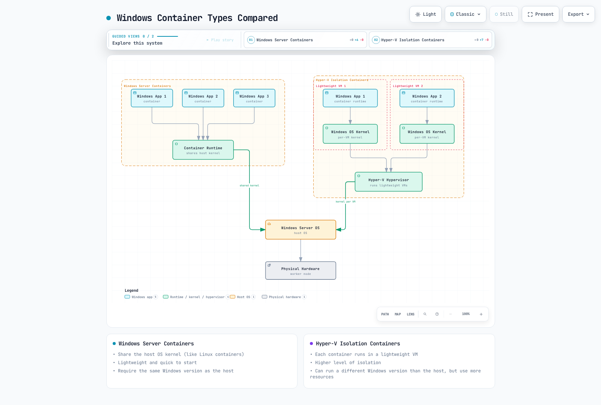

# Kubernetes 中的 Windows

> **支持的版本**: Kubernetes 1.32, 1.33, 1.34
> **最后更新**: February 11, 2026

Kubernetes 最初是为 Linux 容器设计的，但从 1.14 版本开始增加了对 Windows 容器的生产支持。本章将探讨如何在 Kubernetes 中运行 Windows 工作负载、相关架构、限制，以及 Amazon EKS 中的 Windows 支持。

## 目录
1. [Windows 容器概述](#windows-container-overview)
2. [Kubernetes Windows 支持架构](#kubernetes-windows-support-architecture)
3. [Windows 节点限制](#windows-node-limitations)
4. [Windows 节点设置](#windows-node-setup)
5. [部署 Windows 容器](#deploying-windows-containers)
6. [网络](#networking)
7. [存储](#storage)
8. [监控和日志记录](#monitoring-and-logging)
9. [安全性](#security)
10. [Amazon EKS 中的 Windows 支持](#windows-support-in-amazon-eks)
11. [最佳实践](#best-practices)
12. [结论](#conclusion)

## Windows 容器概述

Windows 容器是在 Windows 操作系统上运行的容器，可让您将 Windows 应用程序容器化并进行部署。

### Windows 容器类型

Windows 容器有两种类型：

1. **Windows Server Containers**：与 Linux 容器类似，它们共享主机 OS 内核。它们轻量且启动迅速，但要求与主机使用相同的 Windows 版本。

2. **Hyper-V Isolation Containers**：每个容器都在轻量级 VM 中运行，提供更高级别的隔离。它们可以运行与主机不同的 Windows 版本，但会使用更多资源。

下图展示了两种 Windows 容器类型之间的架构差异：



[🔍 查看交互式图表](https://www.atomai.click/kubernetes-docs/archmaps/en-core-10-windows-in-kubernetes-0.html)

### Windows 容器镜像

Windows 容器镜像基于 Microsoft 提供的基础镜像：

1. **Windows Server Core**：提供最小 Windows Server 环境的轻量级镜像
2. **Nano Server**：占用空间更小的超轻量级镜像
3. **Windows**：提供完整 Windows Server 环境的镜像

Dockerfile 示例：

```dockerfile
FROM mcr.microsoft.com/windows/servercore:ltsc2019
WORKDIR /app
COPY . .
RUN powershell -Command "Install-WindowsFeature Web-Server"
EXPOSE 80
CMD ["powershell", "-Command", "Start-Service W3SVC; Get-Content -Path 'C:\\inetpub\\logs\\LogFiles\\W3SVC1\\u_ex*' -Wait"]
```

## Kubernetes Windows 支持架构

Kubernetes 中的 Windows 支持基于混合环境。控制平面组件始终在 Linux 上运行，而工作节点可以是 Linux 或 Windows。

### 架构概述

Kubernetes 中的 Windows 支持架构如下：

1. **Linux 控制平面**：kube-apiserver、kube-controller-manager、kube-scheduler 和 etcd 始终在 Linux 上运行。
2. **Linux 工作节点**：运行系统组件（CoreDNS、metrics-server 等）。
3. **Windows 工作节点**：运行 Windows 应用程序工作负载。


[🔍 查看交互式图表](https://www.atomai.click/kubernetes-docs/archmaps/en-core-10-windows-in-kubernetes-1.html)

### Windows 节点组件

在 Windows 节点上运行的 Kubernetes 组件：

1. **kubelet**：管理节点上的 Pod 和容器
2. **kube-proxy**：管理网络规则
3. **CNI Plugin**：网络配置
4. **CSI Plugin**：存储管理

## Windows 节点限制

在 Kubernetes 中使用 Windows 节点时，需要注意若干限制。

### 功能限制

1. **特权容器**：Windows 不支持特权容器。
2. **主机网络模式**：Windows Pod 无法使用主机网络模式。
3. **Pod 安全上下文**：不支持部分安全上下文功能（runAsUser、fsGroup 等）。
4. **DaemonSet**：在 Windows 节点上运行的 DaemonSet 需要特殊考虑。
5. **emptyDir 卷**：Windows 不支持基于内存的 emptyDir 卷。
6. **资源限制**：CPU 限制在 Windows 上的应用方式不同。

### 网络限制

1. **网络模式**：Windows 仅支持 L3 网络。
2. **Service 类型**：Windows 节点对某些 Service 类型存在限制。
3. **负载均衡**：某些负载均衡功能可能受限。

### 操作系统版本兼容性

Windows 容器与主机 OS 版本之间存在重要的兼容性注意事项：

| 容器基础镜像 | 兼容的主机 OS 版本 |
|---------------------|---------------------------|
| Windows Server 2019 | Windows Server 2019 |
| Windows Server 2022 | Windows Server 2022 |

Hyper-V 隔离可以放宽这些限制，但需要额外资源。
## Windows 节点设置

让我们了解将 Windows 节点添加到 Kubernetes 集群的过程。

### 前提条件

在设置 Windows 节点之前，请确认以下条件：

1. **Kubernetes 版本**：1.14 或更高版本
2. **Windows 版本**：Windows Server 2019 或更高版本
3. **网络插件**：支持 Windows 的 CNI 插件（Calico、Flannel 等）
4. **容器运行时**：Docker、containerd 等

### 准备 Windows 节点

准备 Windows 节点的步骤：

1. **安装 Windows Server**：安装 Windows Server 2019 或更高版本
2. **启用容器功能**：

```powershell
Install-WindowsFeature -Name Containers
Restart-Computer -Force
```

3. **安装 Docker**：

```powershell
Install-Module -Name DockerMsftProvider -Repository PSGallery -Force
Install-Package -Name Docker -ProviderName DockerMsftProvider -Force
Restart-Computer -Force
```

4. **安装 Kubernetes 组件**：

```powershell
# Create directory
mkdir -p c:\k

# Download kubelet, kubeadm, kubectl
curl.exe -LO https://dl.k8s.io/v1.22.0/bin/windows/amd64/kubelet.exe
curl.exe -LO https://dl.k8s.io/v1.22.0/bin/windows/amd64/kubectl.exe
curl.exe -LO https://dl.k8s.io/v1.22.0/bin/windows/amd64/kube-proxy.exe
curl.exe -LO https://github.com/kubernetes-sigs/sig-windows-tools/releases/latest/download/wins.exe

# Move files to C:\k
mv kubelet.exe C:\k
mv kubectl.exe C:\k
mv kube-proxy.exe C:\k
mv wins.exe C:\k
```

5. **配置网络**：

```powershell
# Set firewall rules
New-NetFirewallRule -Name kubelet -DisplayName 'kubelet' -Enabled True -Direction Inbound -Protocol TCP -Action Allow -LocalPort 10250
New-NetFirewallRule -Name https -DisplayName 'https' -Enabled True -Direction Inbound -Protocol TCP -Action Allow -LocalPort 443
New-NetFirewallRule -Name http -DisplayName 'http' -Enabled True -Direction Inbound -Protocol TCP -Action Allow -LocalPort 80
```

### 使用 kubeadm 加入 Windows 节点

在 Linux 控制平面上生成加入令牌：

```bash
kubeadm token create --print-join-command
```

在 Windows 节点上运行加入命令：

```powershell
# Run kubeadm join command
kubeadm join <control-plane-host>:<control-plane-port> --token <token> --discovery-token-ca-cert-hash sha256:<hash>

# Register and start kubelet service
sc.exe create kubelet binPath= "C:\k\kubelet.exe --windows-service --kubeconfig=C:\k\config"
Start-Service kubelet
```

### 设置 Windows 节点标签

在 Windows 节点上设置适当的标签以控制工作负载调度：

```bash
kubectl label node <windows-node-name> kubernetes.io/os=windows
kubectl label node <windows-node-name> kubernetes.io/arch=amd64
```

## 部署 Windows 容器

让我们了解如何将 Windows 容器部署到 Kubernetes。

### 使用节点选择器

部署 Windows 工作负载时，使用节点选择器以确保它们被调度到 Windows 节点：

```yaml
apiVersion: apps/v1
kind: Deployment
metadata:
  name: iis-deployment
spec:
  replicas: 2
  selector:
    matchLabels:
      app: iis
  template:
    metadata:
      labels:
        app: iis
    spec:
      nodeSelector:
        kubernetes.io/os: windows
      containers:
      - name: iis
        image: mcr.microsoft.com/windows/servercore/iis:windowsservercore-ltsc2019
        resources:
          limits:
            cpu: 1
            memory: 800Mi
          requests:
            cpu: .1
            memory: 300Mi
        ports:
        - containerPort: 80
```

### 资源请求和限制

Windows 容器的资源请求和限制与 Linux 容器的处理方式不同：

1. **CPU 限制**：CPU 限制在 Windows 上的应用方式不同。例如，CPU 限制为 1 表示可以使用单个 CPU 核心的 100%。
2. **内存限制**：Windows 容器会遵守内存限制，但某些系统进程可能会导致额外开销。

### 容器自定义

在 Windows 容器中运行自定义脚本：

```yaml
apiVersion: v1
kind: Pod
metadata:
  name: windows-custom-script
spec:
  nodeSelector:
    kubernetes.io/os: windows
  containers:
  - name: windows-container
    image: mcr.microsoft.com/windows/servercore:ltsc2019
    command:
    - powershell.exe
    - -Command
    - |
      while ($true) {
        Write-Host "Hello from Windows container"
        Start-Sleep -Seconds 10
      }
```

### 多容器 Pod

Windows 也支持多容器 Pod，但存在一些限制：

```yaml
apiVersion: v1
kind: Pod
metadata:
  name: windows-multi-container
spec:
  nodeSelector:
    kubernetes.io/os: windows
  containers:
  - name: web
    image: mcr.microsoft.com/windows/servercore/iis:windowsservercore-ltsc2019
    ports:
    - containerPort: 80
  - name: logger
    image: mcr.microsoft.com/windows/servercore:ltsc2019
    command:
    - powershell.exe
    - -Command
    - |
      while ($true) {
        Get-Content -Path 'C:\inetpub\logs\LogFiles\W3SVC1\u_ex*' -Wait
      }
```

## 网络

Windows 节点上的网络与 Linux 节点具有不同的特性。

下图展示了具有混合 Windows 和 Linux 节点的 Kubernetes 集群的网络架构：


[🔍 查看交互式图表](https://www.atomai.click/kubernetes-docs/archmaps/en-core-10-windows-in-kubernetes-2.html)

### 支持的网络插件

Windows 节点支持的网络插件：

1. **Flannel**：VXLAN 或 host-gw 模式
2. **Calico**：VXLAN 模式
3. **Antrea**：基于 OVS 的网络
4. **Azure CNI**：用于 Azure 环境
5. **AWS VPC CNI**：用于 AWS 环境

### Flannel 设置示例

使用 Flannel 设置 Windows 网络：

```yaml
apiVersion: apps/v1
kind: DaemonSet
metadata:
  name: kube-flannel-ds-windows
  namespace: kube-system
  labels:
    tier: node
    app: flannel
spec:
  selector:
    matchLabels:
      app: flannel
  template:
    metadata:
      labels:
        tier: node
        app: flannel
    spec:
      affinity:
        nodeAffinity:
          requiredDuringSchedulingIgnoredDuringExecution:
            nodeSelectorTerms:
            - matchExpressions:
              - key: kubernetes.io/os
                operator: In
                values:
                - windows
      hostNetwork: true
      containers:
      - name: kube-flannel
        image: sigwindowstools/flannel:v0.13.0
        command:
        - powershell
        args:
        - -file
        - /opt/bin/flannel-host.ps1
        env:
        - name: POD_NAME
          valueFrom:
            fieldRef:
              fieldPath: metadata.name
        - name: POD_NAMESPACE
          valueFrom:
            fieldRef:
              fieldPath: metadata.namespace
        volumeMounts:
        - name: host-run
          mountPath: /run
        - name: cni
          mountPath: /etc/cni/net.d
        - name: flannel-cfg
          mountPath: /etc/kube-flannel/
      volumes:
      - name: host-run
        hostPath:
          path: /run
      - name: cni
        hostPath:
          path: /etc/cni/net.d
      - name: flannel-cfg
        configMap:
          name: kube-flannel-cfg
```

### 暴露 Service

如何在 Windows 节点上暴露 Service：

```yaml
apiVersion: v1
kind: Service
metadata:
  name: iis-service
spec:
  selector:
    app: iis
  ports:
  - port: 80
    targetPort: 80
  type: LoadBalancer
```

### 网络策略

要在 Windows 节点上使用网络策略，您需要支持网络策略的 CNI 插件（例如 Calico）：

```yaml
apiVersion: networking.k8s.io/v1
kind: NetworkPolicy
metadata:
  name: allow-frontend-to-backend
  namespace: default
spec:
  podSelector:
    matchLabels:
      app: backend
      os: windows
  ingress:
  - from:
    - podSelector:
        matchLabels:
          app: frontend
    ports:
    - protocol: TCP
      port: 80
```

## 存储

让我们了解 Windows 节点上可用的存储选项。

下图展示了 Windows 节点上可用的各种存储选项：


[🔍 查看交互式图表](https://www.atomai.click/kubernetes-docs/archmaps/en-core-10-windows-in-kubernetes-3.html)

### 支持的卷类型

Windows 节点支持的卷类型：

1. **emptyDir**：临时存储（不支持基于内存的 emptyDir）
2. **hostPath**：主机节点文件系统
3. **configMap**：配置数据
4. **secret**：敏感数据
5. **azureFile**：Azure File 存储
6. **awsElasticBlockStore**：AWS EBS 卷
7. **azureDisk**：Azure Disk 存储
8. **CSI**：Container Storage Interface 驱动程序

### emptyDir 卷示例

```yaml
apiVersion: v1
kind: Pod
metadata:
  name: windows-emptydir
spec:
  nodeSelector:
    kubernetes.io/os: windows
  containers:
  - name: windows-container
    image: mcr.microsoft.com/windows/servercore:ltsc2019
    volumeMounts:
    - name: temp-volume
      mountPath: C:\temp
    command:
    - powershell.exe
    - -Command
    - |
      Set-Content -Path C:\temp\test.txt -Value "Hello from Windows"
      while ($true) {
        Get-Content -Path C:\temp\test.txt
        Start-Sleep -Seconds 10
      }
  volumes:
  - name: temp-volume
    emptyDir: {}
```

### hostPath 卷示例

```yaml
apiVersion: v1
kind: Pod
metadata:
  name: windows-hostpath
spec:
  nodeSelector:
    kubernetes.io/os: windows
  containers:
  - name: windows-container
    image: mcr.microsoft.com/windows/servercore:ltsc2019
    volumeMounts:
    - name: logs-volume
      mountPath: C:\logs
    command:
    - powershell.exe
    - -Command
    - |
      Set-Content -Path C:\logs\app.log -Value "Application log"
      while ($true) {
        Add-Content -Path C:\logs\app.log -Value "Log entry at $(Get-Date)"
        Start-Sleep -Seconds 10
      }
  volumes:
  - name: logs-volume
    hostPath:
      path: C:\k\logs
      type: DirectoryOrCreate
```

### ConfigMap 和 Secret 卷示例

```yaml
apiVersion: v1
kind: ConfigMap
metadata:
  name: windows-config
data:
  config.json: |
    {
      "setting1": "value1",
      "setting2": "value2"
    }
---
apiVersion: v1
kind: Secret
metadata:
  name: windows-secret
type: Opaque
data:
  username: YWRtaW4=  # admin
  password: cGFzc3dvcmQ=  # password
---
apiVersion: v1
kind: Pod
metadata:
  name: windows-config-secret
spec:
  nodeSelector:
    kubernetes.io/os: windows
  containers:
  - name: windows-container
    image: mcr.microsoft.com/windows/servercore:ltsc2019
    volumeMounts:
    - name: config-volume
      mountPath: C:\config
    - name: secret-volume
      mountPath: C:\secret
    command:
    - powershell.exe
    - -Command
    - |
      Get-Content -Path C:\config\config.json
      Get-Content -Path C:\secret\username
      Get-Content -Path C:\secret\password
      while ($true) { Start-Sleep -Seconds 10 }
  volumes:
  - name: config-volume
    configMap:
      name: windows-config
  - name: secret-volume
    secret:
      secretName: windows-secret
```

### 使用 CSI 驱动程序

在 Windows 上使用 CSI 驱动程序的示例：

```yaml
apiVersion: v1
kind: PersistentVolumeClaim
metadata:
  name: windows-pvc
spec:
  accessModes:
  - ReadWriteOnce
  resources:
    requests:
      storage: 10Gi
  storageClassName: windows-csi
---
apiVersion: v1
kind: Pod
metadata:
  name: windows-csi-pod
spec:
  nodeSelector:
    kubernetes.io/os: windows
  containers:
  - name: windows-container
    image: mcr.microsoft.com/windows/servercore:ltsc2019
    volumeMounts:
    - name: data-volume
      mountPath: C:\data
    command:
    - powershell.exe
    - -Command
    - |
      Set-Content -Path C:\data\file.txt -Value "Persistent data"
      while ($true) { Start-Sleep -Seconds 10 }
  volumes:
  - name: data-volume
    persistentVolumeClaim:
      claimName: windows-pvc
```
## 监控和日志记录

让我们了解 Windows 节点和容器的监控与日志记录方法。

### 监控

用于监控 Windows 节点的工具：

1. **Prometheus Windows Exporter**：收集 Windows 节点指标
2. **metrics-server**：提供基本资源使用指标
3. **Datadog、Dynatrace、New Relic**：商业监控解决方案

在 Windows 节点上安装 Prometheus Windows Exporter：

```powershell
# Download Windows Exporter
Invoke-WebRequest -Uri https://github.com/prometheus-community/windows_exporter/releases/download/v0.16.0/windows_exporter-0.16.0-amd64.msi -OutFile windows_exporter.msi

# Install Windows Exporter
Start-Process msiexec.exe -ArgumentList '/i', 'windows_exporter.msi', 'ENABLED_COLLECTORS=cpu,memory,disk,net,service,os,system', '/quiet' -Wait
```

Prometheus 配置：

```yaml
scrape_configs:
  - job_name: 'windows-nodes'
    static_configs:
      - targets: ['windows-node-1:9182', 'windows-node-2:9182']
```

### 日志记录

用于收集 Windows 容器日志的工具：

1. **Fluent Bit**：轻量级日志收集器
2. **Fluentd**：日志收集和转发
3. **Elasticsearch**：日志存储和搜索
4. **Azure Monitor**：用于 Azure 环境
5. **CloudWatch Logs**：用于 AWS 环境

在 Windows 节点上安装 Fluent Bit：

```powershell
# Download Fluent Bit
Invoke-WebRequest -Uri https://fluentbit.io/releases/1.8/fluent-bit-1.8.11-win64.zip -OutFile fluent-bit.zip

# Extract
Expand-Archive -Path fluent-bit.zip -DestinationPath C:\fluent-bit

# Create configuration file
@"
[SERVICE]
    Flush        5
    Daemon       Off
    Log_Level    info

[INPUT]
    Name         winlog
    Channels     Application,System,Security

[OUTPUT]
    Name         es
    Match        *
    Host         elasticsearch-host
    Port         9200
    Index        windows_logs
"@ | Out-File -FilePath C:\fluent-bit\conf\fluent-bit.conf -Encoding ascii

# Register service
sc.exe create fluent-bit binPath= "C:\fluent-bit\bin\fluent-bit.exe -c C:\fluent-bit\conf\fluent-bit.conf"
Start-Service fluent-bit
```

### 应用程序日志收集

收集 Windows 容器应用程序日志：

```yaml
apiVersion: v1
kind: Pod
metadata:
  name: windows-logging
spec:
  nodeSelector:
    kubernetes.io/os: windows
  containers:
  - name: iis
    image: mcr.microsoft.com/windows/servercore/iis:windowsservercore-ltsc2019
    volumeMounts:
    - name: logs
      mountPath: C:\inetpub\logs\LogFiles
  - name: log-collector
    image: mcr.microsoft.com/windows/servercore:ltsc2019
    command:
    - powershell.exe
    - -Command
    - |
      while ($true) {
        Get-Content -Path 'C:\inetpub\logs\LogFiles\W3SVC1\u_ex*' -Wait
      }
    volumeMounts:
    - name: logs
      mountPath: C:\inetpub\logs\LogFiles
  volumes:
  - name: logs
    emptyDir: {}
```

## 安全性

让我们了解 Windows 节点和容器的安全注意事项。

### Windows 节点安全性

Windows 节点安全性建议：

1. **应用最新更新**：定期应用 Windows 安全更新
2. **防火墙配置**：正确配置 Windows Defender Firewall
3. **最小权限原则**：仅授予必要的最小权限
4. **防病毒软件**：安装适当的防病毒软件
5. **组策略**：应用组策略以强化安全性

### Windows 容器安全性

Windows 容器安全性建议：

1. **最小基础镜像**：使用尽可能小的基础镜像（Nano Server 等）
2. **镜像扫描**：扫描容器镜像中的漏洞
3. **ReadOnlyRootFilesystem**：尽可能使用只读根文件系统
4. **非特权用户**：以非特权用户身份运行应用程序
5. **网络策略**：应用适当的网络策略

### RunAsUsername

在 Windows 容器中，您可以使用 `runAsUsername` 而非 `runAsUser` 来指定在容器内运行的用户：

```yaml
apiVersion: v1
kind: Pod
metadata:
  name: windows-runasusername
spec:
  nodeSelector:
    kubernetes.io/os: windows
  securityContext:
    windowsOptions:
      runAsUserName: "ContainerUser"
  containers:
  - name: windows-container
    image: mcr.microsoft.com/windows/servercore:ltsc2019
    command:
    - powershell.exe
    - -Command
    - |
      whoami
      while ($true) { Start-Sleep -Seconds 10 }
```

### 组托管服务帐户 (gMSA)

gMSA 用于 Windows 容器中 Active Directory 身份验证的配置：

1. **在 Active Directory 中创建 gMSA**：

```powershell
# Create gMSA
New-ADServiceAccount -Name WebApp1 -DNSHostName WebApp1.contoso.com -ServicePrincipalNames http/WebApp1.contoso.com -PrincipalsAllowedToRetrieveManagedPassword "Domain Controllers", "Domain Computers"
```

2. **在 Kubernetes 中存储 gMSA 凭证**：

```yaml
apiVersion: v1
kind: Secret
metadata:
  name: gmsa-cred-spec
type: microsoft.com/gmsa-credential-spec
data:
  credspec.json: <base64-encoded-credential-spec>
```

3. **将 gMSA 配置应用于 Pod**：

```yaml
apiVersion: v1
kind: Pod
metadata:
  name: windows-gmsa
spec:
  nodeSelector:
    kubernetes.io/os: windows
  securityContext:
    windowsOptions:
      gmsaCredentialSpecName: gmsa-cred-spec
  containers:
  - name: windows-container
    image: mcr.microsoft.com/windows/servercore:ltsc2019
    command:
    - powershell.exe
    - -Command
    - |
      whoami
      while ($true) { Start-Sleep -Seconds 10 }
```

## Amazon EKS 中的 Windows 支持

让我们了解如何在 Amazon EKS 中运行 Windows 工作负载。

下图展示了 Amazon EKS 中的 Windows 支持架构：


[🔍 查看交互式图表](https://www.atomai.click/kubernetes-docs/archmaps/en-core-10-windows-in-kubernetes-4.html)

### 在 EKS 中启用 Windows 支持

在 Amazon EKS 中启用 Windows 支持的步骤：

1. **更新 VPC CNI Plugin**：

```bash
kubectl apply -f https://raw.githubusercontent.com/aws/amazon-vpc-cni-k8s/release-1.11/config/master/vpc-resource-controller.yaml
```

2. **安装 Windows VPC Admission Webhook**：

```bash
kubectl apply -f https://raw.githubusercontent.com/aws/amazon-vpc-cni-k8s/release-1.11/config/master/vpc-admission-webhook.yaml
```

### 创建 Windows 节点组

使用 eksctl 创建 Windows 节点组：

```bash
eksctl create nodegroup \
  --cluster my-cluster \
  --region us-west-2 \
  --name windows-ng \
  --node-type t3.large \
  --nodes 2 \
  --nodes-min 1 \
  --nodes-max 4 \
  --managed \
  --node-ami-family WindowsServer2019FullContainer
```

使用 AWS Management Console 创建 Windows 节点组：

1. 在 EKS 控制台中选择集群
2. 选择“Compute”选项卡
3. 单击“Add node group”
4. 输入节点组详细信息
5. 选择“Windows”作为 AMI 类型
6. 配置其余设置并创建

### 在 EKS 中部署 Windows 应用程序

在 EKS 中部署 Windows 应用程序的示例：

```yaml
apiVersion: apps/v1
kind: Deployment
metadata:
  name: windows-server-iis
spec:
  selector:
    matchLabels:
      app: windows-server-iis
      tier: backend
      track: stable
  replicas: 2
  template:
    metadata:
      labels:
        app: windows-server-iis
        tier: backend
        track: stable
    spec:
      nodeSelector:
        kubernetes.io/os: windows
      containers:
      - name: windows-server-iis
        image: mcr.microsoft.com/windows/servercore/iis:windowsservercore-ltsc2019
        ports:
        - name: http
          containerPort: 80
        resources:
          limits:
            cpu: 1
            memory: 800Mi
          requests:
            cpu: .1
            memory: 300Mi
---
apiVersion: v1
kind: Service
metadata:
  name: windows-server-iis-service
  labels:
    app: windows-server-iis
spec:
  ports:
  - port: 80
    protocol: TCP
  selector:
    app: windows-server-iis
  type: LoadBalancer
```

### EKS 中的 Windows 容器日志记录

使用 CloudWatch Logs 收集 Windows 容器日志：

```yaml
apiVersion: v1
kind: ConfigMap
metadata:
  name: fluent-bit-config
  namespace: amazon-cloudwatch
data:
  fluent-bit.conf: |
    [SERVICE]
        Flush         5
        Log_Level     info
        Daemon        off

    [INPUT]
        Name          tail
        Tag           kube.*
        Path          /var/log/containers/*.log
        Parser        docker
        DB            /var/fluent-bit/state/flb_container.db
        Mem_Buf_Limit 50MB

    [FILTER]
        Name          kubernetes
        Match         kube.*
        Kube_URL      https://kubernetes.default.svc:443
        Merge_Log     On

    [OUTPUT]
        Name          cloudwatch_logs
        Match         kube.*
        region        us-west-2
        log_group_name /aws/eks/my-cluster/windows-logs
        log_stream_prefix windows-
        auto_create_group true
```

## 最佳实践

让我们了解在 Kubernetes 中运行 Windows 工作负载的最佳实践。

### 集群设计最佳实践

1. **混合节点池**：适当混合使用 Linux 和 Windows 节点
2. **节点标签和 Taint**：使用适当的节点标签和 Taint 分隔工作负载
3. **版本兼容性**：验证 Kubernetes 版本与 Windows 版本之间的兼容性
4. **网络插件选择**：选择支持 Windows 的适当网络插件
5. **高可用性**：为关键工作负载配置高可用性

### 应用程序设计最佳实践

1. **容器镜像优化**：使用小巧高效的容器镜像
2. **资源请求和限制**：设置适当的资源请求和限制
3. **无状态设计**：尽可能设计无状态应用程序
4. **日志记录和监控**：配置有效的日志记录和监控
5. **安全强化**：应用适当的安全上下文和网络策略

### 运维最佳实践

1. **定期更新**：定期更新 Windows 节点和容器镜像
2. **自动化**：自动化部署和管理任务
3. **备份和恢复**：定期备份重要数据
4. **故障排除工具**：构建适当的故障排除工具和流程
5. **文档**：记录配置和流程

### EKS 特定最佳实践

1. **托管节点组**：尽可能使用托管节点组
2. **IAM Roles for Service Accounts (IRSA)**：按 Pod 管理 IAM 权限
3. **VPC CNI 配置**：根据网络需求配置 VPC CNI
4. **安全组**：配置适当的安全组
5. **成本优化**：选择适当的实例类型和大小

## 结论

Kubernetes 中的 Windows 支持不断演进，现在您可以在生产环境中运行 Windows 工作负载。Windows 节点可以与 Linux 节点在同一集群中并行运行，使您能够在单个 Kubernetes 集群中管理多样化的工作负载。

Windows 容器使 .NET Framework 应用程序、Windows 服务和其他 Windows 特定工作负载能够容器化，从而利用 Kubernetes 编排功能。然而，与 Linux 容器相比仍存在一些限制，因此务必适当地了解并解决这些限制。

Amazon EKS 为 Windows 节点提供托管服务，可轻松部署和管理 Windows 工作负载。利用 EKS 的 Windows 支持，可以简化将 Windows 应用程序迁移到现代容器环境的过程。

要在 Kubernetes 中成功实施 Windows，遵循适当的规划、设计和运维最佳实践至关重要。这使您能够高效地管理 Windows 和 Linux 工作负载，并充分利用 Kubernetes 的所有优势。

## 测验

要测试您在本章中学到的内容，请尝试 [Kubernetes 中的 Windows 测验](../quizzes/core/10-windows-in-kubernetes-quiz.md)。
