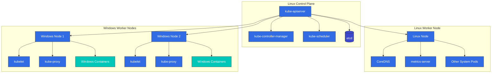
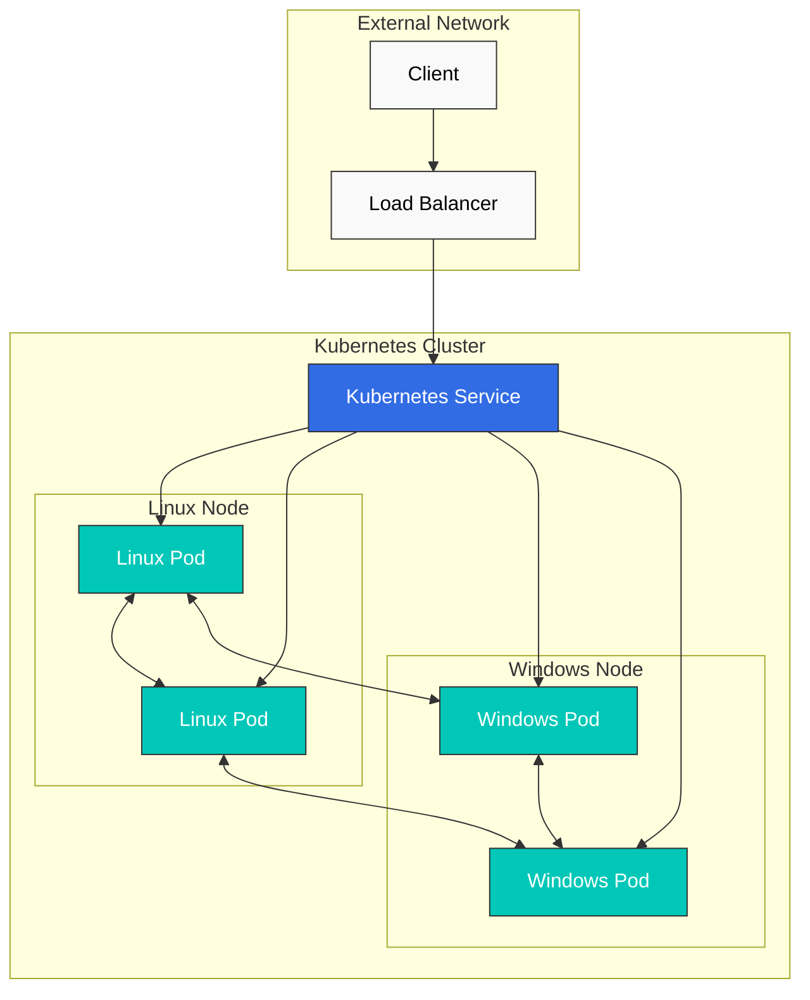
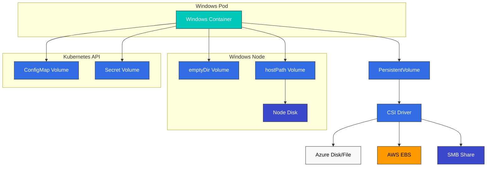
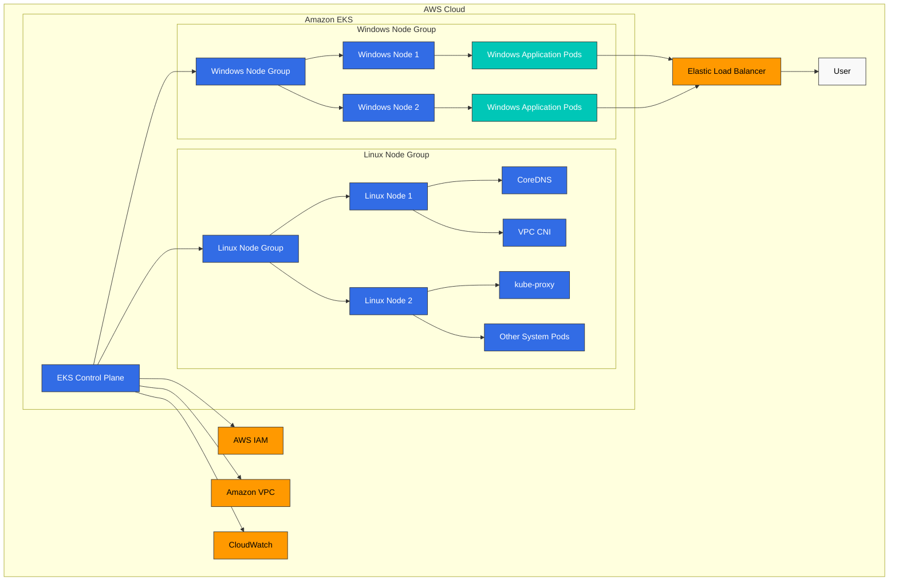

# Windows in Kubernetes

> **Supported Versions**: Kubernetes 1.32, 1.33, 1.34
> **最后更新**: February 11, 2026

Kubernetes 最初是为 Linux containers 设计的，但从 1.14 版本开始增加了对 Windows containers（Windows 容器）的生产级支持。在本章中，我们将探讨如何在 Kubernetes 中运行 Windows workloads、其架构、限制，以及 Amazon EKS 中的 Windows 支持。

## Table of Contents
1. [Windows Container Overview](#windows-container-overview)
2. [Kubernetes Windows Support Architecture](#kubernetes-windows-support-architecture)
3. [Windows Node Limitations](#windows-node-limitations)
4. [Windows Node Setup](#windows-node-setup)
5. [Deploying Windows Containers](#deploying-windows-containers)
6. [Networking](#networking)
7. [Storage](#storage)
8. [Monitoring and Logging](#monitoring-and-logging)
9. [Security](#security)
10. [Windows Support in Amazon EKS](#windows-support-in-amazon-eks)
11. [Best Practices](#best-practices)
12. [Conclusion](#conclusion)

## Windows Container Overview

Windows containers 是运行在 Windows 操作系统上的 containers，可用于将 Windows 应用程序容器化并进行部署。

### Windows Container Types

Windows containers 有两种类型：

1. **Windows Server Containers**：与 Linux containers 类似，它们共享宿主机 OS kernel。它们轻量且启动速度快，但要求与宿主机使用相同的 Windows 版本。

2. **Hyper-V Isolation Containers**：每个 container 都运行在一个轻量级 VM 中，提供更高级别的隔离。它们可以运行与宿主机不同的 Windows 版本，但会使用更多资源。

下图展示了两种 Windows container 类型之间的架构差异：

```mermaid
flowchart TD
    subgraph "Windows Server Containers"
        WSC1[Windows App 1] --- WSC2[Windows App 2] --- WSC3[Windows App 3]
        WSC1 --- WSCR[Container Runtime]
        WSC2 --- WSCR
        WSC3 --- WSCR
        WSCR --- WSOS[Windows Server OS]
        WSOS --- WSHW[Physical Hardware]
    end

    subgraph "Hyper-V Isolation Containers"
        HVC1[Windows App 1] --- HVCR1[Container Runtime]
        HVCR1 --- HVOS1[Windows OS Kernel]

        HVC2[Windows App 2] --- HVCR2[Container Runtime]
        HVCR2 --- HVOS2[Windows OS Kernel]

        HVOS1 --- HV[Hyper-V Hypervisor]
        HVOS2 --- HV
        HV --- HVHOS[Windows Server OS]
        HVHOS --- HVHW[Physical Hardware]
    end

    classDef userApp fill:#00C7B7,stroke:#333,stroke-width:1px,color:white;
    classDef k8sComponent fill:#326CE5,stroke:#333,stroke-width:1px,color:white;
    classDef default fill:#f9f9f9,stroke:#333,stroke-width:1px,color:black;

    class WSC1,WSC2,WSC3,HVC1,HVC2 userApp;
    class WSCR,HVCR1,HVCR2,HVOS1,HVOS2,HV k8sComponent;
    class WSOS,WSHW,HVHOS,HVHW default;
```



### Windows Container Images

Windows container images 基于 Microsoft 提供的 base images：

1. **Windows Server Core**：提供最小化 Windows Server 环境的轻量级 image
2. **Nano Server**：占用空间更小的超轻量级 image
3. **Windows**：提供完整 Windows Server 环境的 image

示例 Dockerfile：

```dockerfile
FROM mcr.microsoft.com/windows/servercore:ltsc2019
WORKDIR /app
COPY . .
RUN powershell -Command "Install-WindowsFeature Web-Server"
EXPOSE 80
CMD ["powershell", "-Command", "Start-Service W3SVC; Get-Content -Path 'C:\\inetpub\\logs\\LogFiles\\W3SVC1\\u_ex*' -Wait"]
```

## Kubernetes Windows Support Architecture

Kubernetes 中的 Windows 支持基于混合环境。Control plane components 始终运行在 Linux 上，而 worker nodes 可以是 Linux 或 Windows。

### Architecture Overview

Kubernetes 中的 Windows 支持架构如下：

1. **Linux Control Plane**：kube-apiserver、kube-controller-manager、kube-scheduler 和 etcd 始终运行在 Linux 上。
2. **Linux Worker Nodes**：运行 system components（CoreDNS、metrics-server 等）。
3. **Windows Worker Nodes**：运行 Windows application workloads。



### Windows Node Components

运行在 Windows nodes 上的 Kubernetes components：

1. **kubelet**：管理 node 上的 pods 和 containers
2. **kube-proxy**：管理网络规则
3. **CNI Plugin**：网络配置
4. **CSI Plugin**：存储管理

## Windows Node Limitations

在 Kubernetes 中使用 Windows nodes 时，需要注意若干限制。

### Feature Limitations

1. **Privileged Containers**：Windows 不支持 privileged containers。
2. **Host Network Mode**：Windows pods 不能使用 host network mode。
3. **Pod Security Context**：不支持部分 security context 功能（runAsUser、fsGroup 等）。
4. **DaemonSet**：运行在 Windows nodes 上的 DaemonSets 需要特殊考虑。
5. **emptyDir Volumes**：Windows 不支持基于内存的 emptyDir volumes。
6. **Resource Limits**：CPU limits 在 Windows 上的应用方式不同。

### Networking Limitations

1. **Network Mode**：Windows 仅支持 L3 networking。
2. **Service Types**：Windows nodes 对某些 service types 存在限制。
3. **Load Balancing**：部分 load balancing 功能可能受限。

### Operating System Version Compatibility

Windows containers 与宿主机 OS 版本之间存在重要的兼容性注意事项：

| Container Base Image | Compatible Host OS Versions |
|---------------------|---------------------------|
| Windows Server 2019 | Windows Server 2019 |
| Windows Server 2022 | Windows Server 2022 |

Hyper-V isolation 可以放宽这些限制，但需要额外资源。
## Windows Node Setup

我们来了解向 Kubernetes cluster 添加 Windows nodes 的流程。

### Prerequisites

在设置 Windows nodes 之前，请验证以下内容：

1. **Kubernetes Version**：1.14 或更高版本
2. **Windows Version**：Windows Server 2019 或更高版本
3. **Network Plugin**：支持 Windows 的 CNI plugin（Calico、Flannel 等）
4. **Container Runtime**：Docker、containerd 等

### Preparing Windows Nodes

准备 Windows node 的步骤：

1. **Install Windows Server**：安装 Windows Server 2019 或更高版本
2. **Enable Container Feature**：

```powershell
Install-WindowsFeature -Name Containers
Restart-Computer -Force
```

3. **Install Docker**：

```powershell
Install-Module -Name DockerMsftProvider -Repository PSGallery -Force
Install-Package -Name Docker -ProviderName DockerMsftProvider -Force
Restart-Computer -Force
```

4. **Install Kubernetes Components**：

```powershell
# Create directory
mkdir -p c:\k

# Download kubelet, kubeadm, kubectl
curl.exe -LO https://dl.k8s.io/v1.22.0/bin/windows/amd64/kubelet.exe
curl.exe -LO https://dl.k8s.io/v1.22.0/bin/windows/amd64/kubectl.exe
curl.exe -LO https://dl.k8s.io/v1.22.0/bin/windows/amd64/kube-proxy.exe
curl.exe -LO https://github.com/kubernetes-sigs/sig-windows-tools/releases/latest/download/wins.exe

# Move files to C:\k
mv kubelet.exe C:\k
mv kubectl.exe C:\k
mv kube-proxy.exe C:\k
mv wins.exe C:\k
```

5. **Configure Network**：

```powershell
# Set firewall rules
New-NetFirewallRule -Name kubelet -DisplayName 'kubelet' -Enabled True -Direction Inbound -Protocol TCP -Action Allow -LocalPort 10250
New-NetFirewallRule -Name https -DisplayName 'https' -Enabled True -Direction Inbound -Protocol TCP -Action Allow -LocalPort 443
New-NetFirewallRule -Name http -DisplayName 'http' -Enabled True -Direction Inbound -Protocol TCP -Action Allow -LocalPort 80
```

### Joining Windows Node Using kubeadm

在 Linux control plane 上生成 join token：

```bash
kubeadm token create --print-join-command
```

在 Windows node 上运行 join command：

```powershell
# Run kubeadm join command
kubeadm join <control-plane-host>:<control-plane-port> --token <token> --discovery-token-ca-cert-hash sha256:<hash>

# Register and start kubelet service
sc.exe create kubelet binPath= "C:\k\kubelet.exe --windows-service --kubeconfig=C:\k\config"
Start-Service kubelet
```

### Setting Windows Node Labels

在 Windows nodes 上设置适当的 labels，以控制 workload scheduling：

```bash
kubectl label node <windows-node-name> kubernetes.io/os=windows
kubectl label node <windows-node-name> kubernetes.io/arch=amd64
```

## Deploying Windows Containers

我们来了解如何将 Windows containers 部署到 Kubernetes。

### Using Node Selector

部署 Windows workloads 时，请使用 node selector，以确保它们被调度到 Windows nodes：

```yaml
apiVersion: apps/v1
kind: Deployment
metadata:
  name: iis-deployment
spec:
  replicas: 2
  selector:
    matchLabels:
      app: iis
  template:
    metadata:
      labels:
        app: iis
    spec:
      nodeSelector:
        kubernetes.io/os: windows
      containers:
      - name: iis
        image: mcr.microsoft.com/windows/servercore/iis:windowsservercore-ltsc2019
        resources:
          limits:
            cpu: 1
            memory: 800Mi
          requests:
            cpu: .1
            memory: 300Mi
        ports:
        - containerPort: 80
```

### Resource Requests and Limits

Windows containers 的 resource requests 和 limits 与 Linux containers 的处理方式不同：

1. **CPU Limits**：CPU limits 在 Windows 上的应用方式不同。例如，CPU limit 为 1 表示可以使用单个 CPU core 的 100%。
2. **Memory Limits**：Windows containers 会遵守 memory limits，但某些 system processes 可能会导致额外开销。

### Container Customization

在 Windows containers 中运行自定义 scripts：

```yaml
apiVersion: v1
kind: Pod
metadata:
  name: windows-custom-script
spec:
  nodeSelector:
    kubernetes.io/os: windows
  containers:
  - name: windows-container
    image: mcr.microsoft.com/windows/servercore:ltsc2019
    command:
    - powershell.exe
    - -Command
    - |
      while ($true) {
        Write-Host "Hello from Windows container"
        Start-Sleep -Seconds 10
      }
```

### Multi-Container Pods

Windows 也支持 multi-container pods，但存在一些限制：

```yaml
apiVersion: v1
kind: Pod
metadata:
  name: windows-multi-container
spec:
  nodeSelector:
    kubernetes.io/os: windows
  containers:
  - name: web
    image: mcr.microsoft.com/windows/servercore/iis:windowsservercore-ltsc2019
    ports:
    - containerPort: 80
  - name: logger
    image: mcr.microsoft.com/windows/servercore:ltsc2019
    command:
    - powershell.exe
    - -Command
    - |
      while ($true) {
        Get-Content -Path 'C:\inetpub\logs\LogFiles\W3SVC1\u_ex*' -Wait
      }
```

## Networking

Windows nodes 上的 networking 与 Linux nodes 具有不同特性。

下图展示了混合 Windows 和 Linux nodes 的 Kubernetes cluster 的 networking 架构：



### Supported Network Plugins

Windows nodes 支持的 network plugins：

1. **Flannel**：VXLAN 或 host-gw mode
2. **Calico**：VXLAN mode
3. **Antrea**：基于 OVS 的 networking
4. **Azure CNI**：用于 Azure environments
5. **AWS VPC CNI**：用于 AWS environments

### Flannel Setup Example

使用 Flannel 的 Windows networking 设置：

```yaml
apiVersion: apps/v1
kind: DaemonSet
metadata:
  name: kube-flannel-ds-windows
  namespace: kube-system
  labels:
    tier: node
    app: flannel
spec:
  selector:
    matchLabels:
      app: flannel
  template:
    metadata:
      labels:
        tier: node
        app: flannel
    spec:
      affinity:
        nodeAffinity:
          requiredDuringSchedulingIgnoredDuringExecution:
            nodeSelectorTerms:
            - matchExpressions:
              - key: kubernetes.io/os
                operator: In
                values:
                - windows
      hostNetwork: true
      containers:
      - name: kube-flannel
        image: sigwindowstools/flannel:v0.13.0
        command:
        - powershell
        args:
        - -file
        - /opt/bin/flannel-host.ps1
        env:
        - name: POD_NAME
          valueFrom:
            fieldRef:
              fieldPath: metadata.name
        - name: POD_NAMESPACE
          valueFrom:
            fieldRef:
              fieldPath: metadata.namespace
        volumeMounts:
        - name: host-run
          mountPath: /run
        - name: cni
          mountPath: /etc/cni/net.d
        - name: flannel-cfg
          mountPath: /etc/kube-flannel/
      volumes:
      - name: host-run
        hostPath:
          path: /run
      - name: cni
        hostPath:
          path: /etc/cni/net.d
      - name: flannel-cfg
        configMap:
          name: kube-flannel-cfg
```

### Exposing Services

如何在 Windows nodes 上暴露 services：

```yaml
apiVersion: v1
kind: Service
metadata:
  name: iis-service
spec:
  selector:
    app: iis
  ports:
  - port: 80
    targetPort: 80
  type: LoadBalancer
```

### Network Policies

若要在 Windows nodes 上使用 network policies，需要使用支持 network policies 的 CNI plugin（例如 Calico）：

```yaml
apiVersion: networking.k8s.io/v1
kind: NetworkPolicy
metadata:
  name: allow-frontend-to-backend
  namespace: default
spec:
  podSelector:
    matchLabels:
      app: backend
      os: windows
  ingress:
  - from:
    - podSelector:
        matchLabels:
          app: frontend
    ports:
    - protocol: TCP
      port: 80
```

## Storage

我们来了解 Windows nodes 上可用的 storage options。

下图展示了 Windows nodes 上可用的各种 storage options：



### Supported Volume Types

Windows nodes 支持的 volume types：

1. **emptyDir**：临时 storage（不支持基于内存的 emptyDir）
2. **hostPath**：Host node filesystem
3. **configMap**：Configuration data
4. **secret**：Sensitive data
5. **azureFile**：Azure File storage
6. **awsElasticBlockStore**：AWS EBS volumes
7. **azureDisk**：Azure Disk storage
8. **CSI**：Container Storage Interface drivers

### emptyDir Volume Example

```yaml
apiVersion: v1
kind: Pod
metadata:
  name: windows-emptydir
spec:
  nodeSelector:
    kubernetes.io/os: windows
  containers:
  - name: windows-container
    image: mcr.microsoft.com/windows/servercore:ltsc2019
    volumeMounts:
    - name: temp-volume
      mountPath: C:\temp
    command:
    - powershell.exe
    - -Command
    - |
      Set-Content -Path C:\temp\test.txt -Value "Hello from Windows"
      while ($true) {
        Get-Content -Path C:\temp\test.txt
        Start-Sleep -Seconds 10
      }
  volumes:
  - name: temp-volume
    emptyDir: {}
```

### hostPath Volume Example

```yaml
apiVersion: v1
kind: Pod
metadata:
  name: windows-hostpath
spec:
  nodeSelector:
    kubernetes.io/os: windows
  containers:
  - name: windows-container
    image: mcr.microsoft.com/windows/servercore:ltsc2019
    volumeMounts:
    - name: logs-volume
      mountPath: C:\logs
    command:
    - powershell.exe
    - -Command
    - |
      Set-Content -Path C:\logs\app.log -Value "Application log"
      while ($true) {
        Add-Content -Path C:\logs\app.log -Value "Log entry at $(Get-Date)"
        Start-Sleep -Seconds 10
      }
  volumes:
  - name: logs-volume
    hostPath:
      path: C:\k\logs
      type: DirectoryOrCreate
```

### ConfigMap and Secret Volume Example

```yaml
apiVersion: v1
kind: ConfigMap
metadata:
  name: windows-config
data:
  config.json: |
    {
      "setting1": "value1",
      "setting2": "value2"
    }
---
apiVersion: v1
kind: Secret
metadata:
  name: windows-secret
type: Opaque
data:
  username: YWRtaW4=  # admin
  password: cGFzc3dvcmQ=  # password
---
apiVersion: v1
kind: Pod
metadata:
  name: windows-config-secret
spec:
  nodeSelector:
    kubernetes.io/os: windows
  containers:
  - name: windows-container
    image: mcr.microsoft.com/windows/servercore:ltsc2019
    volumeMounts:
    - name: config-volume
      mountPath: C:\config
    - name: secret-volume
      mountPath: C:\secret
    command:
    - powershell.exe
    - -Command
    - |
      Get-Content -Path C:\config\config.json
      Get-Content -Path C:\secret\username
      Get-Content -Path C:\secret\password
      while ($true) { Start-Sleep -Seconds 10 }
  volumes:
  - name: config-volume
    configMap:
      name: windows-config
  - name: secret-volume
    secret:
      secretName: windows-secret
```

### Using CSI Drivers

在 Windows 上使用 CSI drivers 的示例：

```yaml
apiVersion: v1
kind: PersistentVolumeClaim
metadata:
  name: windows-pvc
spec:
  accessModes:
  - ReadWriteOnce
  resources:
    requests:
      storage: 10Gi
  storageClassName: windows-csi
---
apiVersion: v1
kind: Pod
metadata:
  name: windows-csi-pod
spec:
  nodeSelector:
    kubernetes.io/os: windows
  containers:
  - name: windows-container
    image: mcr.microsoft.com/windows/servercore:ltsc2019
    volumeMounts:
    - name: data-volume
      mountPath: C:\data
    command:
    - powershell.exe
    - -Command
    - |
      Set-Content -Path C:\data\file.txt -Value "Persistent data"
      while ($true) { Start-Sleep -Seconds 10 }
  volumes:
  - name: data-volume
    persistentVolumeClaim:
      claimName: windows-pvc
```
## Monitoring and Logging

我们来了解 Windows nodes 和 containers 的 monitoring 与 logging 方法。

### Monitoring

用于 monitoring Windows nodes 的工具：

1. **Prometheus Windows Exporter**：收集 Windows node metrics
2. **metrics-server**：提供基础 resource usage metrics
3. **Datadog, Dynatrace, New Relic**：商业 monitoring solutions

在 Windows nodes 上安装 Prometheus Windows Exporter：

```powershell
# Download Windows Exporter
Invoke-WebRequest -Uri https://github.com/prometheus-community/windows_exporter/releases/download/v0.16.0/windows_exporter-0.16.0-amd64.msi -OutFile windows_exporter.msi

# Install Windows Exporter
Start-Process msiexec.exe -ArgumentList '/i', 'windows_exporter.msi', 'ENABLED_COLLECTORS=cpu,memory,disk,net,service,os,system', '/quiet' -Wait
```

Prometheus 配置：

```yaml
scrape_configs:
  - job_name: 'windows-nodes'
    static_configs:
      - targets: ['windows-node-1:9182', 'windows-node-2:9182']
```

### Logging

用于收集 Windows container logs 的工具：

1. **Fluent Bit**：轻量级 log collector
2. **Fluentd**：Log collection and forwarding
3. **Elasticsearch**：Log storage and search
4. **Azure Monitor**：用于 Azure environments
5. **CloudWatch Logs**：用于 AWS environments

在 Windows nodes 上安装 Fluent Bit：

```powershell
# Download Fluent Bit
Invoke-WebRequest -Uri https://fluentbit.io/releases/1.8/fluent-bit-1.8.11-win64.zip -OutFile fluent-bit.zip

# Extract
Expand-Archive -Path fluent-bit.zip -DestinationPath C:\fluent-bit

# Create configuration file
@"
[SERVICE]
    Flush        5
    Daemon       Off
    Log_Level    info

[INPUT]
    Name         winlog
    Channels     Application,System,Security

[OUTPUT]
    Name         es
    Match        *
    Host         elasticsearch-host
    Port         9200
    Index        windows_logs
"@ | Out-File -FilePath C:\fluent-bit\conf\fluent-bit.conf -Encoding ascii

# Register service
sc.exe create fluent-bit binPath= "C:\fluent-bit\bin\fluent-bit.exe -c C:\fluent-bit\conf\fluent-bit.conf"
Start-Service fluent-bit
```

### Application Log Collection

收集 Windows container application logs：

```yaml
apiVersion: v1
kind: Pod
metadata:
  name: windows-logging
spec:
  nodeSelector:
    kubernetes.io/os: windows
  containers:
  - name: iis
    image: mcr.microsoft.com/windows/servercore/iis:windowsservercore-ltsc2019
    volumeMounts:
    - name: logs
      mountPath: C:\inetpub\logs\LogFiles
  - name: log-collector
    image: mcr.microsoft.com/windows/servercore:ltsc2019
    command:
    - powershell.exe
    - -Command
    - |
      while ($true) {
        Get-Content -Path 'C:\inetpub\logs\LogFiles\W3SVC1\u_ex*' -Wait
      }
    volumeMounts:
    - name: logs
      mountPath: C:\inetpub\logs\LogFiles
  volumes:
  - name: logs
    emptyDir: {}
```

## Security

我们来了解 Windows nodes 和 containers 的 security considerations。

### Windows Node Security

Windows node security 建议：

1. **Apply Latest Updates**：定期应用 Windows security updates
2. **Firewall Configuration**：正确配置 Windows Defender Firewall
3. **Least Privilege Principle**：仅授予必要的最低权限
4. **Antivirus Software**：安装适当的 antivirus software
5. **Group Policy**：应用 group policies 以进行 security hardening

### Windows Container Security

Windows container security 建议：

1. **Minimal Base Image**：使用尽可能小的 base image（Nano Server 等）
2. **Image Scanning**：扫描 container images 中的漏洞
3. **ReadOnlyRootFilesystem**：尽可能使用 read-only root filesystem
4. **Non-Privileged User**：以 non-privileged users 运行应用程序
5. **Network Policies**：应用适当的 network policies

### RunAsUsername

在 Windows containers 中，可以使用 `runAsUsername` 而不是 `runAsUser` 来指定在 container 内运行的用户：

```yaml
apiVersion: v1
kind: Pod
metadata:
  name: windows-runasusername
spec:
  nodeSelector:
    kubernetes.io/os: windows
  securityContext:
    windowsOptions:
      runAsUserName: "ContainerUser"
  containers:
  - name: windows-container
    image: mcr.microsoft.com/windows/servercore:ltsc2019
    command:
    - powershell.exe
    - -Command
    - |
      whoami
      while ($true) { Start-Sleep -Seconds 10 }
```

### Group Managed Service Accounts (gMSA)

用于 Windows containers 中 Active Directory authentication 的 gMSA 配置：

1. **Create gMSA in Active Directory**：

```powershell
# Create gMSA
New-ADServiceAccount -Name WebApp1 -DNSHostName WebApp1.contoso.com -ServicePrincipalNames http/WebApp1.contoso.com -PrincipalsAllowedToRetrieveManagedPassword "Domain Controllers", "Domain Computers"
```

2. **Store gMSA Credentials in Kubernetes**：

```yaml
apiVersion: v1
kind: Secret
metadata:
  name: gmsa-cred-spec
type: microsoft.com/gmsa-credential-spec
data:
  credspec.json: <base64-encoded-credential-spec>
```

3. **Apply gMSA Configuration to Pod**：

```yaml
apiVersion: v1
kind: Pod
metadata:
  name: windows-gmsa
spec:
  nodeSelector:
    kubernetes.io/os: windows
  securityContext:
    windowsOptions:
      gmsaCredentialSpecName: gmsa-cred-spec
  containers:
  - name: windows-container
    image: mcr.microsoft.com/windows/servercore:ltsc2019
    command:
    - powershell.exe
    - -Command
    - |
      whoami
      while ($true) { Start-Sleep -Seconds 10 }
```

## Windows Support in Amazon EKS

我们来了解如何在 Amazon EKS 中运行 Windows workloads。

下图展示了 Amazon EKS 中的 Windows 支持架构：



### Enabling Windows Support in EKS

在 Amazon EKS 中启用 Windows 支持的步骤：

1. **Update VPC CNI Plugin**：

```bash
kubectl apply -f https://raw.githubusercontent.com/aws/amazon-vpc-cni-k8s/release-1.11/config/master/vpc-resource-controller.yaml
```

2. **Install Windows VPC Admission Webhook**：

```bash
kubectl apply -f https://raw.githubusercontent.com/aws/amazon-vpc-cni-k8s/release-1.11/config/master/vpc-admission-webhook.yaml
```

### Creating Windows Node Groups

使用 eksctl 创建 Windows node group：

```bash
eksctl create nodegroup \
  --cluster my-cluster \
  --region us-west-2 \
  --name windows-ng \
  --node-type t3.large \
  --nodes 2 \
  --nodes-min 1 \
  --nodes-max 4 \
  --managed \
  --node-ami-family WindowsServer2019FullContainer
```

使用 AWS Management Console 创建 Windows node group：

1. 在 EKS console 中选择 cluster
2. 选择 "Compute" tab
3. 点击 "Add node group"
4. 输入 node group details
5. 选择 "Windows" 作为 AMI type
6. 配置其余设置并创建

### Deploying Windows Applications in EKS

在 EKS 中部署 Windows applications 的示例：

```yaml
apiVersion: apps/v1
kind: Deployment
metadata:
  name: windows-server-iis
spec:
  selector:
    matchLabels:
      app: windows-server-iis
      tier: backend
      track: stable
  replicas: 2
  template:
    metadata:
      labels:
        app: windows-server-iis
        tier: backend
        track: stable
    spec:
      nodeSelector:
        kubernetes.io/os: windows
      containers:
      - name: windows-server-iis
        image: mcr.microsoft.com/windows/servercore/iis:windowsservercore-ltsc2019
        ports:
        - name: http
          containerPort: 80
        resources:
          limits:
            cpu: 1
            memory: 800Mi
          requests:
            cpu: .1
            memory: 300Mi
---
apiVersion: v1
kind: Service
metadata:
  name: windows-server-iis-service
  labels:
    app: windows-server-iis
spec:
  ports:
  - port: 80
    protocol: TCP
  selector:
    app: windows-server-iis
  type: LoadBalancer
```

### Windows Container Logging in EKS

使用 CloudWatch Logs 收集 Windows container logs：

```yaml
apiVersion: v1
kind: ConfigMap
metadata:
  name: fluent-bit-config
  namespace: amazon-cloudwatch
data:
  fluent-bit.conf: |
    [SERVICE]
        Flush         5
        Log_Level     info
        Daemon        off

    [INPUT]
        Name          tail
        Tag           kube.*
        Path          /var/log/containers/*.log
        Parser        docker
        DB            /var/fluent-bit/state/flb_container.db
        Mem_Buf_Limit 50MB

    [FILTER]
        Name          kubernetes
        Match         kube.*
        Kube_URL      https://kubernetes.default.svc:443
        Merge_Log     On

    [OUTPUT]
        Name          cloudwatch_logs
        Match         kube.*
        region        us-west-2
        log_group_name /aws/eks/my-cluster/windows-logs
        log_stream_prefix windows-
        auto_create_group true
```

## Best Practices

我们来了解在 Kubernetes 中运行 Windows workloads 的 best practices。

### Cluster Design Best Practices

1. **Mixed Node Pools**：使用适当组合的 Linux 和 Windows nodes
2. **Node Labels and Taints**：使用适当的 node labels 和 taints 来隔离 workloads
3. **Version Compatibility**：验证 Kubernetes version 和 Windows version 之间的兼容性
4. **Network Plugin Selection**：选择支持 Windows 的合适 network plugin
5. **High Availability**：为关键 workloads 配置 high availability

### Application Design Best Practices

1. **Container Image Optimization**：使用小而高效的 container images
2. **Resource Requests and Limits**：设置适当的 resource requests 和 limits
3. **Stateless Design**：尽可能设计 stateless applications
4. **Logging and Monitoring**：配置有效的 logging 和 monitoring
5. **Security Hardening**：应用适当的 security contexts 和 network policies

### Operations Best Practices

1. **Regular Updates**：定期更新 Windows nodes 和 container images
2. **Automation**：自动化 deployment 和 management tasks
3. **Backup and Recovery**：定期备份重要数据
4. **Troubleshooting Tools**：构建适当的 troubleshooting tools 和流程
5. **Documentation**：记录配置和流程

### EKS-Specific Best Practices

1. **Managed Node Groups**：尽可能使用 managed node groups
2. **IAM Roles for Service Accounts (IRSA)**：按 pod 管理 IAM permissions
3. **VPC CNI Configuration**：根据 networking requirements 配置 VPC CNI
4. **Security Groups**：配置适当的 security groups
5. **Cost Optimization**：选择适当的 instance types 和 sizes

## Conclusion

Kubernetes 中的 Windows 支持持续演进，现在你可以在生产环境中运行 Windows workloads。Windows nodes 可以与 Linux nodes 在同一个 cluster 中并行运行，使你能够在单个 Kubernetes cluster 中管理多样化 workloads。

Windows containers 支持将 .NET Framework 应用程序、Windows services 以及其他 Windows-specific workloads 容器化，从而利用 Kubernetes orchestration capabilities。不过，与 Linux containers 相比仍存在一些限制，因此理解并妥善处理这些限制非常重要。

Amazon EKS 为 Windows nodes 提供 managed services，使部署和管理 Windows workloads 变得简单。利用 EKS 的 Windows 支持，可以简化将 Windows applications 迁移到现代 container environments 的过程。

要在 Kubernetes 中成功实现 Windows，遵循适当的规划、设计和运维 best practices 非常重要。这样可以高效管理 Windows 和 Linux workloads，并充分利用 Kubernetes 的所有优势。

## Quiz

要测试你在本章中学到的内容，请尝试 [Windows in Kubernetes Quiz](../quizzes/core/10-windows-in-kubernetes-quiz.md)。
