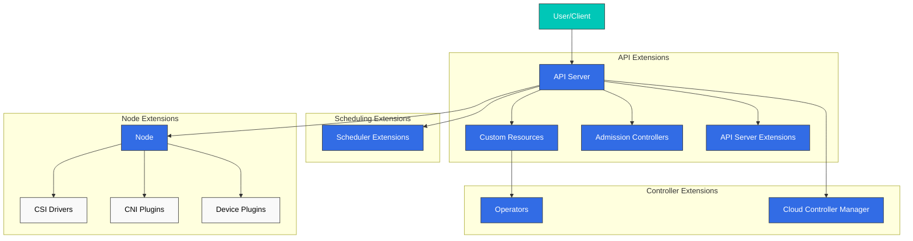
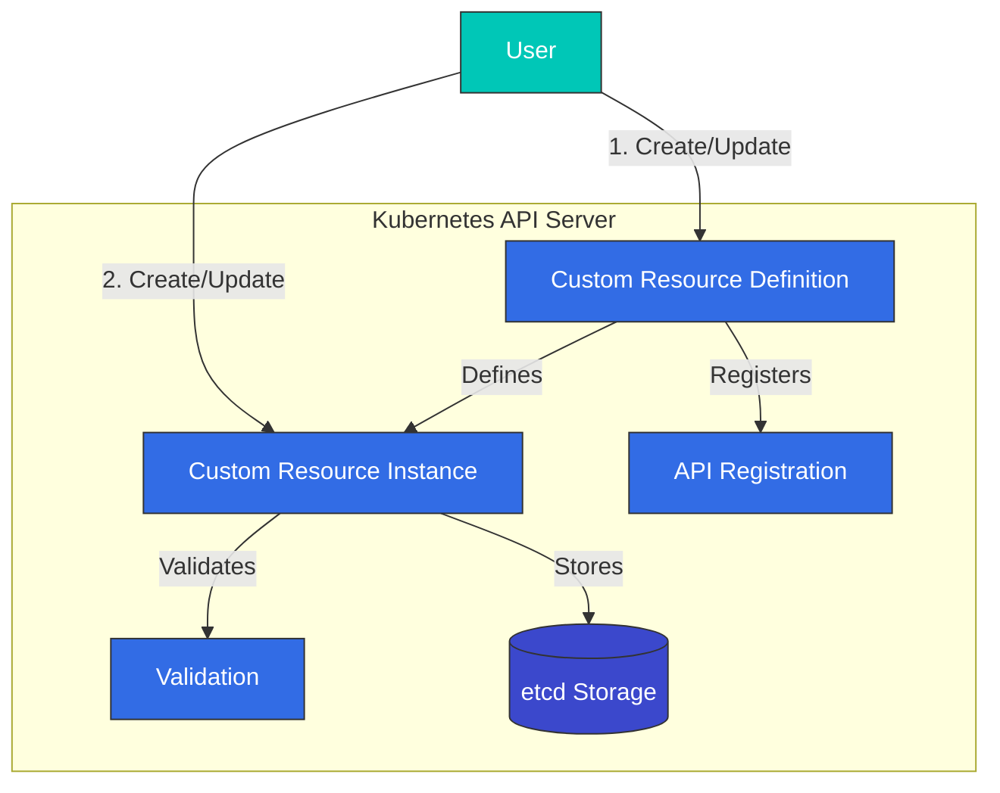
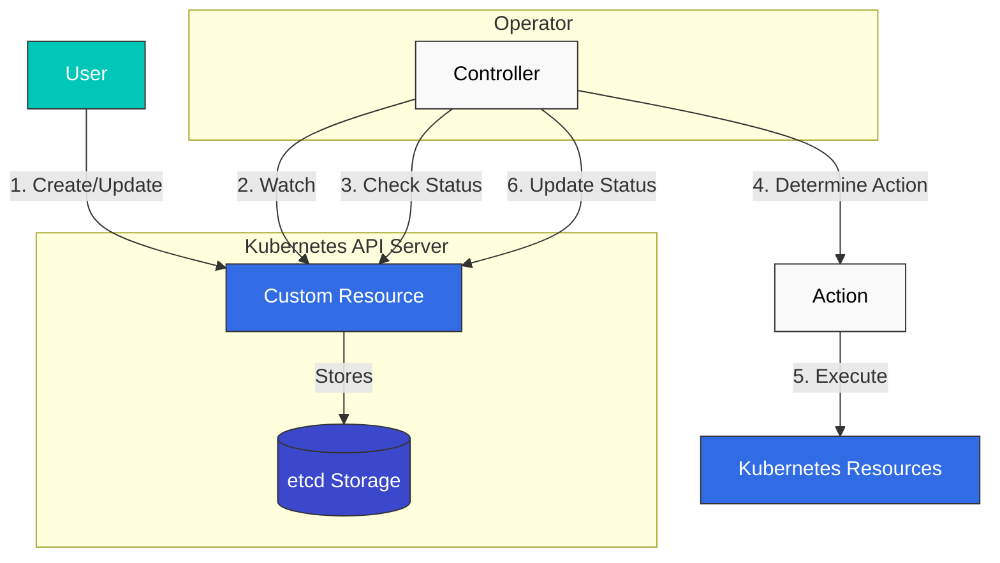
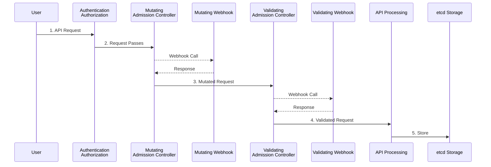
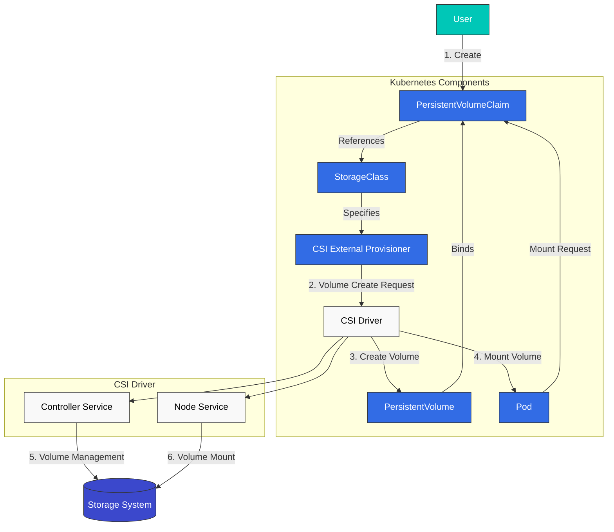
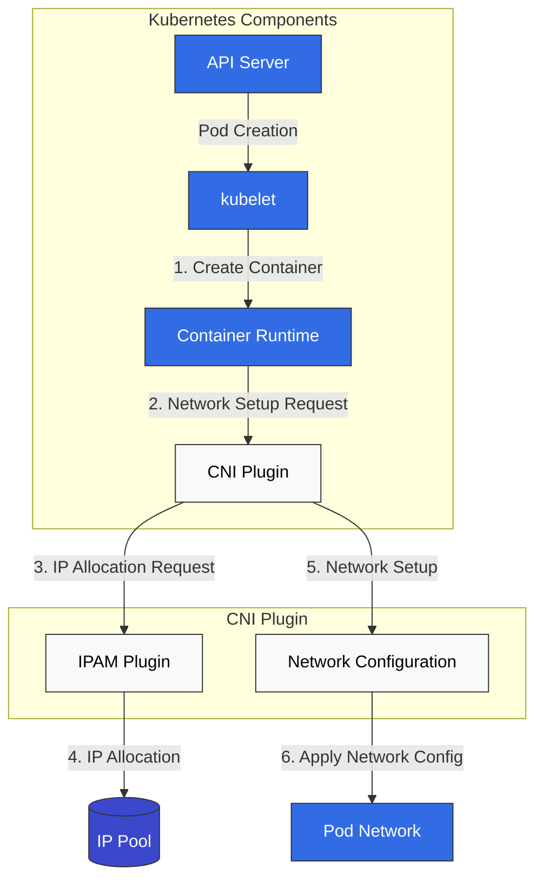
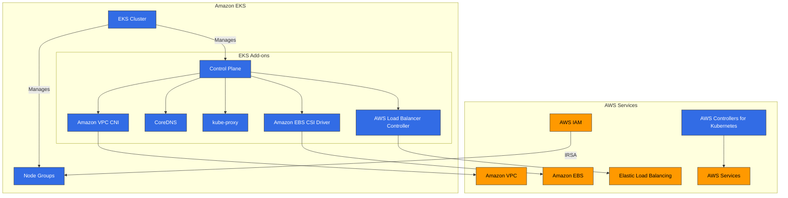

# Extending Kubernetes

> **Supported Versions**: Kubernetes 1.32, 1.33, 1.34
> **最后更新**: February 19, 2026

Kubernetes 是一个以 extensibility 为设计核心的平台，允许你通过多种方式扩展其功能。在本章中，我们将探讨扩展 Kubernetes 的各种方法，以及如何在 Amazon EKS 中利用 extension features。

## Table of Contents
1. [Kubernetes Extension Overview](#kubernetes-extension-overview)
2. [Custom Resources](#custom-resources)
3. [Operator Pattern](#operator-pattern)
4. [Admission Controllers](#admission-controllers)
5. [API Server Extensions](#api-server-extensions)
6. [Scheduler Extensions](#scheduler-extensions)
7. [Cloud Controller Manager](#cloud-controller-manager)
8. [CSI (Container Storage Interface)](#csi-container-storage-interface)
9. [CNI (Container Network Interface)](#cni-container-network-interface)
10. [Device Plugins](#device-plugins)
11. [Extension Features in Amazon EKS](#extension-features-in-amazon-eks)
12. [Best Practices](#best-practices)
13. [Conclusion](#conclusion)

## Kubernetes Extension Overview

Kubernetes 提供了多种 extension points，用于扩展和自定义其基础功能。主要的 extension points 包括：

1. **Custom Resources**：定义新的 API object types
2. **Operators**：结合 custom resources 和 controllers 来管理复杂 applications
3. **Admission Controllers**：拦截、修改或验证 API requests
4. **API Server Extensions**：向 API server 添加新的 endpoints
5. **Scheduler Extensions**：自定义 pod scheduling logic
6. **Cloud Controller Manager**：集成 cloud provider-specific features
7. **CSI (Container Storage Interface)**：集成 storage systems
8. **CNI (Container Network Interface)**：集成 networking solutions
9. **Device Plugins**：集成特殊 hardware

下图展示了 Kubernetes 中的主要 extension points：



### Choosing an Extension Method

选择合适的 extension method 时需要考虑的事项：

1. **Use Case**：你想扩展的功能类型
2. **Complexity**：实现和维护的复杂度
3. **Performance Impact**：extension 对 cluster performance 的影响
4. **Upgrade Compatibility**：与 Kubernetes version upgrades 的兼容性
5. **Community Support**：该 extension method 的 community support 水平

## Custom Resources

Custom resources（自定义资源）是一种扩展 Kubernetes API 以定义新 object types 的方式。

下图展示了 custom resources 的工作方式：



### Custom Resource Definitions (CRD)

CRD 是定义新 resource types 的最简单方式：

```yaml
apiVersion: apiextensions.k8s.io/v1
kind: CustomResourceDefinition
metadata:
  name: backups.example.com
spec:
  group: example.com
  names:
    kind: Backup
    listKind: BackupList
    plural: backups
    singular: backup
    shortNames:
    - bk
  scope: Namespaced
  versions:
  - name: v1
    served: true
    storage: true
    schema:
      openAPIV3Schema:
        type: object
        properties:
          spec:
            type: object
            properties:
              source:
                type: string
              destination:
                type: string
              schedule:
                type: string
            required:
            - source
            - destination
          status:
            type: object
            properties:
              phase:
                type: string
              lastBackupTime:
                type: string
                format: date-time
    subresources:
      status: {}
    additionalPrinterColumns:
    - name: Status
      type: string
      jsonPath: .status.phase
    - name: Age
      type: date
      jsonPath: .metadata.creationTimestamp
```

在上面的示例中，我们定义了一个名为 `Backup` 的新 resource type，并指定了该 resource 的 schema 和 additional printer columns。

### Creating Custom Resource Instances

定义 CRD 后，你可以创建该类型的 resource instances：

```yaml
apiVersion: example.com/v1
kind: Backup
metadata:
  name: daily-backup
spec:
  source: /data
  destination: s3://my-bucket/backups
  schedule: "0 0 * * *"
```

### Custom Resource Validation

你可以在 CRDs 中使用 OpenAPI v3 schemas 来验证 custom resources：

```yaml
openAPIV3Schema:
  type: object
  properties:
    spec:
      type: object
      properties:
        replicas:
          type: integer
          minimum: 1
          maximum: 10
        image:
          type: string
          pattern: '^[a-zA-Z0-9./:_-]+$'
      required:
      - replicas
      - image
```

在上面的示例中，`replicas` field 必须是 1 到 10 之间的整数，`image` field 必须匹配指定的 pattern。

### Version Management

CRDs 支持多个 versions，以支持 API evolution：

```yaml
versions:
- name: v1alpha1
  served: true
  storage: false
- name: v1beta1
  served: true
  storage: false
- name: v1
  served: true
  storage: true
```

在上面的示例中，提供了 `v1alpha1`、`v1beta1` 和 `v1` 三个 versions，但 data 以 `v1` format 存储。

### Conversion Webhooks

你可以使用 conversion webhooks 来处理不同 versions 之间的转换：

```yaml
apiVersion: apiextensions.k8s.io/v1
kind: CustomResourceDefinition
metadata:
  name: backups.example.com
spec:
  # ... other fields omitted ...
  conversion:
    strategy: Webhook
    webhook:
      clientConfig:
        service:
          namespace: default
          name: example-conversion-webhook
          path: /convert
      conversionReviewVersions:
      - v1
```

## Operator Pattern

Operator pattern 是一种通过结合 custom resources 和 controllers 来自动化复杂 applications 运维知识的方式。

下图展示了 operator pattern 的工作方式：



### Operator Concepts

一个 operator 由以下 components 组成：

1. **Custom Resource Definition (CRD)**：定义要管理的 resources 的 schema
2. **Controller**：监控 custom resources 并将它们 reconcile 到 desired state 的逻辑
3. **Kubernetes API Client**：用于与 Kubernetes API 交互的 client

### Operator Example

Database operator 示例：

```yaml
# Custom Resource Definition
apiVersion: apiextensions.k8s.io/v1
kind: CustomResourceDefinition
metadata:
  name: databases.example.com
spec:
  group: example.com
  names:
    kind: Database
    listKind: DatabaseList
    plural: databases
    singular: database
    shortNames:
    - db
  scope: Namespaced
  versions:
  - name: v1
    served: true
    storage: true
    schema:
      openAPIV3Schema:
        type: object
        properties:
          spec:
            type: object
            properties:
              engine:
                type: string
                enum:
                - mysql
                - postgresql
              version:
                type: string
              storageSize:
                type: string
              replicas:
                type: integer
                minimum: 1
            required:
            - engine
            - version
            - storageSize
          status:
            type: object
            properties:
              phase:
                type: string
              endpoint:
                type: string
    subresources:
      status: {}
```

```yaml
# Database Instance
apiVersion: example.com/v1
kind: Database
metadata:
  name: my-db
spec:
  engine: postgresql
  version: "13.4"
  storageSize: 10Gi
  replicas: 3
```

### Operator Development Tools

用于开发 operators 的 tools：

1. **Operator SDK**：使用 Go、Ansible 或 Helm 开发 operators
2. **KUDO (Kubernetes Universal Declarative Operator)**：以 declarative 方式开发 operators
3. **Kubebuilder**：基于 Go 的 operator development framework
4. **Metacontroller**：基于 webhook 的 operator development

#### Operator SDK Example

使用 Operator SDK 创建 operator：

```bash
# Install Operator SDK
curl -LO https://github.com/operator-framework/operator-sdk/releases/download/v1.16.0/operator-sdk_linux_amd64
chmod +x operator-sdk_linux_amd64
mv operator-sdk_linux_amd64 /usr/local/bin/operator-sdk

# Create new operator project
operator-sdk init --domain example.com --repo github.com/example/database-operator

# Create API
operator-sdk create api --group database --version v1 --kind Database --resource --controller

# Implement controller (main.go, controllers/database_controller.go, etc.)

# Build and deploy operator
make docker-build docker-push
make deploy
```

### Popular Operators

常见的 open source operators：

1. **Prometheus Operator**：管理 Prometheus monitoring stack
2. **Elasticsearch Operator**：管理 Elasticsearch clusters
3. **etcd Operator**：管理 etcd clusters
4. **PostgreSQL Operator**：管理 PostgreSQL databases
5. **Jaeger Operator**：管理 Jaeger distributed tracing system
6. **Strimzi Kafka Operator**：管理 Apache Kafka clusters
7. **Istio Operator**：管理 Istio service mesh
## Admission Controllers

Admission controllers 是拦截发送到 Kubernetes API server 的 requests，并对其进行修改或验证的 plugins。

下图展示了 admission controllers 的工作方式：



### Admission Controller Types

Kubernetes 有两种类型的 admission controllers：

1. **Mutating Admission Controllers**：可以修改 resources
2. **Validating Admission Controllers**：只能验证 resources

### Built-in Admission Controllers

Kubernetes 有多个 built-in admission controllers：

1. **NamespaceLifecycle**：防止在正在删除的 namespaces 中创建 resources
2. **LimitRanger**：为 pods 和 containers 设置默认 resource limits
3. **ServiceAccount**：自动创建 service accounts 并添加 tokens
4. **DefaultStorageClass**：为 PVCs 分配默认 storage class
5. **ResourceQuota**：限制每个 namespace 的 resource usage
6. **PodSecurityPolicy**：应用 pod security policies
7. **NodeRestriction**：限制 nodes 可以修改的 resources

### Webhook Admission Controllers

你可以使用 webhook admission controllers 来实现 custom logic：

```yaml
# Mutating Webhook Configuration
apiVersion: admissionregistration.k8s.io/v1
kind: MutatingWebhookConfiguration
metadata:
  name: pod-mutating-webhook
webhooks:
- name: pod-mutator.example.com
  clientConfig:
    service:
      namespace: default
      name: pod-mutating-webhook
      path: "/mutate"
    caBundle: <base64-encoded-ca-cert>
  rules:
  - apiGroups: [""]
    apiVersions: ["v1"]
    resources: ["pods"]
    operations: ["CREATE"]
    scope: "Namespaced"
  admissionReviewVersions: ["v1", "v1beta1"]
  sideEffects: None
  timeoutSeconds: 5
```

```yaml
# Validating Webhook Configuration
apiVersion: admissionregistration.k8s.io/v1
kind: ValidatingWebhookConfiguration
metadata:
  name: pod-validating-webhook
webhooks:
- name: pod-validator.example.com
  clientConfig:
    service:
      namespace: default
      name: pod-validating-webhook
      path: "/validate"
    caBundle: <base64-encoded-ca-cert>
  rules:
  - apiGroups: [""]
    apiVersions: ["v1"]
    resources: ["pods"]
    operations: ["CREATE", "UPDATE"]
    scope: "Namespaced"
  admissionReviewVersions: ["v1", "v1beta1"]
  sideEffects: None
  timeoutSeconds: 5
```

### Webhook Server Implementation

Webhook server 必须实现如下 endpoints：

```go
// Mutating webhook example
func mutateHandler(w http.ResponseWriter, r *http.Request) {
    var body []byte
    if r.Body != nil {
        if data, err := ioutil.ReadAll(r.Body); err == nil {
            body = data
        }
    }

    // Convert to AdmissionReview object
    admissionReview := v1.AdmissionReview{}
    if err := json.Unmarshal(body, &admissionReview); err != nil {
        http.Error(w, "Could not parse admission review request", http.StatusBadRequest)
        return
    }

    // Extract Pod object
    pod := corev1.Pod{}
    if err := json.Unmarshal(admissionReview.Request.Object.Raw, &pod); err != nil {
        http.Error(w, "Could not parse pod object", http.StatusBadRequest)
        return
    }

    // Create patch
    patches := []map[string]interface{}{
        {
            "op":    "add",
            "path":  "/metadata/labels/injected-by",
            "value": "mutating-webhook",
        },
    }

    patchBytes, _ := json.Marshal(patches)

    // Create response
    admissionResponse := v1.AdmissionResponse{
        UID:     admissionReview.Request.UID,
        Allowed: true,
        Patch:   patchBytes,
        PatchType: func() *v1.PatchType {
            pt := v1.PatchTypeJSONPatch
            return &pt
        }(),
    }

    admissionReview.Response = &admissionResponse
    resp, _ := json.Marshal(admissionReview)
    w.Header().Set("Content-Type", "application/json")
    w.Write(resp)
}
```

```go
// Validating webhook example
func validateHandler(w http.ResponseWriter, r *http.Request) {
    var body []byte
    if r.Body != nil {
        if data, err := ioutil.ReadAll(r.Body); err == nil {
            body = data
        }
    }

    // Convert to AdmissionReview object
    admissionReview := v1.AdmissionReview{}
    if err := json.Unmarshal(body, &admissionReview); err != nil {
        http.Error(w, "Could not parse admission review request", http.StatusBadRequest)
        return
    }

    // Extract Pod object
    pod := corev1.Pod{}
    if err := json.Unmarshal(admissionReview.Request.Object.Raw, &pod); err != nil {
        http.Error(w, "Could not parse pod object", http.StatusBadRequest)
        return
    }

    // Validation logic
    allowed := true
    var message string
    for _, container := range pod.Spec.Containers {
        if container.Image == "nginx:latest" {
            allowed = false
            message = "Using 'latest' tag is not allowed. Please specify a version."
            break
        }
    }

    // Create response
    admissionResponse := v1.AdmissionResponse{
        UID:     admissionReview.Request.UID,
        Allowed: allowed,
    }

    if !allowed {
        admissionResponse.Result = &metav1.Status{
            Message: message,
        }
    }

    admissionReview.Response = &admissionResponse
    resp, _ := json.Marshal(admissionReview)
    w.Header().Set("Content-Type", "application/json")
    w.Write(resp)
}
```

### Popular Admission Controller Projects

1. **OPA Gatekeeper**：使用 Open Policy Agent 进行 policy enforcement
2. **Kyverno**：基于 YAML 的 policy engine
3. **Istio**：Service mesh sidecar injection
4. **cert-manager**：TLS certificate management

## API Server Extensions

API server extensions 是一种向 Kubernetes API server 添加新 endpoints 的方式。

### Extension API Servers

Extension API servers 是与 Kubernetes API server 分开运行并提供 custom APIs 的 servers：

```yaml
# APIService Definition
apiVersion: apiregistration.k8s.io/v1
kind: APIService
metadata:
  name: v1.example.com
spec:
  group: example.com
  version: v1
  groupPriorityMinimum: 1000
  versionPriority: 15
  service:
    name: example-api
    namespace: default
  caBundle: <base64-encoded-ca-cert>
```

### Extension API Server Implementation

一个 extension API server 由以下 components 组成：

1. **API Server**：提供与 Kubernetes API server 类似的 interface
2. **Resource Handlers**：处理针对特定 resource types 的 requests
3. **Storage Backend**：存储 resource data

```go
// Extension API Server Example
func main() {
    // Server configuration
    config := genericapiserver.NewRecommendedConfig(apiserver.Codecs)
    config.OpenAPIConfig = genericapiserver.DefaultOpenAPIConfig(
        sampleopenapi.GetOpenAPIDefinitions,
        openapi.NewDefinitionNamer(apiserver.Scheme),
    )
    config.EnableIndex = true
    config.EnableDiscovery = true

    // Create server
    server, err := config.Complete().New("sample-apiserver", genericapiserver.NewEmptyDelegate())
    if err != nil {
        log.Fatalf("Error creating server: %v", err)
    }

    // Set API group info
    apiGroupInfo := genericapiserver.NewDefaultAPIGroupInfo(
        samplev1alpha1.GroupName,
        apiserver.Scheme,
        metav1.ParameterCodec,
        apiserver.Codecs,
    )

    // Set storage
    apiGroupInfo.VersionedResourcesStorageMap["v1alpha1"] = map[string]rest.Storage{
        "widgets": NewWidgetStorage(),
    }

    // Install API group
    if err := server.InstallAPIGroup(&apiGroupInfo); err != nil {
        log.Fatalf("Error installing API group: %v", err)
    }

    // Run server
    if err := server.PrepareRun().Run(stopCh); err != nil {
        log.Fatalf("Error running server: %v", err)
    }
}
```

### Aggregation Layer

Aggregation layer 让多个 API servers 看起来像一个单一的 API server：

```
                                   +-----------------+
                                   |                 |
                                   |  kube-apiserver |
                                   |                 |
                                   +-------+---------+
                                           |
                                           v
                      +--------------------+--------------------+
                      |                                         |
                      |                                         |
          +-----------v-----------+               +------------v------------+
          |                       |               |                         |
          |  metrics-server       |               |  example-apiserver      |
          |                       |               |                         |
          +-----------------------+               +-------------------------+
```

## Scheduler Extensions

Scheduler extensions 是一种自定义 Kubernetes scheduler 行为的方式。

### Scheduler Framework

Kubernetes 1.15 引入的 scheduler framework 允许通过 plugins 扩展 scheduling pipeline 的各个阶段：

1. **Queue Sort**：对 scheduling queue 中的 pods 进行排序
2. **Pre-filter**：在 filtering 之前检查 pod 和 cluster state
3. **Filter**：过滤掉无法运行该 pod 的 nodes
4. **Post-filter**：在 filtering 之后执行 actions
5. **Pre-score**：在 score calculation 之前执行 actions
6. **Score**：为 nodes 分配 scores
7. **Normalize Score**：规范化 scores
8. **Reserve**：为 pod 预留 resources
9. **Permit**：允许、拒绝或延迟 pod scheduling
10. **Pre-bind**：在 binding 之前执行 actions
11. **Bind**：将 pod 绑定到 node
12. **Post-bind**：在 binding 之后执行 actions

### Scheduler Configuration

Scheduler configuration 示例：

```yaml
apiVersion: kubescheduler.config.k8s.io/v1beta1
kind: KubeSchedulerConfiguration
leaderElection:
  leaderElect: true
clientConnection:
  kubeconfig: /etc/kubernetes/scheduler.conf
profiles:
- schedulerName: default-scheduler
  plugins:
    queueSort:
      enabled:
      - name: PrioritySort
    preFilter:
      enabled:
      - name: NodeResourcesFit
      - name: NodePorts
      - name: PodTopologySpread
      - name: InterPodAffinity
      - name: VolumeBinding
      - name: NodeAffinity
    filter:
      enabled:
      - name: NodeUnschedulable
      - name: NodeName
      - name: TaintToleration
      - name: NodeAffinity
      - name: NodePorts
      - name: NodeResourcesFit
      - name: VolumeRestrictions
      - name: EBSLimits
      - name: GCEPDLimits
      - name: NodeVolumeLimits
      - name: AzureDiskLimits
      - name: VolumeBinding
      - name: VolumeZone
      - name: PodTopologySpread
      - name: InterPodAffinity
    postFilter:
      enabled:
      - name: DefaultPreemption
    preScore:
      enabled:
      - name: InterPodAffinity
      - name: PodTopologySpread
      - name: TaintToleration
      - name: NodeAffinity
    score:
      enabled:
      - name: NodeResourcesBalancedAllocation
        weight: 1
      - name: ImageLocality
        weight: 1
      - name: InterPodAffinity
        weight: 1
      - name: NodeResourcesFit
        weight: 1
      - name: NodeAffinity
        weight: 1
      - name: PodTopologySpread
        weight: 2
      - name: TaintToleration
        weight: 1
    reserve:
      enabled:
      - name: VolumeBinding
    permit:
      enabled: []
    preBind:
      enabled:
      - name: VolumeBinding
    bind:
      enabled:
      - name: DefaultBinder
    postBind:
      enabled: []
```

### Custom Scheduler

你也可以实现自己的 scheduler，与 Kubernetes 并行运行：

```yaml
apiVersion: apps/v1
kind: Deployment
metadata:
  name: custom-scheduler
  namespace: kube-system
spec:
  replicas: 1
  selector:
    matchLabels:
      app: custom-scheduler
  template:
    metadata:
      labels:
        app: custom-scheduler
    spec:
      serviceAccountName: custom-scheduler
      containers:
      - name: custom-scheduler
        image: example/custom-scheduler:v1.0.0
        command:
        - /custom-scheduler
        - --kubeconfig=/etc/kubernetes/scheduler.conf
        volumeMounts:
        - name: kubeconfig
          mountPath: /etc/kubernetes/scheduler.conf
          readOnly: true
      volumes:
      - name: kubeconfig
        hostPath:
          path: /etc/kubernetes/scheduler.conf
          type: File
```

为 pod 指定 custom scheduler：

```yaml
apiVersion: v1
kind: Pod
metadata:
  name: custom-scheduled-pod
spec:
  schedulerName: custom-scheduler
  containers:
  - name: container
    image: nginx
```

## Cloud Controller Manager

Cloud controller manager 提供 Kubernetes 和 cloud providers 之间的 interface。

### Cloud Controller Manager Components

Cloud controller manager 由以下 controllers 组成：

1. **Node Controller**：通过 cloud provider APIs 更新 node information
2. **Route Controller**：在 cloud networks 中设置 routes
3. **Service Controller**：创建、更新和删除 cloud load balancers

### AWS Cloud Controller Manager

AWS Cloud Controller Manager configuration 示例：

```yaml
apiVersion: v1
kind: ConfigMap
metadata:
  name: aws-cloud-controller-manager
  namespace: kube-system
data:
  cloud.conf: |
    [global]
    zone = us-east-1a
    vpc = vpc-xxx
    subnet-id = subnet-xxx
    role-arn = arn:aws:iam::xxx:role/xxx
    kubernetes.io/cluster/my-cluster = owned
---
apiVersion: apps/v1
kind: DaemonSet
metadata:
  name: aws-cloud-controller-manager
  namespace: kube-system
spec:
  selector:
    matchLabels:
      k8s-app: aws-cloud-controller-manager
  template:
    metadata:
      labels:
        k8s-app: aws-cloud-controller-manager
    spec:
      nodeSelector:
        node-role.kubernetes.io/master: ""
      tolerations:
      - key: node.cloudprovider.kubernetes.io/uninitialized
        value: "true"
        effect: NoSchedule
      - key: node-role.kubernetes.io/master
        effect: NoSchedule
      serviceAccountName: cloud-controller-manager
      containers:
      - name: aws-cloud-controller-manager
        image: k8s.gcr.io/cloud-controller-manager:v1.21.0
        command:
        - /usr/local/bin/cloud-controller-manager
        - --cloud-provider=aws
        - --cloud-config=/etc/kubernetes/cloud.conf
        - --use-service-account-credentials
        - --allocate-node-cidrs=false
        volumeMounts:
        - name: cloud-config
          mountPath: /etc/kubernetes/cloud.conf
          readOnly: true
      volumes:
      - name: cloud-config
        configMap:
          name: aws-cloud-controller-manager
```
## CSI (Container Storage Interface)

CSI 在 Kubernetes 和 storage systems 之间提供标准 interface。

下图展示了 CSI 的 architecture 和 operation：



### CSI Architecture

CSI 由以下 components 组成：

1. **CSI Controller Plugin**：处理 volume creation、deletion、snapshots 等
2. **CSI Node Plugin**：处理 volume mount、unmount 等
3. **CSI Driver**：与特定 storage systems 集成的 implementation

```
+-------------------+
|                   |
|  Kubernetes       |
|  (External        |
|   Provisioner)    |
|                   |
+--------+----------+
         |
         | gRPC
         v
+--------+----------+
|                   |
|  CSI Driver       |
|                   |
+--------+----------+
         |
         | Storage Protocol
         v
+--------+----------+
|                   |
|  Storage System   |
|                   |
+-------------------+
```

### CSI Driver Deployment

CSI driver deployment 示例：

```yaml
# CSI Controller Service
apiVersion: apps/v1
kind: Deployment
metadata:
  name: csi-controller
spec:
  replicas: 1
  selector:
    matchLabels:
      app: csi-controller
  template:
    metadata:
      labels:
        app: csi-controller
    spec:
      serviceAccountName: csi-controller
      containers:
      - name: csi-provisioner
        image: k8s.gcr.io/sig-storage/csi-provisioner:v2.1.0
        args:
        - "--csi-address=$(ADDRESS)"
        - "--v=5"
        env:
        - name: ADDRESS
          value: /var/lib/csi/sockets/pluginproxy/csi.sock
        volumeMounts:
        - name: socket-dir
          mountPath: /var/lib/csi/sockets/pluginproxy/
      - name: csi-attacher
        image: k8s.gcr.io/sig-storage/csi-attacher:v3.1.0
        args:
        - "--csi-address=$(ADDRESS)"
        - "--v=5"
        env:
        - name: ADDRESS
          value: /var/lib/csi/sockets/pluginproxy/csi.sock
        volumeMounts:
        - name: socket-dir
          mountPath: /var/lib/csi/sockets/pluginproxy/
      - name: csi-driver
        image: example/csi-driver:v1.0.0
        args:
        - "--endpoint=$(CSI_ENDPOINT)"
        - "--nodeid=$(NODE_ID)"
        env:
        - name: CSI_ENDPOINT
          value: unix:///var/lib/csi/sockets/pluginproxy/csi.sock
        - name: NODE_ID
          valueFrom:
            fieldRef:
              fieldPath: spec.nodeName
        volumeMounts:
        - name: socket-dir
          mountPath: /var/lib/csi/sockets/pluginproxy/
      volumes:
      - name: socket-dir
        emptyDir: {}

# CSI Node Service
apiVersion: apps/v1
kind: DaemonSet
metadata:
  name: csi-node
spec:
  selector:
    matchLabels:
      app: csi-node
  template:
    metadata:
      labels:
        app: csi-node
    spec:
      serviceAccountName: csi-node
      hostNetwork: true
      containers:
      - name: csi-node-driver-registrar
        image: k8s.gcr.io/sig-storage/csi-node-driver-registrar:v2.1.0
        args:
        - "--csi-address=$(ADDRESS)"
        - "--kubelet-registration-path=$(DRIVER_REG_SOCK_PATH)"
        - "--v=5"
        env:
        - name: ADDRESS
          value: /csi/csi.sock
        - name: DRIVER_REG_SOCK_PATH
          value: /var/lib/kubelet/plugins/example.csi.k8s.io/csi.sock
        volumeMounts:
        - name: plugin-dir
          mountPath: /csi
        - name: registration-dir
          mountPath: /registration
      - name: csi-driver
        image: example/csi-driver:v1.0.0
        args:
        - "--endpoint=$(CSI_ENDPOINT)"
        - "--nodeid=$(NODE_ID)"
        env:
        - name: CSI_ENDPOINT
          value: unix:///csi/csi.sock
        - name: NODE_ID
          valueFrom:
            fieldRef:
              fieldPath: spec.nodeName
        securityContext:
          privileged: true
        volumeMounts:
        - name: plugin-dir
          mountPath: /csi
        - name: pods-mount-dir
          mountPath: /var/lib/kubelet/pods
          mountPropagation: "Bidirectional"
      volumes:
      - name: plugin-dir
        hostPath:
          path: /var/lib/kubelet/plugins/example.csi.k8s.io
          type: DirectoryOrCreate
      - name: registration-dir
        hostPath:
          path: /var/lib/kubelet/plugins_registry
          type: Directory
      - name: pods-mount-dir
        hostPath:
          path: /var/lib/kubelet/pods
          type: Directory
```

### Storage Class and PVC

使用 CSI driver 的 storage class 和 PVC 示例：

```yaml
# Storage Class
apiVersion: storage.k8s.io/v1
kind: StorageClass
metadata:
  name: example-csi
provisioner: example.csi.k8s.io
parameters:
  type: ssd
  fsType: ext4
reclaimPolicy: Delete
allowVolumeExpansion: true
volumeBindingMode: Immediate

# PVC
apiVersion: v1
kind: PersistentVolumeClaim
metadata:
  name: example-pvc
spec:
  accessModes:
  - ReadWriteOnce
  resources:
    requests:
      storage: 10Gi
  storageClassName: example-csi
```

### Popular CSI Drivers

1. **AWS EBS CSI Driver**：AWS EBS volume management
2. **AWS EFS CSI Driver**：AWS EFS file system management
3. **GCE PD CSI Driver**：Google Compute Engine persistent disk management
4. **Azure Disk CSI Driver**：Azure disk management
5. **Ceph RBD CSI Driver**：Ceph RBD volume management
6. **NFS CSI Driver**：NFS volume management

## CNI (Container Network Interface)

CNI 在 Kubernetes 和 networking solutions 之间提供标准 interface。

下图展示了 CNI 的 architecture 和 operation：



### CNI Architecture

CNI 由以下 components 组成：

1. **CNI Plugin**：配置 container network interfaces
2. **IPAM Plugin**：IP address allocation 和 management
3. **Meta Plugin**：将多个 plugins 组合在一起

```
+-------------------+
|                   |
|  Kubernetes       |
|  (kubelet)        |
|                   |
+--------+----------+
         |
         | CNI Spec
         v
+--------+----------+
|                   |
|  CNI Plugin       |
|                   |
+--------+----------+
         |
         | Network Configuration
         v
+--------+----------+
|                   |
|  Network          |
|                   |
+-------------------+
```

### CNI Plugin Configuration

CNI plugin configuration 示例：

```json
{
  "cniVersion": "0.4.0",
  "name": "example-network",
  "type": "bridge",
  "bridge": "cni0",
  "isGateway": true,
  "ipMasq": true,
  "ipam": {
    "type": "host-local",
    "subnet": "10.244.0.0/24",
    "routes": [
      { "dst": "0.0.0.0/0" }
    ]
  }
}
```

### Popular CNI Plugins

1. **Calico**：具有增强 network policy 和 security features 的 CNI
2. **Flannel**：提供简单的 overlay networking
3. **Cilium**：基于 eBPF 的 networking 和 security solution
4. **Weave Net**：Multi-host container networking solution
5. **AWS VPC CNI**：与 AWS VPC 集成的 CNI
6. **Azure CNI**：与 Azure virtual networks 集成的 CNI
7. **Antrea**：基于 Open vSwitch 的 networking solution

### CNI Plugin Installation

Calico CNI plugin installation 示例：

```bash
kubectl apply -f https://docs.projectcalico.org/manifests/calico.yaml
```

## Device Plugins

Device plugins 在 Kubernetes 和特殊 hardware 之间提供 interface。

### Device Plugin Architecture

Device plugins 由以下 components 组成：

1. **Device Plugin Server**：处理 device discovery、allocation、initialization 等
2. **kubelet**：与 device plugins 通信，为 pods 分配 devices

```
+-------------------+
|                   |
|  Kubernetes       |
|  (kubelet)        |
|                   |
+--------+----------+
         |
         | Device Plugin API
         v
+--------+----------+
|                   |
|  Device Plugin    |
|                   |
+--------+----------+
         |
         | Device Management
         v
+--------+----------+
|                   |
|  Hardware Device  |
|                   |
+-------------------+
```

### NVIDIA GPU Device Plugin

NVIDIA GPU device plugin deployment 示例：

```yaml
apiVersion: apps/v1
kind: DaemonSet
metadata:
  name: nvidia-device-plugin-daemonset
  namespace: kube-system
spec:
  selector:
    matchLabels:
      name: nvidia-device-plugin-ds
  template:
    metadata:
      labels:
        name: nvidia-device-plugin-ds
    spec:
      tolerations:
      - key: nvidia.com/gpu
        operator: Exists
        effect: NoSchedule
      containers:
      - name: nvidia-device-plugin-ctr
        image: nvidia/k8s-device-plugin:v0.9.0
        securityContext:
          allowPrivilegeEscalation: false
          capabilities:
            drop: ["ALL"]
        volumeMounts:
        - name: device-plugin
          mountPath: /var/lib/kubelet/device-plugins
      volumes:
      - name: device-plugin
        hostPath:
          path: /var/lib/kubelet/device-plugins
```

### GPU Request Pod

请求 GPU 的 Pod 示例：

```yaml
apiVersion: v1
kind: Pod
metadata:
  name: gpu-pod
spec:
  containers:
  - name: cuda-container
    image: nvidia/cuda:11.0-base
    command: ["nvidia-smi"]
    resources:
      limits:
        nvidia.com/gpu: 1
```

### Popular Device Plugins

1. **NVIDIA GPU Device Plugin**：NVIDIA GPU management
2. **AMD GPU Device Plugin**：AMD GPU management
3. **FPGA Device Plugin**：FPGA device management
4. **InfiniBand Device Plugin**：InfiniBand device management
5. **SR-IOV Network Device Plugin**：SR-IOV network device management

## Extension Features in Amazon EKS

Amazon EKS 支持多种 extension features，用于扩展 Kubernetes cluster 功能。

下图展示了 Amazon EKS 中的 extension feature architecture：



### EKS Add-ons

Amazon EKS 提供以下 add-ons：

1. **Amazon VPC CNI**：与 AWS VPC 集成的 networking
2. **CoreDNS**：cluster 内的 DNS service
3. **kube-proxy**：Network proxy
4. **Amazon EBS CSI Driver**：EBS volume management
5. **AWS Load Balancer Controller**：AWS load balancer management

```bash
# List EKS add-ons
aws eks list-addons --cluster-name my-cluster

# Install EKS add-on
aws eks create-addon \
  --cluster-name my-cluster \
  --addon-name amazon-ebs-csi-driver \
  --service-account-role-arn arn:aws:iam::123456789012:role/AmazonEKS_EBS_CSI_DriverRole

# Update EKS add-on
aws eks update-addon \
  --cluster-name my-cluster \
  --addon-name amazon-ebs-csi-driver \
  --addon-version v1.5.0-eksbuild.1

# Delete EKS add-on
aws eks delete-addon \
  --cluster-name my-cluster \
  --addon-name amazon-ebs-csi-driver
```

### AWS Controllers for Kubernetes (ACK)

ACK 是一组 operators，允许从 Kubernetes 管理 AWS resources：

```bash
# Install ACK controller
helm repo add ack-controller https://aws.github.io/aws-controllers-k8s
helm install ack-s3-controller ack-controller/s3-chart

# Create S3 bucket
cat <<EOF | kubectl apply -f -
apiVersion: s3.services.k8s.aws/v1alpha1
kind: Bucket
metadata:
  name: my-bucket
spec:
  name: my-bucket-123456
EOF
```

### AWS Load Balancer Controller

AWS Load Balancer Controller 将 Kubernetes services 和 ingresses 与 AWS load balancers 集成：

```yaml
# ALB Ingress example
apiVersion: networking.k8s.io/v1
kind: Ingress
metadata:
  name: example-ingress
  annotations:
    kubernetes.io/ingress.class: alb
    alb.ingress.kubernetes.io/scheme: internet-facing
    alb.ingress.kubernetes.io/target-type: ip
spec:
  rules:
  - host: example.com
    http:
      paths:
      - path: /
        pathType: Prefix
        backend:
          service:
            name: example-service
            port:
              number: 80
```

### IAM Roles for Service Accounts (IRSA)

IRSA 允许 pods 通过将 AWS IAM roles 与 Kubernetes service accounts 关联，安全访问 AWS services：

```bash
# Create OIDC provider
eksctl utils associate-iam-oidc-provider \
  --cluster my-cluster \
  --approve

# Create IAM role and service account
eksctl create iamserviceaccount \
  --cluster my-cluster \
  --namespace default \
  --name my-service-account \
  --attach-policy-arn arn:aws:iam::aws:policy/AmazonS3ReadOnlyAccess \
  --approve

# Pod using service account
cat <<EOF | kubectl apply -f -
apiVersion: v1
kind: Pod
metadata:
  name: s3-reader
spec:
  serviceAccountName: my-service-account
  containers:
  - name: aws-cli
    image: amazon/aws-cli:latest
    command:
    - sleep
    - "3600"
EOF
```

## Best Practices

我们来探讨在实现 Kubernetes extension features 时需要考虑的 best practices。

### Design Best Practices

1. **Use Standard Interfaces**：尽可能使用 CSI、CNI 等 standard interfaces
2. **Declarative API Design**：设计 declarative APIs，而不是 imperative APIs
3. **Follow Kubernetes Design Principles**：遵循 controller pattern、level-triggering 等原则
4. **Version Management**：管理 API versions 并保持 compatibility
5. **Least Privilege Principle**：只授予最低限度的必要 permissions

### Implementation Best Practices

1. **Leverage Reusable Libraries**：利用 client-go、controller-runtime 等 libraries
2. **Proper Error Handling**：对 error situations 进行适当 handling 和 logging
3. **Exponential Backoff**：使用 exponential backoff 进行 retries
4. **Set Resource Limits**：设置 memory 和 CPU limits
5. **Status Reporting**：准确报告 resource status

### Deployment Best Practices

1. **Gradual Rollout**：逐步 rollout，而不是一次性改变所有内容
2. **Version Management**：避免为 images 使用 latest tag
3. **Health Checks**：配置适当的 liveness 和 readiness probes
4. **Logging and Monitoring**：配置全面的 logging 和 monitoring
5. **Documentation**：记录 APIs 和 usage

### Security Best Practices

1. **Least Privilege Principle**：只授予最低限度的必要 permissions
2. **Use RBAC**：配置适当的 RBAC policies
3. **Network Policies**：配置适当的 network policies
4. **Image Scanning**：扫描 container images 以发现 vulnerabilities
5. **Secret Management**：安全地管理 secrets

### EKS-Specific Best Practices

1. **Use Managed Add-ons**：尽可能使用 EKS managed add-ons
2. **Use IRSA**：使用 IRSA 进行 per-pod IAM permission management
3. **VPC CNI Configuration**：根据 networking requirements 配置 VPC CNI
4. **Security Groups**：配置适当的 security groups
5. **Cost Optimization**：选择适当的 instance types 和 sizes

## Conclusion

Kubernetes 提供多种 extension points，用于扩展和自定义其基础功能。Custom resources、operators、admission controllers、API server extensions、scheduler extensions、CSI、CNI 和 device plugins 使你能够让 Kubernetes 适配各种 environments 和 requirements。

Amazon EKS 支持这些 extension features，并额外提供 EKS add-ons、ACK、AWS Load Balancer Controller 和 IRSA 等 AWS-specific features，以简化 Kubernetes 与 AWS services 之间的集成。

在实现 Kubernetes extension features 时，遵循使用 standard interfaces、declarative API design 和 least privilege principle 等 best practices 非常重要。这使你能够构建稳定且可扩展的 Kubernetes environments。

## Quiz

要测试你在本章中学到的内容，请尝试 [Extending Kubernetes Quiz](../quizzes/core/11-extending-kubernetes-quiz.md)。
