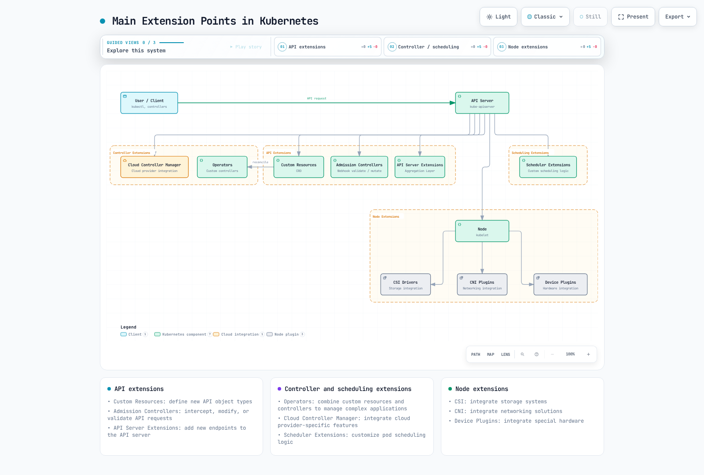
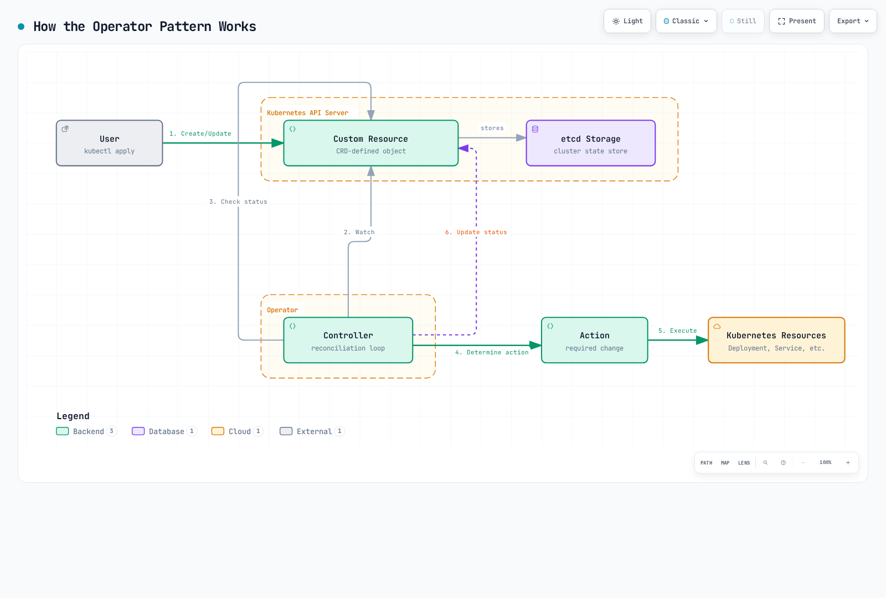
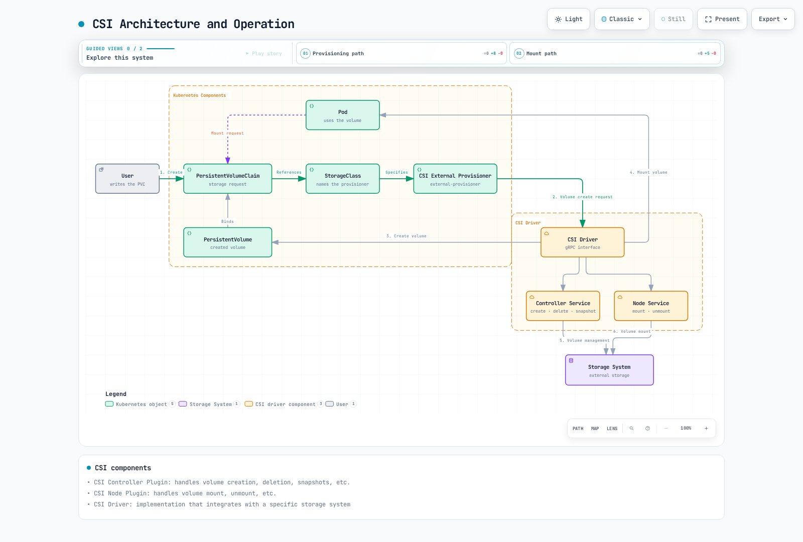
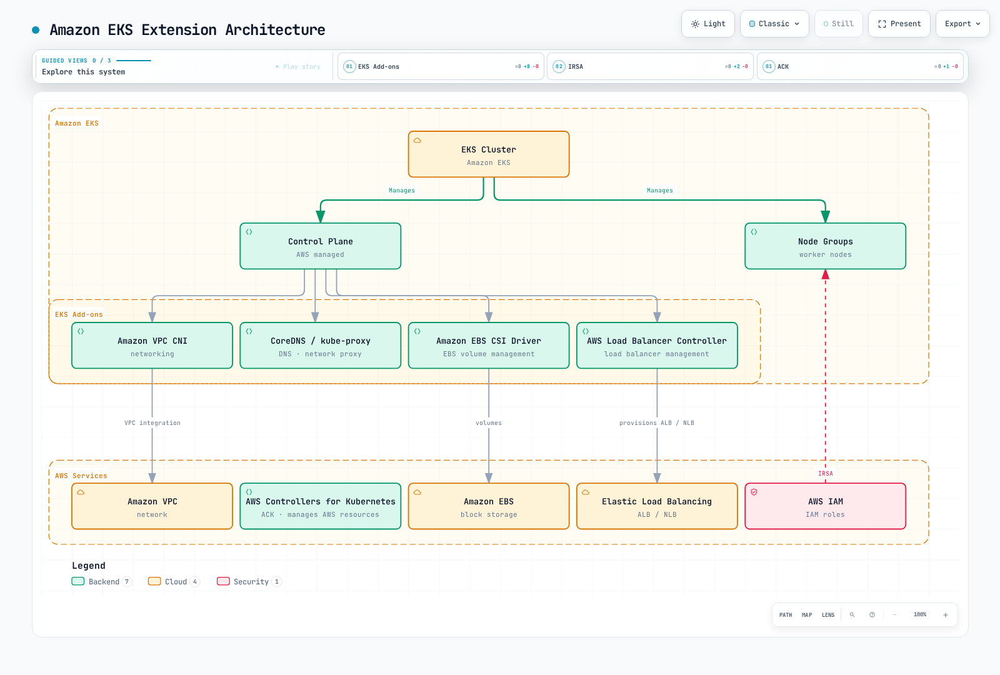

# 扩展 Kubernetes

> **支持的版本**: Kubernetes 1.32, 1.33, 1.34
> **最后更新**: February 19, 2026

Kubernetes 是一个以可扩展性为设计理念的平台，使您能够通过多种方式扩展其功能。在本章中，我们将探讨扩展 Kubernetes 的各种方法，以及如何在 Amazon EKS 中利用扩展功能。

## 目录
1. [Kubernetes 扩展概述](#kubernetes-extension-overview)
2. [自定义资源](#custom-resources)
3. [Operator 模式](#operator-pattern)
4. [准入控制器](#admission-controllers)
5. [API Server 扩展](#api-server-extensions)
6. [调度器扩展](#scheduler-extensions)
7. [Cloud Controller Manager](#cloud-controller-manager)
8. [CSI (Container Storage Interface)](#csi-container-storage-interface)
9. [CNI (Container Network Interface)](#cni-container-network-interface)
10. [设备插件](#device-plugins)
11. [Amazon EKS 中的扩展功能](#extension-features-in-amazon-eks)
12. [最佳实践](#best-practices)
13. [结论](#conclusion)

## Kubernetes 扩展概述

Kubernetes 提供了多种扩展点，可用于扩展和自定义其基本功能。主要扩展点包括：

1. **自定义资源**：定义新的 API 对象类型
2. **Operator**：结合自定义资源和控制器来管理复杂应用程序
3. **准入控制器**：拦截、修改或验证 API 请求
4. **API Server 扩展**：向 API Server 添加新端点
5. **调度器扩展**：自定义 Pod 调度逻辑
6. **Cloud Controller Manager**：集成云提供商特定功能
7. **CSI (Container Storage Interface)**：集成存储系统
8. **CNI (Container Network Interface)**：集成网络解决方案
9. **设备插件**：集成特殊硬件

下图展示了 Kubernetes 中的主要扩展点：



[🔍 查看交互式图表](https://www.atomai.click/kubernetes-docs/archmaps/en-core-11-extending-kubernetes-0.html)

### 选择扩展方法

选择合适扩展方法时的考虑因素：

1. **使用场景**：您希望扩展的功能类型
2. **复杂性**：实现和维护的复杂性
3. **性能影响**：扩展对集群性能的影响
4. **升级兼容性**：与 Kubernetes 版本升级的兼容性
5. **社区支持**：扩展方法获得的社区支持程度

## 自定义资源

自定义资源是一种扩展 Kubernetes API 以定义新对象类型的方式。

下图展示了自定义资源的工作原理：


[🔍 查看交互式图表](https://www.atomai.click/kubernetes-docs/archmaps/en-core-11-extending-kubernetes-1.html)

### 自定义资源定义 (CRD)

CRD 是定义新资源类型的最简单方式：

```yaml
apiVersion: apiextensions.k8s.io/v1
kind: CustomResourceDefinition
metadata:
  name: backups.example.com
spec:
  group: example.com
  names:
    kind: Backup
    listKind: BackupList
    plural: backups
    singular: backup
    shortNames:
    - bk
  scope: Namespaced
  versions:
  - name: v1
    served: true
    storage: true
    schema:
      openAPIV3Schema:
        type: object
        properties:
          spec:
            type: object
            properties:
              source:
                type: string
              destination:
                type: string
              schedule:
                type: string
            required:
            - source
            - destination
          status:
            type: object
            properties:
              phase:
                type: string
              lastBackupTime:
                type: string
                format: date-time
    subresources:
      status: {}
    additionalPrinterColumns:
    - name: Status
      type: string
      jsonPath: .status.phase
    - name: Age
      type: date
      jsonPath: .metadata.creationTimestamp
```

在上例中，我们定义了名为 `Backup` 的新资源类型，并指定了该资源的架构和额外的打印列。

### 创建自定义资源实例

定义 CRD 后，您可以创建该类型的资源实例：

```yaml
apiVersion: example.com/v1
kind: Backup
metadata:
  name: daily-backup
spec:
  source: /data
  destination: s3://my-bucket/backups
  schedule: "0 0 * * *"
```

### 自定义资源验证

您可以使用 CRD 中的 OpenAPI v3 架构来验证自定义资源：

```yaml
openAPIV3Schema:
  type: object
  properties:
    spec:
      type: object
      properties:
        replicas:
          type: integer
          minimum: 1
          maximum: 10
        image:
          type: string
          pattern: '^[a-zA-Z0-9./:_-]+$'
      required:
      - replicas
      - image
```

在上例中，`replicas` 字段必须是介于 1 到 10 之间的整数，而 `image` 字段必须与指定的模式匹配。

### 版本管理

CRD 支持多个版本，以实现 API 演进：

```yaml
versions:
- name: v1alpha1
  served: true
  storage: false
- name: v1beta1
  served: true
  storage: false
- name: v1
  served: true
  storage: true
```

在上例中，提供了 `v1alpha1`、`v1beta1` 和 `v1` 三个版本，但数据以 `v1` 格式存储。

### 转换 Webhook

您可以使用转换 Webhook 来处理不同版本之间的转换：

```yaml
apiVersion: apiextensions.k8s.io/v1
kind: CustomResourceDefinition
metadata:
  name: backups.example.com
spec:
  # ... other fields omitted ...
  conversion:
    strategy: Webhook
    webhook:
      clientConfig:
        service:
          namespace: default
          name: example-conversion-webhook
          path: /convert
      conversionReviewVersions:
      - v1
```

## Operator 模式

Operator 模式通过结合自定义资源和控制器，实现复杂应用程序运维知识的自动化。

下图展示了 Operator 模式的工作原理：



[🔍 查看交互式图表](https://www.atomai.click/kubernetes-docs/archmaps/en-core-11-extending-kubernetes-2.html)

### Operator 概念

Operator 由以下组件构成：

1. **自定义资源定义 (CRD)**：定义要管理的资源的架构
2. **控制器**：监视自定义资源并将其协调到期望状态的逻辑
3. **Kubernetes API Client**：用于与 Kubernetes API 交互的客户端

### Operator 示例

数据库 Operator 示例：

```yaml
# Custom Resource Definition
apiVersion: apiextensions.k8s.io/v1
kind: CustomResourceDefinition
metadata:
  name: databases.example.com
spec:
  group: example.com
  names:
    kind: Database
    listKind: DatabaseList
    plural: databases
    singular: database
    shortNames:
    - db
  scope: Namespaced
  versions:
  - name: v1
    served: true
    storage: true
    schema:
      openAPIV3Schema:
        type: object
        properties:
          spec:
            type: object
            properties:
              engine:
                type: string
                enum:
                - mysql
                - postgresql
              version:
                type: string
              storageSize:
                type: string
              replicas:
                type: integer
                minimum: 1
            required:
            - engine
            - version
            - storageSize
          status:
            type: object
            properties:
              phase:
                type: string
              endpoint:
                type: string
    subresources:
      status: {}
```

```yaml
# Database Instance
apiVersion: example.com/v1
kind: Database
metadata:
  name: my-db
spec:
  engine: postgresql
  version: "13.4"
  storageSize: 10Gi
  replicas: 3
```

### Operator 开发工具

用于开发 Operator 的工具：

1. **Operator SDK**：使用 Go、Ansible 或 Helm 开发 Operator
2. **KUDO (Kubernetes Universal Declarative Operator)**：以声明式方式开发 Operator
3. **Kubebuilder**：基于 Go 的 Operator 开发框架
4. **Metacontroller**：基于 Webhook 的 Operator 开发

#### Operator SDK 示例

使用 Operator SDK 创建 Operator：

```bash
# Install Operator SDK
curl -LO https://github.com/operator-framework/operator-sdk/releases/download/v1.16.0/operator-sdk_linux_amd64
chmod +x operator-sdk_linux_amd64
mv operator-sdk_linux_amd64 /usr/local/bin/operator-sdk

# Create new operator project
operator-sdk init --domain example.com --repo github.com/example/database-operator

# Create API
operator-sdk create api --group database --version v1 --kind Database --resource --controller

# Implement controller (main.go, controllers/database_controller.go, etc.)

# Build and deploy operator
make docker-build docker-push
make deploy
```

### 常用 Operator

常用开源 Operator：

1. **Prometheus Operator**：管理 Prometheus 监控栈
2. **Elasticsearch Operator**：管理 Elasticsearch 集群
3. **etcd Operator**：管理 etcd 集群
4. **PostgreSQL Operator**：管理 PostgreSQL 数据库
5. **Jaeger Operator**：管理 Jaeger 分布式追踪系统
6. **Strimzi Kafka Operator**：管理 Apache Kafka 集群
7. **Istio Operator**：管理 Istio 服务网格
## 准入控制器

准入控制器是拦截 Kubernetes API server 请求并对其进行修改或验证的插件。

下图展示了准入控制器的工作原理：


[🔍 查看交互式图表](https://www.atomai.click/kubernetes-docs/archmaps/en-core-11-extending-kubernetes-3.html)

### 准入控制器类型

Kubernetes 有两种准入控制器：

1. **变更准入控制器**：可以修改资源
2. **验证准入控制器**：只能验证资源

### 内置准入控制器

Kubernetes 有多个内置准入控制器：

1. **NamespaceLifecycle**：防止在正在删除的命名空间中创建资源
2. **LimitRanger**：为 Pod 和容器设置默认资源限制
3. **ServiceAccount**：自动创建服务账户并添加令牌
4. **DefaultStorageClass**：为 PVC 分配默认存储类
5. **ResourceQuota**：限制每个命名空间的资源使用量
6. **PodSecurityPolicy**：应用 Pod 安全策略
7. **NodeRestriction**：限制节点可以修改的资源

### Webhook 准入控制器

您可以使用 Webhook 准入控制器来实现自定义逻辑：

```yaml
# Mutating Webhook Configuration
apiVersion: admissionregistration.k8s.io/v1
kind: MutatingWebhookConfiguration
metadata:
  name: pod-mutating-webhook
webhooks:
- name: pod-mutator.example.com
  clientConfig:
    service:
      namespace: default
      name: pod-mutating-webhook
      path: "/mutate"
    caBundle: <base64-encoded-ca-cert>
  rules:
  - apiGroups: [""]
    apiVersions: ["v1"]
    resources: ["pods"]
    operations: ["CREATE"]
    scope: "Namespaced"
  admissionReviewVersions: ["v1", "v1beta1"]
  sideEffects: None
  timeoutSeconds: 5
```

```yaml
# Validating Webhook Configuration
apiVersion: admissionregistration.k8s.io/v1
kind: ValidatingWebhookConfiguration
metadata:
  name: pod-validating-webhook
webhooks:
- name: pod-validator.example.com
  clientConfig:
    service:
      namespace: default
      name: pod-validating-webhook
      path: "/validate"
    caBundle: <base64-encoded-ca-cert>
  rules:
  - apiGroups: [""]
    apiVersions: ["v1"]
    resources: ["pods"]
    operations: ["CREATE", "UPDATE"]
    scope: "Namespaced"
  admissionReviewVersions: ["v1", "v1beta1"]
  sideEffects: None
  timeoutSeconds: 5
```

### Webhook 服务器实现

Webhook 服务器必须实现如下端点：

```go
// Mutating webhook example
func mutateHandler(w http.ResponseWriter, r *http.Request) {
    var body []byte
    if r.Body != nil {
        if data, err := ioutil.ReadAll(r.Body); err == nil {
            body = data
        }
    }

    // Convert to AdmissionReview object
    admissionReview := v1.AdmissionReview{}
    if err := json.Unmarshal(body, &admissionReview); err != nil {
        http.Error(w, "Could not parse admission review request", http.StatusBadRequest)
        return
    }

    // Extract Pod object
    pod := corev1.Pod{}
    if err := json.Unmarshal(admissionReview.Request.Object.Raw, &pod); err != nil {
        http.Error(w, "Could not parse pod object", http.StatusBadRequest)
        return
    }

    // Create patch
    patches := []map[string]interface{}{
        {
            "op":    "add",
            "path":  "/metadata/labels/injected-by",
            "value": "mutating-webhook",
        },
    }

    patchBytes, _ := json.Marshal(patches)

    // Create response
    admissionResponse := v1.AdmissionResponse{
        UID:     admissionReview.Request.UID,
        Allowed: true,
        Patch:   patchBytes,
        PatchType: func() *v1.PatchType {
            pt := v1.PatchTypeJSONPatch
            return &pt
        }(),
    }

    admissionReview.Response = &admissionResponse
    resp, _ := json.Marshal(admissionReview)
    w.Header().Set("Content-Type", "application/json")
    w.Write(resp)
}
```

```go
// Validating webhook example
func validateHandler(w http.ResponseWriter, r *http.Request) {
    var body []byte
    if r.Body != nil {
        if data, err := ioutil.ReadAll(r.Body); err == nil {
            body = data
        }
    }

    // Convert to AdmissionReview object
    admissionReview := v1.AdmissionReview{}
    if err := json.Unmarshal(body, &admissionReview); err != nil {
        http.Error(w, "Could not parse admission review request", http.StatusBadRequest)
        return
    }

    // Extract Pod object
    pod := corev1.Pod{}
    if err := json.Unmarshal(admissionReview.Request.Object.Raw, &pod); err != nil {
        http.Error(w, "Could not parse pod object", http.StatusBadRequest)
        return
    }

    // Validation logic
    allowed := true
    var message string
    for _, container := range pod.Spec.Containers {
        if container.Image == "nginx:latest" {
            allowed = false
            message = "Using 'latest' tag is not allowed. Please specify a version."
            break
        }
    }

    // Create response
    admissionResponse := v1.AdmissionResponse{
        UID:     admissionReview.Request.UID,
        Allowed: allowed,
    }

    if !allowed {
        admissionResponse.Result = &metav1.Status{
            Message: message,
        }
    }

    admissionReview.Response = &admissionResponse
    resp, _ := json.Marshal(admissionReview)
    w.Header().Set("Content-Type", "application/json")
    w.Write(resp)
}
```

### 常用准入控制器项目

1. **OPA Gatekeeper**：使用 Open Policy Agent 执行策略
2. **Kyverno**：基于 YAML 的策略引擎
3. **Istio**：服务网格 Sidecar 注入
4. **cert-manager**：TLS 证书管理

## API Server 扩展

API Server 扩展是一种向 Kubernetes API server 添加新端点的方式。

### 扩展 API Server

扩展 API Server 是与 Kubernetes API server 分开运行并提供自定义 API 的服务器：

```yaml
# APIService Definition
apiVersion: apiregistration.k8s.io/v1
kind: APIService
metadata:
  name: v1.example.com
spec:
  group: example.com
  version: v1
  groupPriorityMinimum: 1000
  versionPriority: 15
  service:
    name: example-api
    namespace: default
  caBundle: <base64-encoded-ca-cert>
```

### 扩展 API Server 实现

扩展 API Server 由以下组件构成：

1. **API Server**：提供类似 Kubernetes API server 的接口
2. **资源处理器**：处理特定资源类型的请求
3. **存储后端**：存储资源数据

```go
// Extension API Server Example
func main() {
    // Server configuration
    config := genericapiserver.NewRecommendedConfig(apiserver.Codecs)
    config.OpenAPIConfig = genericapiserver.DefaultOpenAPIConfig(
        sampleopenapi.GetOpenAPIDefinitions,
        openapi.NewDefinitionNamer(apiserver.Scheme),
    )
    config.EnableIndex = true
    config.EnableDiscovery = true

    // Create server
    server, err := config.Complete().New("sample-apiserver", genericapiserver.NewEmptyDelegate())
    if err != nil {
        log.Fatalf("Error creating server: %v", err)
    }

    // Set API group info
    apiGroupInfo := genericapiserver.NewDefaultAPIGroupInfo(
        samplev1alpha1.GroupName,
        apiserver.Scheme,
        metav1.ParameterCodec,
        apiserver.Codecs,
    )

    // Set storage
    apiGroupInfo.VersionedResourcesStorageMap["v1alpha1"] = map[string]rest.Storage{
        "widgets": NewWidgetStorage(),
    }

    // Install API group
    if err := server.InstallAPIGroup(&apiGroupInfo); err != nil {
        log.Fatalf("Error installing API group: %v", err)
    }

    // Run server
    if err := server.PrepareRun().Run(stopCh); err != nil {
        log.Fatalf("Error running server: %v", err)
    }
}
```

### 聚合层

聚合层使多个 API Server 呈现为单个 API Server：

```
                                   +-----------------+
                                   |                 |
                                   |  kube-apiserver |
                                   |                 |
                                   +-------+---------+
                                           |
                                           v
                      +--------------------+--------------------+
                      |                                         |
                      |                                         |
          +-----------v-----------+               +------------v------------+
          |                       |               |                         |
          |  metrics-server       |               |  example-apiserver      |
          |                       |               |                         |
          +-----------------------+               +-------------------------+
```

## 调度器扩展

调度器扩展是一种自定义 Kubernetes 调度器行为的方式。

### 调度器框架

Kubernetes 1.15 引入的调度器框架允许通过插件扩展调度流水线的各个阶段：

1. **队列排序**：对调度队列中的 Pod 排序
2. **预过滤**：在过滤前检查 Pod 和集群状态
3. **过滤**：筛选出无法运行 Pod 的节点
4. **后过滤**：在过滤后执行操作
5. **预评分**：在分数计算前执行操作
6. **评分**：为节点分配分数
7. **标准化评分**：标准化分数
8. **预留**：为 Pod 预留资源
9. **许可**：允许、拒绝或延迟 Pod 调度
10. **预绑定**：在绑定前执行操作
11. **绑定**：将 Pod 绑定到节点
12. **后绑定**：在绑定后执行操作

### 调度器配置

调度器配置示例：

```yaml
apiVersion: kubescheduler.config.k8s.io/v1beta1
kind: KubeSchedulerConfiguration
leaderElection:
  leaderElect: true
clientConnection:
  kubeconfig: /etc/kubernetes/scheduler.conf
profiles:
- schedulerName: default-scheduler
  plugins:
    queueSort:
      enabled:
      - name: PrioritySort
    preFilter:
      enabled:
      - name: NodeResourcesFit
      - name: NodePorts
      - name: PodTopologySpread
      - name: InterPodAffinity
      - name: VolumeBinding
      - name: NodeAffinity
    filter:
      enabled:
      - name: NodeUnschedulable
      - name: NodeName
      - name: TaintToleration
      - name: NodeAffinity
      - name: NodePorts
      - name: NodeResourcesFit
      - name: VolumeRestrictions
      - name: EBSLimits
      - name: GCEPDLimits
      - name: NodeVolumeLimits
      - name: AzureDiskLimits
      - name: VolumeBinding
      - name: VolumeZone
      - name: PodTopologySpread
      - name: InterPodAffinity
    postFilter:
      enabled:
      - name: DefaultPreemption
    preScore:
      enabled:
      - name: InterPodAffinity
      - name: PodTopologySpread
      - name: TaintToleration
      - name: NodeAffinity
    score:
      enabled:
      - name: NodeResourcesBalancedAllocation
        weight: 1
      - name: ImageLocality
        weight: 1
      - name: InterPodAffinity
        weight: 1
      - name: NodeResourcesFit
        weight: 1
      - name: NodeAffinity
        weight: 1
      - name: PodTopologySpread
        weight: 2
      - name: TaintToleration
        weight: 1
    reserve:
      enabled:
      - name: VolumeBinding
    permit:
      enabled: []
    preBind:
      enabled:
      - name: VolumeBinding
    bind:
      enabled:
      - name: DefaultBinder
    postBind:
      enabled: []
```

### 自定义调度器

您还可以实现自己的调度器，使其与 Kubernetes 一起运行：

```yaml
apiVersion: apps/v1
kind: Deployment
metadata:
  name: custom-scheduler
  namespace: kube-system
spec:
  replicas: 1
  selector:
    matchLabels:
      app: custom-scheduler
  template:
    metadata:
      labels:
        app: custom-scheduler
    spec:
      serviceAccountName: custom-scheduler
      containers:
      - name: custom-scheduler
        image: example/custom-scheduler:v1.0.0
        command:
        - /custom-scheduler
        - --kubeconfig=/etc/kubernetes/scheduler.conf
        volumeMounts:
        - name: kubeconfig
          mountPath: /etc/kubernetes/scheduler.conf
          readOnly: true
      volumes:
      - name: kubeconfig
        hostPath:
          path: /etc/kubernetes/scheduler.conf
          type: File
```

为 Pod 指定自定义调度器：

```yaml
apiVersion: v1
kind: Pod
metadata:
  name: custom-scheduled-pod
spec:
  schedulerName: custom-scheduler
  containers:
  - name: container
    image: nginx
```

## Cloud Controller Manager

Cloud Controller Manager 提供 Kubernetes 与云提供商之间的接口。

### Cloud Controller Manager 组件

Cloud Controller Manager 由以下控制器构成：

1. **Node Controller**：通过云提供商 API 更新节点信息
2. **Route Controller**：在云网络中设置路由
3. **Service Controller**：创建、更新和删除云负载均衡器

### AWS Cloud Controller Manager

AWS Cloud Controller Manager 配置示例：

```yaml
apiVersion: v1
kind: ConfigMap
metadata:
  name: aws-cloud-controller-manager
  namespace: kube-system
data:
  cloud.conf: |
    [global]
    zone = us-east-1a
    vpc = vpc-xxx
    subnet-id = subnet-xxx
    role-arn = arn:aws:iam::xxx:role/xxx
    kubernetes.io/cluster/my-cluster = owned
---
apiVersion: apps/v1
kind: DaemonSet
metadata:
  name: aws-cloud-controller-manager
  namespace: kube-system
spec:
  selector:
    matchLabels:
      k8s-app: aws-cloud-controller-manager
  template:
    metadata:
      labels:
        k8s-app: aws-cloud-controller-manager
    spec:
      nodeSelector:
        node-role.kubernetes.io/master: ""
      tolerations:
      - key: node.cloudprovider.kubernetes.io/uninitialized
        value: "true"
        effect: NoSchedule
      - key: node-role.kubernetes.io/master
        effect: NoSchedule
      serviceAccountName: cloud-controller-manager
      containers:
      - name: aws-cloud-controller-manager
        image: k8s.gcr.io/cloud-controller-manager:v1.21.0
        command:
        - /usr/local/bin/cloud-controller-manager
        - --cloud-provider=aws
        - --cloud-config=/etc/kubernetes/cloud.conf
        - --use-service-account-credentials
        - --allocate-node-cidrs=false
        volumeMounts:
        - name: cloud-config
          mountPath: /etc/kubernetes/cloud.conf
          readOnly: true
      volumes:
      - name: cloud-config
        configMap:
          name: aws-cloud-controller-manager
```
## CSI (Container Storage Interface)

CSI 在 Kubernetes 与存储系统之间提供标准接口。

下图展示了 CSI 的架构和运行方式：



[🔍 查看交互式图表](https://www.atomai.click/kubernetes-docs/archmaps/en-core-11-extending-kubernetes-4.html)

### CSI 架构

CSI 由以下组件构成：

1. **CSI Controller Plugin**：处理卷创建、删除、快照等操作
2. **CSI Node Plugin**：处理卷挂载、卸载等操作
3. **CSI Driver**：与特定存储系统集成的实现

```
+-------------------+
|                   |
|  Kubernetes       |
|  (External        |
|   Provisioner)    |
|                   |
+--------+----------+
         |
         | gRPC
         v
+--------+----------+
|                   |
|  CSI Driver       |
|                   |
+--------+----------+
         |
         | Storage Protocol
         v
+--------+----------+
|                   |
|  Storage System   |
|                   |
+-------------------+
```

### CSI 驱动程序部署

CSI 驱动程序部署示例：

```yaml
# CSI Controller Service
apiVersion: apps/v1
kind: Deployment
metadata:
  name: csi-controller
spec:
  replicas: 1
  selector:
    matchLabels:
      app: csi-controller
  template:
    metadata:
      labels:
        app: csi-controller
    spec:
      serviceAccountName: csi-controller
      containers:
      - name: csi-provisioner
        image: k8s.gcr.io/sig-storage/csi-provisioner:v2.1.0
        args:
        - "--csi-address=$(ADDRESS)"
        - "--v=5"
        env:
        - name: ADDRESS
          value: /var/lib/csi/sockets/pluginproxy/csi.sock
        volumeMounts:
        - name: socket-dir
          mountPath: /var/lib/csi/sockets/pluginproxy/
      - name: csi-attacher
        image: k8s.gcr.io/sig-storage/csi-attacher:v3.1.0
        args:
        - "--csi-address=$(ADDRESS)"
        - "--v=5"
        env:
        - name: ADDRESS
          value: /var/lib/csi/sockets/pluginproxy/csi.sock
        volumeMounts:
        - name: socket-dir
          mountPath: /var/lib/csi/sockets/pluginproxy/
      - name: csi-driver
        image: example/csi-driver:v1.0.0
        args:
        - "--endpoint=$(CSI_ENDPOINT)"
        - "--nodeid=$(NODE_ID)"
        env:
        - name: CSI_ENDPOINT
          value: unix:///var/lib/csi/sockets/pluginproxy/csi.sock
        - name: NODE_ID
          valueFrom:
            fieldRef:
              fieldPath: spec.nodeName
        volumeMounts:
        - name: socket-dir
          mountPath: /var/lib/csi/sockets/pluginproxy/
      volumes:
      - name: socket-dir
        emptyDir: {}

# CSI Node Service
apiVersion: apps/v1
kind: DaemonSet
metadata:
  name: csi-node
spec:
  selector:
    matchLabels:
      app: csi-node
  template:
    metadata:
      labels:
        app: csi-node
    spec:
      serviceAccountName: csi-node
      hostNetwork: true
      containers:
      - name: csi-node-driver-registrar
        image: k8s.gcr.io/sig-storage/csi-node-driver-registrar:v2.1.0
        args:
        - "--csi-address=$(ADDRESS)"
        - "--kubelet-registration-path=$(DRIVER_REG_SOCK_PATH)"
        - "--v=5"
        env:
        - name: ADDRESS
          value: /csi/csi.sock
        - name: DRIVER_REG_SOCK_PATH
          value: /var/lib/kubelet/plugins/example.csi.k8s.io/csi.sock
        volumeMounts:
        - name: plugin-dir
          mountPath: /csi
        - name: registration-dir
          mountPath: /registration
      - name: csi-driver
        image: example/csi-driver:v1.0.0
        args:
        - "--endpoint=$(CSI_ENDPOINT)"
        - "--nodeid=$(NODE_ID)"
        env:
        - name: CSI_ENDPOINT
          value: unix:///csi/csi.sock
        - name: NODE_ID
          valueFrom:
            fieldRef:
              fieldPath: spec.nodeName
        securityContext:
          privileged: true
        volumeMounts:
        - name: plugin-dir
          mountPath: /csi
        - name: pods-mount-dir
          mountPath: /var/lib/kubelet/pods
          mountPropagation: "Bidirectional"
      volumes:
      - name: plugin-dir
        hostPath:
          path: /var/lib/kubelet/plugins/example.csi.k8s.io
          type: DirectoryOrCreate
      - name: registration-dir
        hostPath:
          path: /var/lib/kubelet/plugins_registry
          type: Directory
      - name: pods-mount-dir
        hostPath:
          path: /var/lib/kubelet/pods
          type: Directory
```

### 存储类和 PVC

使用 CSI 驱动程序的存储类和 PVC 示例：

```yaml
# Storage Class
apiVersion: storage.k8s.io/v1
kind: StorageClass
metadata:
  name: example-csi
provisioner: example.csi.k8s.io
parameters:
  type: ssd
  fsType: ext4
reclaimPolicy: Delete
allowVolumeExpansion: true
volumeBindingMode: Immediate

# PVC
apiVersion: v1
kind: PersistentVolumeClaim
metadata:
  name: example-pvc
spec:
  accessModes:
  - ReadWriteOnce
  resources:
    requests:
      storage: 10Gi
  storageClassName: example-csi
```

### 常用 CSI 驱动程序

1. **AWS EBS CSI Driver**：AWS EBS 卷管理
2. **AWS EFS CSI Driver**：AWS EFS 文件系统管理
3. **GCE PD CSI Driver**：Google Compute Engine 持久磁盘管理
4. **Azure Disk CSI Driver**：Azure 磁盘管理
5. **Ceph RBD CSI Driver**：Ceph RBD 卷管理
6. **NFS CSI Driver**：NFS 卷管理

## CNI (Container Network Interface)

CNI 在 Kubernetes 与网络解决方案之间提供标准接口。

下图展示了 CNI 的架构和运行方式：


[🔍 查看交互式图表](https://www.atomai.click/kubernetes-docs/archmaps/en-core-11-extending-kubernetes-5.html)

### CNI 架构

CNI 由以下组件构成：

1. **CNI Plugin**：配置容器网络接口
2. **IPAM Plugin**：IP 地址分配和管理
3. **Meta Plugin**：将多个插件组合在一起

```
+-------------------+
|                   |
|  Kubernetes       |
|  (kubelet)        |
|                   |
+--------+----------+
         |
         | CNI Spec
         v
+--------+----------+
|                   |
|  CNI Plugin       |
|                   |
+--------+----------+
         |
         | Network Configuration
         v
+--------+----------+
|                   |
|  Network          |
|                   |
+-------------------+
```

### CNI 插件配置

CNI 插件配置示例：

```json
{
  "cniVersion": "0.4.0",
  "name": "example-network",
  "type": "bridge",
  "bridge": "cni0",
  "isGateway": true,
  "ipMasq": true,
  "ipam": {
    "type": "host-local",
    "subnet": "10.244.0.0/24",
    "routes": [
      { "dst": "0.0.0.0/0" }
    ]
  }
}
```

### 常用 CNI 插件

1. **Calico**：具有增强网络策略和安全功能的 CNI
2. **Flannel**：提供简单的覆盖网络
3. **Cilium**：基于 eBPF 的网络和安全解决方案
4. **Weave Net**：多主机容器网络解决方案
5. **AWS VPC CNI**：与 AWS VPC 集成的 CNI
6. **Azure CNI**：与 Azure 虚拟网络集成的 CNI
7. **Antrea**：基于 Open vSwitch 的网络解决方案

### CNI 插件安装

Calico CNI 插件安装示例：

```bash
kubectl apply -f https://docs.projectcalico.org/manifests/calico.yaml
```

## 设备插件

设备插件在 Kubernetes 与特殊硬件之间提供接口。

### 设备插件架构

设备插件由以下组件构成：

1. **Device Plugin Server**：处理设备发现、分配、初始化等操作
2. **kubelet**：与设备插件通信以将设备分配给 Pod

```
+-------------------+
|                   |
|  Kubernetes       |
|  (kubelet)        |
|                   |
+--------+----------+
         |
         | Device Plugin API
         v
+--------+----------+
|                   |
|  Device Plugin    |
|                   |
+--------+----------+
         |
         | Device Management
         v
+--------+----------+
|                   |
|  Hardware Device  |
|                   |
+-------------------+
```

### NVIDIA GPU 设备插件

NVIDIA GPU 设备插件部署示例：

```yaml
apiVersion: apps/v1
kind: DaemonSet
metadata:
  name: nvidia-device-plugin-daemonset
  namespace: kube-system
spec:
  selector:
    matchLabels:
      name: nvidia-device-plugin-ds
  template:
    metadata:
      labels:
        name: nvidia-device-plugin-ds
    spec:
      tolerations:
      - key: nvidia.com/gpu
        operator: Exists
        effect: NoSchedule
      containers:
      - name: nvidia-device-plugin-ctr
        image: nvidia/k8s-device-plugin:v0.9.0
        securityContext:
          allowPrivilegeEscalation: false
          capabilities:
            drop: ["ALL"]
        volumeMounts:
        - name: device-plugin
          mountPath: /var/lib/kubelet/device-plugins
      volumes:
      - name: device-plugin
        hostPath:
          path: /var/lib/kubelet/device-plugins
```

### 请求 GPU 的 Pod

请求 GPU 的 Pod 示例：

```yaml
apiVersion: v1
kind: Pod
metadata:
  name: gpu-pod
spec:
  containers:
  - name: cuda-container
    image: nvidia/cuda:11.0-base
    command: ["nvidia-smi"]
    resources:
      limits:
        nvidia.com/gpu: 1
```

### 常用设备插件

1. **NVIDIA GPU Device Plugin**：NVIDIA GPU 管理
2. **AMD GPU Device Plugin**：AMD GPU 管理
3. **FPGA Device Plugin**：FPGA 设备管理
4. **InfiniBand Device Plugin**：InfiniBand 设备管理
5. **SR-IOV Network Device Plugin**：SR-IOV 网络设备管理

## Amazon EKS 中的扩展功能

Amazon EKS 支持多种扩展功能，以扩展 Kubernetes 集群功能。

下图展示了 Amazon EKS 中的扩展功能架构：



[🔍 查看交互式图表](https://www.atomai.click/kubernetes-docs/archmaps/en-core-11-extending-kubernetes-6.html)

### EKS 附加组件

Amazon EKS 提供以下附加组件：

1. **Amazon VPC CNI**：与 AWS VPC 集成的网络
2. **CoreDNS**：集群内的 DNS 服务
3. **kube-proxy**：网络代理
4. **Amazon EBS CSI Driver**：EBS 卷管理
5. **AWS Load Balancer Controller**：AWS 负载均衡器管理

```bash
# List EKS add-ons
aws eks list-addons --cluster-name my-cluster

# Install EKS add-on
aws eks create-addon \
  --cluster-name my-cluster \
  --addon-name amazon-ebs-csi-driver \
  --service-account-role-arn arn:aws:iam::123456789012:role/AmazonEKS_EBS_CSI_DriverRole

# Update EKS add-on
aws eks update-addon \
  --cluster-name my-cluster \
  --addon-name amazon-ebs-csi-driver \
  --addon-version v1.5.0-eksbuild.1

# Delete EKS add-on
aws eks delete-addon \
  --cluster-name my-cluster \
  --addon-name amazon-ebs-csi-driver
```

### AWS Controllers for Kubernetes (ACK)

ACK 是一组 Operator，可让您从 Kubernetes 管理 AWS 资源：

```bash
# Install ACK controller
helm repo add ack-controller https://aws.github.io/aws-controllers-k8s
helm install ack-s3-controller ack-controller/s3-chart

# Create S3 bucket
cat <<EOF | kubectl apply -f -
apiVersion: s3.services.k8s.aws/v1alpha1
kind: Bucket
metadata:
  name: my-bucket
spec:
  name: my-bucket-123456
EOF
```

### AWS Load Balancer Controller

AWS Load Balancer Controller 将 Kubernetes Service 和 Ingress 与 AWS 负载均衡器集成：

```yaml
# ALB Ingress example
apiVersion: networking.k8s.io/v1
kind: Ingress
metadata:
  name: example-ingress
  annotations:
    kubernetes.io/ingress.class: alb
    alb.ingress.kubernetes.io/scheme: internet-facing
    alb.ingress.kubernetes.io/target-type: ip
spec:
  rules:
  - host: example.com
    http:
      paths:
      - path: /
        pathType: Prefix
        backend:
          service:
            name: example-service
            port:
              number: 80
```

### Service Account 的 IAM Roles (IRSA)

IRSA 通过将 AWS IAM role 与 Kubernetes Service Account 关联，使 Pod 能够安全地访问 AWS 服务：

```bash
# Create OIDC provider
eksctl utils associate-iam-oidc-provider \
  --cluster my-cluster \
  --approve

# Create IAM role and service account
eksctl create iamserviceaccount \
  --cluster my-cluster \
  --namespace default \
  --name my-service-account \
  --attach-policy-arn arn:aws:iam::aws:policy/AmazonS3ReadOnlyAccess \
  --approve

# Pod using service account
cat <<EOF | kubectl apply -f -
apiVersion: v1
kind: Pod
metadata:
  name: s3-reader
spec:
  serviceAccountName: my-service-account
  containers:
  - name: aws-cli
    image: amazon/aws-cli:latest
    command:
    - sleep
    - "3600"
EOF
```

## 最佳实践

让我们探讨实现 Kubernetes 扩展功能时应考虑的最佳实践。

### 设计最佳实践

1. **使用标准接口**：尽可能使用 CSI、CNI 等标准接口
2. **声明式 API 设计**：设计声明式 API，而非命令式 API
3. **遵循 Kubernetes 设计原则**：遵循控制器模式、水平触发等原则
4. **版本管理**：管理 API 版本并保持兼容性
5. **最小权限原则**：仅授予必要的最小权限

### 实现最佳实践

1. **利用可复用库**：利用 client-go、controller-runtime 等库
2. **适当的错误处理**：对错误情况进行适当处理和记录
3. **指数退避**：对重试使用指数退避
4. **设置资源限制**：设置内存和 CPU 限制
5. **状态报告**：准确报告资源状态

### 部署最佳实践

1. **渐进式发布**：逐步发布，而不是一次性更改所有内容
2. **版本管理**：避免对镜像使用 latest 标签
3. **健康检查**：配置适当的存活和就绪探针
4. **日志记录和监控**：配置全面的日志记录和监控
5. **文档**：记录 API 和使用方法

### 安全最佳实践

1. **最小权限原则**：仅授予必要的最小权限
2. **使用 RBAC**：配置适当的 RBAC 策略
3. **网络策略**：配置适当的网络策略
4. **镜像扫描**：扫描容器镜像中的漏洞
5. **Secret 管理**：安全地管理 Secret

### EKS 特定最佳实践

1. **使用托管附加组件**：尽可能使用 EKS 托管附加组件
2. **使用 IRSA**：使用 IRSA 按 Pod 管理 IAM 权限
3. **VPC CNI 配置**：根据网络需求配置 VPC CNI
4. **安全组**：配置适当的安全组
5. **成本优化**：选择合适的实例类型和大小

## 结论

Kubernetes 提供了多种扩展点，可用于扩展和自定义其基本功能。自定义资源、Operator、准入控制器、API Server 扩展、调度器扩展、CSI、CNI 和设备插件使您能够让 Kubernetes 适应各种环境和需求。

Amazon EKS 支持这些扩展功能，还提供 EKS 附加组件、ACK、AWS Load Balancer Controller 和 IRSA 等 AWS 特定功能，以简化 Kubernetes 与 AWS 服务之间的集成。

实现 Kubernetes 扩展功能时，遵循使用标准接口、声明式 API 设计和最小权限原则等最佳实践非常重要。这样，您可以构建稳定且可扩展的 Kubernetes 环境。

## 测验

要测试您在本章所学的内容，请尝试[扩展 Kubernetes 测验](../quizzes/core/11-extending-kubernetes-quiz.md)。
