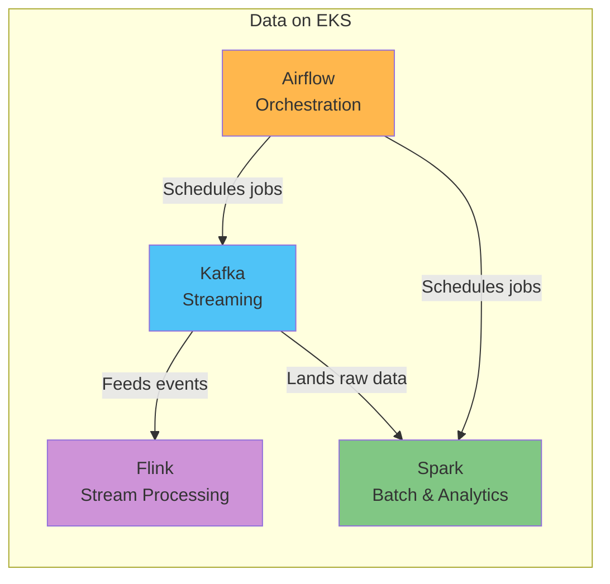

# EKS 上的数据

> **最后更新**: July 9, 2026

## 概述

“Data on EKS” 涵盖在 Amazon EKS 上将 AWS 数据生态系统的核心工作负载——Streaming（流式处理）、Batch Processing（批处理）和 Workflow Orchestration（工作流编排）——作为 Kubernetes-native applications（Kubernetes 原生应用）运行，而不是仅依赖完全托管服务。通过容器和 Operator pattern（Operator 模式）部署 Kafka、Spark、Airflow 和 Flink 等工具，你可以使用已经在 EKS 平台其他部分采用的相同部署、可观测性和伸缩实践来管理数据工作负载。

本节并不是要反对 Amazon MSK、Amazon EMR 或 Amazon MWAA 等完全托管服务。两种方法都存在实际取舍，大多数团队最终会根据运维能力、定制化需求和成本结构来选择其中一种，或将它们结合使用。本节重点介绍当你已经决定直接在 EKS 上运行这些工具后，需要了解的内容。

## 数据工作负载类别

数据平台领域的工具通常分为四类，每类都解决不同的问题。

| 类别 | 解决的问题 | 代表性工具 | Data on EKS 覆盖范围 |
|----------|--------------------|----------------------|------------------------|
| **Streaming（流式处理）** | 实时发布/订阅事件，并在系统之间可靠地连接异步通信 | Apache Kafka | 可用 — [Kafka on EKS](kafka/README.md) |
| **Batch & Analytics（批处理与分析）** | 对大型数据集进行分布式处理，用于 ETL、聚合和 ML pipeline | Apache Spark | 即将推出 |
| **Orchestration（编排）** | 定义数据作业之间的依赖关系和调度，并管理其执行 | Apache Airflow | 即将推出 |
| **Stream Processing（流处理）** | 对流式数据执行实时聚合、转换和有状态计算 | Apache Flink | 即将推出 |

## 为什么在 EKS 上运行这些工具

完全托管服务可以显著降低运维负担，但越来越多团队出于以下原因选择在 EKS 上以原生方式运行这些工具：

- **统一的运维和可观测性**：数据工作负载可以使用与平台其他部分相同的 `kubectl`、GitOps 工作流以及 Prometheus/Grafana stack 进行管理，而不必维护单独的工具链。
- **Autoscaling（自动伸缩）**：[Karpenter](../autoscaling/02-karpenter.md) 驱动的 node autoscaling 结合 HPA/KEDA，使你能够精确扩展 broker、worker 和 executor，以匹配工作负载需求。
- **成本效率**：来自 [EKS cost optimization](../eks/07-eks-cost-optimization.md) 的技术——Spot Instances、更高的 bin-packing 密度等——对数据工作负载和任何其他 Service 一样适用。
- **Multi-tenancy（多租户）**：Kubernetes 隔离原语——namespace、ResourceQuota、NetworkPolicy——让多个团队和工作负载能够安全地共享同一个 cluster。

这种方法确实也伴随着取舍：你的团队需要直接承担 Operator 管理、存储设计和升级策略。后续深入讲解会针对每个工具详细讨论这种平衡。

## 当前已覆盖

- [Kafka on EKS](kafka/README.md) — 使用 Strimzi Operator 在 EKS 上部署和运营 Apache Kafka 的 8 部分深入讲解。

## 路线图

以下主题计划在未来补充：

- **Apache Spark** — EKS 上的分布式批处理和分析 pipeline
- **Apache Airflow** — EKS 上的工作流编排
- **Apache Flink** — EKS 上的实时流处理

## 后续步骤

1. [Kafka on EKS](kafka/README.md) — 基于 Strimzi 的 Kafka 深入讲解
