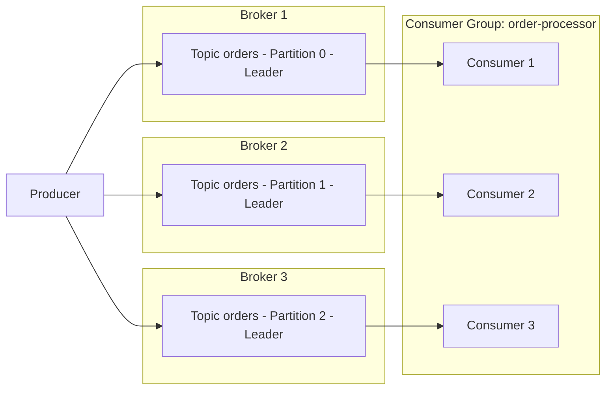

# 第 1 部分：Kafka 基础知识

> **支持的版本**: Apache Kafka 3.9 (KRaft 模式)\
> **最后更新**: July 9, 2026

## 什么是 Apache Kafka？

Apache Kafka 是一个分布式事件流平台，专为处理高容量、实时数据流而构建。它最初由 LinkedIn 开发，后来作为 Apache 项目开源，广泛用于日志聚合、指标管道、事件驱动的微服务以及变更数据捕获（CDC）管道。

本文档介绍在 EKS 上运行 Kafka 之前需要了解的核心概念：Broker、Topic、Partition、Consumer Group、复制以及 KRaft。第 2 部分将演示如何使用 Strimzi Operator 在真实的 EKS 集群上部署这些概念。

## 1. Kafka 架构基础

### 核心术语

* **Broker**：存储消息并处理客户端请求的 Kafka 服务器进程。Kafka 集群通常由多个 Broker 组成。
* **Topic**：用于对消息进行分类的逻辑通道，例如 `orders` 或 `payments`。
* **Partition**：Topic 被拆分成的物理单元。每个 Partition 都是有序的、仅追加的、不可变的日志。
* **Offset**：分配给 Partition 内每条消息的顺序唯一编号。Consumer 使用 Offset 跟踪“已经读取到哪里”。
* **Replication Factor**：Partition 数据被复制到的 Broker 数量，用于在 Broker 故障时防止数据丢失。
* **Leader/Follower Replica**：对于每个 Partition，一个 Replica 被指定为 Leader 并处理所有读写；其余 Follower Replica 从 Leader 复制数据。
* **ISR (In-Sync Replicas)**：与 Leader 足够同步的一组 Replica。当写入以 `acks=all` 发送时，只有在 ISR 中的每个 Replica 都收到消息后，该写入才会被视为成功。

### Producer -> Partitions -> Consumer Group 流程



Producer 将消息写入 Topic，Kafka 会在 Partition 级别将这些消息分布到多个 Broker 上。属于同一个 Consumer Group 的 Consumer 会在它们之间分摊 Partition（大致是一对一），并并行消费消息。

## 2. Partition 和顺序保证

Partition 数量是决定集群并行吞吐量的最重要因素。更多 Partition 可以让更多 Consumer 并发工作，但过多的 Partition 会增加 Broker 上的元数据开销和打开文件句柄数量。

> **关键概念**：Kafka **不**保证整个 Topic 范围内的顺序。顺序只在**单个 Partition 内**得到保证。

### Partition Key 选择策略

当 Producer 发送带有 Key 的消息时，Kafka 会根据该 Key 的哈希值将消息路由到某个 Partition。同一个 Key 总是被路由到同一个 Partition，这就是在共享同一 Key 的事件之间保持顺序的方式。

| 策略 | 描述 | 示例使用场景 |
| --- | --- | --- |
| 无 Key (null) | 轮询或粘性 Partitioner 将消息分散到各个 Partition | 不关心顺序的日志摄取 |
| Entity ID 作为 Key | 将同一实体的事件固定到同一个 Partition | 保留给定订单 ID 的状态事件顺序 |
| 自定义 Partitioner | 根据业务规则路由到 Partition | 将特定客户的流量隔离到专用 Partition |

```bash
# Create a topic with 6 partitions and a replication factor of 3
kafka-topics.sh --create \
  --bootstrap-server localhost:9092 \
  --topic orders \
  --partitions 6 \
  --replication-factor 3 \
  --config min.insync.replicas=2
```

选择不当的 Key 可能会造成“热 Partition”，即流量集中在单个 Partition 上，因此请确保 Key 具有足够的基数（足够多的不同取值），以便均匀分散负载。

## 3. Consumer Group 和 Rebalancing

### Consumer Group 的工作方式

共享同一个 `group.id` 的 Consumer 会组成一个 **Consumer Group**。Kafka 会自动把 Topic 的 Partition 分配给该 Group 中的 Consumer 实例，并且每个 Partition 在该 Group 内只会被一个 Consumer 读取（如果 Consumer 数量多于 Partition，部分 Consumer 会处于空闲状态）。

### 触发 Rebalance 的原因

* 新 Consumer 加入 Group
* 现有 Consumer 离开 Group（优雅关闭），或通过心跳超时被检测为已离开
* Topic 上的 Partition 数量发生变化
* Consumer 未能在 `session.timeout.ms` 内发送心跳，或由于处理时间过长而超过 `max.poll.interval.ms`

Rebalance 进行期间，受影响 Group 的消费会短暂停止，因此过于频繁的 Rebalance 会损害吞吐量。使用 `CooperativeStickyAssignor` 可以在 Rebalance 期间最大限度减少 Partition 移动并降低其成本。

### Offset Commit 策略

| 策略 | 配置 | 特点 |
| --- | --- | --- |
| 自动提交 | `enable.auto.commit=true`（默认） | 方便的周期性提交，但 Offset 可能在处理完成前被提交，从而带来消息丢失风险 |
| 手动提交（同步） | `enable.auto.commit=false` + `commitSync()` | 仅在处理完成后提交 — 更安全，但吞吐量较低 |
| 手动提交（异步） | `enable.auto.commit=false` + `commitAsync()` | 吞吐量更高，但应用程序必须自行处理提交失败 |

### 交付语义

* **At-most-once**：Offset 在消息处理前提交。故障时消息可能丢失。
* **At-least-once**：Offset 在处理后提交（通常推荐的默认方式）。故障时消息可能会被重新处理，因此 Consumer 逻辑应设计为幂等。
* **Exactly-once**：将 Producer 的幂等选项与事务 API（`transactional.id`）结合，可在 Kafka 内部（Topic 到 Topic）实现 Exactly-once 处理。跨外部系统的 Exactly-once 处理需要额外的设计工作（例如 Kafka Connect 中的 Exactly-once Sink Connector）。

## 4. KRaft：不使用 ZooKeeper 的 Kafka

过去，Kafka 依赖独立的 ZooKeeper Ensemble 来管理集群元数据 — Topic/Partition 信息、ACL 以及 Controller 选举。从 Kafka 3.3 开始，**KRaft（Kafka Raft 元数据模式）** 达到生产就绪（GA）状态，而 **Kafka 4.0（于 2025 年 3 月发布）** 完全移除了 ZooKeeper 模式，使 KRaft 成为唯一受支持的元数据管理机制。

### KRaft 架构

KRaft 不再使用独立的 ZooKeeper 集群，而是指定 Kafka Broker 进程的一个子集作为 **Controller Quorum**。

* **Controller Voter**：参与 Raft 共识协议并复制元数据日志的节点（通常为奇数个，例如 3 个或 5 个，以形成 Quorum）。
* **Active Controller**：被选举为 Leader 的单个 Voter，实际处理集群元数据变更 — Partition Leader 选举、Topic 创建等。
* 对于较小集群，Controller 和 Broker 角色可以合并在同一个进程中（`process.roles=broker,controller`）；对于较大部署，也可以拆分为专用的仅 Controller 节点（`process.roles=controller`）。

### 前后对比

| 方面 | 基于 ZooKeeper（Kafka 3.x 及以前的默认方式） | 基于 KRaft（3.3+ 中 GA，4.0+ 中唯一模式） |
| --- | --- | --- |
| 元数据存储 | 独立的 ZooKeeper Ensemble | Kafka 自身的内部元数据 Topic（`__cluster_metadata`） |
| 所需集群 | 两个 — Kafka 集群和 ZooKeeper 集群 | 一个 — 仅 Kafka 集群 |
| Controller 选举 | 通过 ZooKeeper 临时 znode 进行 Leader 选举 | 通过 Raft 共识选举 Active Controller |
| 元数据可扩展性 | ZooKeeper 负载随 Partition 数量增长 | 基于日志的复制更适合大规模 Partition 数量 |
| Kubernetes 运维开销 | 需要 ZooKeeper StatefulSet、独立 PVC 和独立监控 | 无需管理独立组件 — 只有 Kafka Broker/Controller Pod |

这种差异在 Kubernetes/EKS 环境中非常重要。基于 ZooKeeper 的部署需要同时运行 Kafka StatefulSet 和 ZooKeeper StatefulSet，并在两个组件之间重复配置网络策略、PodDisruptionBudget 和监控。KRaft 消除了这种运维负担，并减少了像 Strimzi 这样的 Operator 需要管理的资源类型数量。第 2 部分介绍的基于 Strimzi 的部署默认使用 KRaft 模式。

### KRaft 节点配置示例 (server.properties)

```properties
# This node acts as both broker and controller (suitable for small clusters)
process.roles=broker,controller
node.id=1

# List of controller quorum voters (node.id@host:port)
controller.quorum.voters=1@kafka-0.kafka-headless:9093,2@kafka-1.kafka-headless:9093,3@kafka-2.kafka-headless:9093

listeners=BROKER://:9092,CONTROLLER://:9093
controller.listener.names=CONTROLLER
inter.broker.listener.name=BROKER

log.dirs=/var/lib/kafka/data
```

## 5. 复制和持久性设置

Producer 对消息是否已“安全存储”的信心取决于三个设置的组合。

* **`replication.factor`**（Topic 级别设置）：决定 Partition 数据被复制到多少个 Broker。建议最小值为 3，可在最多两个 Broker 同时故障的情况下避免数据丢失。
* **`min.insync.replicas`**（Topic 级别设置）：当写入以 `acks=all` 发送时，该设置指定必须拥有该消息的 ISR 成员的最小数量，写入才会被视为成功。常见组合是 `replication.factor=3` 搭配 `min.insync.replicas=2`，这样即使一个 Broker 故障，写入仍然可用。
* **`acks`**（Producer 级别设置）：决定 Producer 在认为写入完成之前等待多少确认。

| `acks` value | 行为 | 持久性 | 延迟/吞吐量 |
| --- | --- | --- | --- |
| `0` | Producer 不等待任何响应 | 最低（消息可能在发送后立即丢失） | 最快 |
| `1` | Leader 写入后即被视为成功 | 中等（如果 Leader 故障，未复制的数据可能丢失） | 快 |
| `all` (`-1`) | 只有每个 ISR Replica 都写入后才被视为成功 | 最高 | 相对较慢 |

```bash
# Dynamically change min.insync.replicas on an existing topic
kafka-configs.sh --bootstrap-server localhost:9092 \
  --alter --entity-type topics --entity-name orders \
  --add-config min.insync.replicas=2
```

常见的生产级组合是 `replication.factor=3`、`min.insync.replicas=2`、Producer `acks=all` 和 `enable.idempotence=true`。该组合可以在单个 Broker 故障时避免数据丢失，而幂等 Producer 设置可防止网络重试导致的重复写入。请注意，与 `acks=1` 相比，`acks=all` 会增加延迟，因此对延迟敏感且能够容忍一定数据丢失的工作负载（例如指标摄取）有时会通过选择 `acks=1` 在持久性和速度之间做取舍。

## 后续步骤

本文档介绍了 Kafka 的核心概念 — Broker/Topic/Partition 模型、顺序保证的范围、Consumer Group Rebalancing、向 KRaft 的转变，以及复制/持久性设置。第 2 部分介绍如何使用 **Strimzi Operator** 在 Amazon EKS 上将所有这些概念部署为基于 KRaft 的 Kafka 集群。

[返回主页](./)

## 测验

要测试你在本章中学到的内容，请尝试 [Topic 测验](../../quizzes/data-on-eks/kafka/01-kafka-fundamentals-quiz.md)。
