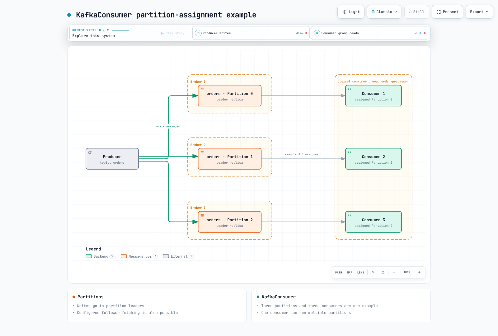

# 第 1 部分：Kafka 基础

> **最后更新**：September 12, 2026。Apache Kafka 4.3.1，由 Strimzi 1.2.0 支持。
> **验证**：十九项检查使用 Kafka 4.3.1 的实际配置类验证有效性、默认值和冲突。未启动任何 broker 或 EKS 集群。

## 1. Broker、Topic 和 Partition

Kafka 在 Partition 日志中存储事件，使 producer 和 consumer 能够独立推进。一个 broker 可以存储多个 Topic 的 Partition 副本；它不必持有整个 Topic。

| 术语 | 含义 |
| --- | --- |
| Broker | 存储数据副本并处理请求的服务器角色 |
| Topic | 逻辑事件类别 |
| Partition | 有序的追加日志；保留和压缩可以移除记录 |
| Offset | 单个 Partition 中的位置，而非全局 ID；删除和事务可能留下可见的间隙 |
| Replication factor | Partition 副本数量，通过创建/重新分配元数据进行管理 |
| Leader / follower | Leader 处理写入，follower 进行复制；配置的 follower 拉取可提供 consumer 读取服务 |
| ISR | 与 Leader 同步程度足够的副本，包括 Leader 本身 |



[查看交互式图表](https://www.atomai.click/kubernetes-docs/archmaps/en-data-on-eks-kafka-01-kafka-fundamentals-0.html)

3:3 图表只是一个示例。使用 KafkaConsumer `subscribe()` 自动 group 分配时，一个 Partition 一次分配给一个 group 成员；一个成员可以拥有多个 Partition。手动 `assign()` 的使用方式需单独管理。多个 group 可以独立消费同一个 Topic。Kafka 4.x Share Groups/KafkaShareConsumer 使用不同的共享和确认模型。

## 2. 顺序和 Partition Key

Kafka 定义的是**一个 Partition 内部**的日志顺序。它不会自动建立全局 Topic 顺序或业务事件时间戳顺序。

保持相同 Key 的一致路由需要一致的序列化、分区和 Partition 数量。增加 Partition 数量可能改变基于哈希的映射。自定义 partitioner 和显式选择的 Partition 也会影响路由。多个 producer、重试和并行应用程序处理需要各自的顺序约定。

空 Key 路由取决于 client/partitioner。仅有较高的 Key 基数并不能保证负载均衡；少数频率极高的 Key 仍可能形成热点 Partition。

此命令会在**已可访问且至少有三个 broker 的集群**中创建一个 Topic。对于已认证的 listener，请添加 `--command-config client.properties`。不要将它原样应用于下面的单节点学习配置。

```bash
: "${DOCS_BOOTSTRAP:?Set the existing Kafka bootstrap host:port}"
kafka-topics.sh --create --bootstrap-server "$DOCS_BOOTSTRAP" \
  --topic orders --partitions 6 --replication-factor 3 \
  --config min.insync.replicas=2
```

## 3. Consumer Group 和 Offset

当 consumer 数量超过 Partition 数量时，基于 Partition 的 group 可能有空闲成员。producer 吞吐量、磁盘、网络和应用程序处理也会影响并发性；仅凭 Partition 数量无法预测吞吐量。

### 区分 group protocol

Kafka 4.3 Java consumer 默认将 `group.protocol` 设为 `classic`。

| 选择 | 分配和超时 |
| --- | --- |
| `classic` | client assignor 以及 `session.timeout.ms` / `heartbeat.interval.ms` |
| `consumer` | server assignor 以及 broker 的 `group.consumer.session.timeout.ms` / `group.consumer.heartbeat.interval.ms` |

经典 eager rebalance 会撤销广泛的一组分配。CooperativeStickyAssignor 会逐步移动需要重新分配的 Partition。较新的 consumer protocol 也会执行 server 端的增量协调。并非每次 rebalance 都会暂停整个 group。不要将经典 client assignor/超时的假设带入新 protocol。

`max.poll.interval.ms` 默认值为 300000 ms。使用静态成员资格（`group.instance.id`）时，超过该值不会立即重新分配 Partition：consumer 会停止 heartbeat，而适用的 session timeout 也会影响重新分配。

### Offset 和业务完成

已提交的 Offset 通常标识下一个要读取的位置。client 获取位置与已完成的外部工作是不同的事实。进行异步/并行处理时，不要提交其工作尚未完成的记录之后的记录。

| 方法 | 含义和注意事项 |
| --- | --- |
| 自动提交 | `enable.auto.commit=true`，默认间隔为 5000 ms；不决定业务完成状态 |
| `commitSync()` | 等待调用完成；延迟影响取决于批处理和频率 |
| `commitAsync()` | 通过 callback 跟踪失败/进度；不要盲目重试过时的 Offset 并使已提交进度倒退 |

处理前提交可能在失败后丢失工作；处理后提交可能在恢复期间重复产生影响。请结合应用程序输出测试失败、重启和 rebalance。

## 4. Exactly-Once 的范围

`enable.idempotence` 可防止同一 producer 传输在重试期间重复写入日志。它不是用于应用程序将同一业务事件作为新 send 提交时的通用去重 Key。

对于 Kafka 到 Kafka 的处理，请在同一个事务中提交输出记录和**下一个输入 Offset**，并让 consumer 使用 `read_committed` 读取。设置一个 `transactional.id` 字符串并不能实现该处理逻辑。外部数据库/API 需要单独的 sink 事务、幂等性和恢复约定。

**`producer.properties`**

```properties
bootstrap.servers=127.0.0.1:19092
key.serializer=org.apache.kafka.common.serialization.StringSerializer
value.serializer=org.apache.kafka.common.serialization.StringSerializer
acks=all
enable.idempotence=true
transactional.id=orders-writer-1
max.in.flight.requests.per.connection=5
delivery.timeout.ms=120000
```

**`consumer.properties`**

```properties
bootstrap.servers=127.0.0.1:19092
key.deserializer=org.apache.kafka.common.serialization.StringDeserializer
value.deserializer=org.apache.kafka.common.serialization.StringDeserializer
group.id=order-processor
group.protocol=consumer
enable.auto.commit=false
isolation.level=read_committed
max.poll.interval.ms=300000
```

事务处理包括 `initTransactions()`、`beginTransaction()`、输出 send、`sendOffsetsToTransaction(...)`、`commitTransaction()` 以及 abort/recovery 处理。并发 producer 需要不同的 transactional ID；请设计稳定的逻辑 writer 重启和 fencing 行为。

显式幂等性要求 `acks=all`、`retries>0` 和 `max.in.flight.requests.per.connection<=5`。冲突会引发 ConfigException。隐式默认幂等性可能因冲突设置而被禁用。较大的 retries 值不会覆盖诸如 `delivery.timeout.ms` 之类的 deadline。

## 5. KRaft 元数据

KRaft 在 Kafka 2.8 中作为早期访问功能推出，在 3.3 中达到生产就绪状态，并且在 Kafka 4.0 移除 ZooKeeper 后成为唯一模式。专用 controller 进程无需提供 broker 数据流量，因此 controller 不一定是数据 broker 的子集。

Controller voter 复制元数据 Raft 日志，其中有一个活动 controller。生产部署通常使用三个或五个 voter。偶数规模的 group 同样具有可计算的多数；在相同的故障容忍度下，奇数规模能更高效地使用资源。

`__cluster_metadata` 是内部元数据日志的名称，而不是通过 KafkaProducer/KafkaConsumer 管理的普通应用程序 Topic。移除 ZooKeeper 并不意味着不再需要负责 controller quorum、存储、升级和监控。

### Dynamic quorum 和 static quorum

Dynamic quorum 将 `controller.quorum.bootstrap.servers` 用作发现种子，而非 voter 成员资格。初始存储格式化和 quorum bootstrap 必须在 cluster ID、目录 ID 和初始 voter 上达成一致。变更时请使用受支持的 controller 添加/移除流程。

Kafka 4.3.1 仍支持静态 `controller.quorum.voters`。请勿为 dynamic quorum 设置它。仅更改种子地址不会自动迁移 static quorum。

此文件用于**单节点本地学习**，而非 HA。它使用 loopback PLAINTEXT listener。启动前，新的数据目录需要适当的存储格式化/bootstrap 流程。绝不可随意格式化现有 Kafka 数据。

**`combined-lab.properties`**

```properties
# Local, single-node configuration for learning; not an HA deployment.
process.roles=broker,controller
node.id=1
controller.quorum.bootstrap.servers=127.0.0.1:19093
listeners=BROKER://127.0.0.1:19092,CONTROLLER://127.0.0.1:19093
advertised.listeners=BROKER://127.0.0.1:19092,CONTROLLER://127.0.0.1:19093
listener.security.protocol.map=BROKER:PLAINTEXT,CONTROLLER:PLAINTEXT
controller.listener.names=CONTROLLER
inter.broker.listener.name=BROKER
log.dirs=./kafka-lab-data
# Single-node internal-topic settings are for this lab only.
offsets.topic.replication.factor=1
transaction.state.log.replication.factor=1
transaction.state.log.min.isr=1
share.coordinator.state.topic.replication.factor=1
share.coordinator.state.topic.min.isr=1
```

自定义 `BROKER` listener 需要显式的 protocol mapping。在相关配置中，Kafka 4.3.1 可以为默认仅 controller 的 `CONTROLLER` listener 提供 PLAINTEXT mapping；缺少 mapping 行并不意味着所有 controller 配置都无效。

在 EKS 上，请使用第 2 部分中由 Strimzi 生成的设置、证书和存储。不要直接编辑由 Operator 管理的 Pod server.properties。请为生产 listener 配置所需的 TLS、认证和授权。

## 6. Replication、写入可用性和持久性

仅有 RF=3 并不能保证所有数据可经受任意两个 broker 故障而存活。请考虑实际复制进度、确认时的 ISR、符合条件的 Leader 选举、存储/网络故障以及 controller quorum。

如果所有三个副本最初都属于健康 ISR，使用 `min.insync.replicas=2` 和 `acks=all` 的 Partition 可以在一个 broker 故障后继续使用两个 ISR 成员，前提是其他条件仍然满足。Leader 切换仍可能导致错误/重试。低于最小 ISR 时，写入会失败或被拒绝，错误详情取决于时机。

| acks | 确认 | 解读 |
| --- | --- | --- |
| `0` | 不等待 broker 响应 | 存储未确认；返回的 Offset 为 -1 |
| `1` | Leader 记录后响应 | 在 follower 复制前 Leader 丢失的风险 |
| `all` / `-1` | 等待当前完整 ISR | 请结合 minimum ISR、复制和 Leader 选举策略评估 |

`acks=all` 并不表示每个磁盘都完成了每条记录的 fsync。acks 本身也不能保证吞吐量或 p99 排名。请使用可比较的负载、批处理和网络来测量确认成本。

可以按如下方式更改 minimum ISR。更改 Replication factor 本身需要副本重新分配，而不是将 `replication.factor` 作为普通 Topic 配置添加。

```bash
kafka-configs.sh --bootstrap-server "$DOCS_BOOTSTRAP" \
  --alter --entity-type topics --entity-name orders \
  --add-config min.insync.replicas=2
```


## 后续步骤和参考资料

- [Strimzi Operator](./02-strimzi-operator.md)
- [Kafka 概览](./README.md)
- [测验](../../quizzes/data-on-eks/kafka/01-kafka-fundamentals-quiz.md)
- [Kafka 设计](https://kafka.apache.org/43/design/design/)
- [Consumer 配置](https://kafka.apache.org/43/configuration/consumer-configs/)
- [Producer 配置](https://kafka.apache.org/43/configuration/producer-configs/)
- [KRaft 操作](https://kafka.apache.org/43/operations/kraft/)
- [Strimzi 1.2.0 发布和迁移通知](https://github.com/strimzi/strimzi-kafka-operator/releases/tag/1.2.0)
