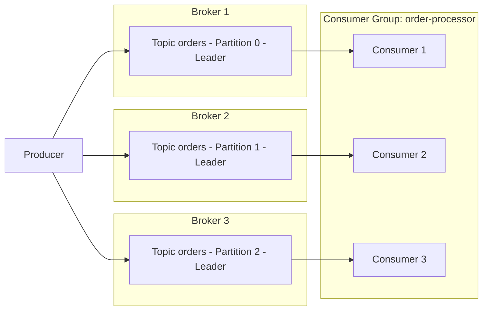

# 第 1 部分：Kafka 基础

> **支持的版本**: Apache Kafka 3.9 (KRaft mode)\
> **最后更新**: July 9, 2026

## 什么是 Apache Kafka？

Apache Kafka 是一个分布式事件流平台，专为处理高容量、实时数据流而构建。它最初由 LinkedIn 开发，后来作为 Apache 项目开源，广泛用于日志聚合、指标管道、事件驱动微服务以及变更数据捕获（CDC）管道。

本文档介绍在 EKS 上运行 Kafka 前需要了解的核心概念：broker、topic、partition、consumer group、replication 和 KRaft。第 2 部分将演示如何使用 Strimzi Operator 在实际的 EKS 集群上部署这些概念。

## 1. Kafka 架构基础

### 核心术语

* **Broker**：存储消息并处理客户端请求的 Kafka 服务器进程。Kafka 集群通常由多个 broker 组成。
* **Topic**：用于对消息进行分类的逻辑通道，例如 `orders` 或 `payments`。
* **Partition**：topic 被拆分后的物理单元。每个 partition 都是一个有序、只能追加且不可变的日志。
* **Offset**：分配给 partition 内每条消息的顺序唯一编号。consumer 使用 offset 跟踪“已读取到什么位置”。
* **Replication Factor**：一个 partition 的数据被复制到的 broker 数量，在 broker 发生故障时防止数据丢失。
* **Leader/Follower Replica**：每个 partition 都有一个 replica 被指定为 leader，负责所有读写操作；其余的 follower replica 从 leader 复制数据。
* **ISR (In-Sync Replicas)**：已充分追上 leader 的 replica 集合。当使用 `acks=all` 发送写入时，只有 ISR 中的每个 replica 都收到消息后，写入才被视为成功。

### Producer -> Partitions -> Consumer Group 流程



producer 将消息写入 topic，Kafka 在 partition 层面将这些消息分布到多个 broker。属于同一 consumer group 的 consumer 会在它们之间分配 partition（大致一对一），并行消费消息。

## 2. Partition 与顺序保证

partition 数量是决定集群并行吞吐量的最重要因素。更多的 partition 可让更多 consumer 并发工作，但过多的 partition 会增加 broker 上的元数据开销和打开的文件句柄数量。

> **关键概念**：Kafka **不**保证整个 topic 范围内的顺序。仅在**单个 partition 内**保证顺序。

### Partition Key 选择策略

当 producer 发送带有 key 的消息时，Kafka 会根据该 key 的哈希值将其路由到一个 partition。相同的 key 始终被路由到相同的 partition，这就是保留共享同一 key 的事件之间顺序的方式。

| 策略 | 描述 | 示例用例 |
| --- | --- | --- |
| 无 key (null) | round-robin 或 sticky partitioner 将消息分布到各个 partition | 不需要保证顺序的日志摄取 |
| 使用实体 ID 作为 key | 将同一实体的事件固定到同一个 partition | 保留给定订单 ID 的状态事件顺序 |
| 自定义 partitioner | 根据业务规则路由 partition | 将特定客户的流量隔离到专用 partition |

```bash
# Create a topic with 6 partitions and a replication factor of 3
kafka-topics.sh --create \
  --bootstrap-server localhost:9092 \
  --topic orders \
  --partitions 6 \
  --replication-factor 3 \
  --config min.insync.replicas=2
```

选择不当的 key 可能会产生“hot partition”，使流量集中到单个 partition，因此请确保 key 具有足够的基数（足够多的不同值），以均匀分散负载。

## 3. Consumer Group 与 Rebalancing

### Consumer Group 的工作方式

共享相同 `group.id` 的 consumer 构成一个 **consumer group**。Kafka 会自动将一个 topic 的 partition 分配给 group 中的 consumer 实例，并且在该 group 内每个 partition 只由一个 consumer 读取（如果 consumer 数量多于 partition，一些 consumer 会处于空闲状态）。

### 触发 Rebalance 的情况

* 新的 consumer 加入 group
* 现有 consumer 离开 group（正常关闭），或者通过 heartbeat 超时被检测为已离开
* topic 上的 partition 数量发生变化
* consumer 未能在 `session.timeout.ms` 内发送 heartbeat，或因处理时间过长而超过 `max.poll.interval.ms`

当 rebalance 进行时，受影响 group 的消费会短暂停止，因此过于频繁的 rebalance 会损害吞吐量。使用 `CooperativeStickyAssignor` 可最大限度减少 rebalance 期间的 partition 移动并降低其成本。

### Offset Commit 策略

| 策略 | 配置 | 特性 |
| --- | --- | --- |
| 自动 commit | `enable.auto.commit=true`（默认） | 方便的定期 commit，但 offset 可能在处理完成前被 commit，存在消息丢失风险 |
| 手动 commit（同步） | `enable.auto.commit=false` + `commitSync()` | 仅在处理完成后 commit —— 更安全，但吞吐量较低 |
| 手动 commit（异步） | `enable.auto.commit=false` + `commitAsync()` | 吞吐量更高，但应用程序必须自行处理 commit 失败 |

### 交付语义

* **至多一次**：消息处理前 commit offset。发生故障时消息可能丢失。
* **至少一次**：处理后 commit offset（通常推荐的默认方式）。发生故障时消息可能被重新处理，因此 consumer 逻辑应设计为幂等。
* **恰好一次**：将 producer 的幂等选项与事务 API（`transactional.id`）结合，可在 Kafka 内部（topic 到 topic）实现恰好一次处理。跨外部系统的恰好一次处理需要额外的设计工作（例如 Kafka Connect 中的恰好一次 sink connector）。

## 4. KRaft：没有 ZooKeeper 的 Kafka

从历史上看，Kafka 依赖独立的 ZooKeeper ensemble 来管理集群元数据——topic/partition 信息、ACL 以及 controller 选举。从 Kafka 3.3 开始，**KRaft（Kafka Raft metadata mode）**已达到生产就绪（GA）状态，而 **Kafka 4.0（于 2025 年 3 月发布）**完全移除了 ZooKeeper mode，使 KRaft 成为唯一受支持的元数据管理机制。

### KRaft 架构

KRaft 不再使用独立的 ZooKeeper 集群，而是指定一部分 Kafka broker 进程充当 **controller quorum**。

* **Controller Voter**：参与 Raft 共识协议并复制元数据日志的节点（通常为奇数个，例如 3 或 5 个，以组成 quorum）。
* **Active Controller**：被选为 leader 的唯一 voter，实际处理集群元数据变更——partition leader 选举、topic 创建等。
* 对于较小的集群，可在同一进程中组合 controller 和 broker 角色（`process.roles=broker,controller`）；对于较大的部署，可将角色拆分为专用的仅 controller 节点（`process.roles=controller`）。

### 前后对比

| 方面 | 基于 ZooKeeper（Kafka 3.x 及以前的默认模式） | 基于 KRaft（3.3+ 中为 GA，4.0+ 中为唯一模式） |
| --- | --- | --- |
| 元数据存储 | 独立的 ZooKeeper ensemble | Kafka 自身的内部元数据 topic（`__cluster_metadata`） |
| 所需集群 | 两个——Kafka 集群和 ZooKeeper 集群 | 一个——仅 Kafka 集群 |
| Controller 选举 | 通过 ZooKeeper ephemeral znode 进行 leader 选举 | 通过 Raft 共识选出 Active Controller |
| 元数据可扩展性 | ZooKeeper 负载随 partition 数量增长 | 基于日志的 replication 更适合大量 partition 的扩展 |
| Kubernetes 运维开销 | 需要 ZooKeeper StatefulSet、独立 PVC 和独立监控 | 无需管理独立组件——只需 Kafka broker/controller Pod |

这种差异在 Kubernetes/EKS 环境中至关重要。基于 ZooKeeper 的部署需要同时运行 Kafka StatefulSet 和 ZooKeeper StatefulSet，并在两个组件间重复配置 network policy、PodDisruptionBudget 和监控。KRaft 消除了这一运维负担，并减少了 Strimzi 等 operator 需要管理的资源类型数量。第 2 部分介绍的基于 Strimzi 的部署默认使用 KRaft mode。

### KRaft 节点配置示例（server.properties）

```properties
# This node acts as both broker and controller (suitable for small clusters)
process.roles=broker,controller
node.id=1

# List of controller quorum voters (node.id@host:port)
controller.quorum.voters=1@kafka-0.kafka-headless:9093,2@kafka-1.kafka-headless:9093,3@kafka-2.kafka-headless:9093

listeners=BROKER://:9092,CONTROLLER://:9093
controller.listener.names=CONTROLLER
inter.broker.listener.name=BROKER

log.dirs=/var/lib/kafka/data
```

## 5. Replication 与持久性设置

producer 对消息是否“安全存储”的信心取决于以下三个设置的组合。

* **`replication.factor`**（topic 级设置）：确定一个 partition 的数据被复制到多少个 broker。建议至少为 3，这可在不丢失数据的情况下容忍最多两个 broker 同时发生故障。
* **`min.insync.replicas`**（topic 级设置）：当使用 `acks=all` 发送写入时，该设置指定 ISR 中必须拥有该消息才能将写入视为成功的最小成员数。常见组合是 `replication.factor=3` 和 `min.insync.replicas=2`，即使一个 broker 发生故障，写入仍可用。
* **`acks`**（producer 级设置）：确定 producer 在将写入视为完成前等待多少确认。

| `acks` 值 | 行为 | 持久性 | 延迟/吞吐量 |
| --- | --- | --- | --- |
| `0` | producer 不等待任何响应 | 最低（消息可能在发送后立即丢失） | 最快 |
| `1` | leader 写入后即视为成功 | 中等（如果 leader 发生故障，未复制的数据可能丢失） | 快 |
| `all` (`-1`) | 仅当每个 ISR replica 都写入后才视为成功 | 最高 | 相对较慢 |

```bash
# Dynamically change min.insync.replicas on an existing topic
kafka-configs.sh --bootstrap-server localhost:9092 \
  --alter --entity-type topics --entity-name orders \
  --add-config min.insync.replicas=2
```

常见的生产级组合是 `replication.factor=3`、`min.insync.replicas=2`、producer `acks=all` 和 `enable.idempotence=true`。该组合可在单个 broker 发生故障时避免数据丢失，而幂等 producer 设置可防止因网络重试导致的重复写入。请注意，与 `acks=1` 相比，`acks=all` 会增加延迟，因此可容忍一定数据丢失的延迟敏感型工作负载（如指标摄取）有时会选择 `acks=1`，以持久性换取速度。

## 后续步骤

本文档介绍了 Kafka 的核心概念——broker/topic/partition 模型、顺序保证的范围、consumer group rebalance、向 KRaft 的转变，以及 replication/持久性设置。第 2 部分介绍如何使用 **Strimzi Operator** 在 Amazon EKS 上将这些概念部署为基于 KRaft 的 Kafka 集群。

[返回主页](./README.md)

## 测验

要测试你在本章所学的内容，请尝试 [Topic 测验](../../quizzes/data-on-eks/kafka/01-kafka-fundamentals-quiz.md)。
