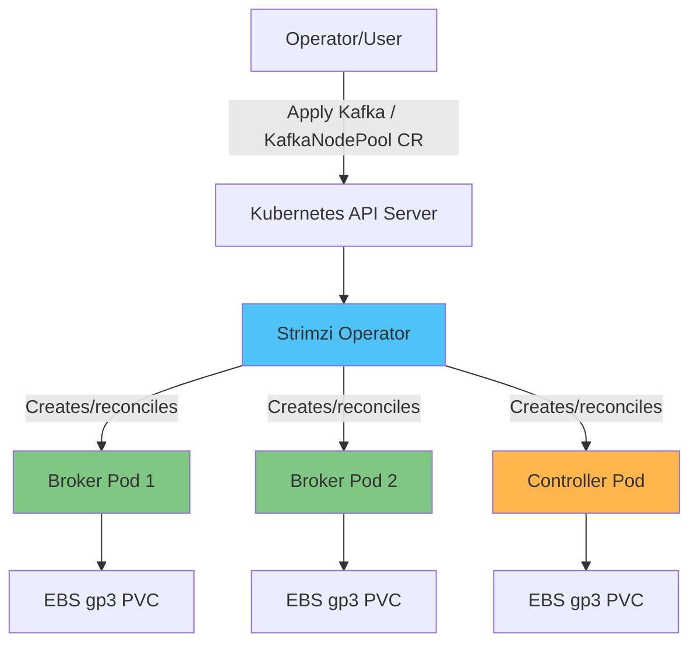

# EKS 上 Kafka 深入讲解

## 概述

Apache Kafka 是事件驱动架构和实时流式处理 pipeline 的骨干，广泛用于微服务之间的异步通信、日志/指标聚合、CDC（Change Data Capture，变更数据捕获）pipeline，以及许多其他使用场景。在 EKS 上，标准做法是通过 **Strimzi Kubernetes Operator** 运行 Kafka，而不是直接管理原始 StatefulSets。Strimzi 让你可以通过 Kubernetes-native CRDs（Custom Resource Definitions，自定义资源定义）以声明式方式管理 Kafka cluster 的完整运维生命周期——创建、伸缩、滚动升级、证书管理以及 rack-aware placement。

> **支持的版本**: Kafka 3.7-3.9 (KRaft 模式), Strimzi Operator 0.45+
> **最后更新**: July 9, 2026

## 核心架构概念

Kafka cluster 由一组称为 **broker** 的进程组成。每个 broker 存储一个或多个 **topic**，每个 topic 又被拆分为多个 **partition**，以实现并行性和可伸缩性。每个 partition 会在不同 broker 之间维护 replica 以保证持久性。Producer 将消息写入 partition，而 **consumer group** 会在其成员之间分摊 partition，以并行消费消息，并通过 offset 跟踪进度。

过去，Kafka 依赖单独的 ZooKeeper ensemble 来管理 cluster metadata——topic、partition assignment、ACL 等。从 Kafka 3.x 开始，**KRaft (Kafka Raft)** 模式让 Kafka 通过基于 Raft 的 controller quorum 管理自己的 metadata，从而消除对 ZooKeeper 的需求，减少需要运维的组件数量，并显著加快 controller failover。截至 Kafka 4.0，ZooKeeper 支持已被完全移除，KRaft 成为唯一受支持的 metadata 机制——因此，在 EKS 上进行任何新的 Kafka 部署时，都应从一开始就围绕 KRaft 进行设计。

Strimzi 将所有这些组件封装为 Kubernetes resource。你通过 `Kafka` 和 `KafkaNodePool` 等 CRD 声明期望状态，Strimzi Operator 则通过创建和管理 broker/controller Pods、PVCs、Services 和 Secrets 来协调该状态。

## 深入讲解目录

**[1. Kafka 基础知识](01-kafka-fundamentals.md)**
- Broker 以及 topic/partition 结构
- 复制和持久性保证
- Consumer group 和 offset 管理
- KRaft controller quorum 架构

**[2. Strimzi Operator](02-strimzi-operator.md)**
- 安装和配置 Strimzi
- 深入了解 `Kafka` 和 `KafkaNodePool` CRD
- 在 EKS 上部署 Kafka cluster

**[3. Kafka 运维](03-kafka-operations.md)**
- 使用 EBS/gp3 的存储设计
- Broker 伸缩策略
- 使用 Cruise Control 进行 partition rebalance
- 零停机滚动升级

**[4. Schema Registry](04-schema-registry.md)**
- 设计 Avro/Protobuf schema
- Karapace 与 Apicurio Registry 对比
- 兼容性策略：BACKWARD/FORWARD/FULL

**[5. Kafka Connect 和 MirrorMaker](05-kafka-connect-mirrormaker.md)**
- 部署 Kafka Connect 并配置 connector
- 运维 source 和 sink connector
- 使用 MirrorMaker2 进行灾难恢复和跨区域复制

**[6. MSK 集成](06-msk-integration.md)**
- Amazon MSK 与自管理 Strimzi 对比
- 使用 MSK Connect
- 与 Kinesis Data Streams 集成并进行对比

**[7. 监控](07-monitoring.md)**
- 使用 Prometheus/Grafana 收集 broker 指标
- 监控 consumer lag
- 使用 KEDA 自动伸缩 consumer

**[8. 最佳实践](08-best-practices.md)**
- Partition 数量和 key 设计策略
- Producer/consumer 性能调优
- 使用 mTLS/SASL 实现安全性
- 存储和 instance 成本优化

## 参考资料

- [Strimzi 文档](https://strimzi.io/docs/operators/latest/overview)
- [Apache Kafka 文档](https://kafka.apache.org/documentation/)
- [KIP-500：用自管理 Metadata Quorum 替换 ZooKeeper](https://cwiki.apache.org/confluence/display/KAFKA/KIP-500)
- [AWS Data on EKS 项目](https://awslabs.github.io/data-on-eks/)

## 测验

要测试你在本节中学到的内容，请尝试 [Kafka 基础知识测验](../../quizzes/data-on-eks/kafka/01-kafka-fundamentals-quiz.md)。
