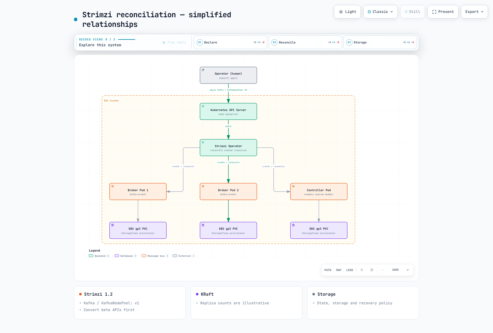

# 深入了解 EKS 上的 Kafka

## 概述

本指南将 Strimzi Operator 用作 EKS 上自主管理 Kafka 的方案。Operator 协调 Pod、存储、监听器、证书和升级；它不会免除对数据、可用性和安全策略的责任。第 6 部分比较 Amazon MSK 等托管替代方案。

> **最后更新**：2026 年 9 月 12 日。Strimzi 1.2.0 / Kafka 4.3.1。
> **升级要求**：Strimzi 1.0 及更高版本仅支持 CRD API `v1`。升级 Operator 前，请按官方迁移流程转换现有 `v1beta2` / `v1beta1` / `v1alpha1` 资源并准备 CRD。仅更改版本号不是升级计划。

Strimzi 1.2.0 支持 Kafka 4.2.0、4.2.1、4.3.0 和 4.3.1，默认使用 4.3.1。本指南固定使用兼容组合；安装前还应检查发行版、Kubernetes 版本和升级路径。

## 核心架构概念

代理存储主题分区副本。KafkaConsumer 组分配分区，一个成员可能拥有多个分区。独立的控制器法定人数管理元数据 Raft 日志。

KRaft 在 2.8 中作为早期访问功能引入，在 3.3 中达到生产就绪；Kafka 4.0 移除了 ZooKeeper 模式。控制器和代理可以采用专用角色。移除 ZooKeeper 并不意味着不再需要控制器、存储或恢复运维。

用户声明 Kafka 和 KafkaNodePool 等自定义资源；Strimzi 协调 Pod、PVC、Service 和 Secret。下图是简化的关系示意图，并非高可用副本数量的部署规范。

[查看交互式图表](https://www.atomai.click/kubernetes-docs/archmaps/en-data-on-eks-kafka-readme-0.html)

## 深入学习目录

**[1. Kafka 基础](01-kafka-fundamentals.md)**
- 代理和主题/分区结构
- 复制与持久性保证
- 消费者组与偏移量管理
- KRaft 控制器法定人数架构

**[2. Strimzi Operator](02-strimzi-operator.md)**
- 安装和配置 Strimzi
- 详解 `Kafka` 和 `KafkaNodePool` CRD
- 在 EKS 上部署 Kafka 集群

**[3. Kafka 运维](03-kafka-operations.md)**
- 使用 EBS/gp3 的存储设计
- 代理扩缩容策略
- 使用 Cruise Control 进行分区再平衡
- 带兼容性和可用性检查的滚动升级

**[4. Schema Registry](04-schema-registry.md)**
- 设计 Avro/Protobuf 模式
- Karapace 与 Apicurio Registry 的比较
- 兼容性策略：BACKWARD/FORWARD/FULL

**[5. Kafka Connect 和 MirrorMaker](05-kafka-connect-mirrormaker.md)**
- 部署 Kafka Connect 和配置连接器
- 运维源连接器和接收器连接器
- 使用 MirrorMaker2 进行灾难恢复和跨区域复制

**[6. MSK 集成](06-msk-integration.md)**
- Amazon MSK 与自主管理 Strimzi 的比较
- 使用 MSK Connect
- 与 Kinesis Data Streams 集成及比较

**[7. 监控](07-monitoring.md)**
- 使用 Prometheus/Grafana 收集代理指标
- 监控消费者积压
- 使用 KEDA 自动扩缩消费者

**[8. 最佳实践](08-best-practices.md)**
- 分区数量和键设计策略
- 生产者/消费者性能调优
- 使用 mTLS/SASL 保障安全
- 存储和实例成本优化

**[9. Kafka 实测基准测试](09-kafka-benchmark.md)**
- 基于 gp3 卷的 3 代理 KRaft 集群在 RF3 与 RF1 下的实测写入上限
- acks=0/1/all 下吞吐量与 p99 延迟的权衡
- 不同压缩编解码器和记录大小下的吞吐量与 CPU 成本
- 冷消费者和混合工作负载如何影响生产者吞吐量

## 参考资料

- [Strimzi 1.2.0 发布](https://github.com/strimzi/strimzi-kafka-operator/releases/tag/1.2.0)

- [Strimzi 文档](https://strimzi.io/docs/operators/1.2.0/overview.html)
- [Apache Kafka 文档](https://kafka.apache.org/43/design/design/)
- [KRaft 运维指南](https://kafka.apache.org/43/operations/kraft/)
- [AWS Data on EKS 项目](https://awslabs.github.io/data-on-eks/)

## 测验

要测试本节所学内容，请尝试 [Kafka 基础测验](../../quizzes/data-on-eks/kafka/01-kafka-fundamentals-quiz.md)。要检查自己能否将基准测试数据转化为设计决策，还可尝试 [Kafka 实测基准测试测验](../../quizzes/data-on-eks/kafka/09-kafka-benchmark-quiz.md)。
