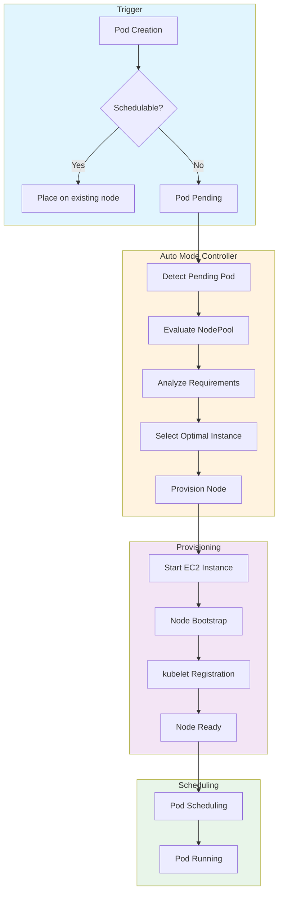
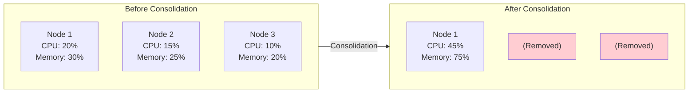

# 理解扩展行为

> **支持的版本**: EKS 1.29+, EKS Auto Mode GA
> **最后更新**: February 19, 2026

本指南说明 EKS Auto Mode 如何处理节点预置、整合、漂移检测以及基于过期时间的更新。

---

## 从 Pod Pending 到节点预置

理解 EKS Auto Mode 的扩展流程有助于优化。



### 扩展时间线

典型的节点预置时间线：

| 阶段 | 持续时间 | 描述 |
|-------|----------|-------------|
| Pending Pod 检测 | 1-5 秒 | Controller 检测不可调度的 pods |
| Instance 选择 | 1-3 秒 | 确定最优 instance type |
| EC2 Instance 启动 | 10-30 秒 | Instance 启动和引导 |
| AMI 引导 | 20-40 秒 | 操作系统初始化 |
| kubelet 注册 | 5-10 秒 | Node 加入 cluster |
| Pod 调度 | 1-5 秒 | Pod 被放置到新 node 上 |
| **总计** | **40-90 秒** | 端到端预置时间 |

---

## 整合行为

整合通过清理低效节点来优化成本。

### WhenEmpty 策略

仅移除空节点。

```yaml
apiVersion: karpenter.sh/v1
kind: NodePool
metadata:
  name: when-empty-example
spec:
  template:
    spec:
      requirements:
        - key: karpenter.k8s.aws/instance-category
          operator: In
          values: ["m", "c"]
      nodeClassRef:
        group: eks.amazonaws.com
        kind: NodeClass
        name: default
  disruption:
    consolidationPolicy: WhenEmpty
    consolidateAfter: 30s  # Remove after 30 seconds empty
```

### WhenEmptyOrUnderutilized 策略

不仅整合空节点，也会整合利用率不足的节点。

```yaml
apiVersion: karpenter.sh/v1
kind: NodePool
metadata:
  name: when-underutilized-example
spec:
  template:
    spec:
      requirements:
        - key: karpenter.k8s.aws/instance-category
          operator: In
          values: ["m", "c"]
      nodeClassRef:
        group: eks.amazonaws.com
        kind: NodeClass
        name: default
  disruption:
    consolidationPolicy: WhenEmptyOrUnderutilized
    consolidateAfter: 1m
```

### 整合可视化



### 整合决策因素

Auto Mode 在整合时会考虑以下因素：

| 因素 | 描述 |
|--------|-------------|
| Node 利用率 | CPU 和内存使用率低于阈值 |
| Pod 数量 | Node 上运行的 pods 较少 |
| 成本效率 | Workloads 是否能放入更少、更便宜的 nodes |
| PDB 合规性 | 遵守 PodDisruptionBudget 约束 |
| Budget 窗口 | 遵守基于时间的 disruption budgets |

---

## 漂移检测和替换

当 NodePool 设置发生变化时，现有节点会被替换为使用新设置的节点。

### 检测漂移

```bash
# Check node Drift
kubectl get nodes -o custom-columns=\
NAME:.metadata.name,\
NODEPOOL:.metadata.labels.karpenter\\.sh/nodepool,\
DRIFT:.metadata.annotations.karpenter\\.sh/drift-hash

# Check nodes with detected Drift
kubectl get nodeclaims -o wide
```

### 触发漂移的内容

| 变更类型 | 触发漂移 |
|-------------|----------------|
| NodePool requirements 变更 | 是 |
| NodeClass AMI family 变更 | 是 |
| NodeClass block device 变更 | 是 |
| NodeClass subnet 变更 | 是 |
| NodePool weight 变更 | 否 |
| NodePool limits 变更 | 否 |

### 漂移替换流程

1. Controller 检测到配置漂移
2. 使用更新后的设置预置新 node
3. Pods 逐步迁移到新 node
4. 旧 node 被 cordon 并 drain
5. 旧 node 被终止

---

## 基于过期时间的 Node 更新

定期替换节点，以应用安全补丁或 AMI 更新。

```yaml
apiVersion: karpenter.sh/v1
kind: NodePool
metadata:
  name: with-expiration
spec:
  template:
    spec:
      requirements:
        - key: karpenter.k8s.aws/instance-category
          operator: In
          values: ["m", "c"]
      nodeClassRef:
        group: eks.amazonaws.com
        kind: NodeClass
        name: default
      # Set maximum node lifetime
      expireAfter: 168h  # Auto-replace after 7 days
  disruption:
    consolidationPolicy: WhenEmptyOrUnderutilized
    consolidateAfter: 1m
```

### 推荐的过期时间值

| 使用场景 | expireAfter | 理由 |
|----------|-------------|-----------|
| 安全关键型 | 24h - 72h | 频繁打补丁 |
| 标准生产环境 | 168h (7 days) | 平衡新鲜度和稳定性 |
| 成本敏感型 | 336h (14 days) | 最小化替换开销 |
| 开发环境 | 720h (30 days) | 最大化 node 复用 |

---

## 优化扩展延迟

### 测量预置时间

```bash
# Measure node provisioning time
kubectl get events --sort-by='.lastTimestamp' | grep -E "Provisioned|Registered"

# Typical provisioning timeline
# - EC2 instance start: 10-30 seconds
# - AMI boot: 20-40 seconds
# - kubelet registration: 5-10 seconds
# - Pod scheduling: 1-5 seconds
# Total expected time: 40-90 seconds
```

### 快速引导配置

```yaml
# NodeClass settings for fast provisioning
apiVersion: eks.amazonaws.com/v1
kind: NodeClass
metadata:
  name: fast-boot
spec:
  amiFamily: Bottlerocket  # Faster boot time than AL2023

  # EBS optimization
  blockDeviceMappings:
    - deviceName: /dev/xvda
      ebs:
        volumeSize: 50Gi  # Only as much as needed
        volumeType: gp3
        iops: 3000
        throughput: 125
```

### 延迟优化提示

| 优化 | 影响 | 权衡 |
|--------------|--------|-----------|
| 使用 Bottlerocket AMI | 引导快 10-20 秒 | 定制能力较少 |
| 更小的 EBS volumes | 挂载快 5-10 秒 | 本地存储较少 |
| 更高的 IOPS/throughput | 引导快 5-10 秒 | 成本更高 |
| 多样化的 instance types | 更快获取容量 | 可能获得不那么理想的 instance |
| 使用 placeholder pods 预热 | 近乎即时扩展 | 空闲资源成本 |

---

## 扩展行为监控

### 需要关注的关键指标

```bash
# Check pending pods over time
kubectl get pods -A --field-selector=status.phase=Pending -w

# Monitor node provisioning events
kubectl get events --sort-by='.lastTimestamp' -w | grep -i karpenter

# Check NodeClaim status
kubectl get nodeclaims -w
```

### CloudWatch Metrics

| 指标 | 描述 | 告警阈值 |
|--------|-------------|-----------------|
| `karpenter_pods_pending` | 等待 nodes 的 Pods | > 10 持续 > 5 分钟 |
| `karpenter_nodeclaims_created` | 请求的新 nodes | 异常峰值 |
| `karpenter_nodeclaims_startup_duration_seconds` | 预置时间 | p99 > 120 秒 |
| `karpenter_nodes_total` | 托管 nodes 总数 | 接近 limits |

---

< [上一页: NodePool 配置](./02-nodepool-configuration.md) | [目录](./README.md) | [下一页: Spot 策略](./04-spot-strategies.md) >
