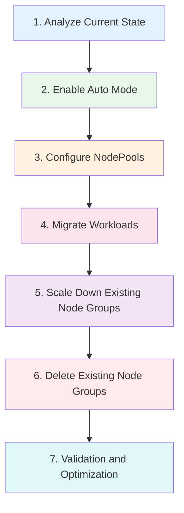

# 从 Managed Node Groups 迁移到 Auto Mode

> **支持的版本**: EKS 1.29+, EKS Auto Mode GA
> **最后更新**: July 3, 2026

本指南介绍如何从现有 EKS Managed Node Groups 迁移到 Auto Mode，包括分步说明、共存策略和重要注意事项。

---

## 迁移概述



---

## 步骤 1：分析当前状态

迁移之前，请全面分析当前的 cluster 配置。

```bash
# Check current node groups
eksctl get nodegroup --cluster my-cluster

# Analyze node resource usage
kubectl top nodes

# Check workload distribution
kubectl get pods -A -o wide | awk '{print $8}' | sort | uniq -c

# Nodes by current instance type
kubectl get nodes -o custom-columns=\
NAME:.metadata.name,\
TYPE:.metadata.labels.node\\.kubernetes\\.io/instance-type,\
ZONE:.metadata.labels.topology\\.kubernetes\\.io/zone

# Check for node selectors in deployments
kubectl get deployments -A -o jsonpath='{range .items[*]}{.metadata.namespace}/{.metadata.name}: {.spec.template.spec.nodeSelector}{"\n"}{end}'

# Check for node affinities
kubectl get deployments -A -o jsonpath='{range .items[*]}{.metadata.namespace}/{.metadata.name}: {.spec.template.spec.affinity.nodeAffinity}{"\n"}{end}'
```

### 迁移前检查清单

| 项目 | 检查 | 备注 |
|------|-------|-------|
| EKS 版本 | >= 1.29 | Auto Mode 必需 |
| Node group instance types | 记录全部 | 映射到 NodePool requirements |
| 自定义 AMIs | 记录 | 可能需要 NodeClass config |
| User data 脚本 | 审查 | 确保兼容性 |
| IAM roles | 记录 | Auto Mode 会创建新的 roles |
| Security groups | 记录 | 在 NodeClass 中配置 |
| Tags | 记录 | 添加到 NodeClass |
| workloads 中的 node selectors | 识别 | 可能需要更新 |

---

## 步骤 2：启用 Auto Mode

在现有 cluster 上启用 Auto Mode。

```bash
# 1. Enable Auto Mode
aws eks update-cluster-config \
    --name my-cluster \
    --compute-config enabled=true,nodePools=general-purpose,nodePools=system

# 2. Check activation status
aws eks describe-cluster --name my-cluster \
    --query 'cluster.computeConfig'

# 3. Wait for update to complete
aws eks wait cluster-active --name my-cluster

# 4. Verify NodePools are created
kubectl get nodepools
```

---

## 步骤 3：配置自定义 NodePools

创建与当前 node group 配置相匹配的 NodePools。

```yaml
# custom-nodepools.yaml
apiVersion: karpenter.sh/v1
kind: NodePool
metadata:
  name: migrated-workloads
spec:
  template:
    metadata:
      labels:
        migration: auto-mode
    spec:
      requirements:
        # Instance types similar to existing node groups
        - key: karpenter.k8s.aws/instance-category
          operator: In
          values: ["m", "c", "r"]
        - key: karpenter.k8s.aws/instance-size
          operator: In
          values: ["large", "xlarge", "2xlarge"]
        - key: karpenter.sh/capacity-type
          operator: In
          values: ["on-demand"]
      nodeClassRef:
        group: eks.amazonaws.com
        kind: NodeClass
        name: default
```

### 将 Node Groups 映射到 NodePools

| Node Group 配置 | NodePool 对应项 |
|-------------------|---------------------|
| Instance types | `karpenter.k8s.aws/instance-category`, `instance-size` |
| Capacity type | `karpenter.sh/capacity-type` |
| Labels | `template.metadata.labels` |
| Taints | `template.spec.taints` |
| Scaling limits | `spec.limits` |
| Subnet tags | NodeClass `subnetSelectorTerms` |
| Security groups | NodeClass `securityGroupSelectorTerms` |
| AMI type | NodeClass `amiFamily` |

---

## 步骤 4：迁移 Workloads

逐步将 workloads 从现有 node groups 迁移到 Auto Mode nodes。

```bash
# Apply cordon to existing nodes (prevent new Pod scheduling)
kubectl cordon -l eks.amazonaws.com/nodegroup=old-nodegroup

# Gradually drain Pods
for node in $(kubectl get nodes -l eks.amazonaws.com/nodegroup=old-nodegroup -o name); do
    kubectl drain $node --ignore-daemonsets --delete-emptydir-data
    sleep 60  # Wait time between each node
done
```

### 安全迁移脚本

```bash
#!/bin/bash
# migrate-workloads.sh

NODE_GROUP="old-nodegroup"
DRAIN_INTERVAL=60

# Get nodes in the old node group
NODES=$(kubectl get nodes -l eks.amazonaws.com/nodegroup=$NODE_GROUP -o name)

echo "Starting migration of node group: $NODE_GROUP"
echo "Found $(echo "$NODES" | wc -l) nodes to migrate"

# Cordon all nodes first
for node in $NODES; do
    echo "Cordoning $node..."
    kubectl cordon $node
done

echo "All nodes cordoned. Starting drain process..."

# Drain nodes one by one
for node in $NODES; do
    echo "Draining $node..."
    kubectl drain $node \
        --ignore-daemonsets \
        --delete-emptydir-data \
        --timeout=300s

    if [ $? -ne 0 ]; then
        echo "WARNING: Failed to drain $node, continuing..."
    fi

    echo "Waiting ${DRAIN_INTERVAL}s before next node..."
    sleep $DRAIN_INTERVAL
done

echo "Migration complete. Verify with: kubectl get pods -A -o wide"
```

---

## 步骤 5：缩减现有 Node Groups

workloads 迁移完成后，缩减旧 node groups。

```bash
# Scale down node group
eksctl scale nodegroup \
    --cluster my-cluster \
    --name old-nodegroup \
    --nodes 0 \
    --nodes-min 0

# Verify nodes are terminating
kubectl get nodes -l eks.amazonaws.com/nodegroup=old-nodegroup -w
```

---

## 步骤 6：删除现有 Node Groups

确认所有 workloads 都在 Auto Mode nodes 上运行后，删除旧 node groups。

```bash
# Delete node group
eksctl delete nodegroup \
    --cluster my-cluster \
    --name old-nodegroup

# Verify deletion
eksctl get nodegroup --cluster my-cluster
```

---

## 步骤 7：验证和优化

验证迁移并优化配置。

```bash
# Verify all pods are running
kubectl get pods -A --field-selector=status.phase!=Running

# Check node distribution
kubectl get nodes -o wide -L karpenter.sh/nodepool,karpenter.sh/capacity-type

# Verify resource utilization
kubectl top nodes
kubectl top pods -A

# Check for any pending pods
kubectl get pods -A --field-selector=status.phase=Pending
```

---

## 共存期间操作

迁移期间，现有 node groups 和 Auto Mode 可以共存。

```yaml
# coexistence-config.yaml
# Existing node group workloads
apiVersion: apps/v1
kind: Deployment
metadata:
  name: legacy-app
spec:
  replicas: 3
  template:
    spec:
      # Pin to existing node group
      nodeSelector:
        eks.amazonaws.com/nodegroup: old-nodegroup
      containers:
        - name: app
          image: legacy-app:latest
---
# Auto Mode workloads
apiVersion: apps/v1
kind: Deployment
metadata:
  name: new-app
spec:
  replicas: 3
  template:
    spec:
      # Prefer Auto Mode nodes
      affinity:
        nodeAffinity:
          preferredDuringSchedulingIgnoredDuringExecution:
            - weight: 100
              preference:
                matchExpressions:
                  - key: karpenter.sh/nodepool
                    operator: Exists
      containers:
        - name: app
          image: new-app:latest
```

### 共存最佳实践

| 实践 | 描述 |
|----------|-------------|
| 使用 node selectors | 将 workloads 固定到特定基础设施 |
| 渐进式迁移 | 分阶段迁移 workloads |
| 同时监控两者 | 跟踪两种 node 类型的 metrics |
| 全面测试 | 在完全迁移前验证行为 |
| 回滚计划 | 初始阶段只缩减 node groups，而不是删除 |

---

## 从 Self-Managed Karpenter 迁移（官方基于 kubectl 的路径）

如果你运行的是 **self-managed Karpenter** 而不是 managed node groups，AWS 提供了官方支持的基于 kubectl 的迁移路径，可作为上述 node group 切换流程的替代方案。

### 前提条件

- Self-managed Karpenter **v1.1 或更高版本** 必须已经安装在 cluster 上
- 记录现有的 Karpenter NodePool/EC2NodeClass 配置

### 迁移步骤

1. **启用 Auto Mode**：启用 Auto Mode，同时保留现有 Karpenter controller 和 NodePools。

2. **创建带 taint 的 Auto Mode NodePool**：添加 taint，避免 workloads 被意外调度到 Auto Mode nodes 上。

   ```yaml
   apiVersion: karpenter.sh/v1
   kind: NodePool
   metadata:
     name: auto-mode-migration
   spec:
     template:
       spec:
         taints:
           - key: eks.amazonaws.com/auto-mode
             value: "true"
             effect: NoSchedule
         nodeClassRef:
           group: eks.amazonaws.com
           kind: NodeClass
           name: default
   ```

3. **向 workloads 添加匹配的 tolerations/nodeSelector**：为上述 taint 添加 toleration，并向要迁移的 workloads 添加指向 Auto Mode NodePool 的 `nodeSelector`。

   ```yaml
   spec:
     template:
       spec:
         tolerations:
           - key: eks.amazonaws.com/auto-mode
             value: "true"
             effect: NoSchedule
         nodeSelector:
           karpenter.sh/nodepool: auto-mode-migration
   ```

4. **增量迁移**：一次向一个 workload group 添加 toleration/nodeSelector，让 Karpenter-managed nodes 与 Auto Mode nodes 在同一 cluster 中并行运行，同时将 workloads 迁移到 Auto Mode nodes。

5. **移除 self-managed Karpenter**：确认所有 workloads 都运行在 Auto Mode nodes 上后，移除 self-managed Karpenter controller 及其关联资源（NodePools、EC2NodeClasses、IAM roles、Helm release 等）。

此路径适用于已经运行 self-managed Karpenter 的 clusters。如果你是直接从 managed node groups 迁移，请改为遵循上面的步骤 1-7。

---

## 迁移注意事项

| 项目 | 注意事项 | 缓解措施 |
|------|---------|------------|
| **AMI 兼容性** | Auto Mode 仅支持 AL2023 或 Bottlerocket | 在新 AMI 上测试 workloads |
| **User Data** | 验证现有 bootstrap script 兼容性 | 审查并测试 userData |
| **IAM Role** | Auto Mode IAM role 会自动创建 | 验证 workloads 的权限 |
| **Security Groups** | 在 NodeClass 中重新配置 | 记录并复制规则 |
| **Tags** | 在 NodeClass 中反映现有 tag policies | 审计并添加 tags |
| **Monitoring** | 需要设置新的 metrics 收集 | 更新 dashboards 和 alerts |
| **Node Selectors** | 带有 `eks.amazonaws.com/nodegroup` 的 workloads 将无法调度 | 更新 selectors |
| **Persistent Volumes** | EBS volumes 是 AZ-specific | 制定 volume 迁移计划 |

### 常见迁移问题

| 问题 | 症状 | 解决方案 |
|-------|---------|----------|
| Pods 无法调度 | Pending 状态 | 更新 node selectors、tolerations |
| Application 错误 | Runtime 失败 | 检查 AMI 兼容性 |
| 性能下降 | 延迟增加 | 验证 instance types 是否匹配 |
| 成本增加 | EC2 账单更高 | 审查 NodePool limits、Spot config |

---

## 回滚流程

如果发生迁移问题，可以回滚。

```bash
# 1. Scale up old node groups
eksctl scale nodegroup \
    --cluster my-cluster \
    --name old-nodegroup \
    --nodes 3 \
    --nodes-min 1 \
    --nodes-max 10

# 2. Uncordon old nodes (if cordoned)
kubectl uncordon -l eks.amazonaws.com/nodegroup=old-nodegroup

# 3. Cordon Auto Mode nodes
kubectl cordon -l karpenter.sh/nodepool

# 4. Drain Auto Mode nodes
for node in $(kubectl get nodes -l karpenter.sh/nodepool -o name); do
    kubectl drain $node --ignore-daemonsets --delete-emptydir-data
done

# 5. Verify workloads are back on old nodes
kubectl get pods -A -o wide

# 6. Optionally disable Auto Mode
aws eks update-cluster-config \
    --name my-cluster \
    --compute-config enabled=false
```

---

## 迁移后优化

成功迁移后：

1. **审查 NodePool 配置**：根据实际 workload 需求优化 requirements
2. **启用 Spot instances**：为适合的 workloads 降低成本
3. **配置 consolidation**：通过 node consolidation 启用成本优化
4. **设置 monitoring**：为 Auto Mode metrics 创建 dashboards
5. **记录变更**：更新 runbooks 和 documentation
6. **培训团队**：确保 operations team 理解新的管理模型

---

< [上一页：Workload 优化](./08-workload-optimization.md) | [目录](./README.md) | [返回 EKS 主题](../README.md) >
