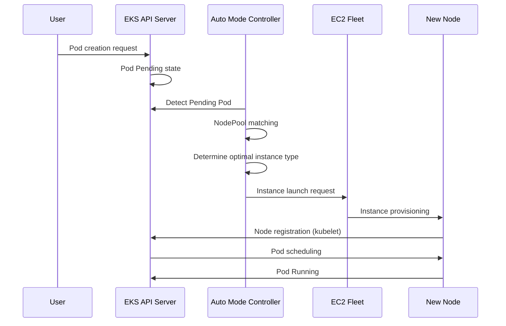

# EKS Auto Mode 运维指南

> **支持的版本**: EKS 1.29+, EKS Auto Mode GA
> **最后更新**: July 27, 2026

Amazon EKS Auto Mode 是一项可全面自动化 Kubernetes 节点管理的功能，可根据工作负载要求自动预置和优化节点。本指南涵盖 EKS Auto Mode 的概念、配置方法以及生产环境的最佳实践。

### 2026 年 7 月更新：EFA 和 Placement Group 支持

2026 年 7 月 22 日，AWS 宣布 EKS Auto Mode（以及开源 Karpenter）的节点池现已支持 Elastic Fabric Adapter (EFA) 网络设备配置和 EC2 placement groups。支持 EFA 的实例上的网络接口可配置为仅 EFA 或标准 ENI；仅 EFA 接口在提供完整互连带宽的同时不会消耗 VPC IP 地址；并且可以直接从节点池配置中使用集群、分散或分区放置策略启动实例。这面向需要最大吞吐量或故障隔离的分布式训练/推理工作负载。有关详细信息，请参阅[公告](https://aws.amazon.com/about-aws/whats-new/2026/07/amazon-eks-efa-placement-groups/)。

### 2026 年 7 月更新：ARC Zonal Shift 支持

截至 2026 年 7 月 10 日，EKS Auto Mode 集群支持 Amazon Application Recovery Controller (ARC) zonal shift 和 autoshift。由于 Auto Mode 代表您管理计算资源，您无需设置标志或管理 Karpenter 版本即可获得 zonal shift 支持；只需在集群上启用 ARC zonal shift。当 zonal shift 被激活时，Auto Mode 将停止在受影响的 AZ 中预置新容量，并暂停该可用区中节点的整合和漂移等自愿中断。此功能无需额外费用；有关详细信息，请参阅[公告](https://aws.amazon.com/about-aws/whats-new/2026/07/eks-auto-mode-arc-zonal-shift)和 [ARC zonal shift 文档](https://docs.aws.amazon.com/eks/latest/userguide/zone-shift.html)。

## 目录

1. [Auto Mode 入门](./01-getting-started.md) - 集群创建和启用 Auto Mode
2. [NodePool 配置和优化](./02-nodepool-configuration.md) - 默认和自定义 NodePool
3. [了解扩缩容行为](./03-scaling-behavior.md) - 预置、整合、漂移检测
4. [Spot Instance 利用策略](./04-spot-strategies.md) - 混合容量和中断处理
5. [运维和管理](./05-operations.md) - 中断预算、滚动替换、监控
6. [成本管理和优化](./06-cost-management.md) - 成本分析、Spot 节省、资源规格优化
7. [节点生命周期管理](./07-node-lifecycle.md) - 到期、AMI 管理、新鲜度策略
8. [特定工作负载优化](./08-workload-optimization.md) - Web、批处理、GPU、AI/ML 工作负载
9. [从 Managed Node Groups 迁移](./09-migration-guide.md) - 迁移步骤和共存

---

## EKS Auto Mode 简介

### 什么是 Auto Mode？

EKS Auto Mode 是由 AWS 管理的全自动节点管理解决方案。它在内部基于 Karpenter，AWS 负责管理所有内容，用户无需安装或配置单独的节点管理组件。

```
+-----------------------------------------------------------------------------+
|                           EKS Auto Mode Architecture                         |
+-----------------------------------------------------------------------------+
|                                                                              |
|  +---------------------------------------------------------------------+    |
|  |                    EKS Control Plane (AWS Managed)                   |    |
|  |  +------------+  +------------+  +------------+  +------------+    |    |
|  |  | API Server |  |   etcd     |  | Controller |  |  Karpenter |    |    |
|  |  |            |  |            |  |  Manager   |  | Controller |    |    |
|  |  +------------+  +------------+  +------------+  +------------+    |    |
|  +---------------------------------------------------------------------+    |
|                                    |                                         |
|                                    v                                         |
|  +---------------------------------------------------------------------+    |
|  |                        NodePool Resources                            |
|  |  +------------------+  +------------------+  +------------------+  |
|  |  |  general-purpose |  |      system      |  |   custom-pool    |  |
|  |  | (Default Provided)|  | (Default Provided)|  |  (User Defined)  |  |
|  |  +------------------+  +------------------+  +------------------+  |
|  +---------------------------------------------------------------------+    |
|                                    |                                         |
|                                    v                                         |
|  +---------------------------------------------------------------------+    |
|  |                     EC2 Instances (Auto Managed)                     |
|  |  +--------------+  +--------------+  +--------------+              |
|  |  |   m6i.2xl    |  |   c7g.xl     |  |   r6i.4xl    |   ...        |
|  |  |  (On-Demand) |  |   (Spot)     |  |  (On-Demand) |              |
|  |  +--------------+  +--------------+  +--------------+              |
|  +---------------------------------------------------------------------+    |
|                                                                              |
+-----------------------------------------------------------------------------+
```

### 与现有管理方法的比较

| 功能 | Managed Node Groups | Fargate | Auto Mode |
|---------|---------------------|---------|-----------|
| 节点管理 | 用户（基于 ASG） | 完全由 AWS 管理 | 完全由 AWS 管理 |
| 扩缩容方法 | Cluster Autoscaler | 按 Pod | 基于 Karpenter |
| 扩缩容速度 | 分钟级 | 即时（Pod 调度） | 数十秒 |
| 实例类型选择 | 预先定义 | 自动 | 自动优化 |
| Spot 支持 | 手动配置 | 不支持 | 自动管理 |
| GPU 工作负载 | 支持 | 有限支持 | 完全支持 |
| DaemonSet 支持 | 支持 | 不支持 | 支持 |
| 成本优化 | 手动 | 中等 | 自动 |
| 复杂性 | 高 | 低 | 低 |
| 自定义程度 | 高 | 低 | 中等 |

### 内部架构和运行原理

EKS Auto Mode 基于 Karpenter 运行，但在由 AWS 管理的控制平面内运行。



### 支持的区域和限制

#### 支持的区域（截至 2025 年 2 月）

EKS Auto Mode 在以下区域可用：

- **美洲**: us-east-1, us-east-2, us-west-1, us-west-2
- **欧洲**: eu-west-1, eu-west-2, eu-central-1, eu-north-1
- **亚太地区**: ap-northeast-1, ap-northeast-2, ap-southeast-1, ap-southeast-2, ap-south-1

#### 限制

| 项目 | 限制 |
|------|-------|
| 每个集群的最大 NodePool 数量 | 100 |
| 每个 NodePool 的最大节点数 | 1000 |
| 每个集群的最大节点数 | 5000 |
| 最低 EKS 版本 | 1.29 |
| 支持的 AMI 系列 | AL2023, Bottlerocket |
| Windows 节点 | 不支持 |

---

## 后续步骤

成功配置 EKS Auto Mode 后，我们建议学习以下主题：

1. **[EKS 成本优化](../eks/07-eks-cost-optimization.md)**: Spot、Savings Plans、资源优化
2. **[EKS 监控和日志记录](../eks/06-eks-monitoring-logging.md)**: CloudWatch、Prometheus、Grafana
3. **[EKS 安全](../eks/05-eks-security.md)**: IAM、网络策略、Pod 安全
4. **[Karpenter 深入解析](../autoscaling/02-karpenter.md)**: 直接安装 Karpenter 和高级功能

## 相关测验

要测试您的学习成果，请尝试 [EKS Auto Mode 测验](../quizzes/eks-auto-mode/01-getting-started-quiz.md)。

---

## 参考资料

- [AWS EKS Auto Mode 官方文档](https://docs.aws.amazon.com/eks/latest/userguide/automode.html)
- [Karpenter 官方文档](https://karpenter.sh/)
- [EKS 最佳实践指南](https://aws.github.io/aws-eks-best-practices/)
- [AWS 成本优化指南](https://aws.amazon.com/pricing/cost-optimization/)
- [用于增强安全性、网络控制和性能的新 EKS Auto Mode 功能（AWS Containers Blog，2025-10-16）](https://aws.amazon.com/blogs/containers/new-amazon-eks-auto-mode-features-for-enhanced-security-network-control-and-performance/)
- [从自管理 Karpenter 迁移到 EKS Auto Mode](https://docs.aws.amazon.com/eks/latest/userguide/auto-migrate-karpenter.html)

---

< [返回 EKS 主题](../README.md) | [下一步：入门](./01-getting-started.md) >
