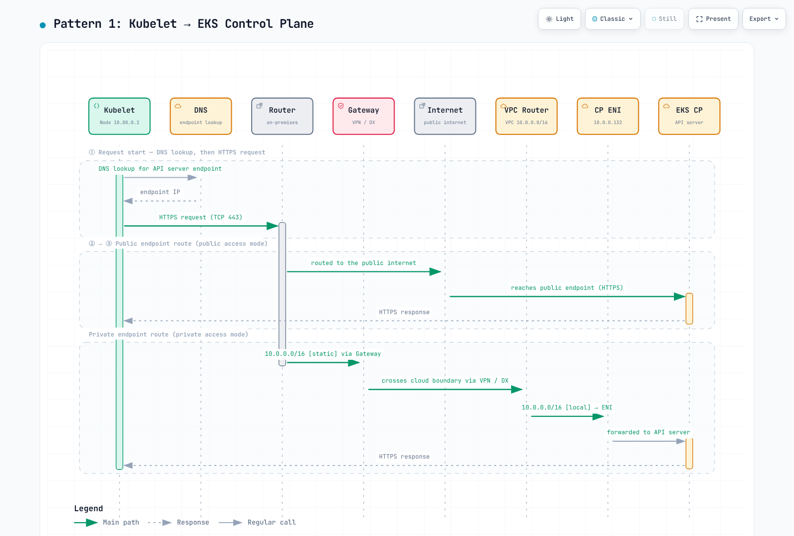
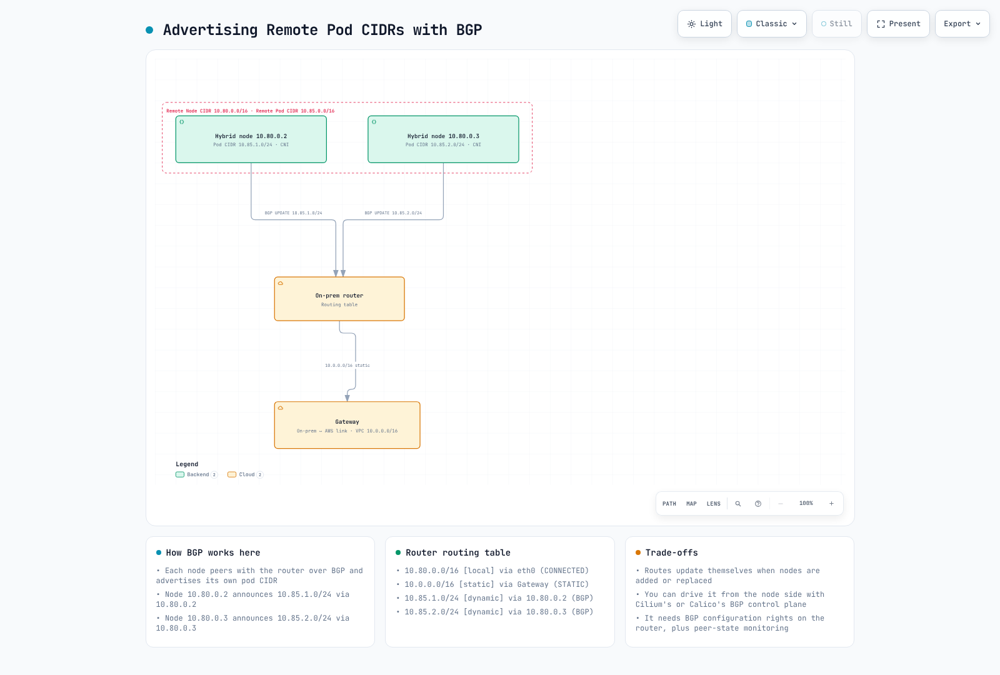
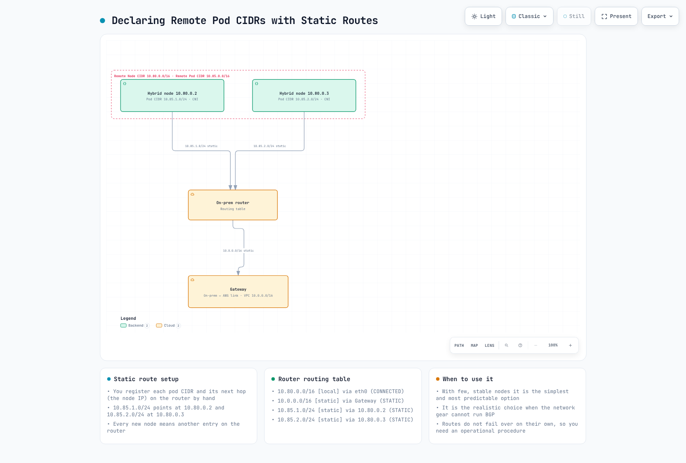

# 网络配置

> **支持的版本**: EKS 1.36 示例；AWS 维护的 Cilium 1.18.3-0 参考版本，需要兼容的主机/内核
> **最后更新**: September 16, 2026

分别验证路由、DNS、TLS、凭证和应用程序流量。这些示例已使用本地 schema 和 fixture（包括模拟的 Terraform provider）进行检查；未更改任何 AWS 资源、路由器、防火墙或运行中的集群。这些图表是基于 AWS 概念的仓库插图，并非 AWS 对此配置发布的验证。


[🔍 查看交互式图表](https://www.atomai.click/kubernetes-docs/archmaps/en-eks-hybrid-nodes-prereq-0.html)

**安全团队配套内容：**[Hybrid Nodes 网络隔离审查](11-network-separation-security.md)说明新的控制平面到本地连接、端点类型、权限和数据边界以及审查证据。仅有私有连接并不能确立合规性。

## 网络架构概述

控制平面→混合节点流量和私有 Kubernetes API 流量使用集群 VPC 网络路径。kubelet 到公有 API 端点的流量则使用其配置的公有路由；“所有流量始终经过 VPC ENI”这一说法过于宽泛。Direct Connect 公有 VIF、私有连接和公有互联网路径是不同的选择。

EKS 控制平面 ENI/IP 可能会更改。应审查实际集群归属和已批准的控制平面子网范围，而不是将共享 VPC 中每个 `Amazon EKS*` ENI 都视为属于此集群。

在执行只读诊断前绑定账户和 Kubernetes 上下文：

```bash
set -euo pipefail
: "${EXPECTED_ACCOUNT_ID:?Set the intended account}"
: "${AWS_REGION:?Set the cluster Region}"
: "${CLUSTER_NAME:?Set the reviewed cluster name}"
: "${KUBECONFIG:?Set the reviewed kubeconfig}"
export KUBECONFIG KUBE_CONTEXT="${KUBE_CONTEXT:-$CLUSTER_NAME}"
check_account() {
  local account
  account=$(aws sts get-caller-identity --region "$AWS_REGION" --query Account --output text) || return
  test "$account" = "$EXPECTED_ACCOUNT_ID" || { printf 'Account mismatch.\n' >&2; return 1; }
}
check_account
umask 077
export WORK_DIR
WORK_DIR=$(mktemp -d "$PWD/hybrid-network.XXXXXXXX")
aws eks describe-cluster --region "$AWS_REGION" --name "$CLUSTER_NAME" --output json \
  > "$WORK_DIR/cluster.json"
endpoint=$(kubectl --context "$KUBE_CONTEXT" config view --minify \
  -o jsonpath='{.clusters[0].cluster.server}')
jq -e --arg endpoint "$endpoint" '
  .cluster.status=="ACTIVE" and .cluster.endpoint==$endpoint and
  (.cluster.remoteNetworkConfig.remoteNodeNetworks|length)>0
' "$WORK_DIR/cluster.json" >/dev/null
printf 'Private diagnostics: %s\n' "$WORK_DIR"
```

## CIDR 范围要求

使用不重叠的 IPv4 **RFC1918 或 CGNAT** 远程节点/Pod 网络，并使其与 VPC 和 Kubernetes Service CIDR 分开。每种远程网络最多支持 15 个 CIDR。当前 EKS 通过其 API 工作流支持对现有集群配置远程网络；这并非仅限创建时操作。

| 网络行为 | 含义 |
|------------------|---------|
| 可路由 Pod IP | 经批准的路由允许云端/控制平面客户端向 Pod IP 发起连接 |
| 经伪装的出口流量 | SNAT 可为由 Pod 发起的连接提供返回路径；它不会自动允许新的入站连接 |
| 不可路由 Pod 网络 | 直接云端→Pod 流量需要另一种受支持的路径；对于常规设计，请使用云托管的 webhook/API Service |

不可路由并不意味着 Pod 无法发起任何 AWS API 调用。对于直接混合/云端 Pod 通信和混合托管的 webhook，请提供实际的 Pod 路由。网关/proxy 替代方案有各自独立的要求。

## 所需防火墙端口

| 流 | 协议 / 端口 |
|------|-----------------|
| Node/Pod → Kubernetes API | 到实际集群端点的 TCP443 |
| 控制平面 ENI → kubelet | 具有 kubelet 身份验证/授权的 TCP10250 |
| 控制平面 → webhook 或聚合 API Pod | 其配置的 TCP 端口，而非通用“8443+”范围 |
| DNS 客户端 ↔ 实际 resolver | UDP/TCP53 和有状态返回流量 |
| 参与节点之间的 Cilium VXLAN | UDP8472 |
| Cilium Geneve，仅在设计选择且支持时 | UDP6081 |
| Cilium 健康检查 | TCP4240 以及所需的 ICMP/健康端点可达性 |
| BGP 节点↔路由器 | 为配置的主动/被动 peer 使用 TCP179 |
| VPN 网关传输 | UDP500/4500 和适用的 IPsec 传输要求 |
| 应用程序 / AWS 凭证和 registry Service | 仅其实际目标和端口 |

通过网络所有者应用防火墙更改，并保留连接跟踪和现有规则。旧的宽泛 `10.0.0.0/8` INPUT 规则、未限定范围的 DNS/VXLAN 允许规则和整个规则集保存并非安全、可复用的防火墙策略。不要将未经身份验证的 kubelet 10255 作为可选的现代要求开放。

## AWS 端点访问

**EKS 管理 API PrivateLink 端点不是 Kubernetes API server 端点**。

| `com.amazonaws.<region>.*` 的 Service 后缀 | 用途 / 何时需要 |
|------------------------------------------------|-----------------------|
| `eks` | AWS EKS 管理调用，例如 DescribeCluster |
| `eks-auth` | 使用时的 EKS Pod Identity |
| `ecr.api`, `ecr.dkr` | 私有 ECR API/registry；镜像层还需要 S3 访问 |
| `s3` | 私有 S3 访问；本地不能直接使用 VPC gateway endpoint |
| `ssm`, 适用的 SSM messaging Service | SSM 凭证/管理功能 |
| `rolesanywhere` | 使用该 provider 时的 IAM Roles Anywhere 凭证 |
| `sts` | 实际客户端 STS/IRSA/AssumeRole 调用；在本地签署 EKS token 本身并不是客户端 STS 网络请求 |
| `logs`, `monitoring`, 其他选定 Service | 仅在所选 agent/workload 调用它们时 |
| `oidc-eks` | 当前 EKS OIDC discovery/JWKS PrivateLink Service（如可用） |
| `eks-proxy` | AWS console 资源视图；不是公有应用程序 SDK/API |

确认目标 Region 中的 Service 可用性。私有 ECR 端点并不会使**公有 ECR**、CloudFront 或任意包仓库变为私有。例如，公有 ECR 中的 AWS Cilium OCI chart 需要经过批准且可访问/镜像的分发路径。

OIDC discovery/JWKS 是匿名公钥材料。`oidc-eks` 仅接受其默认的完全访问端点策略；使用 SG/路由控制可达性，并使用 IAM 信任 `aud`/`sub` 条件控制角色授权。STS 在 AWS 内部验证 IRSA token，独立于此 VPC 端点。

对于 Roles Anywhere CreateSession 端点策略，principal 必须为 `*`，因为评估先于证书身份验证；请按文档限制已批准的 trust-anchor 资源和受支持的证书条件。不要在这些不同 Service 间复制一个通用端点策略。端点策略筛选端点流量；它们不能替代 IAM/角色信任，也不能全局禁用公有 Service 端点。

```bash
check_account
vpc_id=$(jq -er '.cluster.resourcesVpcConfig.vpcId' "$WORK_DIR/cluster.json")
aws ec2 describe-vpc-endpoints --region "$AWS_REGION" \
  --filters "Name=vpc-id,Values=$vpc_id" --output json |
  jq '[.VpcEndpoints[]|{id:.VpcEndpointId,service:.ServiceName,type:.VpcEndpointType,
      state:.State,privateDNS:.PrivateDnsEnabled,dnsOptions:.DnsOptions,
      subnets:.SubnetIds,groups:.Groups,dnsEntries:.DnsEntries}]'
```

### S3 Private DNS 和工件分发

S3 **interface endpoint 支持 private DNS**。仅入站 Resolver 选项会将本地查询通过 interface endpoint 引导，而 VPC 内流量使用所需的 S3 gateway endpoint。启用该选项期间请保留此 gateway。或者，清除该选项以对所有相关 S3 流量使用 interface endpoint。

Private DNS 不是 TLS 重写。将 `hybrid-assets.eks.amazonaws.com` 映射到 S3 endpoint 的 PHZ/CNAME 不会让 S3 具有 CloudFront hostname 的证书或对象/Host 路由行为。不要为使这种镜像工作而禁用 TLS 验证。使用受支持的工件准备/客户端配置路径、具有其自身 hostname/证书的已批准镜像，或已预装依赖项的已验证镜像。

## VPC 私有端点（受限互联网连接） {#vpc-private-endpoints-air-gap-private-connectivity}

这里的“air-gap”是指具有所需 AWS 连接的受限互联网访问，而不是断开连接的集群。

以下完整的 Terraform 示例使用现有 VPC、端点子网和 TGW。它不会创建 VPN/DX circuit、TGW attachment、本地路由或 EKS private DNS 配置。请验证 VPC DNS support/hostnames 和不同的实际 AZ；仅有两个不同的 subnet ID 并不能证明 AZ 多样性。

在计划替换前使用原始基础设施所有者并 import/adopt 现有资源。默认端点集合展示 SSM；请根据所选 provider/workload 进行更改。端点和 Resolver ENI 会产生费用。provider 账户防护和限定范围的 ingress 是有意设计；响应流量使用有状态 SG 跟踪。

```hcl
terraform {
  required_version = ">= 1.9, < 2.0"
  required_providers {
    aws = {
      source  = "hashicorp/aws"
      version = "= 6.64.0"
    }
  }
}

provider "aws" {
  region              = var.region
  allowed_account_ids = [var.expected_account_id]
}

variable "expected_account_id" {
  type = string
  validation {
    condition     = can(regex("^[0-9]{12}$", var.expected_account_id))
    error_message = "Set the reviewed 12-digit account ID."
  }
}

variable "region" {
  type = string
}

variable "name_prefix" {
  type    = string
  default = "hybrid-network"
}

variable "vpc_id" {
  type = string
}

variable "endpoint_subnet_ids" {
  type = set(string)
  validation {
    condition     = length(var.endpoint_subnet_ids) >= 2
    error_message = "Provide subnets in at least two verified Availability Zones."
  }
}

variable "s3_gateway_route_table_ids" {
  type = set(string)
  validation {
    condition     = length(var.s3_gateway_route_table_ids) > 0
    error_message = "Provide the reviewed VPC route tables for the S3 gateway endpoint."
  }
}

variable "client_ipv4_cidrs" {
  type = set(string)
  validation {
    condition = length(var.client_ipv4_cidrs) > 0 && alltrue([
      for c in var.client_ipv4_cidrs : can(cidrnetmask(c)) && c != "0.0.0.0/0"
    ])
    error_message = "Provide scoped IPv4 CIDRs for the actual VPC/on-premises clients."
  }
}

variable "onprem_dns_client_cidrs" {
  type = set(string)
  validation {
    condition = length(var.onprem_dns_client_cidrs) > 0 && alltrue([
      for c in var.onprem_dns_client_cidrs : can(cidrnetmask(c)) && c != "0.0.0.0/0"
    ])
    error_message = "Scope inbound DNS to the actual on-premises resolvers."
  }
}

variable "onprem_dns_servers" {
  type = set(string)
  validation {
    condition = length(var.onprem_dns_servers) > 0 && alltrue([
      for ip in var.onprem_dns_servers : can(cidrnetmask("${ip}/32"))
    ])
    error_message = "Provide actual IPv4 addresses of the on-premises DNS servers."
  }
}

variable "onprem_domain" {
  type    = string
  default = "corp.example.internal"
  validation {
    condition = length(var.onprem_domain) <= 253 && length(split(".", trimsuffix(var.onprem_domain, "."))) >= 2 && alltrue([
      for label in split(".", trimsuffix(var.onprem_domain, ".")) :
      length(label) <= 63 && can(regex("^[A-Za-z0-9]([A-Za-z0-9-]*[A-Za-z0-9])?$", label))
    ]) && !can(regex("(^|\\.)(amazonaws\\.com|api\\.aws|cluster\\.local)\\.?$", lower(var.onprem_domain)))
    error_message = "Use a specific owned DNS suffix; do not forward root, AWS or Kubernetes service zones back to on-premises."
  }
}

variable "interface_services" {
  type    = set(string)
  default = ["eks", "ecr.api", "ecr.dkr", "ssm", "ssmmessages"]
  validation {
    condition     = !contains(var.interface_services, "s3")
    error_message = "S3 has its own gateway/interface configuration below."
  }
}

variable "endpoint_policy_json" {
  type    = map(string)
  default = {}
  validation {
    condition = !contains(keys(var.endpoint_policy_json), "oidc-eks") && alltrue([
      for policy in values(var.endpoint_policy_json) : can(jsondecode(policy))
    ])
    error_message = "Use valid service-specific JSON policies; oidc-eks supports only its default full-access policy."
  }
}

variable "controlplane_route_table_ids" {
  type = set(string)
}

variable "remote_ipv4_cidrs" {
  type = set(string)
  validation {
    condition = alltrue([
      for c in var.remote_ipv4_cidrs : can(cidrnetmask(c)) && c != "0.0.0.0/0"
    ])
    error_message = "Use reviewed remote node, Pod and required DNS/service IPv4 CIDRs."
  }
}

variable "existing_transit_gateway_id" {
  type = string
}
```
```hcl
# Import/adopt existing resources through their owner before using this example.
# The existing VPC must have DNS support/hostnames and working hybrid routes.
resource "aws_security_group" "endpoints" {
  name_prefix = "${var.name_prefix}-vpce-"
  description = "HTTPS clients for interface endpoints"
  vpc_id      = var.vpc_id
}

resource "aws_vpc_security_group_ingress_rule" "endpoint_https" {
  for_each          = var.client_ipv4_cidrs
  security_group_id = aws_security_group.endpoints.id
  cidr_ipv4         = each.value
  ip_protocol       = "tcp"
  from_port         = 443
  to_port           = 443
}

resource "aws_vpc_endpoint" "service" {
  for_each            = var.interface_services
  vpc_id              = var.vpc_id
  service_name        = "com.amazonaws.${var.region}.${each.value}"
  vpc_endpoint_type   = "Interface"
  private_dns_enabled = true
  subnet_ids          = var.endpoint_subnet_ids
  security_group_ids  = [aws_security_group.endpoints.id]
  policy              = lookup(var.endpoint_policy_json, each.key, null)
  tags                = { Name = "${var.name_prefix}-${each.key}" }
}

# S3 inbound-Resolver-only private DNS requires this gateway endpoint.
resource "aws_vpc_endpoint" "s3_gateway" {
  vpc_id            = var.vpc_id
  service_name      = "com.amazonaws.${var.region}.s3"
  vpc_endpoint_type = "Gateway"
  route_table_ids   = var.s3_gateway_route_table_ids
  tags             = { Name = "${var.name_prefix}-s3-gateway" }
}

resource "aws_vpc_endpoint" "s3_interface" {
  vpc_id              = var.vpc_id
  service_name        = "com.amazonaws.${var.region}.s3"
  vpc_endpoint_type   = "Interface"
  private_dns_enabled = true
  subnet_ids          = var.endpoint_subnet_ids
  security_group_ids  = [aws_security_group.endpoints.id]
  dns_options {
    private_dns_only_for_inbound_resolver_endpoint = true
  }
  depends_on = [aws_vpc_endpoint.s3_gateway]
  tags       = { Name = "${var.name_prefix}-s3-interface" }
}

resource "aws_security_group" "dns_inbound" {
  name_prefix = "${var.name_prefix}-dns-in-"
  description = "DNS from on-premises resolvers"
  vpc_id      = var.vpc_id
}

resource "aws_security_group" "dns_outbound" {
  name_prefix = "${var.name_prefix}-dns-out-"
  description = "DNS to reviewed on-premises resolvers"
  vpc_id      = var.vpc_id
}

locals {
  inbound_dns_rules = {
    for pair in setproduct(var.onprem_dns_client_cidrs, toset(["tcp", "udp"])) :
    "${pair[0]}-${pair[1]}" => { cidr = pair[0], protocol = pair[1] }
  }
  outbound_dns_rules = {
    for pair in setproduct(var.onprem_dns_servers, toset(["tcp", "udp"])) :
    "${pair[0]}-${pair[1]}" => { ip = pair[0], protocol = pair[1] }
  }
}

resource "aws_vpc_security_group_ingress_rule" "dns" {
  for_each          = local.inbound_dns_rules
  security_group_id = aws_security_group.dns_inbound.id
  cidr_ipv4         = each.value.cidr
  ip_protocol       = each.value.protocol
  from_port         = 53
  to_port           = 53
}

resource "aws_vpc_security_group_egress_rule" "dns" {
  for_each          = local.outbound_dns_rules
  security_group_id = aws_security_group.dns_outbound.id
  cidr_ipv4         = "${each.value.ip}/32"
  ip_protocol       = each.value.protocol
  from_port         = 53
  to_port           = 53
}

resource "aws_route53_resolver_endpoint" "inbound" {
  name                   = "${var.name_prefix}-inbound"
  direction              = "INBOUND"
  resolver_endpoint_type = "IPV4"
  security_group_ids     = [aws_security_group.dns_inbound.id]
  dynamic "ip_address" {
    for_each = var.endpoint_subnet_ids
    content {
      subnet_id = ip_address.value
    }
  }
}

resource "aws_route53_resolver_endpoint" "outbound" {
  name                   = "${var.name_prefix}-outbound"
  direction              = "OUTBOUND"
  resolver_endpoint_type = "IPV4"
  security_group_ids     = [aws_security_group.dns_outbound.id]
  dynamic "ip_address" {
    for_each = var.endpoint_subnet_ids
    content {
      subnet_id = ip_address.value
    }
  }
}

resource "aws_route53_resolver_rule" "onprem" {
  domain_name          = var.onprem_domain
  name                 = "${var.name_prefix}-onprem"
  rule_type            = "FORWARD"
  resolver_endpoint_id = aws_route53_resolver_endpoint.outbound.id
  dynamic "target_ip" {
    for_each = var.onprem_dns_servers
    content {
      ip   = target_ip.value
      port = 53
    }
  }
}

resource "aws_route53_resolver_rule_association" "onprem" {
  resolver_rule_id = aws_route53_resolver_rule.onprem.id
  vpc_id           = var.vpc_id
}

output "inbound_resolver_ips" {
  value = [for address in aws_route53_resolver_endpoint.inbound.ip_address : address.ip]
}

# VPC return routes only. Existing TGW attachment routes/propagation and
# on-premises routing must be managed separately by their infrastructure owner.
locals {
  remote_routes = {
    for pair in setproduct(var.controlplane_route_table_ids, var.remote_ipv4_cidrs) :
    "${pair[0]}-${pair[1]}" => { table = pair[0], cidr = pair[1] }
  }
}

resource "aws_route" "hybrid" {
  for_each               = local.remote_routes
  route_table_id         = each.value.table
  destination_cidr_block = each.value.cidr
  transit_gateway_id     = var.existing_transit_gateway_id
  # A VGW topology uses gateway_id instead; do not set both target fields.
}
```

S3 gateway 依赖关系是显式的。请在 `remote_ipv4_cidrs` 中包含所需的本地 DNS/Service 范围，而不只是 Node/Pod 网络：示例 DNS server `192.168.1.10/11` 需要一个已批准的 `192.168.1.0/24` 路由或相应的主机路由。对于 VGW 返回路由，请使用 `gateway_id` 而非 `transit_gateway_id`；不要将 TGW ID 放入 VGW/gateway 字段，也不要同时配置两个 target。仅有 VPC 路由无法建立 TGW/VPN/本地路由。

## DNS 配置

本地 resolver 可以将选定 AWS/Service 和实际集群端点名称有条件地转发至 Route 53 Resolver 入站 IP。请使用真实端点返回的地址。宽泛的 `amazonaws.com` 转发可能影响无关 Service；请谨慎选择 zone 并避免转发循环。

```text
// Example service zones only. Replace these Resolver IPs with actual outputs.
zone "eks.ap-northeast-2.amazonaws.com" {
    type forward;
    forward only;
    forwarders { 10.0.1.10; 10.0.2.10; };
};
zone "s3.ap-northeast-2.amazonaws.com" {
    type forward;
    forward only;
    forwarders { 10.0.1.10; 10.0.2.10; };
};
```

此 BIND 片段覆盖所示 Service zone，而不会自动覆盖 Kubernetes API hostname。请从经验证的 Service 清单中添加实际集群端点的 DNS 名称/后缀和其他所需名称。Resolver 出站规则处理本地 zone；该 zone 必须在选定 DNS server 上具有权威性/可达性，而不是被转发回同一循环中。

### CoreDNS 自定义域配置

如果所选设计直接从 CoreDNS 转发，请将经审查的 server block 合并到现有 Corefile 中；不要覆盖整个托管 ConfigMap：

```text
# Fragment to merge through the CoreDNS configuration owner.
corp.example.internal:53 {
    errors
    cache 30
    forward . 192.168.1.10 192.168.1.11 {
        max_concurrent 1000
    }
}
```

保留现有 Kubernetes zone、health/readiness 和 reload 行为。检查实际 resolver 文件和 systemd-resolved/stub 布局；将 DNS server 转发回自身可能造成循环。对于一个 zone，请选择适当的 VPC 转发路径或显式 CoreDNS 转发，而不是叠加相互矛盾的路由。

对于托管 EKS add-on，获取**已安装版本的**配置 schema，并验证完整的建议值，同时保留无关的现有设置：

```bash
check_account
aws eks describe-addon --region "$AWS_REGION" --cluster-name "$CLUSTER_NAME" \
  --addon-name coredns --output json > "$WORK_DIR/coredns-addon.json"
addon_version=$(jq -er '.addon.addonVersion' "$WORK_DIR/coredns-addon.json")
aws eks describe-addon-configuration --region "$AWS_REGION" --addon-name coredns \
  --addon-version "$addon_version" --output json > "$WORK_DIR/coredns-schema-response.json"
jq -r '.configurationSchema' "$WORK_DIR/coredns-schema-response.json" \
  > "$WORK_DIR/coredns-schema.json"
# Prepare the full intended values, preserving unrelated existing configuration.
: "${COREDNS_CANDIDATE_JSON:?Set the reviewed full configurationValues JSON file}"
export COREDNS_CANDIDATE_JSON
python3 - <<'PY'
import json, os
from pathlib import Path
import jsonschema
folder = Path(os.environ["WORK_DIR"])
schema = json.loads((folder / "coredns-schema.json").read_text())
candidate = json.loads(Path(os.environ["COREDNS_CANDIDATE_JSON"]).read_text())
validator = jsonschema.validators.validator_for(schema)
validator.check_schema(schema)
validator(schema).validate(candidate)
print("Configuration matches the fetched schema; rollout and DNS behavior are not yet verified")
PY
```

这是本地 schema 检查，而非 rollout。在应用配置前，请协调托管 add-on/GitOps 所有权、autoscaling 和恢复。

### CoreDNS 放置和本地性

AWS 建议在混合集群中至少在云端 Node 上部署一个 CoreDNS replica，并在混合 Node 上部署一个。每个位置两个 replica 可以是一种弹性选择；四个 replica 不是通用最低要求，也不是保证。

验证所有预期 DNS Node 上的真实 zone label。混合 Node 需要由所有者定义的 `topology.kubernetes.io/zone` 值，例如 `onprem-dc1`；compute-type label 不会自动成为该 zone 或 taint。合并放置偏好时不要删除无关的 affinity/toleration：

```json
{
  "affinity": {
    "podAntiAffinity": {
      "preferredDuringSchedulingIgnoredDuringExecution": [
        {
          "weight": 100,
          "podAffinityTerm": {
            "labelSelector": {
              "matchLabels": {
                "k8s-app": "kube-dns"
              }
            },
            "topologyKey": "kubernetes.io/hostname"
          }
        },
        {
          "weight": 50,
          "podAffinityTerm": {
            "labelSelector": {
              "matchLabels": {
                "k8s-app": "kube-dns"
              }
            },
            "topologyKey": "topology.kubernetes.io/zone"
          }
        }
      ]
    }
  }
}
```

软 affinity/spread 是偏好，而非保证的 2+2 分布或成功 bootstrap。仅有放置也无法确保客户端选择本地 DNS replica。

AWS 记录的 Service Traffic Distribution 示例使用 `PreferClose`。使用 Cilium 时，请配置受支持的 `loadBalancer.serviceTopology` 设置，并在依赖它之前通过所有者滚动受影响 agent。审查实际 dataplane/version 和健康的本地端点。

```json
{
  "spec": {
    "trafficDistribution": "PreferClose"
  }
}
```
```bash
kubectl --context "$KUBE_CONTEXT" --request-timeout=15s -n kube-system \
  get service kube-dns -o json |
  jq '{name:.metadata.name,uid:.metadata.uid,clusterIP:.spec.clusterIP,
       clusterIPs:.spec.clusterIPs,ports:.spec.ports,trafficDistribution:.spec.trafficDistribution}'
kubectl --context "$KUBE_CONTEXT" --request-timeout=15s -n kube-system \
  get endpointslices -l kubernetes.io/service-name=kube-dns -o json |
  jq '[.items[]|{name:.metadata.name,addressType,ports,
       endpoints:[.endpoints[]?|{addresses,nodeName,zone,conditions,hints}]}]'
kubectl --context "$KUBE_CONTEXT" --request-timeout=15s -n kube-system \
  get pods -l k8s-app=kube-dns -o json |
  jq '[.items[]|{name:.metadata.name,node:.spec.nodeName,phase:.status.phase,
       ready:([.status.conditions[]?|select(.type=="Ready")|.status]|first // "NotReported")}]'
```

检查实际 Service IP、EndpointSlice zone/hint 和 Pod readiness。`10.100.0.10` 是特定 Service CIDR 的示例，而不是通用集群 DNS 地址。本地 replica 不会让断开连接的 EKS 集群变成完全独立的 DNS/控制平面。

## 流量模式

图示使用说明性地址和简化的处理阶段。检查实际 Service dataplane 是 kube-proxy iptables、nftables/IPVS，还是 Cilium 的 eBPF 替代方案。

### 模式 1：Kubelet → EKS 控制平面

kubelet 解析并连接到配置的 Kubernetes API 端点。私有和公有访问有不同路由；两者都不应与 EKS 管理 PrivateLink 端点混淆。



[🔍 查看交互式图表](https://www.atomai.click/kubernetes-docs/archmaps/en-eks-hybrid-nodes-02-network-configuration-10.html)

### 模式 2：EKS 控制平面 → Kubelet

控制平面通过 TCP10250 访问已报告且可路由的 Node 地址。此路径支持 logs、exec 和 port-forward，并且需要反向路由、防火墙许可和 kubelet 身份验证。


[🔍 查看交互式图表](https://www.atomai.click/kubernetes-docs/archmaps/en-eks-hybrid-nodes-02-network-configuration-11.html)

### 模式 3：Pod → EKS 控制平面

使用 Kubernetes Service IP 的 Pod 需要将 Service 转换到选定 API 端点。如果应用出口 SNAT，响应会以 Node 地址为目标，连接跟踪会反转转换；没有 SNAT 时，Pod 地址需要返回路由。


[🔍 查看交互式图表](https://www.atomai.click/kubernetes-docs/archmaps/en-eks-hybrid-nodes-02-network-configuration-12.html)

图中的 SNAT-before-DNAT 编号并非通用 hook 顺序。在 iptables 路径中，Service DNAT 通常先于路由和适用的 POSTROUTING SNAT。eBPF 路径不同。请在得出结论前捕获实际数据包/连接状态。

### 模式 4：EKS 控制平面 → Pod (Webhook)

API server 需要能访问选定 webhook Pod IP/port。请使用配置的端口；旧的“8443+”图例不是有效的端口范围要求。


[🔍 查看交互式图表](https://www.atomai.click/kubernetes-docs/archmaps/en-eks-hybrid-nodes-02-network-configuration-13.html)

### 模式 5：混合 Node 上的 Pod ↔ Pod

使用受支持的 VXLAN overlay 时，通过**外层 Node IP**到达目标 Node。underlay 无需为内部目标 Pod CIDR 提供路由，即可承载封装的数据包。


[🔍 查看交互式图表](https://www.atomai.click/kubernetes-docs/archmaps/en-eks-hybrid-nodes-02-network-configuration-14.html)

图中封装后使用 `10.85.x.0/24` 的转发标签应被理解为较旧的简化：外层数据包路由至 `10.80.0.x`。同一 L2 网段上的 Node 可能无需路由器跳转即可直接通信。

VXLAN 使用 UDP 封装内部 Ethernet frame。在 IPv4/无额外封装示例中，50 字节开销说明了 1500→1450 MTU 调整；额外隧道会改变该计算。Cilium VXLAN 使用 UDP8472；标准 VXLAN 通常使用 4789。Geneve 使用 UDP6081。当前 Cilium 隧道配置区分 VXLAN/Geneve；IP-in-IP 不是可由旧 `--tunnel` 建议选择的可互换默认 overlay。

VNI 字段为 24 位；Cilium 可以在封装 metadata 中携带安全 identity。它不是密码学租户隔离。请将 NetworkPolicy 和实际 identity 传播分开考虑。

### 模式 6：云端 Pod ↔ 混合 Pod

直接 Pod-IP 流量需要跨 VPC、WAN 和本地网络的相关 Pod 路由。仅当请求实际针对 Service VIP 时才需要 Service 转换。


[🔍 查看交互式图表](https://www.atomai.click/kubernetes-docs/archmaps/en-eks-hybrid-nodes-02-network-configuration-15.html)

图中的 kube-proxy/iptables block 取决于 dataplane；直接 Pod-IP 数据包并非固有地需要 kube-proxy DNAT。

### kube-proxy 和 kubelet 细节

在 kube-proxy **iptables mode** 中，常见 chain 路径为：

```text
KUBE-SERVICES → KUBE-SVC-* → KUBE-SEP-* → endpoint DNAT
```

对于三个合格的等权重 endpoint 且没有覆盖 affinity/locality policy，条件概率依次为 1/3、剩余数据包的 1/2 和余数，从而产生大致相等的选择。这只是说明，并非捕获输出或每个 dataplane 的规则结构：

```text
# KUBE-SERVICES chain (nat table)
-A KUBE-SERVICES -d 172.20.0.10/32 -p tcp -m tcp --dport 80 -j KUBE-SVC-XXXXXX

# KUBE-SVC chain (load balancing)
-A KUBE-SVC-XXXXXX -m statistic --mode random --probability 0.33333 -j KUBE-SEP-AAAAAA
-A KUBE-SVC-XXXXXX -m statistic --mode random --probability 0.50000 -j KUBE-SEP-BBBBBB
-A KUBE-SVC-XXXXXX -j KUBE-SEP-CCCCCC

# KUBE-SEP chain (DNAT)
-A KUBE-SEP-AAAAAA -p tcp -j DNAT --to-destination 10.85.0.15:8080
-A KUBE-SEP-BBBBBB -p tcp -j DNAT --to-destination 10.85.0.16:8080
-A KUBE-SEP-CCCCCC -p tcp -j DNAT --to-destination 10.85.1.20:8080
```

| 安全 kubelet 端点 | 用途 |
|------------------------|---------|
| `/pods` | Pod 信息 |
| `/exec/{namespace}/{pod}/{container}` | 容器 exec 流 |
| `/containerLogs/{namespace}/{pod}/{container}` | 容器日志；不是以前的 `/logs/...` 路径 |
| `/metrics`, `/healthz` | 已授权的 metrics/health 端点 |

使用受支持的经 API server 中介的诊断和适当授权。Node 的真实 `status.addresses` 很重要；不要替换为 hostname 或不相关对象中的第一个地址。

## 可路由 Pod CIDR 配置


[🔍 查看交互式图表](https://www.atomai.click/kubernetes-docs/archmaps/en-eks-hybrid-nodes-02-network-configuration-0.html)

### 选项 1：BGP（推荐）



[🔍 查看交互式图表](https://www.atomai.click/kubernetes-docs/archmaps/en-eks-hybrid-nodes-02-network-configuration-1.html)

AWS 的专用 CNI 支持页面列出了 AWS 维护的 Cilium 1.17/1.18 build。此处的参考版本是在兼容内核/OS 上使用 1.18.3-0；不要盲目替换为上游 1.19。其他 AWS 页面仍提到 Calico BGP 及其保留的示例。这并非 Calico 项目已被弃用的证据；请确认现有部署的支持范围。

通过**现有固定版本的 Cilium release**的所有者启用 BGP，合并 values 并审查 operator/agent rollout：

```yaml
bgpControlPlane:
  enabled: true
operator:
  rollOutPods: true
```

AWS 风格的 `v2alpha1` API 在经审查的 1.18.3 CRD 中仍被提供（它们也提供 `v2`）。无需仅为使用此示例而替换 CRD。

以下配置选择混合 Node，将 peer 的通告 selector 链接到通告 label，并仅通告其 Pod CIDR：

```yaml
apiVersion: cilium.io/v2alpha1
kind: CiliumBGPClusterConfig
metadata:
  name: hybrid-bgp-config
spec:
  nodeSelector:
    matchLabels:
      eks.amazonaws.com/compute-type: hybrid
  bgpInstances:
  - name: hybrid-instance
    localASN: 65001
    peers:
    - name: on-prem-router
      peerASN: 65000
      peerAddress: 10.80.1.1
      peerConfigRef:
        name: on-prem-peer
```
```yaml
apiVersion: cilium.io/v2alpha1
kind: CiliumBGPPeerConfig
metadata:
  name: on-prem-peer
spec:
  timers:
    holdTimeSeconds: 90
    keepAliveTimeSeconds: 30
  gracefulRestart:
    enabled: true
    restartTimeSeconds: 120
  families:
  - afi: ipv4
    safi: unicast
    advertisements:
      matchLabels:
        advertise: hybrid-pods
```
```yaml
apiVersion: cilium.io/v2alpha1
kind: CiliumBGPAdvertisement
metadata:
  name: hybrid-pod-cidrs
  labels:
    advertise: hybrid-pods
spec:
  advertisements:
  - advertisementType: PodCIDR
```

该示例假定选定 Node 能以预期 peer 拓扑访问路由器 `10.80.1.1`。不同机架/loopback 可能需要不同的不重叠 selector 和经审查的 multihop 设置。TCP179、ASN、身份验证、route filter、协商 timer 和 graceful-restart stale-route 行为需要网络所有者审查。

仅建立 BGP session 并不能证明预期 prefix 已被通告、接受或安装到路由器的 forwarding table。Cilium BGP control plane 通告可达性；它不能替代所有 kernel/underlay 路由。

```bash
cilium --context "$KUBE_CONTEXT" bgp peers
cilium --context "$KUBE_CONTEXT" bgp routes
kubectl --context "$KUBE_CONTEXT" --request-timeout=15s \
  get ciliumbgpclusterconfigs,ciliumbgppeerconfigs,ciliumbgpadvertisements -o json |
  jq '[.items[]|{kind,name:.metadata.name,status:.status}]'
```

#### ASN 和路由器配置

RFC6996 私有范围是 **64512–65534** 和 **4200000000–4294967294**。之前“一律仅使用 16 位范围”的规则不正确。不要将每个 1–64511 值描述为可自由使用的公有 ASN；公有/保留/文档分配各有自己的规则。

使用现有的协调网络 ASN。这些示例中，`localASN=65001` 表示 Cilium Node，`peerASN=65000` 表示其本地路由器。TGW 的 ASN 是不同的上游关系：仅因 TGW 存在，Cilium 不会自动与 TGW peer。Site-to-Site VPN BGP 在配置的 VPN/customer gateway 路径终止；TGW Connect 是另一种独立的传输/设计。

以下 vendor 片段是说明性的起点，而非设备测试过的配置。请通过路由器所有者合并，并使用特定平台/版本的 import/export prefix filter、限制和恢复机制。不要不加区分地更改运行中路由器的全局 ASN。

**Cisco IOS / IOS-XE**

```text
router bgp 65000
 neighbor 10.80.1.10 remote-as 65001
 neighbor 10.80.1.10 description "EKS Hybrid Node - Cilium BGP"
 !
 address-family ipv4 unicast
  neighbor 10.80.1.10 activate
  neighbor 10.80.1.10 soft-reconfiguration inbound
 exit-address-family
```

**Cisco NX-OS (Nexus)**

```text
router bgp 65000
  address-family ipv4 unicast
  neighbor 10.80.1.10
    remote-as 65001
    description EKS-Hybrid-Cilium
    address-family ipv4 unicast
      soft-reconfiguration inbound
```

**Juniper Junos (MX / QFX / SRX)**

```text
set protocols bgp group eks-hybrid type external
set protocols bgp group eks-hybrid peer-as 65001
set protocols bgp group eks-hybrid neighbor 10.80.1.10 description "EKS Hybrid Node"
set protocols bgp group eks-hybrid family inet unicast
set routing-options autonomous-system 65000
```

**Arista EOS**

```text
router bgp 65000
   neighbor 10.80.1.10 remote-as 65001
   neighbor 10.80.1.10 description EKS-Hybrid-Cilium
   !
   address-family ipv4
      neighbor 10.80.1.10 activate
```

**MikroTik RouterOS 7.20+**

```text
/routing/bgp/instance
add name=hybrid as=65000
/routing/bgp/connection
add name=hybrid-node-001 instance=hybrid remote.address=10.80.1.10 remote.as=65001 local.role=ebgp address-families=ip disabled=yes
# Review input/output filters and routing before enabling the connection.
```

**FRRouting (FRR)，参考 10.7.1**

```text
ip prefix-list HYBRID_PODS seq 10 permit 10.85.0.0/16 ge 25 le 25
route-map FROM_HYBRID permit 10
 match ip address prefix-list HYBRID_PODS
route-map TO_HYBRID deny 10
router bgp 65000
 bgp router-id 10.80.1.1
 bgp ebgp-requires-policy
 neighbor 10.80.1.10 remote-as 65001
 address-family ipv4 unicast
  neighbor 10.80.1.10 activate
  neighbor 10.80.1.10 route-map FROM_HYBRID in
  neighbor 10.80.1.10 route-map TO_HYBRID out
 exit-address-family
```

RouterOS 7.20+ 显式定义 BGP instance。FRR 的传统默认设置要求 eBGP policy；没有 filter 的已建立 session 可能显示 `(Policy)` 且不交换路由。FRR 示例仅接受经审查的 `/25` Pod block，且不会向 Cilium 导出路由；请根据实际 IPAM 设计和上游路由调整 filter。

### 选项 2：静态路由



[🔍 查看交互式图表](https://www.atomai.click/kubernetes-docs/archmaps/en-eks-hybrid-nodes-02-network-configuration-2.html)

在 Cilium **cluster-pool IPAM** 中，读取所有已分配的 `CiliumNode.spec.ipam.podCIDRs`。不能保证分配遵循 Node 注册顺序。一个 `/16` 在几何上包含 512 个 `/25` block，每个 `/25` 有 128 个地址；这并不保证支持 512 个 Node，或每个 Node 有 128 个可用的应用程序 Pod IP。保留地址、Node/CNI 使用和 kubelet/资源限制也很重要。

这是经审查的新 pool 的 Cilium Helm-values 片段，而非 kubelet 范围的 `podCIDR` 设置。不要将更改现有已分配 CIDR 或 block 大小作为迁移的捷径：

```yaml
ipam:
  mode: cluster-pool
  operator:
    clusterPoolIPv4PodCIDRList:
    - 10.85.0.0/16
    clusterPoolIPv4MaskSize: 25
```

不要将 `.addresses[0]` 用作 next hop：它可能是 Cilium 内部地址。以下内容将 IPv4 InternalIP 与 Kubernetes Node 交叉检查，根据已批准的远程范围验证所有 Pod prefix，拒绝重叠/缺失状态，并生成 **JSON candidates**，而非可执行 shell：

```bash
kubectl --context "$KUBE_CONTEXT" --request-timeout=15s get nodes \
  -l eks.amazonaws.com/compute-type=hybrid -o json |
  jq '{items:[.items[]|{metadata:{name:.metadata.name,uid:.metadata.uid},
       status:{addresses:.status.addresses}}]}' > "$WORK_DIR/hybrid-nodes.json"
kubectl --context "$KUBE_CONTEXT" --request-timeout=15s get ciliumnodes.cilium.io -o json |
  jq '{items:[.items[]|{metadata:{name:.metadata.name,uid:.metadata.uid},
       spec:{addresses:.spec.addresses,ipam:{podCIDRs:.spec.ipam.podCIDRs}}}]}' \
  > "$WORK_DIR/cilium-nodes.json"
```
```bash
python3 - <<'PY'
import ipaddress, json, os
from pathlib import Path
folder = Path(os.environ["WORK_DIR"])
network = json.loads((folder / "cluster.json").read_text())["cluster"]["remoteNetworkConfig"]
node_ranges = [ipaddress.ip_network(c, strict=True) for n in network["remoteNodeNetworks"] for c in n["cidrs"]]
pod_ranges = [ipaddress.ip_network(c, strict=True) for n in network.get("remotePodNetworks", []) for c in n["cidrs"]]
if not pod_ranges:
    raise SystemExit("A reviewed routable remote Pod range is required for this route plan")
nodes = {n["metadata"]["name"]: n for n in json.loads((folder / "hybrid-nodes.json").read_text())["items"]}
claims = json.loads((folder / "cilium-nodes.json").read_text())["items"]
rows, seen = [], []
for item in claims:
    name = item["metadata"]["name"]
    if name not in nodes:
        continue
    node = nodes[name]
    ips = [ipaddress.ip_address(a["address"]) for a in node["status"]["addresses"]
           if a["type"] == "InternalIP" and ":" not in a["address"]]
    if len(ips) != 1 or not any(ips[0] in n for n in node_ranges):
        raise SystemExit(f"Review the unique IPv4 InternalIP and remote-node range for {name}")
    cilium_ips = [ipaddress.ip_address(a["ip"]) for a in item["spec"].get("addresses", [])
                  if a["type"] == "InternalIP" and ":" not in a["ip"]]
    if cilium_ips != ips:
        raise SystemExit(f"Kubernetes/Cilium InternalIP mismatch for {name}")
    cidrs = item["spec"]["ipam"].get("podCIDRs") or []
    if not cidrs:
        raise SystemExit(f"No allocated cluster-pool Pod CIDRs for {name}; do not invent a route")
    for raw in cidrs:
        cidr = ipaddress.ip_network(raw, strict=True)
        if cidr.version != 4 or not any(cidr.subnet_of(p) for p in pod_ranges):
            raise SystemExit(f"Unapproved Pod CIDR for {name}: {cidr}")
        if any(cidr.overlaps(previous) for previous in seen):
            raise SystemExit("Overlapping or duplicate Pod routes require investigation")
        seen.append(cidr)
        rows.append({"node": name, "nodeUID": node["metadata"]["uid"],
                     "ciliumNodeUID": item["metadata"]["uid"], "destination": str(cidr), "nextHop": str(ips[0])})
if set(nodes) != {row["node"] for row in rows}:
    raise SystemExit("Some hybrid nodes have no matching Cilium allocation")
(folder / "reviewed-route-candidates.json").write_text(json.dumps(rows, indent=2) + "\n")
print(json.dumps(rows, indent=2))
PY
```

这是 cluster-pool IPAM 的时间点计划，而非对 Node identity 或 routing controller 的原子租约。更改前请重新验证。Calico BlockAffinity 是不同的模型；应检查其状态、借用/pool 行为和实际路由，而不是盲目复用此 generator。

在所有者审查后，手动路由器语法可能如下：

```text
# Illustrative syntax after validating the route plan on the intended router:
# Linux
ip route add 10.85.0.0/25 via 10.80.1.10
# Cisco IOS / IOS-XE
ip route 10.85.0.0 255.255.255.128 10.80.1.10 name hybrid-node-001-pods
# FRR
ip route 10.85.0.0/25 10.80.1.10
```

通过实际网络管理器/设备配置持久化更改。`up ip route ...` 行属于 ifupdown stanza，而不是独立 Bash script，也并非适用于每个现代 Linux network manager。静态路由需要 drift/failure 跟踪；原来的“1–5 Node”阈值是规划启发式，而非技术限制。

### 选项 3：ARP Proxying

AWS 将 proxy ARP 描述为一种可行的 L2 方法。它需要适当的 on-link neighbor-discovery 行为和专门配置的 CNI/host 实现；仅启用通用 Cilium 并不能证明此路径已准备就绪。


[🔍 查看交互式图表](https://www.atomai.click/kubernetes-docs/archmaps/en-eks-hybrid-nodes-02-network-configuration-3.html)

ARP broadcast 不会穿越 TGW/VPN/DX Layer-3 路由。此选项不会消除 VPC/WAN 返回路由要求。在替换 BGP/静态设计前，请验证实际 L2 行为和 failover。

## 网络策略

策略取决于选择、方向和实施的 dataplane。Kubernetes NetworkPolicy allow 是累加的：另一个匹配策略可以允许流量。Cilium 显式 deny 和 L7 行为需要单独评估。这些示例是在受控 namespace 中测试的替代方案，而不是要求叠加每个 allow rule 并期待更严格行为的指令。

### Kubernetes NetworkPolicy

```yaml
apiVersion: networking.k8s.io/v1
kind: NetworkPolicy
metadata:
  name: allow-frontend-to-backend
  namespace: bookinfo
spec:
  podSelector:
    matchLabels:
      app: reviews
  policyTypes:
  - Ingress
  ingress:
  - from:
    - podSelector:
        matchLabels:
          app: productpage
    ports:
    - protocol: TCP
      port: 9080
```

此配置选择 `reviews` ingress，并允许同一 namespace 中匹配的 `productpage` Pod 使用 TCP9080。它不会隔离每个 Pod/方向，也不会覆盖其他所有策略。

### CiliumNetworkPolicy 和 L7

```yaml
apiVersion: cilium.io/v2
kind: CiliumNetworkPolicy
metadata:
  name: allow-frontend-to-backend
  namespace: bookinfo
spec:
  endpointSelector:
    matchLabels:
      app: reviews
  ingress:
  - fromEndpoints:
    - matchLabels:
        app: productpage
        k8s:io.kubernetes.pod.namespace: bookinfo
    toPorts:
    - ports:
      - port: '9080'
        protocol: TCP
```
```yaml
apiVersion: cilium.io/v2
kind: CiliumNetworkPolicy
metadata:
  name: frontend-http-contract
  namespace: bookinfo
spec:
  endpointSelector:
    matchLabels:
      app: reviews
  ingress:
  - fromEndpoints:
    - matchLabels:
        app: productpage
        k8s:io.kubernetes.pod.namespace: bookinfo
    toPorts:
    - ports:
      - port: '9080'
        protocol: TCP
      rules:
        http:
        - method: GET
          path: /api/v1/.*
```

HTTP rule 是不受限 L4 allow 的替代方案，而不是叠加在其上的自动限制。请使用实际应用程序 path。HTTP 检查需要适当 visibility；加密 mesh/TLS 流量不会自动可检查。

### 基于 DNS 的出口流量

独立的 `external-api-client` 示例允许 DNS 通过**由 Cilium 识别的 CoreDNS Pod**，并允许 HTTPS 到观察到的 API 地址：

```yaml
apiVersion: cilium.io/v2
kind: CiliumNetworkPolicy
metadata:
  name: allow-external-api
  namespace: bookinfo
spec:
  endpointSelector:
    matchLabels:
      app: external-api-client
  egress:
  - toEndpoints:
    - matchLabels:
        k8s:io.kubernetes.pod.namespace: kube-system
        k8s:k8s-app: kube-dns
    toPorts:
    - ports:
      - port: '53'
        protocol: ANY
      rules:
        dns:
        - matchPattern: '*'
  - toFQDNs:
    - matchName: api.example.com
    toPorts:
    - ports:
      - port: '443'
        protocol: TCP
```

验证真实 resolver/identity 布局。NodeLocal DNS、host DNS 或非 Cilium 管理的 endpoint 可能需要不同的受支持 rule。FQDN IP 观察不是远程 API 身份验证；请考虑 DNS caching 和共享地址。Cilium 特定的 L7/FQDN 功能也超出了 AWS 所列默认 Kubernetes NetworkPolicy 支持范围。

## Webhook 配置

常规直接路由设计要求控制平面能访问 webhook Pod IP。如果不存在合适的 Pod 返回路径，请使用适当放置的云托管组件。请单独验证替代 gateway/proxy 设计。

```yaml
affinity:
  nodeAffinity:
    requiredDuringSchedulingIgnoredDuringExecution:
      nodeSelectorTerms:
      - matchExpressions:
        - key: eks.amazonaws.com/compute-type
          operator: NotIn
          values:
          - hybrid
```

这是 Pod-template affinity 片段，而非完整 Deployment。`NotIn hybrid` 条件不能证明存在匹配的健康云端容量，或满足每个其他调度约束。

AWS Load Balancer Controller、CloudWatch/ADOT operator 和 cert-manager 有 webhook 放置要求。请区分它们的 operator 与 Node collector。**Metrics Server 是聚合 API Service，而不是 admission webhook**，但仍需要控制平面到 Pod 的可达性。测试真实 API 调用和 webhook，而不仅是 Pod phase。

## 只读连接诊断

### Kubernetes API TLS 和时序

```bash
set -euo pipefail
endpoint=$(jq -er '.cluster.endpoint' "$WORK_DIR/cluster.json")
case "$endpoint" in https://*) ;; *) printf 'HTTPS endpoint required.\n' >&2; exit 1;; esac
jq -er '.cluster.certificateAuthority.data' "$WORK_DIR/cluster.json" |
  base64 --decode > "$WORK_DIR/cluster-ca.pem"
openssl x509 -in "$WORK_DIR/cluster-ca.pem" -noout >/dev/null
curl --silent --show-error --connect-timeout 5 --max-time 15 \
  --cacert "$WORK_DIR/cluster-ca.pem" --output "$WORK_DIR/api-response.txt" \
  --write-out '{"httpCode":%{http_code},"remoteIP":"%{remote_ip}","dnsTotalSeconds":%{time_namelookup},"connectTotalSeconds":%{time_connect},"tlsTotalSeconds":%{time_appconnect},"totalSeconds":%{time_total}}\n' \
  "$endpoint/readyz" > "$WORK_DIR/api-timing.json"
cat "$WORK_DIR/api-timing.json"
```

集群 CA 和 hostname 必须验证通过。HTTP401/403 响应可以证明 TLS 端点可达而授权缺失；它并非成功的应用程序 health check。Curl 时序字段是累积阶段，而非纯 RTT 测量。未响应的 ICMP ping 并不证明 EKS API 已停止运行。

### VPN 状态和指标

```bash
: "${VPN_ID:?Select the reviewed VPN connection}"
: "${TUNNEL_IP:?Select its actual AWS tunnel outside IP}"
check_account
# Select telemetry only: do not dump customer gateway configuration or pre-shared keys.
aws ec2 describe-vpn-connections --region "$AWS_REGION" --vpn-connection-ids "$VPN_ID" \
  --query 'VpnConnections[].{id:VpnConnectionId,state:State,telemetry:VgwTelemetry}' \
  --output json > "$WORK_DIR/vpn-state.json"
jq -e --arg ip "$TUNNEL_IP" 'length==1 and any(.[0].telemetry[]?; .OutsideIpAddress==$ip)' \
  "$WORK_DIR/vpn-state.json" >/dev/null
export VPN_ID TUNNEL_IP
python3 - <<'PY'
import ipaddress, json, os
from datetime import datetime, timedelta, timezone
from pathlib import Path
ipaddress.ip_address(os.environ["TUNNEL_IP"])
now = datetime.now(timezone.utc)
end = now.replace(minute=now.minute - now.minute % 5, second=0, microsecond=0)
body = {"Namespace": "AWS/VPN", "MetricName": "TunnelState",
        "Dimensions": [{"Name": "VpnId", "Value": os.environ["VPN_ID"]},
                       {"Name": "TunnelIpAddress", "Value": os.environ["TUNNEL_IP"]}],
        "StartTime": (end - timedelta(minutes=15)).isoformat(), "EndTime": end.isoformat(),
        "Period": 300, "Statistics": ["Minimum", "Maximum"]}
(Path(os.environ["WORK_DIR"]) / "vpn-metric-request.json").write_text(json.dumps(body, indent=2) + "\n")
PY
aws cloudwatch get-metric-statistics --region "$AWS_REGION" \
  --cli-input-json "file://$WORK_DIR/vpn-metric-request.json" --output json \
  > "$WORK_DIR/vpn-metric-result.json"
jq '{label:.Label,datapoints:(.Datapoints|sort_by(.Timestamp))}' "$WORK_DIR/vpn-metric-result.json"
```

`available` 是 VPN 资源状态，而不是 tunnel health。TunnelState 对于 UP/static 或 ESTABLISHED/BGP 为 1，对其他状态为 0；聚合值可能是小数。请将缺失数据与 DOWN 区分开，并验证两个 tunnel、路由和实际 workload 行为。查询避免输出 customer gateway 配置/pre-shared key。

AWS 的 ≤200ms RTT / 100Mbps 指导是通用指导。之前的 50/100ms 区间和“Direct Connect 始终低于 10ms”是未经验证的启发式，而非保证。

## 参考资料

- [混合网络](https://docs.aws.amazon.com/eks/latest/userguide/hybrid-nodes-networking.html)
- [EKS PrivateLink：管理、OIDC 和 console 端点](https://docs.aws.amazon.com/eks/latest/userguide/vpc-interface-endpoints.html)
- [S3 interface endpoint 和 private DNS](https://docs.aws.amazon.com/AmazonS3/latest/userguide/privatelink-interface-endpoints.html)
- [Roles Anywhere 端点策略](https://docs.aws.amazon.com/rolesanywhere/latest/userguide/vpc-interface-endpoints.html)
- [当前混合 CNI 支持](https://docs.aws.amazon.com/eks/latest/userguide/hybrid-nodes-cni.html)
- [AWS 混合 BGP 过程](https://docs.aws.amazon.com/eks/latest/userguide/hybrid-nodes-cilium-bgp.html)
- [混合模式 DNS 和 webhook](https://docs.aws.amazon.com/eks/latest/userguide/hybrid-nodes-webhooks.html)
- [混合路由概念](https://docs.aws.amazon.com/eks/latest/userguide/hybrid-nodes-concepts-kubernetes.html)
- [混合流量模式参考](https://docs.aws.amazon.com/eks/latest/userguide/hybrid-nodes-concepts-traffic-flows.html)
- [Cilium 1.18.3 路由源码](https://github.com/cilium/cilium/blob/v1.18.3/Documentation/network/concepts/routing.rst)
- [Cilium 1.18.3 DNS 策略源码](https://github.com/cilium/cilium/blob/v1.18.3/Documentation/security/dns.rst)
- [RFC6996 私有 ASN](https://www.rfc-editor.org/rfc/rfc6996.html)
- [RouterOS BGP 参考资料](https://help.mikrotik.com/docs/spaces/ROS/pages/328220/BGP)
- [FRR 10.7.1 BGP 参考源码](https://github.com/FRRouting/frr/blob/frr-10.7.1/doc/user/bgp.rst)
- [VPN 指标](https://docs.aws.amazon.com/vpn/latest/s2svpn/monitoring-cloudwatch-vpn.html)
- [Kubernetes 1.36.2 kubelet server 源码](https://github.com/kubernetes/kubernetes/blob/v1.36.2/pkg/kubelet/server/server.go)
- [Kubernetes NetworkPolicy 语义](https://kubernetes.io/docs/concepts/services-networking/network-policies/)


< [上一页：前提条件](01-prerequisites.md) | [目录](./README.md) | [下一页：受限互联网设置](03-airgap-setup.md) >
