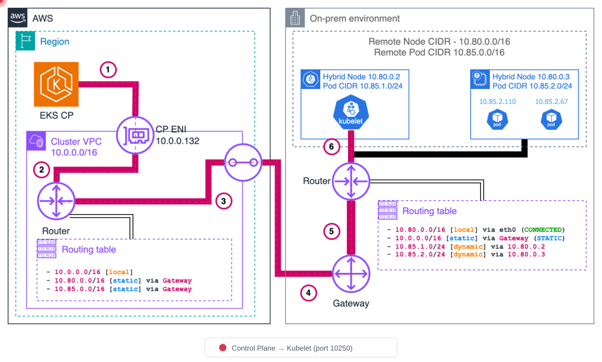

# 网络配置

< [上一节：前置条件](01-prerequisites.md) | [目录](./README.md) | [下一节：Air-Gap 设置](03-airgap-setup.md) >

> **支持的版本**：EKS 1.31+，nodeadm 0.1+ **最后更新**：February 23, 2026

本文档介绍 EKS Hybrid Nodes 所需的网络配置，包括 CIDR 要求、防火墙规则、AWS endpoint 访问、安全组配置和 DNS 设置。

## 网络架构概述

下图展示了 EKS Hybrid Nodes 的完整网络拓扑，包括 VPC 配置、Transit Gateway 路由、远程 CIDR 和防火墙规则。


### 作为网络中心的 VPC

在 EKS Hybrid Nodes 环境中，VPC 充当 hybrid node 与 control plane 之间的**网络中心**。

* **ENI 部署位置**：EKS control plane 会在 VPC subnet 中部署 ENI（Elastic Network Interface）。这些 ENI 是 control plane 与 hybrid node 之间的通信 endpoint。
* **流量路径**：control plane 与 hybrid node 之间的所有流量都会经过这些 ENI。API server 请求、kubelet 通信、webhook 调用以及所有 control plane 流量都会穿越 VPC ENI。
* **ENI IP 变更**：在 cluster 更新期间（例如版本升级），ENI 可能被删除并重新创建，从而导致其 IP 地址变更。在防火墙规则中使用 subnet CIDR 范围而非单个 IP，可为这些变更提供灵活性。

```
┌─────────────────────────────────────────────────────────────────┐
│                         AWS Cloud                                │
│  ┌──────────────────┐    ┌──────────────────────────────────┐   │
│  │  EKS Control     │    │              VPC                  │   │
│  │     Plane        │◄──►│  ┌────────┐  ┌────────┐          │   │
│  │                  │    │  │  ENI   │  │  ENI   │          │   │
│  └──────────────────┘    │  │10.0.1.x│  │10.0.2.x│          │   │
│                          │  └────┬───┘  └────┬───┘          │   │
│                          └───────┼───────────┼──────────────┘   │
└──────────────────────────────────┼───────────┼──────────────────┘
                                   │           │
                           VPN / Direct Connect
                                   │           │
┌──────────────────────────────────┼───────────┼──────────────────┐
│                          On-Premises                             │
│                    ┌─────────────┴───────────┴─────────────┐    │
│                    │         Hybrid Nodes                   │    │
│                    │   ┌─────────┐    ┌─────────┐          │    │
│                    │   │  Node   │    │  Node   │          │    │
│                    │   │ kubelet │    │ kubelet │          │    │
│                    │   └─────────┘    └─────────┘          │    │
│                    └───────────────────────────────────────┘    │
└─────────────────────────────────────────────────────────────────┘
```

## CIDR 范围要求

On-Prem node 和 Pod CIDR 必须满足以下要求：

* 必须位于 **RFC-1918 范围**内：`10.0.0.0/8`、`172.16.0.0/12`、`192.168.0.0/16`
* **不得重叠**：
  * 彼此之间（node CIDR 和 Pod CIDR）
  * EKS cluster 的 VPC CIDR
  * Kubernetes Service IPv4 CIDR

创建 EKS cluster 时需要指定 `RemoteNodeNetwork` 和 `RemotePodNetwork` 字段。

### 可路由与不可路由的 Pod 网络

| 配置 | 可路由（推荐） | 不可路由 |
| ----------------------- | --------------------------------------------------- | ----------------------------- |
| 设置 | BGP（推荐）、静态路由或自定义路由 | CNI 出站 masquerade/NAT |
| Webhook | 可在 hybrid node 上运行 | 必须仅在 cloud node 上运行 |
| Pod↔Pod 通信 | cloud↔On-Prem 直接通信 | 不可行 |
| AWS service 集成 | ALB、Prometheus 等可访问 hybrid workload | 无法访问 hybrid workload |

> **建议**：使用 Cilium BGP Control Plane 使 Pod CIDR 可路由。

***

## 必需的防火墙端口

### Cluster 通信端口

必须为 On-Prem 与 AWS 之间的通信开放以下端口：

| 端口 | 协议 | 方向 | 用途 |
| ------------- | ------------ | ------------- | ------------------------------------------------------------------------ |
| 443 | TCP | On-Prem → AWS | Kubelet 到 Kubernetes API server |
| 443 | TCP | On-Prem → AWS | Pod 到 Kubernetes API server |
| 10250 | TCP | AWS → On-Prem | API server 到 kubelet |
| Webhook 端口 | TCP | AWS → On-Prem | API server 到 webhook（仅限可路由 Pod 网络） |
| 53 | TCP/UDP | 双向 | CoreDNS（Pod CIDR ↔ Pod CIDR；如果 CoreDNS 在 cloud 中运行，则包含 VPC CIDR） |
| 应用端口 | 用户定义 | 双向 | Pod 到 Pod 的应用通信 |

### VPN 端口（使用 Site-to-Site VPN 时）

| 端口 | 协议 | 方向 | 用途 |
| ---- | -------- | ------------- | --------------------------- |
| 500 | UDP | 双向 | IKE（Internet Key Exchange） |
| 4500 | UDP | 双向 | IPSec NAT-T |

### Cilium CNI 端口

使用 Cilium 作为 CNI 时所需的额外端口：

| 端口 | 协议 | 方向 | 用途 |
| ---- | -------- | ------------- | ----------------------------------- |
| 8472 | UDP | 双向 | VXLAN overlay（默认 tunnel 模式） |
| 4240 | TCP | 双向 | 健康检查 |

> **注意**：有关 Cilium 和 Calico 的详细防火墙要求，请参阅各项目的官方文档。

### iptables 规则示例

```bash
# Allow Kubernetes API server communication
sudo iptables -A INPUT -p tcp --dport 443 -s 10.0.0.0/8 -j ACCEPT
sudo iptables -A OUTPUT -p tcp --dport 443 -d 10.0.0.0/8 -j ACCEPT

# Allow Kubelet API
sudo iptables -A INPUT -p tcp --dport 10250 -s 10.0.0.0/8 -j ACCEPT

# Allow Cilium VXLAN
sudo iptables -A INPUT -p udp --dport 8472 -j ACCEPT
sudo iptables -A OUTPUT -p udp --dport 8472 -j ACCEPT

# Allow Cilium health check
sudo iptables -A INPUT -p tcp --dport 4240 -j ACCEPT
sudo iptables -A OUTPUT -p tcp --dport 4240 -j ACCEPT

# Allow DNS
sudo iptables -A INPUT -p tcp --dport 53 -j ACCEPT
sudo iptables -A INPUT -p udp --dport 53 -j ACCEPT
sudo iptables -A OUTPUT -p tcp --dport 53 -j ACCEPT
sudo iptables -A OUTPUT -p udp --dport 53 -j ACCEPT

# Save rules
sudo iptables-save | sudo tee /etc/iptables/rules.v4
```

***

## On-Prem 出站访问要求

### 安装和升级所需的 Endpoint

在 nodeadm 安装和升级期间，On-Prem node 必须可通过 HTTPS (443) 访问以下 AWS endpoint：

| 组件 | URL | 说明 |
| ----------------------- | ------------------------------------------------------- | ------------------------------------- |
| EKS node artifact (S3) | `https://hybrid-assets.eks.amazonaws.com` | nodeadm binary 和依赖项 |
| EKS service | `https://eks.<region>.amazonaws.com` | Cluster 信息查询 |
| ECR service | `https://api.ecr.<region>.amazonaws.com` | Container image 拉取 |
| SSM binary | `https://amazon-ssm-<region>.s3.<region>.amazonaws.com` | 使用 SSM credential provider 时 |
| SSM service | `https://ssm.<region>.amazonaws.com` | 使用 SSM credential provider 时 |
| IAM Roles Anywhere | `https://rolesanywhere.<region>.amazonaws.com` | 使用 IAM RA credential provider 时 |
| OS package manager | 特定区域的 endpoint | 系统 package 安装 |

### 持续运行所需的 Endpoint

| 用途 | 源 | 目标 | 说明 |
| ------------------------- | --------- | --------------------- | --------------------------- |
| Kubelet → API server | Node CIDR | EKS cluster IP | 端口 443 |
| Pod → API server | Pod CIDR | EKS cluster IP | 端口 443 |
| SSM credential 刷新 | Node CIDR | SSM endpoint | 5 分钟心跳间隔 |
| IAM RA credential 刷新 | Node CIDR | IAM Anywhere endpoint | 定期刷新 |
| EKS Pod Identity | Node CIDR | EKS Auth endpoint | 使用 Pod Identity 时 |

### 发现 EKS Cluster 网络接口 IP

当防火墙规则需要 EKS cluster IP 时，请使用以下命令：

```bash
aws ec2 describe-network-interfaces \
  --filters "Name=vpc-id,Values=<VPC_ID>" "Name=description,Values=Amazon EKS*" \
  --query 'NetworkInterfaces[].PrivateIpAddress' \
  --output text
```

> **注意**：在 cluster 更新期间（例如版本升级），EKS 网络接口可能被删除并重新创建。使用受限的 subnet 大小可使 IP 范围可预测，从而简化防火墙配置。

***

## VPC Private Endpoint（Air-Gap / 私有连接）

当 On-Prem node 通过 VPN 或 Direct Connect 连接到 AWS 且没有 internet 访问时，必须配置 **VPC Interface Endpoint**（PrivateLink），以私密地访问 AWS service。

### 为什么需要 VPC Endpoint

标准 AWS API 调用会经过 public internet。在 air-gapped 或仅私有的环境中，不存在 internet 路径，因此无法访问 AWS service。VPC Interface Endpoint 会在 VPC 内创建带有 private IP 地址的 ENI（Elastic Network Interface），让 On-Prem node 能够通过 VPN/Direct Connect 直接访问 AWS API。

```
On-premises node
  → VPN / Direct Connect
    → VPC Interface Endpoint ENI (private IP)
      → AWS Service (EKS, ECR, STS, SSM, etc.)
```

> **要点**：Gateway endpoint（用于 S3 和 DynamoDB）只会将路由添加到 VPC route table，且**无法通过 VPN/Direct Connect 从 On-Prem network 访问**。要从 On-Prem 访问 S3，必须使用 **Interface 类型**的 S3 endpoint。

### 所需的 Interface VPC Endpoint

| Service | Endpoint Service Name | Private DNS | 用途 |
| ------------ | ------------------------------------ | ----------- | ---------------------------------------------------- |
| EKS | `com.amazonaws.<region>.eks` | 是 | Kubernetes API server 通信 |
| EKS Auth | `com.amazonaws.<region>.eks-auth` | 是 | Pod Identity 认证 |
| ECR API | `com.amazonaws.<region>.ecr.api` | 是 | Image metadata 查询 |
| ECR DKR | `com.amazonaws.<region>.ecr.dkr` | 是 | Image 拉取（Docker registry） |
| S3 | `com.amazonaws.<region>.s3` | — | Image layer、nodeadm artifact（**Interface 类型**） |
| STS | `com.amazonaws.<region>.sts` | 是 | IAM credential 交换 |
| SSM | `com.amazonaws.<region>.ssm` | 是 | 使用 SSM credential provider 时 |
| SSM Messages | `com.amazonaws.<region>.ssmmessages` | 是 | SSM Session Manager 通信 |

> **注意**：S3 Interface endpoint 不会自动支持 `private_dns_enabled`。如果需要为 S3 domain 进行 private DNS 解析，必须配置单独的 Private Hosted Zone (PHZ)。有关 `hybrid-assets.eks.amazonaws.com` private mirroring 模式，请参阅 [Air-Gap 设置 - hybrid-assets Private Mirroring](03-airgap-setup.md#hybrid-assets-private-mirroring-s3--phz-pattern)。

### 使用 Terraform 创建 VPC Endpoint

#### 安全组

```hcl
resource "aws_security_group" "vpc_endpoints" {
  name_prefix = "vpc-endpoints-"
  vpc_id      = var.vpc_id
  description = "Security group for VPC Interface Endpoints"

  ingress {
    description = "HTTPS from VPC and on-premises"
    from_port   = 443
    to_port     = 443
    protocol    = "tcp"
    cidr_blocks = [
      var.vpc_cidr,           # VPC internal traffic
      var.remote_node_cidr,   # On-premises node CIDR
      var.remote_pod_cidr     # On-premises pod CIDR
    ]
  }

  egress {
    from_port   = 0
    to_port     = 0
    protocol    = "-1"
    cidr_blocks = ["0.0.0.0/0"]
  }

  tags = {
    Name = "vpc-endpoints-sg"
  }
}
```

#### Interface VPC Endpoint

```hcl
# List of Interface endpoints to create
locals {
  interface_endpoints = {
    eks          = "com.amazonaws.${var.region}.eks"
    eks-auth     = "com.amazonaws.${var.region}.eks-auth"
    ecr-api      = "com.amazonaws.${var.region}.ecr.api"
    ecr-dkr      = "com.amazonaws.${var.region}.ecr.dkr"
    sts          = "com.amazonaws.${var.region}.sts"
    ssm          = "com.amazonaws.${var.region}.ssm"
    ssmmessages  = "com.amazonaws.${var.region}.ssmmessages"
  }
}

resource "aws_vpc_endpoint" "interface" {
  for_each = local.interface_endpoints

  vpc_id              = var.vpc_id
  service_name        = each.value
  vpc_endpoint_type   = "Interface"
  private_dns_enabled = true

  subnet_ids         = var.private_subnet_ids
  security_group_ids = [aws_security_group.vpc_endpoints.id]

  tags = {
    Name = "vpce-${each.key}"
  }
}

# S3 Interface endpoint (Interface type, not Gateway)
resource "aws_vpc_endpoint" "s3_interface" {
  vpc_id              = var.vpc_id
  service_name        = "com.amazonaws.${var.region}.s3"
  vpc_endpoint_type   = "Interface"
  private_dns_enabled = false  # S3 does not support auto Private DNS for Interface type

  subnet_ids         = var.private_subnet_ids
  security_group_ids = [aws_security_group.vpc_endpoints.id]

  tags = {
    Name = "vpce-s3-interface"
  }
}
```

### 使用 AWS CLI 创建 VPC Endpoint

```bash
# 1. Create security group for VPC endpoints
SG_ID=$(aws ec2 create-security-group \
  --group-name vpc-endpoints-sg \
  --description "Security group for VPC Interface Endpoints" \
  --vpc-id <VPC_ID> \
  --query 'GroupId' --output text)

# Allow port 443 inbound
aws ec2 authorize-security-group-ingress \
  --group-id $SG_ID \
  --ip-permissions '[
    {"IpProtocol": "tcp", "FromPort": 443, "ToPort": 443,
     "IpRanges": [
       {"CidrIp": "<VPC_CIDR>", "Description": "VPC internal"},
       {"CidrIp": "<REMOTE_NODE_CIDR>", "Description": "On-prem nodes"},
       {"CidrIp": "<REMOTE_POD_CIDR>", "Description": "On-prem pods"}
     ]}
  ]'

# 2. Create Interface VPC endpoint (EKS example)
aws ec2 create-vpc-endpoint \
  --vpc-id <VPC_ID> \
  --vpc-endpoint-type Interface \
  --service-name com.amazonaws.<REGION>.eks \
  --subnet-ids <SUBNET_ID_1> <SUBNET_ID_2> \
  --security-group-ids $SG_ID \
  --private-dns-enabled

# 3. Create remaining service endpoints
for SERVICE in eks-auth ecr.api ecr.dkr sts ssm ssmmessages; do
  echo "Creating endpoint for: $SERVICE"
  aws ec2 create-vpc-endpoint \
    --vpc-id <VPC_ID> \
    --vpc-endpoint-type Interface \
    --service-name com.amazonaws.<REGION>.$SERVICE \
    --subnet-ids <SUBNET_ID_1> <SUBNET_ID_2> \
    --security-group-ids $SG_ID \
    --private-dns-enabled
done

# 4. S3 Interface endpoint (without private-dns-enabled)
aws ec2 create-vpc-endpoint \
  --vpc-id <VPC_ID> \
  --vpc-endpoint-type Interface \
  --service-name com.amazonaws.<REGION>.s3 \
  --subnet-ids <SUBNET_ID_1> <SUBNET_ID_2> \
  --security-group-ids $SG_ID

# 5. Verify created endpoints
aws ec2 describe-vpc-endpoints \
  --filters "Name=vpc-id,Values=<VPC_ID>" \
  --query 'VpcEndpoints[].{ID:VpcEndpointId, Service:ServiceName, State:State}' \
  --output table
```

### On-Prem DNS 解析流程

VPC endpoint 上的 `private_dns_enabled` 选项仅在 VPC 内有效。要让 On-Prem node 将 AWS service domain（例如 `eks.ap-northeast-2.amazonaws.com`）解析为 VPC endpoint 的 private IP，必须通过 Route 53 Resolver Inbound Endpoint 路由 DNS 查询。

```
On-premises node
  → On-premises DNS server (conditional forwarding)
    → Route 53 Resolver Inbound Endpoint (in VPC)
      → Route 53 resolves via Private Hosted Zone / VPC DNS
        → Returns VPC Endpoint ENI private IP
          → On-premises node reaches ENI directly over VPN/DX
```

#### 在 On-Prem DNS 上配置条件转发

配置 On-Prem DNS server（例如 BIND、Windows DNS、dnsmasq），将 AWS domain 转发至 Route 53 Inbound Endpoint。

```
# BIND example (/etc/named.conf)
zone "amazonaws.com" {
    type forward;
    forward only;
    forwarders {
        10.0.1.10;    # Route 53 Inbound Endpoint IP #1
        10.0.2.10;    # Route 53 Inbound Endpoint IP #2
    };
};

zone "eks.amazonaws.com" {
    type forward;
    forward only;
    forwarders {
        10.0.1.10;
        10.0.2.10;
    };
};
```

> **注意**：有关 Route 53 Resolver Inbound Endpoint 的创建，请参阅本文档中的 [DNS 配置](02-network-configuration.md#dns-configuration) 部分。配置 VPC endpoint 后，始终使用 `nslookup eks.<region>.amazonaws.com` 验证是否返回 private IP。

***

## AWS 安全组配置

创建 cluster 时，EKS 会自动配置安全组入站规则，但不会自动创建出站规则（安全组默认允许所有出站流量）。

### 自动创建的入站规则

| 协议 | 端口 | 源 | 用途 |
| -------- | ---- | ------------------- | ------------------------------------ |
| TCP | 443 | Remote node CIDR | Kubelet 到 Kubernetes API |
| TCP | 443 | Remote Pod CIDR | Pod 到 Kubernetes API（非 NAT CNI） |

### 需要手动添加的出站规则

| 协议 | 端口 | 目标 | 用途 |
| -------- | ------------- | ------------------- | ---------------------- |
| TCP | 10250 | Remote node CIDR | API server 到 kubelet |
| TCP | Webhook 端口 | Remote Pod CIDR | API server 到 webhook |

```bash
# Example: Create a custom security group
aws ec2 create-security-group \
  --group-name hybrid-nodes-sg \
  --description "Security group for EKS Hybrid Nodes" \
  --vpc-id <VPC_ID>

# Add inbound rules
aws ec2 authorize-security-group-ingress \
  --group-id <SG_ID> \
  --ip-permissions '[
    {"IpProtocol": "tcp", "FromPort": 443, "ToPort": 443,
     "IpRanges": [{"CidrIp": "<REMOTE_NODE_CIDR>"}, {"CidrIp": "<REMOTE_POD_CIDR>"}]}
  ]'
```

> **注意**：每个安全组的默认入站规则上限为 60 条。此外，当移除 remote network 时，EKS 不会自动删除规则，必须手动清理。

***

## Pod CIDR 防火墙策略

需要为整个 Pod CIDR 范围注册防火墙规则，以实现 Pod 到 Pod 通信。

```bash
# Pod CIDR range example: 10.244.0.0/16
# Check cluster's Pod CIDR
kubectl cluster-info dump | grep -m 1 cluster-cidr

# Add firewall rules for Pod CIDR
sudo iptables -A INPUT -s 10.244.0.0/16 -j ACCEPT
sudo iptables -A OUTPUT -d 10.244.0.0/16 -j ACCEPT
sudo iptables -A FORWARD -s 10.244.0.0/16 -j ACCEPT
sudo iptables -A FORWARD -d 10.244.0.0/16 -j ACCEPT

# Add Service CIDR as well (e.g., 172.20.0.0/16)
sudo iptables -A INPUT -s 172.20.0.0/16 -j ACCEPT
sudo iptables -A OUTPUT -d 172.20.0.0/16 -j ACCEPT
```

***

## DNS 配置

### Route 53 Resolver Inbound Endpoint

创建 Inbound Endpoint，以允许 On-Prem 查询 AWS domain。

```bash
# Create Inbound Endpoint
aws route53resolver create-resolver-endpoint \
  --creator-request-id "hybrid-inbound-$(date +%s)" \
  --name "hybrid-inbound-endpoint" \
  --security-group-ids sg-0123456789abcdef0 \
  --direction INBOUND \
  --ip-addresses SubnetId=subnet-111111111,Ip=10.0.1.10 SubnetId=subnet-222222222,Ip=10.0.2.10

# Check Endpoint IPs
aws route53resolver list-resolver-endpoint-ip-addresses \
  --resolver-endpoint-id rslvr-in-xxxxxxxxxxxxx
```

### Route 53 Resolver Outbound Endpoint

创建 Outbound Endpoint 和转发规则，以允许 AWS 查询 On-Prem domain。

```bash
# Create Outbound Endpoint
aws route53resolver create-resolver-endpoint \
  --creator-request-id "hybrid-outbound-$(date +%s)" \
  --name "hybrid-outbound-endpoint" \
  --security-group-ids sg-0123456789abcdef0 \
  --direction OUTBOUND \
  --ip-addresses SubnetId=subnet-111111111 SubnetId=subnet-222222222

# Create forwarding rule (on-premises domain)
aws route53resolver create-resolver-rule \
  --creator-request-id "forward-onprem-$(date +%s)" \
  --name "forward-to-onprem" \
  --rule-type FORWARD \
  --domain-name "internal.company.io" \
  --resolver-endpoint-id rslvr-out-xxxxxxxxxxxxx \
  --target-ips "Ip=192.168.1.10,Port=53" "Ip=192.168.1.11,Port=53"

# Associate rule with VPC
aws route53resolver associate-resolver-rule \
  --resolver-rule-id rslvr-rr-xxxxxxxxxxxxx \
  --vpc-id vpc-0123456789abcdef0
```

### CoreDNS 自定义 Domain 配置

将 On-Prem domain 的 DNS 查询转发至 On-Prem DNS server。

```yaml
apiVersion: v1
kind: ConfigMap
metadata:
  name: coredns
  namespace: kube-system
data:
  Corefile: |
    .:53 {
        errors
        health {
            lameduck 5s
        }
        ready
        kubernetes cluster.local in-addr.arpa ip6.arpa {
            pods insecure
            fallthrough in-addr.arpa ip6.arpa
        }
        prometheus :9153
        forward . /etc/resolv.conf {
            max_concurrent 1000
        }
        cache 30
        loop
        reload
        loadbalance
    }
    internal.company.io:53 {
        errors
        cache 30
        forward . 192.168.1.10 192.168.1.11 {
            max_concurrent 1000
        }
    }
```

```bash
# Apply CoreDNS ConfigMap
kubectl apply -f coredns-configmap.yaml

# Restart CoreDNS
kubectl rollout restart deployment coredns -n kube-system

# Test DNS resolution
kubectl run dns-test --rm -it --image=busybox --restart=Never -- nslookup internal.company.io
```

### CoreDNS 双位置 Deployment（On-Prem + Cloud）

#### 为什么需要双位置 Deployment？

在 EKS Hybrid Nodes 环境中，如果 CoreDNS 仅在 cloud node 上运行，来自 On-Prem Pod 的 DNS 查询必须穿越 VPN/Direct Connect 链路到达 cloud 后再返回。反之，如果 CoreDNS 仅在 On-Prem node 上运行，来自 cloud Pod 的 DNS 查询必须进行反向往返。

**CoreDNS Pod 必须同时存在于两端**，以最小化 DNS 延迟，并确保即使一端发生网络中断，DNS service 仍然可用。

#### 推荐副本数

建议至少使用 **4 个副本**（2 个 cloud + 2 个 On-Prem）。在每个位置至少部署 2 个副本可确保高可用性。

#### CoreDNS Deployment Patch

使用 `topologySpreadConstraints` 和 `tolerations` 将 CoreDNS Pod 均匀分布在 cloud 和 On-Prem node 上。

```yaml
apiVersion: apps/v1
kind: Deployment
metadata:
  name: coredns
  namespace: kube-system
spec:
  replicas: 4
  template:
    spec:
      tolerations:
        - key: "eks.amazonaws.com/compute-type"
          value: "hybrid"
          effect: "NoSchedule"
      topologySpreadConstraints:
        - maxSkew: 1
          topologyKey: "eks.amazonaws.com/compute-type"
          whenUnsatisfiable: ScheduleAnyway
          labelSelector:
            matchLabels:
              k8s-app: kube-dns
```

#### kubectl patch 命令

```bash
kubectl patch deployment coredns -n kube-system --type=strategic -p '{
  "spec": {
    "replicas": 4,
    "template": {
      "spec": {
        "tolerations": [
          {
            "key": "eks.amazonaws.com/compute-type",
            "value": "hybrid",
            "effect": "NoSchedule"
          }
        ],
        "topologySpreadConstraints": [
          {
            "maxSkew": 1,
            "topologyKey": "eks.amazonaws.com/compute-type",
            "whenUnsatisfiable": "ScheduleAnyway",
            "labelSelector": {
              "matchLabels": {
                "k8s-app": "kube-dns"
              }
            }
          }
        ]
      }
    }
  }
}'
```

#### 验证部署位置

```bash
# Verify CoreDNS Pods are distributed across both node types
kubectl get pods -n kube-system -l k8s-app=kube-dns -o wide

# Check compute-type labels on nodes
kubectl get nodes -L eks.amazonaws.com/compute-type
```

> **注意**：
>
> * 使用 EKS managed CoreDNS add-on 时，可通过该 add-on 的 `configurationValues` 应用相同配置。
> * 使用 `whenUnsatisfiable: ScheduleAnyway` 可确保即使仅一端存在 node，也不会阻塞调度。这可保证在初始 cluster bootstrap 期间正常启动 CoreDNS。

***

## 流量模式

了解 AWS 与 On-Prem 之间的流量模式对于防火墙配置和故障排查至关重要。以下部分通过官方 AWS 架构图详细说明每种流量模式。

> **来源**：[AWS EKS Hybrid Nodes Traffic Flows](https://docs.aws.amazon.com/eks/latest/userguide/hybrid-nodes-concepts-traffic-flows.html)

### 模式 1：Kubelet → EKS Control Plane

Kubelet 会通过 DNS 查找向 API server endpoint 发起 HTTPS 请求。在 public access 模式下，流量经过 public internet；在 private 模式下，流量会通过 VPN/DX 到达 VPC ENI。


### 模式 2：EKS Control Plane → Kubelet

API server 从 node status object 获取 node IP。流量经由 VPC 路由，然后通过 Direct Connect 或 VPN 穿越 cloud 边界，在端口 10250 上访问 kubelet。这用于 `kubectl logs`、`kubectl exec`、`kubectl port-forward` 等操作。



### 模式 3：Pod → EKS Control Plane

Pod 通过 `kubernetes` Service (ClusterIP) 与 Kubernetes API 通信。kube-proxy 应用 DNAT，将 Service IP 转换为 control plane ENI IP，随后数据包通过 VPN/DX 路由到 VPC。

* **不使用 CNI NAT**：Pod 向 kubernetes Service IP（例如 172.16.0.1）发送流量，kube-proxy 将 DNAT 应用于 control plane ENI IP。返回流量需要通过 Pod CIDR 进行反向路由。
* **使用 CNI NAT**：CNI 会在 node 处理前应用 SNAT，从而简化返回路由（无需额外的 Pod CIDR 路由）。


### 模式 4：EKS Control Plane → Pod (Webhook)

API server 会向运行在 hybrid node 上的 webhook Pod 发起直接连接。流量通过 VPC 路由到 remote Pod CIDR，并经由 gateway 穿越边界。这**要求 Pod CIDR 可路由**。


> **重要**：如果 On-Prem Pod CIDR 不可路由，您**必须在 cloud node 上运行所有 webhook**。请参阅下文的 [Webhook 配置](02-network-configuration.md#webhook-configuration)。

### 模式 5：Hybrid Node 上的 Pod ↔ Pod

不同 hybrid node 上的 Pod 使用 [VXLAN encapsulation](../networking/cilium/03-networking.md#vxlan-technology-deep-dive)（或类似的 overlay protocol，例如 Geneve、IP-in-IP）进行通信。CNI 会使用源/目标 node IP 的外层 header 封装原始 Pod 到 Pod 数据包。接收 node 的 CNI 会解封装并将其传送到目标 Pod。


#### VXLAN 封装详情

VXLAN（Virtual Extensible LAN）将 L2 frame 封装到 L3 packet 中，以创建 overlay network。以下说明 hybrid node 之间的 Pod 通信过程中数据包结构如何转换。

**原始数据包（封装前）**

```
┌────────────────────────────────────────────────┐
│  Pod-A IP (src) → Pod-B IP (dst) │   Payload   │
│    10.85.0.10       10.85.1.20   │   (data)    │
└────────────────────────────────────────────────┘
```

**VXLAN 封装后**

```
┌──────────────────────────────────────────────────────────────────────────────┐
│ Outer IP Header │ UDP Header │ VXLAN Header │      Original Packet          │
│ Node-A → Node-B │ Port 8472  │    (VNI)     │ Pod-A IP → Pod-B IP │ Payload │
│ 10.80.1.10      │            │              │ 10.85.0.10  10.85.1.20        │
│   → 10.80.1.11  │            │              │                               │
└──────────────────────────────────────────────────────────────────────────────┘
```

**封装过程（源 Node）**

1. Pod-A 向 Pod-B 发送数据包
2. 源 node 的 CNI (Cilium) 查找目标 Pod IP 并识别目标 node
3. CNI 使用 VXLAN header 和外层 IP header 封装原始数据包
4. 外层 header 使用 node IP 作为源/目标
5. 封装后的数据包通过 UDP 端口 8472 发送

**解封装过程（目标 Node）**

1. 目标 node 在 UDP 端口 8472 上接收 VXLAN 数据包
2. CNI 移除 VXLAN header 和外层 IP header
3. 将原始数据包传送到目标 Pod

**关键组件**

| 组件 | 描述 |
| ------------------------------ | ---------------------------------------------------------------------------- |
| VNI（VXLAN Network Identifier） | 用于隔离 Pod network 流量的 24-bit identifier（默认：自动分配） |
| UDP 端口 | Cilium 默认值：8472，Standard VXLAN：4789 |
| MTU | 必须考虑 VXLAN 开销（50 bytes），例如 1500 → 1450 |

> **注意**：除 VXLAN 外，Cilium 还支持 Geneve 和 IP-in-IP 等其他 tunnel protocol。使用 `--tunnel` 选项选择 tunnel 模式。

### 模式 6：Cloud Pod ↔ Hybrid Pod（East-West）

VPC Pod（使用 VPC CNI）直接向 hybrid Pod 发送流量；VPC 路由将流量定向至 On-Prem gateway。数据包穿越边界并到达 hybrid node。这**要求 Pod CIDR 可路由**以及正确的 VPC route table entry。


### 流量模式摘要

| # | 流量 | 方向 | 端口 | 要求 |
| - | ------------------------ | ---------------- | --------- | ---------------------------------- |
| 1 | Kubelet → API Server | On-Prem → AWS | TCP 443 | VPN/DX 或 internet |
| 2 | API Server → Kubelet | AWS → On-Prem | TCP 10250 | SG 出站规则 |
| 3 | Pod → API Server | On-Prem → AWS | TCP 443 | kube-proxy DNAT |
| 4 | API Server → Webhook Pod | AWS → On-Prem | TCP 8443+ | **可路由 Pod CIDR** |
| 5 | Hybrid Pod ↔ Hybrid Pod | On-Prem 内部 | UDP 8472 | Cilium VXLAN |
| 6 | Cloud Pod ↔ Hybrid Pod | AWS ↔ On-Prem | VPC 路由 | **可路由 Pod CIDR** + VPC 路由 |

### kube-proxy iptables 链结构

kube-proxy 使用 iptables 规则将 Kubernetes Service 流量路由到实际 Pod。同样的 3 层链结构也适用于 hybrid node。

```
KUBE-SERVICES (entry point)
  └─→ KUBE-SVC-xxxx (per-service chain, load balancing)
        └─→ KUBE-SEP-xxxx (per-endpoint chain, DNAT to pod IP)
```

**链的角色**

| 链 | 角色 | 示例 |
| ----------------- | ---------------------------------------------------------- | ------------------------------------ |
| **KUBE-SERVICES** | 将目标 IP:Port 与所有 ClusterIP Service 匹配 | `172.20.0.1:443` → `KUBE-SVC-NPX...` |
| **KUBE-SVC-xxxx** | 使用基于概率的负载均衡选择 endpoint | 3 个 Pod → 每个 33% 概率 |
| **KUBE-SEP-xxxx** | 对特定 Pod IP:Port 执行 DNAT | DNAT 到 `10.85.0.15:8080` |

**实际 iptables 规则示例**

```bash
# KUBE-SERVICES chain (nat table)
-A KUBE-SERVICES -d 172.20.0.10/32 -p tcp -m tcp --dport 80 -j KUBE-SVC-XXXXXX

# KUBE-SVC chain (load balancing)
-A KUBE-SVC-XXXXXX -m statistic --mode random --probability 0.33333 -j KUBE-SEP-AAAAAA
-A KUBE-SVC-XXXXXX -m statistic --mode random --probability 0.50000 -j KUBE-SEP-BBBBBB
-A KUBE-SVC-XXXXXX -j KUBE-SEP-CCCCCC

# KUBE-SEP chain (DNAT)
-A KUBE-SEP-AAAAAA -p tcp -j DNAT --to-destination 10.85.0.15:8080
-A KUBE-SEP-BBBBBB -p tcp -j DNAT --to-destination 10.85.0.16:8080
-A KUBE-SEP-CCCCCC -p tcp -j DNAT --to-destination 10.85.1.20:8080
```

> **Hybrid 环境影响**：在以上示例中，如果 `10.85.1.20` 是不同 hybrid node 上的 Pod，则 DNAT 后的数据包将被 VXLAN 封装并发送至该 node。kube-proxy 会将 Service 流量转换为 Pod IP，而 CNI 会处理实际网络路由。

### kubelet Endpoint

kubelet 在每个 node 上运行，并公开用于 API server 通信的 REST endpoint。

**kubelet API 端口和 Endpoint**

| 端口 | Endpoint | 用途 |
| ----- | ------------------------------------- | ------------------------------------------------ |
| 10250 | `/pods` | 列出 node 上运行的 Pod |
| 10250 | `/exec/{namespace}/{pod}/{container}` | 在 container 中执行命令（`kubectl exec`） |
| 10250 | `/logs/{namespace}/{pod}/{container}` | 流式传输 container log（`kubectl logs`） |
| 10250 | `/metrics` | 公开 kubelet metric（供 Prometheus 抓取） |
| 10250 | `/healthz` | kubelet 健康检查 |

**Node 注册和地址报告**

当 kubelet 向 cluster 注册 node 时，会在 `Node.status.addresses` 中报告地址信息：

```yaml
status:
  addresses:
  - address: 10.80.1.10        # Actual on-premises IP
    type: InternalIP
  - address: hybrid-node-001   # Node hostname
    type: Hostname
```

* **InternalIP**：node 的实际 On-Prem IP 地址。API server 使用此地址连接到 kubelet。
* **Hostname**：node 的 hostname。

> **防火墙规则要求**：由于 API server 使用 `InternalIP` 连接 kubelet，**必须从 AWS → On-Prem 开放 TCP 端口 10250**。如果此连接被阻止，`kubectl exec`、`kubectl logs` 和 `kubectl port-forward` 等命令将失败。

***

## 可路由 Pod CIDR 配置

使 On-Prem Pod CIDR 可路由对于 webhook、East-West 流量和 AWS service 集成（ALB、Prometheus 等）至关重要。


### 选项 1：BGP（推荐）

CNI 充当 virtual router，并将每个 node 的 Pod CIDR 路由传播到本地 On-Prem router。这是最动态且最易维护的方法。


#### Cilium BGP Control Plane 配置

```yaml
apiVersion: cilium.io/v2alpha1
kind: CiliumBGPClusterConfig
metadata:
  name: hybrid-bgp-config
spec:
  bgpInstances:
  - name: hybrid-instance
    localASN: 65001
    peers:
    - name: on-prem-router
      peerASN: 65000
      peerAddress: 10.80.0.1
      peerConfigRef:
        name: on-prem-peer
---
apiVersion: cilium.io/v2alpha1
kind: CiliumBGPPeerConfig
metadata:
  name: on-prem-peer
spec:
  families:
  - afi: ipv4
    safi: unicast
  gracefulRestart:
    enabled: true
---
apiVersion: cilium.io/v2alpha1
kind: CiliumBGPAdvertisement
metadata:
  name: pod-cidr-advert
spec:
  advertisements:
  - advertisementType: PodCIDR
  - advertisementType: Service
    service:
      addresses:
      - ClusterIP
```

#### 了解 ASN（Autonomous System Number）

在上面的 Cilium BGP 配置中，`localASN` 和 `peerASN` 是**Autonomous System Number**——分配给每个 BGP participant 的唯一 identifier。每个 BGP speaker（router、switch，或者本例中每个 node 上的 Cilium）都必须有一个 ASN，且其连接的 peer 也必须有一个 ASN。

**Private ASN 与 Public ASN 范围**

| 范围 | 类型 | 使用场景 |
| --------------------------- | -------------- | ------------------------------------------------------------------------------------------- |
| **64512 – 65534** | 16-bit Private | 内部 network、data center、lab 环境。**请将此范围用于 EKS Hybrid Nodes。** |
| **4200000000 – 4294967294** | 32-bit Private | 需要许多唯一 ASN 的大规模内部 deployment |
| 1 – 64511 | 16-bit Public | 向 RIR（ARIN、RIPE、APNIC）注册的 internet-facing network |

> **对于 EKS Hybrid Nodes**：始终使用 **private ASN 范围**（64512–65534）。不需要 public ASN——此处的 BGP 仅用于 Cilium node 与 On-Prem router 之间的内部 network。

**如何选择 ASN 值**

* **`localASN`**（例如 `65001`）：分配给 hybrid node 上运行的 Cilium 的 ASN。同一 cluster 中的所有 Cilium node 通常共享一个 ASN。
* **`peerASN`**（例如 `65000`）：Cilium 建立 peer 的 On-Prem router 的 ASN。请检查 router 的 BGP 配置以获取此值。

如果环境中目前未配置 BGP，只需从 private 范围选择两个不同的数字（例如 router 使用 `65000`，Cilium 使用 `65001`）。如果 network team 已在内部使用 BGP，请与他们协调以避免 ASN 冲突。

**On-Prem Router BGP 配置示例**

以下示例说明如何配置 BGP peering 的 **router 端**，以匹配上面的 Cilium 配置。在每个示例中，router 使用 ASN `65000`，并与位于 `10.80.1.10`（ASN `65001`）的 Cilium node 建立 peer。

**Cisco IOS / IOS-XE**

```
router bgp 65000
 neighbor 10.80.1.10 remote-as 65001
 neighbor 10.80.1.10 description "EKS Hybrid Node - Cilium BGP"
 !
 address-family ipv4 unicast
  neighbor 10.80.1.10 activate
  neighbor 10.80.1.10 soft-reconfiguration inbound
 exit-address-family
```

**Cisco NX-OS (Nexus)**

```
router bgp 65000
  address-family ipv4 unicast
  neighbor 10.80.1.10
    remote-as 65001
    description EKS-Hybrid-Cilium
    address-family ipv4 unicast
      soft-reconfiguration inbound
```

**Juniper Junos (MX / QFX / SRX)**

```
set protocols bgp group eks-hybrid type external
set protocols bgp group eks-hybrid peer-as 65001
set protocols bgp group eks-hybrid neighbor 10.80.1.10 description "EKS Hybrid Node"
set protocols bgp group eks-hybrid family inet unicast
set routing-options autonomous-system 65000
```

**Arista EOS**

```
router bgp 65000
   neighbor 10.80.1.10 remote-as 65001
   neighbor 10.80.1.10 description EKS-Hybrid-Cilium
   !
   address-family ipv4
      neighbor 10.80.1.10 activate
```

**MikroTik RouterOS**

```
/routing bgp connection
add name=eks-hybrid remote.address=10.80.1.10 remote.as=65001 \
    local.role=ebgp as=65000 address-families=ip
```

**FRRouting (FRR) — Software Router (Linux)**

FRRouting 常用作 Linux server 和 VM 上的 software BGP router：

```
router bgp 65000
 neighbor 10.80.1.10 remote-as 65001
 neighbor 10.80.1.10 description EKS-Hybrid-Cilium
 !
 address-family ipv4 unicast
  neighbor 10.80.1.10 activate
 exit-address-family
```

**AWS Transit Gateway (TGW)**

将 AWS Transit Gateway 与 Site-to-Site VPN 一起使用时，会在创建 TGW 时配置 TGW 端 ASN：

```bash
# TGW creation with custom ASN
aws ec2 create-transit-gateway \
  --options AmazonSideAsn=65000

# The VPN tunnel automatically establishes BGP with the TGW ASN
# On-premises router (or Cilium) uses its own ASN to peer with TGW
```

> **注意**：AWS TGW 默认 ASN 为 `64512`。如果 Cilium node 使用 `65001`，则 Cilium 配置中的 TGW（或 VGW）peer ASN 应与 TGW 的 ASN 匹配。

**多个 Hybrid Node**

当有多个 hybrid node 时，每个 node 都运行自己的 Cilium BGP speaker，并使用**相同的 `localASN`**。On-Prem router 会分别与每个 node 建立 peer：

```
# Router config — peer with each hybrid node
router bgp 65000
 neighbor 10.80.1.10 remote-as 65001   ! hybrid-node-001
 neighbor 10.80.1.11 remote-as 65001   ! hybrid-node-002
 neighbor 10.80.1.12 remote-as 65001   ! hybrid-node-003
```

每个 node 都会公布自己的 Pod CIDR slice（例如 node-001 公布 `10.85.0.0/25`，node-002 公布 `10.85.0.128/25`），因此 router 会为所有 Pod CIDR 构建完整的 route table。

#### 验证 BGP Peering

```bash
cilium bgp peers
cilium bgp routes
```

Hybrid node 应显示 Session State `established`。

### 选项 2：静态路由

使用 Pod CIDR 进行手动 router 配置。最简单，但容易出错，并且在 node 变更时需要手动更新。


#### 了解 Cluster-Pool IPAM 分配

在 Cilium 的 `cluster-pool` IPAM 模式中，整个 Pod CIDR pool 会被划分为每个 node 固定大小的 block。以下两个关键参数在 [04-node-bootstrap.md](04-node-bootstrap.md) 的 Cilium values 中配置：

| 参数 | 示例值 | 描述 |
| ---------------------------- | -------------- | ---------------------------------------------- |
| `clusterPoolIPv4PodCIDRList` | `10.85.0.0/16` | 整个 Pod CIDR pool |
| `clusterPoolIPv4MaskSize` | `25` | 分配给每个 node 的 subnet 大小（/25 = 128 IP） |

例如，pool 为 `10.85.0.0/16` 且 mask size 为 `/25` 时，最多可为 **512 个 node** 各分配 128 个 Pod IP。Cilium Operator 按 node 注册顺序分配 block：

| Node | 分配的 PodCIDR | 可用 Pod IP |
| --------------- | ----------------- | ----------------------------- |
| hybrid-node-001 | `10.85.0.0/25` | `10.85.0.1` – `10.85.0.126` |
| hybrid-node-002 | `10.85.0.128/25` | `10.85.0.129` – `10.85.0.254` |
| hybrid-node-003 | `10.85.1.0/25` | `10.85.1.1` – `10.85.1.126` |

> **重要**：此分配信息会记录在 **CiliumNode CR** 中。它可能与 Kubernetes Node object 的 `spec.podCIDR` 不同，因此配置静态路由时始终应参考 CiliumNode CR。

#### 查询每个 Node 的 PodCIDR

要配置静态路由，需要识别每个 node 分配的 PodCIDR 和 node IP（next hop）。查询方法因 CNI 而异：

**Cilium** — `CiliumNode` CR 的 `spec.ipam.podCIDRs` 是权威来源：

```bash
kubectl get ciliumnodes -o custom-columns='\
NAME:.metadata.name,\
NODE_IP:.spec.addresses[0].ip,\
POD_CIDR:.spec.ipam.podCIDRs[0]'
```

```
NAME                NODE_IP       POD_CIDR
hybrid-node-001     10.80.1.10    10.85.0.0/25
hybrid-node-002     10.80.1.11    10.85.0.128/25
hybrid-node-003     10.80.1.12    10.85.1.0/25
```

> 有关 CiliumNode CR 结构、scripting 用法和更多详情，请参阅 [Cilium IPAM — 通过 CiliumNode CR 查询每个 Node 的 PodCIDR](../networking/cilium/04-ipam-policy.md#querying-per-node-podcidrs-via-ciliumnode-cr)。

**Calico** — `BlockAffinity` CR 会跟踪每个 node 的 CIDR block：

```bash
kubectl get blockaffinities -o custom-columns='\
NAME:.metadata.name,\
CIDR:.spec.cidr,\
NODE:.spec.node'
```

> **⚠ 已弃用**：EKS Hybrid Nodes 不再官方支持 Calico。新 deployment 请使用 Cilium。有关详细的 BlockAffinity 查询，请参阅 [Calico 高级主题 — 通过 BlockAffinity 查询每个 Node 的 PodCIDR](../networking/calico/07-advanced-topics.md#querying-per-node-podcidrs-via-blockaffinity)。

#### 配置静态路由

根据 CiliumNode（或 Calico BlockAffinity）CR 中的信息，将静态路由添加到 router。通用模式为：

```
Destination = Node's PodCIDR
Next Hop    = Node's InternalIP
```

**Linux（ip route）**

```bash
# Add routes for each node's pod CIDR
ip route add 10.85.0.0/25 via 10.80.1.10    # hybrid-node-001
ip route add 10.85.0.128/25 via 10.80.1.11  # hybrid-node-002
ip route add 10.85.1.0/25 via 10.80.1.12    # hybrid-node-003
```

要使其在重启后持久化：

```bash
# /etc/network/interfaces.d/hybrid-routes (Debian/Ubuntu)
up ip route add 10.85.0.0/25 via 10.80.1.10
up ip route add 10.85.0.128/25 via 10.80.1.11
up ip route add 10.85.1.0/25 via 10.80.1.12

# Or for NetworkManager (RHEL/Rocky)
# /etc/NetworkManager/dispatcher.d/99-hybrid-routes
```

**Cisco IOS / IOS-XE**

```
ip route 10.85.0.0 255.255.255.128 10.80.1.10 name hybrid-node-001-pods
ip route 10.85.0.128 255.255.255.128 10.80.1.11 name hybrid-node-002-pods
ip route 10.85.1.0 255.255.255.128 10.80.1.12 name hybrid-node-003-pods
```

**FRRouting (FRR)**

```
ip route 10.85.0.0/25 10.80.1.10
ip route 10.85.0.128/25 10.80.1.11
ip route 10.85.1.0/25 10.80.1.12
```

**AWS VPC Route Table**

当需要从通过 VPN/Direct Connect 连接的 AWS VPC 访问 Pod 时，请使用 aggregate CIDR：

```bash
# Add VPC route with aggregate CIDR (VPN Gateway or TGW as next hop)
aws ec2 create-route \
  --route-table-id rtb-0123456789abcdef0 \
  --destination-cidr-block 10.85.0.0/16 \
  --gateway-id vgw-0123456789abcdef0
```

```hcl
# Terraform
resource "aws_route" "hybrid_pod_cidr" {
  route_table_id         = aws_route_table.main.id
  destination_cidr_block = "10.85.0.0/16"
  gateway_id             = aws_vpn_gateway.main.id
}
```

#### 自动化与 BGP 对比

从 CiliumNode CR 自动生成 `ip route` 命令的脚本示例：

```bash
#!/bin/bash
# generate-static-routes.sh — Generate static route commands from CiliumNode CRs
kubectl get ciliumnodes -o json | jq -r \
  '.items[] | "ip route add \(.spec.ipam.podCIDRs[0]) via \(.spec.addresses[0].ip)"'
```

示例输出：

```
ip route add 10.85.0.0/25 via 10.80.1.10
ip route add 10.85.0.128/25 via 10.80.1.11
ip route add 10.85.1.0/25 via 10.80.1.12
```

**静态路由与 BGP 对比**

| 方面 | 静态路由 | BGP（选项 1） |
| ------------------------ | ------------------------------------------ | ----------------------------------- |
| 添加 node | 需要手动向 router 添加路由 | 自动传播路由 |
| 移除 node | 需要手动从 router 删除路由 | 自动撤销路由 |
| Node IP 变更 | 必须手动更新所有路由 | 自动传播更新 |
| 故障检测 | 无（保留过期路由） | 通过 BGP keepalive 自动检测 |
| 配置复杂度 | 低 | 中等（需要 BGP peering 设置） |
| 可扩展性 | 适用于 1–5 个 node | 可扩展到数十/数百个 node |

> **建议**：
>
> * **PoC / 小型环境**（1–5 个 node）：静态路由可快速开始
> * **生产环境 / 5+ 个 node**：使用 [BGP（选项 1）](02-network-configuration.md#option-1-bgp-recommended)。它会自动响应 node 变更，并显著降低运维开销
> * **因策略不允许使用 BGP 的环境**：使用上述自动化脚本配合静态路由来管理路由变更

### 选项 3：ARP Proxying

Node 会响应托管 Pod IP 的 ARP 请求。需要与本地 router 具有 Layer 2 网络邻近性。Cilium 内置支持 proxy ARP。不需要 router BGP 或静态路由配置，但 Pod CIDR 不得与其他 network 重叠。


***

## Network Policy

Network policy 可用于控制 hybrid node 环境中的 Pod 到 Pod 流量。使用 Cilium CNI 时，同时支持标准 Kubernetes NetworkPolicy 和扩展的 CiliumNetworkPolicy。

### Kubernetes NetworkPolicy

标准 Kubernetes NetworkPolicy 提供基本的 L3/L4 流量过滤。

```yaml
apiVersion: networking.k8s.io/v1
kind: NetworkPolicy
metadata:
  name: allow-frontend-to-backend
  namespace: bookinfo
spec:
  podSelector:
    matchLabels:
      app: reviews
  policyTypes:
  - Ingress
  ingress:
  - from:
    - podSelector:
        matchLabels:
          app: productpage
    ports:
    - protocol: TCP
      port: 9080
```

此 policy 仅允许 `bookinfo` namespace 中带有 `app: productpage` label 的 Pod 访问 `app: reviews` Pod 的端口 9080。

### CiliumNetworkPolicy

CiliumNetworkPolicy 在 Kubernetes NetworkPolicy 的基础上扩展了 L7 filtering、DNS-aware policy 和 identity-based matching。

```yaml
apiVersion: cilium.io/v2
kind: CiliumNetworkPolicy
metadata:
  name: allow-frontend-to-backend
  namespace: bookinfo
spec:
  endpointSelector:
    matchLabels:
      app: reviews
  ingress:
  - fromEndpoints:
    - matchLabels:
        app: productpage
    toPorts:
    - ports:
      - port: "9080"
        protocol: TCP
```

#### CiliumNetworkPolicy 高级功能

**L7 HTTP Filtering**

```yaml
apiVersion: cilium.io/v2
kind: CiliumNetworkPolicy
metadata:
  name: l7-rule
  namespace: bookinfo
spec:
  endpointSelector:
    matchLabels:
      app: reviews
  ingress:
  - fromEndpoints:
    - matchLabels:
        app: productpage
    toPorts:
    - ports:
      - port: "9080"
        protocol: TCP
      rules:
        http:
        - method: "GET"
          path: "/api/v1/.*"
```

**基于 DNS 的 Egress Policy**

```yaml
apiVersion: cilium.io/v2
kind: CiliumNetworkPolicy
metadata:
  name: allow-external-api
  namespace: bookinfo
spec:
  endpointSelector:
    matchLabels:
      app: productpage
  egress:
  - toFQDNs:
    - matchName: "api.example.com"
    toPorts:
    - ports:
      - port: "443"
        protocol: TCP
```

### Hybrid 环境的 Network Policy 注意事项

| 注意事项 | 描述 |
| -------------------------- | ---------------------------------------------------------------------------------------------------------------------------------- |
| **默认行为** | 没有 network policy 时，允许所有流量。一旦应用 NetworkPolicy，则仅显式允许的流量可以通过。 |
| **跨边界流量** | policy 必须考虑 cloud node 上的 Pod 与 hybrid node 上的 Pod 之间的通信。 |
| **CNI 要求** | 将 Cilium 配置为 CNI 时，两种 policy 类型均可用。 |
| **Policy 范围** | CiliumNetworkPolicy 仅应用于其 namespace。对于 cluster-wide policy，请使用 CiliumClusterwideNetworkPolicy。 |

> **建议**：在 hybrid 环境中，定义显式 network policy 以防止意外的跨边界流量。应使用严格的 Ingress/Egress policy 保护敏感 workload。

***

## Webhook 配置

Webhook 被 Kubernetes application 和 open source project（AWS Load Balancer Controller、CloudWatch Observability Agent）用于 mutating 和 validation 功能。

### 使用可路由 Pod 网络

如果 On-Prem Pod CIDR 可路由（通过 BGP、静态路由或 ARP proxy），webhook 可以在 hybrid node 上运行。

### 使用不可路由 Pod 网络

如果 On-Prem Pod CIDR**不可路由**，请使用 node affinity 在 **cloud node 上运行所有 webhook**：

```yaml
affinity:
  nodeAffinity:
    requiredDuringSchedulingIgnoredDuringExecution:
      nodeSelectorTerms:
      - matchExpressions:
        - key: eks.amazonaws.com/compute-type
          operator: NotIn
          values:
          - hybrid
```

### 使用 Webhook 的 Add-on

以下 add-on 需要考虑 webhook 部署位置：

| Add-on | Webhook 部署位置（不可路由 Pod CIDR） |
| ------------------------------ | --------------------------------------- |
| AWS Load Balancer Controller | 仅 cloud node |
| CloudWatch Observability Agent | 仅 cloud node |
| ADOT (OpenTelemetry) | 仅 cloud node |
| cert-manager | 仅 cloud node |
| Kubernetes Metrics Server | 需要可路由 Pod CIDR |

***

< [上一节：前置条件](01-prerequisites.md) | [目录](./README.md) | [下一节：Air-Gap 设置](03-airgap-setup.md) >
