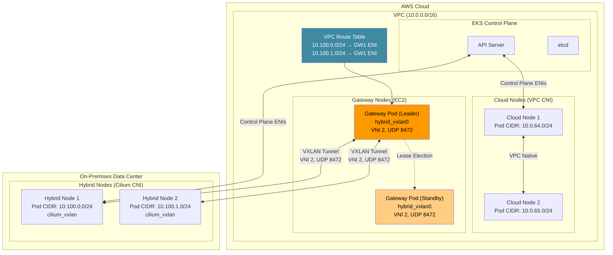
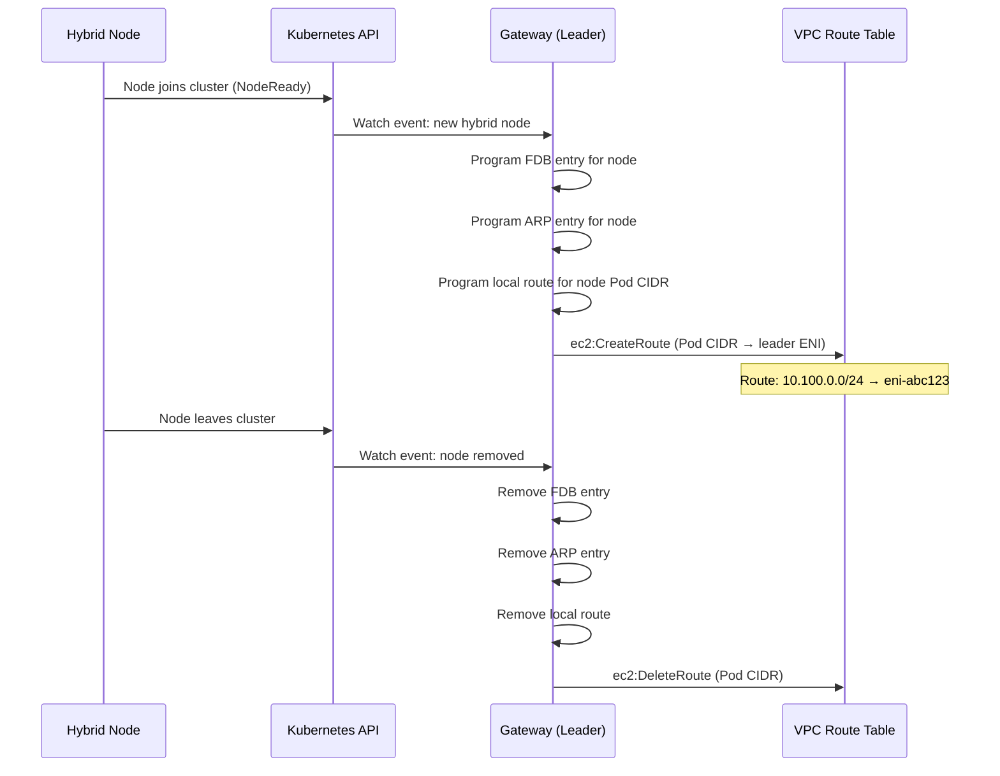
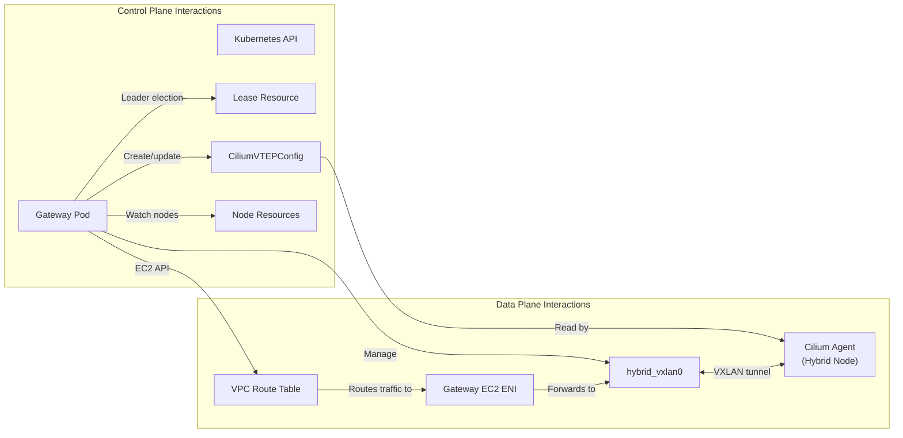
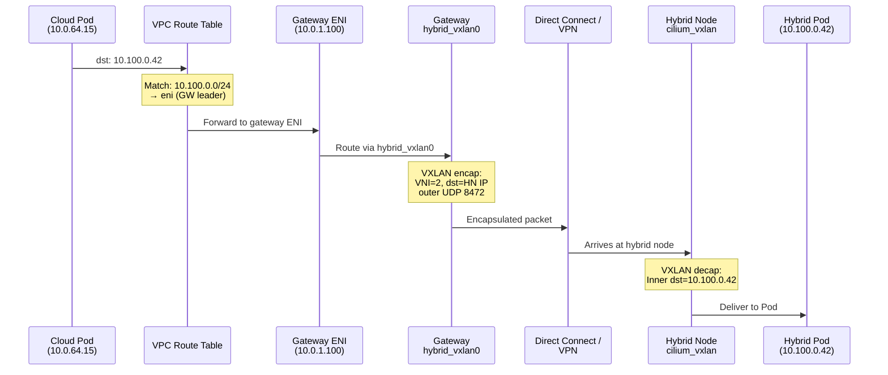
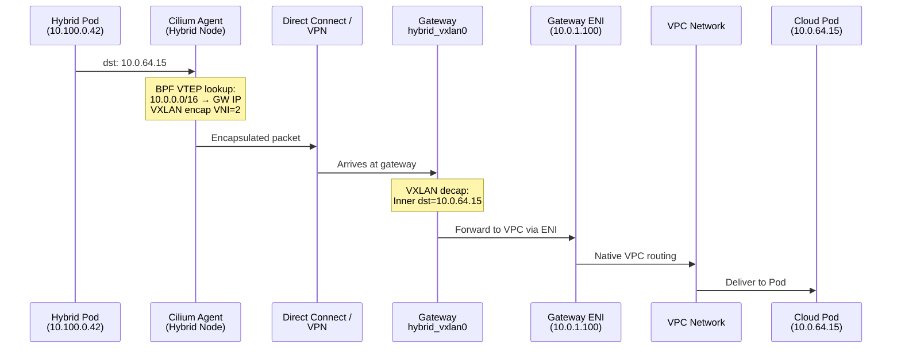
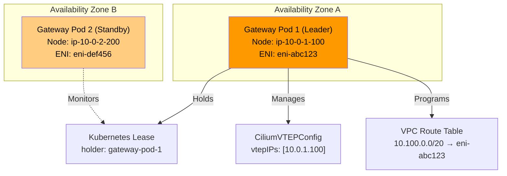
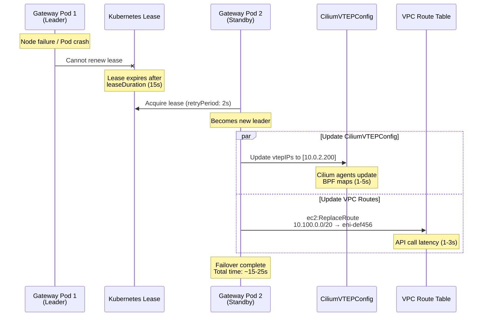

# EKS Hybrid Nodes Gateway

< [上一节：Bare Metal OS Setup](./09-bare-metal-os-setup.md) | [目录](./README.md) >

> **支持的版本**: EKS 1.31+
> **最后更新**: June 28, 2026

---

## 概述

EKS Hybrid Nodes Gateway 是一个开源网络组件，可自动化连接 Amazon VPC 与在本地或边缘环境中的 Hybrid Nodes 上运行的 Kubernetes Pod。该 gateway 于 2026 年 4 月 21 日宣布正式可用（Generally Available），它消除了以往为了在云端与本地工作负载之间启用双向 Pod 级通信而需要的手动路由管理、BGP 配置或复杂 overlay 网络设置。

gateway 通过在 VPC 中的专用 EC2 gateway 实例与本地由 Cilium 管理的 Hybrid Nodes 之间建立 VXLAN tunnel 来工作。它会自动配置 VPC route table、管理 forwarding database (FDB) 条目，并配置 Cilium VTEP (VXLAN Tunnel Endpoint) 集成，使 VPC 中的 Pod 可以直接与 Hybrid Nodes 上的 Pod 通信，反之亦然，且无需任何手动干预。

**主要特性：**

- **开源**：完整代码可在 [github.com/aws/eks-hybrid-nodes-gateway](https://github.com/aws/eks-hybrid-nodes-gateway) 获取
- **无额外收费**：gateway 软件本身免费；你只需为运行 gateway 的 EC2 实例付费
- **自动化路由管理**：当 Hybrid Nodes 加入或离开集群时，VPC route table 会自动编程
- **高可用**：支持带有基于 lease 的 leader election 的 2 副本 Deployment，用于故障转移
- **Cilium 集成**：利用 Cilium 的 VTEP 功能，通过 VXLAN tunnel 实现跨环境的透明 Pod-to-Pod 路由

### 学习目标

完成本文档后，你将能够：

1. **解释 EKS Hybrid Nodes Gateway 的架构**，包括 VXLAN tunneling、leader election 和 VPC route management
2. **使用 Helm 部署和配置** gateway，包括 IAM roles、security groups 和 Cilium VTEP 集成
3. **跟踪 VPC Pod 与 Hybrid Node Pod 之间**两个方向的流量路径
4. **通过多副本 gateway 部署实现高可用**，并理解故障转移行为
5. **运维和排查** gateway 部署，包括监控、扩缩容和常见故障场景
6. **比较 Hybrid Nodes networking 的不同方法**，并决定何时使用 gateway、何时使用手动路由
7. **应用生产环境最佳实践**，涵盖安全、性能和成本优化

### 问题：混合环境中的手动 Pod 路由

在 gateway 可用之前，在 VPC 与 Hybrid Nodes 之间启用 Pod 级通信需要大量手动工作：

```
Before Gateway (Manual Approach):
=================================

1. Configure BGP peering between on-prem routers and VPC (or use static routes)
2. Manually manage VPC route table entries for every hybrid Pod CIDR
3. Set up and maintain VPN tunnels or Direct Connect with proper route propagation
4. Handle route updates when nodes join/leave the cluster
5. Troubleshoot routing asymmetries and MTU issues across multiple hops
6. Maintain custom scripts or controllers to keep routes in sync

After Gateway (Automated Approach):
====================================

1. Deploy gateway via Helm chart
2. Gateway automatically:
   - Creates VXLAN tunnels to hybrid nodes
   - Programs VPC route table entries
   - Configures Cilium VTEP for transparent routing
   - Handles failover via leader election
   - Updates routes as nodes come and go
```

gateway 将原本复杂、容易出错、需要多个团队协作的网络挑战，转变为一次 Helm 安装加少量配置值即可完成的流程。

---

## 架构深度解析

### 高层架构

EKS Hybrid Nodes Gateway 位于 VPC 与本地网络之间的边界，作为基于 VXLAN 的 Pod 流量桥接器。下图展示了整体架构：



### VXLAN Tunnel 机制

gateway 使用 VXLAN (Virtual Extensible LAN) 在 VPC 与本地环境之间封装 Pod 流量。下面说明 tunnel 如何建立和维护：

#### Gateway 侧 VXLAN Interface

当 gateway pod 在 EC2 实例上启动时，它会使用以下参数创建 `hybrid_vxlan0` network interface：

| 参数 | 值 | 说明 |
|-----------|-------|-------------|
| **Interface name** | `hybrid_vxlan0` | gateway 上的 VXLAN tunnel interface |
| **VNI (VXLAN Network Identifier)** | 2 | 必须与 CiliumVTEPConfig 中配置的 VNI 匹配 |
| **UDP port** | 8472 | 标准 Linux VXLAN 端口（不同于 IANA 4789） |
| **Local IP** | Gateway EC2 instance private IP | VXLAN 封装包的源 IP |
| **Learning** | Disabled | FDB 条目由 gateway 静态编程 |

gateway 使用等价于以下命令的 netlink 操作创建此 interface：

```bash
# Conceptual equivalent of what the gateway does programmatically
ip link add hybrid_vxlan0 type vxlan \
    id 2 \
    local <gateway-private-ip> \
    dstport 8472 \
    nolearning

ip link set hybrid_vxlan0 up
```

#### FDB、ARP 和 Route 编程

对于每个加入集群的 Hybrid Node，gateway 会编程三类条目：

```
Per Hybrid Node, the gateway programs:
=======================================

1. FDB (Forwarding Database) Entry:
   bridge fdb append <hybrid-node-vxlan-mac> dev hybrid_vxlan0 dst <hybrid-node-ip>
   → Tells the VXLAN interface where to send encapsulated frames for this node

2. ARP Entry:
   ip neigh add <hybrid-node-vxlan-ip> lladdr <hybrid-node-vxlan-mac> dev hybrid_vxlan0
   → Pre-populates ARP so the gateway can immediately forward packets without ARP discovery

3. Route Entry:
   ip route add <hybrid-node-pod-cidr> via <hybrid-node-vxlan-ip> dev hybrid_vxlan0
   → Directs Pod traffic for this node's CIDR through the VXLAN tunnel
```

这种静态编程方法（相对于动态 FDB learning）可确保确定性的转发行为，并避免 VXLAN overlay 上出现 broadcast storms 或 unknown unicast flooding。

#### Hybrid Node 侧（Cilium VTEP）

在 Hybrid Node 侧，Cilium 的 VTEP (VXLAN Tunnel Endpoint) 功能负责 tunnel 终止。gateway 通过 `CiliumVTEPConfig` custom resource 将自己注册为 remote VTEP。这会告知每个 Hybrid Node 上的 Cilium agent：

1. 目标为 VPC CIDR 的流量应进行 VXLAN 封装
2. 封装后的流量应发送到 gateway 的 IP 地址
3. VXLAN tunnel 使用 UDP 端口 8472 上的 VNI 2

```yaml
# CiliumVTEPConfig created and managed by the gateway
apiVersion: cilium.io/v1alpha1
kind: CiliumVTEPConfig
metadata:
  name: cilium-vtep-config
spec:
  vtepEndpoints:
    - externalCIDR: "10.0.0.0/16"      # VPC CIDR
      virtualRouterMAC: "ee:ee:ee:ee:ee:ee"
      vtepIPs:
        - "<active-gateway-ec2-private-ip>"
```

当 Hybrid Node 上的 Pod 向 VPC IP 地址（例如云端 Pod 或 AWS service endpoint）发送流量时，Cilium agent 会：
1. 将目标地址与 CiliumVTEPConfig 中的 `externalCIDR` 匹配
2. 使用 VNI 2 对 packet 进行 VXLAN 封装
3. 将外层 UDP packet 发送到 gateway IP 的 8472 端口
4. gateway 解封装并将内层 packet 转发到 VPC 中

### Leader Election 和高可用

gateway 以 2 个副本的 Kubernetes Deployment 运行。任意时刻只有一个 pod（leader）主动管理网络资源。standby pod 会维护其 VXLAN tunnel，但不会编程 VPC routes。

#### 基于 Lease 的 Leader Election

Leader election 使用标准 Kubernetes Lease resource：

```yaml
apiVersion: coordination.k8s.io/v1
kind: Lease
metadata:
  name: eks-hybrid-nodes-gateway
  namespace: eks-hybrid-nodes-gateway
spec:
  holderIdentity: "gateway-pod-abc123"
  leaseDurationSeconds: 15
  acquireTime: "2026-06-28T10:00:00Z"
  renewTime: "2026-06-28T10:00:10Z"
  leaseTransitions: 3
```

leader election 参数控制故障转移时间：

| 参数 | 默认值 | 说明 |
|-----------|---------------|-------------|
| `leaseDuration` | 15s | lease 有效的时长 |
| `renewDeadline` | 10s | leader 必须完成续约的时限 |
| `retryPeriod` | 2s | 非 leader 重试获取 lease 的频率 |

#### Leader 的职责

leader pod 负责：

1. **VPC route table 管理**：在指定的 VPC route table 中创建和更新 routes，将 hybrid Pod CIDR 指向 leader 的 EC2 instance ENI
2. **CiliumVTEPConfig 管理**：创建和更新 CiliumVTEPConfig resource，使 hybrid nodes 的 VTEP 流量指向 leader 的 EC2 instance IP
3. **FDB/ARP/route 编程**：为所有 hybrid nodes 在本地 VXLAN interface 上编程条目
4. **Node 监听**：监听 Kubernetes Node objects 中 hybrid nodes 的加入或离开，并相应更新所有 routing entries

#### Standby 的职责

standby pod：

1. **维护 VXLAN tunnel**：保持其 `hybrid_vxlan0` interface 处于 active 状态，并编程 FDB/ARP/route 条目
2. **不编程 VPC routes**：只有 leader 会修改 VPC route table
3. **不更新 CiliumVTEPConfig**：只有 leader 会更新 VTEP configuration
4. **监控 lease**：持续尝试获取 lease，以便在 leader 失败时接管

### VPC Route Table 自动管理

gateway 最有价值的功能之一是自动 VPC route table 管理。leader pod 会监听 Hybrid Node 事件并相应编程 routes。



gateway 使用 EC2 API 管理 routes：

| API 调用 | 使用时机 | 目的 |
|----------|-----------|---------|
| `ec2:DescribeRouteTables` | 启动、周期性协调 | 发现当前 route table 状态 |
| `ec2:CreateRoute` | 新 hybrid node 加入 | 添加指向 gateway ENI 的 Pod CIDR route |
| `ec2:ReplaceRoute` | Leader failover | 更新现有 routes，使其指向新 leader 的 ENI |
| `ec2:DeleteRoute` | Hybrid node 离开 | 删除过期的 Pod CIDR routes |
| `ec2:DescribeInstances` | 启动、故障转移 | 发现 gateway EC2 instance ENI ID |

### 组件交互总结

下图展示所有组件如何交互：



---

## 前提条件

在部署 EKS Hybrid Nodes Gateway 之前，请确保满足以下所有前提条件。

### EKS Cluster 配置

| 要求 | 详细信息 |
|-------------|---------|
| **EKS version** | 1.31 或更高版本 |
| **Hybrid Nodes** | 至少一个已配置并加入集群的 Hybrid Node |
| **Authentication mode** | `API` 或 `API_AND_CONFIG_MAP` |
| **Endpoint access** | 仅 Public 或仅 Private（不是“Public and Private”） |
| **Remote Pod Network** | 集群中为 hybrid nodes 配置的 Pod CIDR |

### CNI 要求

gateway 需要特定的 CNI 配置：

| 位置 | CNI | 版本 | VTEP 支持 |
|----------|-----|---------|--------------|
| **Cloud nodes** | Amazon VPC CNI | 1.18+ | 不需要 |
| **Hybrid nodes** | Cilium (EKS distribution) | 1.16.x (EKS) | 必需（必须启用 VTEP） |

> **重要**：gateway 仅支持 hybrid nodes 上的 Cilium。Calico 不支持 gateway 方法，因为它不支持 VTEP 功能。如果你在 hybrid nodes 上使用 Calico，则必须改用手动路由方法（BGP、static routes）。

### 网络连接

VPC 与本地环境之间必须已经建立私有连接：

| 连接类型 | 使用场景 | 备注 |
|-------------------|-------------|-------|
| **AWS Direct Connect** | 需要稳定低延迟的生产工作负载 | 专用物理连接；最可靠 |
| **AWS Site-to-Site VPN** | 标准混合连接 | 通过公网的 IPsec tunnels；每个 tunnel 最高 1.25 Gbps |
| **Transit Gateway + VPN** | 多 VPC 环境 | 集中式 VPN 终止；支持 ECMP 以获得更高吞吐量 |
| **Custom VPN (e.g., WireGuard)** | 特殊需求 | 自管理 tunnel；当 AWS VPN 限制是问题时很有用 |

> **注意**：gateway 不负责建立 VPC 与本地之间的基础连接。它是在现有连接之上添加 VXLAN overlay，用于 Pod 级路由。

### EC2 Gateway 实例

你需要在 VPC 中至少两个 EC2 实例来运行 gateway pods：

```yaml
# Recommended EC2 instance configuration for gateway nodes
Instance type: c6i.large (2 vCPU, 4 GiB RAM) or larger
AMI: Amazon Linux 2023 (EKS optimized)
Placement: Spread across at least 2 Availability Zones
EBS: 20 GiB gp3 (minimal storage needed)
```

gateway 实例必须：
1. 作为 Kubernetes nodes 注册到 EKS cluster 中（使用 VPC CNI 的标准 cloud nodes）
2. 具有适当的 IAM instance profile（参见 [IAM 配置](#iam-configuration)）
3. 标记 label 以便 gateway pod 调度（参见 [安装](#installation-and-configuration)）

### Security Group 配置

gateway EC2 实例需要用于 VXLAN 流量的特定 security group rules：

```
Inbound Rules (Gateway Security Group):
========================================
| Protocol | Port  | Source                    | Purpose                    |
|----------|-------|---------------------------|----------------------------|
| UDP      | 8472  | On-premises CIDR(s)       | VXLAN tunnel from hybrid   |
|          |       |                           | nodes to gateway           |
| TCP      | 443   | VPC CIDR                  | Kubernetes API (kubelet)   |
| TCP      | 10250 | Control plane SG / VPC    | kubelet API                |

Outbound Rules (Gateway Security Group):
=========================================
| Protocol | Port  | Destination               | Purpose                    |
|----------|-------|---------------------------|----------------------------|
| UDP      | 8472  | On-premises node IPs      | VXLAN tunnel from gateway  |
|          |       |                           | to hybrid nodes            |
| TCP      | 443   | 0.0.0.0/0 or VPC endpoints| EKS API, EC2 API calls     |
| All      | All   | VPC CIDR                  | Forwarded pod traffic      |
```

#### Terraform Security Group 示例

```hcl
resource "aws_security_group" "gateway" {
  name_prefix = "eks-hybrid-gateway-"
  vpc_id      = var.vpc_id

  # Inbound: VXLAN from on-premises hybrid nodes
  ingress {
    description = "VXLAN tunnel from hybrid nodes"
    from_port   = 8472
    to_port     = 8472
    protocol    = "udp"
    cidr_blocks = var.on_premises_cidrs  # e.g., ["192.168.0.0/16"]
  }

  # Inbound: kubelet API from control plane
  ingress {
    description     = "kubelet API"
    from_port       = 10250
    to_port         = 10250
    protocol        = "tcp"
    security_groups = [var.cluster_security_group_id]
  }

  # Outbound: VXLAN to on-premises hybrid nodes
  egress {
    description = "VXLAN tunnel to hybrid nodes"
    from_port   = 8472
    to_port     = 8472
    protocol    = "udp"
    cidr_blocks = var.on_premises_cidrs
  }

  # Outbound: API calls and forwarded traffic
  egress {
    description = "General outbound"
    from_port   = 0
    to_port     = 0
    protocol    = "-1"
    cidr_blocks = ["0.0.0.0/0"]
  }

  tags = {
    Name = "eks-hybrid-nodes-gateway"
  }
}
```

### 本地 Firewall 配置

你的本地 firewall 必须允许 hybrid nodes 与 gateway 之间的 VXLAN 流量：

```
On-Premises Firewall Rules:
============================
| Direction | Protocol | Port  | Source/Destination        | Purpose              |
|-----------|----------|-------|---------------------------|----------------------|
| Inbound   | UDP      | 8472  | Gateway EC2 private IPs   | VXLAN from gateway   |
| Outbound  | UDP      | 8472  | Gateway EC2 private IPs   | VXLAN to gateway     |
```

> **提示**：在 firewall rules 中使用 gateway EC2 instance Elastic IP 或 private IP（通过 Direct Connect/VPN 可访问）。如果为 HA 使用多个 gateway 实例，请包含所有 gateway IP。

### MTU 注意事项

VXLAN encapsulation 会为每个 packet 增加 50 字节开销。请确保你的网络路径 MTU 考虑了这一点：

| 组件 | 推荐 MTU | 备注 |
|-----------|----------------|-------|
| Gateway EC2 instance | 9001（jumbo frames） | VPC 中大多数 EC2 instance types 的默认值 |
| 本地 hybrid nodes | 1500 或更高 | 取决于你的网络基础设施 |
| VXLAN interface（有效值） | Path MTU - 50 | 例如，如果 path MTU 为 1500，则为 1450 |
| Direct Connect | 9001（jumbo frames） | 如果你的 DX connection 支持 |
| VPN tunnel | 1399-1500 | 随 VPN 配置而异 |

如果 VPC 与本地之间的网络路径使用标准 1500 MTU：

```
Effective Pod MTU calculation:
Physical MTU:        1500 bytes
VXLAN overhead:      - 50 bytes (outer IP + outer UDP + VXLAN header)
VPN overhead (IPsec): - 57-73 bytes (if applicable)
Effective Pod MTU:   ~1377-1450 bytes
```

可以为 hybrid nodes 上的 Cilium 配置适当 MTU：

```yaml
# Cilium Helm values for hybrid nodes
mtu: 1400  # Conservative value accounting for VXLAN + potential VPN overhead
```

---

## IAM 配置

gateway pods 运行在 EC2 实例上，需要权限来管理 VPC route table 并描述 EC2 instances。这些权限通过附加到 gateway EC2 实例 instance profile 的 IAM role 授予。

### 所需 IAM 权限

gateway 需要以下最低 IAM 权限：

```json
{
  "Version": "2012-10-17",
  "Statement": [
    {
      "Sid": "HybridNodesGatewayRouteManagement",
      "Effect": "Allow",
      "Action": [
        "ec2:DescribeRouteTables",
        "ec2:CreateRoute",
        "ec2:ReplaceRoute",
        "ec2:DeleteRoute"
      ],
      "Resource": "*",
      "Condition": {
        "StringEquals": {
          "aws:RequestedRegion": "${var.region}"
        }
      }
    },
    {
      "Sid": "HybridNodesGatewayInstanceDiscovery",
      "Effect": "Allow",
      "Action": [
        "ec2:DescribeInstances"
      ],
      "Resource": "*",
      "Condition": {
        "StringEquals": {
          "aws:RequestedRegion": "${var.region}"
        }
      }
    }
  ]
}
```

> **安全说明**：`ec2:CreateRoute`、`ec2:ReplaceRoute` 和 `ec2:DeleteRoute` actions 在所有情况下都不能通过 `Resource` 字段限定到特定 route table ARN。请使用 `Condition` keys 尽可能限制 scope。

### 范围受限的 IAM Policy（生产环境推荐）

对于生产环境，使用 conditions 将 route table 权限限制到特定 route table ID：

```json
{
  "Version": "2012-10-17",
  "Statement": [
    {
      "Sid": "HybridNodesGatewayRouteManagement",
      "Effect": "Allow",
      "Action": [
        "ec2:CreateRoute",
        "ec2:ReplaceRoute",
        "ec2:DeleteRoute"
      ],
      "Resource": [
        "arn:aws:ec2:us-west-2:111122223333:route-table/rtb-0abc1234def56789a",
        "arn:aws:ec2:us-west-2:111122223333:route-table/rtb-0abc1234def56789b"
      ]
    },
    {
      "Sid": "HybridNodesGatewayDescribe",
      "Effect": "Allow",
      "Action": [
        "ec2:DescribeRouteTables",
        "ec2:DescribeInstances"
      ],
      "Resource": "*"
    }
  ]
}
```

### Terraform IAM 配置

```hcl
# IAM Role for Gateway EC2 Instances
resource "aws_iam_role" "gateway" {
  name = "eks-hybrid-nodes-gateway-${var.cluster_name}"

  assume_role_policy = jsonencode({
    Version = "2012-10-17"
    Statement = [
      {
        Action = "sts:AssumeRole"
        Effect = "Allow"
        Principal = {
          Service = "ec2.amazonaws.com"
        }
      }
    ]
  })
}

# Gateway-specific policy
resource "aws_iam_role_policy" "gateway_route_management" {
  name = "route-management"
  role = aws_iam_role.gateway.id

  policy = jsonencode({
    Version = "2012-10-17"
    Statement = [
      {
        Sid    = "RouteManagement"
        Effect = "Allow"
        Action = [
          "ec2:CreateRoute",
          "ec2:ReplaceRoute",
          "ec2:DeleteRoute"
        ]
        Resource = [
          for rtb_id in var.route_table_ids :
          "arn:aws:ec2:${var.region}:${data.aws_caller_identity.current.account_id}:route-table/${rtb_id}"
        ]
      },
      {
        Sid    = "Describe"
        Effect = "Allow"
        Action = [
          "ec2:DescribeRouteTables",
          "ec2:DescribeInstances"
        ]
        Resource = "*"
      }
    ]
  })
}

# Attach EKS worker node policy (needed for kubelet)
resource "aws_iam_role_policy_attachment" "gateway_eks_worker" {
  policy_arn = "arn:aws:iam::aws:policy/AmazonEKSWorkerNodePolicy"
  role       = aws_iam_role.gateway.name
}

resource "aws_iam_role_policy_attachment" "gateway_ecr_read" {
  policy_arn = "arn:aws:iam::aws:policy/AmazonEC2ContainerRegistryReadOnly"
  role       = aws_iam_role.gateway.name
}

resource "aws_iam_role_policy_attachment" "gateway_cni" {
  policy_arn = "arn:aws:iam::aws:policy/AmazonEKS_CNI_Policy"
  role       = aws_iam_role.gateway.name
}

# Instance profile
resource "aws_iam_instance_profile" "gateway" {
  name = "eks-hybrid-nodes-gateway-${var.cluster_name}"
  role = aws_iam_role.gateway.name
}
```

### AWS CLI IAM 设置

如果你更希望使用 AWS CLI 创建 IAM resources：

```bash
# Create the IAM role
aws iam create-role \
  --role-name eks-hybrid-nodes-gateway \
  --assume-role-policy-document '{
    "Version": "2012-10-17",
    "Statement": [
      {
        "Effect": "Allow",
        "Principal": {"Service": "ec2.amazonaws.com"},
        "Action": "sts:AssumeRole"
      }
    ]
  }'

# Create and attach the route management policy
cat > /tmp/gateway-policy.json << 'EOF'
{
  "Version": "2012-10-17",
  "Statement": [
    {
      "Sid": "RouteManagement",
      "Effect": "Allow",
      "Action": [
        "ec2:DescribeRouteTables",
        "ec2:CreateRoute",
        "ec2:ReplaceRoute",
        "ec2:DeleteRoute",
        "ec2:DescribeInstances"
      ],
      "Resource": "*"
    }
  ]
}
EOF

aws iam put-role-policy \
  --role-name eks-hybrid-nodes-gateway \
  --policy-name route-management \
  --policy-document file:///tmp/gateway-policy.json

# Attach EKS worker node policies
aws iam attach-role-policy \
  --role-name eks-hybrid-nodes-gateway \
  --policy-arn arn:aws:iam::aws:policy/AmazonEKSWorkerNodePolicy

aws iam attach-role-policy \
  --role-name eks-hybrid-nodes-gateway \
  --policy-arn arn:aws:iam::aws:policy/AmazonEC2ContainerRegistryReadOnly

aws iam attach-role-policy \
  --role-name eks-hybrid-nodes-gateway \
  --policy-arn arn:aws:iam::aws:policy/AmazonEKS_CNI_Policy

# Create instance profile
aws iam create-instance-profile \
  --instance-profile-name eks-hybrid-nodes-gateway

aws iam add-role-to-instance-profile \
  --instance-profile-name eks-hybrid-nodes-gateway \
  --role-name eks-hybrid-nodes-gateway
```

---

## 安装和配置

### 步骤 1：标记 Gateway Nodes

安装 gateway 之前，请为将托管 gateway pods 的 EC2 实例添加 label。这些 nodes 必须是 VPC 中运行 VPC CNI 的标准 cloud nodes：

```bash
# Label two nodes across different AZs for high availability
kubectl label node ip-10-0-1-100.us-west-2.compute.internal \
  node-role.kubernetes.io/gateway=true

kubectl label node ip-10-0-2-200.us-west-2.compute.internal \
  node-role.kubernetes.io/gateway=true

# Verify labels
kubectl get nodes -l node-role.kubernetes.io/gateway=true
```

预期输出：

```
NAME                                        STATUS   ROLES    AGE   VERSION
ip-10-0-1-100.us-west-2.compute.internal   Ready    <none>   10d   v1.31.2-eks-abcdef0
ip-10-0-2-200.us-west-2.compute.internal   Ready    <none>   10d   v1.31.2-eks-abcdef0
```

### 步骤 2：收集配置值

安装 Helm chart 之前，收集所需值：

```bash
# Get your VPC CIDR
VPC_CIDR=$(aws ec2 describe-vpcs \
  --vpc-ids $VPC_ID \
  --query 'Vpcs[0].CidrBlock' \
  --output text)
echo "VPC CIDR: $VPC_CIDR"

# Get route table IDs (all route tables that need hybrid Pod routes)
ROUTE_TABLE_IDS=$(aws ec2 describe-route-tables \
  --filters "Name=vpc-id,Values=$VPC_ID" \
  --query 'RouteTables[*].RouteTableId' \
  --output text)
echo "Route Table IDs: $ROUTE_TABLE_IDS"

# Get the hybrid Pod CIDRs from your EKS cluster configuration
POD_CIDRS=$(aws eks describe-cluster \
  --name $CLUSTER_NAME \
  --query 'cluster.kubernetesNetworkConfig.remoteNetworkConfig.remotePodNetworks[*].cidrs[*]' \
  --output text)
echo "Hybrid Pod CIDRs: $POD_CIDRS"
```

### 步骤 3：通过 Helm 安装

使用来自 Amazon ECR Public 的 OCI Helm chart 安装 gateway：

```bash
helm install eks-hybrid-nodes-gateway \
  oci://public.ecr.aws/eks/eks-hybrid-nodes-gateway \
  --version 1.0.0 \
  --namespace eks-hybrid-nodes-gateway \
  --create-namespace \
  --set vpcCIDR=10.0.0.0/16 \
  --set "podCIDRs={10.100.0.0/20}" \
  --set "routeTableIDs={rtb-0abc1234def56789a,rtb-0abc1234def56789b}" \
  --set nodeSelector."node-role\.kubernetes\.io/gateway"=true
```

### 完整 Helm Values 参考

对于生产部署，请使用专用的 `values.yaml` 文件：

```yaml
# values.yaml - EKS Hybrid Nodes Gateway configuration

# --- Required settings ---

# VPC CIDR block. The gateway programs CiliumVTEPConfig with this
# so hybrid nodes know which traffic to route through the VXLAN tunnel.
vpcCIDR: "10.0.0.0/16"

# Pod CIDRs used by hybrid nodes. The gateway creates VPC route table
# entries for these CIDRs pointing to the active gateway's ENI.
podCIDRs:
  - "10.100.0.0/20"

# VPC route table IDs to manage. The gateway will create/update/delete
# routes in these tables. Include all route tables used by subnets
# that need to reach hybrid node Pods.
routeTableIDs:
  - "rtb-0abc1234def56789a"   # Private subnet route table AZ-a
  - "rtb-0abc1234def56789b"   # Private subnet route table AZ-b

# --- Deployment settings ---

# Number of replicas. 2 is recommended for high availability.
# Only the leader actively manages routes; standby is ready for failover.
replicaCount: 2

# Node selector to place gateway pods on labeled EC2 instances.
nodeSelector:
  node-role.kubernetes.io/gateway: "true"

# Topology spread to distribute gateway pods across AZs.
topologySpreadConstraints:
  - maxSkew: 1
    topologyKey: topology.kubernetes.io/zone
    whenUnsatisfiable: DoNotSchedule
    labelSelector:
      matchLabels:
        app.kubernetes.io/name: eks-hybrid-nodes-gateway

# Pod anti-affinity to ensure gateway pods run on different nodes.
affinity:
  podAntiAffinity:
    requiredDuringSchedulingIgnoredDuringExecution:
      - labelSelector:
          matchExpressions:
            - key: app.kubernetes.io/name
              operator: In
              values:
                - eks-hybrid-nodes-gateway
        topologyKey: kubernetes.io/hostname

# --- Resource configuration ---

resources:
  requests:
    cpu: 100m
    memory: 128Mi
  limits:
    cpu: 500m
    memory: 256Mi

# --- VXLAN settings (advanced, usually no need to change) ---

# VXLAN Network Identifier. Must match the VNI in CiliumVTEPConfig.
vxlanVNI: 2

# VXLAN destination port. Must match Cilium's tunnel port.
vxlanPort: 8472

# --- Leader election settings (advanced) ---

leaderElection:
  leaseDuration: 15s
  renewDeadline: 10s
  retryPeriod: 2s

# --- Logging ---

logLevel: info   # debug, info, warn, error

# --- Service account ---

serviceAccount:
  create: true
  name: eks-hybrid-nodes-gateway
  annotations: {}
```

使用 values 文件安装：

```bash
helm install eks-hybrid-nodes-gateway \
  oci://public.ecr.aws/eks/eks-hybrid-nodes-gateway \
  --version 1.0.0 \
  --namespace eks-hybrid-nodes-gateway \
  --create-namespace \
  -f values.yaml
```

### 步骤 4：验证安装

安装后，验证所有组件是否正确运行：

```bash
# 1. Check gateway pods are running
kubectl get pods -n eks-hybrid-nodes-gateway -o wide
```

预期输出：

```
NAME                                          READY   STATUS    RESTARTS   AGE   IP           NODE
eks-hybrid-nodes-gateway-7b8f9c4d5-abc12     1/1     Running   0          2m    10.0.1.55    ip-10-0-1-100.us-west-2.compute.internal
eks-hybrid-nodes-gateway-7b8f9c4d5-def34     1/1     Running   0          2m    10.0.2.88    ip-10-0-2-200.us-west-2.compute.internal
```

```bash
# 2. Verify leader election - check which pod holds the lease
kubectl get lease -n eks-hybrid-nodes-gateway
```

预期输出：

```
NAME                        HOLDER                                     AGE
eks-hybrid-nodes-gateway    eks-hybrid-nodes-gateway-7b8f9c4d5-abc12   2m
```

```bash
# 3. Check the CiliumVTEPConfig was created
kubectl get ciliumvtepconfig
```

预期输出：

```
NAME                  AGE
cilium-vtep-config    2m
```

```bash
# 4. Verify CiliumVTEPConfig contents
kubectl get ciliumvtepconfig cilium-vtep-config -o yaml
```

预期输出：

```yaml
apiVersion: cilium.io/v1alpha1
kind: CiliumVTEPConfig
metadata:
  name: cilium-vtep-config
spec:
  vtepEndpoints:
    - externalCIDR: "10.0.0.0/16"
      virtualRouterMAC: "ee:ee:ee:ee:ee:ee"
      vtepIPs:
        - "10.0.1.100"    # Leader gateway EC2 instance IP
```

```bash
# 5. Verify VPC route table entries
aws ec2 describe-route-tables \
  --route-table-ids rtb-0abc1234def56789a \
  --query 'RouteTables[0].Routes[?DestinationCidrBlock==`10.100.0.0/20`]'
```

预期输出：

```json
[
  {
    "DestinationCidrBlock": "10.100.0.0/20",
    "InstanceId": "i-0abc123def456789a",
    "InstanceOwnerId": "111122223333",
    "NetworkInterfaceId": "eni-0abc123def456789a",
    "Origin": "CreateRoute",
    "State": "active"
  }
]
```

```bash
# 6. Check gateway logs for any errors
kubectl logs -n eks-hybrid-nodes-gateway -l app.kubernetes.io/name=eks-hybrid-nodes-gateway --tail=50
```

```bash
# 7. Test Pod connectivity from a cloud Pod to a hybrid Pod
kubectl run test-connectivity --image=busybox --rm -it --restart=Never -- \
  wget -qO- --timeout=5 http://<hybrid-pod-ip>:<port>
```

---

## CNI 配置

### Hybrid Nodes 上的 Cilium VTEP 配置

gateway 会自动管理 `CiliumVTEPConfig` resource，但 hybrid nodes 上的 Cilium 安装必须启用 VTEP 支持。通过 EKS Cilium add-on 或 Helm 在 hybrid nodes 上安装 Cilium 时，请确保设置这些 values：

```yaml
# Cilium Helm values for hybrid nodes (VTEP-related settings)
vtep:
  enabled: true     # Enable VXLAN Tunnel Endpoint feature
  # The gateway will create the CiliumVTEPConfig resource;
  # Cilium just needs VTEP enabled to process it.

tunnel: vxlan       # Cilium must use VXLAN tunnel mode
tunnelPort: 8472    # Must match the gateway's vxlanPort

ipam:
  mode: cluster-pool
  operator:
    clusterPoolIPv4PodCIDRList:
      - "10.100.0.0/20"    # Hybrid pod CIDR

# MTU configuration accounting for VXLAN overhead
mtu: 1400

# Enable BPF masquerade for outbound traffic
bpf:
  masquerade: true

# Node-to-node encryption (optional but recommended)
encryption:
  enabled: false     # Set to true for WireGuard encryption on the tunnel
  type: wireguard
```

#### 验证 Hybrid Nodes 上的 Cilium VTEP

gateway 创建 `CiliumVTEPConfig` 后，请验证 hybrid nodes 上的 Cilium agents 已处理该配置：

```bash
# SSH to a hybrid node or use kubectl exec on a Cilium agent pod
kubectl exec -n kube-system ds/cilium -- cilium bpf vtep list
```

预期输出：

```
VTEP CIDR            VTEP IP        VTEP MAC              VTEP TUNNEL ID
10.0.0.0/16          10.0.1.100     ee:ee:ee:ee:ee:ee     2
```

这确认了 Cilium agent 知道应通过 VXLAN tunnel 将发往 VPC 的流量转发到 `10.0.1.100` 上的 gateway。

### Cloud Nodes 上的 VPC CNI 配置

Cloud nodes 使用标准 Amazon VPC CNI。gateway 不需要特殊配置。cloud nodes 上的 Pods 从 VPC subnet 获取 IP，发往 hybrid Pod CIDR 的流量通过 gateway 管理的 VPC route table entries 进行路由。

默认 VPC CNI 配置即可工作：

```yaml
# VPC CNI (aws-node) - standard configuration
# No changes needed for gateway integration
env:
  - name: AWS_VPC_K8S_CNI_CUSTOM_NETWORK_CFG
    value: "false"
  - name: ENABLE_PREFIX_DELEGATION
    value: "true"    # Recommended for IP efficiency
  - name: WARM_PREFIX_TARGET
    value: "1"
```

### CiliumVTEPConfig CRD 详细信息

`CiliumVTEPConfig` 是一个 cluster-scoped custom resource，用于告诉 Cilium agents 外部 VXLAN tunnel endpoints。gateway 会创建并维护该 resource 的单个实例。

```yaml
apiVersion: cilium.io/v1alpha1
kind: CiliumVTEPConfig
metadata:
  name: cilium-vtep-config
spec:
  # List of VTEP endpoints that Cilium should forward traffic to
  vtepEndpoints:
    - # The CIDR range accessible through this VTEP
      # Set to the VPC CIDR so all VPC traffic goes through the tunnel
      externalCIDR: "10.0.0.0/16"

      # Virtual MAC address used in the VXLAN inner Ethernet header
      # This is a well-known dummy MAC; actual forwarding is IP-based
      virtualRouterMAC: "ee:ee:ee:ee:ee:ee"

      # IP addresses of the VTEP endpoints (gateway EC2 instance IPs)
      # Only the active leader's IP is listed
      vtepIPs:
        - "10.0.1.100"
```

**关键行为：**

- **单实例**：集群中只能存在一个 `CiliumVTEPConfig` resource。gateway 会独占管理它。
- **Leader 更新**：故障转移期间，新 leader 会将 `vtepIPs` 更新为自己的 EC2 instance IP。
- **Cilium reload**：当 `CiliumVTEPConfig` 变化时，Cilium agents 会更新其 BPF maps 以反映新的 VTEP endpoint。这通常需要 1-5 秒。

---

## 流量模式

理解流量如何经过 gateway，对于故障排查和容量规划至关重要。本节会针对每种主要通信模式跟踪 packet 在系统中的路径。

### 模式 1：VPC Pod 到 Hybrid Pod

这是最常见的模式：VPC 中 cloud node 上运行的 Pod 需要与本地 hybrid node 上运行的 Pod 通信。



**逐步 packet 流程：**

1. Cloud Pod (`10.0.64.15`) 向 Hybrid Pod (`10.100.0.42`) 发送 packet
2. packet 进入 VPC 网络；VPC route table 匹配 `10.100.0.0/24 -> gateway ENI`
3. packet 到达 gateway EC2 instance 的 primary ENI
4. gateway 的 Linux routing table 匹配 route：`10.100.0.0/24 via <hybrid-node-vxlan-ip> dev hybrid_vxlan0`
5. gateway 对 packet 进行 VXLAN 封装（outer src: gateway IP，outer dst: hybrid node IP，VNI: 2，outer UDP dst: 8472）
6. 封装后的 packet 通过 Direct Connect / VPN 到达本地网络
7. hybrid node 的 Cilium agent 在 8472 端口接收 UDP packet
8. Cilium 解封装 VXLAN packet，并将内层 packet 递送到目标 Pod

### 模式 2：Hybrid Pod 到 VPC Pod

当 hybrid node 上的 Pod 需要访问 VPC 中的 Pod（或任意 IP）时。



**逐步 packet 流程：**

1. Hybrid Pod (`10.100.0.42`) 向 Cloud Pod (`10.0.64.15`) 发送 packet
2. hybrid node 上的 Cilium agent 执行 BPF lookup，发现 `10.0.64.15` 匹配 VTEP `externalCIDR` `10.0.0.0/16`
3. Cilium 对 packet 进行 VXLAN 封装（outer dst: gateway IP `10.0.1.100`，VNI: 2，outer UDP dst: 8472）
4. 封装后的 packet 通过 Direct Connect / VPN 到达 VPC
5. gateway 的 EC2 instance 在 8472 端口接收 UDP packet
6. gateway 解封装 VXLAN packet，提取内层 packet（dst: `10.0.64.15`）
7. 内层 packet 通过 gateway EC2 instance 的 ENI 转发到 VPC 中
8. 标准 VPC routing 将 packet 递送到 cloud Pod

> **重要**：gateway EC2 instance 的 ENI 必须禁用 **source/destination check**，此返回路径才能工作。gateway 会转发源 IP 不是自身的 packet（即 hybrid Pod 的 IP）。禁用此检查：
>
> ```bash
> aws ec2 modify-instance-attribute \
>   --instance-id i-0abc123def456789a \
>   --no-source-dest-check
> ```

### 模式 3：Control Plane 到 Hybrid Node 上的 Webhook

当 mutating 或 validating webhook 运行在 hybrid node 上时，EKS control plane 需要访问它。

```
Traffic flow: Control Plane → Webhook on Hybrid Node
======================================================

1. Control plane receives an API request that triggers a webhook
2. Control plane sends HTTPS request to webhook service ClusterIP
3. kube-proxy / iptables on the control plane ENI node routes to the Pod IP
4. If the Pod is on a hybrid node:
   a. Packet enters VPC routing
   b. VPC route table matches hybrid Pod CIDR → gateway ENI
   c. Gateway VXLAN-encapsulates and forwards to hybrid node
   d. Cilium decapsulates and delivers to webhook Pod
5. Webhook response follows reverse path (Pattern 2)
```

这之所以可行，是因为 gateway 让 hybrid Pod IP 可从 VPC 内路由访问，而 control plane ENI 位于 VPC 中。

### 模式 4：AWS Services 到 Hybrid Pods

ALB、NLB、Amazon Managed Prometheus 和 CloudWatch 等 AWS services 可以通过 gateway 访问 hybrid Pods：

```
AWS Service → Hybrid Pod routing:
==================================

ALB/NLB (IP target type):
  ALB → Target IP (hybrid Pod) → VPC route table → Gateway → VXLAN → Hybrid Node → Pod

Amazon Managed Prometheus (remote write):
  Not applicable (Prometheus scrapes targets, doesn't receive connections)

Amazon Managed Prometheus (scrape):
  AMP agent on hybrid node pushes metrics; no inbound from AMP needed

CloudWatch Agent:
  Agent runs on hybrid node, pushes to CloudWatch endpoint via Direct Connect/VPN
  No inbound to hybrid pods needed

AWS PrivateLink Services:
  Service → VPC Endpoint → VPC routing → Gateway → VXLAN → Hybrid Pod
```

> **Load Balancer 说明**：当使用 ALB 或 NLB 的 IP target type 指向 hybrid Pods 时，load balancer 必须位于其 route table 包含 gateway 管理 routes 的 subnet 中。请确保 ALB/NLB subnets 的 route tables 列在 gateway 的 `routeTableIDs` 配置中。

### 模式 5：比较 —— 使用 Gateway 与不使用 Gateway

没有 gateway 时，实现同样的 Pod 级可达性需要手动网络配置：

```
WITHOUT Gateway:
================

VPC Pod → Hybrid Pod:
  1. Configure BGP peering between on-prem router and VPC (via TGW or VGW)
  2. Advertise hybrid Pod CIDRs via BGP from on-prem
  3. Or: manually add static routes in VPC route tables
  4. Traffic flows: VPC → Direct Connect/VPN → on-prem router → Hybrid Node
  5. Requires on-prem router to know individual Pod CIDRs per node
  6. No VXLAN — traffic is routed natively (potentially better performance)
  7. Route updates when nodes join/leave require BGP or manual intervention

WITH Gateway:
=============

VPC Pod → Hybrid Pod:
  1. Install gateway Helm chart (one-time)
  2. Traffic flows: VPC → Gateway ENI → VXLAN tunnel → Hybrid Node
  3. Routes managed automatically in VPC and CiliumVTEPConfig
  4. Node join/leave handled automatically
  5. VXLAN adds ~50 bytes overhead per packet
  6. Single choke point (gateway instances) for all cross-boundary traffic
```

---

## 高可用和故障转移

### 部署架构

推荐的生产部署使用分布在多个 Availability Zones 中的 2 个 gateway 副本：



### 故障转移序列

当 leader gateway pod 不可用（node failure、pod crash、network partition）时，会发生以下故障转移序列：



### 故障转移时间线

| 阶段 | 持续时间 | 说明 |
|-------|----------|-------------|
| **检测** | 0-15s | 当前 leader 未能续约 lease；lease 在 `leaseDuration` 后过期 |
| **选举** | 0-2s | standby 在下一个 `retryPeriod` tick 获取 lease |
| **Route 更新** | 1-3s | 新 leader 调用 `ec2:ReplaceRoute` 更新 VPC routes |
| **VTEP 更新** | 1-5s | 新 leader 更新 `CiliumVTEPConfig`；Cilium agents 重新加载 BPF maps |
| **总计** | **~15-25s** | 端到端故障转移时间 |

在故障转移窗口期间：
- **VPC-to-hybrid traffic**：在 VPC routes 更新前会丢包（packets 会发往失败 gateway 的 ENI）
- **Hybrid-to-VPC traffic**：在 CiliumVTEPConfig 更新前会丢包（Cilium 发送到旧 gateway IP）
- **Intra-hybrid traffic**：不受影响（Cilium 直接在 hybrid nodes 之间处理）

### Multi-AZ 部署建议

对于生产环境：

```yaml
# Ensure gateway pods are spread across AZs
topologySpreadConstraints:
  - maxSkew: 1
    topologyKey: topology.kubernetes.io/zone
    whenUnsatisfiable: DoNotSchedule
    labelSelector:
      matchLabels:
        app.kubernetes.io/name: eks-hybrid-nodes-gateway

# Ensure gateway pods are on different physical nodes
affinity:
  podAntiAffinity:
    requiredDuringSchedulingIgnoredDuringExecution:
      - labelSelector:
          matchExpressions:
            - key: app.kubernetes.io/name
              operator: In
              values:
                - eks-hybrid-nodes-gateway
        topologyKey: kubernetes.io/hostname
```

### Pod Disruption Budget

保护 gateway 免受自愿中断影响：

```yaml
apiVersion: policy/v1
kind: PodDisruptionBudget
metadata:
  name: eks-hybrid-nodes-gateway
  namespace: eks-hybrid-nodes-gateway
spec:
  minAvailable: 1
  selector:
    matchLabels:
      app.kubernetes.io/name: eks-hybrid-nodes-gateway
```

### 总 Gateway 故障后的恢复

如果两个 gateway pods 同时失败：

1. **Hybrid Pods 失去 VPC 连接**（两个方向）
2. **Hybrid node-to-hybrid node traffic** 继续工作（Cilium 会处理）
3. **Control plane 到 hybrid nodes 的连接**继续工作（使用现有 Direct Connect/VPN 路径，而不是 gateway）

恢复步骤：

```bash
# 1. Check gateway pod status
kubectl get pods -n eks-hybrid-nodes-gateway

# 2. If pods are in CrashLoopBackOff, check logs
kubectl logs -n eks-hybrid-nodes-gateway -l app.kubernetes.io/name=eks-hybrid-nodes-gateway --previous

# 3. If nodes are down, verify gateway node health
kubectl get nodes -l node-role.kubernetes.io/gateway=true

# 4. If nodes are NotReady, the Deployment will schedule pods on other
#    labeled nodes (if available). Add more gateway-labeled nodes if needed:
kubectl label node <new-node> node-role.kubernetes.io/gateway=true

# 5. Once a gateway pod starts and acquires the lease, verify recovery:
kubectl get lease -n eks-hybrid-nodes-gateway
kubectl get ciliumvtepconfig
aws ec2 describe-route-tables --route-table-ids rtb-0abc1234def56789a \
  --query 'RouteTables[0].Routes[?starts_with(DestinationCidrBlock, `10.100`)]'
```

---

## 运维

### 监控

#### 需要关注的关键 Metrics

gateway 暴露应被监控的 Prometheus metrics：

| Metric | 类型 | 说明 | 告警阈值 |
|--------|------|-------------|-----------------|
| `gateway_leader` | Gauge | 如果此 pod 是 leader 则为 1，否则为 0 | 所有 pods 的总和应恰好为 1 |
| `gateway_vxlan_tx_packets` | Counter | 通过 VXLAN tunnel 发送的 packets | 突然下降可能表示连接问题 |
| `gateway_vxlan_tx_bytes` | Counter | 通过 VXLAN tunnel 发送的 bytes | 用于容量规划监控 |
| `gateway_vxlan_rx_packets` | Counter | 从 VXLAN tunnel 接收的 packets | 突然下降可能表示问题 |
| `gateway_vxlan_rx_bytes` | Counter | 从 VXLAN tunnel 接收的 bytes | 用于容量规划监控 |
| `gateway_route_updates_total` | Counter | VPC route table 更新次数 | 峰值可能表示 node 不稳定 |
| `gateway_route_update_errors_total` | Counter | 失败的 VPC route table 更新 | 应为 0；任何非零值都是严重问题 |
| `gateway_hybrid_nodes_count` | Gauge | 跟踪的 hybrid nodes 数量 | 应与预期 node 数匹配 |
| `gateway_lease_transitions_total` | Counter | leader transitions 次数 | 频繁 transitions 表示不稳定 |

#### Prometheus ServiceMonitor

```yaml
apiVersion: monitoring.coreos.com/v1
kind: ServiceMonitor
metadata:
  name: eks-hybrid-nodes-gateway
  namespace: eks-hybrid-nodes-gateway
spec:
  selector:
    matchLabels:
      app.kubernetes.io/name: eks-hybrid-nodes-gateway
  endpoints:
    - port: metrics
      interval: 15s
      path: /metrics
```

#### Grafana Dashboard 查询示例

```promql
# Leader status (should always be exactly 1 across all pods)
sum(gateway_leader{namespace="eks-hybrid-nodes-gateway"})

# VXLAN tunnel throughput (bytes per second)
rate(gateway_vxlan_tx_bytes[5m]) + rate(gateway_vxlan_rx_bytes[5m])

# VXLAN tunnel packet rate
rate(gateway_vxlan_tx_packets[5m]) + rate(gateway_vxlan_rx_packets[5m])

# Route update error rate (should be 0)
rate(gateway_route_update_errors_total[5m])

# Hybrid node count
gateway_hybrid_nodes_count
```

#### CloudWatch 集成

gateway EC2 instances 的网络 metrics 可在 CloudWatch 中查看：

```bash
# Monitor gateway ENI network throughput
aws cloudwatch get-metric-statistics \
  --namespace "AWS/EC2" \
  --metric-name "NetworkIn" \
  --dimensions Name=InstanceId,Value=i-0abc123def456789a \
  --statistics Sum \
  --period 300 \
  --start-time $(date -u -d '1 hour ago' +%Y-%m-%dT%H:%M:%S) \
  --end-time $(date -u +%Y-%m-%dT%H:%M:%S)
```

### 日志

gateway logs 提供 tunnel 操作的详细信息：

```bash
# View gateway leader logs (real-time)
kubectl logs -n eks-hybrid-nodes-gateway -l app.kubernetes.io/name=eks-hybrid-nodes-gateway -f

# Filter for specific events
kubectl logs -n eks-hybrid-nodes-gateway -l app.kubernetes.io/name=eks-hybrid-nodes-gateway | grep "route"
kubectl logs -n eks-hybrid-nodes-gateway -l app.kubernetes.io/name=eks-hybrid-nodes-gateway | grep "error"
```

关键日志消息及含义：

| Log Message | Level | 含义 |
|-------------|-------|---------|
| `"acquired leader lease"` | INFO | 此 pod 成为 leader |
| `"lost leader lease"` | WARN | 此 pod 失去 leadership（另一个 pod 接管） |
| `"created route for node"` | INFO | 为新的 hybrid node 创建 VPC route table entry |
| `"replaced route for failover"` | INFO | leader failover 期间更新 VPC route |
| `"removed route for node"` | INFO | hybrid node 离开时移除 VPC route |
| `"updated CiliumVTEPConfig"` | INFO | 更新 VTEP configuration（通常发生在故障转移期间） |
| `"failed to create route"` | ERROR | VPC route 创建失败（检查 IAM permissions） |
| `"VXLAN interface setup failed"` | ERROR | 无法创建 VXLAN interface（检查 NET_ADMIN capability） |
| `"FDB entry programming failed"` | ERROR | 无法编程 forwarding database entry |

#### 启用 Debug 日志

为便于故障排查，启用 debug 级日志：

```bash
# Upgrade with debug logging
helm upgrade eks-hybrid-nodes-gateway \
  oci://public.ecr.aws/eks/eks-hybrid-nodes-gateway \
  --version 1.0.0 \
  --namespace eks-hybrid-nodes-gateway \
  --reuse-values \
  --set logLevel=debug
```

### 故障排查

#### 问题：Pods 无法通过 Gateway 通信

```bash
# Step 1: Verify gateway is running and has a leader
kubectl get pods -n eks-hybrid-nodes-gateway -o wide
kubectl get lease -n eks-hybrid-nodes-gateway

# Step 2: Verify CiliumVTEPConfig exists and has correct IPs
kubectl get ciliumvtepconfig -o yaml

# Step 3: Verify VPC route table has entries for hybrid Pod CIDRs
aws ec2 describe-route-tables \
  --route-table-ids rtb-0abc1234def56789a \
  --query 'RouteTables[0].Routes[?contains(DestinationCidrBlock, `10.100`)]'

# Step 4: Verify VXLAN interface on gateway pod
kubectl exec -n eks-hybrid-nodes-gateway <gateway-pod> -- ip link show hybrid_vxlan0
kubectl exec -n eks-hybrid-nodes-gateway <gateway-pod> -- ip route show dev hybrid_vxlan0

# Step 5: Verify Cilium VTEP BPF map on hybrid node
kubectl exec -n kube-system <cilium-pod-on-hybrid-node> -- cilium bpf vtep list
```

#### 问题：Security Group 配置错误

症状：VXLAN tunnel 已建立，但没有流量通过。

```bash
# Check if UDP 8472 is allowed in the gateway security group
aws ec2 describe-security-groups \
  --group-ids sg-0abc123def456789a \
  --query 'SecurityGroups[0].IpPermissions[?FromPort==`8472`]'

# Test UDP connectivity from hybrid node to gateway
# (Run from a hybrid node)
nc -uzv <gateway-ip> 8472

# Check for dropped packets on the gateway EC2 instance
kubectl exec -n eks-hybrid-nodes-gateway <gateway-pod> -- \
  cat /proc/net/snmp | grep Udp
```

#### 问题：缺少 VPC Routes

症状：Cloud Pods 无法访问 hybrid Pods；route table entries 缺失。

```bash
# Check gateway logs for route errors
kubectl logs -n eks-hybrid-nodes-gateway -l app.kubernetes.io/name=eks-hybrid-nodes-gateway | grep -i "route"

# Verify IAM permissions
aws sts get-caller-identity  # Verify you're checking the right account

# Test route creation manually (to verify permissions)
aws ec2 create-route \
  --route-table-id rtb-0abc1234def56789a \
  --destination-cidr-block 10.100.99.0/24 \
  --instance-id i-0abc123def456789a \
  --dry-run

# Check if source/dest check is disabled on gateway instances
aws ec2 describe-instance-attribute \
  --instance-id i-0abc123def456789a \
  --attribute sourceDestCheck
```

#### 问题：频繁 Leader Transitions

症状：leader election 日志消息频繁出现；route updates 导致短暂连接中断。

```bash
# Check lease transition count
kubectl get lease -n eks-hybrid-nodes-gateway -o yaml | grep leaseTransitions

# Check node stability
kubectl get nodes -l node-role.kubernetes.io/gateway=true -o wide

# Check for resource pressure on gateway nodes
kubectl top node <gateway-node>
kubectl describe node <gateway-node> | grep -A 5 "Conditions:"

# Check API server connectivity from gateway pods
kubectl exec -n eks-hybrid-nodes-gateway <gateway-pod> -- \
  wget -qO- --timeout=5 https://kubernetes.default.svc/healthz
```

#### 问题：MTU 问题

症状：小 packets 可以工作，但大规模传输失败或极慢。TCP connections 在初始握手后停滞。

```bash
# Test with different packet sizes from cloud pod to hybrid pod
kubectl run mtu-test --image=busybox --rm -it --restart=Never -- \
  ping -s 1400 -c 5 -M do <hybrid-pod-ip>

# If the above fails, try smaller sizes to find the effective MTU
kubectl run mtu-test --image=busybox --rm -it --restart=Never -- \
  ping -s 1300 -c 5 -M do <hybrid-pod-ip>

# Check MTU on gateway VXLAN interface
kubectl exec -n eks-hybrid-nodes-gateway <gateway-pod> -- \
  ip link show hybrid_vxlan0 | grep mtu

# Check Cilium MTU on hybrid node
kubectl exec -n kube-system <cilium-pod-on-hybrid-node> -- \
  cilium status | grep MTU
```

#### 故障排查决策树

```
Connectivity issue between VPC Pod and Hybrid Pod?
│
├── Can VPC Pod reach Gateway ENI IP?
│   ├── No → Check VPC security groups, NACLs, and VPC route table
│   └── Yes → Continue
│
├── Does VPC route table have entry for hybrid Pod CIDR?
│   ├── No → Check gateway logs, IAM permissions
│   └── Yes → Continue
│
├── Is the route pointing to the correct (leader) gateway ENI?
│   ├── No → Check leader election, lease status
│   └── Yes → Continue
│
├── Is UDP 8472 allowed between gateway and hybrid node?
│   ├── No → Update security groups and on-prem firewall
│   └── Yes → Continue
│
├── Does CiliumVTEPConfig exist with correct gateway IP?
│   ├── No → Check gateway VTEP management, Cilium VTEP enabled
│   └── Yes → Continue
│
├── Does Cilium BPF VTEP map contain the gateway entry?
│   ├── No → Restart Cilium agent, check VTEP config
│   └── Yes → Continue
│
└── Check MTU issues, packet captures on both sides
    tcpdump -i hybrid_vxlan0 -nn port 8472 (on gateway)
    tcpdump -i any -nn udp port 8472 (on hybrid node)
```

### 扩展

#### 添加更多 Hybrid Nodes

当新的 hybrid nodes 加入集群时，gateway 会自动：

1. 通过 Kubernetes watch 检测新 node
2. 在 VXLAN interface 上编程 FDB、ARP 和 route entries
3. 为该 node 的 Pod CIDR 创建 VPC route table entry
4. 无需手动干预

```bash
# Verify a new node was picked up by the gateway
kubectl logs -n eks-hybrid-nodes-gateway -l app.kubernetes.io/name=eks-hybrid-nodes-gateway \
  | grep "created route for node" | tail -5
```

#### Gateway 实例规格

gateway 的主要瓶颈是网络吞吐量，因为所有跨边界 Pod 流量都会经过 gateway instances。

| Instance Type | vCPU | Memory | Network Bandwidth | 推荐用途 |
|---------------|------|--------|-------------------|-----------------|
| c6i.large | 2 | 4 GiB | Up to 12.5 Gbps | Dev/test，少于 10 个 hybrid nodes |
| c6i.xlarge | 4 | 8 GiB | Up to 12.5 Gbps | 小型生产环境，10-50 个 nodes |
| c6i.2xlarge | 8 | 16 GiB | Up to 12.5 Gbps | 中型生产环境，50-100 个 nodes |
| c6i.4xlarge | 16 | 32 GiB | Up to 12.5 Gbps | 大型生产环境，100+ nodes |
| c6in.2xlarge | 8 | 16 GiB | Up to 50 Gbps | 高吞吐量工作负载 |
| c6in.4xlarge | 16 | 32 GiB | Up to 50 Gbps | 极高吞吐量 |

> **注意**：网络带宽是主要考虑因素，而不是 CPU 或 memory。gateway 是 forwarding plane，它负责封装/解封装 packets，不执行应用层处理。对于高吞吐量场景，请选择 `c6in`（network-optimized）instances。

#### Gateway 容量规划

估算所需 gateway 吞吐量：

```
Throughput estimation:
======================
Number of hybrid Pods with cross-boundary traffic:   100
Average request/response size:                        10 KB
Average requests per second per Pod:                  50
VXLAN overhead per packet:                            ~3% (50 bytes / ~1500 bytes)

Required throughput:
  100 Pods × 50 req/s × 10 KB × 2 (bidirectional) = ~100 MB/s = ~800 Mbps

Recommendation: c6i.xlarge (12.5 Gbps) with comfortable headroom
```

### 升级 Gateway

使用 Helm 升级 gateway：

```bash
# Check current version
helm list -n eks-hybrid-nodes-gateway

# Check available versions
helm search repo oci://public.ecr.aws/eks/eks-hybrid-nodes-gateway --versions

# Upgrade to a new version
helm upgrade eks-hybrid-nodes-gateway \
  oci://public.ecr.aws/eks/eks-hybrid-nodes-gateway \
  --version 1.1.0 \
  --namespace eks-hybrid-nodes-gateway \
  --reuse-values

# Monitor the rollout
kubectl rollout status deployment/eks-hybrid-nodes-gateway -n eks-hybrid-nodes-gateway
```

升级期间：
1. standby pod 首先被替换（如果使用 rolling update strategy）
2. 新 standby pod 就绪后，旧 leader pod 被替换
3. 发生 leader transition（参见 [故障转移序列](#故障转移序列)）
4. leader transition 期间会有短暂连接中断（约 15-25 秒）

为尽量减少中断：

```yaml
# Configure rolling update strategy in values.yaml
strategy:
  type: RollingUpdate
  rollingUpdate:
    maxUnavailable: 0      # Never remove a pod before a new one is ready
    maxSurge: 1            # Allow one extra pod during upgrade
```

### 清理

要完全移除 gateway：

```bash
# 1. Uninstall the Helm release
helm uninstall eks-hybrid-nodes-gateway -n eks-hybrid-nodes-gateway

# 2. The gateway should clean up VPC routes and CiliumVTEPConfig on shutdown.
#    If it doesn't (e.g., forced deletion), clean up manually:

# Remove VPC routes for hybrid Pod CIDRs
aws ec2 delete-route \
  --route-table-id rtb-0abc1234def56789a \
  --destination-cidr-block 10.100.0.0/20

aws ec2 delete-route \
  --route-table-id rtb-0abc1234def56789b \
  --destination-cidr-block 10.100.0.0/20

# Remove CiliumVTEPConfig
kubectl delete ciliumvtepconfig cilium-vtep-config

# 3. Remove the namespace
kubectl delete namespace eks-hybrid-nodes-gateway

# 4. Remove node labels
kubectl label node ip-10-0-1-100.us-west-2.compute.internal \
  node-role.kubernetes.io/gateway-
kubectl label node ip-10-0-2-200.us-west-2.compute.internal \
  node-role.kubernetes.io/gateway-
```

---

## 比较：使用 Gateway 与不使用 Gateway

### 功能比较

| 功能 | 不使用 Gateway（手动） | 使用 Gateway |
|---------|-------------------------|--------------|
| **Setup complexity** | 高 —— 需要 BGP 配置、router 协调或 custom controllers | 低 —— 单次 Helm 安装 |
| **VPC route management** | 手动或 custom automation | 完全自动化 |
| **Hybrid node join/leave** | 手动 route updates 或 BGP propagation delay | 自动、事件驱动 |
| **CNI requirement** | Cilium 或 Calico | 仅 Cilium（需要 VTEP） |
| **Encapsulation overhead** | 无（使用 BGP 的原生路由）或视情况而定 | VXLAN（每个 packet 约 50 字节） |
| **Single point of traffic** | 否（分布式路由） | 是（所有流量经过 gateway） |
| **High availability** | 取决于 BGP/router HA | 内置 leader election |
| **Failover time** | BGP convergence（数秒到数分钟） | 约 15-25 秒 |
| **Network team involvement** | 必需（router/firewall/BGP config） | 最少（针对 UDP 8472 的 security group + firewall rules） |
| **Cost** | 仅 VPN/DX | VPN/DX + EC2 gateway instances |
| **Maximum throughput** | 受 DX/VPN bandwidth 限制 | 受 gateway instance + DX/VPN bandwidth 限制 |
| **Observability** | 每种方法需要 custom monitoring | 内置 metrics 和 logs |
| **AWS service integration** | 视情况而定 | 原生支持（ALB/NLB 可通过 routes 指向 hybrid Pods） |

### 何时使用 Gateway

**在以下情况使用 gateway：**

- 你希望获得简单、自动化的 Pod 级连接解决方案
- 你的网络团队不支持与 VPC 进行 BGP peering
- 你需要 AWS services（ALB、NLB）直接访问 hybrid Pods
- 你希望随着 nodes 加入和离开自动管理 VPC routes
- 你的跨边界流量规模适合 gateway instance bandwidth
- 你已经在 hybrid nodes 上使用 Cilium

**在以下情况使用手动路由（BGP/static）：**

- 你需要没有 gateway 瓶颈的最大吞吐量
- 你的网络团队已经管理与 AWS 的 BGP peering
- 你正在使用 Calico（它不支持 VTEP）
- 你有严格的延迟要求，无法接受 VXLAN 开销
- 你的合规要求禁止流量经过集中式 gateway
- 你已经有可用的手动路由设置且不想更改

### 性能特征

| 指标 | 不使用 Gateway（Native/BGP） | 使用 Gateway（VXLAN） |
|--------|-----------------------------|--------------------|
| **Latency overhead** | ~0 ms（原生路由） | ~0.1-0.5 ms（VXLAN encap/decap） |
| **Throughput** | 完整 DX/VPN bandwidth | Min(gateway instance BW, DX/VPN BW) |
| **Packet overhead** | 0 bytes | 每个 packet 约 50 bytes |
| **Jitter** | 取决于 DX/VPN | 取决于 DX/VPN + 轻微 VXLAN jitter |
| **Maximum PPS** | 受网络限制 | 在非常高 PPS 下受 gateway CPU 限制 |

### 从手动路由迁移到 Gateway

如果你当前使用手动路由并希望迁移到 gateway：

```
Migration plan:
===============

Phase 1: Prepare (no disruption)
  - Deploy gateway EC2 instances and label them
  - Configure IAM roles
  - Install Cilium with VTEP enabled on hybrid nodes (if not already)

Phase 2: Install Gateway (brief disruption possible)
  - Install the gateway Helm chart
  - Gateway will create CiliumVTEPConfig and VPC routes
  - VPC routes from gateway may conflict with existing static/BGP routes

Phase 3: Cut Over (brief disruption)
  - Remove manual/BGP routes from VPC route tables
  - Gateway routes take over
  - Verify connectivity from all directions

Phase 4: Clean Up
  - Remove BGP peering configuration (if applicable)
  - Remove custom route management scripts/controllers
  - Update runbooks and documentation

Rollback Plan:
  - Uninstall gateway Helm chart
  - Re-add manual/BGP routes
  - Remove CiliumVTEPConfig
```

> **警告**：VPC route table 不能为同一 CIDR 拥有重复 routes。如果你的手动设置中已经有 hybrid Pod CIDR 的 routes，gateway 的 `ec2:CreateRoute` 调用将失败。你必须先移除现有 routes，或者在其中一种方法中使用更具体的（更长 prefix）CIDR。

---

## 最佳实践

### 安全

#### 最小权限 IAM

尽可能将 IAM permissions 限定到特定 route table ARN：

```json
{
  "Statement": [
    {
      "Effect": "Allow",
      "Action": ["ec2:CreateRoute", "ec2:ReplaceRoute", "ec2:DeleteRoute"],
      "Resource": [
        "arn:aws:ec2:us-west-2:111122223333:route-table/rtb-specific-id"
      ]
    }
  ]
}
```

#### Security Group 最佳实践

- 对 VXLAN ingress 使用具体的本地 IP ranges（不要使用 `0.0.0.0/0`）
- 将 gateway instances 放在带有严格 NACLs 的专用 subnets 中
- 将 outbound rules 限制为仅所需内容（到本地的 VXLAN、API calls）

```hcl
# Example: Dedicated gateway subnet with restrictive NACL
resource "aws_network_acl_rule" "gateway_inbound_vxlan" {
  network_acl_id = aws_network_acl.gateway.id
  rule_number    = 100
  egress         = false
  protocol       = "udp"
  rule_action    = "allow"
  cidr_block     = "192.168.0.0/16"  # On-prem CIDR
  from_port      = 8472
  to_port        = 8472
}
```

#### 网络分段

- 为 gateway instances 使用单独的 VPC subnets
- 应用 Kubernetes Network Policies，限制哪些 Pods 可以跨边界访问
- 考虑使用 Cilium Network Policies 在 hybrid nodes 上进行 L7 filtering

```yaml
# Example: Allow only specific namespaces to communicate across the gateway
apiVersion: cilium.io/v2
kind: CiliumNetworkPolicy
metadata:
  name: allow-cross-boundary
  namespace: production
spec:
  endpointSelector:
    matchLabels:
      app: frontend
  egress:
    - toCIDR:
        - "10.0.0.0/16"   # Allow traffic to VPC
  ingress:
    - fromCIDR:
        - "10.0.0.0/16"   # Allow traffic from VPC
```

### 性能

#### Gateway 实例规格

根据实际流量模式为 gateway instances 合理选择规格：

```bash
# Monitor gateway instance network utilization over time
aws cloudwatch get-metric-statistics \
  --namespace "AWS/EC2" \
  --metric-name "NetworkIn" \
  --dimensions Name=InstanceId,Value=i-0abc123def456789a \
  --statistics Average,Maximum \
  --period 3600 \
  --start-time "$(date -u -d '7 days ago' +%Y-%m-%dT%H:%M:%S)" \
  --end-time "$(date -u +%Y-%m-%dT%H:%M:%S)"
```

决策框架：

```
If peak network utilization > 60% of instance bandwidth:
  → Upgrade to a larger instance type

If peak utilization < 20% of instance bandwidth:
  → Consider downgrading to save costs

If you need > 25 Gbps sustained:
  → Use c6in instances (network-optimized, up to 100 Gbps)
```

#### 延迟监控

在 VPC 与 hybrid Pods 之间设置 latency probes：

```yaml
# Deploy a latency probe on a cloud node
apiVersion: apps/v1
kind: Deployment
metadata:
  name: latency-probe-cloud
  namespace: monitoring
spec:
  replicas: 1
  selector:
    matchLabels:
      app: latency-probe-cloud
  template:
    metadata:
      labels:
        app: latency-probe-cloud
    spec:
      nodeSelector:
        eks.amazonaws.com/compute-type: ec2  # Cloud node
      containers:
        - name: probe
          image: alpine:3.19
          command:
            - /bin/sh
            - -c
            - |
              apk add --no-cache curl
              while true; do
                START=$(date +%s%N)
                curl -s -o /dev/null -w "%{http_code}" \
                  http://hybrid-service.production.svc.cluster.local/health
                END=$(date +%s%N)
                LATENCY=$(( (END - START) / 1000000 ))
                echo "latency_ms=$LATENCY"
                sleep 10
              done
```

### 成本

#### Gateway 成本

gateway 软件免费。成本来自 EC2 instances：

| 组件 | 月度成本（us-west-2） | 备注 |
|-----------|-------------------------|-------|
| 2x c6i.large（gateway instances） | ~$124（每个 $0.085/hr） | On-demand pricing |
| 2x c6i.large（Reserved 1yr） | ~$78 | No upfront RI |
| 2x c6i.large（Savings Plan 1yr） | ~$81 | Compute Savings Plan |
| EBS（20 GiB gp3 x 2） | ~$3.20 | 最小存储 |
| Data transfer（VPC internal） | $0 | Intra-VPC traffic 免费 |
| **总计（on-demand）** | **~$127/month** | 2 个 gateway instances |

> **注意**：Direct Connect 或 VPN 成本另计，无论是否使用 gateway 都是必需的。gateway 不会增加你为跨边界流量本就需要支付的数据传输费用。

#### 成本优化建议

1. **为 gateway EC2 instances 使用 Reserved Instances 或 Savings Plans**，因为它们 24/7 运行
2. **根据实际吞吐需求合理选择实例规格**（从 c6i.large 开始，并根据需要扩展）
3. **不要将 Spot Instances 用作 gateway nodes** —— 对于网络组件，其对中断的容忍度太低
4. **监控利用率**以避免过度配置

### 与现有 Hybrid Nodes 功能集成

gateway 可与其他 EKS Hybrid Nodes 功能无缝集成：

| 功能 | Gateway 集成 | 备注 |
|---------|-------------------|-------|
| **GPU workloads** | 完全支持 | hybrid nodes 上的 GPU Pods 可通过 gateway 访问 |
| **Workload placement** | 完全支持 | `nodeSelector` 和 `tolerations` 按预期工作 |
| **Air-gap environments** | 部分支持 | gateway 需要 EC2 API 访问；hybrid nodes 可以 air-gapped |
| **SSM / IAM RA credentials** | 独立 | gateway 位于 cloud nodes；credential providers 用于 hybrid nodes |
| **nodeadm lifecycle** | 兼容 | Node join/leave 事件由 gateway 自动处理 |
| **Cilium Network Policies** | 完全支持 | policies 在 VXLAN tunnel 前后由 hybrid nodes 强制执行 |
| **Kubernetes Services** | 完全支持 | ClusterIP/NodePort services 可跨 gateway 工作 |
| **CoreDNS** | 完全支持 | DNS resolution 可跨 cloud 和 hybrid nodes 工作 |

---

## 参考资料

### AWS 文档

- [EKS Hybrid Nodes Overview](https://docs.aws.amazon.com/eks/latest/userguide/hybrid-nodes-overview.html)
- [EKS Hybrid Nodes Networking](https://docs.aws.amazon.com/eks/latest/userguide/hybrid-nodes-networking.html)
- [EKS Hybrid Nodes CNI Configuration](https://docs.aws.amazon.com/eks/latest/userguide/hybrid-nodes-cni.html)
- [EKS Hybrid Nodes Troubleshooting](https://docs.aws.amazon.com/eks/latest/userguide/hybrid-nodes-troubleshooting.html)
- [VPC Route Tables](https://docs.aws.amazon.com/vpc/latest/userguide/VPC_Route_Tables.html)
- [VXLAN on AWS](https://docs.aws.amazon.com/whitepapers/latest/building-scalable-secure-multi-vpc-network-infrastructure/vxlan.html)

### 开源

- [EKS Hybrid Nodes Gateway GitHub Repository](https://github.com/aws/eks-hybrid-nodes-gateway)
- [Cilium VTEP Documentation](https://docs.cilium.io/en/stable/network/vtep/)
- [Linux VXLAN Documentation](https://www.kernel.org/doc/html/latest/networking/vxlan.html)

### 相关内部文档

- [前提条件和系统要求](./01-prerequisites.md)
- [网络配置](./02-network-configuration.md)
- [Node Bootstrap](./04-node-bootstrap.md)
- [运维和维护](./08-operations.md)
- [Bare Metal OS Setup](./09-bare-metal-os-setup.md)
- [Cilium Deep Dive](../networking/cilium/README.md)
- [VPC CNI](../networking/01-vpc-cni.md)

---

< [上一节：Bare Metal OS Setup](./09-bare-metal-os-setup.md) | [目录](./README.md) >
