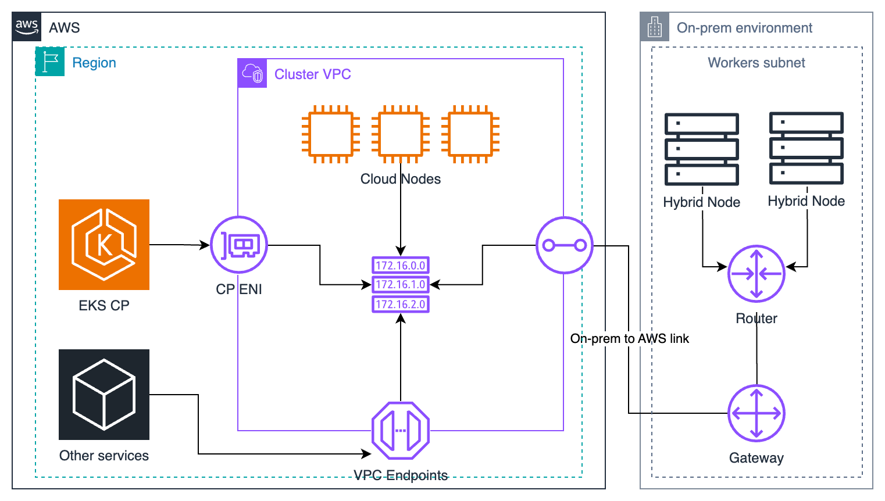

# EKS Hybrid Nodes

> **支持版本**: EKS 1.31+, nodeadm 0.1+ **最后更新**: February 23, 2026

Amazon EKS Hybrid Nodes 是一项功能，可让你从 AWS EKS control plane 管理本地服务器。本指南介绍生产环境中 EKS Hybrid Nodes 的概念、配置方法和实际用法。

## 目录

1. [先决条件和系统要求](01-prerequisites.md)
2. [网络配置](02-network-configuration.md)
3. [Air-Gap 环境设置 (S3 + VPC Endpoints)](03-airgap-setup.md)
4. [Node Bootstrap](04-node-bootstrap.md)
5. [GPU 服务器集成](05-gpu-integration.md)
6. [Workload 放置策略](06-workload-placement.md)
7. [Node 生命周期管理](07-node-lifecycle.md)
8. [运维和维护](08-operations.md)
9. [Bare Metal 服务器 OS 安装和迁移指南](09-bare-metal-os-setup.md)
10. [Hybrid Nodes Gateway](10-hybrid-nodes-gateway.md)

## 什么是 Hybrid Nodes？

EKS Hybrid Nodes 是一项功能，可让你将本地数据中心或边缘环境中的服务器注册为由 AWS EKS control plane 管理的 Kubernetes nodes。这样你就可以将云端和本地基础设施作为单个 Kubernetes cluster 进行管理。



下图展示了网络先决条件，包括 VPC、subnets、Transit Gateway/Virtual Private Gateway，以及 Remote Node/Pod CIDR 连接性。


## 为什么使用 Hybrid Nodes？

### 1. 法规合规和数据主权

某些行业（金融、医疗保健、政府）有法规要求数据保留在特定区域或设施内。使用 Hybrid Nodes，你可以将敏感数据保留在本地，同时利用 EKS 管理能力。

```yaml
# Example of regulatory compliance workload placement
apiVersion: v1
kind: Pod
metadata:
  name: financial-data-processor
spec:
  nodeSelector:
    topology.kubernetes.io/zone: "on-premises"
    compliance.company.io/data-sovereignty: "required"
  containers:
  - name: processor
    image: harbor.internal.company.io/finance/data-processor:v1.2.0
```

### 2. 数据重力

当大型数据集位于本地时，将计算移动到更靠近数据的位置，比把数据移动到云端更高效。

### 3. 利用现有硬件

你可以继续利用已经投入使用的高性能服务器（尤其是 GPU 服务器），同时应用现代化的基于 Kubernetes 的 workload 管理。

### 4. 统一管理

从单个 control plane 管理云端和本地环境中的 Kubernetes workloads，可降低运维复杂性。

## 架构组件

EKS Hybrid Nodes 架构由以下组件组成：

| 组件                            | 位置        | 角色                                           |
| ------------------------------- | ----------- | ---------------------------------------------- |
| EKS Control Plane               | AWS         | API server、etcd、controller manager、scheduler |
| nodeadm                         | 本地        | Node bootstrap 和管理 agent                    |
| kubelet                         | 本地        | Pod 执行和 node 状态报告                       |
| containerd                      | 本地        | Container runtime                              |
| VPN/Direct Connect              | 网络        | AWS 与本地之间的安全连接                       |
| SSM Agent or IAM Roles Anywhere | 本地        | Credential 管理                                |

### 关键约束和限制

* **网络连接性**: 需要通过 VPN 或 Direct Connect 提供可靠的本地到 AWS 连接（不适用于断开连接、间歇性、受限或拒绝访问的环境）
* **CIDR 限制**: 每个 cluster 的 Remote Node Networks 和 Remote Pod Networks 最多支持 15 个 CIDR
* **仅 IPv4**: 必须使用 IPv4 地址族（hybrid nodes 不支持 IPv6）
* **身份验证模式**: Cluster 必须使用 `API` 或 `API_AND_CONFIG_MAP` 身份验证模式
* **Endpoint 访问**: 必须仅使用 Public 或 Private（**不支持**“Public and Private” — 会导致 hybrid node 加入失败）
* **按 vCPU 定价**: Hybrid nodes 按 vCPU 小时计费（无最低承诺）
* **云基础设施**: 不支持在云基础设施上运行（在 EC2 上运行会产生 hybrid node 费用）
* **VPC CNI**: Amazon VPC CNI 与 hybrid nodes 不兼容；请使用 Cilium 或 Calico

### Credential Provider 选项

EKS Hybrid Nodes 支持两种 credential providers，用于向 AWS 验证本地 nodes 的身份：

| 特性                     | SSM Hybrid Activations                                                           | IAM Roles Anywhere                                     |
| ------------------------ | -------------------------------------------------------------------------------- | ------------------------------------------------------ |
| **设置复杂性**           | 简单 — activation code/ID 对                                                     | 中等 — 需要 PKI 基础设施                               |
| **需要证书**             | 否                                                                               | 是（每个 node 一个 X.509 证书）                        |
| **Air-gap 兼容**         | 否（需要 SSM endpoint 访问）                                                     | 是（可与本地 CA 配合使用）                             |
| **Credential 轮换**      | 自动（AWS 托管，固定 1 小时 TTL）                                                | 自动（基于证书，可配置 1-12 小时）                     |
| **Node 命名**            | 自动生成（`mi-xxxx`，不可自定义）                                                | 自定义（必须匹配证书 CN）                              |
| **扩展限制**             | 每个账户每个区域免费 1,000 个；更多需要 advanced-instances tier（额外费用）      | 无限制                                                 |
| **AWS 依赖项**           | SSM service                                                                      | IAM Roles Anywhere service                             |
| **最适合**               | 具有互联网/VPN 的标准环境                                                        | Air-gap、严格合规、现有 PKI                            |

> **建议**: 在大多数环境中，为了简单性请使用 SSM Hybrid Activations。当你需要 air-gap 支持或已有 PKI 基础设施时，选择 IAM Roles Anywhere。

## 主要使用场景

1. **AI/ML Workloads**: 在本地 GPU 服务器上进行模型训练，在云端运行推理服务
2. **金融服务**: 在本地处理交易数据，在云端进行分析
3. **制造业**: 将工厂中的 edge computing 与中央云端集成
4. **媒体处理**: 在数据所在位置处理大型媒体文件

## 后续步骤

从 [先决条件和系统要求](01-prerequisites.md) 开始，确保你的环境已为 EKS Hybrid Nodes 做好准备。

## 测验

要测试你对 EKS Hybrid Nodes 的理解，请尝试以下测验：

* [EKS Hybrid Nodes 测验](https://github.com/Atom-oh/kubernetes-docs/blob/main/en/quizzes/eks-hybrid-nodes/README.md)

## 相关文档

* [EKS 弹性指南](../eks/10-eks-resiliency.md) - 混合环境中的高可用性配置
* [EKS 成本优化](../eks/07-eks-cost-optimization.md) - 成本管理策略
* [EKS 监控和日志记录](../eks/06-eks-monitoring-logging.md) - 集成监控配置

## 官方文档

* [AWS EKS Hybrid Nodes 官方文档](https://docs.aws.amazon.com/eks/latest/userguide/hybrid-nodes-overview.html)
* [nodeadm 用户指南](https://docs.aws.amazon.com/eks/latest/userguide/hybrid-nodes-nodeadm.html)
* [Harbor 官方文档](https://goharbor.io/docs/)
* [NVIDIA GPU Operator 文档](https://docs.nvidia.com/datacenter/cloud-native/gpu-operator/overview.html)
* [Hybrid Nodes 网络指南](https://docs.aws.amazon.com/eks/latest/userguide/hybrid-nodes-networking.html)
* [Hybrid Nodes CNI 配置](https://docs.aws.amazon.com/eks/latest/userguide/hybrid-nodes-cni.html)
* [Hybrid Nodes 故障排除](https://docs.aws.amazon.com/eks/latest/userguide/hybrid-nodes-troubleshooting.html)
