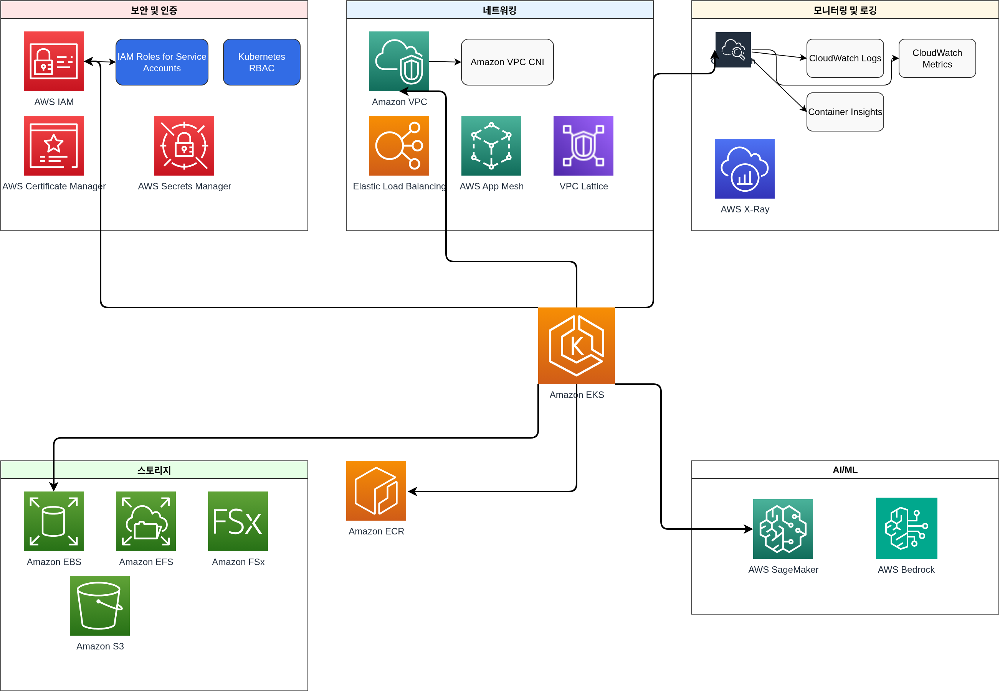

# EKS 简介

> **支持版本**: Amazon EKS 1.31, 1.32, 1.33 **最后更新**: February 21, 2026

Amazon Elastic Kubernetes Service (EKS) 是一项用于在 AWS 上运行 Kubernetes 的托管服务。在本章中，我们将介绍 EKS 的基本概念、架构，以及它与标准 Kubernetes 的区别。

## EKS 和 Kubernetes

EKS 是一项提供标准 Kubernetes API 的托管服务。有关 Kubernetes 基本概念和运行方式的详细信息，请参阅 [Kubernetes 简介](../basics/04-kubernetes-introduction.md) 文档。

### EKS 的主要优势

1. **Managed Control Plane（托管控制平面）**: AWS 管理 Kubernetes Control Plane 的可用性和可扩展性
2. **增强安全性**: 通过与 AWS IAM 集成实现身份验证和授权
3. **AWS Service Integration（AWS 服务集成）**: 与其他 AWS 服务（ELB、ECR、IAM 等）无缝集成
4. **多种 Compute Options（计算选项）**: 支持包括 EC2、Fargate 和 Bottlerocket 在内的多种计算选项
5. **Auto Scaling（自动扩缩）**: 通过 Cluster Autoscaler、Karpenter 等提供 Auto Scaling 支持
6. **Managed Node Groups（托管节点组）**: 自动化 Node 生命周期管理

## EKS 架构和组件

Amazon EKS 的整体架构如下：

### Control Plane

EKS 提供高可用的 Control Plane。Control Plane 跨多个 availability zones 运行，并由以下组件组成：

* **API Server**: 暴露 Kubernetes API，并处理与 cluster 的交互。
* **etcd**: 一个分布式键值存储，用于存储 cluster state。
* **Controller Manager**: 运行用于管理 cluster state 的 controllers。
* **Scheduler**: 将 pods 分配到 nodes。

在 EKS 中，这些 Control Plane 组件由 AWS 管理，因此用户无需直接管理它们。

### Data Plane

EKS Data Plane 可以使用以下选项进行配置：

1. **Managed Node Groups**: 由 EC2 instances 组成的 Node groups，其中 AWS 管理 Node 生命周期。
2. **Self-Managed Nodes**: 由用户直接管理的 EC2 instances。
3. **AWS Fargate**: 一种 serverless compute engine，可免除为运行 containers 而管理 infrastructure 的需求。

### Networking

EKS 使用 Amazon VPC CNI plugin 提供 pod networking。该 plugin 为每个 pod 分配 VPC IP 地址，从而能够使用 AWS networking capabilities。

## 标准 Kubernetes 和 EKS 之间的区别

### 管理责任

* **Standard Kubernetes**: 用户必须同时管理 Control Plane 和 Data Plane。
* **EKS**: AWS 管理 Control Plane，用户只需要管理 Data Plane。

### Networking

* **Standard Kubernetes**: 你可以从多种 CNI plugins 中进行选择。
* **EKS**: 默认使用 Amazon VPC CNI，并且每个 pod 都会被分配一个 VPC IP 地址。

### Load Balancing

* **Standard Kubernetes**: 必须安装单独的 controller 才能使用 `LoadBalancer` 类型的 services。
* **EKS**: `LoadBalancer` 类型的 services 会自动创建 AWS Network Load Balancer (NLB)。要使用 Application Load Balancer (ALB)，需要安装 AWS Load Balancer Controller。

### Storage

* **Standard Kubernetes**: 必须手动安装并配置各种 storage drivers。
* **EKS**: 默认提供 AWS EBS CSI driver，并且可以轻松安装适用于 EFS 和 FSx 等其他 AWS storage services 的 drivers。

## EKS 成本结构

运行 EKS cluster 时产生的成本如下：

1. **EKS Control Plane Cost**: 每个 cluster 按小时收取费用。
2. **Compute Costs**:
   * EC2 instances（managed 或 self-managed nodes）
   * Fargate（根据 pod 运行时间和资源使用量计费）
3. **Storage Costs**: EBS、EFS、FSx 等 storage services 的成本
4. **Network Costs**: 数据传输和 load balancer 使用成本

### 成本优化策略

1. **使用 Spot Instances**: 最多可降低 90% 的成本。
2. **利用 Fargate**: 适用于利用率较低的 workloads。
3. **配置 Auto Scaling**: 根据需要自动向上和向下扩缩 nodes。
4. **Locality Routing**: 将流量保持在同一 availability zone 内，以降低网络成本。
5. **EKS Auto Mode**: 通过自动 cluster scaling 优化成本。
6. **Hybrid Nodes**: 通过混合多种 instance types 提高成本效率。

## 与 AWS 服务集成

EKS 与以下 AWS 服务集成：

1. **IAM**: 通过与 Kubernetes RBAC 集成来管理身份验证和授权。
2. **VPC**: 提供 networking infrastructure。
3. **CloudWatch**: 提供 monitoring 和 logging。
4. **ALB/NLB**: 提供 load balancing。
5. **ECR**: 提供 container image registry。
6. **EBS/EFS/FSx**: 提供 persistent storage。
7. **AWS App Mesh**: 提供 service mesh capabilities。
8. **AWS Certificate Manager**: 管理 SSL/TLS certificates。
9. **AWS Secrets Manager**: 安全地存储和管理敏感信息。
10. **AWS SageMaker**: 运行 machine learning workloads。
11. **AWS Bedrock**: 利用 generative AI models。

## EKS 最佳实践

1. **Cluster Design**:
   * 跨多个 availability zones 部署 nodes
   * 选择合适的 instance types
   * 制定 node group 策略
2. **Security**:
   * 应用 least privilege 原则
   * 实施 network policies
   * 应用 pod security policies
   * Image scanning 和 vulnerability management
3. **Networking**:
   * 合理的 subnet design
   * Security group configuration
   * 利用 Locality Routing
4. **Monitoring and Logging**:
   * 启用 CloudWatch Container Insights
   * 配置 Control Plane logging
   * 利用 Prometheus 和 Grafana
5. **Upgrade Strategy**:
   * 规划定期 upgrades
   * 考虑 blue/green deployment 策略
   * 在 upgrades 前执行测试

## 测验

要测试你在本章中学到的内容，请尝试 [Amazon EKS 简介测验](../quizzes/eks/01-eks-introduction-quiz.md)。
