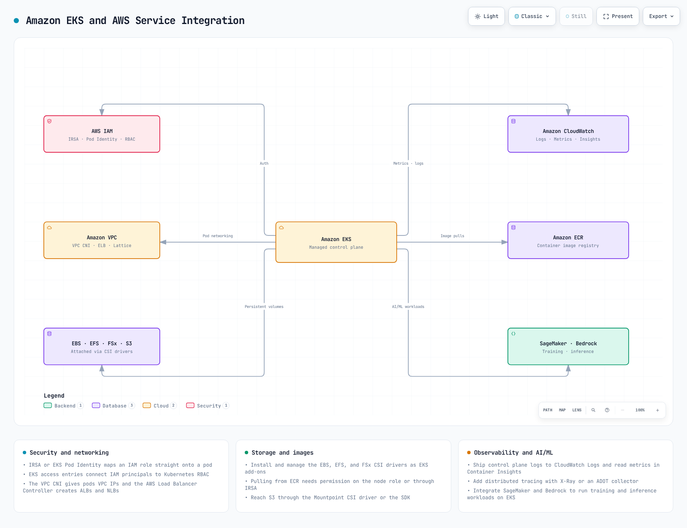

# EKS 简介

> **支持的版本**: Amazon EKS 1.31, 1.32, 1.33 **最后更新**: February 21, 2026

Amazon Elastic Kubernetes Service (EKS) 是一项用于在 AWS 上运行 Kubernetes 的托管服务。本章将介绍 EKS 的基本概念、其架构，以及它与标准 Kubernetes 的区别。

## EKS 与 Kubernetes

EKS 是一项提供标准 Kubernetes API 的托管服务。有关 Kubernetes 基本概念和操作的详细信息，请参阅 [Kubernetes 简介](../basics/04-kubernetes-introduction.md) 文档。

### EKS 的主要优势

1. **托管 Control Plane**: AWS 管理 Kubernetes Control Plane 的可用性和可扩展性
2. **增强的安全性**: 通过与 AWS IAM 集成实现身份验证和授权
3. **AWS 服务集成**: 与其他 AWS 服务（ELB、ECR、IAM 等）无缝集成
4. **多种计算选项**: 支持包括 EC2、Fargate 和 Bottlerocket 在内的多种计算选项
5. **自动扩缩容**: 通过 Cluster Autoscaler、Karpenter 等支持自动扩缩容
6. **托管 Node Group**: 自动化的节点生命周期管理

## EKS 架构和组件

Amazon EKS 的整体架构如下：

### Control Plane

EKS 提供高可用的 Control Plane。Control Plane 跨多个可用区运行，由以下组件构成：

* **API Server**: 暴露 Kubernetes API 并处理与集群的交互。
* **etcd**: 存储集群状态的分布式键值存储。
* **Controller Manager**: 运行管理集群状态的 Controller。
* **Scheduler**: 将 Pod 分配到节点。

在 EKS 中，这些 Control Plane 组件由 AWS 管理，因此用户无需直接管理它们。

### Data Plane

EKS Data Plane 可以使用以下选项进行配置：

1. **托管 Node Group**: 由 EC2 实例组成的 Node Group，AWS 管理节点生命周期。
2. **自管理节点**: 由用户直接管理的 EC2 实例。
3. **AWS Fargate**: 一种无服务器计算引擎，无需管理运行容器的基础设施。

### 网络

EKS 使用 Amazon VPC CNI 插件提供 Pod 网络。该插件为每个 Pod 分配 VPC IP 地址，从而能够使用 AWS 网络功能。

## 标准 Kubernetes 与 EKS 的区别

### 管理责任

* **标准 Kubernetes**: 用户必须同时管理 Control Plane 和 Data Plane。
* **EKS**: AWS 管理 Control Plane，用户只需管理 Data Plane。

### 网络

* **标准 Kubernetes**: 可以从多种 CNI 插件中进行选择。
* **EKS**: 默认使用 Amazon VPC CNI，并为每个 Pod 分配 VPC IP 地址。

### 负载均衡

* **标准 Kubernetes**: 必须安装单独的 Controller 才能使用 `LoadBalancer` 类型的 Service。
* **EKS**: `LoadBalancer` 类型的 Service 会自动创建 AWS Network Load Balancer (NLB)。要使用 Application Load Balancer (ALB)，需要安装 AWS Load Balancer Controller。

### 存储

* **标准 Kubernetes**: 必须手动安装和配置各种存储驱动程序。
* **EKS**: 默认提供 AWS EBS CSI 驱动程序，并且可以轻松安装用于 EFS 和 FSx 等其他 AWS 存储服务的驱动程序。

## EKS 成本结构

运行 EKS 集群时产生的成本如下：

1. **EKS Control Plane 成本**: 每个集群按小时收费。
2. **计算成本**:
   * EC2 实例（托管或自管理节点）
   * Fargate（根据 Pod 运行时间和资源使用量收费）
3. **存储成本**: EBS、EFS、FSx 等存储服务的成本
4. **网络成本**: 数据传输和负载均衡器使用成本

### 成本优化策略

1. **使用 Spot 实例**: 最多可降低 90% 的成本。
2. **利用 Fargate**: 适用于利用率较低的工作负载。
3. **配置自动扩缩容**: 根据需要自动扩展和缩减节点。
4. **本地性路由**: 将流量保持在同一可用区内，以降低网络成本。
5. **EKS Auto Mode**: 通过自动集群扩缩容优化成本。
6. **混合节点**: 通过混合使用各种实例类型提高成本效率。

## 与 AWS 服务集成

EKS 与以下 AWS 服务集成：

[🔍 查看交互式图表](https://www.atomai.click/kubernetes-docs/archmaps/en-eks-01-eks-introduction-0.html)

1. **IAM**: 通过与 Kubernetes RBAC 集成来管理身份验证和授权。
2. **VPC**: 提供网络基础设施。
3. **CloudWatch**: 提供监控和日志记录。
4. **ALB/NLB**: 提供负载均衡。
5. **ECR**: 提供容器镜像注册表。
6. **EBS/EFS/FSx**: 提供持久化存储。
7. **AWS App Mesh**: 提供服务网格功能。
8. **AWS Certificate Manager**: 管理 SSL/TLS 证书。
9. **AWS Secrets Manager**: 安全地存储和管理敏感信息。
10. **AWS SageMaker**: 运行机器学习工作负载。
11. **AWS Bedrock**: 利用生成式 AI 模型。

## EKS 最佳实践

1. **集群设计**:
   * 跨多个可用区部署节点
   * 选择合适的实例类型
   * 制定 Node Group 策略
2. **安全性**:
   * 应用最小权限原则
   * 实施网络策略
   * 应用 Pod 安全策略
   * 镜像扫描和漏洞管理
3. **网络**:
   * 合理的子网设计
   * Security Group 配置
   * 利用本地性路由
4. **监控和日志记录**:
   * 启用 CloudWatch Container Insights
   * 配置 Control Plane 日志记录
   * 利用 Prometheus 和 Grafana
5. **升级策略**:
   * 规划定期升级
   * 考虑蓝绿部署策略
   * 在升级前进行测试

## 测验

要测试您在本章中学到的内容，请尝试 [Amazon EKS 简介测验](../quizzes/eks/01-eks-introduction-quiz.md)。
