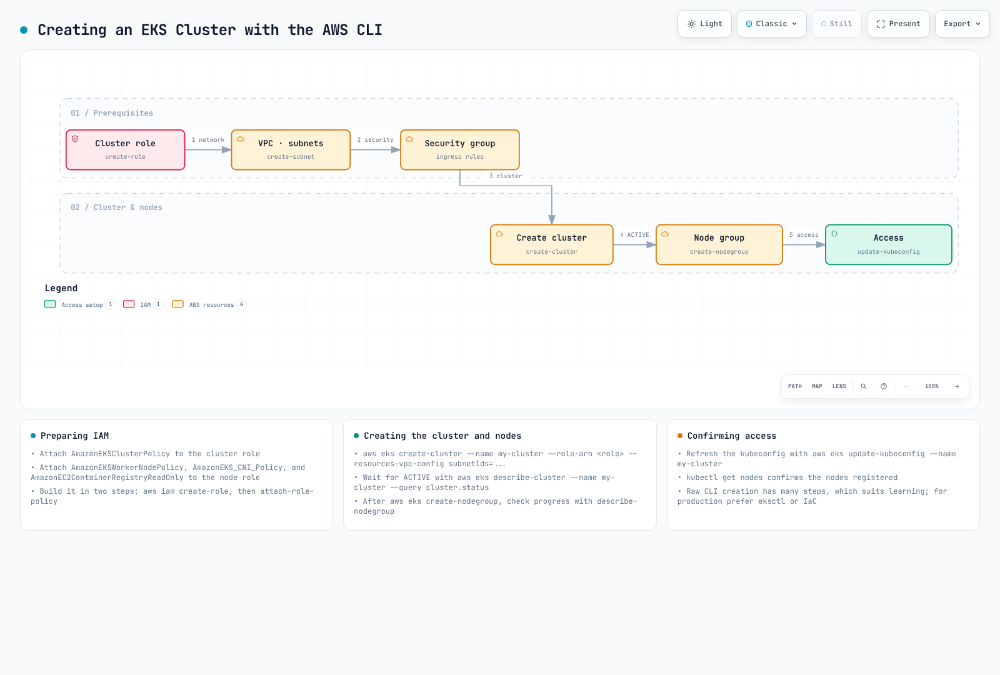

# 第 3 部分：使用 AWS Management Console 和 CLI 创建集群

## 使用 AWS Management Console 创建集群

使用 AWS Management Console 创建 EKS 集群的步骤如下：


[🔍 查看交互式图表](https://www.atomai.click/kubernetes-docs/archmaps/en-eks-02-eks-cluster-creation-part3-0.html)

1. 登录 [AWS Management Console](https://console.aws.amazon.com/)。
2. 搜索“EKS”，或从服务列表中选择“Elastic Kubernetes Service”。
3. 在“Clusters”页面上，单击“Create cluster”按钮。

### 集群配置

4. 在“Configure cluster”页面上，输入以下信息：
   * **Cluster name**：输入集群的唯一名称。
   * **Kubernetes version**：选择要使用的 Kubernetes 版本。
   * **Cluster service role**：创建新角色或选择现有角色。
   * **Tags**：如有需要，添加标签。
   * 单击“Next”按钮。

### 指定网络

5. 在“Specify networking”页面上，输入以下信息：
   * **VPC**：创建新的 VPC 或选择现有 VPC。
   * **Subnets**：选择要用于集群的子网。至少 2 个子网必须位于不同的可用区。
   * **Security groups**：选择要用于集群的安全组。
   * **Cluster endpoint access**：配置对集群 API server 端点的访问。
     * **Public**：可从互联网访问 API server。
     * **Private**：只能从 VPC 内部访问 API server。
     * **Public and Private**：可从互联网和 VPC 内部访问 API server。
   * 单击“Next”按钮。

### 配置日志记录

6. 在“Configure logging”页面上，输入以下信息：
   * **Control plane logging**：选择要启用的日志类型。
     * API server 日志
     * 审计日志
     * Authenticator 日志
     * Controller manager 日志
     * Scheduler 日志
   * 单击“Next”按钮。

### 选择 Add-on

7. 在“Select add-ons”页面上，输入以下信息：
   * **Amazon VPC CNI**：用于 Pod 网络的 CNI 插件。
   * **CoreDNS**：集群内的 DNS 服务。
   * **kube-proxy**：提供网络代理和负载均衡。
   * 单击“Next”按钮。

### 审核并创建

8. 在“Review and create”页面上，审核配置并单击“Create”按钮。

集群创建完成后，您可以单击“Add node group”按钮来添加节点组。

### 添加节点组

1. 在“Node group configuration”页面上，输入以下信息：
   * **Node group name**：输入节点组的唯一名称。
   * **Node IAM role**：创建新角色或选择现有角色。
   * 单击“Next”按钮。
2. 在“Set compute and scaling configuration”页面上，输入以下信息：
   * **AMI type**：选择要用于节点的 AMI 类型。
   * **Instance type**：选择要用于节点的 EC2 实例类型。
   * **Disk size**：指定节点的磁盘大小。
   * **Node count**：指定节点的最小、最大和期望数量。
   * 单击“Next”按钮。
3. 在“Specify networking”页面上，输入以下信息：
   * **Subnets**：选择要用于节点组的子网。
   * **Remote access configuration**：配置 SSH 访问。
   * 单击“Next”按钮。
4. 在“Review and create”页面上，审核配置并单击“Create”按钮。

## 使用 AWS CLI 创建集群

使用 AWS CLI 创建 EKS 集群的过程由多个步骤组成。当需要更多控制时，此方法非常有用。



[🔍 查看交互式图表](https://www.atomai.click/kubernetes-docs/archmaps/en-eks-02-eks-cluster-creation-part3-1.html)

### 1. 创建集群 IAM 角色

EKS 集群需要一个 IAM 角色，以允许 Kubernetes control plane 管理 AWS 资源。

```bash
# Create role
aws iam create-role \
  --role-name EKSClusterRole \
  --assume-role-policy-document '{
    "Version": "2012-10-17",
    "Statement": [
      {
        "Effect": "Allow",
        "Principal": {
          "Service": "eks.amazonaws.com"
        },
        "Action": "sts:AssumeRole"
      }
    ]
  }'

# Attach required policy
aws iam attach-role-policy \
  --role-name EKSClusterRole \
  --policy-arn arn:aws:iam::aws:policy/AmazonEKSClusterPolicy
```

### 2. 创建 VPC 和子网

EKS 集群需要 VPC 和子网。您可以使用现有 VPC 或创建新的 VPC。

```bash
# Create VPC
aws ec2 create-vpc \
  --cidr-block 10.0.0.0/16 \
  --tag-specifications 'ResourceType=vpc,Tags=[{Key=Name,Value=EKS-VPC}]' \
  --query Vpc.VpcId \
  --output text

# Create subnets
aws ec2 create-subnet \
  --vpc-id vpc-xxxxxxxxxxxxxxxxx \
  --cidr-block 10.0.1.0/24 \
  --availability-zone us-west-2a \
  --tag-specifications 'ResourceType=subnet,Tags=[{Key=Name,Value=EKS-Subnet-1}]' \
  --query Subnet.SubnetId \
  --output text

aws ec2 create-subnet \
  --vpc-id vpc-xxxxxxxxxxxxxxxxx \
  --cidr-block 10.0.2.0/24 \
  --availability-zone us-west-2b \
  --tag-specifications 'ResourceType=subnet,Tags=[{Key=Name,Value=EKS-Subnet-2}]' \
  --query Subnet.SubnetId \
  --output text
```

### 3. 创建集群安全组

EKS 集群需要一个安全组。

```bash
# Create security group
aws ec2 create-security-group \
  --group-name EKS-Cluster-SG \
  --description "Security group for EKS cluster" \
  --vpc-id vpc-xxxxxxxxxxxxxxxxx \
  --query GroupId \
  --output text

# Add inbound rule
aws ec2 authorize-security-group-ingress \
  --group-id sg-xxxxxxxxxxxxxxxxx \
  --protocol tcp \
  --port 443 \
  --cidr 0.0.0.0/0
```

### 4. 创建 EKS 集群

现在您可以创建 EKS 集群。

```bash
aws eks create-cluster \
  --name my-cluster \
  --role-arn arn:aws:iam::123456789012:role/EKSClusterRole \
  --resources-vpc-config subnetIds=subnet-xxxxxxxxxxxxxxxxx,subnet-yyyyyyyyyyyyyyyyy,securityGroupIds=sg-zzzzzzzzzzzzzzzzz \
  --kubernetes-version 1.26
```

等待集群创建完成。要检查集群状态，请运行以下命令：

```bash
aws eks describe-cluster \
  --name my-cluster \
  --query "cluster.status"
```

### 5. 创建节点 IAM 角色

EKS 节点需要 IAM 角色来访问 AWS 资源。

```bash
# Create role
aws iam create-role \
  --role-name EKSNodeRole \
  --assume-role-policy-document '{
    "Version": "2012-10-17",
    "Statement": [
      {
        "Effect": "Allow",
        "Principal": {
          "Service": "ec2.amazonaws.com"
        },
        "Action": "sts:AssumeRole"
      }
    ]
  }'

# Attach required policies
aws iam attach-role-policy \
  --role-name EKSNodeRole \
  --policy-arn arn:aws:iam::aws:policy/AmazonEKSWorkerNodePolicy

aws iam attach-role-policy \
  --role-name EKSNodeRole \
  --policy-arn arn:aws:iam::aws:policy/AmazonEKS_CNI_Policy

aws iam attach-role-policy \
  --role-name EKSNodeRole \
  --policy-arn arn:aws:iam::aws:policy/AmazonEC2ContainerRegistryReadOnly
```

### 6. 创建节点组

现在您可以创建节点组。

```bash
aws eks create-nodegroup \
  --cluster-name my-cluster \
  --nodegroup-name my-nodegroup \
  --node-role arn:aws:iam::123456789012:role/EKSNodeRole \
  --subnets subnet-xxxxxxxxxxxxxxxxx subnet-yyyyyyyyyyyyyyyyy \
  --disk-size 80 \
  --scaling-config minSize=1,maxSize=3,desiredSize=2 \
  --instance-types m5.large
```

等待节点组创建完成。要检查节点组状态，请运行以下命令：

```bash
aws eks describe-nodegroup \
  --cluster-name my-cluster \
  --nodegroup-name my-nodegroup \
  --query "nodegroup.status"
```

### 7. 配置 kubeconfig

您需要配置 kubeconfig 文件以访问集群。

```bash
aws eks update-kubeconfig \
  --name my-cluster \
  --region us-west-2
```

### 8. 验证集群

验证集群是否配置正确。

```bash
kubectl get nodes
```

## 测验

要测试您在本章中学到的内容，请尝试 [EKS 集群创建 - 第 3 部分测验](../quizzes/eks/02-eks-cluster-creation-part3-quiz.md)。
