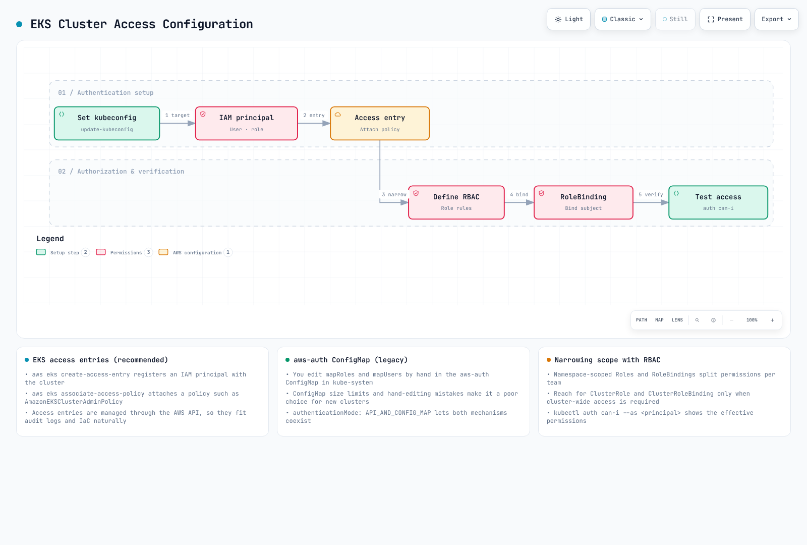
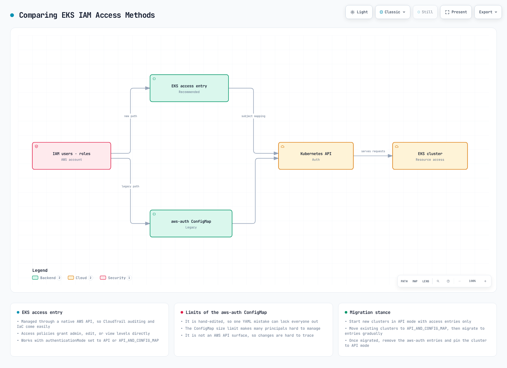
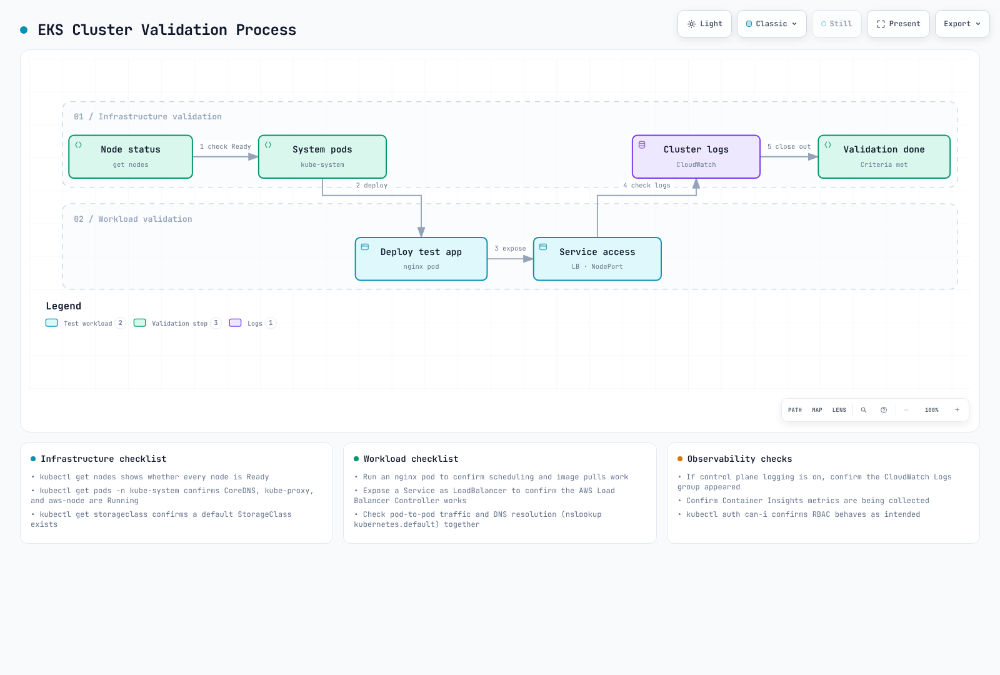

# 第 5 部分：集群访问、验证、升级和删除

## 配置集群访问

创建 EKS 集群后，需要进行配置才能访问集群。本节将学习如何配置集群访问。

### 集群访问配置流程



[🔍 查看交互式图表](https://www.atomai.click/kubernetes-docs/archmaps/en-eks-02-eks-cluster-creation-part5-0.html)

### kubeconfig 配置

您需要配置 kubeconfig 文件才能访问 EKS 集群。您可以使用 AWS CLI 配置 kubeconfig：

```bash
aws eks update-kubeconfig \
  --name my-cluster \
  --region us-west-2
```

此命令会更新 `~/.kube/config` 文件，以便访问 EKS 集群。

### 配置 IAM 用户和角色访问权限

默认情况下，只有创建 EKS 集群的 IAM 实体（用户或角色）可以访问该集群。可通过两种方法向其他 IAM 用户或角色授予集群访问权限：传统的 aws-auth ConfigMap 方法和新的 EKS Access Entry 方法。



[🔍 查看交互式图表](https://www.atomai.click/kubernetes-docs/archmaps/en-eks-02-eks-cluster-creation-part5-1.html)

#### 方法 1：EKS Access Entry（推荐）

EKS Access Entry 是一种用于替代 aws-auth ConfigMap 的新方法，提供了更稳定且更易于管理的方式。

1. 为集群启用 Access Entry：

```bash
aws eks update-cluster-config \
  --name my-cluster \
  --region us-west-2 \
  --access-config authenticationMode=API_AND_CONFIG_MAP
```

2. 为 IAM 角色创建 Access Entry：

```bash
aws eks create-access-entry \
  --cluster-name my-cluster \
  --principal-arn arn:aws:iam::123456789012:role/MyRole \
  --username my-role \
  --kubernetes-groups system:masters
```

3. 为 IAM 用户创建 Access Entry：

```bash
aws eks create-access-entry \
  --cluster-name my-cluster \
  --principal-arn arn:aws:iam::123456789012:user/my-user \
  --username my-user \
  --kubernetes-groups system:masters
```

4. 列出 Access Entry：

```bash
aws eks list-access-entries --cluster-name my-cluster
```

5. 查看 Access Entry 详情：

```bash
aws eks describe-access-entry \
  --cluster-name my-cluster \
  --principal-arn arn:aws:iam::123456789012:user/my-user
```

#### 方法 2：aws-auth ConfigMap（旧版）

aws-auth ConfigMap 是传统方法，目前仍受支持，但建议新集群使用 Access Entry。

1. 获取当前的 `aws-auth` ConfigMap：

```bash
kubectl get configmap aws-auth -n kube-system -o yaml > aws-auth.yaml
```

2. 编辑 `aws-auth.yaml` 文件以添加用户或角色：

```yaml
apiVersion: v1
kind: ConfigMap
metadata:
  name: aws-auth
  namespace: kube-system
data:
  mapRoles: |
    - rolearn: arn:aws:iam::123456789012:role/EKSNodeRole
      username: system:node:{{EC2PrivateDNSName}}
      groups:
        - system:bootstrappers
        - system:nodes
    # Additional role
    - rolearn: arn:aws:iam::123456789012:role/MyRole
      username: my-role
      groups:
        - system:masters
  mapUsers: |
    # IAM user
    - userarn: arn:aws:iam::123456789012:user/my-user
      username: my-user
      groups:
        - system:masters
```

3. 应用更新后的 ConfigMap：

```bash
kubectl apply -f aws-auth.yaml
```

> **注意**：EKS Access Entry 于 2023 年推出，建议新集群使用 Access Entry。现有集群可以迁移到同时支持两种方法的混合模式。

### RBAC 配置

您可以使用 Kubernetes Role-Based Access Control (RBAC) 控制对集群内资源的访问。

1. 创建 namespace：

```bash
kubectl create namespace dev
```

2. 创建角色：

```yaml
# role.yaml
apiVersion: rbac.authorization.k8s.io/v1
kind: Role
metadata:
  namespace: dev
  name: developer
rules:
- apiGroups: [""]
  resources: ["pods", "services", "configmaps", "secrets"]
  verbs: ["get", "list", "watch", "create", "update", "patch", "delete"]
- apiGroups: ["apps"]
  resources: ["deployments", "statefulsets", "daemonsets"]
  verbs: ["get", "list", "watch", "create", "update", "patch", "delete"]
```

```bash
kubectl apply -f role.yaml
```

3. 创建角色绑定：

```yaml
# rolebinding.yaml
apiVersion: rbac.authorization.k8s.io/v1
kind: RoleBinding
metadata:
  name: developer-binding
  namespace: dev
subjects:
- kind: User
  name: my-user
  apiGroup: rbac.authorization.k8s.io
roleRef:
  kind: Role
  name: developer
  apiGroup: rbac.authorization.k8s.io
```

```bash
kubectl apply -f rolebinding.yaml
```

## 集群验证

创建 EKS 集群后，您需要验证集群是否正常工作。本节将学习如何验证集群。

### 集群验证流程



[🔍 查看交互式图表](https://www.atomai.click/kubernetes-docs/archmaps/en-eks-02-eks-cluster-creation-part5-2.html)

### 验证节点

验证集群中的节点：

```bash
kubectl get nodes
```

确认所有节点均处于 `Ready` 状态。

### 验证系统 Pod

验证 kube-system namespace 中的 Pod：

```bash
kubectl get pods -n kube-system
```

确认所有系统 Pod 均处于 `Running` 状态。

### 部署测试应用

部署一个简单的测试应用，以验证集群是否正常工作：

```yaml
# nginx.yaml
apiVersion: apps/v1
kind: Deployment
metadata:
  name: nginx
spec:
  replicas: 3
  selector:
    matchLabels:
      app: nginx
  template:
    metadata:
      labels:
        app: nginx
    spec:
      containers:
      - name: nginx
        image: nginx:latest
        ports:
        - containerPort: 80
---
apiVersion: v1
kind: Service
metadata:
  name: nginx
spec:
  type: LoadBalancer
  ports:
  - port: 80
    targetPort: 80
  selector:
    app: nginx
```

```bash
kubectl apply -f nginx.yaml
```

验证 Deployment 和 Service 状态：

```bash
kubectl get deployments
kubectl get pods
kubectl get services
```

确认您可以通过 LoadBalancer Service 的外部 IP 访问该应用：

```bash
curl http://<EXTERNAL-IP>
```

### 验证集群日志

在 CloudWatch Logs 中验证集群日志：

```bash
aws logs describe-log-groups \
  --log-group-name-prefix /aws/eks/my-cluster
```

## 集群升级

为使 EKS 集群保持最新状态，需要定期升级。本节将学习如何升级集群。

### 集群升级流程


[🔍 查看交互式图表](https://www.atomai.click/kubernetes-docs/archmaps/en-eks-02-eks-cluster-creation-part5-3.html)

### 控制平面升级

要升级 EKS 控制平面，请执行以下步骤：

1. 检查可用的 Kubernetes 版本：

```bash
aws eks describe-addon-versions \
  --kubernetes-version 1.27 \
  --query "addons[].addonVersions[].compatibilities[].clusterVersion"
```

2. 升级集群：

```bash
aws eks update-cluster-version \
  --name my-cluster \
  --kubernetes-version 1.27
```

3. 检查升级状态：

```bash
aws eks describe-update \
  --name my-cluster \
  --update-id <UPDATE-ID>
```

### 节点升级

升级控制平面后，也必须升级节点：

#### 托管节点组升级

```bash
aws eks update-nodegroup-version \
  --cluster-name my-cluster \
  --nodegroup-name my-nodegroup
```

#### 自管理节点升级

对于自管理节点，您需要创建新的节点组、迁移工作负载，然后删除旧节点组。

### 附加组件升级

要升级 EKS 附加组件，请执行以下步骤：

1. 检查可用的附加组件版本：

```bash
aws eks describe-addon-versions \
  --addon-name vpc-cni \
  --kubernetes-version 1.27
```

2. 升级附加组件：

```bash
aws eks update-addon \
  --cluster-name my-cluster \
  --addon-name vpc-cni \
  --addon-version <VERSION>
```

## 删除集群

当不再需要 EKS 集群时，您可以删除它以节省成本。本节将学习如何删除集群。

### 集群删除流程


[🔍 查看交互式图表](https://www.atomai.click/kubernetes-docs/archmaps/en-eks-02-eks-cluster-creation-part5-4.html)

### 资源清理

删除集群之前，必须清理在集群中创建的所有资源：

1. 删除 LoadBalancer Service：

```bash
kubectl get services --all-namespaces -o json | jq -r '.items[] | select(.spec.type == "LoadBalancer") | .metadata.name + " " + .metadata.namespace' | while read name namespace; do
  kubectl delete service $name -n $namespace
done
```

2. 删除 PersistentVolumeClaim：

```bash
kubectl delete pvc --all --all-namespaces
```

### 使用 eksctl 删除集群

如果您使用 eksctl 创建了集群，可以使用以下命令删除它：

```bash
eksctl delete cluster --name my-cluster --region us-west-2
```

### 使用 AWS CLI 删除集群

要使用 AWS CLI 删除集群，请执行以下步骤：

1. 删除节点组：

```bash
aws eks delete-nodegroup \
  --cluster-name my-cluster \
  --nodegroup-name my-nodegroup
```

2. 删除 Fargate 配置文件：

```bash
aws eks delete-fargate-profile \
  --cluster-name my-cluster \
  --fargate-profile-name my-fargate-profile
```

3. 删除集群：

```bash
aws eks delete-cluster \
  --name my-cluster
```

### 清理相关资源

删除 EKS 集群后，可能仍会保留以下相关资源：

1. VPC 及相关资源：

```bash
aws ec2 delete-vpc --vpc-id vpc-xxxxxxxxxxxxxxxxx
```

2. IAM 角色和策略：

```bash
aws iam detach-role-policy \
  --role-name EKSClusterRole \
  --policy-arn arn:aws:iam::aws:policy/AmazonEKSClusterPolicy

aws iam delete-role --role-name EKSClusterRole

aws iam detach-role-policy \
  --role-name EKSNodeRole \
  --policy-arn arn:aws:iam::aws:policy/AmazonEKSWorkerNodePolicy

aws iam detach-role-policy \
  --role-name EKSNodeRole \
  --policy-arn arn:aws:iam::aws:policy/AmazonEKS_CNI_Policy

aws iam detach-role-policy \
  --role-name EKSNodeRole \
  --policy-arn arn:aws:iam::aws:policy/AmazonEC2ContainerRegistryReadOnly

aws iam delete-role --role-name EKSNodeRole
```

3. CloudWatch 日志组：

```bash
aws logs delete-log-group \
  --log-group-name /aws/eks/my-cluster/cluster
```

## 测验

要测试您在本章中学到的内容，请尝试 [EKS 集群创建 - 第 5 部分测验](../quizzes/eks/02-eks-cluster-creation-part5-quiz.md)。
