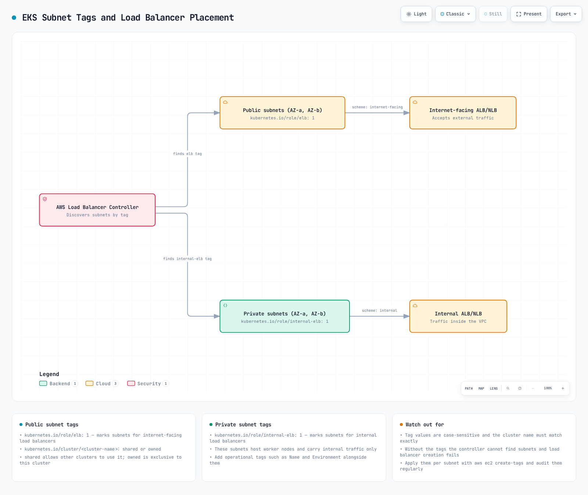

# EKS 网络

## 概述

Amazon EKS 网络是管理 Kubernetes 集群通信的核心组件。本文涵盖 EKS 网络、VPC 配置、Subnet 设计和 Security Group 配置的基本概念。

## EKS 网络架构

EKS 网络架构由以下组件构成：


[🔍 查看交互式图表](https://www.atomai.click/kubernetes-docs/archmaps/en-eks-03-eks-networking-part1-0.html)

1. **VPC (Virtual Private Cloud)**：EKS 集群运行所在的隔离网络环境
2. **Subnets**：在 VPC 内划分 IP 地址范围的单元
3. **Route Tables**：确定网络流量路径的规则集
4. **Internet Gateway**：使 VPC 能够与互联网通信的组件
5. **NAT Gateway**：允许 Private Subnets 中的资源访问互联网的组件
6. **Security Groups**：实例级虚拟防火墙
7. **Network ACLs**：Subnet 级虚拟防火墙
8. **CNI (Container Network Interface)**：管理容器网络的插件

### EKS 网络流量

EKS 集群中的网络流量如下流动：


[🔍 查看交互式图表](https://www.atomai.click/kubernetes-docs/archmaps/en-eks-03-eks-networking-part1-1.html)

1. **Pod 到 Pod 通信**：同一 node 或不同 nodes 上 Pod 之间的通信
2. **Pod 到 Service 通信**：集群内 Pod 与 Service 之间的通信
3. **集群内部到外部通信**：集群内部资源与外部资源之间的通信
4. **Control Plane 到 node 通信**：EKS Control Plane 与 worker nodes 之间的通信

### EKS 网络组件之间的关系


[🔍 查看交互式图表](https://www.atomai.click/kubernetes-docs/archmaps/en-eks-03-eks-networking-part1-2.html)

## VPC 要求

用于 EKS 集群的 VPC 必须满足以下要求：


[🔍 查看交互式图表](https://www.atomai.click/kubernetes-docs/archmaps/en-eks-03-eks-networking-part1-3.html)

1. **Subnets**：必须在至少 2 个 Availability Zones 中拥有 Subnets
2. **IP 地址**：必须提供足够数量的 IP 地址
3. **DNS Hostnames**：必须启用 DNS Hostnames 和 DNS resolution
4. **互联网访问**：nodes 必须能够访问互联网（通过 NAT Gateway 或 Internet Gateway）

### VPC CIDR 规划

规划 VPC CIDR blocks 时的注意事项：


[🔍 查看交互式图表](https://www.atomai.click/kubernetes-docs/archmaps/en-eks-03-eks-networking-part1-4.html)

1. **集群规模**：预期的 nodes 和 Pods 数量
2. **IP 地址需求**：每个 node 和 Pod 所需的 IP 地址数量
3. **未来扩展**：为未来扩展预留空间
4. **与现有网络集成**：避免与现有网络重叠

常见的 VPC CIDR block 大小：

* 小型集群：/24（256 个 IP 地址）
* 中型集群：/20（4,096 个 IP 地址）
* 大型集群：/16（65,536 个 IP 地址）

### Subnet 设计


[🔍 查看交互式图表](https://www.atomai.click/kubernetes-docs/archmaps/en-eks-03-eks-networking-part1-5.html)

EKS 集群 Subnet 设计的最佳实践：

1. **Public Subnets**：直接连接到 Internet Gateway 的 Subnets
   * 用途：Public load balancers、NAT Gateways、bastion hosts
   * 典型大小：/24（256 个 IP 地址）
2. **Private Subnets**：不直接连接到 Internet Gateway 的 Subnets
   * 用途：EKS worker nodes、internal load balancers
   * 典型大小：/22（1,024 个 IP 地址）
3. **Availability Zone 分布**：将 Subnets 分布在多个 Availability Zones 中
   * 至少使用 2 个 Availability Zones
   * 在每个 Availability Zone 中部署 Public 和 Private Subnets

Subnet 设计示例：

| Subnet 类型 | Availability Zone | CIDR Block  | 用途                          |
| ----------- | ----------------- | ----------- | ---------------------------- |
| Public      | us-west-2a        | 10.0.0.0/24 | Load balancers、NAT gateways |
| Public      | us-west-2b        | 10.0.1.0/24 | Load balancers、NAT gateways |
| Private     | us-west-2a        | 10.0.2.0/22 | EKS worker nodes             |
| Private     | us-west-2b        | 10.0.6.0/22 | EKS worker nodes             |

### Subnet tags



[🔍 查看交互式图表](https://www.atomai.click/kubernetes-docs/archmaps/en-eks-03-eks-networking-part1-6.html)

EKS 在 Subnets 上使用特定 tags 来自动发现资源：

1. **Public Subnet tags**：
   * `kubernetes.io/role/elb`：设置值为 `1`，用于 internet-facing load balancers
   * `kubernetes.io/cluster/<cluster-name>`：设置值为 `shared` 或 `owned`
2. **Private Subnet tags**：
   * `kubernetes.io/role/internal-elb`：设置值为 `1`，用于 internal load balancers
   * `kubernetes.io/cluster/<cluster-name>`：设置值为 `shared` 或 `owned`

示例：

```bash
aws ec2 create-tags \
  --resources subnet-xxxxxxxxxxxxxxxxx \
  --tags Key=kubernetes.io/cluster/my-cluster,Value=shared Key=kubernetes.io/role/elb,Value=1
```

### Security Group 配置


[🔍 查看交互式图表](https://www.atomai.click/kubernetes-docs/archmaps/en-eks-03-eks-networking-part1-7.html)

EKS 集群有两个主要 Security Groups：

1. **Cluster Security Group（Control Plane）**：
   * 入站规则：
     * 443/TCP：允许来自 worker node Security Group 的流量
   * 出站规则：
     * 1025-65535/TCP：允许流向 worker node Security Group 的流量
2. **Node Security Group（worker nodes）**：
   * 入站规则：
     * 443/TCP：允许来自 Cluster Security Group 的流量
     * 1025-65535/TCP：允许来自 Cluster Security Group 的流量
     * ALL：允许同一 Security Group 内的流量
   * 出站规则：
     * ALL：允许流向所有目标的流量

## 总结

本文介绍了 EKS 网络和 VPC 配置的基本概念。下一篇文档将介绍更高级的网络主题，例如 Service、load balancing 和 network policies。

## 测验

为检验你在本章中所学的内容，请尝试 [EKS Networking - Part 1 测验](../quizzes/eks/03-eks-networking-part1-quiz.md)。
