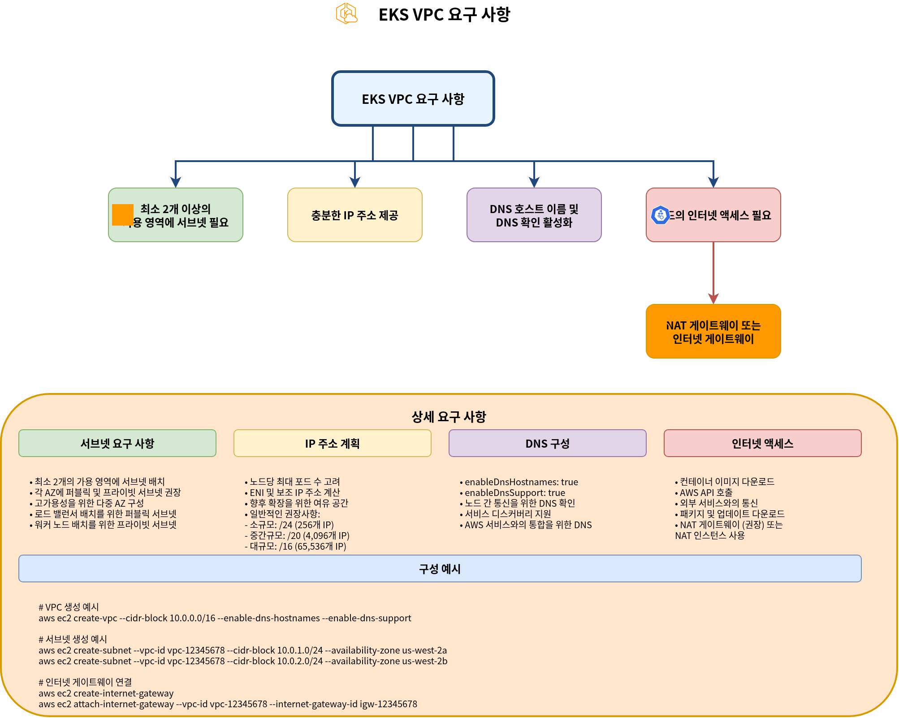
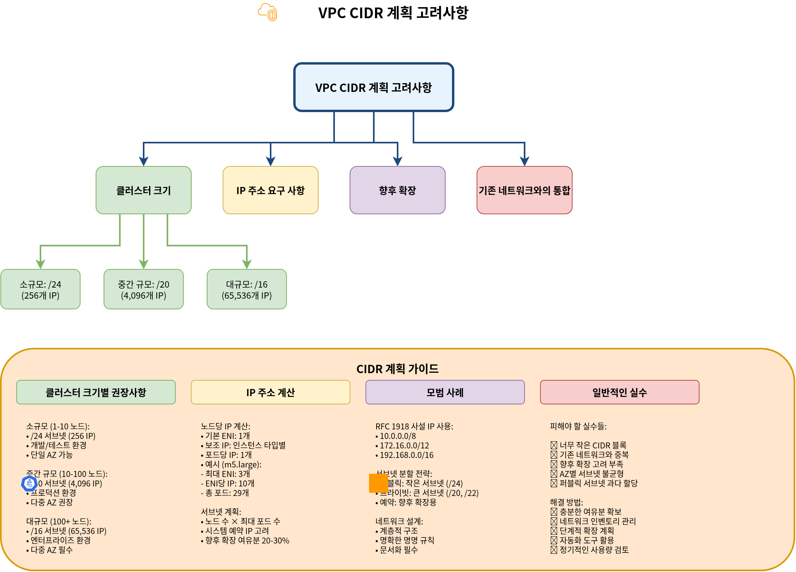
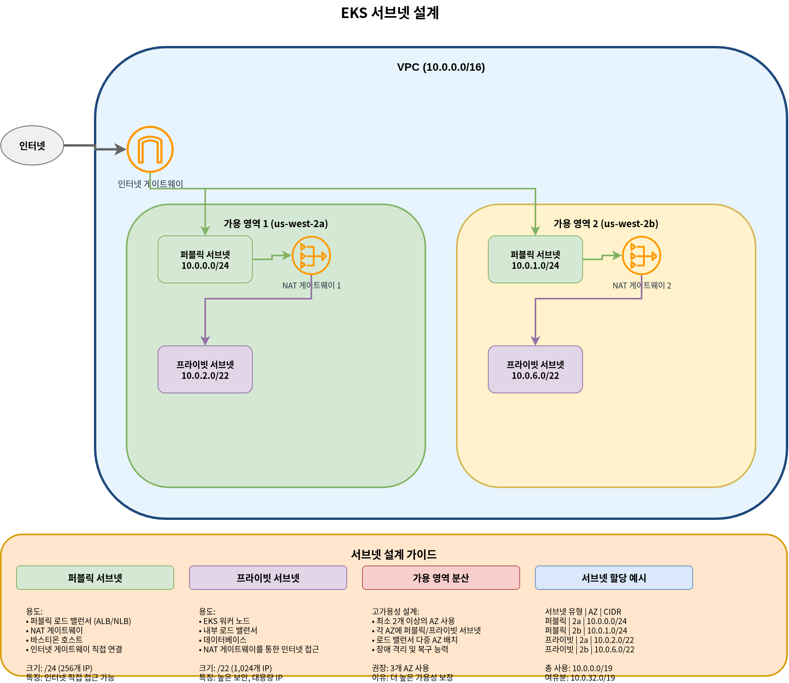
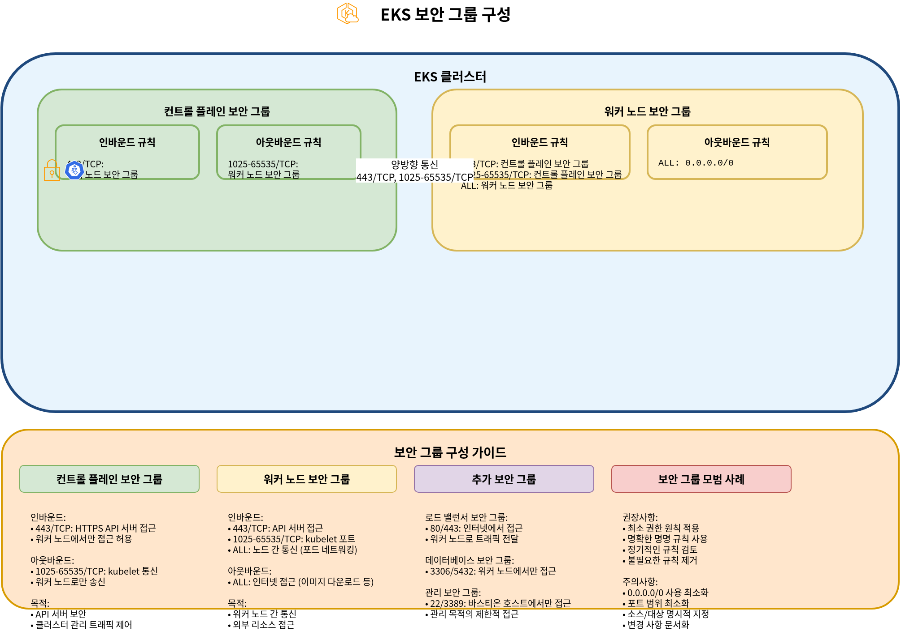

# EKS 网络

## 概述

Amazon EKS 网络是管理 Kubernetes 集群通信的核心组件。本文档涵盖 EKS 网络、VPC 配置、子网设计以及 Security Group 配置的基本概念。

## EKS 网络架构

EKS 网络架构由以下组件组成：


1. **VPC (Virtual Private Cloud)**：EKS 集群运行所在的隔离网络环境
2. **Subnets**：在 VPC 内划分 IP 地址范围的单元
3. **Route Tables**：决定网络流量路径的规则集
4. **Internet Gateway**：使 VPC 与互联网之间能够通信的组件
5. **NAT Gateway**：允许私有子网中的资源访问互联网的组件
6. **Security Groups**：实例级虚拟防火墙
7. **Network ACLs**：子网级虚拟防火墙
8. **CNI (Container Network Interface)**：管理容器网络的插件

### EKS 网络流

EKS 集群中的网络流量流向如下：


1. **Pod-to-Pod Communication**：同一 Node 或不同 Node 上的 Pod 之间的通信
2. **Pod-to-Service Communication**：集群内 Pod 与 Service 之间的通信
3. **Internal to External Cluster Communication**：内部集群资源与外部资源之间的通信
4. **Control Plane to Node Communication**：EKS Control Plane 与 Worker Node 之间的通信

### EKS 网络组件之间的关系


## VPC 要求

用于 EKS 集群的 VPC 必须满足以下要求：



1. **Subnets**：必须在至少 2 个 Availability Zone 中拥有 Subnet
2. **IP Addresses**：必须提供足够数量的 IP 地址
3. **DNS Hostnames**：必须启用 DNS 主机名和 DNS 解析
4. **Internet Access**：Node 必须能够访问互联网（通过 NAT gateway 或 internet gateway）

### VPC CIDR 规划

规划 VPC CIDR 块时的注意事项：



1. **Cluster Size**：预期的 Node 和 Pod 数量
2. **IP Address Requirements**：每个 Node 和 Pod 所需的 IP 地址数量
3. **Future Expansion**：为未来扩展预留空间
4. **Integration with Existing Networks**：避免与现有网络重叠

常见的 VPC CIDR 块大小：

* 小型集群：/24 (256 IP addresses)
* 中型集群：/20 (4,096 IP addresses)
* 大型集群：/16 (65,536 IP addresses)

### Subnet 设计



EKS 集群的 Subnet 设计最佳实践：

1. **Public Subnets**：直接连接到 internet gateway 的 Subnet
   * 用途：Public load balancers、NAT gateways、bastion hosts
   * 典型大小：/24 (256 IP addresses)
2. **Private Subnets**：未直接连接到 internet gateway 的 Subnet
   * 用途：EKS worker nodes、internal load balancers
   * 典型大小：/22 (1,024 IP addresses)
3. **Availability Zone Distribution**：将 Subnet 分布在多个 Availability Zone 中
   * 至少使用 2 个 Availability Zone
   * 在每个 Availability Zone 中放置 public 和 private Subnet

Subnet 设计示例：

| Subnet Type | Availability Zone | CIDR Block  | Use                          |
| ----------- | ----------------- | ----------- | ---------------------------- |
| Public      | us-west-2a        | 10.0.0.0/24 | Load balancers, NAT gateways |
| Public      | us-west-2b        | 10.0.1.0/24 | Load balancers, NAT gateways |
| Private     | us-west-2a        | 10.0.2.0/22 | EKS worker nodes             |
| Private     | us-west-2b        | 10.0.6.0/22 | EKS worker nodes             |

### Subnet 标签


EKS 使用 Subnet 上的特定标签来自动发现资源：

1. **Public Subnet Tags**：
   * `kubernetes.io/role/elb`：将值设置为 `1`，用于 internet-facing load balancers
   * `kubernetes.io/cluster/<cluster-name>`：将值设置为 `shared` 或 `owned`
2. **Private Subnet Tags**：
   * `kubernetes.io/role/internal-elb`：将值设置为 `1`，用于 internal load balancers
   * `kubernetes.io/cluster/<cluster-name>`：将值设置为 `shared` 或 `owned`

示例：

```bash
aws ec2 create-tags \
  --resources subnet-xxxxxxxxxxxxxxxxx \
  --tags Key=kubernetes.io/cluster/my-cluster,Value=shared Key=kubernetes.io/role/elb,Value=1
```

### Security Group 配置



EKS 集群有两个主要的 Security Group：

1. **Cluster Security Group (Control Plane)**：
   * Inbound rules：
     * 443/TCP：允许来自 worker node security group 的流量
   * Outbound rules：
     * 1025-65535/TCP：允许流量到达 worker node security group
2. **Node Security Group (Worker Nodes)**：
   * Inbound rules：
     * 443/TCP：允许来自 cluster security group 的流量
     * 1025-65535/TCP：允许来自 cluster security group 的流量
     * ALL：允许同一 security group 内的流量
   * Outbound rules：
     * ALL：允许流量到达所有目的地

## 结论

在本文档中，我们学习了 EKS 网络和 VPC 配置的基本概念。在下一篇文档中，我们将介绍更高级的网络主题，例如 services、load balancing 和 network policies。

## 测验

要测试你在本章学到的内容，请尝试 [EKS 网络 - 第 1 部分测验](../quizzes/eks/03-eks-networking-part1-quiz.md)。
