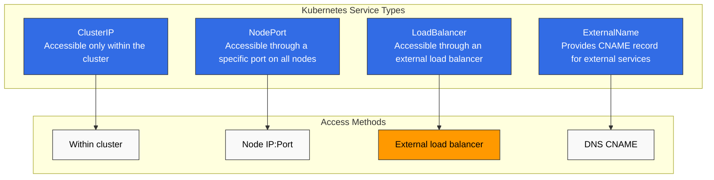
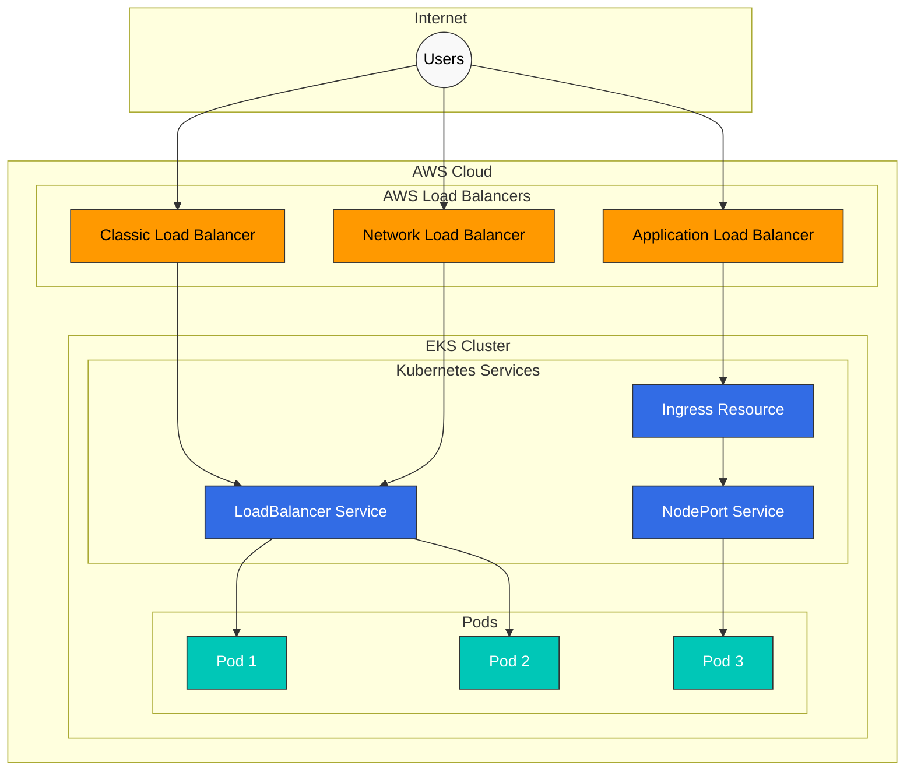
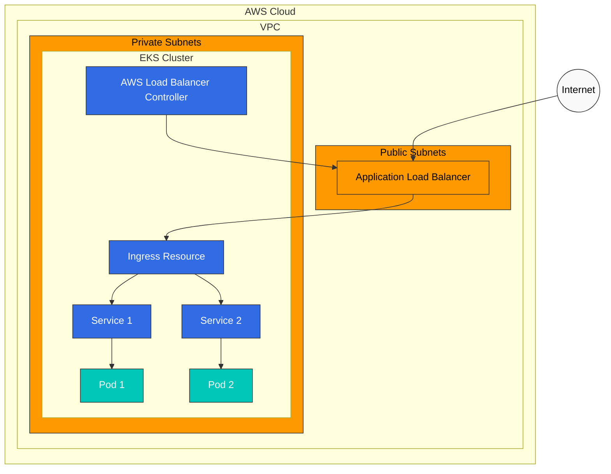
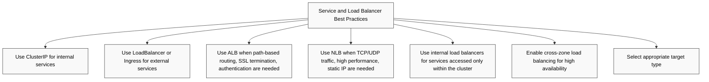
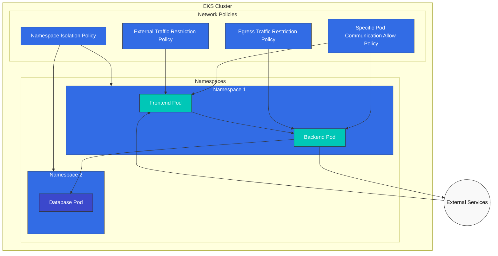
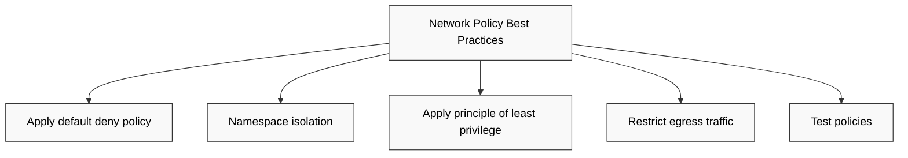
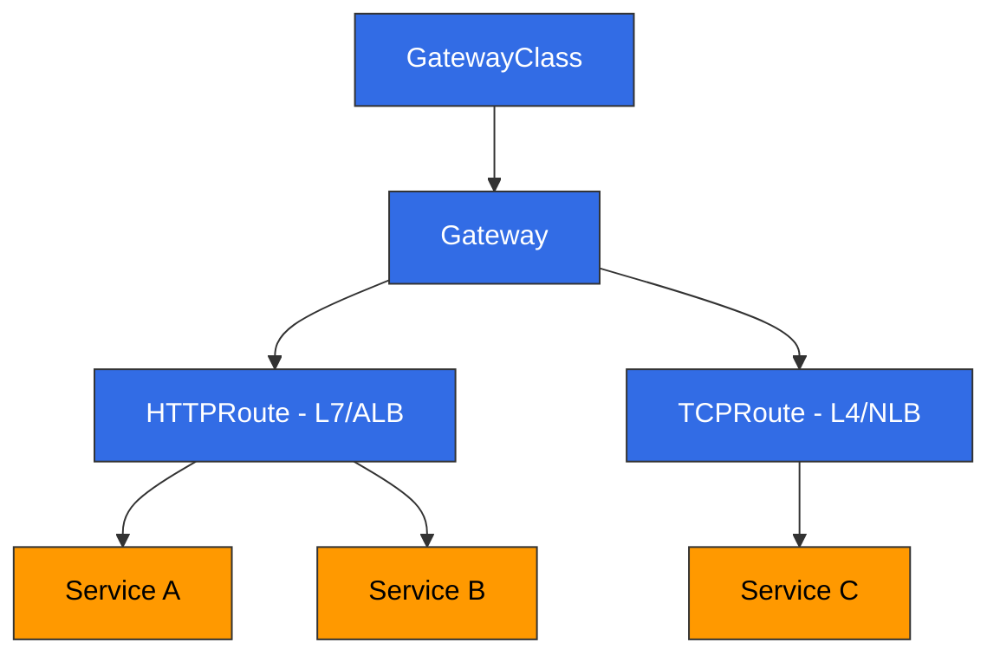

# EKS 网络 - 第 2 部分：Service、Load Balancing 和 Network Policy

## 概述

在本文档中，我们将学习 Amazon EKS 中的 Service（服务）、load balancing 和 network policy。我们将介绍如何通过 Kubernetes Service 暴露应用程序、与 AWS load balancer 的集成，以及如何使用 network policy 控制 Pod 到 Pod 的通信。

## Kubernetes Service 类型

Kubernetes 提供以下 Service 类型：



1. **ClusterIP**：只能在集群内部访问的 Service
2. **NodePort**：可通过所有 Node 上的特定端口访问的 Service
3. **LoadBalancer**：可通过外部 load balancer 访问的 Service
4. **ExternalName**：为外部服务提供 CNAME 记录

### ClusterIP Service

ClusterIP Service 只能在集群内部访问。这是默认的 Service 类型。

```yaml
apiVersion: v1
kind: Service
metadata:
  name: my-service
spec:
  selector:
    app: my-app
  ports:
  - port: 80
    targetPort: 8080
  type: ClusterIP
```

### NodePort Service

NodePort Service 可通过所有 Node 上的特定端口访问。

```yaml
apiVersion: v1
kind: Service
metadata:
  name: my-service
spec:
  selector:
    app: my-app
  ports:
  - port: 80
    targetPort: 8080
    nodePort: 30080
  type: NodePort
```

### LoadBalancer Service

LoadBalancer Service 可通过外部 load balancer 访问。在 EKS 中，它会与 AWS load balancer（CLB、NLB、ALB）集成。

```yaml
apiVersion: v1
kind: Service
metadata:
  name: my-service
spec:
  selector:
    app: my-app
  ports:
  - port: 80
    targetPort: 8080
  type: LoadBalancer
```

### ExternalName Service

ExternalName Service 为外部服务提供 CNAME 记录。

```yaml
apiVersion: v1
kind: Service
metadata:
  name: my-service
spec:
  type: ExternalName
  externalName: my-service.example.com
```

## AWS Load Balancer 集成

EKS 将 Kubernetes Service 与 AWS load balancer 集成，使应用程序可以从外部访问。



### Classic Load Balancer (CLB)

默认情况下，设置为 `type: LoadBalancer` 的 Service 会创建 Classic Load Balancer。但是，CLB 已不再推荐使用，更建议使用 NLB 或 ALB。

```yaml
apiVersion: v1
kind: Service
metadata:
  name: my-service
spec:
  selector:
    app: my-app
  ports:
  - port: 80
    targetPort: 8080
  type: LoadBalancer
```

### Network Load Balancer (NLB)

要使用 NLB，需要向 Service 添加特定 annotation：

```yaml
apiVersion: v1
kind: Service
metadata:
  name: my-service
  annotations:
    service.beta.kubernetes.io/aws-load-balancer-type: nlb
spec:
  selector:
    app: my-app
  ports:
  - port: 80
    targetPort: 8080
  type: LoadBalancer
```

其他 NLB 配置选项：

```yaml
metadata:
  annotations:
    # Create internal NLB
    service.beta.kubernetes.io/aws-load-balancer-internal: "true"

    # Enable cross-zone load balancing
    service.beta.kubernetes.io/aws-load-balancer-cross-zone-load-balancing-enabled: "true"

    # Specify target type (instance or ip)
    service.beta.kubernetes.io/aws-load-balancer-target-group-attributes: preserve_client_ip.enabled=true

    # Enable TCP proxy protocol
    service.beta.kubernetes.io/aws-load-balancer-proxy-protocol: "*"
```

### Application Load Balancer (ALB)

要使用 ALB，需要安装 AWS Load Balancer Controller 并使用 Ingress resource：



1. 安装 AWS Load Balancer Controller：

```bash
# Download IAM policy
curl -o iam-policy.json https://raw.githubusercontent.com/kubernetes-sigs/aws-load-balancer-controller/main/docs/install/iam_policy.json

# Create IAM policy
aws iam create-policy \
  --policy-name AWSLoadBalancerControllerIAMPolicy \
  --policy-document file://iam-policy.json

# Create IAM role and attach policy (using eksctl)
eksctl create iamserviceaccount \
  --cluster=my-cluster \
  --namespace=kube-system \
  --name=aws-load-balancer-controller \
  --attach-policy-arn=arn:aws:iam::123456789012:policy/AWSLoadBalancerControllerIAMPolicy \
  --approve

# Add Helm repository
helm repo add eks https://aws.github.io/eks-charts
helm repo update

# Install AWS Load Balancer Controller
helm install aws-load-balancer-controller eks/aws-load-balancer-controller \
  -n kube-system \
  --set clusterName=my-cluster \
  --set serviceAccount.create=false \
  --set serviceAccount.name=aws-load-balancer-controller
```

2. 创建 Ingress resource：

```yaml
apiVersion: networking.k8s.io/v1
kind: Ingress
metadata:
  name: my-ingress
  annotations:
    kubernetes.io/ingress.class: alb
    alb.ingress.kubernetes.io/scheme: internet-facing
    alb.ingress.kubernetes.io/target-type: ip
spec:
  rules:
  - http:
      paths:
      - path: /
        pathType: Prefix
        backend:
          service:
            name: my-service
            port:
              number: 80
```

其他 ALB 配置选项：

```yaml
metadata:
  annotations:
    # Create internal ALB
    alb.ingress.kubernetes.io/scheme: internal

    # Specify SSL certificate
    alb.ingress.kubernetes.io/certificate-arn: arn:aws:acm:region:account-id:certificate/certificate-id

    # HTTPS redirect
    alb.ingress.kubernetes.io/actions.ssl-redirect: '{"Type": "redirect", "RedirectConfig": {"Protocol": "HTTPS", "Port": "443", "StatusCode": "HTTP_301"}}'

    # Specify target type (instance or ip)
    alb.ingress.kubernetes.io/target-type: ip

    # Specify security groups
    alb.ingress.kubernetes.io/security-groups: sg-xxxx,sg-yyyy
```

### Service 和 Load Balancer 最佳实践



1. **Use ClusterIP for internal services**：对仅在集群内部访问的 Service 使用 ClusterIP 类型。
2. **Use LoadBalancer or Ingress for external services**：对需要外部访问的 Service 使用 LoadBalancer 类型或 Ingress resource。
3. **Use ALB**：当需要基于路径的路由、SSL 终止和身份验证等功能时，使用 ALB。
4. **Use NLB**：当需要 TCP/UDP 流量、高性能和静态 IP 时，使用 NLB。
5. **Use internal load balancers**：对仅在集群内部访问的 Service 使用 internal load balancer。
6. **Enable cross-zone load balancing**：启用 cross-zone load balancing 以实现高可用性。
7. **Select appropriate target type**：选择 `ip` target type 可直接使用 Pod IP 作为 target，或选择 `instance` target type 使用 Node IP 作为 target。

## Network Policy

Network policy 用于控制 Pod 到 Pod 的通信。要在 EKS 中使用 network policy，需要安装支持 network policy 的 CNI plugin（例如 Calico、Cilium）。



### 安装 Calico

Calico 是在 EKS 中实现 network policy 的常用 CNI plugin：

```bash
# Install Calico
kubectl apply -f https://docs.projectcalico.org/manifests/calico-vxlan.yaml

# Check Calico status
kubectl get pods -n kube-system -l k8s-app=calico-node
```

### 默认 Network Policy

默认情况下，如果没有 network policy，所有 Pod 都可以彼此通信。应用 network policy 后，只允许显式允许的流量。

### Namespace 隔离策略

只允许特定 namespace 内 Pod 之间通信的策略：

```yaml
apiVersion: networking.k8s.io/v1
kind: NetworkPolicy
metadata:
  name: namespace-isolation
  namespace: my-namespace
spec:
  podSelector: {}
  policyTypes:
  - Ingress
  ingress:
  - from:
    - podSelector: {}
```

### 允许特定 Pod 通信的策略

只允许具有特定 label 的 Pod 之间通信的策略：

```yaml
apiVersion: networking.k8s.io/v1
kind: NetworkPolicy
metadata:
  name: allow-frontend-to-backend
  namespace: my-namespace
spec:
  podSelector:
    matchLabels:
      app: backend
  policyTypes:
  - Ingress
  ingress:
  - from:
    - podSelector:
        matchLabels:
          app: frontend
    ports:
    - protocol: TCP
      port: 80
```

### 外部流量限制策略

仅允许来自特定 IP 范围的流量的策略：

```yaml
apiVersion: networking.k8s.io/v1
kind: NetworkPolicy
metadata:
  name: allow-external-traffic
  namespace: my-namespace
spec:
  podSelector:
    matchLabels:
      app: web
  policyTypes:
  - Ingress
  ingress:
  - from:
    - ipBlock:
        cidr: 192.168.1.0/24
        except:
        - 192.168.1.10/32
    ports:
    - protocol: TCP
      port: 80
```

### Egress 流量限制策略

只允许 egress 流量到达特定目的地的策略：

```yaml
apiVersion: networking.k8s.io/v1
kind: NetworkPolicy
metadata:
  name: limit-egress-traffic
  namespace: my-namespace
spec:
  podSelector:
    matchLabels:
      app: web
  policyTypes:
  - Egress
  egress:
  - to:
    - podSelector:
        matchLabels:
          app: db
    ports:
    - protocol: TCP
      port: 5432
  - to:
    - ipBlock:
        cidr: 0.0.0.0/0
        except:
        - 10.0.0.0/8
        - 172.16.0.0/12
        - 192.168.0.0/16
    ports:
    - protocol: TCP
      port: 443
```

### Network Policy 最佳实践



1. **Apply default deny policy**：默认拒绝所有流量，并仅显式允许必要流量。
2. **Namespace isolation**：通过限制 namespace 之间的通信来增强安全性。
3. **Apply principle of least privilege**：仅允许最少必要通信。
4. **Restrict egress traffic**：通过限制从 Pod 发出的流量来增强安全性。
5. **Test policies**：在应用 network policy 之前进行测试，以避免意外阻断通信。

---

## Gateway API

> **支持版本**: AWS Load Balancer Controller v2.13.0+
> **最后更新**: February 19, 2026

### 概述

Gateway API 是 Kubernetes 的下一代服务网络 API，它克服了传统 Ingress resource 的限制，并提供更丰富的路由能力。AWS Load Balancer Controller 支持 Gateway API，可通过 Gateway resource 配置 L4（NLB）和 L7（ALB）路由。



### 前提条件

1. 已安装 **AWS Load Balancer Controller v2.13.0 或更高版本**
2. 已启用 **Feature Gates**：部署 controller 时添加 `--feature-gates=EnableGatewayAPI=true` flag
3. **Gateway API CRD 安装**：

```bash
# Install Standard CRDs
kubectl apply -f https://github.com/kubernetes-sigs/gateway-api/releases/download/v1.2.1/standard-install.yaml

# Install Experimental CRDs (TCPRoute, etc.)
kubectl apply -f https://github.com/kubernetes-sigs/gateway-api/releases/download/v1.2.1/experimental-install.yaml

# Install AWS LBC-specific CRDs
kubectl apply -f https://raw.githubusercontent.com/kubernetes-sigs/aws-load-balancer-controller/main/config/crd/gateway-api/crds.yaml
```

### GatewayClass 和 Gateway 设置

GatewayClass 定义 load balancer 的类型，Gateway 表示实际的 load balancer 实例。

```yaml
# GatewayClass definition
apiVersion: gateway.networking.k8s.io/v1
kind: GatewayClass
metadata:
  name: amazon-alb
spec:
  controllerName: gateway.k8s.aws/alb

---
# Gateway definition (L7 - ALB)
apiVersion: gateway.networking.k8s.io/v1
kind: Gateway
metadata:
  name: my-hotel-gateway
  namespace: default
spec:
  gatewayClassName: amazon-alb
  listeners:
  - name: http
    protocol: HTTP
    port: 80
  - name: https
    protocol: HTTPS
    port: 443
    tls:
      mode: Terminate
      certificateRefs:
      - kind: Secret
        name: my-tls-secret
```

### HTTPRoute 示例（L7 → ALB）

HTTPRoute 定义将 HTTP/HTTPS 流量路由到 Service 的规则。附加到 Gateway 的 HTTPRoute 会通过 ALB 分发流量。

```yaml
apiVersion: gateway.networking.k8s.io/v1
kind: HTTPRoute
metadata:
  name: app-route
  namespace: default
spec:
  parentRefs:
  - name: my-hotel-gateway
    sectionName: http
  hostnames:
  - "app.example.com"
  rules:
  - matches:
    - path:
        type: PathPrefix
        value: /api
    backendRefs:
    - name: api-service
      port: 80
      weight: 90
    - name: api-service-v2
      port: 80
      weight: 10
  - matches:
    - path:
        type: PathPrefix
        value: /
    backendRefs:
    - name: frontend-service
      port: 80
```

### TCPRoute 示例（L4 → NLB）

TCPRoute 处理 TCP 流量，并通过 NLB 提供 L4 级别的 load balancing。

```yaml
# GatewayClass for NLB
apiVersion: gateway.networking.k8s.io/v1
kind: GatewayClass
metadata:
  name: amazon-nlb
spec:
  controllerName: gateway.k8s.aws/nlb

---
# NLB Gateway
apiVersion: gateway.networking.k8s.io/v1
kind: Gateway
metadata:
  name: my-nlb-gateway
spec:
  gatewayClassName: amazon-nlb
  listeners:
  - name: tcp
    protocol: TCP
    port: 5432

---
# TCPRoute
apiVersion: gateway.networking.k8s.io/v1alpha2
kind: TCPRoute
metadata:
  name: db-route
spec:
  parentRefs:
  - name: my-nlb-gateway
    sectionName: tcp
  rules:
  - backendRefs:
    - name: postgres-service
      port: 5432
```

### QUIC/HTTP3 支持

通过 Gateway API 创建的 ALB 会自动支持 QUIC/HTTP3 协议。配置 HTTPS listener 后，ALB 会自动处理 QUIC 协议升级。

```yaml
apiVersion: gateway.networking.k8s.io/v1
kind: Gateway
metadata:
  name: quic-gateway
  annotations:
    gateway.k8s.aws/quic-enabled: "true"
spec:
  gatewayClassName: amazon-alb
  listeners:
  - name: https
    protocol: HTTPS
    port: 443
    tls:
      mode: Terminate
      certificateRefs:
      - kind: Secret
        name: tls-cert
```

### Certificate Discovery

AWS Load Balancer Controller 支持两种 certificate discovery 方法：

1. **Static certificate reference**：直接在 Gateway 的 `tls.certificateRefs` 中指定
2. **Hostname-based auto-discovery**：根据 HTTPRoute 的 `hostnames` 字段，自动在 ACM 中搜索匹配的 certificate

```yaml
# Hostname-based auto-discovery example
apiVersion: gateway.networking.k8s.io/v1
kind: HTTPRoute
metadata:
  name: auto-cert-route
spec:
  parentRefs:
  - name: my-gateway
  hostnames:
  - "secure.example.com"  # Auto-discovers matching certificate from ACM
  rules:
  - backendRefs:
    - name: secure-service
      port: 443
```

### Security Group

通过 Gateway API 创建的 load balancer 会自动创建 Security Group：

- **Frontend security group**：允许从 client 到 load balancer 的入站流量
- **Backend security group**：允许从 load balancer 到目标 Pod 的流量

也可以通过 Gateway annotation 指定自定义 Security Group：

```yaml
apiVersion: gateway.networking.k8s.io/v1
kind: Gateway
metadata:
  name: custom-sg-gateway
  annotations:
    gateway.k8s.aws/security-group-ids: sg-0123456789abcdef0,sg-0987654321fedcba0
spec:
  gatewayClassName: amazon-alb
  listeners:
  - name: http
    protocol: HTTP
    port: 80
```

### Out-of-Band Target Group

使用 `TargetGroupName` backendRef 可以将预先存在的 target group 连接到 Gateway API 路由。这对于与现有基础设施集成或迁移场景很有用。

```yaml
apiVersion: gateway.networking.k8s.io/v1
kind: HTTPRoute
metadata:
  name: oob-route
spec:
  parentRefs:
  - name: my-gateway
  rules:
  - backendRefs:
    - group: gateway.k8s.aws
      kind: TargetGroupBinding
      name: existing-target-group
```

### Gateway API 与 Ingress 对比

| Feature | Ingress | Gateway API |
|---------|---------|-------------|
| Routing Model | Host/Path based | Host/Path/Header/Query based |
| Protocol Support | HTTP/HTTPS | HTTP, HTTPS, TCP, TLS, gRPC |
| Traffic Splitting | Annotation based | Native weight-based |
| Role Separation | Single resource | GatewayClass/Gateway/Route separation |
| Extensibility | Limited via annotations | Extensible via Policy attachment |
| L4 Load Balancing | Not supported | TCPRoute/UDPRoute supported |

## 测验

要测试你在本章中学到的内容，请尝试[主题测验](../quizzes/eks/03-eks-networking-part2-quiz.md)。
