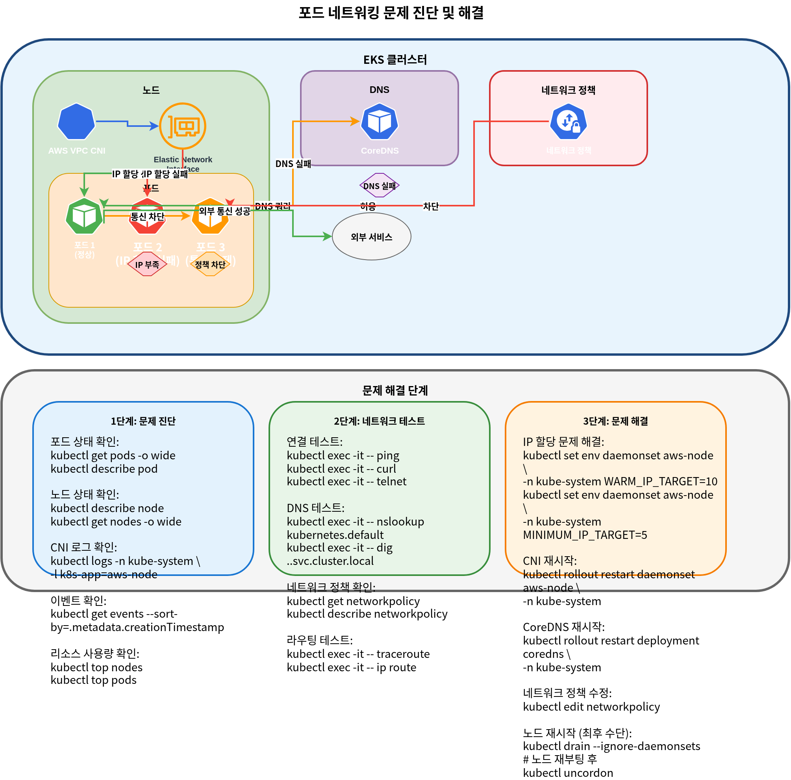
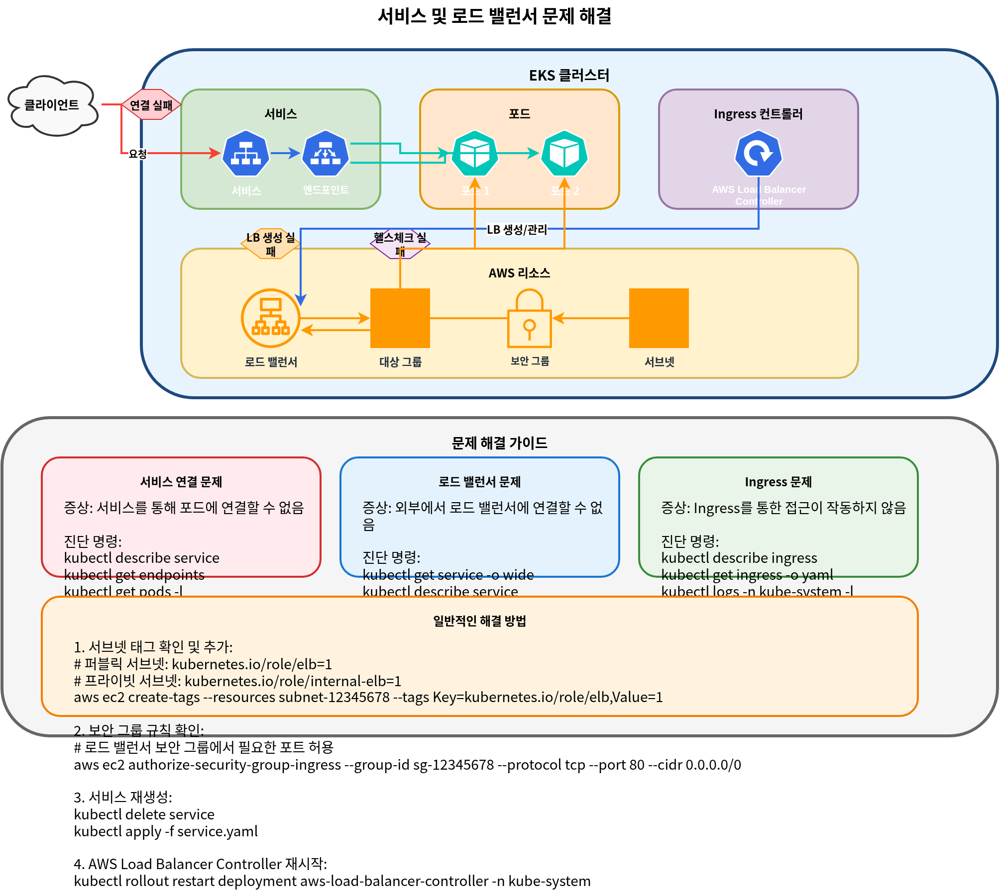

# 第 3 部分：故障排查

## 概述

本文档介绍 Amazon EKS 网络的性能优化、故障排查方法和高级用例。我们将讨论如何优化网络性能、解决常见网络问题，以及利用高级网络功能。


## 网络性能优化

有多种策略可以优化 EKS 集群中的网络性能。


### Instance Type 选择

网络性能会因 Instance Type 的不同而有显著差异。对于网络密集型工作负载，建议选择支持增强网络的 Instance Type。

1. **支持增强网络的 Instance**：
   * C5、M5 和 R5 等 Instance Type 支持增强网络。
   * 这些 Instance 提供更高的带宽、更低的延迟和更低的抖动。
2. **网络带宽**：
   * 更大的 Instance 规格提供更高的网络带宽。
   * 例如，m5.large 提供最高 10Gbps，而 m5.24xlarge 提供最高 25Gbps 的网络带宽。
3. **Elastic Network Adapter (ENA)**：
   * ENA 支持最高 100Gbps 的网络带宽。
   * 大多数现代 Instance Type 都支持 ENA。

### Cluster 网络模式

EKS 支持多种网络模式，每种模式都有不同的性能特征。


1. **AWS VPC CNI（默认）**：
   * 将 VPC IP 地址直接分配给 pods。
   * 由于使用原生 VPC 网络，因此性能优异。
   * 每个 node 可分配的 IP 地址数量有限制。
2. **Custom Networking**：
   * 允许从特定 subnet 为 pods 分配 IP 地址。
   * 可以使用 secondary CIDR blocks 扩展 IP 地址空间。
   * 对网络拓扑提供更精细的控制。
3. **替代 CNI Plugins**：
   * 可以使用 Calico 和 Cilium 等替代 CNI plugins。
   * 这些 plugins 提供额外功能（例如 network policies、加密），但可能带来性能开销。

### MTU 优化

MTU (Maximum Transmission Unit) 是影响网络性能的重要因素。

1. **默认 MTU 设置**：
   * AWS VPC CNI 的默认 MTU 为 9001。
   * 某些网络路径可能需要较小的 MTU。
2. **MTU 调整**：
   * 可以调整 AWS VPC CNI 的 MTU 设置：

```bash
kubectl set env daemonset aws-node -n kube-system ENI_MTU=9001
```

3. **Jumbo Frames**：
   * 使用 jumbo frames (MTU > 1500) 可以提升网络性能。
   * 包括 VPC、subnets、security groups 和 load balancers 在内的所有网络组件都必须支持 jumbo frames。

### TCP 优化

可以优化 TCP 设置以提升网络性能。

1. **TCP Early Demux**：
   * TCP early demux 可以提升性能，但在某些网络模式中可能导致问题。
   * 如有必要，可以将其禁用：

```bash
kubectl set env daemonset aws-node -n kube-system DISABLE_TCP_EARLY_DEMUX=true
```

2. **TCP Keepalive 设置**：
   * 可以调整 TCP keepalive 设置，以优化连接维护和复用。
   * 这对于处理大量短连接的工作负载尤其有用。

```bash
# System-level TCP keepalive settings
sysctl -w net.ipv4.tcp_keepalive_time=60
sysctl -w net.ipv4.tcp_keepalive_intvl=15
sysctl -w net.ipv4.tcp_keepalive_probes=6
```

3. **TCP Buffer Size**：
   * 可以调整 TCP buffer size 以优化吞吐量。
   * 建议根据 Bandwidth Delay Product (BDP) 设置 buffer size。

```bash
# System-level TCP buffer settings
sysctl -w net.core.rmem_max=16777216
sysctl -w net.core.wmem_max=16777216
sysctl -w net.ipv4.tcp_rmem="4096 87380 16777216"
sysctl -w net.ipv4.tcp_wmem="4096 65536 16777216"
```

### Node 放置和本地性

通过优化 node 放置和本地性，可以提升网络性能。


1. **Availability Zone 本地性**：
   * 将频繁通信的 pods 放置在同一 availability zone 中，以降低延迟。
   * 使用 pod affinity 和 anti-affinity 来控制 pod 放置。

```yaml
apiVersion: apps/v1
kind: Deployment
metadata:
  name: web-server
spec:
  replicas: 3
  selector:
    matchLabels:
      app: web
  template:
    metadata:
      labels:
        app: web
    spec:
      affinity:
        podAffinity:
          preferredDuringSchedulingIgnoredDuringExecution:
          - weight: 100
            podAffinityTerm:
              labelSelector:
                matchExpressions:
                - key: app
                  operator: In
                  values:
                  - cache
              topologyKey: topology.kubernetes.io/zone
```

2. **Node 本地性**：
   * 将频繁通信的 pods 放置在同一 node 上，以减少网络跳数。
   * 这对于对延迟敏感的应用程序尤其有用。

```yaml
apiVersion: apps/v1
kind: Deployment
metadata:
  name: web-server
spec:
  replicas: 3
  selector:
    matchLabels:
      app: web
  template:
    metadata:
      labels:
        app: web
    spec:
      affinity:
        podAffinity:
          preferredDuringSchedulingIgnoredDuringExecution:
          - weight: 100
            podAffinityTerm:
              labelSelector:
                matchExpressions:
                - key: app
                  operator: In
                  values:
                  - cache
              topologyKey: kubernetes.io/hostname
```

3. **Topology Aware Hints**：
   * 使用 topology aware hints 将 service 流量保持在同一区域内。
   * 这可以降低 availability zones 之间的数据传输成本并改善延迟。

```yaml
apiVersion: v1
kind: Service
metadata:
  name: my-service
  annotations:
    service.kubernetes.io/topology-aware-hints: "auto"
spec:
  selector:
    app: my-app
  ports:
  - port: 80
    targetPort: 8080
  type: ClusterIP
```

### Network Policy 优化

Network policies 可以增强安全性，但也可能影响性能。

1. **尽量减少 Policies 数量**：
   * 仅应用最少的必要 network policies。
   * 过多 policies 可能导致性能下降。
2. **优化 Policy 范围**：
   * 使用具体 policies，而不是宽泛 policies。
   * 使用 label selectors 限制 policy 范围。
3. **考虑 Policy 评估顺序**：
   * Network policies 会进行累积评估。
   * 首先定义最常用的规则，以优化评估性能。

## 网络故障排查

让我们了解 EKS 集群中可能出现的常见网络问题以及解决方法。


### Pod 网络问题



1. **Pod IP 分配失败**：
   * 症状：Pod 卡在 `ContainerCreating` 状态
   * 原因：Node 可用 IP 地址不足
   * 解决方案：
     * 检查 node 状态：`kubectl describe node <node-name>`
     * 检查 AWS VPC CNI 日志：`kubectl logs -n kube-system -l k8s-app=aws-node`
     * 增加 WARM\_IP\_TARGET：`kubectl set env daemonset aws-node -n kube-system WARM_IP_TARGET=10`
     * 升级 node Instance Type：更改为支持更多 ENIs 和 IP 地址的 Instance Type
2. **Pod-to-Pod 通信问题**：
   * 症状：Pod 无法与其他 pods 通信
   * 原因：Network policies、security groups、路由问题等。
   * 解决方案：
     * 检查 network policies：`kubectl get networkpolicy`
     * 检查 security group 规则：使用 AWS console 或 AWS CLI
     * 从 pod 内部测试网络连接：

```bash
kubectl exec -it <pod-name> -- ping <target-pod-ip>
kubectl exec -it <pod-name> -- curl <target-service-name>
kubectl exec -it <pod-name> -- traceroute <target-pod-ip>
```

3. **DNS 解析问题**：
   * 症状：Pod 无法解析 service 名称
   * 原因：CoreDNS 问题、network policies、security groups 等。
   * 解决方案：
     * 检查 CoreDNS pod 状态：`kubectl get pods -n kube-system -l k8s-app=kube-dns`
     * 检查 CoreDNS 日志：`kubectl logs -n kube-system -l k8s-app=kube-dns`
     * 检查 DNS 配置：`kubectl exec -it <pod-name> -- cat /etc/resolv.conf`
     * 测试 DNS 查询：

```bash
kubectl exec -it <pod-name> -- nslookup kubernetes.default.svc.cluster.local
kubectl exec -it <pod-name> -- dig kubernetes.default.svc.cluster.local
```

### Service 和 Load Balancing 问题



1. **Service 连接问题**：
   * 症状：无法通过 service 连接到 pods
   * 原因：Service selector、pod 状态、endpoints 等。
   * 解决方案：
     * 检查 service 状态：`kubectl describe service <service-name>`
     * 检查 endpoints：`kubectl get endpoints <service-name>`
     * 检查 pod 状态：`kubectl get pods -l <selector-label>`
     * 检查 service DNS：`kubectl exec -it <pod-name> -- nslookup <service-name>`
2. **Load Balancer 问题**：
   * 症状：无法从外部连接到 load balancer
   * 原因：Security groups、subnet tags、health checks 等。
   * 解决方案：
     * 检查 load balancer 状态：使用 AWS console 或 AWS CLI
     * 检查 security group 规则：确认允许入站流量
     * 检查 subnet tags：确认存在适当的 tags
     * 检查 health check 配置：Health check path、port 等。
3. **Ingress 问题**：
   * 症状：无法通过 Ingress 连接到 service
   * 原因：Ingress controller、annotations、certificates 等。
   * 解决方案：
     * 检查 Ingress 状态：`kubectl describe ingress <ingress-name>`
     * 检查 Ingress controller 日志：`kubectl logs -n kube-system -l app.kubernetes.io/name=aws-load-balancer-controller`
     * 检查 ALB 状态：使用 AWS console 或 AWS CLI
     * 检查 target group 状态：确认 targets 处于 healthy 状态

## 测验

要测试你在本章中学到的内容，请尝试完成[主题测验](../quizzes/eks/03-eks-networking-part3-quiz.md)。
