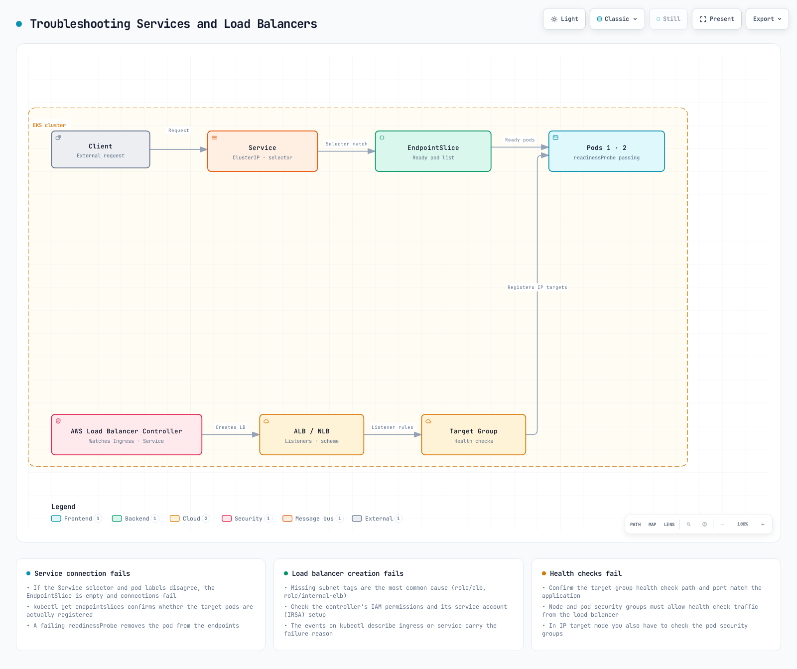

# 第 3 部分：故障排除

## 概述

本文档涵盖 Amazon EKS 网络的性能优化、故障排除方法和高级用例。我们将讨论如何优化网络性能、解决常见网络问题，以及利用高级网络功能。

## 网络性能优化

在 EKS 集群中优化网络性能有多种策略。


[🔍 查看交互式图表](https://www.atomai.click/kubernetes-docs/archmaps/en-eks-03-eks-networking-part3-0.html)

### 实例类型选择

网络性能因实例类型而异。对于网络密集型工作负载，建议选择支持增强型网络的实例类型。

1. **支持增强型网络的实例**：
   * C5、M5 和 R5 等实例类型支持增强型网络。
   * 这些实例提供更高的带宽、更低的延迟和更低的抖动。
2. **网络带宽**：
   * 更大的实例规格提供更高的网络带宽。
   * 例如，m5.large 最多提供 10Gbps，而 m5.24xlarge 最多提供 25Gbps 的网络带宽。
3. **Elastic Network Adapter (ENA)**：
   * ENA 支持最高 100Gbps 的网络带宽。
   * 大多数现代实例类型都支持 ENA。

### 集群网络模式

EKS 支持多种网络模式，每种模式具有不同的性能特征。


[🔍 查看交互式图表](https://www.atomai.click/kubernetes-docs/archmaps/en-eks-03-eks-networking-part3-1.html)

1. **AWS VPC CNI（默认）**：
   * 直接向 Pod 分配 VPC IP 地址。
   * 使用原生 VPC 网络，因此性能出色。
   * 每个节点可分配的 IP 地址数量均有限制。
2. **自定义网络**：
   * 允许向 Pod 分配来自特定子网的 IP 地址。
   * 可以使用辅助 CIDR 块扩展 IP 地址空间。
   * 提供对网络拓扑更精细的控制。
3. **替代 CNI 插件**：
   * 可以使用 Calico 和 Cilium 等替代 CNI 插件。
   * 这些插件提供额外功能（例如网络策略、加密），但可能带来性能开销。

### MTU 优化

MTU（Maximum Transmission Unit）是影响网络性能的重要因素。

1. **默认 MTU 设置**：
   * AWS VPC CNI 的默认 MTU 为 9001。
   * 某些网络路径可能需要更小的 MTU。
2. **MTU 调整**：
   * 可以调整 AWS VPC CNI 的 MTU 设置：

```bash
kubectl set env daemonset aws-node -n kube-system ENI_MTU=9001
```

3. **巨型帧**：
   * 使用巨型帧（MTU > 1500）可以提高网络性能。
   * 包括 VPC、子网、安全组和负载均衡器在内的所有网络组件都必须支持巨型帧。

### TCP 优化

可以优化 TCP 设置以提高网络性能。

1. **TCP Early Demux**：
   * TCP early demux 可以提高性能，但在某些网络模式下可能导致问题。
   * 如有必要，可以禁用它：

```bash
kubectl set env daemonset aws-node -n kube-system DISABLE_TCP_EARLY_DEMUX=true
```

2. **TCP Keepalive 设置**：
   * 可以调整 TCP keepalive 设置，以优化连接维护和复用。
   * 这对于处理大量短连接的工作负载尤其有用。

```bash
# System-level TCP keepalive settings
sysctl -w net.ipv4.tcp_keepalive_time=60
sysctl -w net.ipv4.tcp_keepalive_intvl=15
sysctl -w net.ipv4.tcp_keepalive_probes=6
```

3. **TCP 缓冲区大小**：
   * 可以调整 TCP 缓冲区大小以优化吞吐量。
   * 建议根据带宽延迟积（BDP）设置缓冲区大小。

```bash
# System-level TCP buffer settings
sysctl -w net.core.rmem_max=16777216
sysctl -w net.core.wmem_max=16777216
sysctl -w net.ipv4.tcp_rmem="4096 87380 16777216"
sysctl -w net.ipv4.tcp_wmem="4096 65536 16777216"
```

### 节点放置和局部性

可以通过优化节点放置和局部性来提高网络性能。


[🔍 查看交互式图表](https://www.atomai.click/kubernetes-docs/archmaps/en-eks-03-eks-networking-part3-2.html)

1. **可用区局部性**：
   * 将频繁通信的 Pod 放在同一可用区中以降低延迟。
   * 使用 Pod 亲和性和反亲和性控制 Pod 放置。

```yaml
apiVersion: apps/v1
kind: Deployment
metadata:
  name: web-server
spec:
  replicas: 3
  selector:
    matchLabels:
      app: web
  template:
    metadata:
      labels:
        app: web
    spec:
      affinity:
        podAffinity:
          preferredDuringSchedulingIgnoredDuringExecution:
          - weight: 100
            podAffinityTerm:
              labelSelector:
                matchExpressions:
                - key: app
                  operator: In
                  values:
                  - cache
              topologyKey: topology.kubernetes.io/zone
```

2. **节点局部性**：
   * 将频繁通信的 Pod 放在同一节点上以减少网络跳数。
   * 这对于延迟敏感型应用程序尤其有用。

```yaml
apiVersion: apps/v1
kind: Deployment
metadata:
  name: web-server
spec:
  replicas: 3
  selector:
    matchLabels:
      app: web
  template:
    metadata:
      labels:
        app: web
    spec:
      affinity:
        podAffinity:
          preferredDuringSchedulingIgnoredDuringExecution:
          - weight: 100
            podAffinityTerm:
              labelSelector:
                matchExpressions:
                - key: app
                  operator: In
                  values:
                  - cache
              topologyKey: kubernetes.io/hostname
```

3. **Topology Aware Hints**：
   * 使用 topology aware hints 将 Service 流量保持在同一可用区内。
   * 这会降低可用区之间的数据传输成本并改善延迟。

```yaml
apiVersion: v1
kind: Service
metadata:
  name: my-service
  annotations:
    service.kubernetes.io/topology-aware-hints: "auto"
spec:
  selector:
    app: my-app
  ports:
  - port: 80
    targetPort: 8080
  type: ClusterIP
```

### 网络策略优化

网络策略可增强安全性，但可能影响性能。

1. **最小化策略数量**：
   * 仅应用必要的最少网络策略。
   * 过多策略可能导致性能下降。
2. **优化策略范围**：
   * 使用具体策略，而不是宽泛策略。
   * 使用标签选择器限制策略范围。
3. **考虑策略评估顺序**：
   * 网络策略会累积评估。
   * 先定义最常用的规则，以优化评估性能。

## 网络故障排除

让我们了解 EKS 集群中可能发生的常见网络问题及其解决方法。


[🔍 查看交互式图表](https://www.atomai.click/kubernetes-docs/archmaps/en-eks-03-eks-networking-part3-3.html)

### Pod 网络问题


[🔍 查看交互式图表](https://www.atomai.click/kubernetes-docs/archmaps/en-eks-03-eks-networking-part3-4.html)

1. **Pod IP 分配失败**：
   * 症状：Pod 卡在 `ContainerCreating` 状态
   * 原因：节点没有足够的可用 IP 地址
   * 解决方案：
     * 检查节点状态：`kubectl describe node <node-name>`
     * 检查 AWS VPC CNI 日志：`kubectl logs -n kube-system -l k8s-app=aws-node`
     * 增加 WARM\_IP\_TARGET：`kubectl set env daemonset aws-node -n kube-system WARM_IP_TARGET=10`
     * 升级节点实例类型：更换为支持更多 ENI 和 IP 地址的实例类型
2. **Pod 间通信问题**：
   * 症状：Pod 无法与其他 Pod 通信
   * 原因：网络策略、安全组、路由问题等
   * 解决方案：
     * 检查网络策略：`kubectl get networkpolicy`
     * 检查安全组规则：使用 AWS 控制台或 AWS CLI
     * 从 Pod 内测试网络连接：

```bash
kubectl exec -it <pod-name> -- ping <target-pod-ip>
kubectl exec -it <pod-name> -- curl <target-service-name>
kubectl exec -it <pod-name> -- traceroute <target-pod-ip>
```

3. **DNS 解析问题**：
   * 症状：Pod 无法解析 Service 名称
   * 原因：CoreDNS 问题、网络策略、安全组等
   * 解决方案：
     * 检查 CoreDNS Pod 状态：`kubectl get pods -n kube-system -l k8s-app=kube-dns`
     * 检查 CoreDNS 日志：`kubectl logs -n kube-system -l k8s-app=kube-dns`
     * 检查 DNS 配置：`kubectl exec -it <pod-name> -- cat /etc/resolv.conf`
     * 测试 DNS 查询：

```bash
kubectl exec -it <pod-name> -- nslookup kubernetes.default.svc.cluster.local
kubectl exec -it <pod-name> -- dig kubernetes.default.svc.cluster.local
```

### Service 和负载均衡问题



[🔍 查看交互式图表](https://www.atomai.click/kubernetes-docs/archmaps/en-eks-03-eks-networking-part3-5.html)

1. **Service 连接问题**：
   * 症状：无法通过 Service 连接到 Pod
   * 原因：Service 选择器、Pod 状态、端点等
   * 解决方案：
     * 检查 Service 状态：`kubectl describe service <service-name>`
     * 检查端点：`kubectl get endpoints <service-name>`
     * 检查 Pod 状态：`kubectl get pods -l <selector-label>`
     * 检查 Service DNS：`kubectl exec -it <pod-name> -- nslookup <service-name>`
2. **负载均衡器问题**：
   * 症状：无法从外部连接到负载均衡器
   * 原因：安全组、子网标签、运行状况检查等
   * 解决方案：
     * 检查负载均衡器状态：使用 AWS 控制台或 AWS CLI
     * 检查安全组规则：验证是否允许入站流量
     * 检查子网标签：验证是否存在适当的标签
     * 检查运行状况检查配置：运行状况检查路径、端口等
3. **Ingress 问题**：
   * 症状：无法通过 Ingress 连接到 Service
   * 原因：Ingress controller、注释、证书等
   * 解决方案：
     * 检查 Ingress 状态：`kubectl describe ingress <ingress-name>`
     * 检查 Ingress controller 日志：`kubectl logs -n kube-system -l app.kubernetes.io/name=aws-load-balancer-controller`
     * 检查 ALB 状态：使用 AWS 控制台或 AWS CLI
     * 检查目标组状态：验证目标是否运行正常

## 测验

为检验您在本章中所学的内容，请尝试[主题测验](../quizzes/eks/03-eks-networking-part3-quiz.md)。
