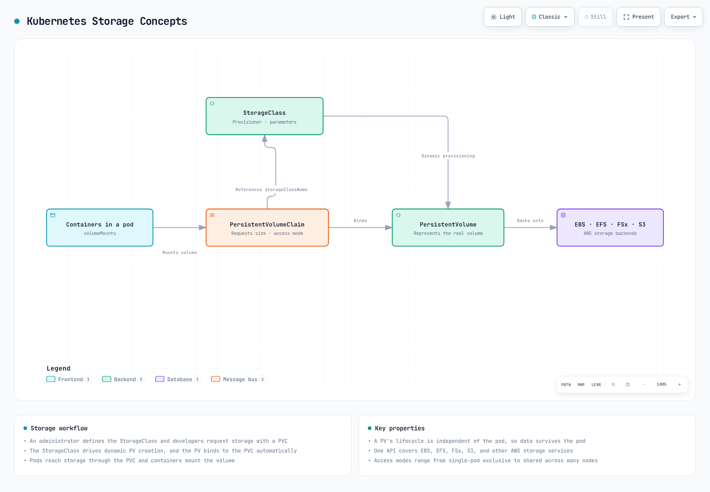
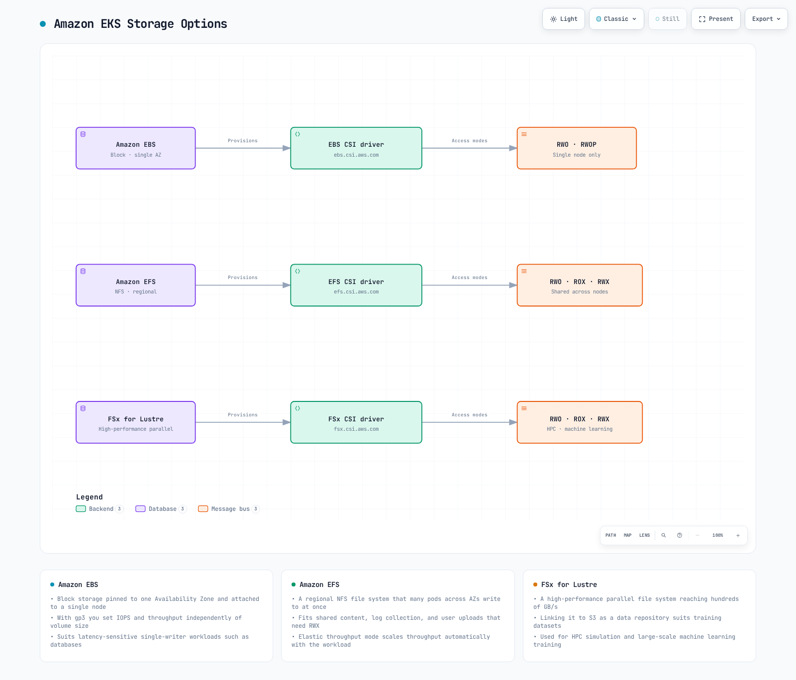
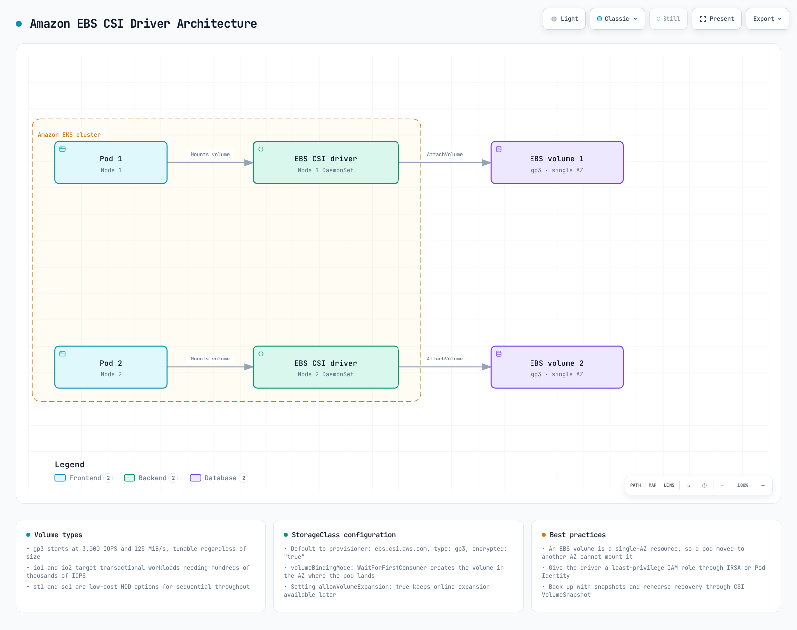
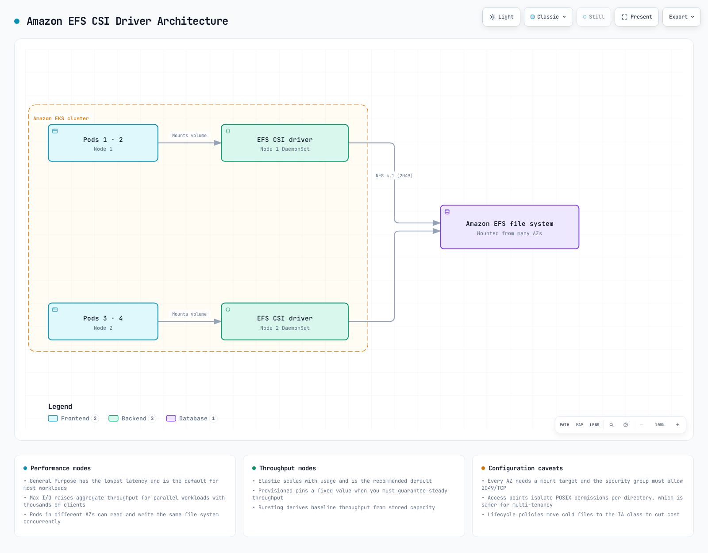
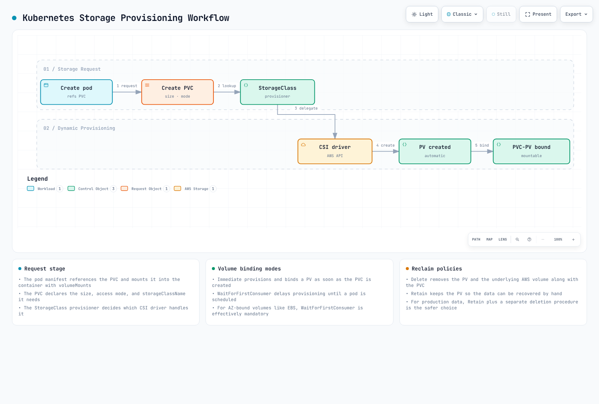

# EKS 存储

> **最后更新**: July 3, 2026

在 Amazon EKS 上运行应用程序时，可以使用多种存储选项来存储和管理数据。本文档介绍 EKS 存储的基本概念，以及如何使用 Amazon EBS (Elastic Block Store) 和 Amazon EFS (Elastic File System)。

## 目录

1. [Kubernetes 存储基本概念](04-eks-storage-part1.md#kubernetes-storage-basic-concepts)
2. [Amazon EKS 存储选项概览](04-eks-storage-part1.md#amazon-eks-storage-options-overview)
3. [使用 Amazon EBS 的存储](04-eks-storage-part1.md#storage-with-amazon-ebs)
4. [使用 Amazon EFS 的存储](04-eks-storage-part1.md#storage-with-amazon-efs)
5. [StorageClass 与动态预配](04-eks-storage-part1.md#storage-classes-and-dynamic-provisioning)

## Kubernetes 存储基本概念

让我们先了解在 Kubernetes 中管理存储的关键概念。



[🔍 查看交互式图表](https://www.atomai.click/kubernetes-docs/archmaps/en-eks-04-eks-storage-part1-0.html)

### Volume

Volume 是可挂载到 Pod 内容器的目录，即使容器重启，数据也会保留。Volume 的生命周期与 Pod 的生命周期相同，当 Pod 被删除时，Volume 也会被删除。

### Persistent Volume (PV)

Persistent Volume 是由管理员预配或通过 StorageClass 动态预配的一块集群存储。PV 的生命周期独立于 Pod，即使 Pod 被删除，PV 仍会保留。

### Persistent Volume Claim (PVC)

Persistent Volume Claim 是用户对存储的请求。PVC 会以指定的大小和访问模式请求存储，该请求会绑定到合适的 PV。

### StorageClass

StorageClass 描述管理员提供的存储“类别”。使用 StorageClass 可以在创建 PVC 时动态预配 PV。

### 访问模式

Kubernetes 支持以下访问模式：

* **ReadWriteOnce (RWO)**：可由单个节点以读/写方式挂载
* **ReadOnlyMany (ROX)**：可由多个节点以只读方式挂载
* **ReadWriteMany (RWX)**：可由多个节点以读/写方式挂载
* **ReadWriteOncePod (RWOP)**：只能由单个 Pod 以读/写方式挂载（Kubernetes 1.22+）

## Amazon EKS 存储选项概览

在 Amazon EKS 中，您可以利用多种 AWS 存储服务为容器化应用程序提供存储。



[🔍 查看交互式图表](https://www.atomai.click/kubernetes-docs/archmaps/en-eks-04-eks-storage-part1-1.html)

### 主要存储选项

1. **Amazon EBS (Elastic Block Store)**
   * 块存储，可挂载到单个节点（RWO）
   * 高性能、持久的块存储
   * 适用于数据库、有状态应用程序
2. **Amazon EFS (Elastic File System)**
   * 完全托管的 NFS 文件系统
   * 可从多个节点同时挂载（RWX）
   * 适用于需要共享文件系统的工作负载
3. **Amazon FSx for Lustre**
   * 高性能文件系统
   * 适用于机器学习、HPC、大数据分析
   * 可从多个节点同时挂载（RWX）
4. **Amazon S3 (Simple Storage Service)**
   * 对象存储
   * 无法直接作为 Volume 挂载，但可通过 S3 API 访问
   * 适用于大规模数据存储
5. **EC2 Instance Store (本地 NVMe)**
   * 物理附加到 EC2 实例的临时本地 NVMe 存储，提供极低延迟
   * EC2 Instance Store CSI Driver 于 2026 年 5 月作为 Amazon EKS 附加组件达到正式发布 (GA)，因此现在可以从 EKS Console/CLI 作为标准附加组件安装和管理（此前需要通过社区清单手动安装）。该驱动程序会自动管理 Volume 生命周期，降低运维开销
   * 适用于 AI/ML 临时数据处理、Spark/Hadoop 本地缓存、高吞吐量日志处理和数据库缓存层
   * 成本：驱动程序本身免费；您只需为包含 instance store 的底层 EC2 实例付费（[来源](https://aws.amazon.com/about-aws/whats-new/2026/05/ec2-csi-eks/)）

### 存储选项对比

| 存储选项     | 类型               | 访问模式    | 性能                   | 使用场景                                                           |
| ------------------ | ------------------ | -------------- | ----------------------------- | ------------------------------------------------------------------- |
| Amazon EBS         | 块              | RWO            | 高                          | 数据库、有状态应用程序                                    |
| Amazon EFS         | 文件               | RWX            | 中                        | 共享文件、Web 服务器、CMS                                      |
| FSx for Lustre     | 文件               | RWX            | 非常高                     | HPC、ML 训练、大数据                                          |
| Amazon S3          | 对象             | API 访问     | 中                        | 备份、归档、静态内容                                     |
| EC2 Instance Store | 块（本地 NVMe） | RWO，临时 | 非常高（超低延迟） | AI/ML 临时数据、本地缓存、高吞吐量日志处理 |

## 使用 Amazon EBS 的存储

Amazon EBS 提供可附加到 EC2 实例的块级存储 Volume。在 EKS 中，您可以通过 EBS CSI (Container Storage Interface) 驱动程序将 EBS Volume 挂载到 Kubernetes Pod。



[🔍 查看交互式图表](https://www.atomai.click/kubernetes-docs/archmaps/en-eks-04-eks-storage-part1-2.html)

### 安装 EBS CSI Driver

要在 EKS 中使用 EBS Volume，您需要安装 EBS CSI Driver。此驱动程序以 Amazon EKS 附加组件的形式提供。

```bash
# Install EBS CSI driver
eksctl create addon --name aws-ebs-csi-driver --cluster my-cluster --version latest

# Or using AWS CLI
aws eks create-addon --cluster-name my-cluster --addon-name aws-ebs-csi-driver --addon-version latest
```

### 创建 EBS StorageClass

创建一个 StorageClass，用于动态预配 EBS Volume。此处使用 gp3 Volume 类型。

```yaml
apiVersion: storage.k8s.io/v1
kind: StorageClass
metadata:
  name: ebs-gp3
provisioner: ebs.csi.aws.com
volumeBindingMode: WaitForFirstConsumer
parameters:
  type: gp3
  encrypted: "true"
  fsType: ext4
```

### 创建 Persistent Volume Claim (PVC)

创建供应用程序使用的 PVC。

```yaml
apiVersion: v1
kind: PersistentVolumeClaim
metadata:
  name: ebs-claim
spec:
  accessModes:
    - ReadWriteOnce
  storageClassName: ebs-gp3
  resources:
    requests:
      storage: 10Gi
```

### 在 Pod 中使用 PVC

在 Pod 中挂载已创建的 PVC。

```yaml
apiVersion: v1
kind: Pod
metadata:
  name: app-with-ebs
spec:
  containers:
  - name: app
    image: nginx
    volumeMounts:
    - mountPath: "/data"
      name: ebs-volume
  volumes:
  - name: ebs-volume
    persistentVolumeClaim:
      claimName: ebs-claim
```

### EBS Volume 快照

您可以创建 EBS Volume 的快照来备份数据。

```yaml
apiVersion: snapshot.storage.k8s.io/v1
kind: VolumeSnapshot
metadata:
  name: ebs-snapshot
spec:
  volumeSnapshotClassName: csi-aws-vsc
  source:
    persistentVolumeClaimName: ebs-claim
```

### EBS Volume 扩容

您可以根据需要扩展 EBS Volume 的大小。

```yaml
apiVersion: v1
kind: PersistentVolumeClaim
metadata:
  name: ebs-claim
spec:
  accessModes:
    - ReadWriteOnce
  storageClassName: ebs-gp3
  resources:
    requests:
      storage: 20Gi  # Expanded from 10Gi to 20Gi
```

### EBS Volume 类型与性能

Amazon EBS 提供多种 Volume 类型：

| Volume 类型 | 描述              | 使用场景                                   |
| ----------- | ------------------------ | ------------------------------------------- |
| gp3         | 通用 SSD      | 适用于大多数工作负载，经济高效 |
| io2         | 预配 IOPS SSD     | 高性能数据库                  |
| st1         | 吞吐量优化 HDD | 大数据、日志处理                    |
| sc1         | Cold HDD                 | 不经常访问的数据                  |

对于 EKS，建议使用 gp3 Volume 类型。gp3 在提供一致性能的同时具有良好的成本效益。

## 使用 Amazon EFS 的存储

Amazon EFS 是一个完全托管的 NFS 文件系统，可从多个 EC2 实例同时访问。在 EKS 中，您可以通过 EFS CSI Driver 将 EFS 文件系统同时挂载到多个 Pod。



[🔍 查看交互式图表](https://www.atomai.click/kubernetes-docs/archmaps/en-eks-04-eks-storage-part1-3.html)

### 安装 EFS CSI Driver

要在 EKS 中使用 EFS，您需要安装 EFS CSI Driver。

```bash
# Install EFS CSI driver
eksctl create addon --name aws-efs-csi-driver --cluster my-cluster --version latest

# Or using AWS CLI
aws eks create-addon --cluster-name my-cluster --addon-name aws-efs-csi-driver --addon-version latest
```

### 创建 EFS 文件系统

使用 AWS Management Console、AWS CLI 或 AWS CloudFormation 创建 EFS 文件系统。

```bash
# Create EFS file system using AWS CLI
aws efs create-file-system \
  --performance-mode generalPurpose \
  --throughput-mode bursting \
  --encrypted \
  --tags Key=Name,Value=MyEFSFileSystem

# Save file system ID
EFS_FS_ID=$(aws efs describe-file-systems --query "FileSystems[?Name=='MyEFSFileSystem'].FileSystemId" --output text)

# Get EKS cluster VPC ID
VPC_ID=$(aws eks describe-cluster --name my-cluster --query "cluster.resourcesVpcConfig.vpcId" --output text)

# Create security group
aws ec2 create-security-group \
  --group-name MyEFSSecurityGroup \
  --description "Security group for EFS mount targets" \
  --vpc-id $VPC_ID

SG_ID=$(aws ec2 describe-security-groups \
  --filters Name=group-name,Values=MyEFSSecurityGroup \
  --query "SecurityGroups[0].GroupId" --output text)

# Allow NFS traffic
aws ec2 authorize-security-group-ingress \
  --group-id $SG_ID \
  --protocol tcp \
  --port 2049 \
  --cidr 10.0.0.0/16

# Get subnet IDs
SUBNET_IDS=$(aws ec2 describe-subnets \
  --filters "Name=vpc-id,Values=$VPC_ID" \
  --query "Subnets[*].SubnetId" --output text)

# Create mount target in each subnet
for SUBNET_ID in $SUBNET_IDS; do
  aws efs create-mount-target \
    --file-system-id $EFS_FS_ID \
    --subnet-id $SUBNET_ID \
    --security-groups $SG_ID
done
```

### 创建 EFS StorageClass

创建一个用于使用 EFS 的 StorageClass。

```yaml
apiVersion: storage.k8s.io/v1
kind: StorageClass
metadata:
  name: efs-sc
provisioner: efs.csi.aws.com
parameters:
  provisioningMode: efs-ap
  fileSystemId: fs-0123456789abcdef0  # Created EFS file system ID
  directoryPerms: "700"
```

### 创建 Persistent Volume Claim (PVC)

创建一个用于使用 EFS 的 PVC。

```yaml
apiVersion: v1
kind: PersistentVolumeClaim
metadata:
  name: efs-claim
spec:
  accessModes:
    - ReadWriteMany  # Can read/write simultaneously from multiple nodes
  storageClassName: efs-sc
  resources:
    requests:
      storage: 5Gi
```

### 在 Pod 中使用 EFS PVC

在 Pod 中挂载已创建的 PVC。

```yaml
apiVersion: v1
kind: Pod
metadata:
  name: app-with-efs
spec:
  containers:
  - name: app
    image: nginx
    volumeMounts:
    - mountPath: "/shared-data"
      name: efs-volume
  volumes:
  - name: efs-volume
    persistentVolumeClaim:
      claimName: efs-claim
```

### EFS Access Point

使用 EFS Access Point 可以将访问限制到特定目录，并设置用户和组权限。

```yaml
apiVersion: v1
kind: PersistentVolume
metadata:
  name: efs-pv
spec:
  capacity:
    storage: 5Gi
  volumeMode: Filesystem
  accessModes:
    - ReadWriteMany
  persistentVolumeReclaimPolicy: Retain
  storageClassName: efs-sc
  csi:
    driver: efs.csi.aws.com
    volumeHandle: fs-0123456789abcdef0::fsap-0123456789abcdef0
    # volumeHandle format: {EFS file system ID}::{EFS access point ID}
```

### EFS 性能模式与吞吐量模式

Amazon EFS 提供两种性能模式和三种吞吐量模式：

**性能模式**：

* **General Purpose**：建议用于大多数工作负载
* **Max I/O**：适用于需要高并行处理的工作负载

**吞吐量模式**：

* **Bursting**：默认模式，根据文件系统大小提供突增积分
* **Provisioned**：需要一致吞吐量时使用
* **Elastic**：根据工作负载自动调整吞吐量（推荐）

## StorageClass 与动态预配

使用 Kubernetes StorageClass 可动态预配 Persistent Volume。在 EKS 中，您可以为各种 AWS 存储服务配置 StorageClass。



[🔍 查看交互式图表](https://www.atomai.click/kubernetes-docs/archmaps/en-eks-04-eks-storage-part1-4.html)

### Volume 绑定模式

StorageClass 中的 `volumeBindingMode` 字段决定创建 PVC 时如何绑定 PV：

* **Immediate**：创建 PVC 时立即预配并绑定 PV。
* **WaitForFirstConsumer**：延迟 PV 预配，直到 Pod 尝试使用 PVC。

对于 EBS 等节点本地存储，建议使用 `WaitForFirstConsumer`。这可确保在调度 Pod 的节点所在的相同可用区中创建 Volume。

### 设置默认 StorageClass

将特定 StorageClass 设置为默认值后，即使 PVC 中未指定 StorageClass，也可以使用该 StorageClass。

```yaml
apiVersion: storage.k8s.io/v1
kind: StorageClass
metadata:
  name: ebs-gp3
  annotations:
    storageclass.kubernetes.io/is-default-class: "true"
provisioner: ebs.csi.aws.com
volumeBindingMode: WaitForFirstConsumer
parameters:
  type: gp3
  encrypted: "true"
```

### StorageClass 示例

**1. EBS gp3 StorageClass**

```yaml
apiVersion: storage.k8s.io/v1
kind: StorageClass
metadata:
  name: ebs-gp3
provisioner: ebs.csi.aws.com
volumeBindingMode: WaitForFirstConsumer
parameters:
  type: gp3
  encrypted: "true"
  iops: "3000"
  throughput: "125"
```

**2. EFS StorageClass**

```yaml
apiVersion: storage.k8s.io/v1
kind: StorageClass
metadata:
  name: efs-sc
provisioner: efs.csi.aws.com
parameters:
  provisioningMode: efs-ap
  fileSystemId: fs-0123456789abcdef0
  directoryPerms: "700"
```

**3. FSx for Lustre StorageClass**

```yaml
apiVersion: storage.k8s.io/v1
kind: StorageClass
metadata:
  name: fsx-lustre
provisioner: fsx.csi.aws.com
parameters:
  subnetId: subnet-0123456789abcdef0
  securityGroupIds: sg-0123456789abcdef0
  deploymentType: SCRATCH_2
  automaticBackupRetentionDays: "0"
  dailyAutomaticBackupStartTime: "00:00"
  perUnitStorageThroughput: "200"
  dataCompressionType: "NONE"
```

### 回收策略

Persistent Volume 的回收策略决定删除 PVC 时如何处理 PV 及其数据：

* **Delete**：删除 PVC 时，PV 及其数据也会被删除。
* **Retain**：删除 PVC 时，PV 和数据会被保留。管理员必须手动清理。
* **Recycle**：已弃用的策略，请改用动态预配和 StorageClass。

您可以使用 StorageClass 中的 `persistentVolumeReclaimPolicy` 字段设置回收策略：

```yaml
apiVersion: storage.k8s.io/v1
kind: StorageClass
metadata:
  name: ebs-gp3-retain
provisioner: ebs.csi.aws.com
volumeBindingMode: WaitForFirstConsumer
reclaimPolicy: Retain
parameters:
  type: gp3
  encrypted: "true"
```

## 结论

在 Amazon EKS 中，您可以使用多种存储选项来配置满足应用程序要求的存储解决方案。本文档重点介绍了 EBS 和 EFS 的基本概念及配置方法。下一篇文档将介绍使用 FSx for Lustre 和 S3 的高级存储配置。

## 测验

要测试您在本章所学的内容，请尝试完成[主题测验](../quizzes/eks/04-eks-storage-part1-quiz.md)。
