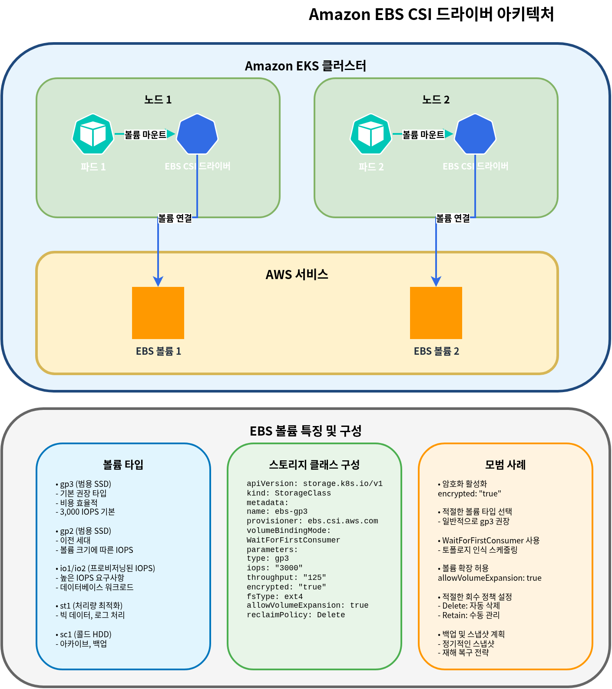

# EKS 存储

> **最后更新**: July 3, 2026

在 Amazon EKS 上运行应用程序时，可以使用多种存储选项来存储和管理数据。本文档介绍 EKS 存储的基本概念，以及如何使用 Amazon EBS (Elastic Block Store) 和 Amazon EFS (Elastic File System)。

## 目录

1. [Kubernetes 存储基本概念](04-eks-storage-part1.md#kubernetes-storage-basic-concepts)
2. [Amazon EKS 存储选项概览](04-eks-storage-part1.md#amazon-eks-storage-options-overview)
3. [使用 Amazon EBS 进行存储](04-eks-storage-part1.md#storage-with-amazon-ebs)
4. [使用 Amazon EFS 进行存储](04-eks-storage-part1.md#storage-with-amazon-efs)
5. [Storage Classes 和 Dynamic Provisioning](04-eks-storage-part1.md#storage-classes-and-dynamic-provisioning)

## Kubernetes 存储基本概念

首先了解在 Kubernetes 中管理存储的关键概念。


### Volume

Volume 是一个可以挂载到 Pod 内容器的目录，即使容器重启，数据也会保留。Volume 的生命周期与 Pod 的生命周期相同；当 Pod 被删除时，Volume 也会被删除。

### Persistent Volume (PV)

Persistent Volume 是由管理员预置或通过 storage class 动态预置的一块集群存储。PV 的生命周期独立于 Pod，即使 Pod 被删除，PV 也会保留。

### Persistent Volume Claim (PVC)

Persistent Volume Claim 是用户对存储的请求。PVC 会以特定大小和访问模式请求存储，并将该请求绑定到合适的 PV。

### StorageClass

StorageClass 描述管理员提供的存储“类别”。使用 storage class 可以在创建 PVC 时动态预置 PV。

### Access Modes

Kubernetes 支持以下 Access Modes：

* **ReadWriteOnce (RWO)**: 可由单个 Node 以读/写方式挂载
* **ReadOnlyMany (ROX)**: 可由多个 Node 以只读方式挂载
* **ReadWriteMany (RWX)**: 可由多个 Node 以读/写方式挂载
* **ReadWriteOncePod (RWOP)**: 只能由单个 Pod 以读/写方式挂载 (Kubernetes 1.22+)

## Amazon EKS 存储选项概览

在 Amazon EKS 中，你可以利用各种 AWS 存储服务为容器化应用程序提供存储。


### 主要存储选项

1. **Amazon EBS (Elastic Block Store)**
   * Block storage，可挂载到单个 Node (RWO)
   * 高性能、持久的 block storage
   * 适用于数据库、有状态应用程序
2. **Amazon EFS (Elastic File System)**
   * 完全托管的 NFS file system
   * 可从多个 Node 同时挂载 (RWX)
   * 适用于需要共享 file system 的工作负载
3. **Amazon FSx for Lustre**
   * 高性能 file system
   * 适用于 machine learning、HPC、big data analytics
   * 可从多个 Node 同时挂载 (RWX)
4. **Amazon S3 (Simple Storage Service)**
   * Object storage
   * 不能作为 Volume 直接挂载，但可通过 S3 API 访问
   * 适用于大规模数据存储
5. **EC2 Instance Store (Local NVMe)**
   * 物理连接到 EC2 instance 的临时本地 NVMe storage，提供极低延迟
   * EC2 Instance Store CSI Driver 于 2026 年 5 月作为 Amazon EKS add-on 达到 general availability (GA)，因此现在可以从 EKS Console/CLI 作为标准 add-on 安装和管理（以前需要通过 community manifests 手动安装）。该 driver 会自动管理 Volume 生命周期，降低运维开销
   * 适用于 AI/ML 临时数据处理、Spark/Hadoop 本地缓存、高吞吐日志处理和数据库缓存层
   * 成本：driver 本身免费；你只需为包含 instance store 的底层 EC2 instance 付费 ([source](https://aws.amazon.com/about-aws/whats-new/2026/05/ec2-csi-eks/))

### Storage Options Comparison

| Storage Option     | Type               | Access Mode    | Performance                   | Use Cases                                                           |
| ------------------ | ------------------ | -------------- | ----------------------------- | ------------------------------------------------------------------- |
| Amazon EBS         | Block              | RWO            | High                          | Databases, stateful applications                                    |
| Amazon EFS         | File               | RWX            | Medium                        | Shared files, web servers, CMS                                      |
| FSx for Lustre     | File               | RWX            | Very High                     | HPC, ML training, big data                                          |
| Amazon S3          | Object             | API Access     | Medium                        | Backup, archive, static content                                     |
| EC2 Instance Store | Block (local NVMe) | RWO, ephemeral | Very High (ultra-low latency) | AI/ML ephemeral data, local caching, high-throughput log processing |

## 使用 Amazon EBS 进行存储

Amazon EBS 提供可附加到 EC2 instance 的 block-level storage volume。在 EKS 中，你可以通过 EBS CSI (Container Storage Interface) driver 将 EBS volume 挂载到 Kubernetes Pod。



### 安装 EBS CSI Driver

要在 EKS 中使用 EBS volume，需要安装 EBS CSI driver。该 driver 以 Amazon EKS add-on 的形式提供。

```bash
# Install EBS CSI driver
eksctl create addon --name aws-ebs-csi-driver --cluster my-cluster --version latest

# Or using AWS CLI
aws eks create-addon --cluster-name my-cluster --addon-name aws-ebs-csi-driver --addon-version latest
```

### 创建 EBS Storage Class

创建一个用于动态预置 EBS volume 的 storage class。这里使用 gp3 volume type。

```yaml
apiVersion: storage.k8s.io/v1
kind: StorageClass
metadata:
  name: ebs-gp3
provisioner: ebs.csi.aws.com
volumeBindingMode: WaitForFirstConsumer
parameters:
  type: gp3
  encrypted: "true"
  fsType: ext4
```

### 创建 Persistent Volume Claim (PVC)

创建一个供你的应用程序使用的 PVC。

```yaml
apiVersion: v1
kind: PersistentVolumeClaim
metadata:
  name: ebs-claim
spec:
  accessModes:
    - ReadWriteOnce
  storageClassName: ebs-gp3
  resources:
    requests:
      storage: 10Gi
```

### 在 Pod 中使用 PVC

在 Pod 中挂载已创建的 PVC。

```yaml
apiVersion: v1
kind: Pod
metadata:
  name: app-with-ebs
spec:
  containers:
  - name: app
    image: nginx
    volumeMounts:
    - mountPath: "/data"
      name: ebs-volume
  volumes:
  - name: ebs-volume
    persistentVolumeClaim:
      claimName: ebs-claim
```

### EBS Volume Snapshots

你可以创建 EBS volume 的 snapshot 来备份数据。

```yaml
apiVersion: snapshot.storage.k8s.io/v1
kind: VolumeSnapshot
metadata:
  name: ebs-snapshot
spec:
  volumeSnapshotClassName: csi-aws-vsc
  source:
    persistentVolumeClaimName: ebs-claim
```

### EBS Volume Expansion

你可以根据需要扩展 EBS volume 的大小。

```yaml
apiVersion: v1
kind: PersistentVolumeClaim
metadata:
  name: ebs-claim
spec:
  accessModes:
    - ReadWriteOnce
  storageClassName: ebs-gp3
  resources:
    requests:
      storage: 20Gi  # Expanded from 10Gi to 20Gi
```

### EBS Volume Types and Performance

Amazon EBS 提供多种 volume type：

| Volume Type | Description              | Use Cases                                   |
| ----------- | ------------------------ | ------------------------------------------- |
| gp3         | General Purpose SSD      | Suitable for most workloads, cost-effective |
| io2         | Provisioned IOPS SSD     | High-performance databases                  |
| st1         | Throughput Optimized HDD | Big data, log processing                    |
| sc1         | Cold HDD                 | Infrequently accessed data                  |

对于 EKS，推荐使用 gp3 volume type。gp3 在提供稳定性能的同时具有成本效益。

## 使用 Amazon EFS 进行存储

Amazon EFS 是一个完全托管的 NFS file system，可从多个 EC2 instance 同时访问。在 EKS 中，你可以通过 EFS CSI driver 将 EFS file system 同时挂载到多个 Pod。


### 安装 EFS CSI Driver

要在 EKS 中使用 EFS，需要安装 EFS CSI driver。

```bash
# Install EFS CSI driver
eksctl create addon --name aws-efs-csi-driver --cluster my-cluster --version latest

# Or using AWS CLI
aws eks create-addon --cluster-name my-cluster --addon-name aws-efs-csi-driver --addon-version latest
```

### 创建 EFS File System

使用 AWS Management Console、AWS CLI 或 AWS CloudFormation 创建 EFS file system。

```bash
# Create EFS file system using AWS CLI
aws efs create-file-system \
  --performance-mode generalPurpose \
  --throughput-mode bursting \
  --encrypted \
  --tags Key=Name,Value=MyEFSFileSystem

# Save file system ID
EFS_FS_ID=$(aws efs describe-file-systems --query "FileSystems[?Name=='MyEFSFileSystem'].FileSystemId" --output text)

# Get EKS cluster VPC ID
VPC_ID=$(aws eks describe-cluster --name my-cluster --query "cluster.resourcesVpcConfig.vpcId" --output text)

# Create security group
aws ec2 create-security-group \
  --group-name MyEFSSecurityGroup \
  --description "Security group for EFS mount targets" \
  --vpc-id $VPC_ID

SG_ID=$(aws ec2 describe-security-groups \
  --filters Name=group-name,Values=MyEFSSecurityGroup \
  --query "SecurityGroups[0].GroupId" --output text)

# Allow NFS traffic
aws ec2 authorize-security-group-ingress \
  --group-id $SG_ID \
  --protocol tcp \
  --port 2049 \
  --cidr 10.0.0.0/16

# Get subnet IDs
SUBNET_IDS=$(aws ec2 describe-subnets \
  --filters "Name=vpc-id,Values=$VPC_ID" \
  --query "Subnets[*].SubnetId" --output text)

# Create mount target in each subnet
for SUBNET_ID in $SUBNET_IDS; do
  aws efs create-mount-target \
    --file-system-id $EFS_FS_ID \
    --subnet-id $SUBNET_ID \
    --security-groups $SG_ID
done
```

### 创建 EFS Storage Class

创建一个用于使用 EFS 的 storage class。

```yaml
apiVersion: storage.k8s.io/v1
kind: StorageClass
metadata:
  name: efs-sc
provisioner: efs.csi.aws.com
parameters:
  provisioningMode: efs-ap
  fileSystemId: fs-0123456789abcdef0  # Created EFS file system ID
  directoryPerms: "700"
```

### 创建 Persistent Volume Claim (PVC)

创建一个用于使用 EFS 的 PVC。

```yaml
apiVersion: v1
kind: PersistentVolumeClaim
metadata:
  name: efs-claim
spec:
  accessModes:
    - ReadWriteMany  # Can read/write simultaneously from multiple nodes
  storageClassName: efs-sc
  resources:
    requests:
      storage: 5Gi
```

### 在 Pod 中使用 EFS PVC

在 Pod 中挂载已创建的 PVC。

```yaml
apiVersion: v1
kind: Pod
metadata:
  name: app-with-efs
spec:
  containers:
  - name: app
    image: nginx
    volumeMounts:
    - mountPath: "/shared-data"
      name: efs-volume
  volumes:
  - name: efs-volume
    persistentVolumeClaim:
      claimName: efs-claim
```

### EFS Access Points

使用 EFS access point 可以限制对特定目录的访问，并设置用户和组权限。

```yaml
apiVersion: v1
kind: PersistentVolume
metadata:
  name: efs-pv
spec:
  capacity:
    storage: 5Gi
  volumeMode: Filesystem
  accessModes:
    - ReadWriteMany
  persistentVolumeReclaimPolicy: Retain
  storageClassName: efs-sc
  csi:
    driver: efs.csi.aws.com
    volumeHandle: fs-0123456789abcdef0::fsap-0123456789abcdef0
    # volumeHandle format: {EFS file system ID}::{EFS access point ID}
```

### EFS Performance Modes and Throughput Modes

Amazon EFS 提供两种 performance mode 和三种 throughput mode：

**Performance Modes**:

* **General Purpose**: 推荐用于大多数工作负载
* **Max I/O**: 适用于需要高并行处理的工作负载

**Throughput Modes**:

* **Bursting**: 默认模式，根据 file system 大小提供 burst credits
* **Provisioned**: 需要稳定吞吐量时使用
* **Elastic**: 根据工作负载自动调整吞吐量（推荐）

## Storage Classes 和 Dynamic Provisioning

使用 Kubernetes storage class 可以动态预置 persistent volume。在 EKS 中，你可以为各种 AWS 存储服务配置 storage class。


### Volume Binding Modes

storage class 中的 `volumeBindingMode` 字段决定创建 PVC 时 PV 的绑定方式：

* **Immediate**: 创建 PVC 后立即预置并绑定 PV。
* **WaitForFirstConsumer**: 延迟 PV 预置，直到某个 Pod 尝试使用该 PVC。

对于像 EBS 这样的 node-local storage，建议使用 `WaitForFirstConsumer`。这可确保 volume 创建在 Pod 被调度到的 Node 所在的同一 Availability Zone 中。

### 设置默认 Storage Class

将特定 storage class 设置为默认值后，即使 PVC 中未指定 storage class，也会使用该 storage class。

```yaml
apiVersion: storage.k8s.io/v1
kind: StorageClass
metadata:
  name: ebs-gp3
  annotations:
    storageclass.kubernetes.io/is-default-class: "true"
provisioner: ebs.csi.aws.com
volumeBindingMode: WaitForFirstConsumer
parameters:
  type: gp3
  encrypted: "true"
```

### Storage Class Examples

**1. EBS gp3 Storage Class**

```yaml
apiVersion: storage.k8s.io/v1
kind: StorageClass
metadata:
  name: ebs-gp3
provisioner: ebs.csi.aws.com
volumeBindingMode: WaitForFirstConsumer
parameters:
  type: gp3
  encrypted: "true"
  iops: "3000"
  throughput: "125"
```

**2. EFS Storage Class**

```yaml
apiVersion: storage.k8s.io/v1
kind: StorageClass
metadata:
  name: efs-sc
provisioner: efs.csi.aws.com
parameters:
  provisioningMode: efs-ap
  fileSystemId: fs-0123456789abcdef0
  directoryPerms: "700"
```

**3. FSx for Lustre Storage Class**

```yaml
apiVersion: storage.k8s.io/v1
kind: StorageClass
metadata:
  name: fsx-lustre
provisioner: fsx.csi.aws.com
parameters:
  subnetId: subnet-0123456789abcdef0
  securityGroupIds: sg-0123456789abcdef0
  deploymentType: SCRATCH_2
  automaticBackupRetentionDays: "0"
  dailyAutomaticBackupStartTime: "00:00"
  perUnitStorageThroughput: "200"
  dataCompressionType: "NONE"
```

### Reclaim Policies

Persistent Volume 的 reclaim policy 决定 PVC 被删除时如何处理 PV 及其数据：

* **Delete**: 删除 PVC 时，PV 及其数据也会被删除。
* **Retain**: 删除 PVC 时，PV 和数据会被保留。管理员必须手动清理。
* **Recycle**: 已弃用的策略，请改用 dynamic provisioning 和 storage class。

你可以使用 storage class 中的 `persistentVolumeReclaimPolicy` 字段设置 reclaim policy：

```yaml
apiVersion: storage.k8s.io/v1
kind: StorageClass
metadata:
  name: ebs-gp3-retain
provisioner: ebs.csi.aws.com
volumeBindingMode: WaitForFirstConsumer
reclaimPolicy: Retain
parameters:
  type: gp3
  encrypted: "true"
```

## 总结

在 Amazon EKS 中，你可以使用多种存储选项配置符合应用程序需求的存储解决方案。本文档围绕 EBS 和 EFS 介绍了基本概念和配置方法。下一篇文档将介绍使用 FSx for Lustre 和 S3 的高级存储配置。

## Quiz

要测试你在本章中学到的内容，请尝试 [topic quiz](../quizzes/eks/04-eks-storage-part1-quiz.md)。
