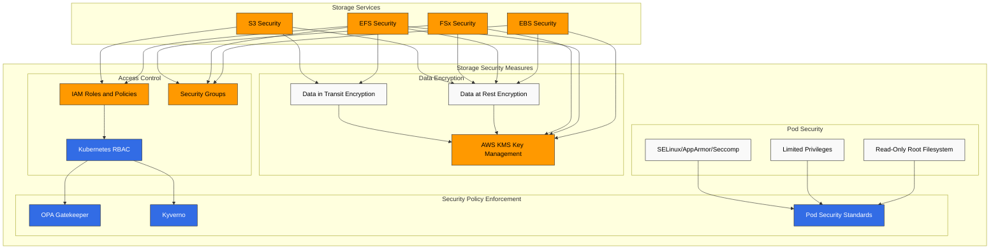
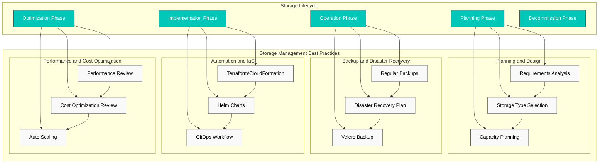

# Amazon EKS Storage - Part 3: Monitoring, Troubleshooting, Cost Optimization, and Security

本文档是 Amazon EKS 存储系列的第三部分，也是最后一部分，涵盖存储监控、故障排查、成本优化和安全。

## Table of Contents

1. [存储监控](#storage-monitoring)
2. [存储故障排查](#storage-troubleshooting)
3. [存储成本优化](#storage-cost-optimization)
4. [存储安全](#storage-security)
5. [存储管理最佳实践](#storage-management-best-practices)

## Storage Monitoring

有效监控 EKS 集群中的存储资源，对于及早发现性能问题并建立容量规划非常重要。

```mermaid
flowchart TD
    subgraph Monitoring_Solutions ["Storage Monitoring Solutions"]
        subgraph AWS_CloudWatch ["AWS CloudWatch"]
            EBS_Metrics[EBS Volume Metrics]
            EFS_Metrics[EFS File System Metrics]
            FSx_Metrics[FSx for Lustre Metrics]
            CW_Alarms[CloudWatch Alarms]
            CW_Dashboard[CloudWatch Dashboard]
        end

        subgraph K8s_Monitoring ["Kubernetes Monitoring"]
            Prometheus[Prometheus]
            Grafana[Grafana Dashboard]
            ServiceMonitor[ServiceMonitor]
            PodMonitor[PodMonitor]
            PrometheusRule[Alert Rules]
        end

        subgraph Custom_Solutions ["Custom Solutions"]
            Usage_Exporter[Volume Usage Exporter]
            Custom_Metrics[Custom Metrics]
            Custom_Alerts[Custom Alerts]
        end
    end

    subgraph Key_Metrics ["Key Monitoring Metrics"]
        Volume_Usage[Volume Usage]
        IOPS[IOPS Usage]
        Throughput[Throughput]
        Latency[Latency]
        Queue_Length[Queue Length]
        Burst_Credits[Burst Credits]
    end

    %% Connection relationships
    EBS_Metrics --> Volume_Usage
    EBS_Metrics --> IOPS
    EBS_Metrics --> Throughput
    EBS_Metrics --> Latency
    EBS_Metrics --> Queue_Length
    EBS_Metrics --> Burst_Credits

    EFS_Metrics --> Volume_Usage
    EFS_Metrics --> Throughput
    EFS_Metrics --> Burst_Credits

    FSx_Metrics --> Volume_Usage
    FSx_Metrics --> IOPS
    FSx_Metrics --> Throughput

    Volume_Usage --> CW_Alarms
    IOPS --> CW_Alarms
    Throughput --> CW_Alarms
    Latency --> CW_Alarms
    Queue_Length --> CW_Alarms
    Burst_Credits --> CW_Alarms

    CW_Alarms --> CW_Dashboard

    Prometheus --> ServiceMonitor
    Prometheus --> PodMonitor
    ServiceMonitor --> Grafana
    PodMonitor --> Grafana
    Prometheus --> PrometheusRule

    Usage_Exporter --> Custom_Metrics
    Custom_Metrics --> Custom_Alerts

    %% Class definitions
    classDef awsService fill:#FF9900,stroke:#333,stroke-width:1px,color:black;
    classDef k8sComponent fill:#326CE5,stroke:#333,stroke-width:1px,color:white;
    classDef userApp fill:#00C7B7,stroke:#333,stroke-width:1px,color:white;
    classDef dataStore fill:#3B48CC,stroke:#333,stroke-width:1px,color:white;
    classDef default fill:#f9f9f9,stroke:#333,stroke-width:1px,color:black;

    %% Class application
    class EBS_Metrics,EFS_Metrics,FSx_Metrics,CW_Alarms,CW_Dashboard awsService;
    class Prometheus,Grafana,ServiceMonitor,PodMonitor,PrometheusRule k8sComponent;
    class Usage_Exporter,Custom_Metrics,Custom_Alerts userApp;
    class Volume_Usage,IOPS,Throughput,Latency,Queue_Length,Burst_Credits default;
```



### Monitoring with CloudWatch

你可以使用 AWS CloudWatch 监控 EBS、EFS 和 FSx for Lustre 卷的性能指标：

#### EBS Volume Metrics

关键 EBS 指标：
- VolumeReadBytes/VolumeWriteBytes：读/写吞吐量
- VolumeReadOps/VolumeWriteOps：读/写操作数量
- VolumeTotalReadTime/VolumeTotalWriteTime：读/写延迟
- VolumeQueueLength：待处理 I/O 请求数量
- BurstBalance：突发积分余额（gp2 卷）

CloudWatch dashboard 示例：

```bash
aws cloudwatch get-dashboard --dashboard-name EBSVolumeMonitoring
```

#### EFS File System Metrics

关键 EFS 指标：
- TotalIOBytes：总 I/O 字节数
- DataReadIOBytes/DataWriteIOBytes：读/写吞吐量
- ClientConnections：已连接客户端数量
- PermittedThroughput：允许的吞吐量
- BurstCreditBalance：突发积分余额

#### FSx for Lustre Metrics

关键 FSx for Lustre 指标：
- DataReadBytes/DataWriteBytes：读/写吞吐量
- DataReadOperations/DataWriteOperations：读/写操作数量
- FreeDataStorageCapacity：可用存储容量
- NetworkThroughputUtilization：网络吞吐量利用率

### Monitoring with Prometheus and Grafana

你可以使用 Prometheus 和 Grafana 在 Kubernetes 层面监控存储资源：

1. 安装 Prometheus 和 Grafana：

```bash
helm repo add prometheus-community https://prometheus-community.github.io/helm-charts
helm repo update
helm install prometheus prometheus-community/kube-prometheus-stack \
  --namespace monitoring \
  --create-namespace
```

2. 配置用于收集存储相关指标的 ServiceMonitor：

```yaml
apiVersion: monitoring.coreos.com/v1
kind: ServiceMonitor
metadata:
  name: csi-metrics
  namespace: monitoring
spec:
  selector:
    matchLabels:
      app: ebs-csi-controller
  endpoints:
  - port: metrics
    interval: 30s
```

3. 配置 Grafana dashboard：

在 Grafana 中创建包含以下指标的 dashboard：
- PVC 使用量和容量
- 卷供应状态
- CSI driver 操作延迟
- 卷挂载/卸载操作

### Custom Monitoring Solutions

你可以针对特定需求实现自定义监控解决方案：

1. 卷使用量监控 Pod：

```yaml
apiVersion: apps/v1
kind: DaemonSet
metadata:
  name: volume-usage-exporter
  namespace: monitoring
spec:
  selector:
    matchLabels:
      app: volume-usage-exporter
  template:
    metadata:
      labels:
        app: volume-usage-exporter
    spec:
      containers:
      - name: exporter
        image: quay.io/prometheus/node-exporter:v1.3.1
        args:
        - --path.procfs=/host/proc
        - --path.sysfs=/host/sys
        - --collector.filesystem
        volumeMounts:
        - name: proc
          mountPath: /host/proc
          readOnly: true
        - name: sys
          mountPath: /host/sys
          readOnly: true
        - name: root
          mountPath: /host/root
          readOnly: true
          mountPropagation: HostToContainer
      volumes:
      - name: proc
        hostPath:
          path: /proc
      - name: sys
        hostPath:
          path: /sys
      - name: root
        hostPath:
          path: /
```

2. 告警规则配置：

```yaml
apiVersion: monitoring.coreos.com/v1
kind: PrometheusRule
metadata:
  name: storage-alerts
  namespace: monitoring
spec:
  groups:
  - name: storage
    rules:
    - alert: VolumeUsageHigh
      expr: kubelet_volume_stats_used_bytes / kubelet_volume_stats_capacity_bytes > 0.85
      for: 10m
      labels:
        severity: warning
      annotations:
        summary: "Volume usage high ({{ $value | humanizePercentage }})"
        description: "PVC {{ $labels.persistentvolumeclaim }} is using {{ $value | humanizePercentage }} of its capacity."
    - alert: VolumeFullIn24Hours
      expr: predict_linear(kubelet_volume_stats_used_bytes[6h], 24 * 3600) > kubelet_volume_stats_capacity_bytes
      for: 10m
      labels:
        severity: warning
      annotations:
        summary: "Volume will fill in 24 hours"
        description: "PVC {{ $labels.persistentvolumeclaim }} is predicted to fill within 24 hours."
```

## Storage Troubleshooting

让我们探讨 EKS 集群中可能出现的常见存储问题及其解决方案。

```mermaid
flowchart TD
    subgraph Common_Issues ["Common Storage Issues"]
        PVC_Pending[PVC in Pending State]
        Volume_Provisioning[Volume Provisioning Failure]
        Mount_Issues[Volume Mount Issues]
        Performance_Issues[Performance Issues]
    end

    subgraph Troubleshooting_Steps ["Troubleshooting Steps"]
        Check_PVC[Check PVC Status]
        Check_SC[Check Storage Class]
        Check_CSI[Check CSI Driver Logs]
        Check_IAM[Check IAM Permissions]
        Check_Pod[Check Pod Status]
        Check_Node[Check Node Status]
        Check_SG[Check Security Groups]
        Check_Network[Check Network Connectivity]
        Check_Metrics[Check Performance Metrics]
        Check_FS[Test File System]
    end

    subgraph Resolution_Actions ["Resolution Actions"]
        Fix_SC[Fix Storage Class]
        Fix_CSI[Reinstall CSI Driver]
        Fix_IAM[Add IAM Permissions]
        Fix_Pod[Restart Pod]
        Fix_SG[Add Security Group Rules]
        Fix_Volume[Change Volume Type]
        Fix_Instance[Change Instance Type]
        Fix_FS[Optimize File System]
    end

    %% Issue and troubleshooting step connections
    PVC_Pending --> Check_PVC
    PVC_Pending --> Check_SC
    PVC_Pending --> Check_CSI
    PVC_Pending --> Check_IAM

    Volume_Provisioning --> Check_CSI
    Volume_Provisioning --> Check_IAM
    Volume_Provisioning --> Check_SC

    Mount_Issues --> Check_Pod
    Mount_Issues --> Check_Node
    Mount_Issues --> Check_SG
    Mount_Issues --> Check_Network

    Performance_Issues --> Check_Metrics
    Performance_Issues --> Check_FS
    Performance_Issues --> Check_Node

    %% Troubleshooting steps and action connections
    Check_SC --> Fix_SC
    Check_CSI --> Fix_CSI
    Check_IAM --> Fix_IAM
    Check_Pod --> Fix_Pod
    Check_SG --> Fix_SG
    Check_Metrics --> Fix_Volume
    Check_Metrics --> Fix_Instance
    Check_FS --> Fix_FS

    %% Class definitions
    classDef awsService fill:#FF9900,stroke:#333,stroke-width:1px,color:black;
    classDef k8sComponent fill:#326CE5,stroke:#333,stroke-width:1px,color:white;
    classDef userApp fill:#00C7B7,stroke:#333,stroke-width:1px,color:white;
    classDef dataStore fill:#3B48CC,stroke:#333,stroke-width:1px,color:white;
    classDef default fill:#f9f9f9,stroke:#333,stroke-width:1px,color:black;

    %% Class application
    class PVC_Pending,Volume_Provisioning,Mount_Issues,Performance_Issues k8sComponent;
    class Check_PVC,Check_SC,Check_CSI,Check_IAM,Check_Pod,Check_Node,Check_SG,Check_Network,Check_Metrics,Check_FS default;
    class Fix_SC,Fix_CSI,Fix_IAM,Fix_Pod,Fix_SG,Fix_Volume,Fix_Instance,Fix_FS userApp;
```



### Volume Provisioning Issues

#### Issue: PVC Remains in Pending State

1. 检查 PVC 状态：

```bash
kubectl get pvc
kubectl describe pvc <pvc-name>
```

2. 检查 StorageClass：

```bash
kubectl get sc
kubectl describe sc <storage-class-name>
```

3. 检查 provisioner Pod 日志：

```bash
kubectl -n kube-system get pods | grep csi
kubectl -n kube-system logs <csi-controller-pod-name>
```

4. 常见原因和解决方案：
   - StorageClass 不存在：创建正确的 StorageClass
   - 未安装 CSI driver：安装该 driver
   - IAM 权限不足：授予所需的 IAM 权限
   - 超出卷限制：请求提升服务限制

#### Issue: Volume Not Provisioned with WaitForFirstConsumer Binding Mode

1. 检查 Pod 状态：

```bash
kubectl get pods
kubectl describe pod <pod-name>
```

2. 检查节点可用区：

```bash
kubectl get nodes -L topology.kubernetes.io/zone
```

3. 解决方案：
   - 解决 Pod 调度问题
   - 检查 node selector 和 affinity 规则
   - 确保 node pool 与 PVC 位于同一可用区

### Volume Mount Issues

#### Issue: Pod Stuck in ContainerCreating State

1. 检查 Pod 事件：

```bash
kubectl describe pod <pod-name>
```

2. 检查节点 kubelet 日志：

```bash
kubectl get nodes
ssh ec2-user@<node-ip>
sudo journalctl -u kubelet
```

3. 常见原因和解决方案：
   - 找不到卷 ID：在 AWS console 中验证卷是否存在
   - 设备挂载失败：检查设备路径和文件系统
   - 权限问题：检查 IAM roles 和 security groups

#### Issue: EFS or FSx Mount Failure

1. 检查 security groups：
   - EFS：允许 TCP 端口 2049
   - FSx for Lustre：允许 TCP 端口 988

2. 检查网络连接：

```bash
kubectl debug node/<node-name> -it --image=amazon/aws-cli
ping <efs-dns-name>
telnet <efs-dns-name> 2049
```

3. 创建 mount helper Pod：

```yaml
apiVersion: v1
kind: Pod
metadata:
  name: mount-helper
spec:
  containers:
  - name: mount-helper
    image: amazonlinux:2
    command: ["sleep", "infinity"]
    securityContext:
      privileged: true
```

4. 手动测试挂载：

```bash
kubectl exec -it mount-helper -- bash
yum install -y nfs-utils
mkdir -p /mnt/efs
mount -t nfs4 <efs-dns-name>:/ /mnt/efs
```

### Performance Issues

#### Issue: Slow I/O Performance

1. 检查卷性能指标：

```bash
aws cloudwatch get-metric-statistics \
  --namespace AWS/EBS \
  --metric-name VolumeReadOps \
  --dimensions Name=VolumeId,Value=vol-1234567890abcdef0 \
  --start-time $(date -u -v-1H +%Y-%m-%dT%H:%M:%SZ) \
  --end-time $(date -u +%Y-%m-%dT%H:%M:%SZ) \
  --period 300 \
  --statistics Average
```

2. 测试文件系统性能：

```bash
kubectl exec -it <pod-name> -- bash
dd if=/dev/zero of=/data/test bs=1M count=1000 oflag=direct
dd if=/data/test of=/dev/null bs=1M count=1000 iflag=direct
```

3. 常见原因和解决方案：
   - 卷类型不合适：选择适合工作负载的卷类型（例如 gp3、io2）
   - IOPS 或吞吐量限制：调整卷性能参数
   - 实例限制：使用 EBS-optimized instances
   - 文件系统碎片：优化或重新创建文件系统

#### Issue: EFS Performance Degradation

1. 检查 EFS performance mode 和 throughput mode
2. 优化客户端挂载选项：

```yaml
mountOptions:
  - nfsvers=4.1
  - rsize=1048576
  - wsize=1048576
  - timeo=600
  - retrans=2
  - noresvport
```

3. 优化访问模式：
   - 使用大文件而不是小文件
   - 使用顺序访问模式
   - 尽量减少元数据操作

## Storage Cost Optimization

让我们探讨优化 EKS 集群存储成本的策略。

```mermaid
flowchart TD
    subgraph Cost_Optimization_Strategies ["Cost Optimization Strategies"]
        subgraph Volume_Optimization ["Volume Optimization"]
            Volume_Type[Select Appropriate Volume Type]
            Volume_Size[Optimize Volume Size]
            GP3_Migration[Migrate to gp3 Volumes]
        end

        subgraph Lifecycle_Management ["Lifecycle Management"]
            Data_Tiering[Data Tiering]
            Snapshot_Policy[Automated Snapshot Policy]
            PV_Reclaim[PV Reclaim Policy]
        end

        subgraph EFS_Optimization ["EFS Optimization"]
            Throughput_Mode[Appropriate Throughput Mode]
            IA_Storage[IA Storage Class]
            Access_Points[Access Points]
        end

        subgraph FSx_Optimization ["FSx Optimization"]
            Deployment_Type[Appropriate Deployment Type]
            Data_Compression[Data Compression]
            S3_Integration[S3 Integration]
        end

        subgraph Cost_Monitoring ["Cost Monitoring"]
            Cost_Explorer[AWS Cost Explorer]
            K8s_Cost[Kubernetes Cost Allocation]
            Cost_Anomaly[Cost Anomaly Detection]
        end
    end

    subgraph Storage_Types ["Storage Type Optimization"]
        EBS[Amazon EBS]
        EFS[Amazon EFS]
        FSx[Amazon FSx for Lustre]
        S3[Amazon S3]
    end

    %% Connection relationships
    EBS --> Volume_Type
    EBS --> Volume_Size
    EBS --> GP3_Migration

    EBS --> Snapshot_Policy
    EBS --> PV_Reclaim

    EFS --> Throughput_Mode
    EFS --> IA_Storage
    EFS --> Access_Points

    FSx --> Deployment_Type
    FSx --> Data_Compression
    FSx --> S3_Integration

    S3 --> Data_Tiering

    Volume_Optimization --> Cost_Monitoring
    Lifecycle_Management --> Cost_Monitoring
    EFS_Optimization --> Cost_Monitoring
    FSx_Optimization --> Cost_Monitoring

    %% Class definitions
    classDef awsService fill:#FF9900,stroke:#333,stroke-width:1px,color:black;
    classDef k8sComponent fill:#326CE5,stroke:#333,stroke-width:1px,color:white;
    classDef userApp fill:#00C7B7,stroke:#333,stroke-width:1px,color:white;
    classDef dataStore fill:#3B48CC,stroke:#333,stroke-width:1px,color:white;
    classDef default fill:#f9f9f9,stroke:#333,stroke-width:1px,color:black;

    %% Class application
    class EBS,EFS,FSx,S3 awsService;
    class Volume_Type,Volume_Size,GP3_Migration,Data_Tiering,Snapshot_Policy,PV_Reclaim,Throughput_Mode,IA_Storage,Access_Points,Deployment_Type,Data_Compression,S3_Integration default;
    class Cost_Explorer,K8s_Cost,Cost_Anomaly userApp;
```



### Volume Type and Size Optimization

1. **选择合适的卷类型**：
   - 通用工作负载：gp3（比 gp2 更具成本效益）
   - 吞吐密集型工作负载：st1
   - 不常访问的数据：sc1

2. **优化卷大小**：
   - 预置略大于需求的卷
   - 监控卷使用量，并按需扩展
   - 清理或归档不必要的数据

3. **迁移到 gp3 卷**：

```yaml
apiVersion: storage.k8s.io/v1
kind: StorageClass
metadata:
  name: ebs-gp3
  annotations:
    storageclass.kubernetes.io/is-default-class: "true"
provisioner: ebs.csi.aws.com
parameters:
  type: gp3
  encrypted: "true"
allowVolumeExpansion: true
```

### Storage Lifecycle Management

1. **数据分层**：
   - 频繁访问的数据：EBS 或 EFS
   - 不常访问的数据：S3 或 S3 Glacier

2. **自动化 snapshot 策略**：
   - 定期创建 snapshot
   - 自动删除旧 snapshot

```yaml
apiVersion: snapshot.storage.k8s.io/v1
kind: VolumeSnapshotClass
metadata:
  name: ebs-snapshot-class
driver: ebs.csi.aws.com
deletionPolicy: Delete
```

3. **PV reclaim policy**：
   - 对临时数据使用 Delete policy
   - 对重要数据使用 Retain policy

### EFS Cost Optimization

1. **选择合适的 throughput mode**：
   - 可预测的工作负载：Provisioned throughput
   - 可变工作负载：Bursting mode

2. **Lifecycle management**：
   - 自动将不常访问的文件移动到 IA (Infrequent Access) storage class
   - 配置 lifecycle policy：

```bash
aws efs put-lifecycle-configuration \
  --file-system-id fs-1234567890abcdef0 \
  --lifecycle-policies '[{"TransitionToIA":"AFTER_30_DAYS"}]'
```

3. **使用 access points**：
   - 使用特定于应用程序的 access points 共享文件系统

### FSx for Lustre Cost Optimization

1. **选择合适的 deployment type**：
   - 临时工作负载：SCRATCH_2
   - 长期工作负载：PERSISTENT_1 或 PERSISTENT_2

2. **启用数据压缩**：
   - 使用 LZ4 数据压缩降低存储成本

3. **与 S3 集成**：
   - 将 S3 bucket 连接到 FSx for Lustre 以进行数据分层

### Cost Monitoring and Analysis

1. **使用 AWS Cost Explorer**：
   - 分析存储成本趋势
   - 按资源分析成本

2. **Kubernetes 成本分配**：
   - 使用 namespaces 和 labels 分配成本
   - 使用 Kubecost 等工具

3. **成本异常检测**：
   - 设置 AWS budgets 和 alerts
   - 为异常成本增长配置 alerts

## Storage Security

让我们探讨保护 EKS 集群中存储资源的安全最佳实践。



### Data Encryption

1. **静态数据加密**：
   - EBS 卷加密：

```yaml
apiVersion: storage.k8s.io/v1
kind: StorageClass
metadata:
  name: ebs-encrypted
provisioner: ebs.csi.aws.com
parameters:
  type: gp3
  encrypted: "true"
  kmsKeyId: arn:aws:kms:us-west-2:111122223333:key/1234abcd-12ab-34cd-56ef-1234567890ab
```

   - EFS 文件系统加密：

```bash
aws efs create-file-system \
  --encrypted \
  --kms-key-id arn:aws:kms:us-west-2:111122223333:key/1234abcd-12ab-34cd-56ef-1234567890ab
```

   - FSx for Lustre 加密：

```bash
aws fsx create-file-system \
  --file-system-type LUSTRE \
  --storage-capacity 1200 \
  --subnet-ids subnet-1234567890abcdef0 \
  --lustre-configuration DeploymentType=SCRATCH_2 \
  --security-group-ids sg-1234567890abcdef0 \
  --kms-key-id arn:aws:kms:us-west-2:111122223333:key/1234abcd-12ab-34cd-56ef-1234567890ab
```

2. **传输中数据加密**：
   - EFS 传输中加密：

```yaml
mountOptions:
  - tls
```

   - S3 传输中加密：

```bash
aws s3 cp --sse AES256 file.txt s3://my-bucket/
```

### Access Control

1. **IAM roles and policies**：
   - 应用最小权限原则
   - 对 service accounts 使用 IAM roles

```bash
eksctl create iamserviceaccount \
  --name ebs-csi-controller-sa \
  --namespace kube-system \
  --cluster my-cluster \
  --attach-policy-arn arn:aws:iam::aws:policy/service-role/AmazonEBSCSIDriverPolicy \
  --approve
```

2. **Security groups**：
   - 仅允许必需端口
   - 限制源 IP

```bash
aws ec2 authorize-security-group-ingress \
  --group-id sg-1234567890abcdef0 \
  --protocol tcp \
  --port 2049 \
  --source-group sg-0987654321fedcba0
```

3. **Kubernetes RBAC**：
   - 限制对 PVs 和 PVCs 的访问

```yaml
apiVersion: rbac.authorization.k8s.io/v1
kind: Role
metadata:
  namespace: app-namespace
  name: pvc-manager
rules:
- apiGroups: [""]
  resources: ["persistentvolumeclaims"]
  verbs: ["get", "list", "watch", "create", "update", "patch", "delete"]
---
apiVersion: rbac.authorization.k8s.io/v1
kind: RoleBinding
metadata:
  name: pvc-manager-binding
  namespace: app-namespace
subjects:
- kind: ServiceAccount
  name: app-service-account
  namespace: app-namespace
roleRef:
  kind: Role
  name: pvc-manager
  apiGroup: rbac.authorization.k8s.io
```

### Pod Security Context

1. **只读 root filesystem**：

```yaml
apiVersion: v1
kind: Pod
metadata:
  name: secure-pod
spec:
  containers:
  - name: app
    image: nginx
    securityContext:
      readOnlyRootFilesystem: true
    volumeMounts:
    - name: data-volume
      mountPath: /data
      readOnly: false
```

2. **有限权限**：

```yaml
securityContext:
  runAsUser: 1000
  runAsGroup: 3000
  fsGroup: 2000
  allowPrivilegeEscalation: false
```

3. **SELinux、AppArmor 或 seccomp profiles**：

```yaml
securityContext:
  seLinuxOptions:
    level: "s0:c123,c456"
  seccompProfile:
    type: RuntimeDefault
```

### Security Policy Enforcement

1. **OPA Gatekeeper 或 Kyverno**：
   - 仅允许加密卷

```yaml
apiVersion: kyverno.io/v1
kind: ClusterPolicy
metadata:
  name: require-ebs-encryption
spec:
  validationFailureAction: enforce
  rules:
  - name: check-ebs-encryption
    match:
      resources:
        kinds:
        - PersistentVolumeClaim
    validate:
      message: "EBS volumes must be encrypted"
      pattern:
        spec:
          storageClassName: "ebs-*"
          +(storageClassName): "ebs-encrypted"
```

2. **Pod Security Standards**：
   - 将 Pod Security Standards 应用于 namespaces

```yaml
apiVersion: v1
kind: Namespace
metadata:
  name: secure-ns
  labels:
    pod-security.kubernetes.io/enforce: restricted
```

## Storage Management Best Practices

让我们探讨在 EKS 集群中有效管理存储的最佳实践。



### Storage Planning and Design

1. **需求分析**：
   - 性能需求（IOPS、吞吐量）
   - 容量需求
   - 访问模式（读/写比例、并发）
   - 可用性和持久性需求

2. **存储类型选择**：
   - Block storage (EBS)：数据库、有状态应用程序
   - File storage (EFS)：共享文件、web servers、CMS
   - High-performance file storage (FSx for Lustre)：HPC、ML training
   - Object storage (S3)：备份、归档、静态内容

3. **容量规划**：
   - 当前需求 + 增长余量
   - 实现自动扩展机制
   - 定期容量评审

### Backup and Disaster Recovery

1. **定期备份**：
   - 自动执行卷 snapshot
   - 定义备份保留策略

```bash
# Create snapshot daily at midnight
0 0 * * * kubectl create -f snapshot.yaml
```

2. **Disaster recovery plan**：
   - Multi-AZ 或跨区域复制
   - 定义 Recovery Time Objective (RTO) 和 Recovery Point Objective (RPO)
   - 定期恢复测试

3. **使用 Velero 进行集群备份**：

```bash
velero backup create daily-backup --include-namespaces=default,app-namespace
```

### Automation and IaC (Infrastructure as Code)

1. **使用 Terraform 或 CloudFormation**：
   - 以声明式方式定义存储资源
   - 版本控制和变更跟踪

```hcl
resource "aws_efs_file_system" "example" {
  creation_token = "example"
  performance_mode = "generalPurpose"
  throughput_mode = "bursting"
  encrypted = true

  lifecycle_policy {
    transition_to_ia = "AFTER_30_DAYS"
  }

  tags = {
    Name = "ExampleFileSystem"
  }
}
```

2. **使用 Helm charts**：
   - 将 storage classes 和 PVCs 模板化

```yaml
# values.yaml
storage:
  class: ebs-gp3
  size: 10Gi
  encrypted: true
```

3. **GitOps workflow**：
   - 使用 ArgoCD 或 Flux 管理存储配置

### Performance and Cost Optimization

1. **定期性能评审**：
   - 识别并解决瓶颈
   - 随着工作负载变化调整存储配置

2. **成本优化评审**：
   - 识别并移除未使用的卷
   - 迁移到具有成本效益的存储类型
   - 考虑 Reserved Instances 或 Savings Plans

3. **Auto scaling**：
   - 根据需求自动扩展存储
   - 配置基于使用量的 alerts

## Conclusion

在本文档中，我们介绍了 Amazon EKS 存储的监控、故障排查、成本优化和安全。有效的存储管理对于确保 EKS 集群的性能、可靠性和成本效益至关重要。

存储需求因应用程序而异，因此了解工作负载的特征并选择合适的存储解决方案非常重要。此外，你还应通过定期监控、故障排查、成本优化和安全评审来有效管理存储资源。

## References

- [Amazon EKS Storage Best Practices](https://aws.github.io/aws-eks-best-practices/storage/)
- [Kubernetes Storage Troubleshooting](https://kubernetes.io/docs/tasks/debug-application-cluster/debug-application/#debugging-pods)
- [AWS Storage Cost Optimization](https://aws.amazon.com/blogs/storage/cost-optimization-for-amazon-ebs-and-amazon-efs/)
- [Kubernetes Storage Security](https://kubernetes.io/docs/concepts/security/)

## Quiz

要测试你在本章学到的内容，请尝试完成[主题测验](../quizzes/eks/04-eks-storage-part3-quiz.md)。
