# Amazon EKS 安全

> **支持版本**: Amazon EKS 1.31, 1.32, 1.33
> **最后更新**: July 3, 2026

要在 Amazon EKS (Elastic Kubernetes Service) 上安全运行 workloads，你需要理解并实施多种安全层和最佳实践。本文档介绍用于强化 EKS cluster 安全性的关键概念、组件和最佳实践。

## 目录

1. [EKS 安全概览](#eks-security-overview)
2. [最新安全趋势 (2023)](#latest-security-trends-2023)
3. [IAM 和身份验证](#iam-and-authentication)
4. [OIDC Provider 深入解析](#oidc-provider-deep-dive)
5. [EKS Pod Identity](#eks-pod-identity)
6. [Cluster Endpoint 访问控制](#cluster-endpoint-access-control)
7. [网络安全](#network-security)
8. [Pod 安全](#pod-security)
9. [Bottlerocket 和只读 OS](#bottlerocket-and-read-only-os)
10. [IAM Permission Boundaries](#iam-permission-boundaries)
11. [加密和 Secrets 管理](#encryption-and-secrets-management)
12. [合规和审计](#compliance-and-auditing)
13. [安全监控和检测](#security-monitoring-and-detection)
14. [EKS 安全最佳实践](#eks-security-best-practices)
15. [金融服务中的 EKS 安全注意事项](#eks-security-considerations-for-financial-services)

## EKS 安全概览

Amazon EKS 结合 AWS 和 Kubernetes 的安全功能，提供多层安全架构。EKS 安全包括以下关键领域：

- **Shared Responsibility Model（共同责任模型）**: AWS 管理 EKS control plane 的安全，而客户负责 worker nodes、containers 和 applications 的安全。
- **Infrastructure Security（基础设施安全）**: 包括 VPC、subnets 和 security groups 在内的网络基础设施安全
- **Cluster Security（Cluster 安全）**: Kubernetes API server 访问控制、RBAC 和 service accounts
- **Workload Security（Workload 安全）**: Container image 安全、runtime 安全和 network policies

### EKS 安全架构

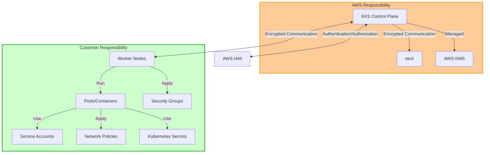

## 最新安全趋势 (2023)

Kubernetes 和 EKS 安全领域的最新趋势和建议如下：

### 1. Zero Trust Architecture

这种方法摆脱传统的基于边界的安全模型，默认不信任任何访问，并持续进行验证。

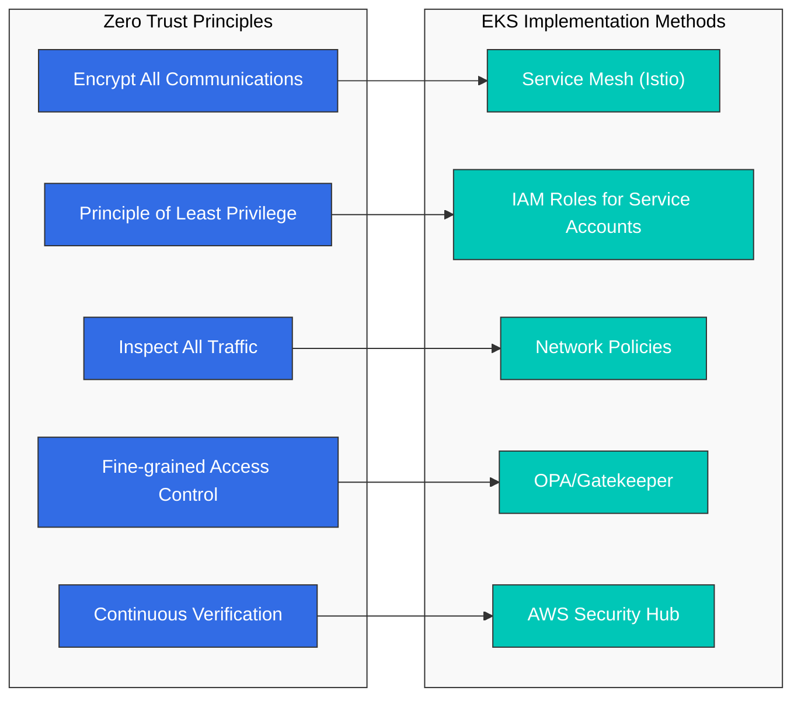

在 EKS 中实施 Zero Trust：
- **Service Mesh**: 使用 Istio 或 AWS App Mesh 在 services 之间进行 mTLS 通信
- **IAM Roles for Service Accounts (IRSA)**: 细粒度权限管理
- **Network Policies**: 默认拒绝 policies，仅允许必要通信
- **OPA/Gatekeeper**: 基于 policy 的访问控制
- **AWS Security Hub**: 持续安全态势监控

### 2. Supply Chain Security

随着软件供应链攻击增加，从 container images 到 deployment 的整个 pipeline 安全变得重要。

关键实施方法：
- 采用 **SLSA (Supply-chain Levels for Software Artifacts)** 框架
- **Image signing and verification**: Cosign, Notary v2
- **SBOM (Software Bill of Materials)** 生成和管理：Syft, Grype
- **Image scanning**: Amazon ECR image scanning, Trivy, Clair
- **GitOps security**: 签名 commits、安全 pipelines

### 3. Runtime Security 和 Threat Detection

随着 container runtime 安全变得重要，以下技术正在受到关注：

- **基于 eBPF 的安全监控**: Cilium, Falco
- **AWS GuardDuty EKS Protection**: Runtime threat detection
- **Kubernetes Audit log 分析**: CloudWatch Logs Insights
- **异常行为检测**: Amazon Detective
- **Container escape prevention**: gVisor, Kata Containers

### 4. Policy as Code

一种将安全 policies 作为 code 管理的方法，用于提高一致性和自动化：

- **OPA (Open Policy Agent)**: 通用 policy engine
- **Kyverno**: Kubernetes-native policy 管理
- **AWS Config**: 合规监控
- **Terraform Sentinel**: IaC policy 强制执行
- **AWS CloudFormation Guard**: IaC policy 验证

## IAM 和身份验证

### EKS 身份验证机制

Amazon EKS 提供以下身份验证机制：

1. **AWS IAM Authenticator**: 使用 AWS IAM credentials 向 Kubernetes API server 进行身份验证。
2. **OIDC Provider Integration**: 与外部 OIDC providers（例如 Active Directory、Okta、Auth0）集成，以管理用户身份验证。
3. **IAM Roles for Service Accounts**: 将 AWS IAM roles 链接到 Kubernetes service accounts，使 pods 能够安全访问 AWS services。

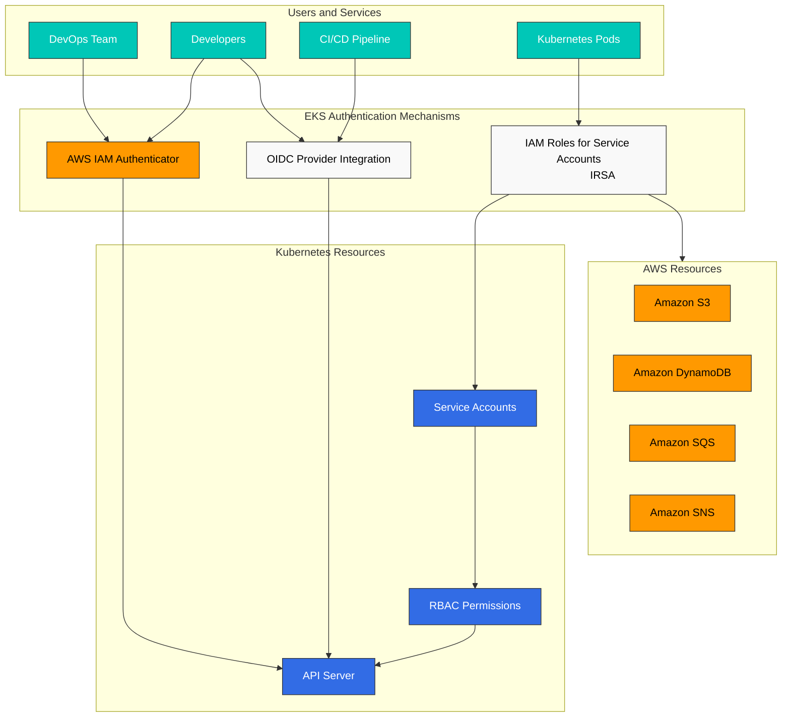

### IAM Roles 和 Policy 配置

#### EKS Cluster Role

创建 EKS cluster 时所需的最小权限：

```json
{
  "Version": "2012-10-17",
  "Statement": [
    {
      "Effect": "Allow",
      "Action": [
        "eks:CreateCluster",
        "eks:DescribeCluster",
        "eks:UpdateClusterConfig",
        "eks:DeleteCluster"
      ],
      "Resource": "*"
    },
    {
      "Effect": "Allow",
      "Action": "iam:PassRole",
      "Resource": "*",
      "Condition": {
        "StringEquals": {
          "iam:PassedToService": "eks.amazonaws.com"
        }
      }
    }
  ]
}
```

#### EKS Access Entry

EKS Access Entry 是一种用于管理 IAM user 和 role 对 EKS clusters 访问的新方法，用来替代 aws-auth ConfigMap。Access Entry 提供以下优势：

- 作为 AWS-managed 解决方案，提高稳定性
- 通过 declarative API 进行管理
- 版本控制和审计能力
- 分离 node IAM role 与 user/role 访问管理

```bash
# Enable Access Entry for the cluster
aws eks update-cluster-config \
  --name my-cluster \
  --region us-west-2 \
  --access-config authenticationMode=API_AND_CONFIG_MAP

# Create Access Entry for IAM role
aws eks create-access-entry \
  --cluster-name my-cluster \
  --principal-arn arn:aws:iam::123456789012:role/DevTeamRole \
  --username dev-team \
  --kubernetes-groups dev-team

# Create Access Entry for IAM user
aws eks create-access-entry \
  --cluster-name my-cluster \
  --principal-arn arn:aws:iam::123456789012:user/admin \
  --username admin \
  --kubernetes-groups system:masters

# List Access Entries
aws eks list-access-entries --cluster-name my-cluster
```

> **注意**: EKS Access Entry 于 2023 年推出，提供了比 aws-auth ConfigMap 更稳定且更易管理的方法。现有 clusters 可以迁移到同时支持两种方法的 hybrid mode。

### IRSA (IAM Roles for Service Accounts)

IRSA 允许你将 AWS IAM roles 链接到 Kubernetes service accounts，使 pods 能够安全访问 AWS services。

#### IRSA 设置步骤

1. 为 EKS cluster 创建 OIDC provider：

```bash
eksctl utils associate-iam-oidc-provider --cluster my-cluster --approve
```

2. 创建 IAM role 和 policy：

```bash
eksctl create iamserviceaccount \
  --name s3-reader \
  --namespace default \
  --cluster my-cluster \
  --attach-policy-arn arn:aws:iam::aws:policy/AmazonS3ReadOnlyAccess \
  --approve
```

3. 将 service account 与 pod 关联：

```yaml
apiVersion: v1
kind: Pod
metadata:
  name: s3-reader
spec:
  serviceAccountName: s3-reader
  containers:
  - name: app
    image: amazonlinux:2
    command: ['sh', '-c', 'aws s3 ls']
```

## OIDC Provider 深入解析

OpenID Connect (OIDC) 是 EKS 中 IAM Roles for Service Accounts (IRSA) 的基础。理解 OIDC 的工作方式有助于排查身份验证问题，并实现安全的 workload identity 模式。

### OIDC Trust Relationship 机制

创建 EKS cluster 时，AWS 会自动创建 OIDC provider endpoint。该 endpoint 作为 identity provider，供 AWS STS 信任以验证 Kubernetes service accounts。

Trust relationship 的工作方式如下：
1. EKS 通过 projected service account tokens 向 pods 签发 OIDC tokens
2. Token 包含有关 pod 身份的 claims（namespace、service account name）
3. AWS STS 使用 OIDC provider 的 public keys 验证 token
4. 如果有效，STS 会签发临时 AWS credentials

### STS AssumeRoleWithWebIdentity 流程

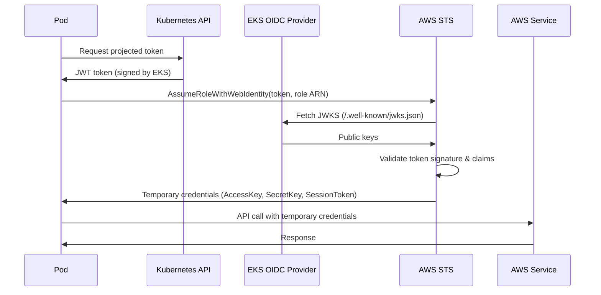

### Token Exchange 机制

Projected service account token 是一个具有以下结构的 JWT (JSON Web Token)：

```json
{
  "aud": ["sts.amazonaws.com"],
  "exp": 1234567890,
  "iat": 1234567800,
  "iss": "https://oidc.eks.us-west-2.amazonaws.com/id/EXAMPLED539D4633E53DE1B71EXAMPLE",
  "kubernetes.io": {
    "namespace": "default",
    "pod": {
      "name": "my-pod",
      "uid": "1234-5678-9012-3456"
    },
    "serviceaccount": {
      "name": "my-service-account",
      "uid": "abcd-efgh-ijkl-mnop"
    }
  },
  "sub": "system:serviceaccount:default:my-service-account"
}
```

关键 claims：
- **iss**: OIDC provider URL（必须与 IAM trust policy 匹配）
- **sub**: Subject（service account identifier）
- **aud**: Audience（对于 AWS，必须包含 `sts.amazonaws.com`）

### OIDC Endpoint 验证

验证你的 cluster 的 OIDC 配置：

```bash
# Get OIDC provider URL
aws eks describe-cluster \
  --name my-cluster \
  --query "cluster.identity.oidc.issuer" \
  --output text

# Example output: https://oidc.eks.us-west-2.amazonaws.com/id/EXAMPLED539D4633E53DE1B71EXAMPLE

# List OIDC providers in your account
aws iam list-open-id-connect-providers

# Get OIDC provider details
aws iam get-open-id-connect-provider \
  --open-id-connect-provider-arn arn:aws:iam::123456789012:oidc-provider/oidc.eks.us-west-2.amazonaws.com/id/EXAMPLED539D4633E53DE1B71EXAMPLE
```

### JWKS URI 和 Token Validation

JWKS (JSON Web Key Set) endpoint 提供用于 token validation 的 public keys：

```bash
# Fetch JWKS from OIDC provider
OIDC_URL=$(aws eks describe-cluster --name my-cluster --query "cluster.identity.oidc.issuer" --output text)
curl -s "${OIDC_URL}/.well-known/openid-configuration" | jq .

# Get the JWKS directly
curl -s "${OIDC_URL}/keys" | jq .
```

JWKS response 包含用于验证 token signatures 的 RSA public keys：

```json
{
  "keys": [
    {
      "kty": "RSA",
      "kid": "key-id-1",
      "use": "sig",
      "alg": "RS256",
      "n": "base64-encoded-modulus",
      "e": "AQAB"
    }
  ]
}
```

## EKS Pod Identity

EKS Pod Identity 是一种较新的身份验证机制，可简化 pods 访问 AWS services 的方式。它在保持强安全保证的同时，相比 IRSA 提供了一些优势。

### 相比 IRSA 的优势

| 功能 | IRSA | EKS Pod Identity |
|---------|------|------------------|
| 设置复杂度 | 需要 OIDC provider + 每个 SA 一个 IAM role | 更简单的 Pod Identity Association |
| IAM Role 复用 | 每个 service account 一个 role | 跨 clusters/accounts 使用相同 role |
| Session Tags | 有限 | 完全支持 ABAC |
| Cross-Account | 复杂 trust policies | 通过 associations 简化 |
| Credential Rotation | 基于 token、短生命周期 | 由 Pod Identity Agent 管理 |
| 故障排查 | 复杂 token validation | 更简单的调试 |

### Pod Identity Agent 机制

EKS Pod Identity Agent 作为 DaemonSet 在你的 nodes 上运行，并处理 credential 分发：

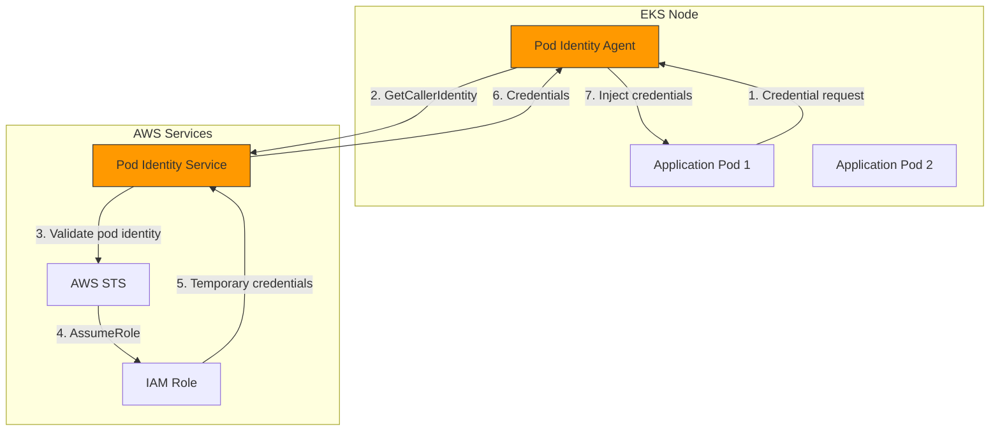

### Pod Identity Association 设置

**使用 eksctl**：

```bash
# Create Pod Identity Association
eksctl create podidentityassociation \
  --cluster my-cluster \
  --namespace default \
  --service-account-name my-app-sa \
  --role-arn arn:aws:iam::123456789012:role/MyAppRole
```

**使用 AWS CLI**：

```bash
# First, create the IAM role with Pod Identity trust policy
cat > trust-policy.json << 'EOF'
{
  "Version": "2012-10-17",
  "Statement": [
    {
      "Effect": "Allow",
      "Principal": {
        "Service": "pods.eks.amazonaws.com"
      },
      "Action": [
        "sts:AssumeRole",
        "sts:TagSession"
      ]
    }
  ]
}
EOF

aws iam create-role \
  --role-name MyAppRole \
  --assume-role-policy-document file://trust-policy.json

# Attach required policies
aws iam attach-role-policy \
  --role-name MyAppRole \
  --policy-arn arn:aws:iam::aws:policy/AmazonS3ReadOnlyAccess

# Create the Pod Identity Association
aws eks create-pod-identity-association \
  --cluster-name my-cluster \
  --namespace default \
  --service-account my-app-sa \
  --role-arn arn:aws:iam::123456789012:role/MyAppRole
```

### IRSA 到 Pod Identity 的迁移步骤

从 IRSA 迁移到 Pod Identity 的逐步过程：

1. **安装 Pod Identity Agent**（如果尚未安装）：

```bash
aws eks create-addon \
  --cluster-name my-cluster \
  --addon-name eks-pod-identity-agent \
  --addon-version v1.0.0-eksbuild.1
```

2. **更新 IAM role trust policy**，以同时支持 IRSA 和 Pod Identity：

```json
{
  "Version": "2012-10-17",
  "Statement": [
    {
      "Effect": "Allow",
      "Principal": {
        "Federated": "arn:aws:iam::123456789012:oidc-provider/oidc.eks.us-west-2.amazonaws.com/id/EXAMPLE"
      },
      "Action": "sts:AssumeRoleWithWebIdentity",
      "Condition": {
        "StringEquals": {
          "oidc.eks.us-west-2.amazonaws.com/id/EXAMPLE:sub": "system:serviceaccount:default:my-app-sa"
        }
      }
    },
    {
      "Effect": "Allow",
      "Principal": {
        "Service": "pods.eks.amazonaws.com"
      },
      "Action": [
        "sts:AssumeRole",
        "sts:TagSession"
      ]
    }
  ]
}
```

3. **创建 Pod Identity Association**：

```bash
aws eks create-pod-identity-association \
  --cluster-name my-cluster \
  --namespace default \
  --service-account my-app-sa \
  --role-arn arn:aws:iam::123456789012:role/MyAppRole
```

4. 通过重启 pods **测试新的身份验证**：

```bash
kubectl rollout restart deployment my-app -n default
```

5. 验证 Pod Identity 可用后，**移除 IRSA annotations**：

```bash
kubectl annotate serviceaccount my-app-sa \
  -n default \
  eks.amazonaws.com/role-arn-
```

6. 从 IAM role 中**清理 IRSA trust policy**（可选，在完全迁移后）。

### Pod Identity 架构图

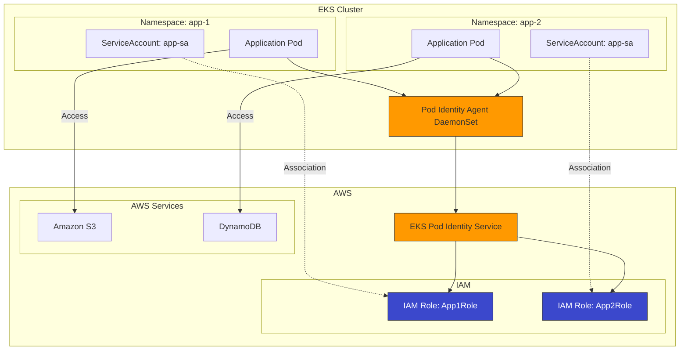

## Cluster Endpoint 访问控制

EKS cluster endpoint 访问控制决定用户和 workloads 如何访问 Kubernetes API server。正确配置对安全至关重要。

### Public/Private/Public+Private Endpoint 配置

EKS 支持三种 endpoint 访问配置：

| 配置 | Public Endpoint | Private Endpoint | 使用场景 |
|--------------|-----------------|------------------|----------|
| Public Only | 启用 | 禁用 | 开发、测试 |
| Private Only | 禁用 | 启用 | 高安全性生产环境 |
| Public + Private | 启用 | 启用 | 安全性和便利性的平衡 |

**Public Only**（默认）：
- API server 可从互联网访问
- Nodes 通过互联网通信
- 设置最简单，但安全性最低

**Private Only**：
- API server 只能从 VPC 内部访问
- kubectl 访问需要 VPN、Direct Connect 或 bastion host
- Nodes 通过 private network 通信
- 最安全的选项

**Public + Private**：
- API server 可从互联网和 VPC 访问
- Nodes 通过 private network 通信（效率更高）
- 安全性和可用性的良好平衡

### CIDR 限制设置

使用 public endpoint 时，将访问限制为特定 IP ranges：

```bash
# Update cluster to restrict public access
aws eks update-cluster-config \
  --name my-cluster \
  --resources-vpc-config \
    endpointPublicAccess=true,\
    endpointPrivateAccess=true,\
    publicAccessCidrs="10.0.0.0/8","203.0.113.0/24"
```

使用 eksctl：

```yaml
# cluster-config.yaml
apiVersion: eksctl.io/v1alpha5
kind: ClusterConfig
metadata:
  name: my-cluster
  region: us-west-2

vpc:
  clusterEndpoints:
    publicAccess: true
    privateAccess: true
  publicAccessCIDRs:
    - 10.0.0.0/8        # Internal corporate network
    - 203.0.113.0/24    # Office IP range
```

### Private Cluster 运行模式

运行 private-only EKS cluster 需要网络连接解决方案：

**模式 1：VPN Access**

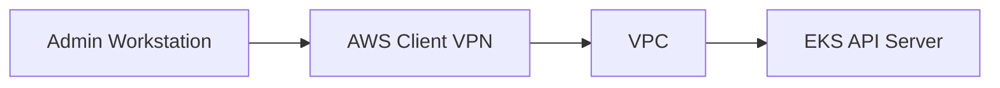

```bash
# Create Client VPN endpoint
aws ec2 create-client-vpn-endpoint \
  --client-cidr-block 10.100.0.0/16 \
  --server-certificate-arn arn:aws:acm:us-west-2:123456789012:certificate/abc123 \
  --authentication-options Type=certificate-authentication,MutualAuthentication={ClientRootCertificateChainArn=arn:aws:acm:us-west-2:123456789012:certificate/xyz789} \
  --connection-log-options Enabled=false \
  --vpc-id vpc-12345678
```

**模式 2：Transit Gateway**

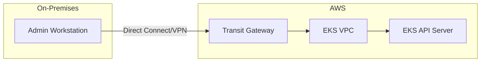

**模式 3：带 SSM 的 Bastion Host**

```yaml
# Bastion host deployment for kubectl access
apiVersion: apps/v1
kind: Deployment
metadata:
  name: kubectl-bastion
  namespace: kube-system
spec:
  replicas: 1
  selector:
    matchLabels:
      app: kubectl-bastion
  template:
    metadata:
      labels:
        app: kubectl-bastion
    spec:
      serviceAccountName: kubectl-bastion-sa
      containers:
      - name: bastion
        image: amazon/aws-cli:latest
        command: ["sleep", "infinity"]
        resources:
          requests:
            memory: "256Mi"
            cpu: "100m"
```

通过 SSM Session Manager 访问：

```bash
# Start SSM session to bastion pod's node
aws ssm start-session --target i-1234567890abcdef0

# Or use kubectl exec through SSM
aws ssm start-session \
  --target i-1234567890abcdef0 \
  --document-name AWS-StartPortForwardingSession \
  --parameters '{"portNumber":["443"],"localPortNumber":["6443"]}'
```

### Endpoint 访问控制配置示例

适用于 production-ready private cluster 的完整示例：

```bash
# Create cluster with private endpoint only
eksctl create cluster \
  --name production-cluster \
  --region us-west-2 \
  --vpc-private-subnets subnet-private1,subnet-private2,subnet-private3 \
  --without-nodegroup

# Update to private-only endpoint
aws eks update-cluster-config \
  --name production-cluster \
  --resources-vpc-config \
    endpointPublicAccess=false,\
    endpointPrivateAccess=true

# Verify endpoint configuration
aws eks describe-cluster \
  --name production-cluster \
  --query "cluster.resourcesVpcConfig.{PublicAccess:endpointPublicAccess,PrivateAccess:endpointPrivateAccess,PublicCIDRs:publicAccessCidrs}"
```

Private clusters 所需的 VPC endpoints：

```bash
# Create required VPC endpoints
for service in ec2 ecr.api ecr.dkr s3 logs sts elasticloadbalancing autoscaling; do
  aws ec2 create-vpc-endpoint \
    --vpc-id vpc-12345678 \
    --service-name com.amazonaws.us-west-2.${service} \
    --subnet-ids subnet-private1 subnet-private2 \
    --security-group-ids sg-12345678
done
```

### Customer-Routed Control Plane Egress (June 2026)

> **发布**: June 18, 2026 · [来源](https://aws.amazon.com/about-aws/whats-new/2026/06/amazon-eks-customer-routed-control-plane-egress/)

以前，当 EKS Kubernetes API server 需要访问外部 endpoints（admission webhooks、private OIDC providers、aggregated API servers）时，该 egress traffic 会通过 AWS-managed 路径离开。借助 Customer-Routed Control Plane Egress，你可以改为将此 control plane egress traffic 直接通过自己的 VPC 路由。

**支持的流量**：
- Admission webhook calls（OPA/Gatekeeper、Kyverno）
- Private OIDC provider access
- Aggregated API server access（例如 Metrics Server、custom APIs）

**关键特性**：
- 由于 control plane egress 穿过客户 VPC，你可以在自己的网络中实现 data perimeter，并监控/检查流量
- 可使用 SCP 中的 `eks:controlPlaneEgressMode` IAM condition key 在组织级别强制执行
- 可应用于现有 clusters，无额外费用，并在所有 regions 可用

```bash
# Enable customer-routed control plane egress on a cluster
aws eks update-cluster-config \
  --name my-cluster \
  --resources-vpc-config controlPlaneEgressMode=CUSTOMER_ROUTED
```

```json
// SCP example: enforce customer-routed egress mode
{
  "Version": "2012-10-17",
  "Statement": [
    {
      "Sid": "RequireCustomerRoutedControlPlaneEgress",
      "Effect": "Deny",
      "Action": [
        "eks:CreateCluster",
        "eks:UpdateClusterConfig"
      ],
      "Resource": "*",
      "Condition": {
        "StringNotEquals": {
          "eks:controlPlaneEgressMode": "CUSTOMER_ROUTED"
        }
      }
    }
  ]
}
```

## 网络安全

### Security Groups

你可以使用 AWS security groups 控制 EKS cluster 中流向 nodes 和 pods 的网络流量。

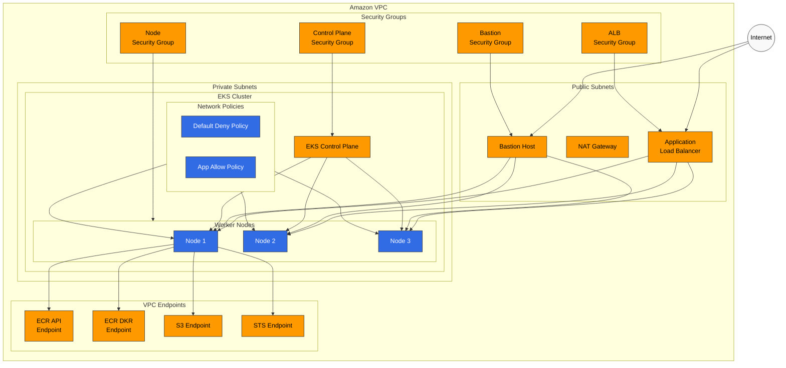

#### Cluster Security Group

EKS cluster security group 允许 control plane 和 worker nodes 之间通信：

- Port 443 (HTTPS): Cluster API server 通信
- Port 10250: kubelet API
- Port range 1025-65535: Node 间通信

#### Node Security Group

Worker nodes 的推荐 security group 配置：

- Inbound: 允许来自 cluster security group 的流量
- Outbound: 允许所有流量（可根据需要限制）

### Network Policies

你可以使用 Kubernetes network policies 控制 pods 之间的通信。在 EKS 中，可以通过 Amazon VPC CNI、Calico 和 Cilium 等 network plugins 实现 network policies。

#### Default Deny Policy 示例

```yaml
apiVersion: networking.k8s.io/v1
kind: NetworkPolicy
metadata:
  name: default-deny
  namespace: default
spec:
  podSelector: {}
  policyTypes:
  - Ingress
  - Egress
```

#### 特定 Applications 的 Allow Policy 示例

```yaml
apiVersion: networking.k8s.io/v1
kind: NetworkPolicy
metadata:
  name: api-allow
  namespace: default
spec:
  podSelector:
    matchLabels:
      app: api
  policyTypes:
  - Ingress
  ingress:
  - from:
    - podSelector:
        matchLabels:
          app: frontend
    ports:
    - protocol: TCP
      port: 8080
```

### VPC Endpoints

使用 VPC endpoints 对 AWS services 进行 private access，以便无需通过 internet gateway 即可安全访问 AWS services。

EKS clusters 推荐的 VPC endpoints：

- com.amazonaws.region.ecr.api
- com.amazonaws.region.ecr.dkr
- com.amazonaws.region.s3
- com.amazonaws.region.logs
- com.amazonaws.region.sts

## Pod 安全

### Pod Security Standards (PSS)

Pod Security Standards 于 Kubernetes 1.23 中引入，为限制 pods 的 security context 提供内置机制。你可以在 EKS 中应用以下级别的 PSS：

- **Privileged**: 无限制
- **Baseline**: 防止已知的 privilege escalation
- **Restricted**: 应用强安全限制

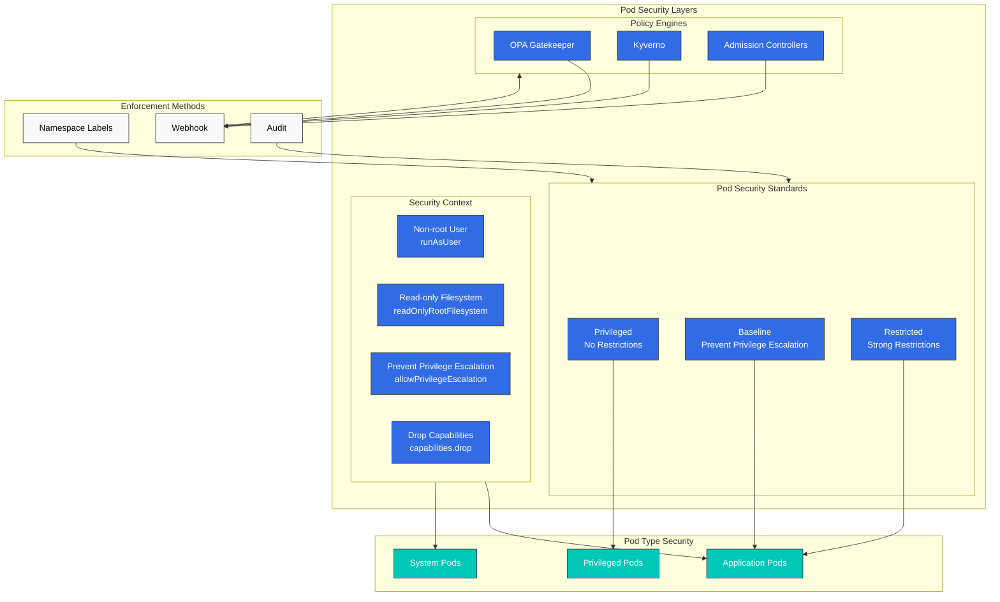

将 PSS 应用于 namespace 的示例：

```yaml
apiVersion: v1
kind: Namespace
metadata:
  name: secure-ns
  labels:
    pod-security.kubernetes.io/enforce: restricted
    pod-security.kubernetes.io/audit: restricted
    pod-security.kubernetes.io/warn: restricted
```

### Security Context

你可以在 pod 和 container 级别配置 security context 来限制权限：

```yaml
apiVersion: v1
kind: Pod
metadata:
  name: secure-pod
spec:
  securityContext:
    runAsUser: 1000
    runAsGroup: 3000
    fsGroup: 2000
  containers:
  - name: secure-container
    image: nginx
    securityContext:
      allowPrivilegeEscalation: false
      readOnlyRootFilesystem: true
      capabilities:
        drop:
        - ALL
```

### OPA Gatekeeper 和 Kyverno

你可以使用 OPA Gatekeeper 或 Kyverno 等 policy engines 在整个 cluster 中应用安全 policies。

#### Kyverno Policy 示例 - 防止 Privileged Containers

```yaml
apiVersion: kyverno.io/v1
kind: ClusterPolicy
metadata:
  name: disallow-privileged-containers
spec:
  validationFailureAction: enforce
  rules:
  - name: privileged-containers
    match:
      resources:
        kinds:
        - Pod
    validate:
      message: "Privileged containers are not allowed"
      pattern:
        spec:
          containers:
          - name: "*"
            securityContext:
              privileged: false
```

## Bottlerocket 和只读 OS

Bottlerocket 是一个专为运行 containers 而设计的、以安全为重点的专用 operating system。它通过最小化 footprint 和 immutable design 提供增强安全性。

### Bottlerocket 特性

**API-Based Configuration**：
- 默认没有 SSH 访问
- 通过 API (apiclient) 进行配置变更
- Settings 在 reboot 后保留
- Changes 在应用前进行验证

```bash
# Example: Configure Bottlerocket settings via user data
[settings.kubernetes]
cluster-name = "my-cluster"
api-server = "https://EXAMPLE.gr7.us-west-2.eks.amazonaws.com"
cluster-certificate = "BASE64_ENCODED_CERT"

[settings.kubernetes.node-labels]
"node.kubernetes.io/os" = "bottlerocket"

[settings.kubernetes.node-taints]
"bottlerocket" = "true:NoSchedule"
```

**Automatic Updates**：
- 基于 wave 的 update deployment
- 失败时自动 rollback
- 可配置的 update windows

```bash
# Configure update settings
[settings.updates]
targets-base-url = "https://updates.bottlerocket.aws/"
version-lock = "1.15.%"  # Lock to specific minor version
```

### SELinux Enforcement

Bottlerocket 默认以 enforcing mode 运行 SELinux：

- **Process Isolation**: Containers 无法访问 host resources
- **File System Protection**: 对 system files 进行严格访问控制
- **Network Isolation**: 受控的进程间 network access

SELinux 提供 mandatory access control，可防止：
- Container escape attacks
- Privilege escalation
- 未授权文件访问

### dm-verity (Root Filesystem Integrity)

dm-verity 对 root filesystem 提供 cryptographic verification：

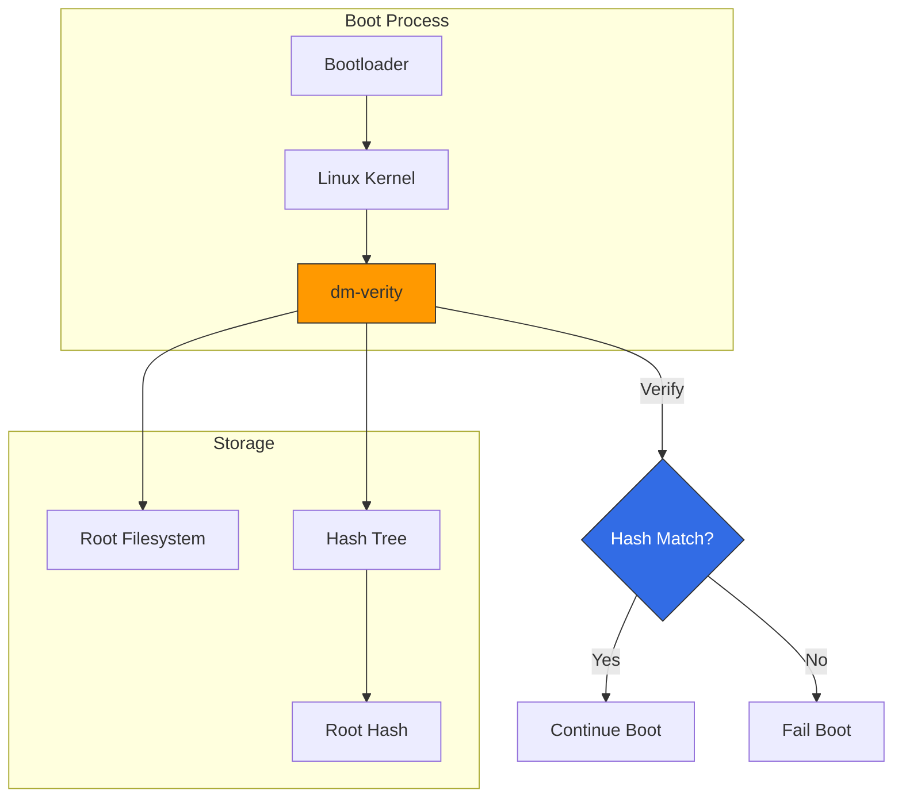

主要优势：
- **Tamper Detection**: 会检测到对 system files 的任何修改
- **Boot-Time Verification**: 在 containers 启动前验证 system integrity
- **Read-Only Root**: Root filesystem 以只读方式挂载

### Immutable Infrastructure 策略

Bottlerocket 支持真正的 immutable infrastructure 方法：

1. **No In-Place Updates**: 替换 nodes，而不是进行 patch
2. **Consistent State**: 每个 node 都从已知良好的 image 启动
3. **Audit Trail**: 所有变更都通过 AMI versions 跟踪
4. **Fast Recovery**: 通过启动先前 AMI 进行 rollback

实施模式：

```yaml
# Node group with Bottlerocket
apiVersion: eksctl.io/v1alpha5
kind: ClusterConfig
metadata:
  name: secure-cluster
  region: us-west-2

managedNodeGroups:
  - name: bottlerocket-ng
    instanceType: m5.large
    desiredCapacity: 3
    amiFamily: Bottlerocket
    bottlerocket:
      settings:
        kubernetes:
          node-labels:
            os: bottlerocket
        host-containers:
          admin:
            enabled: false  # Disable admin container for production
```

### 将 Bottlerocket 与 EKS Managed Node Groups 结合使用

Bottlerocket managed node groups 的完整设置：

```bash
# Create managed node group with Bottlerocket
aws eks create-nodegroup \
  --cluster-name my-cluster \
  --nodegroup-name bottlerocket-nodes \
  --node-role arn:aws:iam::123456789012:role/EKSNodeRole \
  --subnets subnet-1 subnet-2 subnet-3 \
  --ami-type BOTTLEROCKET_x86_64 \
  --instance-types m5.large \
  --scaling-config minSize=2,maxSize=10,desiredSize=3 \
  --update-config maxUnavailable=1
```

使用 eksctl 和高级配置：

```yaml
apiVersion: eksctl.io/v1alpha5
kind: ClusterConfig
metadata:
  name: production-cluster
  region: us-west-2

managedNodeGroups:
  - name: bottlerocket-workers
    instanceType: m5.xlarge
    minSize: 3
    maxSize: 20
    desiredCapacity: 5
    amiFamily: Bottlerocket
    volumeSize: 100
    volumeType: gp3
    volumeEncrypted: true
    iam:
      attachPolicyARNs:
        - arn:aws:iam::aws:policy/AmazonEKSWorkerNodePolicy
        - arn:aws:iam::aws:policy/AmazonEKS_CNI_Policy
        - arn:aws:iam::aws:policy/AmazonEC2ContainerRegistryReadOnly
        - arn:aws:iam::aws:policy/AmazonSSMManagedInstanceCore
    bottlerocket:
      settings:
        kubernetes:
          node-labels:
            workload-type: general
            os: bottlerocket
          node-taints:
            - key: "CriticalAddonsOnly"
              value: "true"
              effect: "NoSchedule"
        kernel:
          sysctl:
            "net.core.somaxconn": "32768"
            "net.ipv4.tcp_max_syn_backlog": "32768"
        host-containers:
          admin:
            enabled: false
          control:
            enabled: true
```

## IAM Permission Boundaries

IAM Permission Boundaries 提供一种机制，用于设置 IAM entity 可以拥有的最大权限，无论附加到它的 policies 是什么。

### Permission Boundary 概念

有效权限是 identity-based policies 和 permission boundaries 的交集：

```
Effective Permissions = Identity Policy ∩ Permission Boundary
```

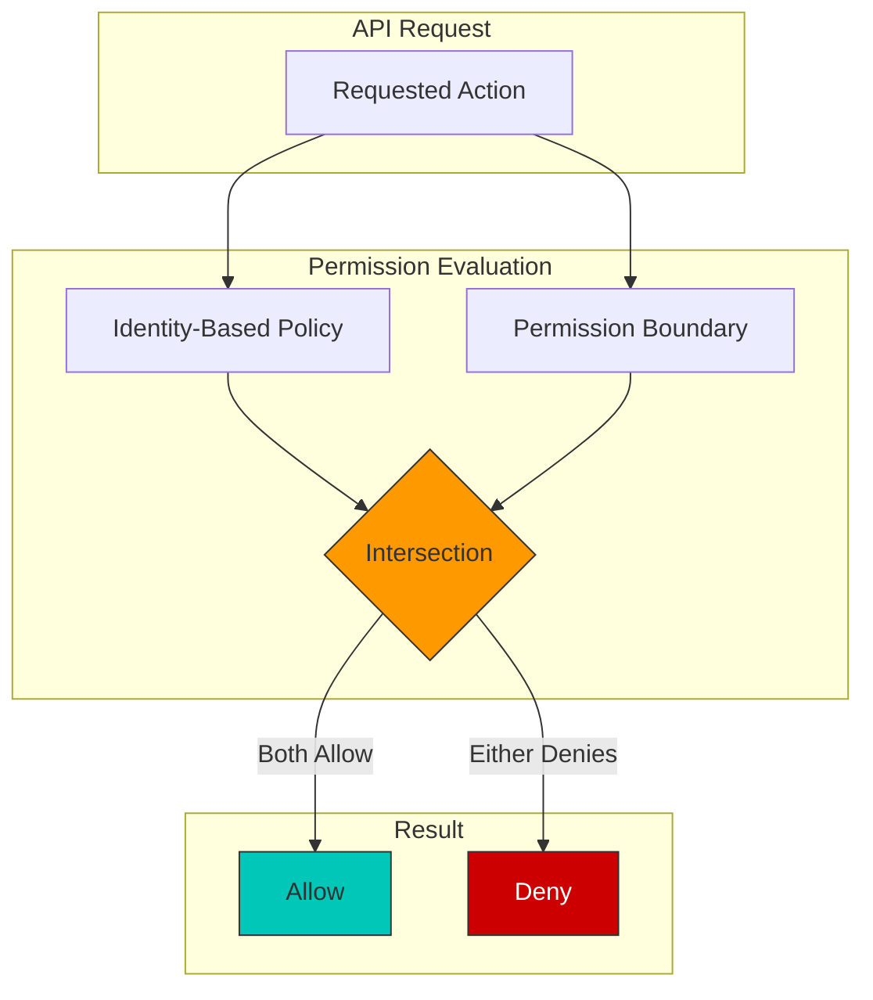

示例场景：
- Identity policy 允许：`s3:*`, `ec2:*`, `rds:*`
- Permission boundary 允许：`s3:*`, `ec2:Describe*`
- 有效权限：`s3:*`, `ec2:Describe*`

### SCP (Service Control Policy) 用法

SCPs 在 AWS Organizations 级别提供 guardrails：

```json
{
  "Version": "2012-10-17",
  "Statement": [
    {
      "Sid": "DenyEKSClusterDeletion",
      "Effect": "Deny",
      "Action": "eks:DeleteCluster",
      "Resource": "*",
      "Condition": {
        "StringNotLike": {
          "aws:PrincipalArn": "arn:aws:iam::*:role/EKSAdminRole"
        }
      }
    },
    {
      "Sid": "RequireIMDSv2",
      "Effect": "Deny",
      "Action": "ec2:RunInstances",
      "Resource": "arn:aws:ec2:*:*:instance/*",
      "Condition": {
        "StringNotEquals": {
          "ec2:MetadataHttpTokens": "required"
        }
      }
    },
    {
      "Sid": "DenyPublicEKSEndpoint",
      "Effect": "Deny",
      "Action": "eks:UpdateClusterConfig",
      "Resource": "*",
      "Condition": {
        "Bool": {
          "eks:endpointPublicAccess": "true"
        }
      }
    }
  ]
}
```

### Least Privilege IAM Policy 模式

EKS IAM policies 的最佳实践：

**模式 1：Namespace-Scoped Permissions**

```json
{
  "Version": "2012-10-17",
  "Statement": [
    {
      "Sid": "AllowNamespaceOperations",
      "Effect": "Allow",
      "Action": [
        "eks:DescribeCluster",
        "eks:ListClusters"
      ],
      "Resource": "*"
    },
    {
      "Sid": "AllowSpecificClusterAccess",
      "Effect": "Allow",
      "Action": [
        "eks:AccessKubernetesApi"
      ],
      "Resource": "arn:aws:eks:us-west-2:123456789012:cluster/production-cluster",
      "Condition": {
        "StringEquals": {
          "eks:namespaces": ["team-a", "team-a-staging"]
        }
      }
    }
  ]
}
```

**模式 2：Resource-Based Restrictions**

```json
{
  "Version": "2012-10-17",
  "Statement": [
    {
      "Sid": "AllowECRPull",
      "Effect": "Allow",
      "Action": [
        "ecr:GetDownloadUrlForLayer",
        "ecr:BatchGetImage",
        "ecr:BatchCheckLayerAvailability"
      ],
      "Resource": "arn:aws:ecr:us-west-2:123456789012:repository/approved-*"
    },
    {
      "Sid": "AllowECRAuth",
      "Effect": "Allow",
      "Action": "ecr:GetAuthorizationToken",
      "Resource": "*"
    }
  ]
}
```

**模式 3：Condition-Based Access**

```json
{
  "Version": "2012-10-17",
  "Statement": [
    {
      "Sid": "AllowS3AccessWithTags",
      "Effect": "Allow",
      "Action": [
        "s3:GetObject",
        "s3:PutObject"
      ],
      "Resource": "arn:aws:s3:::app-bucket/*",
      "Condition": {
        "StringEquals": {
          "aws:ResourceTag/Environment": "${aws:PrincipalTag/Environment}"
        }
      }
    }
  ]
}
```

### EKS Node Role Permission Boundary 示例

将 permission boundaries 应用于 EKS node roles，以限制 blast radius：

```json
{
  "Version": "2012-10-17",
  "Statement": [
    {
      "Sid": "AllowEKSNodeOperations",
      "Effect": "Allow",
      "Action": [
        "ec2:DescribeInstances",
        "ec2:DescribeVolumes",
        "ec2:DescribeNetworkInterfaces",
        "ec2:AttachVolume",
        "ec2:DetachVolume",
        "ecr:GetAuthorizationToken",
        "ecr:BatchCheckLayerAvailability",
        "ecr:GetDownloadUrlForLayer",
        "ecr:BatchGetImage",
        "logs:CreateLogStream",
        "logs:PutLogEvents"
      ],
      "Resource": "*"
    },
    {
      "Sid": "DenyPrivilegedActions",
      "Effect": "Deny",
      "Action": [
        "iam:*",
        "organizations:*",
        "account:*",
        "eks:DeleteCluster",
        "eks:UpdateClusterConfig",
        "ec2:DeleteVpc",
        "ec2:DeleteSubnet",
        "ec2:DeleteSecurityGroup"
      ],
      "Resource": "*"
    },
    {
      "Sid": "AllowSecretsInNamespace",
      "Effect": "Allow",
      "Action": [
        "secretsmanager:GetSecretValue"
      ],
      "Resource": "arn:aws:secretsmanager:*:*:secret:/eks/production/*"
    }
  ]
}
```

将 boundary 应用于 node role：

```bash
# Create permission boundary
aws iam create-policy \
  --policy-name EKSNodePermissionBoundary \
  --policy-document file://node-permission-boundary.json

# Apply boundary to node role
aws iam put-role-permissions-boundary \
  --role-name EKSNodeRole \
  --permissions-boundary arn:aws:iam::123456789012:policy/EKSNodePermissionBoundary

# Verify boundary is applied
aws iam get-role --role-name EKSNodeRole --query "Role.PermissionsBoundary"
```

### 使用 7 个新的 IAM Condition Keys 进行主动治理 (April 2026)

> **发布**: April 20, 2026 · [来源](https://aws.amazon.com/about-aws/whats-new/2026/04/amazon-eks-iam-condition-keys/)

Amazon EKS 新增了 7 个 IAM condition keys，可让你在 cluster 创建和更新时间实施基于 policy 的主动治理。这些 conditions 可应用于 `CreateCluster`、`UpdateClusterConfig`、`UpdateClusterVersion` 和 `AssociateEncryptionConfig` APIs，并与 AWS Organizations SCPs 集成。

| Condition Key | 用途 |
|----------------|---------|
| `eks:endpointPublicAccess` / `eks:endpointPrivateAccess` | 强制使用 private endpoint |
| `eks:encryptionConfigProviderKeyArns` | 要求基于 KMS 的 secrets encryption |
| `eks:kubernetesVersion` | 将 cluster 创建/升级限制为批准的 Kubernetes versions |
| `eks:controlPlaneScalingTier` | 限制 control plane scaling tier |
| `eks:deletionProtection` | 强制 cluster deletion protection |
| `eks:zonalShiftEnabled` | 控制是否启用 zonal shift |

```json
// SCP example: require private endpoint and KMS encryption
{
  "Version": "2012-10-17",
  "Statement": [
    {
      "Sid": "RequirePrivateEndpointAndKmsEncryption",
      "Effect": "Deny",
      "Action": [
        "eks:CreateCluster",
        "eks:UpdateClusterConfig"
      ],
      "Resource": "*",
      "Condition": {
        "Bool": {
          "eks:endpointPublicAccess": "true"
        }
      }
    },
    {
      "Sid": "RequireEncryptionConfig",
      "Effect": "Deny",
      "Action": "eks:CreateCluster",
      "Resource": "*",
      "Condition": {
        "Null": {
          "eks:encryptionConfigProviderKeyArns": "true"
        }
      }
    },
    {
      "Sid": "RestrictKubernetesVersion",
      "Effect": "Deny",
      "Action": [
        "eks:CreateCluster",
        "eks:UpdateClusterVersion"
      ],
      "Resource": "*",
      "Condition": {
        "StringNotEquals": {
          "eks:kubernetesVersion": ["1.32", "1.33"]
        }
      }
    }
  ]
}
```

## 加密和 Secrets 管理

### EKS 加密选项

#### etcd 加密

EKS 默认加密存储在 etcd 中的 Kubernetes secrets。你可以使用 AWS KMS 添加额外的加密层：

```mermaid
flowchart TD
    subgraph Encryption_Options ["EKS Encryption Options"]
        subgraph ETCD_Encryption ["etcd Encryption"]
            Default[Default Encryption]
            KMS_Encryption[AWS KMS Encryption]
        end

        subgraph Secret_Management ["Secrets Management Solutions"]
            K8s_Secrets[Kubernetes Secrets]
            AWS_SM[AWS Secrets Manager]
            AWS_PS[AWS Parameter Store]
            Vault[HashiCorp Vault]
            SOPS[Mozilla SOPS]
        end

        subgraph Integration_Tools ["Integration Tools"]
            ESO["External Secrets
                Operator"]
            ASCP["AWS Secrets and
                Configuration Provider"]
            CSI_Driver["Secrets Store
                CSI Driver"]
        end
    end

    subgraph Usage_Patterns ["Usage Patterns"]
        subgraph Storage ["Storage"]
            Encrypted_Storage[Encrypted Storage]
            Version_Control[Version Control]
            Access_Control[Access Control]
        end

        subgraph Retrieval ["Retrieval"]
            Pod_Mount[Pod Mount]
            Env_Vars[Environment Variables]
            Init_Container[Init Container]
        end
    end

    KMS_Encryption --> Default

    AWS_SM --> ESO
    AWS_PS --> ESO
    AWS_SM --> ASCP
    AWS_PS --> ASCP
    Vault --> CSI_Driver

    ESO --> K8s_Secrets
    ASCP --> K8s_Secrets
    CSI_Driver --> K8s_Secrets

    K8s_Secrets --> Encrypted_Storage
    AWS_SM --> Encrypted_Storage
    AWS_PS --> Encrypted_Storage
    Vault --> Encrypted_Storage
    SOPS --> Encrypted_Storage

    AWS_SM --> Version_Control
    Vault --> Version_Control

    AWS_SM --> Access_Control
    AWS_PS --> Access_Control
    Vault --> Access_Control

    K8s_Secrets --> Pod_Mount
    K8s_Secrets --> Env_Vars
    K8s_Secrets --> Init_Container

    %% Class definitions
    classDef awsService fill:#FF9900,stroke:#333,stroke-width:1px,color:black;
    classDef k8sComponent fill:#326CE5,stroke:#333,stroke-width:1px,color:white;
    classDef userApp fill:#00C7B7,stroke:#333,stroke-width:1px,color:white;
    classDef dataStore fill:#3B48CC,stroke:#333,stroke-width:1px,color:white;
    classDef default fill:#f9f9f9,stroke:#333,stroke-width:1px,color:black;

    %% Class application
    class KMS_Encryption,AWS_SM,AWS_PS,ASCP awsService;
    class K8s_Secrets,ESO,CSI_Driver k8sComponent;
    class Vault,SOPS userApp;
    class Default,Encrypted_Storage,Version_Control,Access_Control,Pod_Mount,Env_Vars,Init_Container default;
```

```bash
eksctl create cluster --name my-cluster --region us-west-2 --encryption-provider-config-key arn:aws:kms:us-west-2:111122223333:key/1234abcd-12ab-34cd-56ef-1234567890ab
```

### AWS Secrets Manager 和 Parameter Store 集成

你可以使用 External Secrets Operator 或 AWS Secrets and Configuration Provider (ASCP)，将存储在 AWS Secrets Manager 或 Parameter Store 中的 secrets 挂载到 Kubernetes pods。

#### 安装 External Secrets Operator

```bash
helm repo add external-secrets https://charts.external-secrets.io
helm install external-secrets external-secrets/external-secrets -n external-secrets --create-namespace
```

#### 定义 SecretStore 和 ExternalSecret

```yaml
apiVersion: external-secrets.io/v1beta1
kind: SecretStore
metadata:
  name: aws-secretsmanager
spec:
  provider:
    aws:
      service: SecretsManager
      region: us-west-2
      auth:
        jwt:
          serviceAccountRef:
            name: external-secrets-sa
---
apiVersion: external-secrets.io/v1beta1
kind: ExternalSecret
metadata:
  name: db-credentials
spec:
  refreshInterval: 1h
  secretStoreRef:
    name: aws-secretsmanager
    kind: SecretStore
  target:
    name: db-credentials
  data:
  - secretKey: username
    remoteRef:
      key: db-credentials
      property: username
  - secretKey: password
    remoteRef:
      key: db-credentials
      property: password
```

### SOPS (Secrets OPerationS)

你可以使用 Mozilla SOPS 在 Git repositories 中安全存储和管理 encrypted secrets。

#### SOPS 安装和使用

```bash
# Install SOPS
brew install sops

# Encrypt secrets using AWS KMS key
sops --encrypt --aws-profile default --kms arn:aws:kms:us-west-2:111122223333:key/1234abcd-12ab-34cd-56ef-1234567890ab secrets.yaml > secrets.enc.yaml

# Decrypt encrypted secrets
sops --decrypt secrets.enc.yaml
```

## 合规和审计

### EKS Audit Logging

你可以启用 EKS control plane audit logs，以记录 cluster 中发生的所有 API calls：

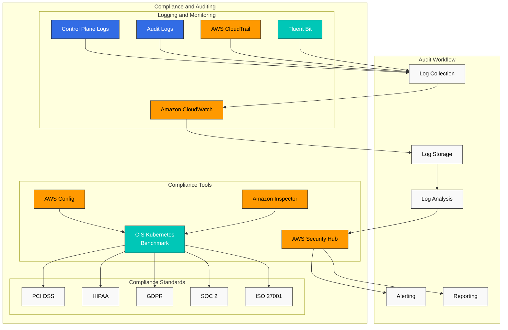

```bash
aws eks update-cluster-config \
  --region us-west-2 \
  --name my-cluster \
  --logging '{"clusterLogging":[{"types":["api","audit","authenticator","controllerManager","scheduler"],"enabled":true}]}'
```

### AWS Config Rules

你可以使用 AWS Config 监控 EKS cluster 的合规状态：

- eks-cluster-logging-enabled
- eks-cluster-oldest-supported-version
- eks-endpoint-no-public-access
- eks-secrets-encrypted

### AWS Security Hub 集成

你可以使用 AWS Security Hub 集中管理和监控 EKS cluster 的安全态势。Security Hub 会根据 CIS Kubernetes Benchmark 等行业标准检查合规性。

## 安全监控和检测

### GuardDuty EKS Protection

你可以启用 Amazon GuardDuty EKS Protection，以检测 EKS cluster 中的潜在安全威胁：

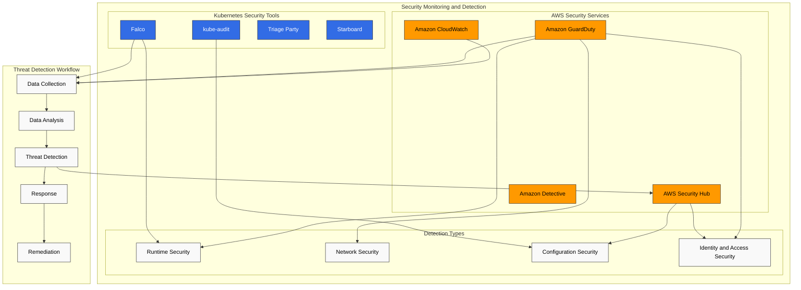

```bash
aws guardduty update-detector \
  --detector-id 12abc34d567e8fa901bc2d34e56789f0 \
  --features '[{"Name": "EKS_RUNTIME_MONITORING", "Status": "ENABLED"}]'
```

### AWS Security Hub

你可以使用 AWS Security Hub 集中管理和监控 EKS cluster 的安全态势：

```bash
aws securityhub enable-security-hub
aws securityhub batch-enable-standards --standards-subscription-requests '[{"StandardsArn":"arn:aws:securityhub:us-west-2::standards/aws-foundational-security-best-practices/v/1.0.0"}]'
```

### Falco

你可以使用 Falco 执行 runtime security monitoring 和 anomaly detection：

```bash
helm repo add falcosecurity https://falcosecurity.github.io/charts
helm install falco falcosecurity/falco --namespace falco --create-namespace
```

Falco rule 示例：

```yaml
- rule: Terminal shell in container
  desc: A shell was spawned by a pod in the container
  condition: container and shell_procs and not container_entrypoint
  output: Shell spawned in a container (user=%user.name pod=%k8s.pod.name container=%container.name shell=%proc.name parent=%proc.pname cmdline=%proc.cmdline)
  priority: WARNING
```

## EKS 安全最佳实践

### Cluster 安全加固

1. **保持最新 Kubernetes Version**: 定期将 EKS cluster 升级到最新版本以应用安全 patches
2. **使用 Private API Endpoint**: 限制 public internet 对 API server 的访问
3. **应用 Principle of Least Privilege**: 对 IAM roles 和 RBAC 应用 least privilege principle
4. **限制 Security Groups**: 配置 security groups 仅允许必要 ports
5. **实施 Network Policies**: 应用 network policies 限制 pods 之间的通信

### Node 和 Container 安全

1. **使用最新 AMI**: 使用带有最新安全 patches 的 EKS-optimized AMI
2. **扫描 Container Images**: 使用 ECR image scanning 或 Trivy 等工具进行 vulnerability scanning
3. **使用 Immutable Infrastructure**: 更新 nodes 时创建新的 node groups 并删除旧的 node groups
4. **以 Non-Root User 运行 Containers**: 以 non-root user 运行 containers 以限制权限
5. **使用 Read-Only Filesystem**: 尽可能以只读方式挂载 container root filesystem

### 持续安全监控

1. **启用 Audit Logging**: 启用 EKS control plane audit logs
2. **启用 GuardDuty EKS Protection**: 为 runtime security monitoring 启用 GuardDuty EKS Protection
3. **Security Hub 集成**: 使用 AWS Security Hub 进行集中式安全态势管理
4. **定期安全评估**: 基于 CIS Kubernetes Benchmark 执行定期安全评估
5. **建立 Incident Response Plan**: 为 EKS cluster 建立并测试 security incident response plan

## 金融服务中的 EKS 安全注意事项

在金融服务行业使用 EKS 时需要考虑的额外安全要求：

### 法规合规

1. **PCI DSS**: 处理 card payment data 的 workloads 需符合 PCI DSS 要求
2. **GDPR/CCPA**: 针对 personally identifiable information (PII) 符合 data protection regulations
3. **金融法规**: 符合国内金融监管要求（例如 Financial Supervisory Service 指南）

### 数据安全

1. **Encryption in Transit**: 使用 TLS 1.2 或更高版本加密所有网络通信
2. **Data at Rest Encryption**: 使用 AWS KMS 加密静态数据
3. **Data Classification**: 按敏感性对数据进行分类，并应用适当的安全控制
4. **Data Access Logging**: 对所有敏感数据访问进行详细 logging 和 monitoring

### High Availability 和 Disaster Recovery

1. **Multi-AZ Deployment**: 跨多个 availability zones 部署 EKS cluster
2. **Disaster Recovery Plan**: 建立 disaster recovery plan，包括定期 backups 和 recovery testing
3. **Business Continuity**: 定义适合金融服务的 RTO (Recovery Time Objective) 和 RPO (Recovery Point Objective)

### 金融服务的 EKS 安全架构示例

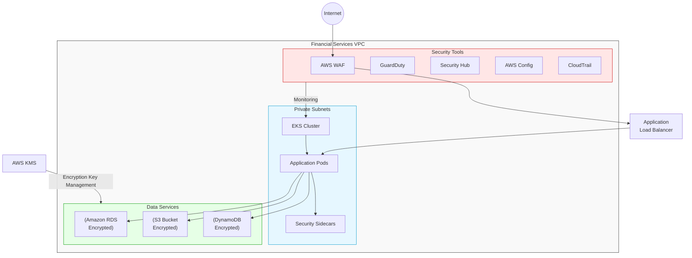

## 结论

Amazon EKS 安全通过多层防御策略实现。你可以通过 IAM 和 RBAC 实现强身份验证和授权，通过 network policies 和 security groups 实现网络安全，通过 Pod Security Standards 和 security context 实现 workload 安全，并与各种 AWS security services 集成，从而安全地运行你的 EKS cluster。

在金融服务等监管严格的行业中，应考虑额外的安全控制和合规要求。通过定期安全评估、vulnerability scanning 和持续监控来维护 EKS environment 的安全态势非常重要。

## 参考资料

- [Amazon EKS Security Best Practices](https://aws.github.io/aws-eks-best-practices/security/docs/)
- [Kubernetes Security Best Practices](https://kubernetes.io/docs/concepts/security/overview/)
- [CIS Kubernetes Benchmark](https://www.cisecurity.org/benchmark/kubernetes)
- [AWS Security Hub](https://aws.amazon.com/security-hub/)
- [Amazon GuardDuty](https://aws.amazon.com/guardduty/)
- [Amazon EKS Customer-Routed Control Plane Egress (2026-06-18)](https://aws.amazon.com/about-aws/whats-new/2026/06/amazon-eks-customer-routed-control-plane-egress/)
- [Amazon EKS New IAM Condition Keys (2026-04-20)](https://aws.amazon.com/about-aws/whats-new/2026/04/amazon-eks-iam-condition-keys/)

## 测验

要测试你在本章中学到的内容，请尝试 [主题测验](../quizzes/eks/05-eks-security-quiz.md)。
