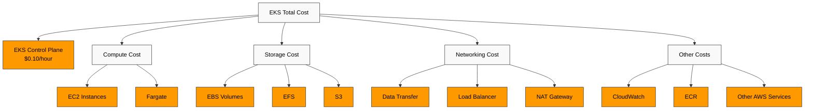
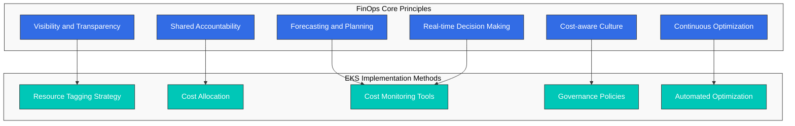
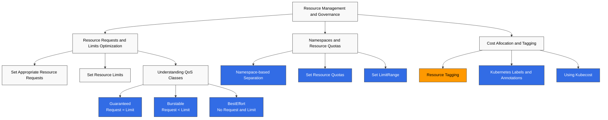

# Amazon EKS Cost Optimization

> **支持版本**: Amazon EKS 1.31, 1.32, 1.33
> **最后更新**: February 22, 2026

Amazon EKS (Elastic Kubernetes Service) 使部署、管理和扩展容器化应用程序变得简单，但有效管理成本同样重要。本文档介绍用于优化 EKS cluster 成本的各种策略和最佳实践。

## Table of Contents

1. [EKS Cost Components](#eks-cost-components)
2. [FinOps Principles and EKS](#finops-principles-and-eks)
3. [Compute Cost Optimization](#compute-cost-optimization)
4. [Storage Cost Optimization](#storage-cost-optimization)
5. [Networking Cost Optimization](#networking-cost-optimization)
6. [Resource Management and Governance](#resource-management-and-governance)
7. [Cost Monitoring and Analysis](#cost-monitoring-and-analysis)
8. [Cost Optimization Best Practices](#cost-optimization-best-practices)

## EKS Cost Components

使用 Amazon EKS 产生的成本由以下组件构成：



## FinOps Principles and EKS

FinOps (Financial Operations) 是一种云成本管理运营模型，在该模型中，财务、技术和业务团队协作，共同承担云支出责任并做出成本优化决策。

### Core Principles of the FinOps Framework



### Applying FinOps to EKS

1. **实现成本可见性**
   - 使用 Kubernetes namespaces、labels 和 annotations 进行成本分摊
   - 通过集成 AWS Cost Explorer 和 Kubecost 等工具进行详细成本分析
   - 按团队、应用程序和环境进行成本分析

2. **实施共同责任模型**
   - 按团队进行成本分摊和报告
   - 设置并跟踪成本优化目标
   - 为节省成本提供激励

3. **自动化持续优化**
   - 实施 auto-scaling 策略
   - 自动化 spot instance 利用
   - 检测并移除空闲资源

4. **成本预测和规划**
   - 通过 workload 模式分析进行成本预测
   - 利用 Reserved Instances 和 Savings Plans
   - 成本异常检测和告警

### Latest FinOps Tools and Technologies

1. **Kubecost**: Kubernetes 成本监控和优化工具
2. **AWS Cost Anomaly Detection**: 检测异常成本增长
3. **Karpenter**: 高效的 node 预置和成本优化
4. **Goldilocks**: Resource requests 和 limits 优化
5. **Vertical Pod Autoscaler**: 自动调整 pod 资源 requests

### EKS Cluster Cost

EKS cluster 本身的成本：

- **EKS Control Plane**: 每小时 $0.10（可能因区域而异）
- **EKS Extended Cluster**: 每小时 $0.10（可能因区域而异）

### Compute Cost

在 EKS cluster 中运行的 worker nodes 成本：

- **EC2 Instances**: 用于 node groups 的 EC2 instances 成本
- **Fargate**: 使用 Fargate profiles 时基于 vCPU 和内存使用量的成本

### Storage Cost

EKS cluster 中使用的存储成本：

- **EBS Volumes**: 用于 persistent volumes 的 EBS volumes 成本
- **EFS**: 用于共享文件系统的 EFS 成本
- **S3**: 用于对象存储的 S3 成本

### Networking Cost

与 EKS cluster 网络相关的成本：

- **Data Transfer**: 区域之间或到互联网的数据传输成本
- **Load Balancer**: 用于 services 的 load balancers 成本
- **NAT Gateway**: 私有 subnets 出站流量的 NAT gateway 成本

### Other Costs

- **CloudWatch**: 用于监控和日志记录的 CloudWatch 成本
- **ECR**: 用于容器镜像存储的 ECR 成本
- **Other AWS Services**: 与 EKS cluster 一起使用的其他 AWS services 成本

## Compute Cost Optimization

计算成本通常是 EKS cluster 最大的成本组件。你可以使用以下策略优化计算成本。

```mermaid
flowchart TD
    ComputeCost[Compute Cost Optimization] --> InstanceType[Instance Type Optimization]
    ComputeCost --> SpotInstances[Spot Instance Utilization]
    ComputeCost --> SavingsPlans["Savings Plans and
                Reserved Instances"]
    ComputeCost --> AutoScaling[Auto Scaling Optimization]
    ComputeCost --> FargateVsEC2["Fargate vs EC2
                Cost Comparison"]

    InstanceType --> Family[Instance Family Selection]
    InstanceType --> Size[Instance Size Optimization]
    InstanceType --> Generation[Instance Generation Consideration]

    SpotInstances --> WorkloadTypes[Suitable Workload Types]
    SpotInstances --> ManagedNodeGroups[Managed Node Groups]
    SpotInstances --> Karpenter[Karpenter Utilization]
    SpotInstances --> InterruptionHandling[Interruption Handling]

    SavingsPlans --> ComputeSP[Compute Savings Plans]
    SavingsPlans --> EC2SP[EC2 Instance Savings Plans]
    SavingsPlans --> RI[Reserved Instances]

    AutoScaling --> CA[Cluster Autoscaler]
    AutoScaling --> KarpenterAS[Karpenter]
    AutoScaling --> HPA[Horizontal Pod Autoscaler]
    AutoScaling --> VPA[Vertical Pod Autoscaler]

    %% Class definitions
    classDef awsService fill:#FF9900,stroke:#333,stroke-width:1px,color:black;
    classDef k8sComponent fill:#326CE5,stroke:#333,stroke-width:1px,color:white;
    classDef default fill:#f9f9f9,stroke:#333,stroke-width:1px,color:black;

    %% Class application
    class ComputeSP,EC2SP,RI,SpotInstances,ManagedNodeGroups awsService;
    class CA,KarpenterAS,HPA,VPA,Karpenter k8sComponent;
    class ComputeCost,InstanceType,Family,Size,Generation,WorkloadTypes,InterruptionHandling,SavingsPlans,AutoScaling,FargateVsEC2 default;
```



### Selecting the Right Instance Type

为你的 workload 选择正确的 instance type 非常重要：

#### Instance Family Selection

根据 workload 特征选择适当的 instance family：

- **General Purpose (T3, M5, M6)**: 需要均衡计算、内存和网络资源的 workloads
- **Compute Optimized (C5, C6)**: 需要高性能处理器的计算密集型 workloads
- **Memory Optimized (R5, R6, X1)**: 大型内存数据库、缓存等内存密集型 workloads
- **Storage Optimized (I3, D2)**: 需要高磁盘 I/O 的 workloads
- **Accelerated Computing (P3, G4, Inf1)**: 需要 GPU 或机器学习加速器的 workloads

#### Instance Size Optimization

根据 workload 需求选择适当的 instance size：

- 过大的 instances 会导致资源浪费。
- 过小的 instances 会导致性能问题。
- 使用 CloudWatch Container Insights 或 Kubernetes metrics 监控实际资源使用情况，并选择适当的 size。

#### Instance Generation Consideration

较新一代 instances 通常比上一代提供更好的性能和成本效率：

- 使用 M6i 或 M6g 替代 M5
- 使用 C6i 或 C6g 替代 C5
- 使用 R6i 或 R6g 替代 R5

### Spot Instance Utilization

使用 spot instances 可以让你以比 on-demand 价格低最多 90% 的成本使用 EC2 instances：

#### Workloads Suitable for Spot Instances

- **Stateless Applications**: 不存储状态的应用程序
- **Fault-tolerant Applications**: 能够处理 instance 中断的应用程序
- **Batch Processing Jobs**: 中断后可以重新启动的 jobs
- **CI/CD Pipelines**: 构建和测试 jobs

#### Using Spot Instances in Managed Node Groups

```bash
eksctl create nodegroup \
  --cluster my-cluster \
  --name my-spot-ng \
  --node-type m5.large \
  --nodes-min 2 \
  --nodes-max 5 \
  --spot
```

#### Spot Instance Provisioning with Karpenter

```yaml
apiVersion: karpenter.sh/v1
kind: NodePool
metadata:
  name: spot
spec:
  template:
    spec:
      requirements:
      - key: karpenter.sh/capacity-type
        operator: In
        values: ["spot"]
      - key: kubernetes.io/arch
        operator: In
        values: ["amd64"]
      - key: node.kubernetes.io/instance-type
        operator: In
        values: ["m5.large", "m5.xlarge", "m5.2xlarge"]
      nodeClassRef:
        group: karpenter.k8s.aws
        kind: EC2NodeClass
        name: spot-class
  limits:
    cpu: 1000
    memory: 1000Gi
  disruption:
    consolidationPolicy: WhenEmpty
    consolidateAfter: 30s
---
apiVersion: karpenter.k8s.aws/v1
kind: EC2NodeClass
metadata:
  name: spot-class
spec:
  subnetSelectorTerms:
    - tags:
        karpenter.sh/discovery: my-cluster
  securityGroupSelectorTerms:
    - tags:
        karpenter.sh/discovery: my-cluster
```

#### Spot Instance Interruption Handling

处理 spot instance 中断的最佳实践：

1. **使用多种 Instance Types**: 通过使用多种 instance types 分散中断风险
2. **使用多个 Availability Zones**: 跨多个 availability zones 部署 instances
3. **使用 Spot Instance Interruption Handler**: 使用 AWS Node Termination Handler 处理中断通知

```bash
helm repo add eks https://aws.github.io/eks-charts
helm install aws-node-termination-handler \
  --namespace kube-system \
  eks/aws-node-termination-handler \
  --set enableSpotInterruptionDraining=true
```

### Savings Plans and Reserved Instances

对于可预测的 workloads，可以通过使用 Savings Plans 或 Reserved Instances 降低成本：

#### Compute Savings Plans

Compute Savings Plans 在承诺使用 1 年或 3 年的情况下，可相比 on-demand 费率提供最高 66% 的折扣：

- **灵活性**: 无论 instance family、size、OS、tenancy 和区域如何都适用
- **包括 EC2、Fargate 和 Lambda**: 适用于多个计算服务

#### EC2 Instance Savings Plans

EC2 Instance Savings Plans 针对特定区域中的 instance families 提供最高 72% 的折扣：

- **中等灵活性**: 在特定区域内，适用于同一 instance family 中的不同 sizes 和 OS
- **更高折扣率**: 提供比 Compute Savings Plans 更高的折扣率

#### Reserved Instances

Reserved Instances 针对特定 instance types 和区域提供最高 75% 的折扣：

- **低灵活性**: 绑定到特定 instance types、区域和 availability zones
- **最高折扣率**: 提供最高的折扣率

### Fargate vs EC2 Cost Comparison

在 Fargate 和 EC2 之间选择时，请考虑成本：

#### Fargate Advantages

- **降低运维开销**: 无需 node 管理
- **精确资源预置**: 在 pod 级别进行资源分配
- **无空闲容量**: 只为正在运行的 pods 付费

#### EC2 Advantages

- **对大型 Workloads 更具成本效率**: 适用于资源利用率高的场景
- **更多 Instance Type 选项**: 可以为各种 workloads 选择 instance types
- **支持 Spot Instance**: 使用 spot instances 可实现额外成本节省

#### Cost Comparison Example

**场景**: 应用程序使用 2vCPU、4GB 内存

**Fargate 成本**:
- vCPU: 每 vCPU-hour $0.04048 × 2 = 每小时 $0.08096
- Memory: 每 GB-hour $0.004445 × 4 = 每小时 $0.01778
- 总成本: 每小时 $0.09874

**EC2 成本 (t3.medium)**:
- On-demand: 每小时 $0.0416
- Spot: 约每小时 $0.0125（假设 70% 折扣）

在此示例中，EC2 更具成本效率，但也应考虑 node 管理开销和 cluster 利用率。

### Auto Scaling Optimization

可以通过实施有效的 auto-scaling 策略来优化成本：

#### Cluster Autoscaler

当 pods 无法被调度时，Cluster Autoscaler 会自动添加 nodes；当 nodes 未被充分利用时，会移除 nodes：

```bash
# Install Cluster Autoscaler
kubectl apply -f https://raw.githubusercontent.com/kubernetes/autoscaler/master/cluster-autoscaler/cloudprovider/aws/examples/cluster-autoscaler-autodiscover.yaml

# Configure Cluster Autoscaler
kubectl -n kube-system set env deployment.apps/cluster-autoscaler \
  CLUSTER_NAME=my-cluster \
  AWS_REGION=us-west-2
```

Cluster Autoscaler 配置优化：

- **scale-down-delay-after-add**: 添加 node 后缩容前的延迟（默认：10 分钟）
- **scale-down-unneeded-time**: node 被视为不必要之前的时间（默认：10 分钟）
- **max-node-provision-time**: node 预置的最大等待时间（默认：15 分钟）

```bash
kubectl -n kube-system set env deployment.apps/cluster-autoscaler \
  CLUSTER_AUTOSCALER_EXPANDER=least-waste \
  CLUSTER_AUTOSCALER_SCALE_DOWN_DELAY_AFTER_ADD=5m \
  CLUSTER_AUTOSCALER_SCALE_DOWN_UNNEEDED_TIME=5m
```

#### Karpenter

Karpenter 是 Cluster Autoscaler 的替代方案，提供更快且更灵活的 node 预置：

```yaml
apiVersion: karpenter.sh/v1
kind: NodePool
metadata:
  name: default
spec:
  template:
    spec:
      requirements:
      - key: kubernetes.io/arch
        operator: In
        values: ["amd64"]
      - key: node.kubernetes.io/instance-type
        operator: In
        values: ["m5.large", "m5.xlarge", "m5.2xlarge"]
      nodeClassRef:
        group: karpenter.k8s.aws
        kind: EC2NodeClass
        name: default-class
  limits:
    cpu: 1000
    memory: 1000Gi
  disruption:
    consolidationPolicy: WhenEmpty
    consolidateAfter: 30s
---
apiVersion: karpenter.k8s.aws/v1
kind: EC2NodeClass
metadata:
  name: default-class
spec:
  subnetSelectorTerms:
    - tags:
        karpenter.sh/discovery: my-cluster
  securityGroupSelectorTerms:
    - tags:
        karpenter.sh/discovery: my-cluster
```

Karpenter 成本优化设置：

- **ttlSecondsAfterEmpty**: node 为空后直到终止的时间（例如 30 秒）
- **consolidation.enabled**: 启用 node consolidation（默认：true）
- **instance-types**: 指定具有成本效率的 instance types

#### Horizontal Pod Autoscaler (HPA)

HPA 会根据 CPU 利用率或自定义 metrics 自动调整 pods 数量：

```yaml
apiVersion: autoscaling/v2
kind: HorizontalPodAutoscaler
metadata:
  name: app-hpa
spec:
  scaleTargetRef:
    apiVersion: apps/v1
    kind: Deployment
    name: app
  minReplicas: 2
  maxReplicas: 10
  metrics:
  - type: Resource
    resource:
      name: cpu
      target:
        type: Utilization
        averageUtilization: 70
  - type: Resource
    resource:
      name: memory
      target:
        type: Utilization
        averageUtilization: 80
```

HPA 优化设置：

- **--horizontal-pod-autoscaler-downscale-stabilization**: 缩容稳定期（默认：5 分钟）
- **--horizontal-pod-autoscaler-cpu-initialization-period**: CPU 初始化周期（默认：5 分钟）
- **--horizontal-pod-autoscaler-initial-readiness-delay**: 初始 readiness 延迟（默认：30 秒）

#### Vertical Pod Autoscaler (VPA)

VPA 会自动调整 pod CPU 和内存 requests，以优化资源利用率：

```yaml
apiVersion: autoscaling.k8s.io/v1
kind: VerticalPodAutoscaler
metadata:
  name: app-vpa
spec:
  targetRef:
    apiVersion: apps/v1
    kind: Deployment
    name: app
  updatePolicy:
    updateMode: Auto
  resourcePolicy:
    containerPolicies:
    - containerName: '*'
      minAllowed:
        cpu: 50m
        memory: 100Mi
      maxAllowed:
        cpu: 1
        memory: 1Gi
```

VPA 模式：

- **Auto**: 自动重启 pods 以更新 resource requests
- **Initial**: 仅为新 pods 设置 resource requests
- **Off**: 仅提供建议，不自动更新
## Storage Cost Optimization

存储是 EKS clusters 的重要成本组件。你可以使用以下策略优化存储成本。

```mermaid
flowchart TD
    StorageCost[Storage Cost Optimization] --> EBSOptimize[EBS Volume Optimization]
    StorageCost --> EFSOptimize[EFS Cost Optimization]
    StorageCost --> S3Optimize[S3 Cost Optimization]

    EBSOptimize --> VolumeType[Select Appropriate Volume Type]
    EBSOptimize --> GP3Migration[Migrate to gp3]
    EBSOptimize --> VolumeSize[Volume Size Optimization]
    EBSOptimize --> LifecycleManagement[Volume Lifecycle Management]

    EFSOptimize --> ThroughputMode[Select Appropriate Throughput Mode]
    EFSOptimize --> EFSLifecycle[Lifecycle Management]
    EFSOptimize --> AccessPatterns[Access Pattern Optimization]

    S3Optimize --> StorageClass[Storage Class Optimization]
    S3Optimize --> LifecyclePolicy[Lifecycle Policy]
    S3Optimize --> RequestOptimize[S3 Request Optimization]

    VolumeType --> GP3[gp3: General Purpose SSD]
    VolumeType --> GP2[gp2: Previous Generation General Purpose SSD]
    VolumeType --> IO[io1/io2: Provisioned IOPS SSD]
    VolumeType --> ST1[st1: Throughput Optimized HDD]
    VolumeType --> SC1[sc1: Cold HDD]

    StorageClass --> Standard[S3 Standard]
    StorageClass --> IntelligentTiering[S3 Intelligent-Tiering]
    StorageClass --> StandardIA[S3 Standard-IA]
    StorageClass --> OneZoneIA[S3 One Zone-IA]
    StorageClass --> Glacier[S3 Glacier]

    %% Class definitions
    classDef awsService fill:#FF9900,stroke:#333,stroke-width:1px,color:black;
    classDef dataStore fill:#3B48CC,stroke:#333,stroke-width:1px,color:white;
    classDef default fill:#f9f9f9,stroke:#333,stroke-width:1px,color:black;

    %% Class application
    class GP3,GP2,IO,ST1,SC1,Standard,IntelligentTiering,StandardIA,OneZoneIA,Glacier awsService;
    class StorageCost,EBSOptimize,EFSOptimize,S3Optimize,VolumeType,GP3Migration,VolumeSize,LifecycleManagement,ThroughputMode,EFSLifecycle,AccessPatterns,StorageClass,LifecyclePolicy,RequestOptimize default;
```



### EBS Volume Optimization

EBS volumes 主要用于 EKS clusters 中的持久化存储：

#### Select Appropriate Volume Type

选择适合你的 workload 的 EBS volume type：

- **gp3**: 推荐用于大多数 workloads 的通用 SSD
- **gp2**: 上一代通用 SSD，建议迁移到 gp3
- **io1/io2**: 用于高性能 workloads 的 Provisioned IOPS SSD
- **st1**: 用于吞吐密集型 workloads 的吞吐优化 HDD
- **sc1**: 用于不常访问数据的 Cold HDD

gp3 比 gp2 更具成本效率，并且具有更高的 baseline performance：

| Volume Type | Baseline IOPS | Max IOPS | Baseline Throughput | Max Throughput | Price per GB |
|------------|--------------|----------|---------------------|----------------|--------------|
| gp3        | 3,000        | 16,000   | 125 MiB/s           | 1,000 MiB/s    | $0.08/GB-month |
| gp2        | 3 IOPS/GB    | 16,000   | Up to 250 MiB/s     | 250 MiB/s      | $0.10/GB-month |

#### Migrate to gp3

将现有 gp2 volumes 迁移到 gp3 以降低成本：

```yaml
apiVersion: storage.k8s.io/v1
kind: StorageClass
metadata:
  name: gp3
  annotations:
    storageclass.kubernetes.io/is-default-class: "true"
provisioner: ebs.csi.aws.com
parameters:
  type: gp3
  encrypted: "true"
allowVolumeExpansion: true
```

将现有 PVC 迁移到 gp3：

1. 创建 volume snapshot
2. 使用 snapshot 创建带 gp3 volume 的新 PVC
3. 将应用程序迁移到新 PVC

#### Volume Size Optimization

仅预置所需的 volume size：

- 过度预置的 volumes 会产生不必要的成本。
- 监控 volume 使用情况，并按需调整 size。
- 考虑使用自动扩展解决方案按需自动调整 volume size。

#### Volume Lifecycle Management

识别并移除不必要的 volumes：

- 定期审查未使用的 PVCs 和 PVs
- 清理已终止 pods 的 volumes
- 设置适当的 PV reclaim policies（Delete 或 Retain）

### EFS Cost Optimization

EFS 适用于需要跨多个 nodes 共享访问的 workloads：

#### Select Appropriate Throughput Mode

选择适合你的 workload 的 EFS throughput mode：

- **Bursting Throughput**: 适合间歇性访问模式
- **Provisioned Throughput**: 适合需要可预测性能的 workloads
- **Elastic Throughput**: 适合高度可变的 workloads

#### Lifecycle Management

使用 EFS lifecycle management 自动将不常访问的文件移动到 IA (Infrequent Access) storage class：

```bash
aws efs put-lifecycle-configuration \
  --file-system-id fs-1234567890abcdef0 \
  --lifecycle-policies '[{"TransitionToIA":"AFTER_30_DAYS"}]'
```

#### Access Pattern Optimization

优化 EFS 访问模式以降低成本：

- 使用较大的文件而不是小文件
- 尽量减少 metadata operations
- 使用顺序访问模式

### S3 Cost Optimization

S3 是存储日志、备份、静态内容等的高成本效率选项：

#### Storage Class Optimization

选择适合你的 workload 的 S3 storage class：

- **S3 Standard**: 频繁访问的数据
- **S3 Intelligent-Tiering**: 访问模式变化的数据
- **S3 Standard-IA**: 不常访问的数据
- **S3 One Zone-IA**: 不常访问的非关键数据
- **S3 Glacier**: 归档数据

#### Lifecycle Policy

使用 S3 lifecycle policies 自动将 objects 移动到更便宜的 storage classes 或使其过期：

```json
{
  "Rules": [
    {
      "ID": "Move to IA after 30 days, Glacier after 90 days",
      "Status": "Enabled",
      "Prefix": "logs/",
      "Transitions": [
        {
          "Days": 30,
          "StorageClass": "STANDARD_IA"
        },
        {
          "Days": 90,
          "StorageClass": "GLACIER"
        }
      ],
      "Expiration": {
        "Days": 365
      }
    }
  ]
}
```

#### S3 Request Optimization

优化 S3 request 成本：

- 将小 objects 合并为较大的 objects
- 尽量减少不必要的 LIST operations
- 考虑使用 S3 Transfer Acceleration 或 multipart uploads

## Networking Cost Optimization

网络成本可能很高，尤其是在大规模数据传输时。你可以使用以下策略优化网络成本。

```mermaid
flowchart TD
    NetworkCost[Networking Cost Optimization] --> DataTransfer[Data Transfer Optimization]
    NetworkCost --> LoadBalancer[Load Balancer Optimization]
    NetworkCost --> NATGateway[NAT Gateway Optimization]

    DataTransfer --> RegionalComm[Utilize Intra-region Communication]
    DataTransfer --> AZRouting[Availability Zone Aware Routing]
    DataTransfer --> Compression[Use Compression]

    LoadBalancer --> LBType[Select Appropriate Load Balancer Type]
    LoadBalancer --> LBSharing[Load Balancer Sharing]
    LoadBalancer --> IdleLB[Remove Idle Load Balancers]

    NATGateway --> NATSharing[NAT Gateway Sharing]
    NATGateway --> VPCEndpoints[Use VPC Endpoints]
    NATGateway --> OutboundTraffic[Outbound Traffic Optimization]

    LBType --> NLB[Network Load Balancer]
    LBType --> ALB[Application Load Balancer]
    LBType --> CLB[Classic Load Balancer]

    VPCEndpoints --> S3Endpoint[S3 VPC Endpoint]
    VPCEndpoints --> DynamoDBEndpoint[DynamoDB VPC Endpoint]
    VPCEndpoints --> ECREndpoint[ECR VPC Endpoint]
    VPCEndpoints --> CloudWatchEndpoint[CloudWatch Logs VPC Endpoint]
    VPCEndpoints --> STSEndpoint[STS VPC Endpoint]

    %% Class definitions
    classDef awsService fill:#FF9900,stroke:#333,stroke-width:1px,color:black;
    classDef k8sComponent fill:#326CE5,stroke:#333,stroke-width:1px,color:white;
    classDef default fill:#f9f9f9,stroke:#333,stroke-width:1px,color:black;

    %% Class application
    class NLB,ALB,CLB,S3Endpoint,DynamoDBEndpoint,ECREndpoint,CloudWatchEndpoint,STSEndpoint awsService;
    class AZRouting k8sComponent;
    class NetworkCost,DataTransfer,LoadBalancer,NATGateway,RegionalComm,Compression,LBType,LBSharing,IdleLB,NATSharing,VPCEndpoints,OutboundTraffic default;
```



### Data Transfer Optimization

#### Utilize Intra-region Communication

尽可能在同一区域内通信，以降低跨区域数据传输成本：

- 将 EKS cluster 和相关 AWS services 放在同一区域
- 跨多个区域时，尽量减少跨区域数据传输

#### Availability Zone Aware Routing

实施 availability zone aware routing，以降低 inter-AZ 数据传输成本：

- 使用 topology-aware service routing
- 配置 availability zone affinity

```yaml
apiVersion: v1
kind: Service
metadata:
  name: my-service
  annotations:
    service.kubernetes.io/topology-aware-hints: "auto"
spec:
  selector:
    app: my-app
  ports:
  - port: 80
    targetPort: 8080
  type: ClusterIP
```

#### Use Compression

在数据传输前使用压缩，减少传输的数据量：

- API response compression
- Log 和 metric 压缩
- Image 和静态资产优化

### Load Balancer Optimization

#### Select Appropriate Load Balancer Type

选择适合你的 workload 的 load balancer type：

- **Network Load Balancer (NLB)**: TCP/UDP 流量，需要低延迟时使用
- **Application Load Balancer (ALB)**: HTTP/HTTPS 流量，需要基于路径的路由时使用
- **Classic Load Balancer (CLB)**: 传统 workloads

#### Load Balancer Sharing

通过在多个 services 之间共享 load balancers 来降低成本：

- 使用 ALB Ingress Controller
- 使用 Ingress resources 暴露多个 services

```bash
# Install ALB Ingress Controller
helm repo add eks https://aws.github.io/eks-charts
helm install aws-load-balancer-controller \
  eks/aws-load-balancer-controller \
  -n kube-system \
  --set clusterName=my-cluster
```

```yaml
apiVersion: networking.k8s.io/v1
kind: Ingress
metadata:
  name: shared-ingress
  annotations:
    kubernetes.io/ingress.class: alb
    alb.ingress.kubernetes.io/scheme: internet-facing
spec:
  rules:
  - host: service1.example.com
    http:
      paths:
      - path: /
        pathType: Prefix
        backend:
          service:
            name: service1
            port:
              number: 80
  - host: service2.example.com
    http:
      paths:
      - path: /
        pathType: Prefix
        backend:
          service:
            name: service2
            port:
              number: 80
```

#### Remove Idle Load Balancers

识别并移除未使用的 load balancers：

- 监控没有流量的 load balancers
- 移除测试或开发环境中不必要的 load balancers

### NAT Gateway Optimization

NAT gateways 会产生按小时收费和数据处理费用：

#### NAT Gateway Sharing

通过在多个 subnets 之间共享 NAT gateways 来降低成本：

- 每个 availability zone 使用一个 NAT gateway
- 多个私有 subnets 使用同一个 NAT gateway

#### Use VPC Endpoints

通过使用 VPC endpoints 私有访问 AWS services，降低 NAT gateway 成本：

```bash
# Create S3 VPC Endpoint
aws ec2 create-vpc-endpoint \
  --vpc-id vpc-1234567890abcdef0 \
  --service-name com.amazonaws.us-west-2.s3 \
  --route-table-ids rtb-1234567890abcdef0

# Create DynamoDB VPC Endpoint
aws ec2 create-vpc-endpoint \
  --vpc-id vpc-1234567890abcdef0 \
  --service-name com.amazonaws.us-west-2.dynamodb \
  --route-table-ids rtb-1234567890abcdef0
```

常用的 VPC endpoints：

- S3
- DynamoDB
- ECR
- CloudWatch Logs
- STS

#### Outbound Traffic Optimization

优化通过 NAT gateway 的出站流量：

- 尽量减少不必要的外部 API 调用
- 将大规模数据传输安排在非高峰时段
- 使用数据压缩

## Resource Management and Governance

有效的资源管理和治理对于控制 EKS cluster 成本很重要。你可以使用以下策略有效管理资源。



### Resource Requests and Limits Optimization

#### Set Appropriate Resource Requests

设置与应用程序实际资源需求匹配的 resource requests：

- 过高的 requests 会导致资源浪费。
- 过低的 requests 可能导致性能问题。
- 使用 VPA (Vertical Pod Autoscaler) 优化 resource requests

```yaml
apiVersion: v1
kind: Pod
metadata:
  name: app
spec:
  containers:
  - name: app
    image: app:latest
    resources:
      requests:
        cpu: 100m
        memory: 256Mi
      limits:
        cpu: 500m
        memory: 512Mi
```

#### Set Resource Limits

设置 resource limits，防止 containers 使用过多资源：

- CPU Limit: container 可使用的最大 CPU
- Memory Limit: container 可使用的最大内存

#### Understanding QoS Classes

理解并利用 Kubernetes QoS (Quality of Service) classes：

- **Guaranteed**: Request = Limit（最高优先级）
- **Burstable**: Request < Limit
- **BestEffort**: 无 request 和 limit（最低优先级）

当资源紧张时，BestEffort pods 会首先被驱逐，其次是 Burstable pods。

### Namespaces and Resource Quotas

#### Namespace-based Separation

使用 namespaces 对资源进行逻辑隔离：

- 按团队、环境或应用程序创建 namespaces
- 按 namespace 监控资源使用情况

#### Set Resource Quotas

使用 ResourceQuota 限制每个 namespace 的资源使用量：

```yaml
apiVersion: v1
kind: ResourceQuota
metadata:
  name: team-quota
  namespace: team-a
spec:
  hard:
    requests.cpu: "10"
    requests.memory: 20Gi
    limits.cpu: "20"
    limits.memory: 40Gi
    pods: "20"
    services: "10"
    persistentvolumeclaims: "5"
```

#### Set LimitRange

使用 LimitRange 为 namespace 内的 containers 设置默认 resource limits：

```yaml
apiVersion: v1
kind: LimitRange
metadata:
  name: default-limits
  namespace: team-a
spec:
  limits:
  - default:
      cpu: 500m
      memory: 512Mi
    defaultRequest:
      cpu: 100m
      memory: 256Mi
    type: Container
```

### Cost Allocation and Tagging

#### Resource Tagging

为 AWS resources 打标签以跟踪和分摊成本：

- 按团队、项目、环境、cost center 等打标签
- 实施一致的 tagging strategy

```bash
# Tag EKS cluster
aws eks tag-resource \
  --resource-arn arn:aws:eks:us-west-2:123456789012:cluster/my-cluster \
  --tags Team=DevOps,Environment=Production,CostCenter=123456

# Tag EC2 instance
aws ec2 create-tags \
  --resources i-1234567890abcdef0 \
  --tags Key=Team,Value=DevOps Key=Environment,Value=Production Key=CostCenter,Value=123456
```

#### Kubernetes Labels and Annotations

使用 labels 和 annotations 标记 Kubernetes resources，以跟踪和分摊成本：

```yaml
apiVersion: apps/v1
kind: Deployment
metadata:
  name: app
  labels:
    app: app
    team: team-a
    environment: production
    cost-center: "123456"
spec:
  replicas: 3
  selector:
    matchLabels:
      app: app
  template:
    metadata:
      labels:
        app: app
        team: team-a
        environment: production
        cost-center: "123456"
    spec:
      containers:
      - name: app
        image: app:latest
```

#### Using Kubecost

使用 Kubecost 跟踪并优化 Kubernetes resource 成本：

```bash
# Install Kubecost
helm repo add kubecost https://kubecost.github.io/cost-analyzer/
helm install kubecost kubecost/cost-analyzer \
  --namespace kubecost \
  --create-namespace \
  --set kubecostToken="<your-token>"
```

Kubecost 提供以下功能：

- 按 namespace、deployment、service、label 进行成本分析
- 成本优化建议
- 成本分摊和 chargeback 报告
## Cost Monitoring and Analysis

要有效优化成本，需要持续监控和分析成本。可以使用以下工具和策略监控与分析 EKS cluster 成本。

```mermaid
flowchart TD
    CostMonitoring[Cost Monitoring and Analysis] --> CostExplorer[AWS Cost Explorer]
    CostMonitoring --> KubecostTool[Kubecost]
    CostMonitoring --> ContainerInsights[CloudWatch Container Insights]
    CostMonitoring --> CustomDashboard[Custom Cost Dashboard]

    CostExplorer --> CostAnalysis[Cost Analysis]
    CostExplorer --> AnomalyDetection[Cost Anomaly Detection]
    CostExplorer --> Budgets[Cost Budget Setting]

    KubecostTool --> KubecostDashboard[Kubecost Dashboard]
    KubecostTool --> KubecostAlerts[Kubecost Alerts]

    ContainerInsights --> ResourceUsage[Resource Usage Monitoring]
    ContainerInsights --> CostInsights[Cost Optimization Insights]

    CustomDashboard --> GrafanaDashboard[Grafana Dashboard]
    CustomDashboard --> OptimizationScore[Cost Optimization Score]

    %% Class definitions
    classDef awsService fill:#FF9900,stroke:#333,stroke-width:1px,color:black;
    classDef k8sComponent fill:#326CE5,stroke:#333,stroke-width:1px,color:white;
    classDef grafana fill:#F8B52A,stroke:#333,stroke-width:1px,color:black;
    classDef default fill:#f9f9f9,stroke:#333,stroke-width:1px,color:black;

    %% Class application
    class CostExplorer,AnomalyDetection,Budgets,ContainerInsights,ResourceUsage,CostInsights awsService;
    class KubecostTool,KubecostDashboard,KubecostAlerts k8sComponent;
    class GrafanaDashboard grafana;
    class CostMonitoring,CostAnalysis,CustomDashboard,OptimizationScore default;
```



### AWS Cost Explorer

AWS Cost Explorer 是帮助可视化、理解和管理 AWS 成本与使用量的工具：

#### Cost Analysis

使用 AWS Cost Explorer 分析 EKS cluster 成本：

- 按 service 进行成本分析
- 按 tag 进行成本分析
- 随时间进行成本趋势分析

```bash
# Get cost data using AWS CLI
aws ce get-cost-and-usage \
  --time-period Start=2025-06-01,End=2025-07-01 \
  --granularity MONTHLY \
  --metrics "BlendedCost" "UnblendedCost" "UsageQuantity" \
  --group-by Type=DIMENSION,Key=SERVICE Type=TAG,Key=Environment
```

#### Cost Anomaly Detection

使用 AWS Cost Anomaly Detection 检测异常成本增长：

1. 登录 AWS Management Console
2. 导航到 AWS Cost Management service
3. 选择 "Cost Anomaly Detection"
4. 点击 "Create anomaly monitor"
5. 配置 monitor type 和 notification preferences

#### Cost Budget Setting

使用 AWS Budgets 设置成本预算，并在超出预算时接收告警：

```bash
# Create budget using AWS CLI
aws budgets create-budget \
  --account-id 123456789012 \
  --budget file://budget.json \
  --notifications-with-subscribers file://notifications.json
```

budget.json:
```json
{
  "BudgetName": "EKS Cluster Budget",
  "BudgetLimit": {
    "Amount": "1000",
    "Unit": "USD"
  },
  "BudgetType": "COST",
  "CostFilters": {
    "TagKeyValue": [
      "user:Environment$Production"
    ],
    "Service": [
      "Amazon Elastic Kubernetes Service"
    ]
  },
  "TimePeriod": {
    "Start": 1625097600,
    "End": 1627776000
  },
  "TimeUnit": "MONTHLY"
}
```

notifications.json:
```json
[
  {
    "Notification": {
      "ComparisonOperator": "GREATER_THAN",
      "NotificationType": "ACTUAL",
      "Threshold": 80,
      "ThresholdType": "PERCENTAGE"
    },
    "Subscribers": [
      {
        "Address": "email@example.com",
        "SubscriptionType": "EMAIL"
      }
    ]
  }
]
```

### Kubecost

Kubecost 是用于监控和优化 Kubernetes cluster 成本的专用工具：

#### Kubecost Installation

```bash
helm repo add kubecost https://kubecost.github.io/cost-analyzer/
helm install kubecost kubecost/cost-analyzer \
  --namespace kubecost \
  --create-namespace \
  --set kubecostToken="<your-token>"
```

#### Kubecost Dashboard

Kubecost dashboard 提供以下信息：

- 按 namespace、deployment、service、node 的成本
- 资源效率和利用率
- 成本优化建议
- 成本分摊和 chargeback 报告

#### Kubecost Alerts

配置 Kubecost alerts，以便在发生成本异常或预算超支时接收通知：

```yaml
apiVersion: v1
kind: ConfigMap
metadata:
  name: cost-analyzer-alerts
  namespace: kubecost
data:
  alerts.json: |
    {
      "alerts": [
        {
          "name": "Budget Warning",
          "description": "Monthly spend is approaching budget",
          "type": "budget",
          "threshold": 0.8,
          "window": "month",
          "aggregation": "namespace",
          "filter": {
            "namespace": "team-a"
          },
          "budget": 1000
        }
      ]
    }
```

### CloudWatch Container Insights

使用 CloudWatch Container Insights 监控 EKS cluster resource 使用情况：

#### Enable Container Insights

```bash
# Enable Container Insights
eksctl utils update-cluster-logging \
  --enable-types containerinsights \
  --cluster my-cluster \
  --region us-west-2
```

#### Resource Usage Monitoring

CloudWatch dashboard 允许你监控以下 metrics：

- CPU 和内存使用量
- 磁盘和网络 I/O
- Container restart count
- Node status

#### Cost Optimization Insights

分析 CloudWatch Container Insights 数据以识别成本优化机会：

- 识别过度预置的 resources
- 识别资源利用率低的 nodes
- 分析 resource requests 与实际使用量之间的差异

### Custom Cost Dashboard

你可以创建自定义 cost dashboards，以全面监控 EKS cluster 成本：

#### Grafana Dashboard

使用 Prometheus 和 Grafana 创建自定义 cost dashboards：

1. 在 Prometheus 中收集 resource usage metrics
2. 在 Grafana 中创建 cost dashboard
3. 与 AWS Cost Explorer API 集成以显示实际成本数据

#### Cost Optimization Score

计算 cost optimization scores 以跟踪 cluster 成本效率：

- Resource request 与 usage ratio
- Node utilization
- Spot instance usage ratio
- Idle resource ratio

## Cost Optimization Best Practices

让我们看看优化 EKS cluster 成本的最佳实践。

```mermaid
flowchart TD
    BestPractices[Cost Optimization Best Practices] --> GeneralPractices[General Best Practices]
    BestPractices --> WorkloadSpecific[Workload-specific Optimization]
    BestPractices --> FinancialServices[Cost Optimization for Financial Services]

    GeneralPractices --> ContinuousOpt[Continuous Cost Optimization]
    GeneralPractices --> CostCulture[Building Cost-aware Culture]
    GeneralPractices --> Automation[Utilizing Automation]

    WorkloadSpecific --> DevTest[Development and Test Environments]
    WorkloadSpecific --> BatchWorkloads[Batch Workloads]
    WorkloadSpecific --> WebApps[Web Applications]
    WorkloadSpecific --> DBWorkloads[Database Workloads]

    FinancialServices --> ComplianceCost[Regulatory Compliance Cost Management]
    FinancialServices --> HABalance[High Availability and Cost Balance]
    FinancialServices --> SecurityBalance[Security Requirements and Cost Balance]

    ContinuousOpt --> Measure[Measure]
    ContinuousOpt --> Analyze[Analyze]
    ContinuousOpt --> Optimize[Optimize]
    ContinuousOpt --> Monitor[Monitor]
    ContinuousOpt --> Iterate[Iterate]

    DevTest --> AutoShutdown[Auto shutdown environments when not in use]
    DevTest --> DevSpot[Use spot instances]
    DevTest --> ResourceLimits[Set resource limits]

    BatchWorkloads --> BatchSpot[Use spot instances]
    BatchWorkloads --> OffPeak[Schedule runs during off-peak hours]
    BatchWorkloads --> ResourceRelease[Release resources after job completion]

    %% Class definitions
    classDef awsService fill:#FF9900,stroke:#333,stroke-width:1px,color:black;
    classDef k8sComponent fill:#326CE5,stroke:#333,stroke-width:1px,color:white;
    classDef default fill:#f9f9f9,stroke:#333,stroke-width:1px,color:black;

    %% Class application
    class DevSpot,BatchSpot awsService;
    class ResourceLimits,ResourceRelease k8sComponent;
    class BestPractices,GeneralPractices,WorkloadSpecific,FinancialServices,ContinuousOpt,CostCulture,Automation,DevTest,BatchWorkloads,WebApps,DBWorkloads,ComplianceCost,HABalance,SecurityBalance,Measure,Analyze,Optimize,Monitor,Iterate,AutoShutdown,OffPeak default;
```



### General Best Practices

#### Continuous Cost Optimization

成本优化是一个持续过程，而不是一次性任务：

1. **衡量**: 衡量当前成本和 resource 使用情况
2. **分析**: 分析成本驱动因素和优化机会
3. **优化**: 实施成本优化策略
4. **监控**: 监控结果并按需调整
5. **迭代**: 重复该过程

#### Building Cost-aware Culture

在组织内建立成本意识文化：

- 向团队提供成本可见性
- 设置成本优化目标
- 认可并奖励成本优化成果
- 分享成本优化最佳实践

#### Utilizing Automation

利用自动化来优化成本：

- 实施 auto-scaling
- 基于使用量的 resource provisioning
- 自动化成本异常检测和告警
- 自动识别并移除空闲 resources

### Workload-specific Optimization

#### Development and Test Environments

优化开发和测试环境的成本：

- 不使用时自动关闭环境
- 使用 spot instances
- 设置 resource limits
- 考虑使用共享环境

```bash
# CronJob for auto-shutdown of dev environment
kubectl apply -f - <<EOF
apiVersion: batch/v1
kind: CronJob
metadata:
  name: dev-env-shutdown
  namespace: kube-system
spec:
  schedule: "0 20 * * 1-5"  # Weekdays at 8 PM
  jobTemplate:
    spec:
      template:
        spec:
          serviceAccountName: cluster-admin
          containers:
          - name: kubectl
            image: bitnami/kubectl:latest
            command:
            - /bin/sh
            - -c
            - kubectl scale deployment -n dev --all --replicas=0
          restartPolicy: OnFailure
EOF
```

#### Batch Workloads

优化 batch workloads 的成本：

- 使用 spot instances
- 将运行安排在非高峰时段
- 优化 resource requests
- job 完成后释放 resources

```yaml
apiVersion: batch/v1
kind: Job
metadata:
  name: batch-job
spec:
  template:
    spec:
      nodeSelector:
        kubernetes.io/lifecycle: spot
      containers:
      - name: batch-processor
        image: batch-processor:latest
        resources:
          requests:
            cpu: 2
            memory: 4Gi
          limits:
            cpu: 4
            memory: 8Gi
      restartPolicy: Never
  backoffLimit: 4
```

#### Web Applications

优化 web applications 的成本：

- 实施 auto-scaling
- 使用 CDN 减少流量
- 实施 caching strategy
- 考虑 serverless architecture

```yaml
apiVersion: autoscaling/v2
kind: HorizontalPodAutoscaler
metadata:
  name: web-app-hpa
spec:
  scaleTargetRef:
    apiVersion: apps/v1
    kind: Deployment
    name: web-app
  minReplicas: 2
  maxReplicas: 10
  metrics:
  - type: Resource
    resource:
      name: cpu
      target:
        type: Utilization
        averageUtilization: 70
  - type: Resource
    resource:
      name: memory
      target:
        type: Utilization
        averageUtilization: 80
```

#### Database Workloads

优化 database workloads 的成本：

- 选择适当的 instance type
- 配置 storage auto-scaling
- 考虑使用 read replicas
- 考虑添加 caching layer

### Cost Optimization for Financial Services

在金融服务行业使用 EKS 时可考虑的其他成本优化策略：

#### Regulatory Compliance Cost Management

在满足法规合规要求的同时优化成本：

- 预置满足法规要求的最小资源
- 通过合规自动化降低运营成本
- 隔离受监管和不受监管的环境

#### High Availability and Cost Balance

在高可用要求和成本之间保持平衡：

- 对关键 workloads 进行 Multi-AZ deployment
- 对非关键 workloads 考虑 single-AZ deployment
- 为 disaster recovery 环境实施具有成本效率的方法

#### Security Requirements and Cost Balance

在安全要求和成本之间保持平衡：

- 使用基于风险的方法实施 security controls
- 通过安全自动化降低运营成本
- 选择具有成本效率的 security tools 和 services

## Conclusion

有效优化 Amazon EKS cluster 成本需要一种涵盖计算、存储、网络和运营成本的综合方法。实施本文档介绍的策略和最佳实践，可以在不牺牲性能或稳定性的情况下显著降低 EKS 成本。

要点：

1. **EKS Cost Components**: EKS cluster 成本、compute cost、storage cost、networking cost 和其他成本
2. **Compute Cost Optimization**: 选择适当的 instance types、利用 spot instances、使用 Savings Plans 和 Reserved Instances、优化 auto-scaling
3. **Storage Cost Optimization**: EBS volume 优化、EFS 成本优化、S3 成本优化
4. **Networking Cost Optimization**: Data transfer 优化、load balancer 优化、NAT gateway 优化
5. **Resource Management and Governance**: Resource requests 和 limits 优化、namespaces 和 resource quotas、cost allocation 和 tagging
6. **Cost Monitoring and Analysis**: AWS Cost Explorer、Kubecost、CloudWatch Container Insights、自定义 cost dashboards
7. **Cost Optimization Best Practices**: 通用最佳实践、workload-specific optimization、金融服务成本优化

成本优化是一个持续过程，你应随着 cluster 和 workloads 的演进定期审查并调整成本优化策略。

## References

- [Amazon EKS Pricing](https://aws.amazon.com/eks/pricing/)
- [AWS Cost Optimization Resources](https://aws.amazon.com/aws-cost-management/)
- [Kubernetes Resource Management](https://kubernetes.io/docs/concepts/configuration/manage-resources-containers/)
- [AWS Well-Architected Framework - Cost Optimization Pillar](https://docs.aws.amazon.com/wellarchitected/latest/cost-optimization-pillar/welcome.html)
- [Kubecost Documentation](https://www.kubecost.com/kubernetes-cost-optimization/kubernetes-cost-optimization-best-practices/)
- [EKS Best Practices - Cost Optimization](https://aws.github.io/aws-eks-best-practices/cost-optimization/)

## Quiz

要测试你在本章学到的内容，请尝试完成[主题测验](../quizzes/eks/07-eks-cost-optimization-quiz.md)。
