# Amazon EKS 升级

> **最后更新**: July 3, 2026

让你的 Amazon EKS cluster 保持最新，对于安全性、稳定性以及利用新功能都很重要。本文档提供了安全升级 EKS cluster 的策略、最佳实践和分步指南。

## 目录

1. [EKS 升级概览](#eks-upgrade-overview)
2. [升级规划和准备](#upgrade-planning-and-preparation)
3. [EKS Control Plane 升级](#eks-control-plane-upgrade)
4. [Node Group 升级](#node-group-upgrade)
5. [Add-on 升级](#add-on-upgrade)
6. [升级验证和故障排查](#upgrade-validation-and-troubleshooting)
7. [升级自动化](#upgrade-automation)
8. [升级最佳实践](#upgrade-best-practices)

## EKS 升级概览

```mermaid
flowchart TD
    UpgradeOverview[EKS Upgrade Overview] --> VersionManagement[EKS Version Management]
    UpgradeOverview --> UpgradeComponents[Upgrade Components]
    UpgradeOverview --> UpgradePath[Upgrade Path]
    UpgradeOverview --> UpgradeOrder[Upgrade Order]

    VersionManagement --> Support["Version Support
                Minimum 4 versions supported simultaneously"]
    VersionManagement --> SupportPeriod["Support Period
                Approximately 14 months"]
    VersionManagement --> Deprecation["Version Deprecation
                Minimum 60 days notice"]

    UpgradeComponents --> ControlPlane[EKS Control Plane]
    UpgradeComponents --> NodeGroups[Node Groups]
    UpgradeComponents --> Addons[Add-ons]
    UpgradeComponents --> SelfManaged[Self-managed Components]

    UpgradePath --> CorrectPath["Correct Path
                1.24 → 1.25 → 1.26 → 1.27"]
    UpgradePath --> InvalidPath["Not Supported
                1.24 → 1.26"]

    UpgradeOrder --> Step1[1. Upgrade Planning and Preparation]
    UpgradeOrder --> Step2[2. EKS Control Plane Upgrade]
    UpgradeOrder --> Step3[3. Add-on Upgrade]
    UpgradeOrder --> Step4[4. Node Group Upgrade]
    UpgradeOrder --> Step5[5. Upgrade Validation]

    %% Class definitions
    classDef awsService fill:#FF9900,stroke:#333,stroke-width:1px,color:black;
    classDef k8sComponent fill:#326CE5,stroke:#333,stroke-width:1px,color:white;
    classDef default fill:#f9f9f9,stroke:#333,stroke-width:1px,color:black;

    %% Class application
    class ControlPlane,NodeGroups,Addons awsService;
    class SelfManaged k8sComponent;
    class UpgradeOverview,VersionManagement,UpgradeComponents,UpgradePath,UpgradeOrder,Support,SupportPeriod,Deprecation,CorrectPath,InvalidPath,Step1,Step2,Step3,Step4,Step5 default;
```



### EKS 版本管理

Amazon EKS 遵循 Kubernetes 版本管理策略：

- **Version Support**: EKS 同时支持至少 4 个 Kubernetes 版本。
- **Support Period**: 每个 Kubernetes 版本在 EKS 上发布后大约支持 14 个月。
- **Version Deprecation**: 在某个版本弃用之前，至少会提前 60 天通知。

### 最近的 EKS 升级公告（2026）

- **Kubernetes 版本回滚支持（July 1, 2026）**: 如果升级导致问题，现在可以在 7 天内将 Control Plane 回滚到上一个次要版本。EKS 会预先运行自动化 Rollback Readiness 检查，涵盖 API 兼容性、版本偏差、Add-on 兼容性和 cluster 健康状况。EKS Auto Mode cluster 会自动回滚 -- worker nodes 会自行还原，并且 Control Plane 会按顺序恢复。此功能不收取额外费用，并且在所有区域可用。有关详细信息，请参阅下面的 [回滚流程](#rollback-procedure)。（来源：[Amazon EKS 宣布 Kubernetes 版本回滚](https://aws.amazon.com/about-aws/whats-new/2026/07/amazon-eks-version-rollback)）
- **99.99% SLA 和 8XL Control Plane 层级（March 20, 2026）**: Provisioned Control Plane cluster 的 SLA 从 99.95% 提升到 99.99%，以一分钟粒度衡量。新的 8XL 扩展层级将 API 请求处理能力提升到此前 4XL 层级的两倍，面向超大型 cluster 以及 AI/ML/HPC workload。（来源：[Amazon EKS 宣布 SLA 和 8XL 扩展层级](https://aws.amazon.com/about-aws/whats-new/2026/03/amazon-eks-announces-sla-8xl-scaling-tier/)）

### 升级组件

EKS cluster 升级包括以下组件：

1. **EKS Control Plane**: Kubernetes API server、etcd、controller manager 等。
2. **Node Groups**: Worker nodes 和 node AMI
3. **Add-ons**: AWS managed add-ons（例如 CoreDNS、kube-proxy、VPC CNI）
4. **Self-managed Components**: Helm charts、custom resources 等。

### 升级路径

EKS cluster 必须一次升级一个次要版本：

- 1.24 → 1.25 → 1.26 → 1.27（正确路径）
- 1.24 → 1.26（不支持）

### 升级顺序

一般升级顺序如下：

1. 升级规划和准备
2. EKS Control Plane 升级
3. Add-on 升级
4. Node Group 升级
5. 升级验证

## 升级规划和准备

```mermaid
flowchart TD
    UpgradePlanning[Upgrade Planning and Preparation] --> Assessment[Upgrade Assessment]
    UpgradePlanning --> Preparation[Pre-upgrade Preparation]

    Assessment --> Compatibility[Version Compatibility Check]
    Assessment --> ResourceReq[Resource Requirements Assessment]
    Assessment --> Schedule[Upgrade Schedule Planning]

    Compatibility --> DeprecatedAPI[Check Deprecated APIs]
    Compatibility --> FeatureChanges[Review Feature Changes]
    Compatibility --> AddonCompat[Check Add-on Compatibility]

    ResourceReq --> ClusterCapacity[Check Cluster Capacity]
    ResourceReq --> Downtime[Downtime Tolerance]
    ResourceReq --> RollbackPlan[Rollback Plan]

    Schedule --> MaintenanceWindow[Set Maintenance Window]
    Schedule --> PhaseApproach[Phased Approach]
    Schedule --> RollbackWindow[Plan Rollback Window]

    Preparation --> ClusterState[Check Cluster State]
    Preparation --> Backup[Create Backup]
    Preparation --> TestUpgrade[Test Upgrade]
    Preparation --> Documentation[Create Upgrade Documentation]

    %% Class definitions
    classDef awsService fill:#FF9900,stroke:#333,stroke-width:1px,color:black;
    classDef k8sComponent fill:#326CE5,stroke:#333,stroke-width:1px,color:white;
    classDef default fill:#f9f9f9,stroke:#333,stroke-width:1px,color:black;

    %% Class application
    class ClusterCapacity,MaintenanceWindow awsService;
    class DeprecatedAPI,AddonCompat,ClusterState k8sComponent;
    class UpgradePlanning,Assessment,Preparation,Compatibility,ResourceReq,Schedule,FeatureChanges,Downtime,RollbackPlan,PhaseApproach,RollbackWindow,Backup,TestUpgrade,Documentation default;
```



### 升级评估

开始升级之前，应评估以下内容：

#### 版本兼容性检查

检查与目标 Kubernetes 版本的兼容性：

- **API Deprecation**: 识别使用已弃用 API 的 workload
- **Feature Changes**: 查看新版本中的功能变化
- **Add-on Compatibility**: 验证 add-on 与目标版本兼容

```bash
# Check deprecated API usage
kubectl get -l k8s-app!=kube-dns deployments --all-namespaces -o json | jq '.items[].spec.template.spec.containers[].image' | sort | uniq

# Check deprecated API usage
kubectl get $(kubectl api-resources --verbs=list -o name | paste -sd, -) \
  --all-namespaces -o json | jq '.items[] | select(.apiVersion | contains("beta"))' | jq -r '.kind,.apiVersion,.metadata.name' | sort | uniq
```

#### 资源需求评估

评估升级所需的资源：

- **Cluster Capacity**: 在升级期间有足够容量容纳额外 nodes
- **Downtime Tolerance**: workload 是否可以容忍停机
- **Rollback Plan**: 出现问题时的回滚计划

#### 升级计划安排

规划升级时间表：

- **Maintenance Window**: 在低流量时段安排升级
- **Phased Approach**: 从非生产环境开始，逐步推进到生产环境
- **Rollback Window**: 规划出现问题时回滚所需的时间

### 升级前准备

#### 检查 Cluster 状态

在升级前检查 cluster 状态：

```bash
# Check node status
kubectl get nodes

# Check pod status
kubectl get pods --all-namespaces

# Check component status
kubectl get componentstatuses

# Check events
kubectl get events --all-namespaces
```

#### 创建备份

升级前备份重要数据：

```bash
# etcd backup
kubectl -n kube-system exec -it etcd-pod -- etcdctl snapshot save /tmp/etcd-backup.db

# Backup using Velero
velero backup create pre-upgrade-backup --include-namespaces=default,app-namespace
```

#### 测试升级

在非生产环境中测试升级：

1. 创建与生产环境类似的测试 cluster
2. 在测试 cluster 上执行升级
3. 测试 workload 和功能
4. 识别并解决问题

#### 创建升级文档

记录升级过程：

- 升级步骤
- 负责人和联系方式
- 回滚流程
- 故障排查指南

## EKS Control Plane 升级

```mermaid
flowchart TD
    ControlPlaneUpgrade[EKS Control Plane Upgrade] --> Preparation[Control Plane Upgrade Preparation]
    ControlPlaneUpgrade --> Execution[Control Plane Upgrade Execution]
    ControlPlaneUpgrade --> Monitoring[Control Plane Upgrade Monitoring]
    ControlPlaneUpgrade --> Troubleshooting[Control Plane Upgrade Troubleshooting]

    Preparation --> CheckVersion[Check Current Version]
    Preparation --> AvailableVersions[Check Available Versions]
    Preparation --> UpgradePlan[Create Upgrade Plan]

    Execution --> Console[Using AWS Management Console]
    Execution --> CLI[Using AWS CLI]
    Execution --> Eksctl[Using eksctl]

    Monitoring --> CheckStatus[Check Upgrade Status]
    Monitoring --> ClusterState[Monitor Cluster State]
    Monitoring --> CloudWatchMetrics[Monitor CloudWatch Metrics]

    Troubleshooting --> CommonIssues[Common Issues]
    Troubleshooting --> TroubleshootingSteps[Troubleshooting Steps]

    CommonIssues --> UpgradeFailure[Upgrade Failure]
    CommonIssues --> APIAvailability[API Server Availability Issues]
    CommonIssues --> CompatibilityIssues[Compatibility Issues]

    %% Class definitions
    classDef awsService fill:#FF9900,stroke:#333,stroke-width:1px,color:black;
    classDef k8sComponent fill:#326CE5,stroke:#333,stroke-width:1px,color:white;
    classDef default fill:#f9f9f9,stroke:#333,stroke-width:1px,color:black;

    %% Class application
    class Console,CLI,CloudWatchMetrics awsService;
    class Eksctl,ClusterState,APIAvailability k8sComponent;
    class ControlPlaneUpgrade,Preparation,Execution,Monitoring,Troubleshooting,CheckVersion,AvailableVersions,UpgradePlan,CheckStatus,CommonIssues,TroubleshootingSteps,UpgradeFailure,CompatibilityIssues default;
```



### Control Plane 升级准备

#### 检查当前版本

检查当前 EKS cluster 版本：

```bash
aws eks describe-cluster --name my-cluster --query "cluster.version"
```

#### 检查可用版本

检查可用的 Kubernetes 版本：

```bash
aws eks describe-addon-versions --kubernetes-version 1.27
```

#### 创建升级计划

创建 Control Plane 升级计划：

- 升级时间：选择低流量时段
- 监控设置：升级期间监控 cluster 状态
- 回滚计划：出现问题时的回滚流程

### Control Plane 升级执行

#### 使用 AWS Management Console 升级

1. 登录 AWS Management Console
2. 导航到 Amazon EKS 服务
3. 从 cluster 列表中选择要升级的 cluster
4. 选择 "Cluster configuration" 选项卡
5. 点击 "Update Kubernetes version"
6. 选择目标版本并点击 "Update"

#### 使用 AWS CLI 升级

```bash
aws eks update-cluster-version \
  --name my-cluster \
  --kubernetes-version 1.27
```

#### 使用 eksctl 升级

```bash
eksctl upgrade cluster \
  --name my-cluster \
  --version 1.27 \
  --approve
```

### Control Plane 升级监控

#### 检查升级状态

检查升级状态：

```bash
# Check status using AWS CLI
aws eks describe-update \
  --name my-cluster \
  --update-id <update-id>

# Check status using eksctl
eksctl get clusters
eksctl get nodegroup --cluster my-cluster
```

#### 监控 Cluster 状态

升级期间监控 cluster 状态：

```bash
# Check node status
kubectl get nodes

# Check pod status
kubectl get pods --all-namespaces

# Check events
kubectl get events --all-namespaces --sort-by='.lastTimestamp'
```

#### 监控 CloudWatch Metrics

在 CloudWatch 中监控 cluster metrics：

- API server latency
- etcd latency
- Controller manager latency
- Scheduler latency

### Control Plane 升级故障排查

#### 常见问题

Control Plane 升级期间可能发生的常见问题：

- **Upgrade Failure**: 升级过程失败或中断
- **API Server Availability**: 升级期间出现 API server 可用性问题
- **Compatibility Issues**: workload 与新版本之间的兼容性问题

#### 故障排查步骤

1. 检查升级状态
2. 查看 CloudTrail logs
3. 查看 EKS Control Plane logs
4. 联系 AWS Support
## Node Group 升级

升级 Control Plane 后，需要升级 Node Groups。Node Group 升级有多种策略，每种策略都有优缺点。

```mermaid
flowchart TD
    NodeGroupUpgrade[Node Group Upgrade] --> UpgradeStrategies[Node Group Upgrade Strategies]
    NodeGroupUpgrade --> ManagedNG[Managed Node Group Upgrade]
    NodeGroupUpgrade --> SelfManagedNG[Self-managed Node Group Upgrade]
    NodeGroupUpgrade --> FargateUpgrade[Fargate Node Upgrade]
    NodeGroupUpgrade --> MonitoringValidation[Node Upgrade Monitoring and Validation]

    UpgradeStrategies --> ManagedStrategy[Managed Node Groups]
    UpgradeStrategies --> SelfManagedStrategy[Self-managed Node Groups]
    UpgradeStrategies --> FargateStrategy[Fargate]

    ManagedStrategy --> RollingUpgrade[Rolling Upgrade]
    ManagedStrategy --> AutoDraining[Auto Draining]
    ManagedStrategy --> VersionTracking[Version Tracking]

    SelfManagedStrategy --> BlueGreen[Blue/Green Deployment]
    SelfManagedStrategy --> RollingManual[Rolling Upgrade]
    SelfManagedStrategy --> InPlace[In-place Upgrade]

    ManagedNG --> CheckManagedVersion[Check Managed Node Group Version]
    ManagedNG --> ConsoleManagedUpgrade[Using AWS Management Console]
    ManagedNG --> CLIManagedUpgrade[Using AWS CLI]
    ManagedNG --> EksctlManagedUpgrade[Using eksctl]
    ManagedNG --> ManagedConfig[Managed Node Group Upgrade Configuration]

    SelfManagedNG --> BlueGreenDeploy[Blue/Green Deployment]
    SelfManagedNG --> RollingUpgradeSelf[Rolling Upgrade]
    SelfManagedNG --> InPlaceUpgrade[In-place Upgrade]

    MonitoringValidation --> CheckNodeVersion[Check Node Version]
    MonitoringValidation --> CheckNodeStatus[Check Node Status]
    MonitoringValidation --> CheckPodDeployment[Check Pod Deployment]

    %% Class definitions
    classDef awsService fill:#FF9900,stroke:#333,stroke-width:1px,color:black;
    classDef k8sComponent fill:#326CE5,stroke:#333,stroke-width:1px,color:white;
    classDef default fill:#f9f9f9,stroke:#333,stroke-width:1px,color:black;

    %% Class application
    class ManagedNG,ConsoleManagedUpgrade,CLIManagedUpgrade,FargateUpgrade,FargateStrategy awsService;
    class EksctlManagedUpgrade,RollingUpgrade,AutoDraining,BlueGreen,RollingManual,InPlace,CheckNodeVersion,CheckNodeStatus,CheckPodDeployment k8sComponent;
    class NodeGroupUpgrade,UpgradeStrategies,SelfManagedNG,ManagedStrategy,SelfManagedStrategy,VersionTracking,CheckManagedVersion,ManagedConfig,BlueGreenDeploy,RollingUpgradeSelf,InPlaceUpgrade,MonitoringValidation default;
```



### Node Group 升级策略

#### Managed Node Group 升级

Managed Node Groups 是 AWS 提供的一项 node group 管理功能，可自动化 node 升级：

- **Rolling Upgrade**: 逐个替换 nodes，以最大限度减少 workload 中断
- **Auto Draining**: 自动 drain nodes，使 Pods 移动到其他 nodes
- **Version Tracking**: 自动选择与 Control Plane 版本兼容的 node AMI

#### Self-managed Node Group 升级

对于 self-managed node groups，必须手动升级 nodes：

- **Blue/Green Deployment**: 创建新的 node group 并迁移 workload
- **Rolling Upgrade**: 逐个 drain 并终止 nodes，然后替换为新 nodes
- **In-place Upgrade**: 在现有 nodes 上升级 kubelet 和 container runtime

#### Fargate Node 升级

Fargate nodes 由 AWS 管理，因此不需要单独升级：

- 新调度的 Fargate pods 会自动使用最新 platform version。
- 现有 Fargate pods 会保持当前 platform version，直到重启。

### Managed Node Group 升级

#### 检查 Managed Node Group 版本

检查当前 managed node group 版本：

```bash
aws eks describe-nodegroup \
  --cluster-name my-cluster \
  --nodegroup-name my-nodegroup \
  --query "nodegroup.version"
```

#### 使用 AWS Management Console 升级

1. 登录 AWS Management Console
2. 导航到 Amazon EKS 服务
3. 从 cluster 列表中选择要升级的 cluster
4. 选择 "Compute" 选项卡
5. 选择要升级的 node group
6. 点击 "Update node group"
7. 选择目标版本并点击 "Update"

#### 使用 AWS CLI 升级

```bash
aws eks update-nodegroup-version \
  --cluster-name my-cluster \
  --nodegroup-name my-nodegroup \
  --kubernetes-version 1.27
```

#### 使用 eksctl 升级

```bash
eksctl upgrade nodegroup \
  --cluster my-cluster \
  --name my-nodegroup \
  --kubernetes-version 1.27
```

#### Managed Node Group 升级配置

你可以配置 managed node group 升级行为：

- **Max Unavailable**: 升级期间不可用 nodes 的最大数量
- **Pod Disruption Budget**: 通过遵守 Pod Disruption Budgets (PDB) 来保持 Service 可用性

```bash
aws eks update-nodegroup-config \
  --cluster-name my-cluster \
  --nodegroup-name my-nodegroup \
  --update-config maxUnavailable=1
```

### Self-managed Node Group 升级

#### Blue/Green Deployment

Blue/green deployment 会创建一个新的 node group，然后迁移 workload：

1. 创建新的 node group：

```bash
eksctl create nodegroup \
  --cluster my-cluster \
  --name my-nodegroup-new \
  --node-type m5.large \
  --nodes 3 \
  --nodes-min 3 \
  --nodes-max 6 \
  --node-ami auto
```

2. 迁移 workload：

```bash
# Apply taint to existing nodes
kubectl taint nodes -l alpha.eksctl.io/nodegroup-name=my-nodegroup-old \
  node-group=old:NoSchedule

# Verify new pods are scheduled on new nodes
kubectl get pods -o wide

# Drain existing nodes
for node in $(kubectl get nodes -l alpha.eksctl.io/nodegroup-name=my-nodegroup-old -o name); do
  kubectl drain --ignore-daemonsets --delete-emptydir-data $node
done
```

3. 删除现有 node group：

```bash
eksctl delete nodegroup \
  --cluster my-cluster \
  --name my-nodegroup-old
```

#### Rolling Upgrade

Rolling upgrade 会逐个 drain 并终止 nodes，然后替换为新 nodes：

```bash
# Get node list
NODES=$(kubectl get nodes -l alpha.eksctl.io/nodegroup-name=my-nodegroup -o name)

# Perform draining and termination for each node
for node in $NODES; do
  echo "Draining node $node..."
  kubectl drain --ignore-daemonsets --delete-emptydir-data $node

  # Get node ID
  INSTANCE_ID=$(aws ec2 describe-instances \
    --filters "Name=private-dns-name,Values=$(echo $node | cut -d'/' -f2)" \
    --query "Reservations[0].Instances[0].InstanceId" \
    --output text)

  # Terminate node
  aws ec2 terminate-instances --instance-ids $INSTANCE_ID

  # Wait for new node to be ready
  echo "Waiting for new node to be ready..."
  sleep 60

  # Check node status
  kubectl get nodes
done
```

#### In-place Upgrade

In-place upgrade 会在现有 nodes 上升级 kubelet 和 container runtime：

```bash
# Get node list
NODES=$(kubectl get nodes -l alpha.eksctl.io/nodegroup-name=my-nodegroup -o name)

# Perform in-place upgrade for each node
for node in $NODES; do
  echo "Cordoning node $node..."
  kubectl cordon $node

  echo "Draining node $node..."
  kubectl drain --ignore-daemonsets --delete-emptydir-data $node

  # SSH to node and perform upgrade
  # This part may vary depending on node access method
  INSTANCE_ID=$(aws ec2 describe-instances \
    --filters "Name=private-dns-name,Values=$(echo $node | cut -d'/' -f2)" \
    --query "Reservations[0].Instances[0].InstanceId" \
    --output text)

  # Execute command using SSM
  aws ssm send-command \
    --instance-ids $INSTANCE_ID \
    --document-name "AWS-RunShellScript" \
    --parameters commands=["sudo yum update -y kubelet kubectl"]

  # Uncordon node
  echo "Uncordoning node $node..."
  kubectl uncordon $node
done
```

### Node 升级监控和验证

#### 检查 Node 版本

检查 node Kubernetes 版本：

```bash
kubectl get nodes -o custom-columns=NAME:.metadata.name,VERSION:.status.nodeInfo.kubeletVersion
```

#### 检查 Node 状态

检查 node 状态：

```bash
kubectl get nodes
kubectl describe nodes
```

#### 检查 Pod 部署

验证 pods 是否正常部署：

```bash
kubectl get pods --all-namespaces -o wide
kubectl get pods --all-namespaces -o wide | grep -v Running
```

## Add-on 升级

EKS cluster 包含多个 add-ons，这些也需要升级。

```mermaid
flowchart TD
    AddonUpgrade[Add-on Upgrade] --> ManagedAddons[AWS Managed Add-ons]
    AddonUpgrade --> SelfManagedAddons[Self-managed Add-ons]
    AddonUpgrade --> KeyAddonGuides[Key Add-on Upgrade Guides]
    AddonUpgrade --> AddonTroubleshooting[Add-on Upgrade Troubleshooting]

    ManagedAddons --> ListAddons[Check Managed Add-on List]
    ManagedAddons --> CheckAddonVersion[Check Managed Add-on Version]
    ManagedAddons --> AvailableVersions[Check Available Add-on Versions]
    ManagedAddons --> UpgradeAddons[Upgrade Managed Add-ons]

    SelfManagedAddons --> HelmUpgrade[Upgrade Using Helm]
    SelfManagedAddons --> KubectlUpgrade[Upgrade Using kubectl]

    KeyAddonGuides --> CoreDNSUpgrade[CoreDNS Upgrade]
    KeyAddonGuides --> KubeProxyUpgrade[kube-proxy Upgrade]
    KeyAddonGuides --> VPCCNIUpgrade[VPC CNI Upgrade]

    AddonTroubleshooting --> CommonAddonIssues[Common Issues]
    AddonTroubleshooting --> TroubleshootingSteps[Troubleshooting Steps]

    CommonAddonIssues --> ConfigConflicts[Configuration Conflicts]
    CommonAddonIssues --> CompatibilityIssues[Compatibility Issues]
    CommonAddonIssues --> ResourceConstraints[Resource Constraints]

    %% Class definitions
    classDef awsService fill:#FF9900,stroke:#333,stroke-width:1px,color:black;
    classDef k8sComponent fill:#326CE5,stroke:#333,stroke-width:1px,color:white;
    classDef default fill:#f9f9f9,stroke:#333,stroke-width:1px,color:black;

    %% Class application
    class ManagedAddons,UpgradeAddons awsService;
    class CoreDNSUpgrade,KubeProxyUpgrade,VPCCNIUpgrade,HelmUpgrade,KubectlUpgrade k8sComponent;
    class AddonUpgrade,SelfManagedAddons,KeyAddonGuides,AddonTroubleshooting,ListAddons,CheckAddonVersion,AvailableVersions,CommonAddonIssues,TroubleshootingSteps,ConfigConflicts,CompatibilityIssues,ResourceConstraints default;
```



### AWS Managed Add-ons

#### 检查 Managed Add-on 列表

检查 cluster 中安装的 managed add-ons：

```bash
aws eks list-addons --cluster-name my-cluster
```

#### 检查 Managed Add-on 版本

检查 managed add-ons 的当前版本：

```bash
aws eks describe-addon \
  --cluster-name my-cluster \
  --addon-name vpc-cni \
  --query "addon.addonVersion"
```

#### 检查可用 Add-on 版本

检查可用 add-on 版本：

```bash
aws eks describe-addon-versions \
  --addon-name vpc-cni \
  --kubernetes-version 1.27
```

#### 升级 Managed Add-ons

你可以使用 AWS Management Console、AWS CLI 或 eksctl 升级 managed add-ons：

```bash
# Upgrade using AWS CLI
aws eks update-addon \
  --cluster-name my-cluster \
  --addon-name vpc-cni \
  --addon-version v1.12.0-eksbuild.1 \
  --resolve-conflicts PRESERVE

# Upgrade using eksctl
eksctl update addon \
  --cluster my-cluster \
  --name vpc-cni \
  --version v1.12.0-eksbuild.1 \
  --preserve
```

### Self-managed Add-ons

#### 升级 Self-managed Add-ons

使用 Helm 或 kubectl 升级 self-managed add-ons：

```bash
# Upgrade using Helm
helm repo update
helm upgrade metrics-server metrics-server/metrics-server \
  --namespace kube-system \
  --version 3.8.2

# Upgrade using kubectl
kubectl apply -f https://raw.githubusercontent.com/kubernetes-sigs/metrics-server/v0.6.1/deploy/kubernetes/metrics-server-deployment.yaml
```

### 关键 Add-on 升级指南

#### CoreDNS 升级

CoreDNS 为 Kubernetes cluster 提供 DNS service：

```bash
# Check CoreDNS version
kubectl get deployment coredns -n kube-system -o jsonpath="{.spec.template.spec.containers[0].image}"

# Upgrade CoreDNS
aws eks update-addon \
  --cluster-name my-cluster \
  --addon-name coredns \
  --addon-version v1.9.3-eksbuild.2 \
  --resolve-conflicts PRESERVE
```

#### kube-proxy 升级

kube-proxy 处理 Kubernetes service networking：

```bash
# Check kube-proxy version
kubectl get daemonset kube-proxy -n kube-system -o jsonpath="{.spec.template.spec.containers[0].image}"

# Upgrade kube-proxy
aws eks update-addon \
  --cluster-name my-cluster \
  --addon-name kube-proxy \
  --addon-version v1.27.1-eksbuild.1 \
  --resolve-conflicts PRESERVE
```

#### VPC CNI 升级

Amazon VPC CNI 处理 pod networking：

```bash
# Check VPC CNI version
kubectl describe daemonset aws-node -n kube-system | grep Image

# Upgrade VPC CNI
aws eks update-addon \
  --cluster-name my-cluster \
  --addon-name vpc-cni \
  --addon-version v1.12.0-eksbuild.1 \
  --resolve-conflicts PRESERVE
```

### Add-on 升级故障排查

#### 常见问题

Add-on 升级期间可能发生的常见问题：

- **Configuration Conflicts**: 自定义配置与新版本之间的冲突
- **Compatibility Issues**: add-on 与 Kubernetes 版本之间的兼容性问题
- **Resource Constraints**: 升级资源不足

#### 故障排查步骤

1. 检查 add-on 状态：

```bash
aws eks describe-addon \
  --cluster-name my-cluster \
  --addon-name vpc-cni
```

2. 检查 add-on logs：

```bash
kubectl logs -n kube-system -l k8s-app=kube-dns
kubectl logs -n kube-system -l k8s-app=kube-proxy
kubectl logs -n kube-system -l k8s-app=aws-node
```

3. 检查 add-on events：

```bash
kubectl get events -n kube-system --sort-by='.lastTimestamp'
```
## 升级验证和故障排查

升级完成后，需要验证 cluster 是否正常运行，并解决可能发生的任何问题。

```mermaid
flowchart TD
    ValidationTroubleshooting[Upgrade Validation and Troubleshooting] --> Validation[Upgrade Validation]
    ValidationTroubleshooting --> Troubleshooting[Upgrade Troubleshooting]

    Validation --> VersionCheck[Check Cluster Version]
    Validation --> ClusterStateCheck[Check Cluster State]
    Validation --> WorkloadValidation[Workload Validation]
    Validation --> FunctionalTesting[Functional Testing]

    ClusterStateCheck --> NodeStatus[Check Node Status]
    ClusterStateCheck --> PodStatus[Check Pod Status]
    ClusterStateCheck --> NamespaceStatus[Check Namespace Status]
    ClusterStateCheck --> ServiceStatus[Check Service Status]

    WorkloadValidation --> DeploymentStatus[Check Deployment Status]
    WorkloadValidation --> StatefulSetStatus[Check StatefulSet Status]
    WorkloadValidation --> DaemonSetStatus[Check DaemonSet Status]
    WorkloadValidation --> EndpointStatus[Check Service Endpoints]

    FunctionalTesting --> PodCreation[Pod Creation Test]
    FunctionalTesting --> ServiceCreation[Service Creation Test]
    FunctionalTesting --> ScalingTest[Scaling Test]

    Troubleshooting --> CommonIssues[Common Upgrade Issues]
    Troubleshooting --> TroubleshootingSteps[Troubleshooting Steps]
    Troubleshooting --> RollbackProcedure[Rollback Procedure]

    CommonIssues --> ControlPlaneIssues[Control Plane Upgrade Failure]
    CommonIssues --> NodeIssues[Node Upgrade Issues]
    CommonIssues --> AddonIssues[Add-on Upgrade Issues]
    CommonIssues --> WorkloadIssues[Workload Issues]

    TroubleshootingSteps --> CheckLogs[Check Logs]
    TroubleshootingSteps --> CheckEvents[Check Events]
    TroubleshootingSteps --> CheckResourceStatus[Check Resource Status]
    TroubleshootingSteps --> CheckAPIVersion[Check API Version]

    %% Class definitions
    classDef awsService fill:#FF9900,stroke:#333,stroke-width:1px,color:black;
    classDef k8sComponent fill:#326CE5,stroke:#333,stroke-width:1px,color:white;
    classDef default fill:#f9f9f9,stroke:#333,stroke-width:1px,color:black;

    %% Class application
    class ControlPlaneIssues awsService;
    class NodeStatus,PodStatus,NamespaceStatus,ServiceStatus,DeploymentStatus,StatefulSetStatus,DaemonSetStatus,EndpointStatus,PodCreation,ServiceCreation,ScalingTest,NodeIssues,AddonIssues,WorkloadIssues,CheckLogs,CheckEvents,CheckResourceStatus,CheckAPIVersion k8sComponent;
    class ValidationTroubleshooting,Validation,Troubleshooting,VersionCheck,ClusterStateCheck,WorkloadValidation,FunctionalTesting,CommonIssues,TroubleshootingSteps,RollbackProcedure default;
```



### 升级验证

#### 检查 Cluster 版本

检查 cluster 和 node 版本：

```bash
# Check cluster version
kubectl version --short

# Check node version
kubectl get nodes -o custom-columns=NAME:.metadata.name,VERSION:.status.nodeInfo.kubeletVersion
```

#### 检查 Cluster 状态

检查 cluster 组件状态：

```bash
# Check node status
kubectl get nodes

# Check pod status
kubectl get pods --all-namespaces

# Check namespace status
kubectl get namespaces

# Check service status
kubectl get services --all-namespaces
```

#### Workload 验证

验证应用 workload 是否正常运行：

```bash
# Check deployment status
kubectl get deployments --all-namespaces

# Check statefulset status
kubectl get statefulsets --all-namespaces

# Check daemonset status
kubectl get daemonsets --all-namespaces

# Check service endpoints
kubectl get endpoints --all-namespaces
```

#### 功能测试

测试关键功能是否正常运行：

1. **Pod Creation Test**:

```bash
kubectl run nginx --image=nginx
kubectl get pod nginx
kubectl delete pod nginx
```

2. **Service Creation Test**:

```bash
kubectl create deployment nginx --image=nginx --replicas=2
kubectl expose deployment nginx --port=80 --type=ClusterIP
kubectl get service nginx
kubectl delete service nginx
kubectl delete deployment nginx
```

3. **Scaling Test**:

```bash
kubectl create deployment nginx --image=nginx
kubectl scale deployment nginx --replicas=3
kubectl get deployment nginx
kubectl delete deployment nginx
```

### 升级故障排查

#### 常见升级问题

升级期间可能发生的常见问题：

1. **Control Plane Upgrade Failure**:
   - API server 可用性问题
   - etcd database 问题
   - IAM 权限问题

2. **Node Upgrade Issues**:
   - Node draining 失败
   - 新 node 启动失败
   - kubelet 版本不匹配

3. **Add-on Upgrade Issues**:
   - 配置冲突
   - 兼容性问题
   - 资源限制

4. **Workload Issues**:
   - 因 API 弃用导致 workload 失败
   - 因资源限制导致 Pod 调度失败
   - Networking 问题

#### 故障排查步骤

1. **Check Logs**:

```bash
# Check control plane logs
aws eks update-cluster-config \
  --region us-west-2 \
  --name my-cluster \
  --logging '{"clusterLogging":[{"types":["api","audit","authenticator","controllerManager","scheduler"],"enabled":true}]}'

# Check node logs
kubectl logs -n kube-system -l component=kube-proxy
kubectl logs -n kube-system -l k8s-app=aws-node
```

2. **Check Events**:

```bash
kubectl get events --all-namespaces --sort-by='.lastTimestamp'
```

3. **Check Resource Status**:

```bash
kubectl describe nodes
kubectl describe pods --all-namespaces | grep -A 10 "Events:"
```

4. **Check API Version**:

```bash
kubectl api-versions
```

#### 回滚流程

如果无法解决升级问题，请考虑回滚：

1. **Control Plane Rollback**:
   - 截至 July 2026，Amazon EKS 支持在升级后的 7 天内将 Control Plane 回滚到上一个次要版本。系统会预先运行自动化 Rollback Readiness 检查，涵盖 API 兼容性、版本偏差、Add-on 兼容性和 cluster 健康状况。EKS Auto Mode cluster 会自动回滚 -- worker nodes 会自行还原，并且 Control Plane 会按顺序恢复。此功能不收取额外费用，并且在所有区域可用。（来源：[Amazon EKS 宣布 Kubernetes 版本回滚](https://aws.amazon.com/about-aws/whats-new/2026/07/amazon-eks-version-rollback)）
   - 如果已超过 7 天，或者此功能不可用，并且问题很严重，则必须创建新的 cluster 并迁移 workload。

2. **Node Group Rollback**:
   - 回滚到先前版本的 node group：

```bash
# Create new node group with previous version
eksctl create nodegroup \
  --cluster my-cluster \
  --name my-nodegroup-old-version \
  --node-type m5.large \
  --nodes 3 \
  --nodes-min 3 \
  --nodes-max 6 \
  --node-ami-family AmazonLinux2 \
  --node-ami auto \
  --kubernetes-version 1.26

# Delete previous node group once new node group is ready
eksctl delete nodegroup \
  --cluster my-cluster \
  --name my-nodegroup-new-version
```

3. **Add-on Rollback**:
   - 回滚到先前版本的 add-on：

```bash
aws eks update-addon \
  --cluster-name my-cluster \
  --addon-name vpc-cni \
  --addon-version <previous-version> \
  --resolve-conflicts PRESERVE
```

## 升级自动化

在大规模环境中，自动化升级过程非常重要。你可以使用以下工具和方法自动化 EKS 升级。

```mermaid
flowchart TD
    UpgradeAutomation[Upgrade Automation] --> EksctlAutomation[Automation Using eksctl]
    UpgradeAutomation --> CLIScriptAutomation[Automation Using AWS CLI and Scripts]
    UpgradeAutomation --> GitOpsAutomation[Automation Using GitOps]
    UpgradeAutomation --> BestPractices[Automation Best Practices]

    EksctlAutomation --> ClusterUpgrade[Cluster Upgrade]
    EksctlAutomation --> NodegroupUpgrade[Node Group Upgrade]

    CLIScriptAutomation --> VariableSetup[Variable Setup]
    CLIScriptAutomation --> ClusterUpgradeScript[Cluster Upgrade Script]
    CLIScriptAutomation --> AddonUpgradeScript[Add-on Upgrade Script]
    CLIScriptAutomation --> NodegroupUpgradeScript[Node Group Upgrade Script]

    GitOpsAutomation --> GitConfig[Store Cluster Configuration in Git Repository]
    GitOpsAutomation --> CICDPipeline[Configure CI/CD Pipeline]

    BestPractices --> GradualApproach[Gradual Approach]
    BestPractices --> RollbackPlan[Rollback Plan]
    BestPractices --> ValidationSteps[Validation Steps]
    BestPractices --> Notifications[Notifications]
    BestPractices --> Documentation[Documentation]

    %% Class definitions
    classDef awsService fill:#FF9900,stroke:#333,stroke-width:1px,color:black;
    classDef k8sComponent fill:#326CE5,stroke:#333,stroke-width:1px,color:white;
    classDef default fill:#f9f9f9,stroke:#333,stroke-width:1px,color:black;

    %% Class application
    class CLIScriptAutomation,VariableSetup,ClusterUpgradeScript,AddonUpgradeScript,NodegroupUpgradeScript awsService;
    class EksctlAutomation,ClusterUpgrade,NodegroupUpgrade,GitOpsAutomation,GitConfig,CICDPipeline k8sComponent;
    class UpgradeAutomation,BestPractices,GradualApproach,RollbackPlan,ValidationSteps,Notifications,Documentation default;
```



### 使用 eksctl 自动化

eksctl 是用于 EKS cluster 管理的 command-line tool，可用于升级自动化：

```bash
# Cluster upgrade
eksctl upgrade cluster \
  --name my-cluster \
  --version 1.27 \
  --approve

# Node group upgrade
eksctl upgrade nodegroup \
  --cluster my-cluster \
  --name my-nodegroup \
  --kubernetes-version 1.27
```

### 使用 AWS CLI 和脚本自动化

你可以使用 AWS CLI 和 shell scripts 自动化升级过程：

```bash
#!/bin/bash

# Variable setup
CLUSTER_NAME="my-cluster"
TARGET_VERSION="1.27"
REGION="us-west-2"

# Cluster upgrade
echo "Upgrading cluster $CLUSTER_NAME to version $TARGET_VERSION..."
UPDATE_ID=$(aws eks update-cluster-version \
  --region $REGION \
  --name $CLUSTER_NAME \
  --kubernetes-version $TARGET_VERSION \
  --query "update.id" \
  --output text)

# Wait for upgrade completion
echo "Waiting for cluster upgrade to complete..."
aws eks wait update-successful \
  --region $REGION \
  --name $CLUSTER_NAME \
  --update-id $UPDATE_ID

# Add-on upgrade
echo "Upgrading addons..."
for ADDON in vpc-cni coredns kube-proxy; do
  LATEST_VERSION=$(aws eks describe-addon-versions \
    --region $REGION \
    --addon-name $ADDON \
    --kubernetes-version $TARGET_VERSION \
    --query "addons[0].addonVersions[0].addonVersion" \
    --output text)

  echo "Upgrading $ADDON to version $LATEST_VERSION..."
  aws eks update-addon \
    --region $REGION \
    --cluster-name $CLUSTER_NAME \
    --addon-name $ADDON \
    --addon-version $LATEST_VERSION \
    --resolve-conflicts PRESERVE
done

# Managed node group upgrade
echo "Upgrading managed nodegroups..."
NODEGROUPS=$(aws eks list-nodegroups \
  --region $REGION \
  --cluster-name $CLUSTER_NAME \
  --query "nodegroups[]" \
  --output text)

for NG in $NODEGROUPS; do
  echo "Upgrading nodegroup $NG..."
  aws eks update-nodegroup-version \
    --region $REGION \
    --cluster-name $CLUSTER_NAME \
    --nodegroup-name $NG

  # Wait for node group upgrade completion
  echo "Waiting for nodegroup $NG upgrade to complete..."
  aws eks wait nodegroup-active \
    --region $REGION \
    --cluster-name $CLUSTER_NAME \
    --nodegroup-name $NG
done

echo "Upgrade process completed successfully!"
```

### 使用 GitOps 自动化

你可以使用 GitOps tools（例如 Flux、ArgoCD）自动化 EKS cluster 升级：

1. **Store Cluster Configuration in Git Repository**:

```yaml
# cluster.yaml
apiVersion: eksctl.io/v1alpha5
kind: ClusterConfig
metadata:
  name: my-cluster
  region: us-west-2
  version: "1.27"
managedNodeGroups:
  - name: my-nodegroup
    instanceType: m5.large
    desiredCapacity: 3
    minSize: 3
    maxSize: 6
```

2. **Configure CI/CD Pipeline**:

```yaml
# .github/workflows/upgrade-eks.yml
name: Upgrade EKS Cluster

on:
  push:
    branches: [ main ]
    paths:
      - 'cluster.yaml'

jobs:
  upgrade:
    runs-on: ubuntu-latest
    steps:
      - name: Checkout code
        uses: actions/checkout@v2

      - name: Configure AWS credentials
        uses: aws-actions/configure-aws-credentials@v1
        with:
          aws-access-key-id: ${{ secrets.AWS_ACCESS_KEY_ID }}
          aws-secret-access-key: ${{ secrets.AWS_SECRET_ACCESS_KEY }}
          aws-region: us-west-2

      - name: Install eksctl
        run: |
          curl --silent --location "https://github.com/weaveworks/eksctl/releases/latest/download/eksctl_$(uname -s)_amd64.tar.gz" | tar xz -C /tmp
          sudo mv /tmp/eksctl /usr/local/bin

      - name: Upgrade EKS cluster
        run: |
          eksctl upgrade cluster -f cluster.yaml
```

### 自动化最佳实践

EKS 升级自动化的最佳实践：

1. **Gradual Approach**: 从非生产环境开始，逐步推进到生产环境
2. **Rollback Plan**: 实现自动回滚机制
3. **Validation Steps**: 在升级后包含自动化验证步骤
4. **Notifications**: 配置升级成功或失败通知
5. **Documentation**: 记录自动化过程和步骤

## 升级最佳实践

下面介绍 EKS cluster 升级的最佳实践。

```mermaid
flowchart TD
    BestPractices[Upgrade Best Practices] --> GeneralPractices[General Best Practices]
    BestPractices --> LargeClusterPractices[Best Practices for Large Clusters]
    BestPractices --> FinancialServicesPractices[Best Practices for Financial Services]

    GeneralPractices --> UpgradePlanning[Upgrade Planning]
    GeneralPractices --> UpgradePreparation[Upgrade Preparation]
    GeneralPractices --> UpgradeExecution[Upgrade Execution]
    GeneralPractices --> PostUpgrade[Post-upgrade]

    UpgradePlanning --> VersionSelection[Version Selection]
    UpgradePlanning --> UpgradeSchedule[Upgrade Schedule]
    UpgradePlanning --> PhaseApproach[Phased Approach]
    UpgradePlanning --> RollbackPlanning[Rollback Planning]

    UpgradePreparation --> Backup[Backup]
    UpgradePreparation --> ResourceAllocation[Resource Allocation]
    UpgradePreparation --> CompatibilityCheck[Compatibility Check]
    UpgradePreparation --> DeprecatedAPIIdentification[Deprecated API Identification]

    UpgradeExecution --> ControlPlaneFirst[Control Plane First]
    UpgradeExecution --> AddonsNext[Add-ons Next]
    UpgradeExecution --> NodesLast[Nodes Last]
    UpgradeExecution --> GradualNodeUpgrade[Gradual Node Upgrade]

    PostUpgrade --> Validation[Validation]
    PostUpgrade --> Monitoring[Monitoring]
    PostUpgrade --> Documentation[Documentation]
    PostUpgrade --> Learning[Learning]

    LargeClusterPractices --> CanaryDeployment[Canary Deployment]
    LargeClusterPractices --> Automation[Automation]
    LargeClusterPractices --> EnhancedMonitoring[Enhanced Monitoring]
    LargeClusterPractices --> CommunicationPlan[Communication Plan]
    LargeClusterPractices --> AutomatedRollback[Automated Rollback]

    FinancialServicesPractices --> ComplianceCheck[Regulatory Compliance]
    FinancialServicesPractices --> RiskAssessment[Risk Assessment]
    FinancialServicesPractices --> ChangeManagement[Change Management]
    FinancialServicesPractices --> EnhancedTesting[Enhanced Testing]
    FinancialServicesPractices --> EnhancedDocumentation[Enhanced Documentation]

    %% Class definitions
    classDef awsService fill:#FF9900,stroke:#333,stroke-width:1px,color:black;
    classDef k8sComponent fill:#326CE5,stroke:#333,stroke-width:1px,color:white;
    classDef default fill:#f9f9f9,stroke:#333,stroke-width:1px,color:black;

    %% Class application
    class ResourceAllocation,EnhancedMonitoring awsService;
    class ControlPlaneFirst,AddonsNext,NodesLast,GradualNodeUpgrade,CanaryDeployment,Automation,AutomatedRollback k8sComponent;
    class BestPractices,GeneralPractices,LargeClusterPractices,FinancialServicesPractices,UpgradePlanning,UpgradePreparation,UpgradeExecution,PostUpgrade,VersionSelection,UpgradeSchedule,PhaseApproach,RollbackPlanning,Backup,CompatibilityCheck,DeprecatedAPIIdentification,Validation,Monitoring,Documentation,Learning,CommunicationPlan,ComplianceCheck,RiskAssessment,ChangeManagement,EnhancedTesting,EnhancedDocumentation default;
```



### 通用最佳实践

#### 升级规划

1. **Version Selection**: 选择稳定版本并查看 release notes
2. **Upgrade Schedule**: 在低流量时段安排升级
3. **Phased Approach**: 从非生产环境开始，逐步推进到生产环境
4. **Rollback Planning**: 创建出现问题时的回滚计划

#### 升级准备

1. **Backup**: 备份重要数据
2. **Resource Allocation**: 为升级确保足够资源
3. **Compatibility Check**: 验证 workload 和 add-on 兼容性
4. **Deprecated API Identification**: 识别并更新使用已弃用 API 的 workload

#### 升级执行

1. **Control Plane First**: 先升级 Control Plane
2. **Add-ons Next**: 在 Control Plane 升级后升级 add-ons
3. **Nodes Last**: 在 Control Plane 和 add-on 升级后升级 nodes
4. **Gradual Node Upgrade**: 逐步升级 nodes，以最大限度减少 workload 中断

#### 升级后

1. **Validation**: 验证 cluster 和 workload 状态
2. **Monitoring**: 升级后监控 cluster
3. **Documentation**: 记录升级过程和结果
4. **Learning**: 从升级过程中遇到的问题及其解决方案中学习

### 大型 Cluster 的最佳实践

大型 EKS cluster 升级的额外最佳实践：

1. **Canary Deployment**: 从部分 nodes 或 workloads 开始，然后逐步扩大
2. **Automation**: 自动化升级过程
3. **Enhanced Monitoring**: 升级期间持续监控 cluster 状态
4. **Communication Plan**: 定期向利益相关者沟通升级状态
5. **Automated Rollback**: 实现出现问题时的自动回滚机制

### 金融服务最佳实践

金融服务行业中 EKS cluster 升级的额外最佳实践：

1. **Regulatory Compliance**: 确保升级满足监管要求
2. **Risk Assessment**: 升级前进行风险评估
3. **Change Management**: 遵循严格的变更管理流程
4. **Enhanced Testing**: 升级前进行全面测试
5. **Enhanced Documentation**: 详细记录升级过程和结果

## 结论

成功升级 Amazon EKS cluster 需要周密的规划、准备和验证。本文档介绍了安全升级 EKS cluster Control Plane、Node Groups 和 Add-ons 的策略、步骤和最佳实践。

要点：

1. **EKS Upgrade Overview**: EKS 版本管理、升级组件和路径
2. **Upgrade Planning and Preparation**: 升级评估、准备和测试
3. **EKS Control Plane Upgrade**: Control Plane 升级方法和监控
4. **Node Group Upgrade**: Managed 和 self-managed Node Group 升级策略
5. **Add-on Upgrade**: AWS managed 和 self-managed add-on 升级
6. **Upgrade Validation and Troubleshooting**: 升级验证和常见问题解决
7. **Upgrade Automation**: 使用 eksctl、AWS CLI 和 GitOps 进行升级自动化
8. **Upgrade Best Practices**: 通用最佳实践和行业特定最佳实践

让你的 EKS cluster 保持最新，可以利用安全补丁、bug fixes 和新功能，从而提升 cluster 的整体安全性、稳定性和性能。

## 参考资料

- [Amazon EKS Upgrade Documentation](https://docs.aws.amazon.com/eks/latest/userguide/update-cluster.html)
- [Kubernetes Versions and Version Skew](https://kubernetes.io/docs/setup/release/version-skew-policy/)
- [EKS Managed Node Group Upgrade](https://docs.aws.amazon.com/eks/latest/userguide/update-managed-node-group.html)
- [EKS Add-on Upgrade](https://docs.aws.amazon.com/eks/latest/userguide/managing-add-ons.html)
- [eksctl Documentation](https://eksctl.io/usage/cluster-upgrade/)
- [Kubernetes Upgrade Best Practices](https://kubernetes.io/docs/tasks/administer-cluster/cluster-upgrade/)

## 测验

要测试你在本章中学到的内容，请尝试 [主题测验](../quizzes/eks/08-eks-upgrades-quiz.md)。
