# Amazon EKS 故障排查

> **最后更新**: July 3, 2026

在运行 Amazon EKS cluster 时，可能会出现各种问题。本文档提供了 EKS cluster 中可能发生的常见问题及其解决方案。

## 目录

1. [故障排查基础](#troubleshooting-basics)
2. [Cluster 创建和管理问题](#cluster-creation-and-management-issues)
3. [网络问题](#networking-issues)
4. [Node 和 Pod 问题](#node-and-pod-issues)
5. [IAM 和身份验证问题](#iam-and-authentication-issues)
6. [存储问题](#storage-issues)
7. [日志记录和监控问题](#logging-and-monitoring-issues)
8. [性能问题](#performance-issues)
9. [升级问题](#upgrade-issues)
10. [常见错误消息和解决方案](#common-error-messages-and-solutions)

## 故障排查基础

```mermaid
flowchart TD
    TroubleshootingBasics[Troubleshooting Basics] --> Approach[Troubleshooting Approach]
    TroubleshootingBasics --> Tools[Essential Tools and Commands]
    TroubleshootingBasics --> LogCollection[Log Collection and Analysis]
    TroubleshootingBasics --> DiagnosticInfo[Diagnostic Information Collection]

    Approach --> IdentifyProblem[1. Identify Problem]
    Approach --> CollectInfo[2. Collect Information]
    Approach --> Analyze[3. Analyze]
    Approach --> Resolve[4. Resolve]
    Approach --> Verify[5. Verify]
    Approach --> Document[6. Document]

    Tools --> AWSCLI[AWS CLI]
    Tools --> Kubectl[kubectl]
    Tools --> Eksctl[eksctl]
    Tools --> CloudWatch[AWS CloudWatch]

    LogCollection --> ControlPlane[EKS Control Plane Logs]
    LogCollection --> NodeLogs[Node Logs]
    LogCollection --> PodLogs[Pod Logs]

    DiagnosticInfo --> ClusterInfo[Cluster Diagnostic Info]
    DiagnosticInfo --> SystemResources[System Resource Info]
    DiagnosticInfo --> NetworkDiagnostics[Network Diagnostics]

    %% Class definitions
    classDef awsService fill:#FF9900,stroke:#333,stroke-width:1px,color:black;
    classDef k8sComponent fill:#326CE5,stroke:#333,stroke-width:1px,color:white;
    classDef default fill:#f9f9f9,stroke:#333,stroke-width:1px,color:black;

    %% Apply classes
    class AWSCLI,CloudWatch,ControlPlane awsService;
    class Kubectl,Eksctl,NodeLogs,PodLogs k8sComponent;
    class TroubleshootingBasics,Approach,Tools,LogCollection,DiagnosticInfo,IdentifyProblem,CollectInfo,Analyze,Resolve,Verify,Document,ClusterInfo,SystemResources,NetworkDiagnostics default;
```



### 故障排查方法

有效排查 EKS cluster 问题的系统化方法：

1. **识别问题**：明确识别问题的症状和影响。
2. **收集信息**：收集相关日志、事件和指标。
3. **分析**：分析收集到的信息以确定根本原因。
4. **解决**：应用适当的解决方案。
5. **验证**：确认问题已经解决。
6. **记录**：记录问题和解决方案，以便将来参考。

### 必备工具和命令

用于 EKS 故障排查的必备工具和命令：

#### AWS CLI

使用 AWS CLI 检查 EKS cluster 信息：

```bash
# List EKS clusters
aws eks list-clusters

# Check cluster details
aws eks describe-cluster --name my-cluster

# List node groups
aws eks list-nodegroups --cluster-name my-cluster

# Check node group details
aws eks describe-nodegroup --cluster-name my-cluster --nodegroup-name my-nodegroup
```

#### kubectl

使用 kubectl 检查 Kubernetes resources：

```bash
# Check node status
kubectl get nodes
kubectl describe node <node-name>

# Check pod status
kubectl get pods --all-namespaces
kubectl describe pod <pod-name> -n <namespace>

# Check service status
kubectl get services --all-namespaces
kubectl describe service <service-name> -n <namespace>

# Check events
kubectl get events --all-namespaces --sort-by='.lastTimestamp'

# Check logs
kubectl logs <pod-name> -n <namespace>
kubectl logs <pod-name> -n <namespace> -c <container-name>
```

#### eksctl

使用 eksctl 管理 EKS cluster：

```bash
# List clusters
eksctl get clusters

# List node groups
eksctl get nodegroup --cluster my-cluster

# Enable cluster logging
eksctl utils update-cluster-logging --enable-types all --cluster my-cluster --approve
```

#### AWS CloudWatch

使用 CloudWatch 检查 EKS cluster 日志和指标：

```bash
# Check CloudWatch log groups
aws logs describe-log-groups --log-group-name-prefix /aws/eks/my-cluster

# Check CloudWatch log streams
aws logs describe-log-streams --log-group-name /aws/eks/my-cluster/cluster

# Check CloudWatch log events
aws logs get-log-events --log-group-name /aws/eks/my-cluster/cluster --log-stream-name <log-stream-name>
```

### 日志收集和分析

#### EKS Control Plane 日志

启用并检查 EKS control plane 日志：

```bash
# Enable control plane logs
aws eks update-cluster-config \
  --name my-cluster \
  --logging '{"clusterLogging":[{"types":["api","audit","authenticator","controllerManager","scheduler"],"enabled":true}]}'

# Check logs in CloudWatch
aws logs get-log-events \
  --log-group-name /aws/eks/my-cluster/cluster \
  --log-stream-name kube-apiserver-<timestamp>
```

#### Node 日志

检查 node 日志：

```bash
# Connect to node using SSM
aws ssm start-session --target <instance-id>

# Check node logs
sudo journalctl -u kubelet

# Check container runtime logs
sudo journalctl -u docker
sudo journalctl -u containerd
```

#### Pod 日志

检查 pod 日志：

```bash
# Check pod logs
kubectl logs <pod-name> -n <namespace>

# Check previous pod logs
kubectl logs <pod-name> -n <namespace> --previous

# Check specific container logs
kubectl logs <pod-name> -n <namespace> -c <container-name>

# Stream logs
kubectl logs -f <pod-name> -n <namespace>
```

### 诊断信息收集

#### Cluster 诊断信息

收集 cluster 诊断信息：

```bash
# Collect cluster info
kubectl cluster-info dump > cluster-info.txt

# Collect node info
kubectl describe nodes > nodes-info.txt

# Collect pod info
kubectl get pods --all-namespaces -o wide > pods-info.txt
kubectl describe pods --all-namespaces > pods-desc-info.txt

# Collect service info
kubectl get services --all-namespaces -o wide > services-info.txt
kubectl describe services --all-namespaces > services-desc-info.txt
```

#### 系统 Resource 信息

收集系统 resource 信息：

```bash
# Check node resource usage
kubectl top nodes

# Check pod resource usage
kubectl top pods --all-namespaces

# Check node disk usage
kubectl debug node/<node-name> -it --image=busybox -- df -h
```

#### 网络诊断

收集网络诊断信息：

```bash
# Check network policies
kubectl get networkpolicies --all-namespaces

# Check DNS
kubectl run dnsutils --image=tutum/dnsutils --restart=Never -- sleep 3600
kubectl exec -it dnsutils -- nslookup kubernetes.default

# Check network connectivity
kubectl run netshoot --image=nicolaka/netshoot --restart=Never -- sleep 3600
kubectl exec -it netshoot -- ping <target-ip>
kubectl exec -it netshoot -- traceroute <target-ip>
```

## Cluster 创建和管理问题

```mermaid
flowchart TD
    ClusterIssues[Cluster Creation and Management Issues] --> CreationFailure[Cluster Creation Failure]
    ClusterIssues --> EndpointAccess[Cluster Endpoint Access Issues]
    ClusterIssues --> DeletionIssues[Cluster Deletion Issues]

    CreationFailure --> CommonCauses1[Common Causes]
    CreationFailure --> TroubleshootingSteps1[Troubleshooting Steps]
    CreationFailure --> Solutions1[Common Solutions]

    CommonCauses1 --> IAMPermissions[Insufficient IAM Permissions]
    CommonCauses1 --> QuotaExceeded[Service Quota Exceeded]
    CommonCauses1 --> NetworkConfig[Network Configuration Issues]
    CommonCauses1 --> ResourceConflict[Resource Name Conflict]
    CommonCauses1 --> ServiceAvailability[AWS Service Availability Issues]

    EndpointAccess --> CommonCauses2[Common Causes]
    EndpointAccess --> TroubleshootingSteps2[Troubleshooting Steps]
    EndpointAccess --> Solutions2[Common Solutions]

    CommonCauses2 --> NetworkRestriction[Network Access Restriction]
    CommonCauses2 --> AuthIssues[Authentication Issues]
    CommonCauses2 --> KubeconfigError[kubeconfig Configuration Error]
    CommonCauses2 --> APIServerAvailability[API Server Availability Issues]

    DeletionIssues --> CommonCauses3[Common Causes]
    DeletionIssues --> TroubleshootingSteps3[Troubleshooting Steps]
    DeletionIssues --> Solutions3[Common Solutions]

    CommonCauses3 --> ResourceDependency[Resource Dependencies]
    CommonCauses3 --> IAMPermissionLack[Insufficient IAM Permissions]
    CommonCauses3 --> ResourceDeletionFailure[Resource Deletion Failure]

    %% Class definitions
    classDef awsService fill:#FF9900,stroke:#333,stroke-width:1px,color:black;
    classDef k8sComponent fill:#326CE5,stroke:#333,stroke-width:1px,color:white;
    classDef default fill:#f9f9f9,stroke:#333,stroke-width:1px,color:black;

    %% Apply classes
    class IAMPermissions,QuotaExceeded,ServiceAvailability,APIServerAvailability,ResourceDependency,IAMPermissionLack awsService;
    class KubeconfigError,NetworkConfig k8sComponent;
    class ClusterIssues,CreationFailure,EndpointAccess,DeletionIssues,CommonCauses1,TroubleshootingSteps1,Solutions1,NetworkRestriction,AuthIssues,CommonCauses2,TroubleshootingSteps2,Solutions2,CommonCauses3,TroubleshootingSteps3,Solutions3,ResourceConflict,ResourceDeletionFailure default;
```



### Cluster 创建失败

#### 常见原因

EKS cluster 创建失败的常见原因：

1. **IAM Permissions 不足**：创建 cluster 的 IAM user 或 role 缺少所需权限
2. **Service Quota 超出**：EKS cluster 或相关 resources（例如 VPC、subnets）的 quota 超出
3. **网络配置问题**：VPC、subnet 或 security group 配置错误
4. **Resource 名称冲突**：使用了已经在使用中的 cluster 名称或 resource 名称
5. **AWS Service 可用性问题**：EKS 或相关 services 存在可用性问题

#### 故障排查步骤

1. **检查 IAM Permissions**：

```bash
# Check IAM permissions
aws sts get-caller-identity

# Check required IAM policies
aws iam list-attached-role-policies --role-name <role-name>
```

2. **检查 Service Quotas**：

```bash
# Check EKS cluster quota
aws service-quotas get-service-quota --service-code eks --quota-code L-1194D53C

# Check VPC quota
aws service-quotas get-service-quota --service-code vpc --quota-code L-F678F1CE
```

3. **检查网络配置**：

```bash
# Check VPC
aws ec2 describe-vpcs --vpc-ids <vpc-id>

# Check subnets
aws ec2 describe-subnets --subnet-ids <subnet-id-1> <subnet-id-2>

# Check routing tables
aws ec2 describe-route-tables --filters "Name=vpc-id,Values=<vpc-id>"

# Check security groups
aws ec2 describe-security-groups --group-ids <security-group-id>
```

4. **检查 CloudTrail 日志**：

```bash
# Check CloudTrail events
aws cloudtrail lookup-events --lookup-attributes AttributeKey=EventName,AttributeValue=CreateCluster
```

5. **检查 AWS Service 状态**：

在 AWS Service Status Dashboard (https://status.aws.amazon.com/) 上检查 EKS 和相关 services 的状态。

#### 常见解决方案

1. **添加 IAM Permissions**：

```bash
# Add IAM policy for EKS cluster management
aws iam attach-role-policy \
  --role-name <role-name> \
  --policy-arn arn:aws:iam::aws:policy/AmazonEKSClusterPolicy
```

2. **请求提高 Service Quota**：

```bash
# Request service quota increase
aws service-quotas request-service-quota-increase \
  --service-code eks \
  --quota-code L-1194D53C \
  --desired-value <new-value>
```

3. **修改网络配置**：

```bash
# Add subnet tags
aws ec2 create-tags \
  --resources <subnet-id> \
  --tags Key=kubernetes.io/cluster/<cluster-name>,Value=shared

# Add security group rules
aws ec2 authorize-security-group-ingress \
  --group-id <security-group-id> \
  --protocol tcp \
  --port 443 \
  --cidr <cidr-block>
```

4. **尝试不同 Region**：

```bash
# Create cluster in different region
aws eks create-cluster \
  --region <different-region> \
  --name my-cluster \
  --role-arn <role-arn> \
  --resources-vpc-config subnetIds=<subnet-id-1>,<subnet-id-2>,securityGroupIds=<security-group-id>
```

### Cluster Endpoint 访问问题

#### 常见原因

EKS cluster endpoint 访问问题的常见原因：

1. **网络访问限制**：对 cluster endpoint 的网络访问限制
2. **身份验证问题**：cluster 的身份验证问题
3. **kubeconfig 配置错误**：kubeconfig 配置不正确
4. **API Server 可用性问题**：API server 可用性问题

#### 故障排查步骤

1. **检查 Cluster Endpoint**：

```bash
# Check cluster endpoint
aws eks describe-cluster --name my-cluster --query "cluster.endpoint"

# Test endpoint access
curl -k <cluster-endpoint>
```

2. **检查 Cluster Endpoint 访问策略**：

```bash
# Check cluster endpoint access policy
aws eks describe-cluster --name my-cluster --query "cluster.resourcesVpcConfig.endpointPublicAccess"
aws eks describe-cluster --name my-cluster --query "cluster.resourcesVpcConfig.endpointPrivateAccess"
aws eks describe-cluster --name my-cluster --query "cluster.resourcesVpcConfig.publicAccessCidrs"
```

3. **检查 kubeconfig 配置**：

```bash
# Check kubeconfig configuration
cat ~/.kube/config

# Update kubeconfig
aws eks update-kubeconfig --name my-cluster --region <region>
```

4. **检查身份验证**：

```bash
# Check AWS CLI credentials
aws sts get-caller-identity

# Test kubectl authentication
kubectl auth can-i get pods
```

#### 常见解决方案

1. **修改 Cluster Endpoint 访问策略**：

```bash
# Enable public endpoint access
aws eks update-cluster-config \
  --name my-cluster \
  --resources-vpc-config endpointPublicAccess=true,publicAccessCidrs=["0.0.0.0/0"]

# Enable private endpoint access
aws eks update-cluster-config \
  --name my-cluster \
  --resources-vpc-config endpointPrivateAccess=true
```

2. **重新生成 kubeconfig**：

```bash
# Regenerate kubeconfig
aws eks update-kubeconfig --name my-cluster --region <region>
```

3. **配置 IAM 身份验证**：

```bash
# Check aws-auth ConfigMap
kubectl describe configmap aws-auth -n kube-system

# Update aws-auth ConfigMap
eksctl create iamidentitymapping \
  --cluster my-cluster \
  --arn <iam-role-or-user-arn> \
  --username <username> \
  --group system:masters
```

4. **创建 VPC Endpoint**：

```bash
# Create VPC endpoint for EKS
aws ec2 create-vpc-endpoint \
  --vpc-id <vpc-id> \
  --service-name com.amazonaws.<region>.eks \
  --vpc-endpoint-type Interface \
  --subnet-ids <subnet-id-1> <subnet-id-2> \
  --security-group-ids <security-group-id>
```

5. **通过 CloudShell 使用一键 Cluster 访问**（released April 30, 2026）：

当本地 kubeconfig 设置或网络访问问题阻止 cluster 访问时，EKS console 提供了一个直接替代方案。在 cluster 列表上点击 **Connect** 会自动启动 AWS CloudShell，并为该 cluster 预配置 kubectl，因此你可以立即从浏览器开始故障排查——无需安装本地 kubectl、设置 AWS CLI credentials 或配置 kubeconfig。它支持具有 public 或 private API endpoints 的 cluster，在所有 regions 可用，并且除了现有 CloudShell/EKS 费用外不产生额外成本。（来源：[Amazon EKS 一键 cluster 访问](https://aws.amazon.com/about-aws/whats-new/2026/04/amazon-eks-one-click-cluster-access/)）

### Cluster 删除问题

#### 常见原因

EKS cluster 删除问题的常见原因：

1. **Resource 依赖项**：依赖该 cluster 的 resources 仍然存在
2. **IAM Permissions 不足**：删除 cluster 的 IAM user 或 role 缺少所需权限
3. **Resource 删除失败**：删除 cluster resources 失败

#### 故障排查步骤

1. **检查 Cluster 状态**：

```bash
# Check cluster status
aws eks describe-cluster --name my-cluster --query "cluster.status"
```

2. **检查 Cluster Resources**：

```bash
# Check node groups
aws eks list-nodegroups --cluster-name my-cluster

# Check Fargate profiles
aws eks list-fargate-profiles --cluster-name my-cluster

# Check add-ons
aws eks list-addons --cluster-name my-cluster
```

3. **检查 CloudTrail 日志**：

```bash
# Check CloudTrail events
aws cloudtrail lookup-events --lookup-attributes AttributeKey=EventName,AttributeValue=DeleteCluster
```

#### 常见解决方案

1. **删除依赖 Resources**：

```bash
# Delete node groups
aws eks delete-nodegroup --cluster-name my-cluster --nodegroup-name <nodegroup-name>

# Delete Fargate profiles
aws eks delete-fargate-profile --cluster-name my-cluster --fargate-profile-name <profile-name>

# Delete add-ons
aws eks delete-addon --cluster-name my-cluster --addon-name <addon-name>
```

2. **强制删除**：

```bash
# Force delete using eksctl
eksctl delete cluster --name my-cluster --force
```

3. **手动 Resource 清理**：

```bash
# Delete load balancers
kubectl delete services --all --all-namespaces

# Delete PVCs
kubectl delete pvc --all --all-namespaces

# Delete namespaces
kubectl delete namespaces --all --ignore-not-found=true
```

4. **AWS Resource 清理**：

```bash
# Delete ELBs
aws elb describe-load-balancers | jq -r '.LoadBalancerDescriptions[].LoadBalancerName' | xargs -I {} aws elb delete-load-balancer --load-balancer-name {}

# Delete NLB/ALBs
aws elbv2 describe-load-balancers | jq -r '.LoadBalancers[].LoadBalancerArn' | xargs -I {} aws elbv2 delete-load-balancer --load-balancer-arn {}

# Delete security groups
aws ec2 describe-security-groups --filters "Name=tag:kubernetes.io/cluster/<cluster-name>,Values=owned" | jq -r '.SecurityGroups[].GroupId' | xargs -I {} aws ec2 delete-security-group --group-id {}
```

## 网络问题

网络问题是 EKS cluster 中最常见的问题之一。本节涵盖常见网络问题及其解决方案。

```mermaid
flowchart TD
    NetworkingIssues[Networking Issues] --> PodCommunication[Pod-to-Pod Communication Issues]
    NetworkingIssues --> ServiceAccess[Service Access Issues]
    NetworkingIssues --> LoadBalancer[Load Balancer Issues]
    NetworkingIssues --> DNSIssues[DNS Issues]
    NetworkingIssues --> VPCCNIIssues[VPC CNI Issues]

    PodCommunication --> PodCommonCauses[Common Causes]
    PodCommunication --> PodTroubleshootingSteps[Troubleshooting Steps]
    PodCommunication --> PodSolutions[Common Solutions]

    PodCommonCauses --> NetworkPolicy[Network Policies]
    PodCommonCauses --> SecurityGroupRules[Security Group Rules]
    PodCommonCauses --> CNIPluginIssues[CNI Plugin Issues]
    PodCommonCauses --> PodCIDRConflict[Pod CIDR Conflict]
    PodCommonCauses --> MTUMismatch[MTU Mismatch]

    ServiceAccess --> ServiceCommonCauses[Common Causes]
    ServiceAccess --> ServiceTroubleshootingSteps[Troubleshooting Steps]
    ServiceAccess --> ServiceSolutions[Common Solutions]

    ServiceCommonCauses --> SelectorMismatch[Service Selector Mismatch]
    ServiceCommonCauses --> EndpointIssues[Endpoint Issues]
    ServiceCommonCauses --> PodStatusIssues[Pod Status Issues]
    ServiceCommonCauses --> PortMismatch[Service Port Mismatch]
    ServiceCommonCauses --> KubeProxyIssues[kube-proxy Issues]

    LoadBalancer --> LBCommonCauses[Common Causes]
    LoadBalancer --> LBTroubleshootingSteps[Troubleshooting Steps]
    LoadBalancer --> LBSolutions[Common Solutions]

    LBCommonCauses --> SubnetTagMissing[Missing Subnet Tags]
    LBCommonCauses --> SGRuleRestriction[Security Group Rule Restrictions]
    LBCommonCauses --> HealthCheckFailure[Health Check Failure]
    LBCommonCauses --> ServiceAnnotationIssues[Service Annotation Issues]
    LBCommonCauses --> QuotaExceeded[Quota Exceeded]

    %% Class definitions
    classDef awsService fill:#FF9900,stroke:#333,stroke-width:1px,color:black;
    classDef k8sComponent fill:#326CE5,stroke:#333,stroke-width:1px,color:white;
    classDef default fill:#f9f9f9,stroke:#333,stroke-width:1px,color:black;

    %% Apply classes
    class SecurityGroupRules,SubnetTagMissing,SGRuleRestriction,HealthCheckFailure,QuotaExceeded awsService;
    class NetworkPolicy,CNIPluginIssues,PodCIDRConflict,SelectorMismatch,EndpointIssues,PodStatusIssues,PortMismatch,KubeProxyIssues,ServiceAnnotationIssues k8sComponent;
    class NetworkingIssues,PodCommunication,ServiceAccess,LoadBalancer,DNSIssues,VPCCNIIssues,PodCommonCauses,PodTroubleshootingSteps,PodSolutions,MTUMismatch,ServiceCommonCauses,ServiceTroubleshootingSteps,ServiceSolutions,LBCommonCauses,LBTroubleshootingSteps,LBSolutions default;
```



### Pod-to-Pod 通信问题

#### 常见原因

pod-to-pod 通信问题的常见原因：

1. **Network Policies**：限制性的 network policies 阻止 pod-to-pod 通信
2. **Security Group Rules**：限制性的 security group rules 阻止 pod-to-pod 通信
3. **CNI Plugin 问题**：CNI plugin 配置或版本问题
4. **Pod CIDR 冲突**：Pod CIDR 范围冲突
5. **MTU 不匹配**：网络接口之间的 MTU 不匹配

#### 故障排查步骤

1. **检查 Network Policies**：

```bash
# Check network policies
kubectl get networkpolicies --all-namespaces
kubectl describe networkpolicy <networkpolicy-name> -n <namespace>
```

2. **检查 Security Group Rules**：

```bash
# Check node security groups
aws ec2 describe-instances \
  --filters "Name=tag:eks:cluster-name,Values=my-cluster" \
  --query "Reservations[*].Instances[*].SecurityGroups[*]" \
  --output text

# Check security group rules
aws ec2 describe-security-group-rules \
  --filters "Name=group-id,Values=<security-group-id>"
```

3. **检查 CNI Plugin**：

```bash
# Check CNI plugin version
kubectl describe daemonset aws-node -n kube-system | grep Image

# Check CNI plugin configuration
kubectl describe configmap aws-node -n kube-system
```

4. **检查 Pod CIDR**：

```bash
# Check pod CIDR
kubectl get nodes -o jsonpath='{.items[*].spec.podCIDR}'

# Check pod IPs
kubectl get pods -o wide --all-namespaces
```

5. **检查 MTU**：

```bash
# Check node MTU
kubectl debug node/<node-name> -it --image=busybox -- ifconfig

# Check CNI MTU
kubectl describe configmap aws-node -n kube-system | grep MTU
```

#### 常见解决方案

1. **修改 Network Policies**：

```bash
# Create allow network policy
cat <<EOF | kubectl apply -f -
apiVersion: networking.k8s.io/v1
kind: NetworkPolicy
metadata:
  name: allow-all
  namespace: <namespace>
spec:
  podSelector: {}
  ingress:
  - {}
  egress:
  - {}
  policyTypes:
  - Ingress
  - Egress
EOF
```

2. **修改 Security Group Rules**：

```bash
# Add node-to-node communication rule
aws ec2 authorize-security-group-ingress \
  --group-id <security-group-id> \
  --protocol all \
  --source-group <security-group-id>
```

3. **更新 CNI Plugin**：

```bash
# Update CNI plugin
aws eks update-addon \
  --cluster-name my-cluster \
  --addon-name vpc-cni \
  --addon-version <latest-version> \
  --resolve-conflicts PRESERVE
```

4. **修改 CNI 配置**：

```bash
# Modify CNI MTU configuration
kubectl set env daemonset aws-node -n kube-system AWS_VPC_ENI_MTU=1500
```

5. **重启 Pods**：

```bash
# Restart pods
kubectl delete pod <pod-name> -n <namespace>
```

### Service 访问问题

#### 常见原因

service 访问问题的常见原因：

1. **Service Selector 不匹配**：Service selector 与 pod labels 不匹配
2. **Endpoint 问题**：未创建 service endpoints
3. **Pod 状态问题**：Pods 未就绪
4. **Service Port 不匹配**：Service port 与 pod port 不匹配
5. **kube-proxy 问题**：kube-proxy 配置或状态问题

#### 故障排查步骤

1. **检查 Service 和 Pods**：

```bash
# Check service
kubectl get services -n <namespace>
kubectl describe service <service-name> -n <namespace>

# Check pods
kubectl get pods -l <service-selector> -n <namespace>
kubectl describe pod <pod-name> -n <namespace>
```

2. **检查 Endpoints**：

```bash
# Check endpoints
kubectl get endpoints <service-name> -n <namespace>
kubectl describe endpoints <service-name> -n <namespace>
```

3. **检查 Pod 状态**：

```bash
# Check pod status
kubectl get pods -l <service-selector> -n <namespace> -o wide
kubectl describe pod <pod-name> -n <namespace>
```

4. **检查 Service Ports**：

```bash
# Check service ports
kubectl get service <service-name> -n <namespace> -o jsonpath='{.spec.ports[*]}'

# Check pod ports
kubectl get pod <pod-name> -n <namespace> -o jsonpath='{.spec.containers[*].ports[*]}'
```

5. **检查 kube-proxy**：

```bash
# Check kube-proxy status
kubectl get pods -n kube-system -l k8s-app=kube-proxy
kubectl logs -n kube-system -l k8s-app=kube-proxy
```

#### 常见解决方案

1. **修改 Service Selector**：

```bash
# Modify service selector
kubectl patch service <service-name> -n <namespace> -p '{"spec":{"selector":{"app":"<app-label>"}}}'
```

2. **修改 Pod Labels**：

```bash
# Modify pod labels
kubectl label pod <pod-name> -n <namespace> app=<app-label> --overwrite
```

3. **修改 Service Ports**：

```bash
# Modify service ports
kubectl patch service <service-name> -n <namespace> -p '{"spec":{"ports":[{"port":80,"targetPort":8080}]}}'
```

4. **重启 kube-proxy**：

```bash
# Restart kube-proxy
kubectl delete pod -n kube-system -l k8s-app=kube-proxy
```

5. **重新创建 Service**：

```bash
# Delete service
kubectl delete service <service-name> -n <namespace>

# Create service
kubectl expose deployment <deployment-name> -n <namespace> --port=80 --target-port=8080
```

### Load Balancer 问题

#### 常见原因

load balancer 问题的常见原因：

1. **缺少 Subnet Tags**：缺少 load balancer subnet tags
2. **Security Group Rule 限制**：限制性的 security group rules
3. **Health Check 失败**：Load balancer health check 失败
4. **Service Annotation 问题**：Service annotations 不正确
5. **Quota 超出**：Load balancer quota 超出

#### 故障排查步骤

1. **检查 Service 状态**：

```bash
# Check service status
kubectl get service <service-name> -n <namespace>
kubectl describe service <service-name> -n <namespace>
```

2. **检查 Load Balancer 状态**：

```bash
# Check load balancer ARN
aws elbv2 describe-load-balancers \
  --query "LoadBalancers[?contains(DNSName, '<load-balancer-dns>')].LoadBalancerArn" \
  --output text

# Check load balancer status
aws elbv2 describe-load-balancer-attributes \
  --load-balancer-arn <load-balancer-arn>

# Check target group health
aws elbv2 describe-target-health \
  --target-group-arn <target-group-arn>
```

3. **检查 Subnet Tags**：

```bash
# Check subnet tags
aws ec2 describe-subnets \
  --subnet-ids <subnet-id-1> <subnet-id-2> \
  --query "Subnets[*].{ID:SubnetId,Tags:Tags}"
```

4. **检查 Security Group Rules**：

```bash
# Check security group rules
aws ec2 describe-security-group-rules \
  --filters "Name=group-id,Values=<security-group-id>"
```

5. **检查 Service Events**：

```bash
# Check service events
kubectl get events -n <namespace> --field-selector involvedObject.name=<service-name>
```

#### 常见解决方案

1. **添加 Subnet Tags**：

```bash
# Add public subnet tags
aws ec2 create-tags \
  --resources <subnet-id-1> <subnet-id-2> \
  --tags Key=kubernetes.io/role/elb,Value=1

# Add private subnet tags
aws ec2 create-tags \
  --resources <subnet-id-1> <subnet-id-2> \
  --tags Key=kubernetes.io/role/internal-elb,Value=1
```

2. **添加 Security Group Rules**：

```bash
# Add inbound rule
aws ec2 authorize-security-group-ingress \
  --group-id <security-group-id> \
  --protocol tcp \
  --port 80 \
  --cidr 0.0.0.0/0

# Add outbound rule
aws ec2 authorize-security-group-egress \
  --group-id <security-group-id> \
  --protocol tcp \
  --port 80 \
  --cidr 0.0.0.0/0
```

3. **修改 Service Annotations**：

```bash
# Add internal load balancer annotation
kubectl annotate service <service-name> -n <namespace> \
  service.beta.kubernetes.io/aws-load-balancer-internal="true" \
  --overwrite

# Add load balancer type annotation
kubectl annotate service <service-name> -n <namespace> \
  service.beta.kubernetes.io/aws-load-balancer-type="nlb" \
  --overwrite
```

4. **重新创建 Service**：

```bash
# Backup service
kubectl get service <service-name> -n <namespace> -o yaml > service-backup.yaml

# Delete service
kubectl delete service <service-name> -n <namespace>

# Create service
kubectl apply -f service-backup.yaml
```

5. **手动创建 Load Balancer**：

```bash
# Create load balancer
aws elbv2 create-load-balancer \
  --name <load-balancer-name> \
  --type application \
  --subnets <subnet-id-1> <subnet-id-2> \
  --security-groups <security-group-id>
```

### DNS 问题

#### 常见原因

DNS 问题的常见原因：

1. **CoreDNS Pod 问题**：CoreDNS pods 未运行或未就绪
2. **kube-dns Service 问题**：kube-dns service 配置不正确
3. **DNS Policy 问题**：Pod DNS policy 配置不正确
4. **Network Policy 限制**：Network policies 阻止 DNS traffic
5. **CoreDNS 配置问题**：CoreDNS 配置错误

#### 故障排查步骤

1. **检查 CoreDNS Pods**：

```bash
# Check CoreDNS pods
kubectl get pods -n kube-system -l k8s-app=kube-dns
kubectl describe pod -n kube-system -l k8s-app=kube-dns
```

2. **检查 kube-dns Service**：

```bash
# Check kube-dns service
kubectl get service kube-dns -n kube-system
kubectl describe service kube-dns -n kube-system
```

3. **检查 CoreDNS 配置**：

```bash
# Check CoreDNS configuration
kubectl get configmap coredns -n kube-system -o yaml
```

4. **测试 DNS Resolution**：

```bash
# Create DNS resolution test pod
kubectl run dnsutils --image=tutum/dnsutils --restart=Never -- sleep 3600

# Test DNS resolution
kubectl exec -it dnsutils -- nslookup kubernetes.default
kubectl exec -it dnsutils -- nslookup <service-name>.<namespace>.svc.cluster.local
```

5. **DNS Debugging**：

```bash
# Create DNS debugging pod
cat <<EOF | kubectl apply -f -
apiVersion: v1
kind: Pod
metadata:
  name: dnsutils
  namespace: default
spec:
  containers:
  - name: dnsutils
    image: tutum/dnsutils
    command:
      - sleep
      - "3600"
    imagePullPolicy: IfNotPresent
  restartPolicy: Always
EOF

# DNS debugging
kubectl exec -it dnsutils -- cat /etc/resolv.conf
kubectl exec -it dnsutils -- dig kubernetes.default.svc.cluster.local
```

#### 常见解决方案

1. **重启 CoreDNS**：

```bash
# Restart CoreDNS pods
kubectl delete pod -n kube-system -l k8s-app=kube-dns
```

2. **修改 CoreDNS 配置**：

```bash
# Modify CoreDNS configuration
kubectl edit configmap coredns -n kube-system
```

3. **扩展 CoreDNS**：

```bash
# Scale up CoreDNS
kubectl scale deployment coredns -n kube-system --replicas=3
```

4. **修改 DNS Policy**：

```bash
# Modify DNS policy
kubectl patch deployment <deployment-name> -n <namespace> -p '{"spec":{"template":{"spec":{"dnsPolicy":"ClusterFirst"}}}}'
```

5. **更新 CoreDNS**：

```bash
# Update CoreDNS
aws eks update-addon \
  --cluster-name my-cluster \
  --addon-name coredns \
  --addon-version <latest-version> \
  --resolve-conflicts PRESERVE
```

### VPC CNI 问题

#### 常见原因

VPC CNI 问题的常见原因：

1. **IP Address 耗尽**：分配给 nodes 的 IP addresses 不足
2. **达到 ENI 限制**：达到 Node ENI (Elastic Network Interface) 限制
3. **CNI 版本问题**：CNI 版本过旧或不兼容
4. **CNI 配置错误**：CNI 配置不正确
5. **Permission 问题**：CNI 的 IAM permissions 不足

#### 故障排查步骤

1. **检查 VPC CNI Pods**：

```bash
# Check VPC CNI pods
kubectl get pods -n kube-system -l k8s-app=aws-node
kubectl describe pod -n kube-system -l k8s-app=aws-node
```

2. **检查 VPC CNI 日志**：

```bash
# Check VPC CNI logs
kubectl logs -n kube-system -l k8s-app=aws-node
```

3. **检查 IP Address 使用情况**：

```bash
# Check IP address usage
kubectl exec -n kube-system -l k8s-app=aws-node -- curl -s http://localhost:61679/v1/enis | jq
```

4. **检查 CNI 配置**：

```bash
# Check CNI configuration
kubectl describe daemonset aws-node -n kube-system | grep -A 10 Environment
```

5. **检查 IAM Permissions**：

```bash
# Check node IAM role
aws eks describe-nodegroup \
  --cluster-name my-cluster \
  --nodegroup-name <nodegroup-name> \
  --query "nodegroup.nodeRole"

# Check IAM policies
aws iam list-attached-role-policies \
  --role-name <node-role-name>
```

#### 常见解决方案

1. **解决 IP Address 耗尽**：

```bash
# Enable prefix delegation
kubectl set env daemonset aws-node -n kube-system ENABLE_PREFIX_DELEGATION=true

# Enable custom networking
kubectl set env daemonset aws-node -n kube-system AWS_VPC_K8S_CNI_CUSTOM_NETWORK_CFG=true
```

2. **增加 ENI 限制**：

```bash
# Update node group with larger instance type
aws eks update-nodegroup-config \
  --cluster-name my-cluster \
  --nodegroup-name <nodegroup-name> \
  --scaling-config desiredSize=<desired-size>,minSize=<min-size>,maxSize=<max-size> \
  --update-config maxUnavailable=1
```

3. **更新 VPC CNI**：

```bash
# Update VPC CNI
aws eks update-addon \
  --cluster-name my-cluster \
  --addon-name vpc-cni \
  --addon-version <latest-version> \
  --resolve-conflicts PRESERVE
```

4. **修改 CNI 配置**：

```bash
# Modify CNI configuration
kubectl set env daemonset aws-node -n kube-system WARM_IP_TARGET=5
kubectl set env daemonset aws-node -n kube-system MINIMUM_IP_TARGET=2
```

5. **添加 IAM Permissions**：

```bash
# Add CNI IAM policy
aws iam attach-role-policy \
  --role-name <node-role-name> \
  --policy-arn arn:aws:iam::aws:policy/AmazonEKS_CNI_Policy
```

## Node 和 Pod 问题

```mermaid
flowchart TD
    NodePodIssues[Node and Pod Issues] --> NodeNotReady[Node NotReady Issues]
    NodePodIssues --> PodNotRunning[Pod Not Running Issues]
    NodePodIssues --> ResourceConstraints[Resource Constraint Issues]
    NodePodIssues --> NodeGroupIssues[Node Group Issues]

    NodeNotReady --> NodeCommonCauses[Common Causes]
    NodeNotReady --> NodeTroubleshootingSteps[Troubleshooting Steps]
    NodeNotReady --> NodeSolutions[Common Solutions]

    NodeCommonCauses --> KubeletIssues[kubelet Issues]
    NodeCommonCauses --> NodeNetworkIssues[Node Network Issues]
    NodeCommonCauses --> NodeResourceExhaustion[Node Resource Exhaustion]
    NodeCommonCauses --> NodeHealthCheckFailure[Node Health Check Failure]
    NodeCommonCauses --> NodeDiskPressure[Node Disk Pressure]

    PodNotRunning --> PodCommonCauses[Common Causes]
    PodNotRunning --> PodTroubleshootingSteps[Troubleshooting Steps]
    PodNotRunning --> PodSolutions[Common Solutions]

    PodCommonCauses --> ImagePullFailure[Image Pull Failure]
    PodCommonCauses --> ResourceRequestIssues[Resource Request Issues]
    PodCommonCauses --> PodConfigError[Pod Configuration Error]
    PodCommonCauses --> SchedulingFailure[Scheduling Failure]
    PodCommonCauses --> VolumeMountFailure[Volume Mount Failure]

    %% Class definitions
    classDef awsService fill:#FF9900,stroke:#333,stroke-width:1px,color:black;
    classDef k8sComponent fill:#326CE5,stroke:#333,stroke-width:1px,color:white;
    classDef default fill:#f9f9f9,stroke:#333,stroke-width:1px,color:black;

    %% Apply classes
    class NodeGroupIssues awsService;
    class KubeletIssues,NodeNetworkIssues,NodeResourceExhaustion,NodeHealthCheckFailure,NodeDiskPressure,ImagePullFailure,ResourceRequestIssues,PodConfigError,SchedulingFailure,VolumeMountFailure k8sComponent;
    class NodePodIssues,NodeNotReady,PodNotRunning,ResourceConstraints,NodeCommonCauses,NodeTroubleshootingSteps,NodeSolutions,PodCommonCauses,PodTroubleshootingSteps,PodSolutions default;
```



### Node NotReady 问题

#### 常见原因

node NotReady 问题的常见原因：

1. **kubelet 问题**：kubelet service 未运行或存在错误
2. **Node 网络问题**：Node 网络配置问题
3. **Node Resource 耗尽**：Node resource（CPU、memory、disk）耗尽
4. **Node Health Check 失败**：Node health check 失败
5. **Node Disk Pressure**：Node disk space 耗尽

#### 故障排查步骤

1. **检查 Node 状态**：

```bash
# Check node status
kubectl get nodes
kubectl describe node <node-name>
```

2. **检查 Node Conditions**：

```bash
# Check node conditions
kubectl get nodes -o jsonpath='{.items[*].status.conditions}' | jq
```

3. **检查 kubelet 状态**：

```bash
# Connect to node using SSM
aws ssm start-session --target <instance-id>

# Check kubelet status
sudo systemctl status kubelet
sudo journalctl -u kubelet -n 100
```

4. **检查 Node Resources**：

```bash
# Check node resources
kubectl top node <node-name>

# Check disk usage
kubectl debug node/<node-name> -it --image=busybox -- df -h
```

5. **检查 Node Events**：

```bash
# Check node events
kubectl get events --field-selector involvedObject.name=<node-name>
```

#### 常见解决方案

1. **重启 kubelet**：

```bash
# Connect to node
aws ssm start-session --target <instance-id>

# Restart kubelet
sudo systemctl restart kubelet
```

2. **修复网络问题**：

```bash
# Check network configuration
aws ssm start-session --target <instance-id>
sudo cat /etc/cni/net.d/*
sudo systemctl restart containerd
```

3. **释放 Disk Space**：

```bash
# Connect to node
aws ssm start-session --target <instance-id>

# Clean up unused images
sudo crictl rmi --prune

# Clean up logs
sudo journalctl --vacuum-time=1d
```

4. **重启 Node**：

```bash
# Reboot EC2 instance
aws ec2 reboot-instances --instance-ids <instance-id>
```

5. **替换 Node**：

```bash
# Cordon node
kubectl cordon <node-name>

# Drain node
kubectl drain <node-name> --ignore-daemonsets --delete-emptydir-data

# Terminate instance
aws ec2 terminate-instances --instance-ids <instance-id>
```

### Pod 未运行问题

#### 常见原因

pod 未运行问题的常见原因：

1. **Image Pull 失败**：Container image pull 失败
2. **Resource Request 问题**：用于满足 resource requests 的 resources 不足
3. **Pod 配置错误**：Pod specification 错误
4. **Scheduling 失败**：Pod scheduling 失败
5. **Volume Mount 失败**：Volume mount 失败

#### 故障排查步骤

1. **检查 Pod 状态**：

```bash
# Check pod status
kubectl get pod <pod-name> -n <namespace>
kubectl describe pod <pod-name> -n <namespace>
```

2. **检查 Pod Events**：

```bash
# Check pod events
kubectl get events -n <namespace> --field-selector involvedObject.name=<pod-name>
```

3. **检查 Pod 日志**：

```bash
# Check pod logs
kubectl logs <pod-name> -n <namespace>
kubectl logs <pod-name> -n <namespace> --previous
```

4. **检查 Container 状态**：

```bash
# Check container status
kubectl get pod <pod-name> -n <namespace> -o jsonpath='{.status.containerStatuses[*]}'
```

5. **检查 Scheduling**：

```bash
# Check pod scheduling
kubectl get pod <pod-name> -n <namespace> -o jsonpath='{.status.conditions[?(@.type=="PodScheduled")]}'
```

#### 常见解决方案

1. **修复 Image Pull 问题**：

```bash
# Check image availability
docker pull <image-name>

# Create image pull secret
kubectl create secret docker-registry <secret-name> \
  --docker-server=<registry-server> \
  --docker-username=<username> \
  --docker-password=<password> \
  --docker-email=<email> \
  -n <namespace>

# Add image pull secret to pod
kubectl patch serviceaccount default -n <namespace> -p '{"imagePullSecrets":[{"name":"<secret-name>"}]}'
```

2. **修复 Resource 问题**：

```bash
# Reduce resource requests
kubectl patch deployment <deployment-name> -n <namespace> -p '{"spec":{"template":{"spec":{"containers":[{"name":"<container-name>","resources":{"requests":{"memory":"128Mi","cpu":"100m"}}}]}}}}'
```

3. **修复配置错误**：

```bash
# Check and fix pod specification
kubectl get deployment <deployment-name> -n <namespace> -o yaml > deployment.yaml
# Edit deployment.yaml
kubectl apply -f deployment.yaml
```

4. **修复 Scheduling 问题**：

```bash
# Check schedulable nodes
kubectl get nodes -o jsonpath='{.items[?(@.spec.unschedulable!=true)].metadata.name}'

# Remove node taints
kubectl taint nodes <node-name> <taint-key>-
```

5. **修复 Volume 问题**：

```bash
# Check PVC status
kubectl get pvc -n <namespace>
kubectl describe pvc <pvc-name> -n <namespace>

# Recreate PVC
kubectl delete pvc <pvc-name> -n <namespace>
kubectl apply -f pvc.yaml
```

### Resource Constraint 问题

#### 常见原因

resource constraint 问题的常见原因：

1. **CPU 不足**：CPU resources 不足
2. **Memory 不足**：Memory resources 不足
3. **Disk 不足**：Disk space 不足
4. **Resource Quotas**：达到 resource quota 限制
5. **Limit Ranges**：超出 container limit ranges

#### 故障排查步骤

1. **检查 Resource 使用情况**：

```bash
# Check node resources
kubectl top nodes

# Check pod resources
kubectl top pods -n <namespace>
```

2. **检查 Resource Quotas**：

```bash
# Check resource quotas
kubectl get resourcequotas -n <namespace>
kubectl describe resourcequota <quota-name> -n <namespace>
```

3. **检查 Limit Ranges**：

```bash
# Check limit ranges
kubectl get limitranges -n <namespace>
kubectl describe limitrange <limitrange-name> -n <namespace>
```

4. **检查 Pod Resources**：

```bash
# Check pod resource requests and limits
kubectl get pod <pod-name> -n <namespace> -o jsonpath='{.spec.containers[*].resources}'
```

#### 常见解决方案

1. **调整 Resource Requests 和 Limits**：

```bash
# Adjust resource requests and limits
kubectl patch deployment <deployment-name> -n <namespace> -p '{"spec":{"template":{"spec":{"containers":[{"name":"<container-name>","resources":{"requests":{"memory":"256Mi","cpu":"200m"},"limits":{"memory":"512Mi","cpu":"500m"}}}]}}}}'
```

2. **调整 Resource Quotas**：

```bash
# Adjust resource quotas
kubectl patch resourcequota <quota-name> -n <namespace> -p '{"spec":{"hard":{"requests.cpu":"10","requests.memory":"20Gi"}}}'
```

3. **扩展 Node Group**：

```bash
# Expand node group
aws eks update-nodegroup-config \
  --cluster-name my-cluster \
  --nodegroup-name <nodegroup-name> \
  --scaling-config desiredSize=<desired-size>,minSize=<min-size>,maxSize=<max-size>
```

4. **启用 Cluster Autoscaler**：

```bash
# Deploy Cluster Autoscaler
kubectl apply -f https://raw.githubusercontent.com/kubernetes/autoscaler/master/cluster-autoscaler/cloudprovider/aws/examples/cluster-autoscaler-autodiscover.yaml
```

## IAM 和身份验证问题

```mermaid
flowchart TD
    IAMAuthIssues[IAM and Authentication Issues] --> ClusterAccessDenied[Cluster Access Denied]
    IAMAuthIssues --> IRSAIssues[IRSA Issues]
    IAMAuthIssues --> NodeJoinFailure[Node Join Failure]

    ClusterAccessDenied --> AccessCommonCauses[Common Causes]
    ClusterAccessDenied --> AccessTroubleshootingSteps[Troubleshooting Steps]
    ClusterAccessDenied --> AccessSolutions[Common Solutions]

    AccessCommonCauses --> AWSAuthConfigMapMissing[aws-auth ConfigMap Missing]
    AccessCommonCauses --> IAMRoleNotMapped[IAM Role Not Mapped]
    AccessCommonCauses --> TokenExpiration[Token Expiration]
    AccessCommonCauses --> KubeconfigMisconfiguration[kubeconfig Misconfiguration]

    IRSAIssues --> IRSACommonCauses[Common Causes]
    IRSAIssues --> IRSATroubleshootingSteps[Troubleshooting Steps]
    IRSAIssues --> IRSASolutions[Common Solutions]

    IRSACommonCauses --> OIDCProviderNotConfigured[OIDC Provider Not Configured]
    IRSACommonCauses --> TrustPolicyMisconfiguration[Trust Policy Misconfiguration]
    IRSACommonCauses --> ServiceAccountAnnotationMissing[Service Account Annotation Missing]
    IRSACommonCauses --> IAMRolePermissionIssues[IAM Role Permission Issues]

    NodeJoinFailure --> NodeJoinCommonCauses[Common Causes]
    NodeJoinFailure --> NodeJoinTroubleshootingSteps[Troubleshooting Steps]
    NodeJoinFailure --> NodeJoinSolutions[Common Solutions]

    NodeJoinCommonCauses --> NodeRolePermissions[Node Role Permissions]
    NodeJoinCommonCauses --> SecurityGroupRestrictions[Security Group Restrictions]
    NodeJoinCommonCauses --> BootstrapFailure[Bootstrap Failure]

    %% Class definitions
    classDef awsService fill:#FF9900,stroke:#333,stroke-width:1px,color:black;
    classDef k8sComponent fill:#326CE5,stroke:#333,stroke-width:1px,color:white;
    classDef default fill:#f9f9f9,stroke:#333,stroke-width:1px,color:black;

    %% Apply classes
    class AWSAuthConfigMapMissing,IAMRoleNotMapped,TokenExpiration,OIDCProviderNotConfigured,TrustPolicyMisconfiguration,IAMRolePermissionIssues,NodeRolePermissions,SecurityGroupRestrictions awsService;
    class KubeconfigMisconfiguration,ServiceAccountAnnotationMissing,BootstrapFailure k8sComponent;
    class IAMAuthIssues,ClusterAccessDenied,IRSAIssues,NodeJoinFailure,AccessCommonCauses,AccessTroubleshootingSteps,AccessSolutions,IRSACommonCauses,IRSATroubleshootingSteps,IRSASolutions,NodeJoinCommonCauses,NodeJoinTroubleshootingSteps,NodeJoinSolutions default;
```



### Cluster Access Denied

#### 常见原因

cluster access denied 的常见原因：

1. **aws-auth ConfigMap 缺失**：aws-auth ConfigMap 缺失或配置错误
2. **IAM Role 未映射**：IAM role 或 user 未在 aws-auth ConfigMap 中映射
3. **Token 过期**：AWS authentication token 已过期
4. **kubeconfig 配置错误**：kubeconfig 配置错误

#### 故障排查步骤

1. **检查 AWS Identity**：

```bash
# Check AWS identity
aws sts get-caller-identity
```

2. **检查 aws-auth ConfigMap**：

```bash
# Check aws-auth ConfigMap
kubectl get configmap aws-auth -n kube-system -o yaml
```

3. **检查 kubeconfig**：

```bash
# Check kubeconfig
cat ~/.kube/config
kubectl config current-context
```

4. **检查身份验证**：

```bash
# Check authentication
kubectl auth can-i get pods
```

#### 常见解决方案

1. **更新 kubeconfig**：

```bash
# Update kubeconfig
aws eks update-kubeconfig --name my-cluster --region <region>
```

2. **添加 IAM Identity Mapping**：

```bash
# Add IAM identity mapping using eksctl
eksctl create iamidentitymapping \
  --cluster my-cluster \
  --arn <iam-role-or-user-arn> \
  --username <username> \
  --group system:masters

# Or manually edit aws-auth ConfigMap
kubectl edit configmap aws-auth -n kube-system
```

3. **创建 aws-auth ConfigMap**：

```bash
# Create aws-auth ConfigMap
cat <<EOF | kubectl apply -f -
apiVersion: v1
kind: ConfigMap
metadata:
  name: aws-auth
  namespace: kube-system
data:
  mapRoles: |
    - rolearn: <node-role-arn>
      username: system:node:{{EC2PrivateDNSName}}
      groups:
        - system:bootstrappers
        - system:nodes
    - rolearn: <admin-role-arn>
      username: admin
      groups:
        - system:masters
EOF
```

4. **刷新 AWS Credentials**：

```bash
# Refresh AWS credentials
aws sts get-session-token
aws eks get-token --cluster-name my-cluster
```

### IRSA 问题

#### 常见原因

IRSA 问题的常见原因：

1. **OIDC Provider 未配置**：未为 cluster 配置 OIDC provider
2. **Trust Policy 配置错误**：IAM role trust policy 配置错误
3. **Service Account Annotation 缺失**：Service account annotation 缺失
4. **IAM Role Permission 问题**：IAM role 缺少所需 permissions

#### 故障排查步骤

1. **检查 OIDC Provider**：

```bash
# Check OIDC provider
aws eks describe-cluster --name my-cluster --query "cluster.identity.oidc.issuer"

# List OIDC providers
aws iam list-open-id-connect-providers
```

2. **检查 Service Account**：

```bash
# Check service account
kubectl get serviceaccount <service-account-name> -n <namespace> -o yaml
```

3. **检查 IAM Role**：

```bash
# Check IAM role trust policy
aws iam get-role --role-name <role-name> --query "Role.AssumeRolePolicyDocument"

# Check IAM role policies
aws iam list-attached-role-policies --role-name <role-name>
```

4. **检查 Pod Environment Variables**：

```bash
# Check pod environment variables
kubectl exec -it <pod-name> -n <namespace> -- env | grep AWS
```

#### 常见解决方案

1. **配置 OIDC Provider**：

```bash
# Associate OIDC provider
eksctl utils associate-iam-oidc-provider --cluster my-cluster --approve
```

2. **修复 Trust Policy**：

```bash
# Get OIDC provider URL
OIDC_PROVIDER=$(aws eks describe-cluster --name my-cluster --query "cluster.identity.oidc.issuer" --output text | sed -e "s/^https:\/\///")

# Update trust policy
cat > trust-policy.json << EOF
{
  "Version": "2012-10-17",
  "Statement": [
    {
      "Effect": "Allow",
      "Principal": {
        "Federated": "arn:aws:iam::<account-id>:oidc-provider/${OIDC_PROVIDER}"
      },
      "Action": "sts:AssumeRoleWithWebIdentity",
      "Condition": {
        "StringEquals": {
          "${OIDC_PROVIDER}:sub": "system:serviceaccount:<namespace>:<service-account-name>"
        }
      }
    }
  ]
}
EOF

aws iam update-assume-role-policy --role-name <role-name> --policy-document file://trust-policy.json
```

3. **添加 Service Account Annotation**：

```bash
# Add service account annotation
kubectl annotate serviceaccount <service-account-name> -n <namespace> \
  eks.amazonaws.com/role-arn=<role-arn> \
  --overwrite
```

4. **添加 IAM Permissions**：

```bash
# Attach IAM policy
aws iam attach-role-policy \
  --role-name <role-name> \
  --policy-arn <policy-arn>
```

### Node Join Failure

#### 常见原因

node join failure 的常见原因：

1. **Node Role Permissions**：Node IAM role 缺少所需 permissions
2. **Security Group 限制**：Security group rules 阻止 node-to-control plane 通信
3. **Bootstrap 失败**：Node bootstrap script 失败

#### 故障排查步骤

1. **检查 Node Group 状态**：

```bash
# Check node group status
aws eks describe-nodegroup --cluster-name my-cluster --nodegroup-name <nodegroup-name>
```

2. **检查 Node IAM Role**：

```bash
# Check node IAM role
aws iam get-role --role-name <node-role-name>
aws iam list-attached-role-policies --role-name <node-role-name>
```

3. **检查 Security Groups**：

```bash
# Check security groups
aws ec2 describe-security-groups --group-ids <security-group-id>
```

4. **检查 Node 日志**：

```bash
# Connect to node using SSM
aws ssm start-session --target <instance-id>

# Check kubelet logs
sudo journalctl -u kubelet
```

#### 常见解决方案

1. **添加 Node IAM Permissions**：

```bash
# Attach required policies
aws iam attach-role-policy \
  --role-name <node-role-name> \
  --policy-arn arn:aws:iam::aws:policy/AmazonEKSWorkerNodePolicy

aws iam attach-role-policy \
  --role-name <node-role-name> \
  --policy-arn arn:aws:iam::aws:policy/AmazonEC2ContainerRegistryReadOnly

aws iam attach-role-policy \
  --role-name <node-role-name> \
  --policy-arn arn:aws:iam::aws:policy/AmazonEKS_CNI_Policy
```

2. **修复 Security Group Rules**：

```bash
# Add required inbound rules
aws ec2 authorize-security-group-ingress \
  --group-id <node-security-group-id> \
  --protocol tcp \
  --port 443 \
  --source-group <cluster-security-group-id>

aws ec2 authorize-security-group-ingress \
  --group-id <node-security-group-id> \
  --protocol tcp \
  --port 10250 \
  --source-group <cluster-security-group-id>
```

3. **修复 Bootstrap Script**：

```bash
# Connect to node
aws ssm start-session --target <instance-id>

# Re-run bootstrap script
sudo /etc/eks/bootstrap.sh my-cluster
```

## 存储问题

### EBS Volume 问题

#### 常见原因

EBS volume 问题的常见原因：

1. **CSI Driver 未安装**：EBS CSI driver 未安装
2. **IAM Permission 问题**：Node IAM role 缺少 EBS permissions
3. **Volume Attachment 失败**：Volume attachment 失败
4. **StorageClass 配置错误**：StorageClass 配置错误

#### 故障排查步骤

1. **检查 CSI Driver**：

```bash
# Check EBS CSI driver
kubectl get pods -n kube-system -l app=ebs-csi-controller
kubectl describe deployment ebs-csi-controller -n kube-system
```

2. **检查 PVC 和 PV**：

```bash
# Check PVC status
kubectl get pvc -n <namespace>
kubectl describe pvc <pvc-name> -n <namespace>

# Check PV status
kubectl get pv
kubectl describe pv <pv-name>
```

3. **检查 StorageClass**：

```bash
# Check StorageClass
kubectl get storageclass
kubectl describe storageclass <storageclass-name>
```

4. **检查 IAM Permissions**：

```bash
# Check node IAM role permissions
aws iam list-attached-role-policies --role-name <node-role-name>
```

#### 常见解决方案

1. **安装 EBS CSI Driver**：

```bash
# Install EBS CSI driver using eksctl
eksctl create addon \
  --cluster my-cluster \
  --name aws-ebs-csi-driver \
  --service-account-role-arn <role-arn>
```

2. **添加 IAM Permissions**：

```bash
# Attach EBS CSI driver policy
aws iam attach-role-policy \
  --role-name <role-name> \
  --policy-arn arn:aws:iam::aws:policy/service-role/AmazonEBSCSIDriverPolicy
```

3. **创建 StorageClass**：

```bash
# Create StorageClass
cat <<EOF | kubectl apply -f -
apiVersion: storage.k8s.io/v1
kind: StorageClass
metadata:
  name: ebs-sc
provisioner: ebs.csi.aws.com
parameters:
  type: gp3
  fsType: ext4
volumeBindingMode: WaitForFirstConsumer
EOF
```

### EFS Volume 问题

#### 常见原因

EFS volume 问题的常见原因：

1. **EFS CSI Driver 未安装**：EFS CSI driver 未安装
2. **Security Group 问题**：Security group rules 阻止 EFS 访问
3. **Mount Target 问题**：EFS mount targets 未配置
4. **IAM Permission 问题**：Node IAM role 缺少 EFS permissions

#### 故障排查步骤

1. **检查 EFS CSI Driver**：

```bash
# Check EFS CSI driver
kubectl get pods -n kube-system -l app=efs-csi-controller
```

2. **检查 EFS File System**：

```bash
# Check EFS file system
aws efs describe-file-systems --file-system-id <file-system-id>

# Check mount targets
aws efs describe-mount-targets --file-system-id <file-system-id>
```

3. **检查 Security Groups**：

```bash
# Check EFS security group
aws ec2 describe-security-groups --group-ids <efs-security-group-id>
```

#### 常见解决方案

1. **安装 EFS CSI Driver**：

```bash
# Install EFS CSI driver
kubectl apply -k "github.com/kubernetes-sigs/aws-efs-csi-driver/deploy/kubernetes/overlays/stable/?ref=release-1.5"
```

2. **配置 Security Groups**：

```bash
# Allow NFS traffic
aws ec2 authorize-security-group-ingress \
  --group-id <efs-security-group-id> \
  --protocol tcp \
  --port 2049 \
  --source-group <node-security-group-id>
```

3. **创建 Mount Targets**：

```bash
# Create mount target
aws efs create-mount-target \
  --file-system-id <file-system-id> \
  --subnet-id <subnet-id> \
  --security-groups <security-group-id>
```

## 日志记录和监控问题

### CloudWatch 问题

#### 常见原因

CloudWatch 问题的常见原因：

1. **CloudWatch Agent 未安装**：CloudWatch agent 未安装
2. **IAM Permission 问题**：Node IAM role 缺少 CloudWatch permissions
3. **Log Group 配置问题**：Log group 未配置
4. **Agent 配置问题**：CloudWatch agent 配置错误

#### 故障排查步骤

1. **检查 CloudWatch Agent**：

```bash
# Check CloudWatch agent pods
kubectl get pods -n amazon-cloudwatch -l name=cloudwatch-agent
```

2. **检查 IAM Permissions**：

```bash
# Check node IAM role permissions
aws iam list-attached-role-policies --role-name <node-role-name>
```

3. **检查 Log Groups**：

```bash
# Check log groups
aws logs describe-log-groups --log-group-name-prefix /aws/eks/my-cluster
```

#### 常见解决方案

1. **安装 CloudWatch Agent**：

```bash
# Install CloudWatch Container Insights
kubectl apply -f https://raw.githubusercontent.com/aws-samples/amazon-cloudwatch-container-insights/latest/k8s-deployment-manifest-templates/deployment-mode/daemonset/container-insights-monitoring/quickstart/cwagent-fluentd-quickstart.yaml
```

2. **添加 IAM Permissions**：

```bash
# Attach CloudWatch policy
aws iam attach-role-policy \
  --role-name <node-role-name> \
  --policy-arn arn:aws:iam::aws:policy/CloudWatchAgentServerPolicy
```

### Prometheus 和 Grafana 问题

#### 常见原因

Prometheus 和 Grafana 问题的常见原因：

1. **Prometheus 未安装**：Prometheus 未正确安装
2. **Scrape Target 问题**：Scrape targets 未配置
3. **存储问题**：Prometheus 存储问题
4. **Grafana Data Source 问题**：Grafana data source 配置错误

#### 故障排查步骤

1. **检查 Prometheus Pods**：

```bash
# Check Prometheus pods
kubectl get pods -n monitoring -l app=prometheus
kubectl logs -n monitoring -l app=prometheus
```

2. **检查 Prometheus Targets**：

```bash
# Port forward to Prometheus
kubectl port-forward -n monitoring svc/prometheus-server 9090:80

# Check targets in browser: http://localhost:9090/targets
```

3. **检查 Grafana Pods**：

```bash
# Check Grafana pods
kubectl get pods -n monitoring -l app=grafana
kubectl logs -n monitoring -l app=grafana
```

#### 常见解决方案

1. **使用 Helm 安装 Prometheus**：

```bash
# Install Prometheus
helm repo add prometheus-community https://prometheus-community.github.io/helm-charts
helm install prometheus prometheus-community/prometheus -n monitoring --create-namespace
```

2. **配置 ServiceMonitor**：

```bash
# Create ServiceMonitor
cat <<EOF | kubectl apply -f -
apiVersion: monitoring.coreos.com/v1
kind: ServiceMonitor
metadata:
  name: my-app
  namespace: monitoring
spec:
  selector:
    matchLabels:
      app: my-app
  endpoints:
  - port: metrics
    interval: 30s
EOF
```

## 性能问题

### Node 性能问题

#### 常见原因

node 性能问题的常见原因：

1. **Resource Constraints**：CPU 或 memory 不足
2. **网络瓶颈**：网络带宽限制
3. **Disk I/O 问题**：Disk I/O 瓶颈
4. **Instance Type 不匹配**：Instance type 与 workload 需求不匹配

#### 故障排查步骤

1. **检查 Node Resource 使用情况**：

```bash
# Check node resources
kubectl top nodes
kubectl describe node <node-name>
```

2. **检查系统性能**：

```bash
# Connect to node
aws ssm start-session --target <instance-id>

# Check CPU usage
top

# Check memory usage
free -m

# Check disk I/O
iostat -x 1
```

#### 常见解决方案

1. **扩展 Node Group**：

```bash
# Scale node group
aws eks update-nodegroup-config \
  --cluster-name my-cluster \
  --nodegroup-name <nodegroup-name> \
  --scaling-config desiredSize=<size>,minSize=<min>,maxSize=<max>
```

2. **使用更大的 Instance Type**：

```bash
# Create new node group with larger instance type
eksctl create nodegroup \
  --cluster my-cluster \
  --name <new-nodegroup-name> \
  --node-type <larger-instance-type> \
  --nodes <node-count>
```

### Pod 性能问题

#### 常见原因

pod 性能问题的常见原因：

1. **Resource Limits**：Resource limits 过于严格
2. **Application 问题**：Application 性能问题
3. **网络问题**：网络延迟或带宽问题
4. **存储问题**：存储性能问题

#### 故障排查步骤

1. **检查 Pod Resource 使用情况**：

```bash
# Check pod resources
kubectl top pods -n <namespace>
kubectl describe pod <pod-name> -n <namespace>
```

2. **检查 Application 日志**：

```bash
# Check application logs
kubectl logs <pod-name> -n <namespace>
```

#### 常见解决方案

1. **调整 Resource Limits**：

```bash
# Adjust resource limits
kubectl patch deployment <deployment-name> -n <namespace> -p '{"spec":{"template":{"spec":{"containers":[{"name":"<container-name>","resources":{"limits":{"memory":"1Gi","cpu":"1000m"}}}]}}}}'
```

2. **启用 HPA**：

```bash
# Create HPA
kubectl autoscale deployment <deployment-name> -n <namespace> --cpu-percent=70 --min=2 --max=10
```

## 升级问题

### Cluster 升级问题

#### 常见原因

cluster 升级问题的常见原因：

1. **版本兼容性**：Kubernetes 版本不兼容
2. **Add-on 兼容性**：Add-ons 与新版本不兼容
3. **API 弃用**：正在使用已弃用的 APIs
4. **Custom Resource 问题**：CRDs 与新版本不兼容

#### 故障排查步骤

1. **检查当前版本**：

```bash
# Check cluster version
aws eks describe-cluster --name my-cluster --query "cluster.version"

# Check node versions
kubectl get nodes -o wide
```

2. **检查 Add-on 兼容性**：

```bash
# Check add-on versions
aws eks describe-addon-versions --kubernetes-version <target-version>
```

3. **检查 Deprecated APIs**：

```bash
# Install pluto
brew install fairwindsops/tap/pluto

# Check deprecated APIs
pluto detect-files -d .
pluto detect-helm -A
```

#### 常见解决方案

1. **升级 Cluster Control Plane**：

```bash
# Upgrade cluster
aws eks update-cluster-version \
  --name my-cluster \
  --kubernetes-version <target-version>
```

2. **升级 Add-ons**：

```bash
# Upgrade add-ons
aws eks update-addon \
  --cluster-name my-cluster \
  --addon-name vpc-cni \
  --addon-version <target-version> \
  --resolve-conflicts PRESERVE

aws eks update-addon \
  --cluster-name my-cluster \
  --addon-name coredns \
  --addon-version <target-version> \
  --resolve-conflicts PRESERVE

aws eks update-addon \
  --cluster-name my-cluster \
  --addon-name kube-proxy \
  --addon-version <target-version> \
  --resolve-conflicts PRESERVE
```

### Node Group 升级问题

#### 常见原因

node group 升级问题的常见原因：

1. **AMI 兼容性**：AMI 与 cluster 版本不兼容
2. **PodDisruptionBudget**：PDB 阻止 pod eviction
3. **Node Drain 失败**：Node drain 失败
4. **Resource Constraints**：新 nodes 的 resources 不足

#### 故障排查步骤

1. **检查 Node Group 状态**：

```bash
# Check node group status
aws eks describe-nodegroup \
  --cluster-name my-cluster \
  --nodegroup-name <nodegroup-name>
```

2. **检查 PodDisruptionBudgets**：

```bash
# Check PDBs
kubectl get pdb --all-namespaces
kubectl describe pdb <pdb-name> -n <namespace>
```

3. **检查 Node Drain 状态**：

```bash
# Check node status
kubectl get nodes
kubectl describe node <node-name>
```

#### 常见解决方案

1. **更新 Node Group**：

```bash
# Update node group
aws eks update-nodegroup-version \
  --cluster-name my-cluster \
  --nodegroup-name <nodegroup-name>
```

2. **调整 PodDisruptionBudget**：

```bash
# Temporarily modify PDB
kubectl patch pdb <pdb-name> -n <namespace> -p '{"spec":{"minAvailable":0}}'
```

3. **强制 Node Drain**：

```bash
# Force drain node
kubectl drain <node-name> --ignore-daemonsets --delete-emptydir-data --force
```

## 常见错误消息和解决方案

### Cluster 错误

#### `error: You must be logged in to the server (Unauthorized)`

**原因**：cluster 的身份验证问题。

**解决方案**：
- 检查 AWS CLI credentials
- 重新生成 kubeconfig
- 检查 aws-auth ConfigMap

```bash
# Check AWS CLI credentials
aws sts get-caller-identity

# Regenerate kubeconfig
aws eks update-kubeconfig --name my-cluster --region <region>
```

#### `Unable to connect to the server: dial tcp: lookup xxx: no such host`

**原因**：DNS resolution 问题或 cluster endpoint 问题。

**解决方案**：
- 检查 cluster endpoint
- 检查 DNS 配置
- 检查网络连接

```bash
# Check cluster endpoint
aws eks describe-cluster --name my-cluster --query "cluster.endpoint"

# Check DNS resolution
nslookup <cluster-endpoint>
```

### Node 和 Pod 错误

#### `Insufficient pods`

**原因**：Node 已达到最大 pod 数量。

**解决方案**：
- 添加更多 nodes
- 使用更大的 instance types
- 启用 prefix delegation

```bash
# Check node pod capacity
kubectl describe node <node-name> | grep -A 5 "Capacity"

# Reduce pod resource requests
kubectl patch deployment <deployment-name> -n <namespace> -p '{"spec":{"template":{"spec":{"containers":[{"name":"<container-name>","resources":{"requests":{"memory":"128Mi"}}}]}}}}'
```

#### `CrashLoopBackOff`

**原因**：Container 反复崩溃并重启。

**解决方案**：
- 检查 container 日志
- 检查 application 配置
- 检查 resource constraints

```bash
# Check container logs
kubectl logs <pod-name> -n <namespace>
kubectl logs <pod-name> -n <namespace> --previous
```

#### `ImagePullBackOff`

**原因**：无法拉取 container image。

**解决方案**：
- 检查 image name 和 tag
- 检查 image registry 可访问性
- 配置 image pull secrets

```bash
# Create image pull secret
kubectl create secret docker-registry <secret-name> \
  --docker-server=<registry-server> \
  --docker-username=<username> \
  --docker-password=<password> \
  --docker-email=<email> \
  -n <namespace>

# Add secret to service account
kubectl patch serviceaccount <service-account-name> -n <namespace> -p '{"imagePullSecrets":[{"name":"<secret-name>"}]}'
```

#### `Evicted`

**原因**：Pod 因 node resource pressure 被驱逐。

**解决方案**：
- 检查 node resources
- 调整 pod resource requests 和 limits
- 横向扩展 node group

```bash
# Check node resources
kubectl describe node <node-name> | grep -A 10 "Allocated resources"
```

### 网络错误

#### `FailedCreateServiceEndpoints`

**原因**：无法创建 service endpoints。

**解决方案**：
- 检查 service selector
- 检查 pod labels
- 检查 pod 状态

```bash
# Check service selector
kubectl get service <service-name> -n <namespace> -o jsonpath='{.spec.selector}'

# Check pod labels
kubectl get pods -n <namespace> --show-labels
```

#### `EniLimitExceeded`

**原因**：Node ENI 限制已超出。

**解决方案**：
- 使用更大的 instance type 更新 node group
- 启用 prefix delegation
- 启用 custom networking

```bash
# Enable prefix delegation
kubectl set env daemonset aws-node -n kube-system ENABLE_PREFIX_DELEGATION=true
```

#### `FailedLoadBalancerCreation`

**原因**：无法创建 load balancer。

**解决方案**：
- 检查 subnet tags
- 检查 security group rules
- 检查 service annotations

```bash
# Add subnet tags
aws ec2 create-tags \
  --resources <subnet-id-1> <subnet-id-2> \
  --tags Key=kubernetes.io/role/elb,Value=1
```

### IAM 和身份验证错误

#### `error: You must be logged in to the server (Unauthorized)`

**原因**：cluster 的身份验证问题。

**解决方案**：
- 检查 AWS CLI credentials
- 重新生成 kubeconfig
- 检查 aws-auth ConfigMap

```bash
# Check AWS CLI credentials
aws sts get-caller-identity

# Regenerate kubeconfig
aws eks update-kubeconfig --name my-cluster --region <region>
```

#### `error: You must be logged in to the server (the server has asked for the client to provide credentials)`

**原因**：IAM 身份验证问题。

**解决方案**：
- 检查 AWS CLI credentials
- 检查 aws-auth ConfigMap
- 添加 IAM role 或 user mapping

```bash
# Check aws-auth ConfigMap
kubectl get configmap aws-auth -n kube-system -o yaml

# Add IAM role or user mapping
eksctl create iamidentitymapping \
  --cluster my-cluster \
  --arn <iam-role-or-user-arn> \
  --username <username> \
  --group system:masters
```

#### `error: error loading config file "/home/user/.kube/config": open /home/user/.kube/config: permission denied`

**原因**：kubeconfig file permission 问题。

**解决方案**：
- 修复 kubeconfig file permissions
- 重新生成 kubeconfig file

```bash
# Fix kubeconfig file permissions
chmod 600 ~/.kube/config

# Regenerate kubeconfig file
aws eks update-kubeconfig --name my-cluster --region <region>
```

### 存储错误

#### `FailedAttachVolume: Multi-Attach error for volume`

**原因**：Volume 已附加到另一个 node。

**解决方案**：
- 删除之前的 pod
- 手动分离 volume
- 重启 node

```bash
# Delete previous pod
kubectl delete pod <old-pod-name> -n <namespace>

# Manually detach volume
aws ec2 detach-volume --volume-id <volume-id>
```

#### `FailedMount: Unable to mount volumes for pod: timeout expired waiting for volumes to attach or mount`

**原因**：无法挂载 volume。

**解决方案**：
- 检查 volume 状态
- 检查 CSI driver
- 重启 node

```bash
# Check volume status
aws ec2 describe-volumes --volume-ids <volume-id>

# Check CSI driver
kubectl get pods -n kube-system -l app=ebs-csi-controller
kubectl logs -n kube-system -l app=ebs-csi-controller -c ebs-plugin
```

#### `PersistentVolumeClaim is not bound`

**原因**：PVC 未绑定到 PV。

**解决方案**：
- 检查 PVC 和 PV 状态
- 检查 StorageClass
- 检查 volume binding mode

```bash
# Check PVC status
kubectl describe pvc <pvc-name> -n <namespace>

# Check PV status
kubectl get pv

# Check StorageClass
kubectl get storageclass
```

### 日志记录和监控错误

#### `Failed to list *v1.Pod: Unauthorized`

**原因**：metrics server 的身份验证问题。

**解决方案**：
- 检查 metrics server service account
- 检查 RBAC 配置
- 重启 metrics server

```bash
# Restart metrics server
kubectl delete pod -n kube-system -l k8s-app=metrics-server
```

#### `Failed to scrape node`

**原因**：Metrics server 无法收集 node metrics。

**解决方案**：
- 检查 kubelet 配置
- 检查 metrics server 配置
- 检查网络连接

```bash
# Check kubelet configuration
aws ssm start-session --target <instance-id>
sudo cat /etc/kubernetes/kubelet/kubelet-config.json
```

#### `Failed to list *v1.Pod: the server could not find the requested resource`

**原因**：API server 配置问题。

**解决方案**：
- 检查 API server 配置
- 检查 cluster 版本
- 重新安装 metrics server

```bash
# Reinstall metrics server
kubectl apply -f https://github.com/kubernetes-sigs/metrics-server/releases/latest/download/components.yaml
```

## 测验

要测试你在本章学到的内容，请尝试[主题测验](../quizzes/eks/09-eks-troubleshooting-quiz.md)。
