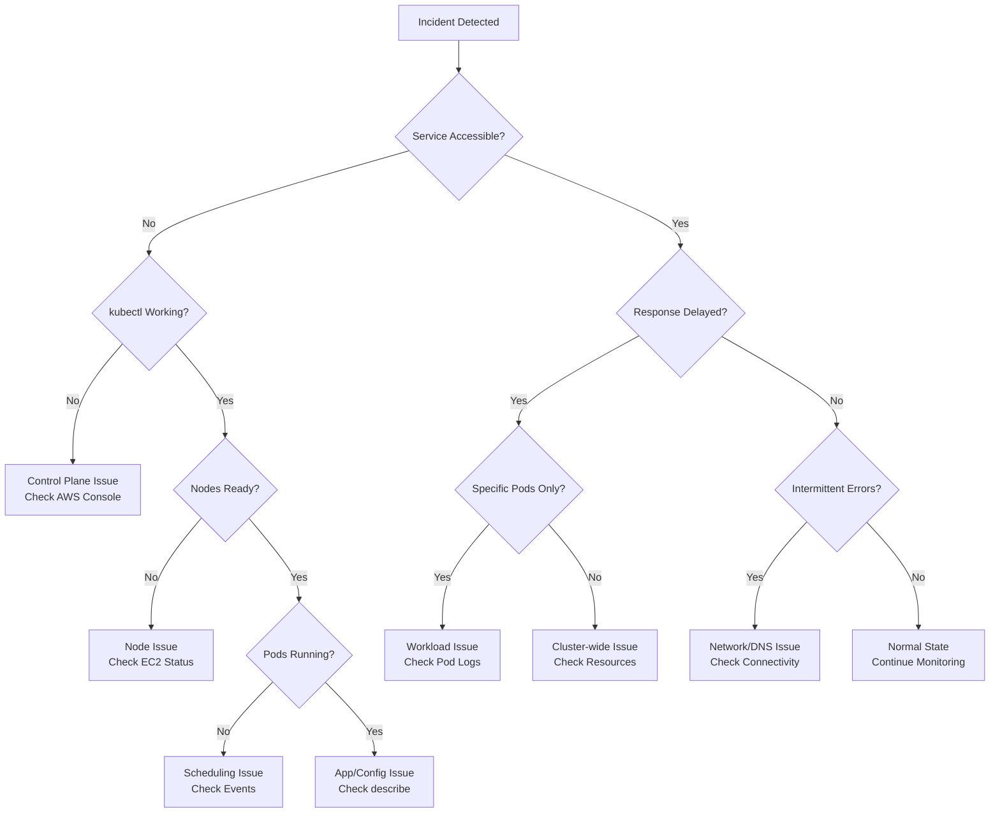
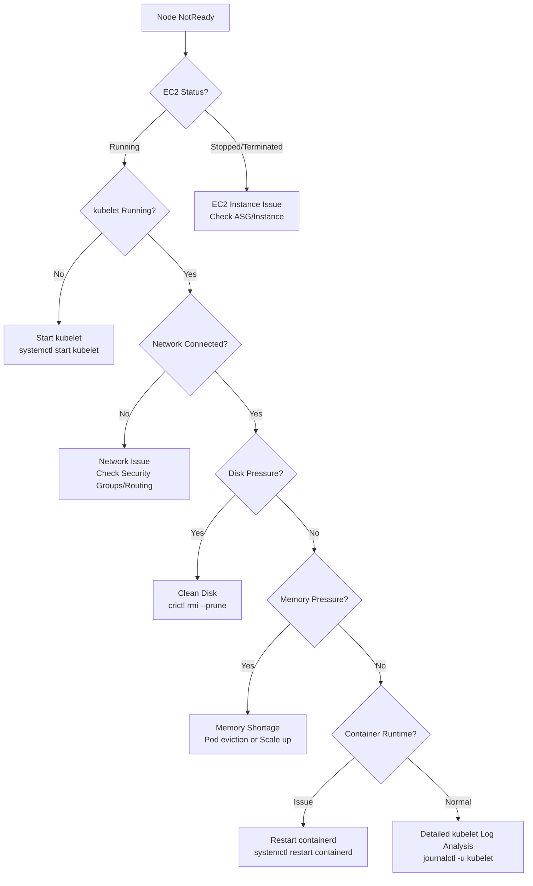
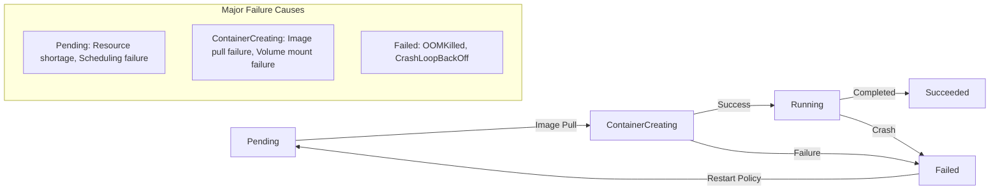

# EKS 高级调试与事件响应

> **支持版本**: EKS 1.28+, kubectl 1.28+
> **最后更新**: February 23, 2026

为了让 Amazon EKS cluster 稳定运行，系统化的事件响应框架和高级调试技能至关重要。本文档提供一份实用指南，用于快速诊断并解决生产环境中发生的复杂问题。

## 目录

1. [事件响应框架](#1-incident-response-framework)
2. [Control Plane 调试](#2-control-plane-debugging)
3. [Node 级故障排查](#3-node-level-troubleshooting)
4. [Workload 调试](#4-workload-debugging)
5. [网络诊断](#5-networking-diagnostics)
6. [Storage 故障排查](#6-storage-troubleshooting)
7. [可观测性架构](#7-observability-architecture)
8. [故障检测架构](#8-failure-detection-architecture)
9. [快速参考](#9-quick-reference)
10. [后续步骤](#10-next-steps)

---

## 1. 事件响应框架

### 前 5 分钟检查清单（初始分诊）

事件发生时，最初 5 分钟最为关键。请按顺序执行此检查清单。

```bash
# Step 1: Check cluster status (30 seconds)
kubectl cluster-info
kubectl get nodes -o wide
kubectl get pods -A --field-selector=status.phase!=Running

# Step 2: Check recent events (30 seconds)
kubectl get events -A --sort-by='.lastTimestamp' | tail -50

# Step 3: Core system pod status (30 seconds)
kubectl get pods -n kube-system
kubectl get pods -n amazon-vpc-cni-system

# Step 4: Check resource usage (30 seconds)
kubectl top nodes
kubectl top pods -A --sort-by=memory | head -20

# Step 5: Determine impact scope (2 minutes)
kubectl get deployments -A | grep -v "1/1\|2/2\|3/3"
kubectl get svc -A --field-selector=spec.type=LoadBalancer
```

### 初始诊断脚本

```bash
#!/bin/bash
# eks-triage.sh - EKS Emergency Diagnostic Script

echo "=== EKS Emergency Diagnosis Starting ==="
TIMESTAMP=$(date +%Y%m%d_%H%M%S)
OUTPUT_DIR="/tmp/eks-triage-$TIMESTAMP"
mkdir -p $OUTPUT_DIR

# Cluster information
echo "[1/6] Collecting cluster information..."
kubectl cluster-info dump --output-directory=$OUTPUT_DIR/cluster-info 2>/dev/null

# Node status
echo "[2/6] Checking node status..."
kubectl get nodes -o wide > $OUTPUT_DIR/nodes.txt
kubectl describe nodes > $OUTPUT_DIR/nodes-describe.txt

# Unhealthy pods
echo "[3/6] Listing unhealthy pods..."
kubectl get pods -A --field-selector=status.phase!=Running > $OUTPUT_DIR/unhealthy-pods.txt

# Recent events
echo "[4/6] Collecting recent events..."
kubectl get events -A --sort-by='.lastTimestamp' > $OUTPUT_DIR/events.txt

# Resource usage
echo "[5/6] Resource usage..."
kubectl top nodes > $OUTPUT_DIR/node-resources.txt 2>/dev/null
kubectl top pods -A > $OUTPUT_DIR/pod-resources.txt 2>/dev/null

# System components
echo "[6/6] System component status..."
kubectl get pods -n kube-system -o wide > $OUTPUT_DIR/kube-system.txt

echo "=== Diagnosis Complete: $OUTPUT_DIR ==="
tar -czf $OUTPUT_DIR.tar.gz -C /tmp eks-triage-$TIMESTAMP
echo "Archive: $OUTPUT_DIR.tar.gz"
```

### 严重性矩阵

| 严重性 | 分类 | 影响范围 | 响应时间 | 示例 |
|----------|---------------|--------------|---------------|----------|
| **P1** | 严重 | 服务完全中断 | 15 分钟内 | Control plane 故障、所有 Node NotReady |
| **P2** | 高 | 主要功能故障 | 1 小时内 | 特定 Workload 完全失败、网络连接问题 |
| **P3** | 中 | 部分影响 | 4 小时内 | 部分 Pod 重启、性能下降 |
| **P4** | 低 | 轻微问题 | 24 小时内 | Log 收集延迟、非关键监控告警 |

### 用于快速问题识别的决策树



---

## 2. Control Plane 调试

### EKS Control Plane Log 类型

EKS 会将 5 种 Control Plane log 发送到 CloudWatch Logs。

| Log 类型 | 描述 | 主要使用场景 |
|----------|-------------|-------------------|
| **api** | API server logs | API call 跟踪、错误分析 |
| **audit** | Audit logs | 安全审计、变更跟踪 |
| **authenticator** | IAM authentication logs | Authentication 失败调试 |
| **controllerManager** | Controller manager logs | Resource reconcile 问题 |
| **scheduler** | Scheduler logs | Pod 放置问题 |

### 启用 Control Plane Logging

```bash
# Enable all log types
aws eks update-cluster-config \
  --name my-cluster \
  --logging '{"clusterLogging":[{"types":["api","audit","authenticator","controllerManager","scheduler"],"enabled":true}]}'

# Check current settings
aws eks describe-cluster --name my-cluster \
  --query 'cluster.logging.clusterLogging'
```

### CloudWatch Logs Insights 查询

#### 错误分析查询

```sql
-- API server error analysis
fields @timestamp, @message
| filter @logStream like /kube-apiserver/
| filter @message like /error|Error|ERROR/
| sort @timestamp desc
| limit 100

-- Error statistics for the last hour
fields @timestamp, @message
| filter @logStream like /kube-apiserver/
| filter @message like /error|Error|ERROR/
| stats count(*) as error_count by bin(5m)
| sort @timestamp desc
```

#### Authentication 失败分析

```sql
-- IAM authentication failure tracking
fields @timestamp, @message
| filter @logStream like /authenticator/
| filter @message like /access denied|Unauthorized|forbidden/
| parse @message /user=(?<user>[^ ]+)/
| stats count(*) by user
| sort count(*) desc
| limit 20

-- Authentication history for specific user
fields @timestamp, @message
| filter @logStream like /authenticator/
| filter @message like /arn:aws:iam::123456789012:user\/specific-user/
| sort @timestamp desc
| limit 50
```

#### API Throttling 检测

```sql
-- API throttling event detection
fields @timestamp, @message
| filter @logStream like /kube-apiserver/
| filter @message like /throttl|rate limit|429/
| stats count(*) as throttle_count by bin(1m)
| sort @timestamp desc

-- Identify sources of excessive API calls
fields @timestamp, @message
| filter @logStream like /audit/
| parse @message /"user":{"username":"(?<username>[^"]+)"/
| parse @message /"verb":"(?<verb>[^"]+)"/
| parse @message /"resource":"(?<resource>[^"]+)"/
| stats count(*) as call_count by username, verb, resource
| sort call_count desc
| limit 50
```

### IAM Authentication 故障排查

#### 检查 aws-auth ConfigMap

```bash
# View aws-auth ConfigMap
kubectl get configmap aws-auth -n kube-system -o yaml

# IAM role mapping example
apiVersion: v1
kind: ConfigMap
metadata:
  name: aws-auth
  namespace: kube-system
data:
  mapRoles: |
    - rolearn: arn:aws:iam::123456789012:role/eks-node-role
      username: system:node:{{EC2PrivateDNSName}}
      groups:
        - system:bootstrappers
        - system:nodes
    - rolearn: arn:aws:iam::123456789012:role/admin-role
      username: admin
      groups:
        - system:masters
  mapUsers: |
    - userarn: arn:aws:iam::123456789012:user/developer
      username: developer
      groups:
        - system:developers
```

#### Authentication 测试

```bash
# Check current credentials
aws sts get-caller-identity

# Test EKS cluster authentication
aws eks get-token --cluster-name my-cluster | jq -r '.status.token' | cut -d'.' -f2 | base64 -d | jq

# Check kubectl authentication status
kubectl auth can-i get pods --all-namespaces
kubectl auth whoami
```

### IRSA (IAM Roles for Service Accounts) 故障排查

```bash
# Check service account annotation
kubectl get sa my-service-account -n my-namespace -o yaml

# Check OIDC provider
aws eks describe-cluster --name my-cluster \
  --query 'cluster.identity.oidc.issuer'

# Check IAM role trust policy
aws iam get-role --role-name my-irsa-role \
  --query 'Role.AssumeRolePolicyDocument'
```

#### IRSA 配置示例

```yaml
# Service account (IRSA enabled)
apiVersion: v1
kind: ServiceAccount
metadata:
  name: s3-access-sa
  namespace: default
  annotations:
    eks.amazonaws.com/role-arn: arn:aws:iam::123456789012:role/s3-access-role
---
# Using service account in Pod
apiVersion: v1
kind: Pod
metadata:
  name: s3-access-pod
spec:
  serviceAccountName: s3-access-sa
  containers:
  - name: app
    image: amazon/aws-cli
    command: ["aws", "s3", "ls"]
```

#### IRSA 调试

```bash
# Check credentials inside Pod
kubectl exec -it s3-access-pod -- env | grep AWS

# Check token mount
kubectl exec -it s3-access-pod -- cat /var/run/secrets/eks.amazonaws.com/serviceaccount/token

# Test STS call
kubectl exec -it s3-access-pod -- aws sts get-caller-identity
```

### Pod Identity 故障排查

```bash
# Check Pod Identity agent status
kubectl get pods -n kube-system -l app.kubernetes.io/name=eks-pod-identity-agent

# Check Pod Identity associations
aws eks list-pod-identity-associations --cluster-name my-cluster

# Create Pod Identity association
aws eks create-pod-identity-association \
  --cluster-name my-cluster \
  --namespace default \
  --service-account my-sa \
  --role-arn arn:aws:iam::123456789012:role/my-role
```

### Service Account Token 过期（默认 TTL 为 1 小时）

```yaml
# Extend token expiration time (max 24 hours)
apiVersion: v1
kind: Pod
metadata:
  name: extended-token-pod
spec:
  serviceAccountName: my-sa
  containers:
  - name: app
    image: my-app
    volumeMounts:
    - name: token
      mountPath: /var/run/secrets/tokens
  volumes:
  - name: token
    projected:
      sources:
      - serviceAccountToken:
          path: token
          expirationSeconds: 86400  # 24 hours
          audience: sts.amazonaws.com
```

### EKS Add-on 错误模式

```bash
# Check Add-on status
aws eks describe-addon --cluster-name my-cluster --addon-name vpc-cni

# Add-on health status codes
# ACTIVE: Normal operation
# CREATE_FAILED: Creation failed
# DEGRADED: Performance degraded
# DELETE_FAILED: Deletion failed
# UPDATING: Updating
# DELETING: Deleting

# Detailed Add-on status query
aws eks describe-addon --cluster-name my-cluster --addon-name vpc-cni \
  --query 'addon.{Status:status,Health:health,Issues:health.issues}'

# Update problematic Add-on
aws eks update-addon \
  --cluster-name my-cluster \
  --addon-name vpc-cni \
  --resolve-conflicts OVERWRITE
```

---

## 3. Node 级故障排查

### Node Join 失败诊断（8 个常见原因）

| # | 原因 | 症状 | 解决方法 |
|---|-------|---------|------------|
| 1 | Bootstrap script 不匹配 | Node 未出现在 cluster 中 | 验证 AMI version 与 cluster version 匹配 |
| 2 | Security group 配置错误 | Node 与 control plane 通信失败 | 检查端口 443、10250 的 inbound rules |
| 3 | VPC DNS 配置问题 | DNS resolution 失败 | 启用 enableDnsHostnames、enableDnsSupport |
| 4 | IAM role 权限不足 | Authentication 失败 | 验证所需 policy 已附加到 node role |
| 5 | 缺少 subnet tags | Node provisioning 失败 | 检查 kubernetes.io/cluster/\<name\> tag |
| 6 | Private subnet 缺少 NAT | Image pull 失败 | 配置 NAT Gateway 或 VPC endpoints |
| 7 | 未附加 instance profile | EC2 launch 失败 | 检查 Launch Template 配置 |
| 8 | User data script 错误 | Bootstrap 中断 | 检查 /var/log/cloud-init-output.log |

### NotReady Node 决策树



### 通过 SSM 调试 kubelet/containerd

```bash
# Start SSM session
aws ssm start-session --target i-1234567890abcdef0

# Check kubelet status
sudo systemctl status kubelet
sudo journalctl -u kubelet -f --no-pager | tail -100

# Check kubelet configuration
sudo cat /etc/kubernetes/kubelet/kubelet-config.json
sudo cat /var/lib/kubelet/kubeconfig

# Check containerd status
sudo systemctl status containerd
sudo journalctl -u containerd -f --no-pager | tail -50

# List containers
sudo crictl ps
sudo crictl ps -a  # Include terminated containers

# Check container logs
sudo crictl logs <container-id>

# List and clean images
sudo crictl images
sudo crictl rmi --prune  # Remove unused images

# Check disk usage
df -h
sudo du -sh /var/lib/containerd/*
sudo du -sh /var/log/*
```

### Resource Pressure 条件

```bash
# Check node conditions
kubectl describe node <node-name> | grep -A 20 "Conditions:"

# Check specific pressure conditions
kubectl get nodes -o custom-columns=\
NAME:.metadata.name,\
DISK_PRESSURE:.status.conditions[?(@.type==\"DiskPressure\")].status,\
MEMORY_PRESSURE:.status.conditions[?(@.type==\"MemoryPressure\")].status,\
PID_PRESSURE:.status.conditions[?(@.type==\"PIDPressure\")].status
```

#### 解决 DiskPressure

```bash
# After connecting to node via SSM
# Clean log files
sudo journalctl --vacuum-size=500M
sudo rm -rf /var/log/*.gz
sudo rm -rf /var/log/*.[0-9]

# Clean container images
sudo crictl rmi --prune

# Clean terminated containers
sudo crictl rm $(sudo crictl ps -a -q --state exited)
```

#### 解决 MemoryPressure

```bash
# Identify pods with high memory usage
kubectl top pods -A --sort-by=memory | head -20

# Memory usage by node
kubectl top nodes

# Detailed memory usage (inside node)
free -h
cat /proc/meminfo | grep -E "MemTotal|MemFree|MemAvailable|Buffers|Cached"
```

#### 解决 PIDPressure

```bash
# Check current PID usage (inside node)
cat /proc/sys/kernel/pid_max
ls /proc | grep -E "^[0-9]+$" | wc -l

# Processes using most PIDs
ps aux --sort=-nlwp | head -20
```

### Karpenter Provisioning 问题

```bash
# Check Karpenter controller logs
kubectl logs -n karpenter -l app.kubernetes.io/name=karpenter -c controller --tail=100

# Check NodePool status
kubectl get nodepools
kubectl describe nodepool default

# Check NodeClaim status
kubectl get nodeclaims
kubectl describe nodeclaim <name>

# Check when Karpenter isn't creating nodes
kubectl get events -n karpenter --sort-by='.lastTimestamp'
```

#### Karpenter 配置示例

```yaml
apiVersion: karpenter.sh/v1
kind: NodePool
metadata:
  name: default
spec:
  template:
    spec:
      requirements:
        - key: kubernetes.io/arch
          operator: In
          values: ["amd64"]
        - key: karpenter.sh/capacity-type
          operator: In
          values: ["spot", "on-demand"]
        - key: karpenter.k8s.aws/instance-category
          operator: In
          values: ["c", "m", "r"]
      nodeClassRef:
        group: karpenter.k8s.aws
        kind: EC2NodeClass
        name: default
  limits:
    cpu: 1000
    memory: 1000Gi
  disruption:
    consolidationPolicy: WhenUnderutilized
    consolidateAfter: 30s
```

### Managed Node Group 错误代码

| 错误代码 | 描述 | 解决方法 |
|------------|-------------|------------|
| AccessDenied | IAM 权限不足 | 检查 node role policies |
| AsgInstanceLaunchFailures | ASG instance launch 失败 | 检查 Launch Template、subnet capacity |
| ClusterUnreachable | 无法连接到 cluster | 检查 VPC endpoints、security groups |
| InsufficientFreeAddresses | IP address 不足 | 扩展 subnet CIDR 或添加新 subnet |
| NodeCreationFailure | Node creation 失败 | 检查 EC2 service limits、AMI availability |

```bash
# Check node group status
aws eks describe-nodegroup \
  --cluster-name my-cluster \
  --nodegroup-name my-nodegroup \
  --query 'nodegroup.{Status:status,Health:health}'

# Node group issue details
aws eks describe-nodegroup \
  --cluster-name my-cluster \
  --nodegroup-name my-nodegroup \
  --query 'nodegroup.health.issues'
```

### Node Readiness Controller（分阶段启动验证）

```yaml
# Custom node readiness validation
apiVersion: v1
kind: ConfigMap
metadata:
  name: node-readiness-config
  namespace: kube-system
data:
  config.yaml: |
    checks:
      - name: cni-ready
        probe:
          exec:
            command: ["test", "-f", "/etc/cni/net.d/10-aws.conflist"]
        initialDelaySeconds: 5
        periodSeconds: 2
        failureThreshold: 30
      - name: containerd-ready
        probe:
          exec:
            command: ["crictl", "info"]
        initialDelaySeconds: 10
        periodSeconds: 5
        failureThreshold: 12
```

---

## 4. Workload 调试

### Pod 状态流程图



### 基本诊断命令

```bash
# Check pod status and events
kubectl describe pod <pod-name> -n <namespace>

# Check pod logs
kubectl logs <pod-name> -n <namespace>
kubectl logs <pod-name> -n <namespace> --previous  # Previous container logs
kubectl logs <pod-name> -n <namespace> -c <container-name>  # Specific container
kubectl logs <pod-name> -n <namespace> --tail=100 -f  # Real-time follow

# Check namespace events
kubectl get events -n <namespace> --sort-by='.lastTimestamp'

# Detailed pod status
kubectl get pod <pod-name> -n <namespace> -o yaml
```

### kubectl debug 技术

#### Ephemeral Containers

```bash
# Add basic debug container
kubectl debug -it <pod-name> --image=busybox --target=<container-name>

# Network debugging container
kubectl debug -it <pod-name> --image=nicolaka/netshoot --target=<container-name>

# Share process namespace
kubectl debug -it <pod-name> --image=busybox --target=<container-name> -- sh
```

#### Pod Copying

```bash
# Create identical pod copy
kubectl debug <pod-name> --copy-to=debug-pod --container=debugger --image=busybox

# Copy with changed container image
kubectl debug <pod-name> --copy-to=debug-pod --set-image=*=busybox

# Copy with shared process namespace
kubectl debug <pod-name> --copy-to=debug-pod --share-processes
```

#### Node Debugging

```bash
# Run debug pod on node
kubectl debug node/<node-name> -it --image=ubuntu

# Access host filesystem
kubectl debug node/<node-name> -it --image=ubuntu -- chroot /host

# Run in node's network namespace
kubectl debug node/<node-name> -it --image=nicolaka/netshoot
```

### Deployment Rollout 管理

```bash
# Check rollout status
kubectl rollout status deployment/<deployment-name> -n <namespace>

# Rollout history
kubectl rollout history deployment/<deployment-name> -n <namespace>

# Specific revision details
kubectl rollout history deployment/<deployment-name> --revision=2

# Rollback
kubectl rollout undo deployment/<deployment-name> -n <namespace>
kubectl rollout undo deployment/<deployment-name> --to-revision=2

# Pause/Resume rollout
kubectl rollout pause deployment/<deployment-name>
kubectl rollout resume deployment/<deployment-name>

# Force rollout (when image is same)
kubectl rollout restart deployment/<deployment-name>
```

### HPA/VPA Scaling 问题

#### HPA 调试

```bash
# Check HPA status
kubectl get hpa -n <namespace>
kubectl describe hpa <hpa-name> -n <namespace>

# Check metrics collection status
kubectl get --raw "/apis/metrics.k8s.io/v1beta1/pods" | jq

# Check HPA events
kubectl get events -n <namespace> --field-selector involvedObject.name=<hpa-name>
```

#### HPA 配置示例

```yaml
apiVersion: autoscaling/v2
kind: HorizontalPodAutoscaler
metadata:
  name: app-hpa
spec:
  scaleTargetRef:
    apiVersion: apps/v1
    kind: Deployment
    name: app
  minReplicas: 2
  maxReplicas: 10
  metrics:
  - type: Resource
    resource:
      name: cpu
      target:
        type: Utilization
        averageUtilization: 70
  - type: Resource
    resource:
      name: memory
      target:
        type: Utilization
        averageUtilization: 80
  behavior:
    scaleDown:
      stabilizationWindowSeconds: 300
      policies:
      - type: Percent
        value: 10
        periodSeconds: 60
    scaleUp:
      stabilizationWindowSeconds: 0
      policies:
      - type: Percent
        value: 100
        periodSeconds: 15
```

#### VPA 调试

```bash
# Check VPA status
kubectl get vpa -n <namespace>
kubectl describe vpa <vpa-name> -n <namespace>

# Check VPA recommendations
kubectl get vpa <vpa-name> -o jsonpath='{.status.recommendation}'
```

### Probe 配置最佳实践

```yaml
apiVersion: v1
kind: Pod
metadata:
  name: app-with-probes
spec:
  containers:
  - name: app
    image: my-app:v1
    ports:
    - containerPort: 8080

    # Startup probe: Verify app initialization complete
    startupProbe:
      httpGet:
        path: /healthz
        port: 8080
      initialDelaySeconds: 10
      periodSeconds: 5
      failureThreshold: 30  # Wait up to 150 seconds

    # Liveness probe: Verify app is alive
    livenessProbe:
      httpGet:
        path: /healthz
        port: 8080
      initialDelaySeconds: 0  # Start immediately after startupProbe succeeds
      periodSeconds: 10
      timeoutSeconds: 5
      failureThreshold: 3

    # Readiness probe: Verify ready to receive traffic
    readinessProbe:
      httpGet:
        path: /ready
        port: 8080
      initialDelaySeconds: 0
      periodSeconds: 5
      timeoutSeconds: 3
      successThreshold: 1
      failureThreshold: 3

    resources:
      requests:
        memory: "256Mi"
        cpu: "250m"
      limits:
        memory: "512Mi"
        cpu: "500m"
```

---

## 5. 网络诊断

### VPC CNI 故障排查

```bash
# Check VPC CNI version
kubectl describe daemonset aws-node -n kube-system | grep Image

# Check CNI pod status
kubectl get pods -n kube-system -l k8s-app=aws-node

# CNI pod logs
kubectl logs -n kube-system -l k8s-app=aws-node --tail=100

# Check ENI and IP allocation status
kubectl get pods -o wide
aws ec2 describe-network-interfaces --filters Name=description,Values="*eks*"
```

### IP Exhaustion 故障排查

#### 启用 Prefix Delegation 模式

```bash
# Set environment variables
kubectl set env daemonset aws-node -n kube-system \
  ENABLE_PREFIX_DELEGATION=true \
  WARM_PREFIX_TARGET=1

# Verify
kubectl get daemonset aws-node -n kube-system -o yaml | grep -A 5 ENABLE_PREFIX
```

#### 添加 Secondary CIDR

```bash
# Add Secondary CIDR to VPC
aws ec2 associate-vpc-cidr-block \
  --vpc-id vpc-1234567890abcdef0 \
  --cidr-block 100.64.0.0/16

# Create new subnet
aws ec2 create-subnet \
  --vpc-id vpc-1234567890abcdef0 \
  --cidr-block 100.64.0.0/24 \
  --availability-zone ap-northeast-2a

# Enable CNI custom networking
kubectl set env daemonset aws-node -n kube-system \
  AWS_VPC_K8S_CNI_CUSTOM_NETWORK_CFG=true
```

#### ENIConfig 配置

```yaml
apiVersion: crd.k8s.amazonaws.com/v1alpha1
kind: ENIConfig
metadata:
  name: ap-northeast-2a
spec:
  securityGroups:
    - sg-0123456789abcdef0
  subnet: subnet-0123456789abcdef0
---
apiVersion: crd.k8s.amazonaws.com/v1alpha1
kind: ENIConfig
metadata:
  name: ap-northeast-2c
spec:
  securityGroups:
    - sg-0123456789abcdef0
  subnet: subnet-0fedcba9876543210
```

### CoreDNS 配置问题

```bash
# CoreDNS pod status
kubectl get pods -n kube-system -l k8s-app=kube-dns

# CoreDNS logs
kubectl logs -n kube-system -l k8s-app=kube-dns --tail=100

# Check CoreDNS ConfigMap
kubectl get configmap coredns -n kube-system -o yaml

# DNS resolution test
kubectl run dns-test --image=busybox:1.28 --rm -it --restart=Never -- nslookup kubernetes.default
```

#### ndots 问题和解决方案

```yaml
# Issue: DNS query delay due to default ndots=5
# Solution: Adjust ndots value in Pod

apiVersion: v1
kind: Pod
metadata:
  name: optimized-dns-pod
spec:
  dnsConfig:
    options:
      - name: ndots
        value: "2"
      - name: single-request-reopen
      - name: timeout
        value: "2"
      - name: attempts
        value: "3"
  containers:
  - name: app
    image: my-app
```

#### CoreDNS 性能优化

```yaml
apiVersion: v1
kind: ConfigMap
metadata:
  name: coredns
  namespace: kube-system
data:
  Corefile: |
    .:53 {
        errors
        health {
            lameduck 5s
        }
        ready
        kubernetes cluster.local in-addr.arpa ip6.arpa {
            pods insecure
            fallthrough in-addr.arpa ip6.arpa
            ttl 30
        }
        prometheus :9153
        forward . /etc/resolv.conf {
            max_concurrent 1000
        }
        cache 30
        loop
        reload
        loadbalance
    }
```

### Service Endpoint 验证

```bash
# Check service endpoints
kubectl get endpoints <service-name> -n <namespace>
kubectl describe endpoints <service-name> -n <namespace>

# Service connectivity test
kubectl run curl-test --image=curlimages/curl --rm -it --restart=Never -- \
  curl -v http://<service-name>.<namespace>.svc.cluster.local:<port>

# Service DNS resolution
kubectl run dns-test --image=busybox --rm -it --restart=Never -- \
  nslookup <service-name>.<namespace>.svc.cluster.local
```

### NetworkPolicy AND/OR 逻辑调试

```yaml
# Example: Complex NetworkPolicy
apiVersion: networking.k8s.io/v1
kind: NetworkPolicy
metadata:
  name: complex-policy
  namespace: production
spec:
  podSelector:
    matchLabels:
      app: api-server
  policyTypes:
  - Ingress
  - Egress
  ingress:
  # Rule 1: Allow traffic from frontend pods
  - from:
    - podSelector:
        matchLabels:
          app: frontend
    ports:
    - port: 8080
  # Rule 2: Allow traffic from monitoring namespace (OR)
  - from:
    - namespaceSelector:
        matchLabels:
          purpose: monitoring
    ports:
    - port: 9090
  egress:
  # Allow only outbound to database
  - to:
    - podSelector:
        matchLabels:
          app: database
    ports:
    - port: 5432
```

```bash
# NetworkPolicy debugging
kubectl get networkpolicy -n <namespace> -o yaml
kubectl describe networkpolicy <policy-name> -n <namespace>

# Connectivity test
kubectl exec -it <source-pod> -- nc -zv <target-service> <port>
kubectl exec -it <source-pod> -- curl -v --connect-timeout 5 http://<target>:<port>
```

### 使用 netshoot Container 进行实时调试

```bash
# Run netshoot debug pod
kubectl run netshoot --image=nicolaka/netshoot -it --rm -- /bin/bash

# Tools available inside:
# - curl, wget: HTTP testing
# - dig, nslookup: DNS debugging
# - tcpdump: Packet capture
# - iperf3: Network performance testing
# - mtr, traceroute: Path tracing
# - ss, netstat: Socket status

# DNS debugging
dig +short kubernetes.default.svc.cluster.local
dig +trace google.com

# TCP connection test
nc -zv <service-ip> <port>

# Detailed HTTP test
curl -v --connect-timeout 5 http://<service>:<port>/health

# Packet capture (requires root privileges)
tcpdump -i any port 80 -nn

# Network performance test
iperf3 -c <target-ip> -p 5201
```

---

## 6. Storage 故障排查

### EBS CSI Driver 错误模式

```bash
# Check EBS CSI Driver pod status
kubectl get pods -n kube-system -l app.kubernetes.io/name=aws-ebs-csi-driver

# Controller logs
kubectl logs -n kube-system -l app=ebs-csi-controller -c ebs-plugin --tail=100

# Node driver logs
kubectl logs -n kube-system -l app=ebs-csi-node -c ebs-plugin --tail=100

# CSI driver status
kubectl get csidrivers
kubectl describe csidriver ebs.csi.aws.com
```

#### IRSA 权限配置

```json
{
  "Version": "2012-10-17",
  "Statement": [
    {
      "Effect": "Allow",
      "Action": [
        "ec2:CreateSnapshot",
        "ec2:AttachVolume",
        "ec2:DetachVolume",
        "ec2:ModifyVolume",
        "ec2:DescribeAvailabilityZones",
        "ec2:DescribeInstances",
        "ec2:DescribeSnapshots",
        "ec2:DescribeTags",
        "ec2:DescribeVolumes",
        "ec2:DescribeVolumesModifications",
        "ec2:CreateTags",
        "ec2:DeleteTags",
        "ec2:CreateVolume",
        "ec2:DeleteVolume",
        "ec2:DeleteSnapshot"
      ],
      "Resource": "*"
    }
  ]
}
```

### EFS Mount Target 配置问题

```bash
# EFS CSI Driver status
kubectl get pods -n kube-system -l app.kubernetes.io/name=aws-efs-csi-driver

# Check EFS mount targets
aws efs describe-mount-targets --file-system-id fs-1234567890abcdef0

# Check security groups (NFS port 2049)
aws ec2 describe-security-groups --group-ids sg-0123456789abcdef0
```

#### EFS StorageClass 和 PVC

```yaml
kind: StorageClass
apiVersion: storage.k8s.io/v1
metadata:
  name: efs-sc
provisioner: efs.csi.aws.com
parameters:
  provisioningMode: efs-ap
  fileSystemId: fs-1234567890abcdef0
  directoryPerms: "700"
  gidRangeStart: "1000"
  gidRangeEnd: "2000"
  basePath: "/dynamic_provisioning"
---
apiVersion: v1
kind: PersistentVolumeClaim
metadata:
  name: efs-claim
spec:
  accessModes:
    - ReadWriteMany
  storageClassName: efs-sc
  resources:
    requests:
      storage: 5Gi
```

### PVC/PV 状态管理

```bash
# Check PVC status
kubectl get pvc -A
kubectl describe pvc <pvc-name> -n <namespace>

# Check PV status
kubectl get pv
kubectl describe pv <pv-name>

# Check binding issues
kubectl get pvc -A -o custom-columns=\
NAME:.metadata.name,\
STATUS:.status.phase,\
VOLUME:.spec.volumeName,\
STORAGECLASS:.spec.storageClassName
```

#### Finalizer 处理

```bash
# When PVC won't delete (Terminating state)
# Check pods using it
kubectl get pods -A -o json | jq -r '.items[] | select(.spec.volumes[]?.persistentVolumeClaim.claimName == "<pvc-name>") | .metadata.name'

# Remove Finalizer (Caution: Possible data loss)
kubectl patch pvc <pvc-name> -n <namespace> -p '{"metadata":{"finalizers":null}}'

# Remove PV Finalizer
kubectl patch pv <pv-name> -p '{"metadata":{"finalizers":null}}'
```

### 使用 WaitForFirstConsumer 进行 AZ 匹配

```yaml
# StorageClass with WaitForFirstConsumer
apiVersion: storage.k8s.io/v1
kind: StorageClass
metadata:
  name: ebs-sc-waitforfirstconsumer
provisioner: ebs.csi.aws.com
parameters:
  type: gp3
  encrypted: "true"
volumeBindingMode: WaitForFirstConsumer  # Create volume after Pod is scheduled
allowedTopologies:
- matchLabelExpressions:
  - key: topology.kubernetes.io/zone
    values:
    - ap-northeast-2a
    - ap-northeast-2c
```

```bash
# Check volume-pod AZ mismatch
kubectl get pv -o custom-columns=\
NAME:.metadata.name,\
ZONE:.spec.nodeAffinity.required.nodeSelectorTerms[0].matchExpressions[0].values[0]

kubectl get pods -o custom-columns=\
NAME:.metadata.name,\
NODE:.spec.nodeName,\
ZONE:'{.spec.nodeAffinity}'
```

---

## 7. 可观测性架构

### Container Insights 设置

```bash
# Install CloudWatch Agent and Fluent Bit
aws eks create-addon \
  --cluster-name my-cluster \
  --addon-name amazon-cloudwatch-observability \
  --addon-version v1.0.0-eksbuild.1

# Or install with Helm
helm repo add aws-observability https://aws-observability.github.io/helm-charts
helm install amazon-cloudwatch-observability \
  aws-observability/amazon-cloudwatch-observability \
  --namespace amazon-cloudwatch --create-namespace \
  --set clusterName=my-cluster \
  --set region=ap-northeast-2
```

### PromQL 查询示例

#### CPU Throttling 检测

```promql
# CPU throttling ratio
sum(rate(container_cpu_cfs_throttled_periods_total{container!=""}[5m])) by (pod, namespace)
/
sum(rate(container_cpu_cfs_periods_total{container!=""}[5m])) by (pod, namespace)
> 0.5

# Top 10 pods with high CPU throttling
topk(10,
  sum(rate(container_cpu_cfs_throttled_periods_total{container!=""}[5m])) by (pod, namespace)
  /
  sum(rate(container_cpu_cfs_periods_total{container!=""}[5m])) by (pod, namespace)
)
```

#### OOMKilled Event 检测

```promql
# Pods with OOMKilled
kube_pod_container_status_last_terminated_reason{reason="OOMKilled"} == 1

# OOMKilled count in last hour
sum(changes(kube_pod_container_status_restarts_total[1h])) by (pod, namespace)
* on (pod, namespace) group_left
kube_pod_container_status_last_terminated_reason{reason="OOMKilled"}

# Pods with high memory usage (OOM risk)
(
  sum(container_memory_working_set_bytes{container!=""}) by (pod, namespace)
  /
  sum(kube_pod_container_resource_limits{resource="memory"}) by (pod, namespace)
) > 0.9
```

#### Pod Restart Rate

```promql
# Restart count in last hour
sum(increase(kube_pod_container_status_restarts_total[1h])) by (pod, namespace) > 3

# Top 10 pods with most restarts
topk(10, sum(increase(kube_pod_container_status_restarts_total[1h])) by (pod, namespace))

# Pods in CrashLoopBackOff state
kube_pod_container_status_waiting_reason{reason="CrashLoopBackOff"} == 1
```

### CloudWatch Logs Insights 搜索模式

```sql
-- Error log search
fields @timestamp, @message, kubernetes.pod_name, kubernetes.namespace_name
| filter @message like /error|Error|ERROR|exception|Exception|EXCEPTION/
| sort @timestamp desc
| limit 100

-- Specific pod logs
fields @timestamp, @message
| filter kubernetes.pod_name = "my-pod-name"
| sort @timestamp desc
| limit 500

-- Response time analysis (when app logs include response time)
fields @timestamp, @message
| parse @message /response_time=(?<response_time>\d+)ms/
| stats avg(response_time) as avg_response, max(response_time) as max_response by bin(5m)

-- OOMKilled event tracking
fields @timestamp, @message
| filter @message like /OOMKilled|Out of memory|oom-kill/
| sort @timestamp desc
| limit 50
```

### PrometheusRule 示例

```yaml
apiVersion: monitoring.coreos.com/v1
kind: PrometheusRule
metadata:
  name: eks-alerts
  namespace: monitoring
spec:
  groups:
  - name: eks-node-alerts
    rules:
    - alert: NodeNotReady
      expr: kube_node_status_condition{condition="Ready",status="true"} == 0
      for: 5m
      labels:
        severity: critical
      annotations:
        summary: "Node {{ $labels.node }} is in NotReady state"
        description: "Node has been in NotReady state for more than 5 minutes. Immediate attention required."

    - alert: NodeMemoryPressure
      expr: kube_node_status_condition{condition="MemoryPressure",status="true"} == 1
      for: 5m
      labels:
        severity: warning
      annotations:
        summary: "Memory pressure on node {{ $labels.node }}"

    - alert: NodeDiskPressure
      expr: kube_node_status_condition{condition="DiskPressure",status="true"} == 1
      for: 5m
      labels:
        severity: warning
      annotations:
        summary: "Disk pressure on node {{ $labels.node }}"

  - name: eks-pod-alerts
    rules:
    - alert: PodCrashLooping
      expr: rate(kube_pod_container_status_restarts_total[15m]) * 60 * 15 > 3
      for: 5m
      labels:
        severity: warning
      annotations:
        summary: "Pod {{ $labels.namespace }}/{{ $labels.pod }} is crash looping"

    - alert: PodNotReady
      expr: |
        sum by (namespace, pod) (
          max by(namespace, pod) (kube_pod_status_phase{phase=~"Pending|Unknown"}) *
          on(namespace, pod) group_left(owner_kind)
          topk by(namespace, pod) (1, max by(namespace, pod, owner_kind) (kube_pod_owner{owner_kind!="Job"}))
        ) > 0
      for: 15m
      labels:
        severity: warning
      annotations:
        summary: "Pod {{ $labels.namespace }}/{{ $labels.pod }} has not been Ready for more than 15 minutes"

    - alert: ContainerOOMKilled
      expr: kube_pod_container_status_last_terminated_reason{reason="OOMKilled"} == 1
      for: 0m
      labels:
        severity: warning
      annotations:
        summary: "Container {{ $labels.namespace }}/{{ $labels.pod }}/{{ $labels.container }} was OOMKilled"

  - name: eks-resource-alerts
    rules:
    - alert: HighCPUThrottling
      expr: |
        sum(rate(container_cpu_cfs_throttled_periods_total{container!=""}[5m])) by (pod, namespace)
        /
        sum(rate(container_cpu_cfs_periods_total{container!=""}[5m])) by (pod, namespace)
        > 0.5
      for: 10m
      labels:
        severity: warning
      annotations:
        summary: "CPU throttling for pod {{ $labels.namespace }}/{{ $labels.pod }} exceeds 50%"
```

### ADOT (AWS Distro for OpenTelemetry) 配置

```yaml
# ADOT Collector configuration
apiVersion: opentelemetry.io/v1alpha1
kind: OpenTelemetryCollector
metadata:
  name: adot-collector
  namespace: opentelemetry
spec:
  mode: deployment
  serviceAccount: adot-collector
  config: |
    receivers:
      otlp:
        protocols:
          grpc:
            endpoint: 0.0.0.0:4317
          http:
            endpoint: 0.0.0.0:4318
      prometheus:
        config:
          scrape_configs:
            - job_name: 'kubernetes-pods'
              kubernetes_sd_configs:
                - role: pod
              relabel_configs:
                - source_labels: [__meta_kubernetes_pod_annotation_prometheus_io_scrape]
                  action: keep
                  regex: true

    processors:
      batch:
        timeout: 30s
        send_batch_size: 8192
      memory_limiter:
        limit_mib: 500
        spike_limit_mib: 100
        check_interval: 5s

    exporters:
      awsxray:
        region: ap-northeast-2
      awsemf:
        region: ap-northeast-2
        namespace: ContainerInsights
        log_group_name: '/aws/containerinsights/{ClusterName}/performance'
      prometheusremotewrite:
        endpoint: "https://aps-workspaces.ap-northeast-2.amazonaws.com/workspaces/ws-xxxxx/api/v1/remote_write"
        auth:
          authenticator: sigv4auth
        resource_to_telemetry_conversion:
          enabled: true

    extensions:
      sigv4auth:
        region: ap-northeast-2
        service: "aps"

    service:
      extensions: [sigv4auth]
      pipelines:
        traces:
          receivers: [otlp]
          processors: [batch, memory_limiter]
          exporters: [awsxray]
        metrics:
          receivers: [otlp, prometheus]
          processors: [batch, memory_limiter]
          exporters: [awsemf, prometheusremotewrite]
```

---

## 8. 故障检测架构

### 4 层检测流水线

```mermaid
flowchart LR
    subgraph Sources[Data Sources]
        M[Metrics]
        L[Logs]
        T[Traces]
        E[Events]
    end

    subgraph Collection[Collection]
        CW[CloudWatch Agent]
        FB[Fluent Bit]
        ADOT[ADOT Collector]
        PM[Prometheus]
    end

    subgraph Analysis[Analysis]
        CLI[CloudWatch Logs Insights]
        MA[Metric Alarms]
        AA[Anomaly Detection]
        CA[Composite Alarms]
    end

    subgraph Alerting[Alerting]
        SNS[SNS]
        SL[Slack]
        PD[PagerDuty]
        EB[EventBridge]
    end

    Sources --> Collection --> Analysis --> Alerting
```



### 参考架构 1：AWS Native

```yaml
# Fluent Bit ConfigMap for CloudWatch
apiVersion: v1
kind: ConfigMap
metadata:
  name: fluent-bit-config
  namespace: amazon-cloudwatch
data:
  fluent-bit.conf: |
    [SERVICE]
        Flush         5
        Grace         30
        Log_Level     info
        Daemon        off
        Parsers_File  parsers.conf

    [INPUT]
        Name              tail
        Tag               kube.*
        Path              /var/log/containers/*.log
        Parser            docker
        DB                /var/fluent-bit/state/flb_kube.db
        Mem_Buf_Limit     50MB
        Skip_Long_Lines   On
        Refresh_Interval  10

    [FILTER]
        Name                kubernetes
        Match               kube.*
        Kube_URL            https://kubernetes.default.svc:443
        Kube_CA_File        /var/run/secrets/kubernetes.io/serviceaccount/ca.crt
        Kube_Token_File     /var/run/secrets/kubernetes.io/serviceaccount/token
        Kube_Tag_Prefix     kube.var.log.containers.
        Merge_Log           On
        Merge_Log_Key       log_processed
        K8S-Logging.Parser  On
        K8S-Logging.Exclude Off

    [OUTPUT]
        Name                cloudwatch_logs
        Match               kube.*
        region              ap-northeast-2
        log_group_name      /aws/eks/my-cluster/containers
        log_stream_prefix   fluentbit-
        auto_create_group   true
```

### 参考架构 2：Open Source Stack

```yaml
# Prometheus + Alertmanager + Grafana
---
# Alertmanager configuration
apiVersion: v1
kind: ConfigMap
metadata:
  name: alertmanager-config
  namespace: monitoring
data:
  alertmanager.yml: |
    global:
      resolve_timeout: 5m
      slack_api_url: 'https://hooks.slack.com/services/xxx/yyy/zzz'

    route:
      group_by: ['alertname', 'namespace', 'severity']
      group_wait: 30s
      group_interval: 5m
      repeat_interval: 4h
      receiver: 'default-receiver'
      routes:
        - match:
            severity: critical
          receiver: 'pagerduty-critical'
          continue: true
        - match:
            severity: warning
          receiver: 'slack-warnings'

    receivers:
      - name: 'default-receiver'
        slack_configs:
          - channel: '#alerts-default'
            send_resolved: true

      - name: 'pagerduty-critical'
        pagerduty_configs:
          - service_key: '<pagerduty-service-key>'
            severity: critical

      - name: 'slack-warnings'
        slack_configs:
          - channel: '#alerts-warnings'
            send_resolved: true
            title: '{{ .Status | toUpper }}: {{ .CommonAnnotations.summary }}'
            text: '{{ .CommonAnnotations.description }}'

    inhibit_rules:
      - source_match:
          severity: 'critical'
        target_match:
          severity: 'warning'
        equal: ['alertname', 'namespace']
```

### 检测模式

#### 基于阈值的检测

```yaml
# CloudWatch Alarm
aws cloudwatch put-metric-alarm \
  --alarm-name "EKS-High-CPU-Usage" \
  --alarm-description "EKS node CPU usage exceeds 80%" \
  --metric-name node_cpu_utilization \
  --namespace ContainerInsights \
  --statistic Average \
  --period 300 \
  --threshold 80 \
  --comparison-operator GreaterThanThreshold \
  --dimensions Name=ClusterName,Value=my-cluster \
  --evaluation-periods 3 \
  --alarm-actions arn:aws:sns:ap-northeast-2:123456789012:eks-alerts
```

#### Anomaly Detection

```yaml
# CloudWatch Anomaly Detection Alarm
aws cloudwatch put-anomaly-detector \
  --namespace ContainerInsights \
  --metric-name pod_cpu_utilization \
  --stat Average \
  --dimensions Name=ClusterName,Value=my-cluster

aws cloudwatch put-metric-alarm \
  --alarm-name "EKS-Anomaly-CPU" \
  --alarm-description "Abnormal CPU usage pattern detected" \
  --metrics '[
    {
      "Id": "m1",
      "MetricStat": {
        "Metric": {
          "Namespace": "ContainerInsights",
          "MetricName": "pod_cpu_utilization",
          "Dimensions": [{"Name": "ClusterName", "Value": "my-cluster"}]
        },
        "Period": 300,
        "Stat": "Average"
      }
    },
    {
      "Id": "ad1",
      "Expression": "ANOMALY_DETECTION_BAND(m1, 2)"
    }
  ]' \
  --threshold-metric-id ad1 \
  --comparison-operator LessThanLowerOrGreaterThanUpperThreshold \
  --evaluation-periods 3 \
  --alarm-actions arn:aws:sns:ap-northeast-2:123456789012:eks-anomaly-alerts
```

#### Composite Alarm

```bash
# Create composite alarm
aws cloudwatch put-composite-alarm \
  --alarm-name "EKS-Critical-State" \
  --alarm-description "Cluster critical state" \
  --alarm-rule "ALARM(EKS-High-CPU-Usage) AND ALARM(EKS-High-Memory-Usage)" \
  --alarm-actions arn:aws:sns:ap-northeast-2:123456789012:eks-critical-alerts \
  --ok-actions arn:aws:sns:ap-northeast-2:123456789012:eks-resolved
```

#### 基于 Log 的 Metrics

```bash
# Extract metrics from logs
aws logs put-metric-filter \
  --log-group-name "/aws/eks/my-cluster/containers" \
  --filter-name "ErrorCount" \
  --filter-pattern "[..., level=\"ERROR\", ...]" \
  --metric-transformations \
    metricName=ApplicationErrors,metricNamespace=EKS/Application,metricValue=1
```

### 成熟度模型

| 级别 | 描述 | MTTD 目标 | 关键能力 |
|-------|-------------|-------------|------------------|
| **Level 1** | 基础 | 30 分钟 | 基本 metric alerts、手动 log 搜索 |
| **Level 2** | 响应式 | 15 分钟 | Threshold alerts、log-based alerts、基本 dashboards |
| **Level 3** | 主动式 | 5 分钟 | Anomaly detection、composite alarms、automated runbooks |
| **Level 4** | 预测式 | 2 分钟 | ML-based prediction、auto-remediation、chaos engineering |

### EventBridge + Lambda Auto-Remediation

```yaml
# EventBridge Rule
{
  "source": ["aws.cloudwatch"],
  "detail-type": ["CloudWatch Alarm State Change"],
  "detail": {
    "alarmName": ["EKS-Pod-CrashLooping"],
    "state": {
      "value": ["ALARM"]
    }
  }
}
```

```python
# Lambda auto-remediation function
import boto3
import json
from kubernetes import client, config

def lambda_handler(event, context):
    alarm_name = event['detail']['alarmName']

    # Get EKS cluster credentials
    eks = boto3.client('eks')
    cluster_info = eks.describe_cluster(name='my-cluster')

    # Configure Kubernetes client
    # ... (kubeconfig setup)

    # Restart CrashLooping pod
    if 'CrashLooping' in alarm_name:
        v1 = client.CoreV1Api()
        # Delete problem pod (Deployment will recreate)
        v1.delete_namespaced_pod(
            name=extract_pod_name(event),
            namespace=extract_namespace(event),
            body=client.V1DeleteOptions()
        )

    return {
        'statusCode': 200,
        'body': json.dumps('Auto-remediation executed')
    }
```

### 按严重性划分的 Alert Channel 矩阵

| 严重性 | Slack | PagerDuty | Email | SMS | Auto-Remediation |
|----------|-------|-----------|-------|-----|------------------|
| **P1 严重** | #incidents | 立即 | Team Lead | On-call | 是 |
| **P2 高** | #alerts-high | 延迟 15 分钟 | Team | - | 有条件 |
| **P3 中** | #alerts | - | Team | - | 否 |
| **P4 低** | #alerts-low | - | 每日摘要 | - | 否 |

---

## 9. 快速参考

### 错误模式查找表

| 症状 | 原因 | 解决方法 |
|---------|-------|------------|
| **CrashLoopBackOff** | Application crash、invalid command、missing dependencies | `kubectl logs --previous`，检查 application code/config |
| **ImagePullBackOff** | Image not found、wrong tag、authentication failure | 验证 image name，检查 `imagePullSecrets` |
| **OOMKilled** | 超出 memory limit | 增加 memory limit，修复 memory leak |
| **CreateContainerConfigError** | 缺少 ConfigMap/Secret，引用无效 | `kubectl describe pod`，验证引用的 resource 存在 |
| **Pending (resources)** | 没有具备足够 CPU/memory 的 Node | 扩容 Node，调整 resource requests |
| **Pending (scheduling)** | nodeSelector、affinity、taint 不匹配 | 检查 `kubectl describe pod` 中的 Events section |
| **ContainerCreating (delayed)** | Volume mount failure、network plugin issue | 检查 PVC status、CNI pod status |
| **ErrImagePull** | 无法连接到 image registry | 检查 network connectivity、ECR endpoints |
| **RunContainerError** | Invalid container config、securityContext issue | `kubectl describe pod`，检查 securityContext |
| **PostStartHookError** | postStart hook 失败 | 检查 hook command，调整 timeout |
| **PreStopHookError** | preStop hook 失败 | 检查 hook command，调整 terminationGracePeriodSeconds |
| **FailedScheduling** | Resource shortage、PVC binding pending | 检查 node resources、PVC status |
| **FailedMount** | Volume mount failed、CSI driver issue | 检查 CSI driver logs、PV/PVC status |
| **NetworkNotReady** | CNI plugin 未 ready | 检查 aws-node pod status、CNI logs |
| **NodeNotReady** | kubelet issue、network disconnection | 检查 kubelet logs、node status |
| **Evicted** | Node resource pressure（disk、memory） | 清理 node resources，调整 resource limits |
| **BackOff** | Retry backoff 状态 | 检查之前的 error logs，解决 root cause |
| **InvalidImageName** | Image name format 无效 | 验证 image name syntax |

### 必备 kubectl 命令速查表

```bash
# Cluster status
kubectl cluster-info
kubectl get nodes -o wide
kubectl top nodes

# Pod debugging
kubectl get pods -A -o wide
kubectl describe pod <pod> -n <ns>
kubectl logs <pod> -n <ns> --tail=100 -f
kubectl logs <pod> -n <ns> --previous
kubectl exec -it <pod> -n <ns> -- /bin/sh

# Events
kubectl get events -A --sort-by='.lastTimestamp'
kubectl get events -n <ns> --field-selector type=Warning

# Resource usage
kubectl top pods -A --sort-by=memory
kubectl top pods -A --sort-by=cpu

# Debug containers
kubectl debug -it <pod> --image=busybox --target=<container>
kubectl debug node/<node> -it --image=ubuntu

# Network test
kubectl run test --image=nicolaka/netshoot -it --rm -- /bin/bash

# Force delete
kubectl delete pod <pod> -n <ns> --grace-period=0 --force

# Rollout
kubectl rollout status deployment/<deploy> -n <ns>
kubectl rollout undo deployment/<deploy> -n <ns>
kubectl rollout restart deployment/<deploy> -n <ns>

# Scaling
kubectl scale deployment <deploy> -n <ns> --replicas=3

# ConfigMap/Secret
kubectl get configmap -n <ns> -o yaml
kubectl get secret -n <ns> -o yaml

# Service endpoints
kubectl get endpoints -n <ns>
kubectl describe svc <service> -n <ns>
```

### 工具推荐

| 工具 | 目的 | 安装/使用 |
|------|---------|-------------------|
| **netshoot** | 网络调试 | `kubectl run net --image=nicolaka/netshoot -it --rm` |
| **eks-node-viewer** | Node resource 可视化 | `go install github.com/awslabs/eks-node-viewer/cmd/eks-node-viewer@latest` |
| **crictl** | Container runtime 调试 | 在 Node 上：`sudo crictl ps`、`sudo crictl logs` |
| **kubeval** | YAML 验证 | `kubeval deployment.yaml` |
| **stern** | Multi-pod logging | `stern <pod-pattern> -n <namespace>` |
| **k9s** | TUI cluster 管理 | `k9s -n <namespace>` |
| **kubectx/kubens** | Context/namespace 切换 | `kubectx <context>`、`kubens <namespace>` |

### EKS Log Collector（供 AWS Support 使用）

```bash
# Download and run EKS Log Collector
curl -O https://raw.githubusercontent.com/awslabs/amazon-eks-ami/master/log-collector-script/linux/eks-log-collector.sh
chmod +x eks-log-collector.sh

# Run log collection
sudo ./eks-log-collector.sh

# Collected logs are saved to /var/log/eks_i-xxxx_$(date +%Y-%m-%d_%H-%M-%S).tar.gz
# Attach to AWS Support case for submission
```

收集的信息：
- System information（OS、kernel、memory、CPU）
- kubelet logs 和 configuration
- containerd logs 和 configuration
- CNI plugin logs
- Network configuration（iptables、routing）
- Disk usage

---

## 10. 后续步骤

### 测验

要测试你对本文档所涵盖内容的理解，请尝试 [EKS 高级调试测验](../quizzes/eks/11-eks-advanced-debugging-quiz.md)。

### 下一篇文档

要了解如何将 EKS cluster 与本地环境集成，请参阅 [EKS Hybrid Nodes](../eks-hybrid-nodes/README.md)。

### 其他学习资源

- [AWS EKS 官方文档 - 故障排查](https://docs.aws.amazon.com/eks/latest/userguide/troubleshooting.html)
- [Kubernetes 官方文档 - 调试](https://kubernetes.io/docs/tasks/debug/)
- [AWS Well-Architected Framework - EKS Lens](https://docs.aws.amazon.com/wellarchitected/latest/eks-lens/welcome.html)
