# Kubernetes 版本功能与路线图

> **支持版本**: Kubernetes 1.29 - 1.36
> **最后更新**: July 3, 2026

Kubernetes 发展迅速，每年发布三个版本，引入新功能、推动现有功能毕业，并弃用旧 API。对于运行 Amazon EKS 的企业团队而言，理解版本全景对于规划升级、在合适时机采用新能力，以及避免因弃用带来的中断都至关重要。本文档提供一份按版本划分的综合参考，涵盖 Kubernetes 1.29 到 1.36，并针对每个版本给出 EKS 相关指导。

## 目录

1. [概览和学习目标](#1-overview-and-learning-objectives)
2. [Kubernetes 发布周期](#2-kubernetes-release-cycle)
3. [EKS 版本支持矩阵](#3-eks-version-support-matrix)
4. [按版本划分的功能指南](#4-version-by-version-feature-guide)
5. [关键功能毕业时间线](#5-key-feature-graduation-timeline)
6. [弃用和移除](#6-deprecations-and-removals)
7. [EKS 特定注意事项](#7-eks-specific-considerations)
8. [版本升级规划](#8-version-upgrade-planning)
9. [未来展望](#9-future-outlook)
10. [参考资料](#10-references)

---

## 1. 概览和学习目标

### 本文档的目的

本文档作为以下内容的集中参考：

- Kubernetes 1.29 到 1.36 引入的 **按版本划分的新功能**
- 跟踪从 alpha 到 beta 再到 GA 进展的 **功能毕业时间线**
- **弃用计划** 和所需的迁移动作
- 包括标准支持和扩展支持日期在内的 **EKS 支持窗口**
- 面向企业团队的 **升级规划指导**

### 学习目标

阅读本文档后，你将能够：

1. 解释 Kubernetes 发布周期和功能成熟度模型
2. 识别每个 Kubernetes 版本中可用的功能
3. 将 feature gates 映射到具体版本，并理解其生命周期
4. 根据功能可用性和弃用时间线规划版本升级
5. 理解 EKS 特定的版本支持策略，包括标准支持与扩展支持
6. 评估停留在旧版本上的成本和风险权衡
7. 预判即将推出的功能及其预期毕业时间线

### 谁应该阅读本文档

| 受众 | 关键章节 |
|----------|-------------|
| **Platform Engineers** | 版本功能指南、升级规划、弃用 |
| **Cluster Administrators** | EKS 支持矩阵、升级规划、EKS 特定注意事项 |
| **Application Developers** | 功能指南（Sidecar Containers、In-Place Resize、DRA）、功能毕业时间线 |
| **Security Teams** | 弃用、各版本安全相关功能、StructuredAuthz、User Namespaces |
| **Engineering Managers** | 概览、支持矩阵、Extended Support 的成本影响 |

---

## 2. Kubernetes 发布周期

### 发布节奏

Kubernetes 遵循可预测的发布节奏，大约每年发布三个版本，间隔约四个月。

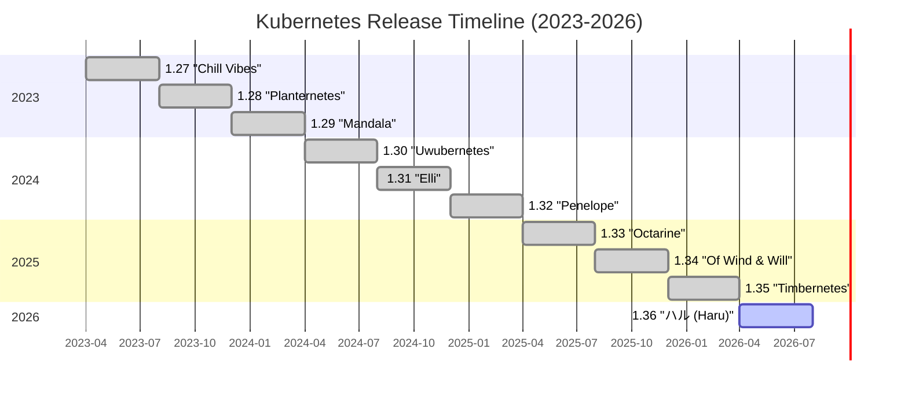
```mermaid
gantt
    title Kubernetes Release Timeline (2023-2026)
    dateFormat  YYYY-MM
    axisFormat  %Y-%m

    section 2023
    1.27 "Chill Vibes"        :done, v127, 2023-04, 2023-08
    1.28 "Planternetes"       :done, v128, 2023-08, 2023-12
    1.29 "Mandala"            :done, v129, 2023-12, 2024-04

    section 2024
    1.30 "Uwubernetes"        :done, v130, 2024-04, 2024-08
    1.31 "Elli"               :done, v131, 2024-08, 2024-12
    1.32 "Penelope"           :done, v132, 2024-12, 2025-04

    section 2025
    1.33 "Octarine"           :done, v133, 2025-04, 2025-08
    1.34 "Of Wind & Will"     :done, v134, 2025-08, 2025-12
    1.35 "Timbernetes"        :done, v135, 2025-12, 2026-04

    section 2026
    1.36 "ハル (Haru)"         :active, v136, 2026-04, 2026-08
```

### 典型发布时间线

每个版本都遵循结构化时间线，跨度约 15 周：

| 阶段 | 持续时间 | 描述 |
|-------|----------|-------------|
| **Enhancements Freeze** | Week 0 | 所有功能都必须具有已批准的 KEPs（Kubernetes Enhancement Proposals） |
| **Code Freeze** | ~Week 10 | 不再加入新的功能代码；重点转向 bug 修复和测试 |
| **Beta Release** | ~Week 11 | 用于测试的预发布版本 |
| **RC (Release Candidate)** | ~Week 13 | 最终测试阶段 |
| **General Availability** | ~Week 15 | 正式发布 |

### 功能成熟度模型

Kubernetes 对所有功能使用三阶段毕业模型。理解这些阶段对于生产规划至关重要。

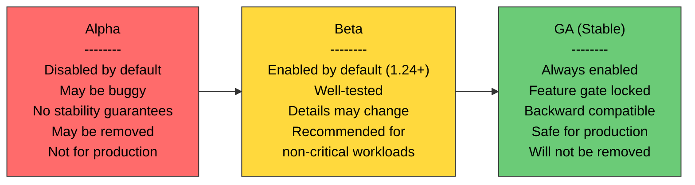
```mermaid
flowchart LR
    Alpha["Alpha
    --------
    Disabled by default
    May be buggy
    No stability guarantees
    May be removed
    Not for production"]
    -->
    Beta["Beta
    --------
    Enabled by default (1.24+)
    Well-tested
    Details may change
    Recommended for
    non-critical workloads"]
    -->
    GA["GA (Stable)
    --------
    Always enabled
    Feature gate locked
    Backward compatible
    Safe for production
    Will not be removed"]

    style Alpha fill:#ff6b6b,stroke:#333,color:black
    style Beta fill:#ffd93d,stroke:#333,color:black
    style GA fill:#6bcb77,stroke:#333,color:black
```

**需要注意的关键策略变化：**

- **自 Kubernetes 1.24 起**：Beta APIs 在新 cluster 中默认不再启用。新的 beta 功能需要通过 feature gates 显式选择启用。
- **自 Kubernetes 1.28 起**：GA 功能的 feature gates 会在两个版本后移除，这意味着该功能将永久启用。

### Feature Gates

Feature gates 是控制某个功能启用或禁用的键值对。它们是强制执行 alpha/beta/GA 成熟度模型的机制。

```yaml
# Example: Enabling feature gates on the kubelet
apiVersion: kubelet.config.k8s.io/v1beta1
kind: KubeletConfiguration
featureGates:
  InPlacePodVerticalScaling: true    # Enable in-place pod resize (beta in 1.33)
  UserNamespacesSupport: true         # Enable user namespaces (beta in 1.33)
```

```yaml
# Example: Enabling feature gates on the API server (EKS managed - informational only)
# Note: In EKS, control plane feature gates are managed by AWS.
# You cannot directly modify API server flags on EKS.
apiVersion: kubeadm.k8s.io/v1beta3
kind: ClusterConfiguration
apiServer:
  extraArgs:
    feature-gates: "ValidatingAdmissionPolicy=true,StructuredAuthorizationConfiguration=true"
```

**检查 cluster 中已启用的 feature gates：**

```bash
# List all feature gates and their status on a node's kubelet
kubectl get --raw /api/v1/nodes/<node-name>/proxy/configz | jq '.kubeletconfig.featureGates'

# Check API server feature gates (requires API server access logs)
kubectl get --raw /metrics | grep kubernetes_feature_enabled

# Check specific feature gate status
kubectl get --raw /metrics | grep 'kubernetes_feature_enabled{name="InPlacePodVerticalScaling"}'
```

### SIG 治理结构

Kubernetes 开发由 Special Interest Groups（SIGs）组织。理解哪个 SIG 拥有某项功能，有助于你跟踪其进展并找到相关文档。

| SIG | 范围 | 本文档中的关键功能 |
|-----|-------|-------------------------------|
| **SIG Node** | Kubelet、container runtime、pod lifecycle | Sidecar Containers、In-Place Pod Resize、User Namespaces |
| **SIG Auth** | Authentication、authorization、security policy | StructuredAuthorizationConfiguration、CEL Admission |
| **SIG Network** | Networking、Service、Ingress、DNS | Gateway API、ServiceCIDR/IPAddress、Topology Aware Routing |
| **SIG Storage** | PV/PVC、CSI、volume management | VolumeAttributesClass、ReadWriteOncePod |
| **SIG Scheduling** | Scheduler、Pod Scheduling Readiness | Pod Scheduling Readiness、Gang Scheduling |
| **SIG Apps** | Workload controllers（Deployment、StatefulSet、Job） | Job Success Policy、Sidecar Containers |
| **SIG API Machinery** | API server、CRDs、admission control | CEL Admission、KYAML |
| **SIG Autoscaling** | HPA、VPA、cluster autoscaling | HPA Container Resource Metrics |

---

## 3. EKS 版本支持矩阵

### 支持层级

Amazon EKS 提供两层版本支持：

| 层级 | 持续时间 | 价格 | 描述 |
|------|----------|---------|-------------|
| **Standard Support** | 从 EKS 发布起 14 个月 | $0.10/cluster/hour | 完整功能支持、安全补丁、bug 修复 |
| **Extended Support** | 额外 12 个月 | $0.60/cluster/hour | 仅安全补丁和关键 bug 修复 |

> **成本影响**: Extended support 的成本是 standard support 价格的 6 倍。对于一个 24/7 运行的 cluster，这大约相当于 extended support 每年 $4,380，而 standard support 每年 $730 -- 每个 cluster 每年额外增加 $3,650。

### 版本生命周期图

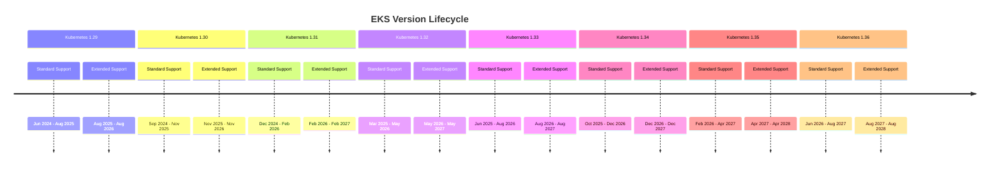
```mermaid
timeline
    title EKS Version Lifecycle
    section Kubernetes 1.29
        Standard Support : Jun 2024 - Aug 2025
        Extended Support : Aug 2025 - Aug 2026
    section Kubernetes 1.30
        Standard Support : Sep 2024 - Nov 2025
        Extended Support : Nov 2025 - Nov 2026
    section Kubernetes 1.31
        Standard Support : Dec 2024 - Feb 2026
        Extended Support : Feb 2026 - Feb 2027
    section Kubernetes 1.32
        Standard Support : Mar 2025 - May 2026
        Extended Support : May 2026 - May 2027
    section Kubernetes 1.33
        Standard Support : Jun 2025 - Aug 2026
        Extended Support : Aug 2026 - Aug 2027
    section Kubernetes 1.34
        Standard Support : Oct 2025 - Dec 2026
        Extended Support : Dec 2026 - Dec 2027
    section Kubernetes 1.35
        Standard Support : Feb 2026 - Apr 2027
        Extended Support : Apr 2027 - Apr 2028
    section Kubernetes 1.36
        Standard Support : Jun 2026 - Aug 2027
        Extended Support : Aug 2027 - Aug 2028
```

### 详细版本支持矩阵

下表跟踪 EKS 支持的每个 Kubernetes 版本，包括 upstream 发布日期、EKS 可用性以及支持结束日期。

| K8s 版本 | Code Name | Upstream Release | EKS Release | Standard Support End | Extended Support End | 当前状态 |
|-------------|-----------|-----------------|-------------|---------------------|---------------------|----------------|
| **1.29** | Mandala | Dec 2023 | Jun 2024 | Aug 2025 | Aug 2026 | Extended Support |
| **1.30** | Uwubernetes | Apr 2024 | Sep 2024 | Nov 2025 | Nov 2026 | Extended Support |
| **1.31** | Elli | Aug 2024 | Dec 2024 | Feb 2026 | Feb 2027 | Extended Support |
| **1.32** | Penelope | Dec 2024 | Mar 2025 | May 2026 | May 2027 | Standard Support |
| **1.33** | Octarine | Apr 2025 | Jun 2025 | Aug 2026 | Aug 2027 | Standard Support |
| **1.34** | Of Wind & Will | Aug 2025 | Oct 2025 | Dec 2026 | Dec 2027 | Standard Support |
| **1.35** | Timbernetes | Dec 2025 | Feb 2026 | Apr 2027 | Apr 2028 | Standard Support |
| **1.36** | ハル (Haru) | Apr 2026 | Jun 2026 | Aug 2027 | Aug 2028 | Standard Support |

> **注意**: EKS 发布日期通常比 upstream Kubernetes 发布晚 2-4 个月。AWS 会利用这段时间验证该版本、与 EKS managed add-ons 集成，并确保与 AWS 服务兼容。

### 自动升级行为

当某个 Kubernetes 版本达到支持结束（包括 extended support）时，EKS 会自动升级你的 cluster：

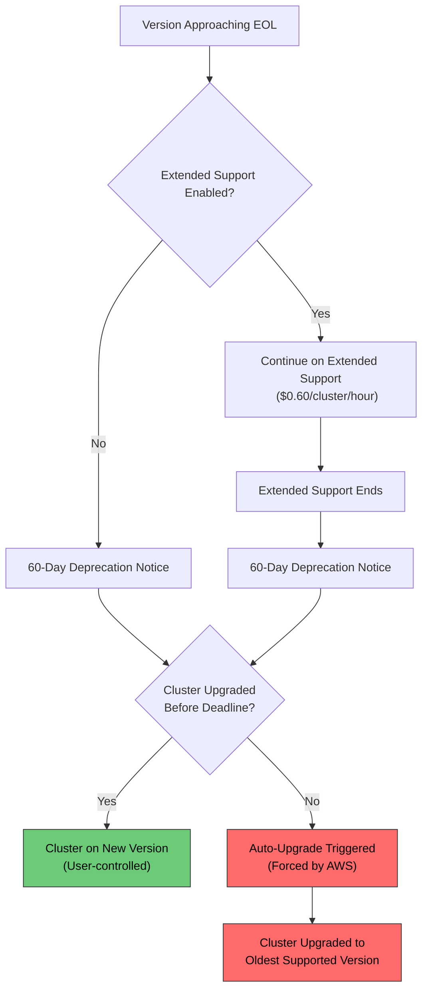
```mermaid
flowchart TD
    A["Version Approaching EOL"] --> B{"Extended Support Enabled?"}
    B -->|Yes| C["Continue on Extended Support
    ($0.60/cluster/hour)"]
    B -->|No| D["60-Day Deprecation Notice"]
    C --> E["Extended Support Ends"]
    E --> F["60-Day Deprecation Notice"]
    D --> G{"Cluster Upgraded
    Before Deadline?"}
    F --> G
    G -->|Yes| H["Cluster on New Version
    (User-controlled)"]
    G -->|No| I["Auto-Upgrade Triggered
    (Forced by AWS)"]
    I --> J["Cluster Upgraded to
    Oldest Supported Version"]

    style I fill:#ff6b6b,stroke:#333,color:black
    style J fill:#ff6b6b,stroke:#333,color:black
    style H fill:#6bcb77,stroke:#333,color:black
```

**重要**: 自动升级只会更新 control plane。你仍然必须手动升级 node groups、add-ons 和 self-managed components。强制 control plane 升级如果没有对应的 node 和 add-on 升级，可能导致 workload 中断。

### 近期 EKS 版本支持公告（2026）

AWS 在 2026 年发布了多项影响 EKS 版本支持的公告：

| 日期 | 公告 | 亮点 |
|:---:|------|------|
| 2026-06-02 | EKS & EKS Distro 开始支持 Kubernetes 1.36 | User Namespaces GA、Mutating Admission Policies、In-Place Pod Vertical Scaling、Resource Health Status、EKS Cluster Insights 升级前检查 |
| 2026-01-28 | EKS & EKS Distro 开始支持 Kubernetes 1.35 | In-Place Pod Resource Updates、PreferSameNode Traffic Distribution、Node Topology Labels via Downward API、Image Volumes |

#### Kubernetes 1.36 支持（June 2, 2026）

Amazon EKS 和 EKS Distro 开始支持 Kubernetes 1.36。公告重点强调（实现细节见下文 4.8 节）：

- **User Namespaces (GA)**: 将 container 的 root 用户映射到非特权 host 用户，从而强化多租户隔离
- **Mutating Admission Policies**: 基于 CEL 的 mutation，无需 webhook server
- **In-Place Pod Vertical Scaling**: 在不重启 pod 的情况下调整 CPU/memory
- **Resource Health Status**: 在 Pod status 中暴露 device health 和硬件故障条件
- **EKS Cluster Insights**: 针对已弃用 API 使用和 add-on 兼容性的升级前检查

> Source: [Amazon EKS Distro now supports Kubernetes version 1.36](https://aws.amazon.com/about-aws/whats-new/2026/06/amazon-eks-distro-kubernetes-version-1-36/)

#### Kubernetes 1.35 支持（January 28, 2026）

Amazon EKS 和 EKS Distro 开始支持 Kubernetes 1.35，新增：

- **In-Place Pod Resource Updates** -- 与 4.7 节中作为 In-Place Pod Vertical Scaling GA 覆盖的无重启资源调整能力相同
- **PreferSameNode Traffic Distribution** -- 优先将流量路由到同一 node 上的 endpoints
- **Node Topology Labels via Downward API** -- 将 node topology labels 暴露给 pods
- **Image Volumes** -- 将 OCI images 挂载为 volumes，用于交付数据和 ML models

> Source: [Amazon EKS Distro now supports Kubernetes version 1.35](https://aws.amazon.com/about-aws/whats-new/2026/01/amazon-eks-distro-kubernetes-version-1-35)

> **相关公告**: EKS 版本回滚支持（July 1, 2026）以及新的 control plane 99.99% SLA / 8XL 扩展层级（March 20, 2026）在 [EKS Upgrades](08-eks-upgrades.md) 文档中介绍，因为它们与升级流程直接相关，而不是 Kubernetes 版本功能。

---

## 4. 按版本划分的功能指南

本节详细拆解 Kubernetes 1.29 到 1.36 每个版本中引入、毕业和弃用的功能。

### 4.1 Kubernetes 1.29 "Mandala" (December 2023)

**主题**: 以象征宇宙的几何艺术形式命名，体现社区对该版本的整体性方法。

**发布统计**: 49 项增强 -- 11 项 Stable、19 项 Beta、19 项 Alpha

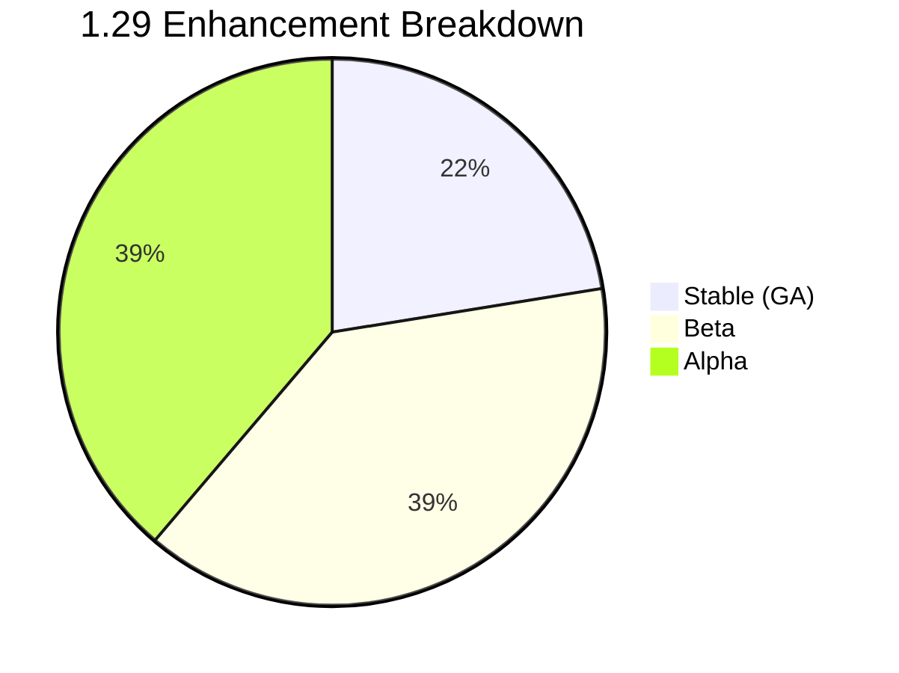
```mermaid
pie title 1.29 Enhancement Breakdown
    "Stable (GA)" : 11
    "Beta" : 19
    "Alpha" : 19
```

#### 关键毕业功能（GA）

**KMS v2 Encryption**

用于 Kubernetes Secrets 静态加密的 KMS v2 达到 GA，相比 KMS v1 提供显著的性能改进。

| 方面 | KMS v1 | KMS v2 |
|--------|--------|--------|
| 每次写入的加密调用 | 每个 object 1 次 | 每次 DEK 轮换 1 次 |
| 性能 | 大规模时延迟高 | 近似恒定延迟 |
| 密钥层次结构 | 单层 | 双层（KEK + DEK） |
| 状态 | 1.28 中弃用 | 1.29 中 GA |

```yaml
# KMS v2 EncryptionConfiguration
apiVersion: apiserver.config.k8s.io/v1
kind: EncryptionConfiguration
resources:
  - resources:
      - secrets
    providers:
      - kms:
          apiVersion: v2
          name: aws-encryption-provider
          endpoint: unix:///var/run/kmsplugin/socket.sock
          timeout: 3s
      - identity: {}
```

**ReadWriteOncePod PV Access Mode**

`ReadWriteOncePod` (RWOP) access mode 毕业到 GA。它确保一个 PersistentVolume 在整个 cluster 中只能由单个 Pod 以读写方式挂载，比 `ReadWriteOnce`（允许同一 node 上的多个 pods）提供更强的数据安全保证。

```yaml
apiVersion: v1
kind: PersistentVolumeClaim
metadata:
  name: database-pvc
spec:
  accessModes:
    - ReadWriteOncePod    # Only one pod can mount this volume
  storageClassName: gp3
  resources:
    requests:
      storage: 100Gi
```

**1.29 中其他 GA 功能**:
- 用于带 credentials 的 CSI volume expansion 的 `NodeExpandSecret`
- 用于 kubelet 级分布式 tracing 的 `KubeletTracing`
- `ReadWriteOncePod` PersistentVolume access mode
- 用于 topology spread constraints 的 `MinDomainsInPodTopologySpread`

#### 关键 Beta 功能

**基于 nftables 的 kube-proxy（Alpha）**

引入了一个新的 kube-proxy backend，使用 nftables 而非 iptables，成熟度为 alpha。这很重要，因为 nftables 比 iptables 提供更好的性能和可扩展性，尤其是在拥有数千个 Services 的 cluster 中。

```bash
# Check current kube-proxy mode
kubectl get configmap kube-proxy-config -n kube-system -o yaml | grep mode

# nftables mode (alpha in 1.29 - requires feature gate)
# mode: nftables
```

| Proxy Mode | 1.29 中的成熟度 | 规则复杂度 | 大规模性能 |
|-----------|-------------------|-----------------|---------------------|
| iptables | Stable（默认） | O(n) per packet | >5000 services 后下降 |
| IPVS | Stable | O(1) lookup | 大规模表现良好 |
| nftables | Alpha | O(1) lookup | 大规模表现优秀 |

**Load Balancer IP Mode**

`LoadBalancerIPMode` feature（beta）允许 LoadBalancer 类型的 Services 指定 load balancer IP 的处理方式，从而提升与 cloud provider 实现的兼容性。

#### 关键 Alpha 功能

- **SidecarContainers**（带 `restartPolicy: Always` 的 initContainer）-- 一个里程碑式功能的起点
- **PodLifecycleSleepAction** -- 为 pod lifecycle hooks 添加 `sleep` action
- **Unknown Version Interoperability Proxy** -- 代理未知 API 版本的请求

#### 1.29 中的弃用

- `flowcontrol.apiserver.k8s.io/v1beta2` 已弃用（在 1.32 中移除）
- `SecurityContextDeny` admission plugin 已弃用
- In-tree cloud provider integrations 继续沿弃用路径推进

---

### 4.2 Kubernetes 1.30 "Uwubernetes" (April 2024)

**主题**: 社区选择的俏皮名称，体现 Kubernetes 社区的欢迎和包容特质。

**发布统计**: 45 项增强 -- 17 项 Stable、18 项 Beta、10 项 Alpha

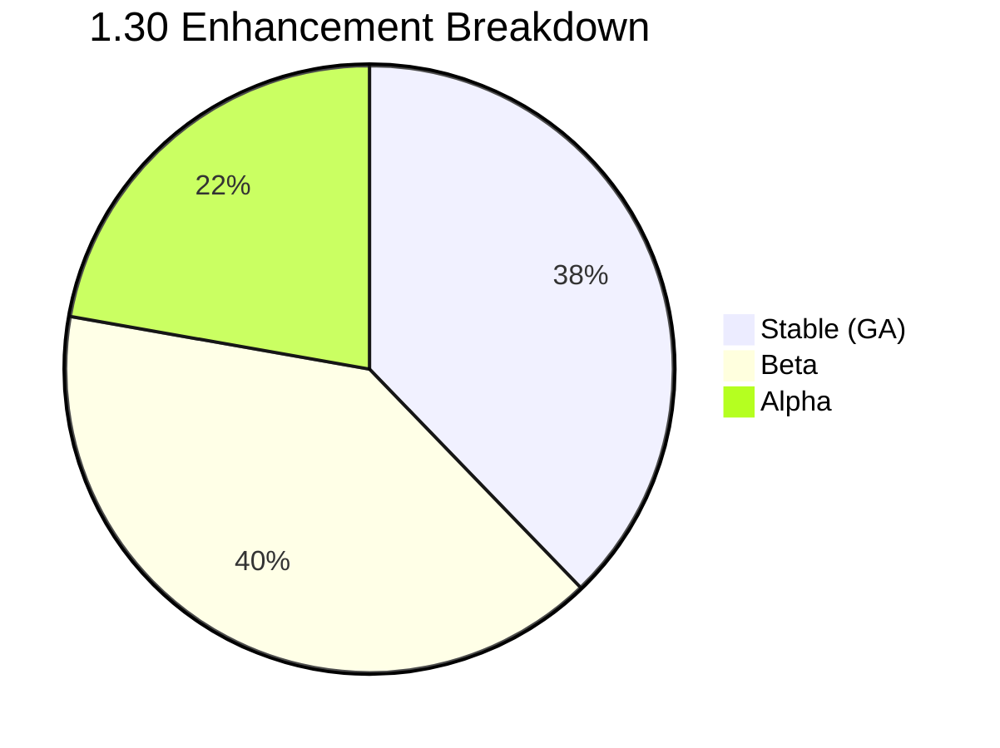
```mermaid
pie title 1.30 Enhancement Breakdown
    "Stable (GA)" : 17
    "Beta" : 18
    "Alpha" : 10
```

#### 关键毕业功能（GA）

**ValidatingAdmissionPolicy with CEL (GA)**

这是最重要的毕业功能之一。ValidatingAdmissionPolicy 使用 Common Expression Language（CEL）实现原生 admission control，在许多场景下消除了对基于 webhook 的 admission controllers 的需求。

| 方面 | Admission Webhooks | ValidatingAdmissionPolicy (CEL) |
|--------|-------------------|-------------------------------|
| 延迟 | 网络往返 | 进程内评估 |
| 可用性风险 | Webhook server 失败 = 请求被阻塞 | 无外部依赖 |
| 语言 | 任意（Go、Python 等） | CEL |
| 复杂度 | 高（部署、维护、扩展） | 低（单个 YAML resource） |
| 功能历程 | N/A | Alpha 1.26 -> Beta 1.28 -> GA 1.30 |

```yaml
# ValidatingAdmissionPolicy: Require resource limits on all containers
apiVersion: admissionregistration.k8s.io/v1
kind: ValidatingAdmissionPolicy
metadata:
  name: require-resource-limits
spec:
  failurePolicy: Fail
  matchConstraints:
    resourceRules:
      - apiGroups: [""]
        apiVersions: ["v1"]
        operations: ["CREATE", "UPDATE"]
        resources: ["pods"]
  validations:
    - expression: >-
        object.spec.containers.all(c,
          has(c.resources) &&
          has(c.resources.limits) &&
          has(c.resources.limits.memory) &&
          has(c.resources.limits.cpu)
        )
      message: "All containers must have CPU and memory limits set"
      reason: Invalid
---
apiVersion: admissionregistration.k8s.io/v1
kind: ValidatingAdmissionPolicyBinding
metadata:
  name: require-resource-limits-binding
spec:
  policyName: require-resource-limits
  validationActions:
    - Deny
  matchResources:
    namespaceSelector:
      matchLabels:
        enforce-limits: "true"
```

```yaml
# CEL: Enforce image registry policy
apiVersion: admissionregistration.k8s.io/v1
kind: ValidatingAdmissionPolicy
metadata:
  name: restrict-image-registries
spec:
  failurePolicy: Fail
  matchConstraints:
    resourceRules:
      - apiGroups: [""]
        apiVersions: ["v1"]
        operations: ["CREATE", "UPDATE"]
        resources: ["pods"]
  validations:
    - expression: >-
        object.spec.containers.all(c,
          c.image.startsWith('123456789012.dkr.ecr.') ||
          c.image.startsWith('public.ecr.aws/')
        )
      message: "Images must come from approved ECR registries"
    - expression: >-
        object.spec.initContainers.all(c,
          c.image.startsWith('123456789012.dkr.ecr.') ||
          c.image.startsWith('public.ecr.aws/')
        )
      message: "Init container images must come from approved ECR registries"
```

**Pod Scheduling Readiness (GA)**

Pod Scheduling Readiness 允许创建 pods，但在满足某些条件之前不进行调度。这将 pod 创建与调度解耦，支持 batch scheduling 和 resource provisioning 等高级工作流。

```yaml
# Pod with scheduling gates
apiVersion: v1
kind: Pod
metadata:
  name: ml-training-job
spec:
  schedulingGates:
    - name: "example.com/gpu-provisioned"      # Gate 1: Wait for GPU node
    - name: "example.com/dataset-downloaded"    # Gate 2: Wait for data
  containers:
    - name: trainer
      image: ml-training:v2
      resources:
        limits:
          nvidia.com/gpu: 4
```

```bash
# Remove a scheduling gate when the condition is met
kubectl patch pod ml-training-job --type='json' -p='[
  {"op": "remove", "path": "/spec/schedulingGates/0"}
]'

# Check remaining scheduling gates
kubectl get pod ml-training-job -o jsonpath='{.spec.schedulingGates}'
```

**HPA ContainerResource Metrics (GA)**

HPA 现在可以基于单个 container 指标而不是总 pod 指标进行扩缩容。这对 sidecar 模式至关重要，因为扩缩容应由主 container 的资源使用量驱动，而不是包含 sidecars 的合计总量。

```yaml
apiVersion: autoscaling/v2
kind: HorizontalPodAutoscaler
metadata:
  name: web-app-hpa
spec:
  scaleTargetRef:
    apiVersion: apps/v1
    kind: Deployment
    name: web-app
  minReplicas: 2
  maxReplicas: 50
  metrics:
    - type: ContainerResource
      containerResource:
        name: cpu
        container: app              # Scale based only on the 'app' container
        target:
          type: Utilization
          averageUtilization: 70
    - type: ContainerResource
      containerResource:
        name: memory
        container: app              # Ignore sidecar memory usage
        target:
          type: Utilization
          averageUtilization: 80
```

**1.30 中其他 GA 功能**:
- `MinDomainsInPodTopologySpread` -- topology spread 的最小 domain 数
- `NodeLogQuery` -- 通过 kubelet API 查询 node 级日志
- `PodDisruptionConditions` -- 向 Pod status 添加 disruption 相关 conditions
- `StableLoadBalancerNodeSet` -- 用于 load balancer health checks 的稳定 node 集合

#### 关键 Beta 功能

**Contextual Logging（Beta，默认启用）**

Contextual logging 为所有 Kubernetes log messages 添加结构化上下文（如 pod name、namespace、component），显著简化日志分析和关联。

```bash
# Before contextual logging
I0415 12:00:00.000000       1 controller.go:100] "Reconciling object" name="my-pod"

# With contextual logging (additional context automatically added)
I0415 12:00:00.000000       1 controller.go:100] "Reconciling object" logger="pod-controller" pod="default/my-pod" node="ip-10-0-1-100"
```

**Recursive Read-Only Mounts（Beta）**

允许递归地将整个 volume mount tree 设为只读，防止只读挂载路径内出现任何可写的 sub-mounts。

#### 关键 Alpha 功能

- **UserNamespacesSupport** -- 用于提升安全隔离的 pod 级 user namespaces
- **RelaxedEnvironmentVariableValidation** -- 允许 env var values 中使用此前无效的字符
- **SELinuxMountReadWriteOncePod** -- RWOP volumes 的 SELinux label 支持

---
### 4.3 Kubernetes 1.31 "Elli" (August 2024)

**主题**: 以一位 Kubernetes contributor 的狗命名，体现社区的个人化温度。

**发布统计**: 45 项增强 -- 11 项 Stable、22 项 Beta、12 项 Alpha

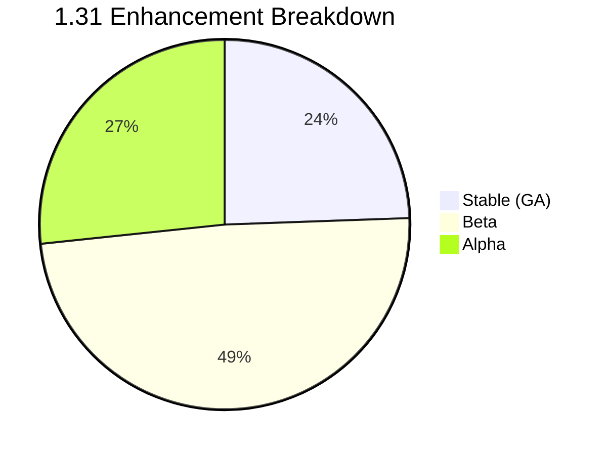
```mermaid
pie title 1.31 Enhancement Breakdown
    "Stable (GA)" : 11
    "Beta" : 22
    "Alpha" : 12
```

#### 关键毕业功能（GA）

**AppArmor Support (GA)**

Kubernetes 中原生 AppArmor 支持毕业到 GA，用正式 API fields 取代了此前基于 annotation 的方式。

```yaml
# Old approach (deprecated annotations)
# metadata:
#   annotations:
#     container.apparmor.security.beta.kubernetes.io/app: localhost/my-profile

# New GA approach: native API field
apiVersion: v1
kind: Pod
metadata:
  name: secure-app
spec:
  containers:
    - name: app
      image: myapp:latest
      securityContext:
        appArmorProfile:
          type: Localhost
          localhostProfile: my-custom-profile
```

```yaml
# AppArmor with RuntimeDefault profile
apiVersion: apps/v1
kind: Deployment
metadata:
  name: web-server
spec:
  template:
    spec:
      containers:
        - name: nginx
          image: nginx:1.27
          securityContext:
            appArmorProfile:
              type: RuntimeDefault    # Uses container runtime's default profile
```

**Persistent Volume Last Phase Transition Time (GA)**

PersistentVolumes 上新的 `.status.lastPhaseTransitionTime` 字段会跟踪 PV 上一次变更 phase（Available、Bound、Released、Failed）的时间。这支持围绕 volume lifecycle 进行更好的监控和自动化。

```bash
# Check PV phase transition times
kubectl get pv -o custom-columns=\
NAME:.metadata.name,\
PHASE:.status.phase,\
LAST_TRANSITION:.status.lastPhaseTransitionTime

# Example output:
# NAME         PHASE     LAST_TRANSITION
# pv-data-01   Bound     2025-01-15T10:30:00Z
# pv-data-02   Released  2025-01-14T22:15:00Z
```

**1.31 中其他 GA 功能**:
- `PodDisruptionConditions` -- 在 Pod status 中加入更丰富的 disruption cause 信息
- `JobPodReplacementPolicy` -- 控制 Jobs 中失败 pods 何时被替换
- `PodHostIPs` -- 通过 downward API 向 pods 暴露所有 host IPs（IPv4 和 IPv6）

#### 关键 Beta 功能

**DRA Structured Parameters（Beta）**

Dynamic Resource Allocation（DRA）structured parameters 进入 beta，允许 device plugins 通过标准化 API 发布硬件能力。这是 GPU、FPGA 和其他 accelerator scheduling 的基础。

```yaml
# ResourceClaim for GPU allocation using DRA
apiVersion: resource.k8s.io/v1beta1
kind: ResourceClaim
metadata:
  name: gpu-claim
spec:
  devices:
    requests:
      - name: gpu
        deviceClassName: gpu.nvidia.com
        selectors:
          - cel:
              expression: >-
                device.attributes["gpu.nvidia.com"].model == "A100" &&
                device.capacity["gpu.nvidia.com"].memory.compareTo(quantity("80Gi")) >= 0
```

**Sidecar Containers（Beta）**

Sidecar containers 功能从 1.29 的 alpha 推进到 beta（在 1.31 中默认启用）。带 `restartPolicy: Always` 的 init containers 现在可作为真正的 sidecars：
- 在常规 containers 之前启动
- 与主 workload 一起运行
- 在 pod 关闭期间最后终止

```yaml
apiVersion: v1
kind: Pod
metadata:
  name: app-with-sidecar
spec:
  initContainers:
    - name: log-shipper
      image: fluent-bit:latest
      restartPolicy: Always       # This makes it a sidecar
      volumeMounts:
        - name: log-volume
          mountPath: /var/log/app
  containers:
    - name: app
      image: myapp:latest
      volumeMounts:
        - name: log-volume
          mountPath: /var/log/app
  volumes:
    - name: log-volume
      emptyDir: {}
```

**Services 的 Traffic Distribution（Beta）**

Services 上新的 `spec.trafficDistribution` 字段允许请求流量路由偏好，例如优先使用同一区域 endpoints。

```yaml
apiVersion: v1
kind: Service
metadata:
  name: my-service
spec:
  trafficDistribution: PreferClose    # Route traffic to closest endpoints
  selector:
    app: my-app
  ports:
    - port: 80
      targetPort: 8080
```

**1.31 中其他 Beta 功能**:
- `PodLifecycleSleepAction` -- PreStop/PostStart hooks 中的 `sleep` action
- `RelaxedDNSSearchValidation` -- 放宽 DNS search path validation
- `VolumeAttributesClass` -- 通过 CSI 实现可变 volume attributes

#### 关键 Alpha 功能

- **PortForwardWebsockets** -- 基于 WebSocket 的 port forwarding
- **ImageVolume** -- 将 OCI images 作为只读 volumes 挂载
- **DRAPartitionableDevices** -- DRA devices 的 partitioning 支持

---

### 4.4 Kubernetes 1.32 "Penelope" (December 2024)

**主题**: 以荷马《奥德赛》中忠贞的 Penelope 命名，象征项目坚定的可靠性。

**发布统计**: 44 项增强 -- 13 项 Stable、12 项 Beta、19 项 Alpha

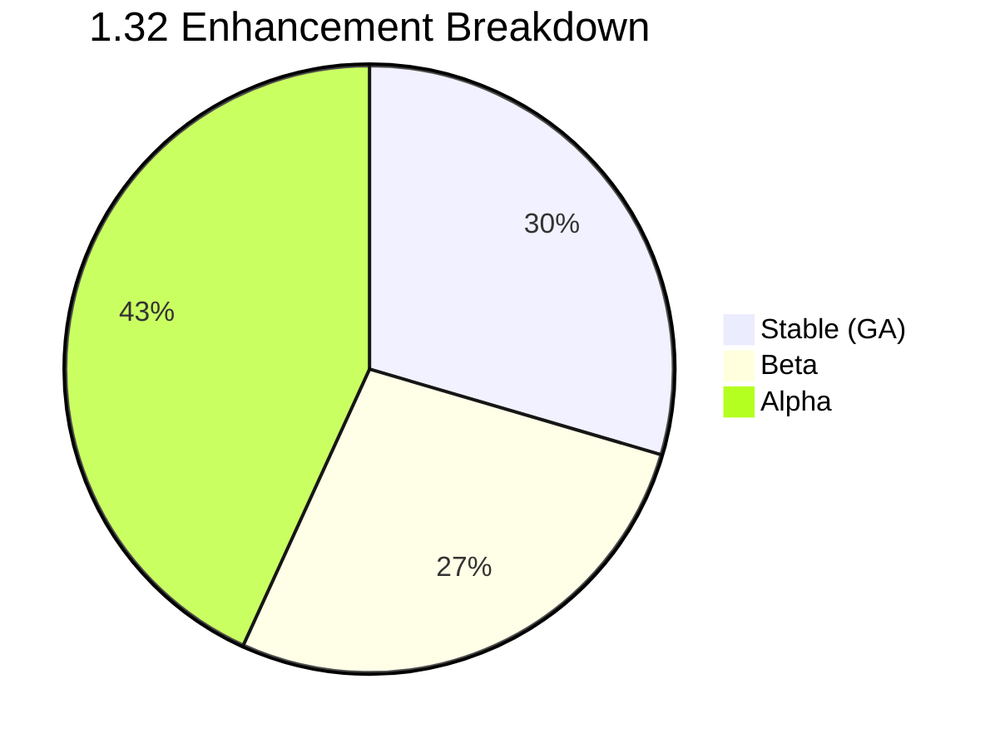
```mermaid
pie title 1.32 Enhancement Breakdown
    "Stable (GA)" : 13
    "Beta" : 12
    "Alpha" : 19
```

#### 关键毕业功能（GA）

**StructuredAuthorizationConfiguration (GA)**

这是一项重要安全功能，允许定义授权模块（Node、RBAC、Webhook、CEL）的有序链和结构化配置。它取代了旧的 `--authorization-mode` flag 方式。

```yaml
# StructuredAuthorizationConfiguration
# (Managed by AWS for EKS control plane; shown for reference)
apiVersion: apiserver.config.k8s.io/v1beta1
kind: AuthorizationConfiguration
authorizers:
  - type: Node
    name: node
  - type: RBAC
    name: rbac
  - type: Webhook
    name: custom-authz
    webhook:
      timeout: 3s
      subjectAccessReviewVersion: v1
      matchConditionSubjectAccessReviewVersion: v1
      failurePolicy: Deny
      connectionInfo:
        type: KubeConfigFile
        kubeConfigFile: /etc/kubernetes/authz-webhook.kubeconfig
      matchConditions:
        - expression: >-
            request.resourceAttributes.namespace == "production"
```

这带来：
- **有序评估**: Authorization requests 按顺序通过链进行评估
- **基于 CEL 的过滤**: 使用 CEL expressions 仅将相关请求匹配到每个 authorizer
- **细粒度 webhook 路由**: 只将特定请求发送到外部 authorization webhooks
- **功能历程**: Alpha 1.29 -> Beta 1.30 -> GA 1.32

**Auto-Remove PVC Protection Finalizer (GA)**

当 PVC 不再使用时，PersistentVolumeClaim protection finalizers 现在会自动清理。这消除了常见的孤立 PVC 问题：由于 protection finalizer 从未移除，PVC 无法删除。

```bash
# Before 1.32: Common issue - stuck PVC deletion
$ kubectl delete pvc my-pvc
persistentvolumeclaim "my-pvc" deleted  # ... hangs forever

$ kubectl get pvc my-pvc -o jsonpath='{.metadata.finalizers}'
["kubernetes.io/pvc-protection"]  # Finalizer not removed

# After 1.32 (GA): Automatic cleanup
$ kubectl delete pvc my-pvc
persistentvolumeclaim "my-pvc" deleted  # Completes immediately when no pod references it
```

**1.32 中其他 GA 功能**:
- `CustomResourceFieldSelectors` -- CRDs 的 field selectors
- `RetryGenerateName` -- 发生冲突时使用新的 generated names 自动重试
- `SizeMemoryBackedVolumes` -- 对 memory-backed emptyDir volumes 强制执行 size limits
- `StableLoadBalancerNodeSet` -- 用于 LB health checking 的一致 node 集合
- `ServiceAccountTokenJTI` -- SA tokens 中用于 audit tracking 的唯一 JTI
- `ServiceAccountTokenNodeBindingValidation` -- 将 SA tokens 绑定到 nodes

#### 关键 Beta 功能

**User Namespaces（Beta）**

User namespaces 通过在 containers 内重新映射 UIDs 和 GIDs 来提供强大的安全边界，因此即使进程在 container 内以 root 运行，也会映射到 host 上的非特权用户。

```yaml
apiVersion: v1
kind: Pod
metadata:
  name: secure-pod
spec:
  hostUsers: false              # Enable user namespace remapping
  containers:
    - name: app
      image: myapp:latest
      securityContext:
        runAsUser: 0            # Root inside container
        # Maps to unprivileged UID on host (e.g., UID 65534+offset)
```

**VolumeAttributesClass（Beta）**

VolumeAttributesClass 允许在 provisioning 之后改变 volume attributes（如 IOPS、throughput），而无需重新创建 volume。

```yaml
apiVersion: storage.k8s.io/v1beta1
kind: VolumeAttributesClass
metadata:
  name: high-performance
driverName: ebs.csi.aws.com
parameters:
  iops: "10000"
  throughput: "500"
---
apiVersion: v1
kind: PersistentVolumeClaim
metadata:
  name: database-volume
spec:
  accessModes:
    - ReadWriteOnce
  resources:
    requests:
      storage: 500Gi
  storageClassName: gp3
  volumeAttributesClassName: high-performance    # Apply performance attributes
```

```yaml
# Modify volume attributes by changing the class reference
# (triggers a CSI ModifyVolume call)
apiVersion: v1
kind: PersistentVolumeClaim
metadata:
  name: database-volume
spec:
  volumeAttributesClassName: ultra-performance   # Switch to higher tier
```

**nftables kube-proxy（Beta）**

kube-proxy 的 nftables backend 推进到 beta，为 Service routing 带来可用于生产的 nftables 支持。

#### 关键 Alpha 功能

- **DynamicResourceAllocation (DRA) Core** -- 综合性的 GPU/accelerator scheduling framework
- **MultiCIDRServiceAllocator** -- 从多个 CIDR ranges 分配 Service IPs
- **RelaxedEnvironmentVariableValidation** -- 允许 env vars 使用更扩展的字符集
- **InPlacePodVerticalScalingExtendedStatus** -- pod resizing 的扩展 status reporting

---

### 4.5 Kubernetes 1.33 "Octarine" (April 2025)

**主题**: 以 Terry Pratchett 的 Discworld 系列中只有巫师才能看到的第八种颜色命名。对于一个充满魔法般功能的版本来说非常贴切。

**发布统计**: 64 项增强 -- 18 项 Stable、20 项 Beta、24 项 Alpha（本范围内最大的版本）

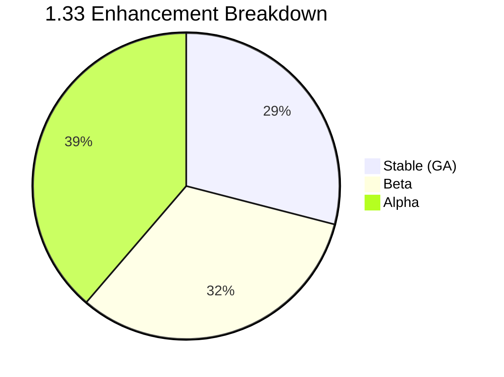
```mermaid
pie title 1.33 Enhancement Breakdown
    "Stable (GA)" : 18
    "Beta" : 20
    "Alpha" : 24
```

#### 关键毕业功能（GA）

**Sidecar Containers (GA)**

这是本版本最受期待的 GA 毕业。原生 sidecar containers 通过带 `restartPolicy: Always` 的 init containers 实现，在经历多个版本后达到完全稳定。

| 版本 | 状态 | 行为 |
|---------|--------|----------|
| 1.28 | Alpha | 需要 feature gate `SidecarContainers` |
| 1.29 | Alpha | Bug fixes、稳定性改进 |
| 1.31 | Beta | 默认启用 |
| 1.33 | **GA** | 永久启用，feature gate 移除 |

```yaml
# Production-ready sidecar pattern (GA in 1.33)
apiVersion: apps/v1
kind: Deployment
metadata:
  name: microservice
spec:
  replicas: 3
  selector:
    matchLabels:
      app: microservice
  template:
    metadata:
      labels:
        app: microservice
    spec:
      initContainers:
        # Sidecar 1: Service mesh proxy
        - name: envoy-proxy
          image: envoyproxy/envoy:v1.31
          restartPolicy: Always
          ports:
            - containerPort: 15001
          resources:
            requests:
              cpu: 100m
              memory: 128Mi
            limits:
              cpu: 500m
              memory: 256Mi

        # Sidecar 2: Log collection
        - name: fluent-bit
          image: fluent/fluent-bit:3.2
          restartPolicy: Always
          volumeMounts:
            - name: app-logs
              mountPath: /var/log/app
          resources:
            requests:
              cpu: 50m
              memory: 64Mi

        # Regular init container (runs to completion first)
        - name: db-migration
          image: myapp-migrations:latest
          command: ["./migrate", "--target", "latest"]

      containers:
        - name: app
          image: myapp:v3.2
          ports:
            - containerPort: 8080
          volumeMounts:
            - name: app-logs
              mountPath: /var/log/app

      volumes:
        - name: app-logs
          emptyDir: {}
```

**Sidecar container lifecycle guarantees:**

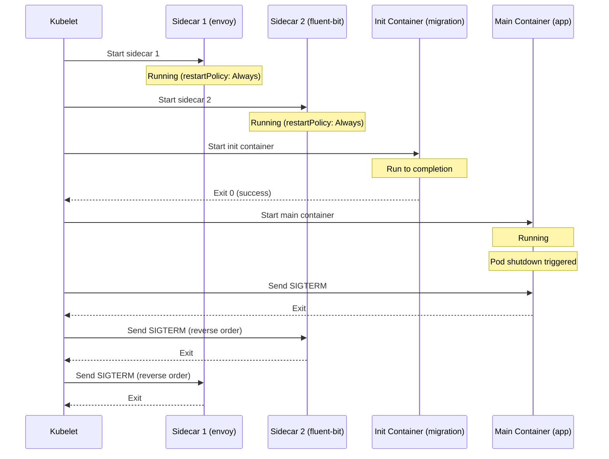
```mermaid
sequenceDiagram
    participant K as Kubelet
    participant S1 as Sidecar 1 (envoy)
    participant S2 as Sidecar 2 (fluent-bit)
    participant I as Init Container (migration)
    participant M as Main Container (app)

    K->>S1: Start sidecar 1
    Note over S1: Running (restartPolicy: Always)
    K->>S2: Start sidecar 2
    Note over S2: Running (restartPolicy: Always)
    K->>I: Start init container
    Note over I: Run to completion
    I-->>K: Exit 0 (success)
    K->>M: Start main container
    Note over M: Running

    Note over M: Pod shutdown triggered
    K->>M: Send SIGTERM
    M-->>K: Exit
    K->>S2: Send SIGTERM (reverse order)
    S2-->>K: Exit
    K->>S1: Send SIGTERM (reverse order)
    S1-->>K: Exit
```

**ServiceCIDR and IPAddress API (GA)**

ServiceCIDR and IPAddress API 允许在不重启 cluster 的情况下动态管理 Service IP ranges。这对初始 Service CIDR 耗尽的大规模 cluster 特别有用。

```yaml
# Define additional Service CIDR ranges
apiVersion: networking.k8s.io/v1
kind: ServiceCIDR
metadata:
  name: secondary-service-range
spec:
  cidrs:
    - "10.200.0.0/16"
```

```bash
# View allocated IP addresses
kubectl get ipaddresses

# Check ServiceCIDR status
kubectl get servicecidrs
NAME                       CIDRS            AGE
kubernetes                 10.96.0.0/12     365d
secondary-service-range    10.200.0.0/16    30d
```

**Topology Aware Routing (GA)**

此功能此前称为 “Topology Aware Hints”，以 “Topology Aware Routing” 的名称毕业到 GA。它使 Service 流量优先路由到同一可用区内的 endpoints，从而降低跨 AZ 数据传输成本。

```yaml
apiVersion: v1
kind: Service
metadata:
  name: my-service
  annotations:
    # Legacy hint-based approach (deprecated)
    # service.kubernetes.io/topology-aware-hints: Auto
spec:
  trafficDistribution: PreferClose    # GA approach in 1.33
  selector:
    app: my-app
  ports:
    - port: 80
      targetPort: 8080
```

> **EKS 成本提示**: 在高流量内部 services 上启用 topology-aware routing，可以显著降低跨 AZ 数据传输费用；在 AWS 同一区域内该费用为 $0.01/GB。

**Job Success Policy (GA)**

允许指定 Job 被视为成功的条件，即使并非所有 pods 都已完成。这对于分布式计算框架至关重要，因为 leader pod 的成功决定整体 job 成功。

```yaml
apiVersion: batch/v1
kind: Job
metadata:
  name: distributed-training
spec:
  completionMode: Indexed
  completions: 8
  parallelism: 8
  successPolicy:
    rules:
      - succeededIndexes: "0"       # Job succeeds when index 0 (leader) succeeds
        succeededCount: 1
  template:
    spec:
      containers:
        - name: trainer
          image: pytorch-training:latest
          env:
            - name: JOB_COMPLETION_INDEX
              valueFrom:
                fieldRef:
                  fieldPath: metadata.annotations['batch.kubernetes.io/job-completion-index']
```

**1.33 中其他 GA 功能**:
- `PodLifecycleSleepAction` -- pod lifecycle hooks 中的 `sleep` action
- `LoadBalancerIPMode` -- 控制 LB IP 如何暴露给 pods
- `JobManagedBy` -- 由外部 controller 管理 Job objects
- `RetryGenerateName` -- generated names 发生命名冲突时自动重试

#### 关键 Beta 功能（默认启用）

**In-Place Pod Vertical Scaling（Beta）**

这是 Kubernetes 历史上最受期待的功能之一。In-place pod resize 允许在不重启 running pod 的情况下更改 CPU 和 memory resources。

```yaml
apiVersion: v1
kind: Pod
metadata:
  name: resizable-app
spec:
  containers:
    - name: app
      image: myapp:latest
      resources:
        requests:
          cpu: 500m
          memory: 256Mi
        limits:
          cpu: "1"
          memory: 512Mi
      resizePolicy:
        - resourceName: cpu
          restartPolicy: NotRequired    # CPU resize without restart
        - resourceName: memory
          restartPolicy: RestartContainer  # Memory resize requires restart
```

```bash
# Resize a running pod's CPU (no restart!)
kubectl patch pod resizable-app --subresource resize --patch '{
  "spec": {
    "containers": [{
      "name": "app",
      "resources": {
        "requests": {"cpu": "1"},
        "limits": {"cpu": "2"}
      }
    }]
  }
}'

# Check resize status
kubectl get pod resizable-app -o jsonpath='{.status.resize}'
# "InProgress" -> "Proposed" -> "" (completed)

# View allocated vs requested resources
kubectl get pod resizable-app -o jsonpath='{.status.containerStatuses[0].allocatedResources}'
```

| 功能历程 | 版本 | 说明 |
|----------------|---------|-------|
| Alpha | 1.27 | 初始实现 |
| Beta | 1.33 | 默认启用 |
| GA | 1.35 | 完全稳定 |

**OCI Images as Volumes（Beta）**

将 OCI（Open Container Initiative）images 直接作为只读 volumes 挂载到 pods 中。这允许以 container images 形式共享数据、ML models 和配置，而无需将它们打包进 application image。

```yaml
apiVersion: v1
kind: Pod
metadata:
  name: ml-inference
spec:
  containers:
    - name: inference-server
      image: inference-engine:latest
      volumeMounts:
        - name: model
          mountPath: /models/llama
          readOnly: true
  volumes:
    - name: model
      image:
        reference: 123456789012.dkr.ecr.us-west-2.amazonaws.com/models:llama-7b
        pullPolicy: IfNotPresent
```

**User Namespaces（Beta）**

User namespaces 推进到 beta，通过将 container processes 映射到 host 上的非特权用户，提供更强的安全隔离。

**1.33 中其他 Beta 功能**:
- `MatchLabelKeysInPodAffinity` -- 使用 label keys 进行 pod affinity matching
- `PodLevelResources` -- 在 pod 级别（不仅是 container 级别）设置 resource limits
- `ServiceTrafficDistribution` -- 增强的 traffic distribution controls
- `StructuredAuthenticationConfiguration` -- 与 authz 模式匹配的结构化 authn config

#### 关键 Alpha 功能

- **KYAML** -- 一个更安全的 YAML 子集，限制危险 YAML 功能
- **PortForwardWebsockets** 改进
- **CRDValidationRatcheting** 增强 -- 允许已有无效字段通过 validation
- **MutatingAdmissionPolicy** -- 基于 CEL 的 mutating admission（ValidatingAdmissionPolicy 的对应功能）

---

### 4.6 Kubernetes 1.34 "Of Wind & Will" (August 2025)

**主题**: 这个富有表现力的名称捕捉了推动 Kubernetes 项目前进的动能与决心。

**发布统计**: 58 项增强 -- 23 项 Stable、22 项 Beta、13 项 Alpha

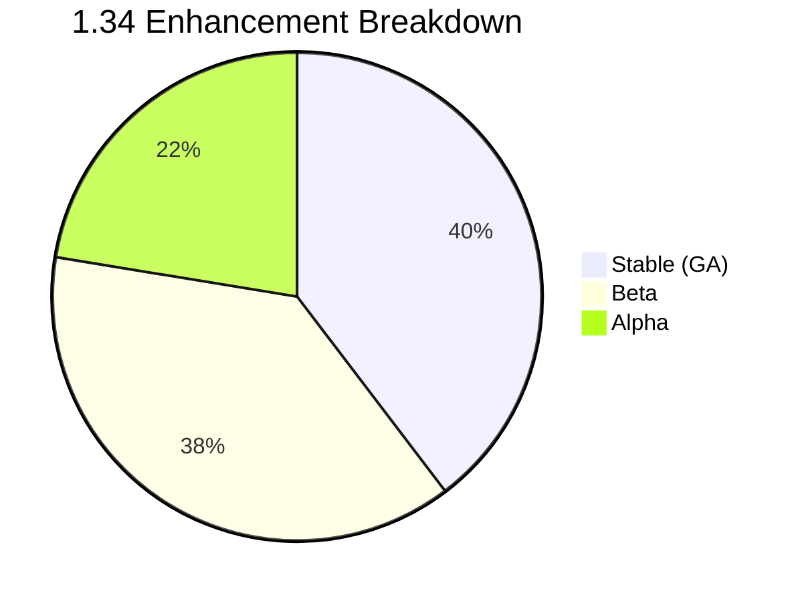
```mermaid
pie title 1.34 Enhancement Breakdown
    "Stable (GA)" : 23
    "Beta" : 22
    "Alpha" : 13
```

#### 关键毕业功能（GA）

**Dynamic Resource Allocation (DRA) Core APIs (GA)**

DRA 达到 GA，为请求和分配 GPUs、FPGAs、network devices 等硬件资源提供标准化框架。它以更灵活、更 Kubernetes-native 的方式取代旧的 device plugin model。

```yaml
# DeviceClass: Define a class of hardware devices
apiVersion: resource.k8s.io/v1
kind: DeviceClass
metadata:
  name: gpu-a100
spec:
  selectors:
    - cel:
        expression: >-
          device.driver == "gpu.nvidia.com" &&
          device.attributes["model"].stringValue == "A100"
---
# ResourceClaim: Request specific hardware
apiVersion: resource.k8s.io/v1
kind: ResourceClaim
metadata:
  name: training-gpus
  namespace: ml-team
spec:
  devices:
    requests:
      - name: gpu
        deviceClassName: gpu-a100
        count: 4
    constraints:
      - requests: ["gpu"]
        matchAttribute: "gpu.nvidia.com/numa-node"    # All GPUs on same NUMA node
---
# ResourceClaimTemplate: Auto-create claims per pod
apiVersion: resource.k8s.io/v1
kind: ResourceClaimTemplate
metadata:
  name: gpu-claim-template
  namespace: ml-team
spec:
  spec:
    devices:
      requests:
        - name: gpu
          deviceClassName: gpu-a100
          count: 1
---
# Pod using DRA
apiVersion: v1
kind: Pod
metadata:
  name: ml-training
  namespace: ml-team
spec:
  resourceClaims:
    - name: gpu-claim
      resourceClaimName: training-gpus
  containers:
    - name: trainer
      image: pytorch-training:latest
      resources:
        claims:
          - name: gpu-claim
            request: gpu
```

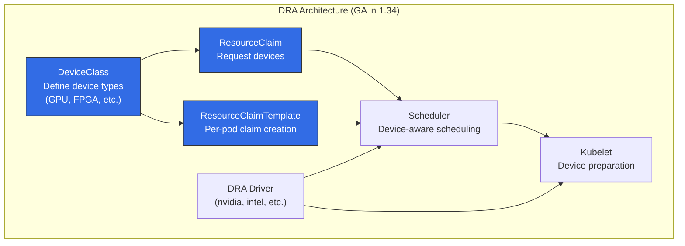
```mermaid
flowchart TD
    subgraph "DRA Architecture (GA in 1.34)"
        DC["DeviceClass
        Define device types
        (GPU, FPGA, etc.)"]
        RC["ResourceClaim
        Request devices"]
        RCT["ResourceClaimTemplate
        Per-pod claim creation"]
        DRI["DRA Driver
        (nvidia, intel, etc.)"]
        SCH["Scheduler
        Device-aware scheduling"]
        KUB["Kubelet
        Device preparation"]
    end

    DC --> RC
    DC --> RCT
    RC --> SCH
    RCT --> SCH
    SCH --> KUB
    DRI --> SCH
    DRI --> KUB

    style DC fill:#326CE5,stroke:#333,color:white
    style RC fill:#326CE5,stroke:#333,color:white
    style RCT fill:#326CE5,stroke:#333,color:white
```

**Namespace Structured Deletion (GA)**

Namespace 删除现在遵循定义明确的顺序，确保依赖资源在其所依赖资源之前被清理。这消除了一类长期存在的 namespace 卡住问题。

```bash
# Before 1.34: Namespace deletion could get stuck
$ kubectl delete namespace old-project
# Hangs indefinitely due to finalizer ordering issues

# After 1.34 (GA): Ordered deletion with clear status
$ kubectl delete namespace old-project
$ kubectl get namespace old-project -o jsonpath='{.status.conditions}'
# Shows clear progress through deletion phases
```

**VolumeAttributesClass (GA)**

VolumeAttributesClass 毕业到 GA，允许就地修改 IOPS 和 throughput 等 volume attributes。

```yaml
# Change EBS volume performance tier without recreating
apiVersion: storage.k8s.io/v1
kind: VolumeAttributesClass
metadata:
  name: high-iops
driverName: ebs.csi.aws.com
parameters:
  iops: "16000"
  throughput: "1000"
---
apiVersion: storage.k8s.io/v1
kind: VolumeAttributesClass
metadata:
  name: standard
driverName: ebs.csi.aws.com
parameters:
  iops: "3000"
  throughput: "125"
```

```bash
# Switch a PVC's performance tier
kubectl patch pvc database-vol --type='merge' -p '{
  "spec": {"volumeAttributesClassName": "high-iops"}
}'

# Monitor the modification
kubectl get pvc database-vol -o jsonpath='{.status.currentVolumeAttributesClassName}'
kubectl get pvc database-vol -o jsonpath='{.status.modifyVolumeStatus}'
```

**1.34 中其他 GA 功能**:
- `nftablesProxyMode` -- nftables kube-proxy backend
- Services 的 `TrafficDistribution`
- `PodLevelResources` -- 在 pod 级别设置聚合 resource limits
- `MatchLabelKeysInPodAffinity` -- 基于 label-key 的 affinity matching
- `ImageVolume` -- OCI images as volumes
- `UserNamespacesSupport` -- user namespace isolation

#### 关键 Beta 功能

**KYAML（Beta，默认启用）**

KYAML 是一个更安全的 YAML 子集，专为 Kubernetes manifests 设计。它禁止 anchors、aliases 以及某些类型强制转换等危险 YAML 功能，这些功能可能导致安全漏洞或意外行为。

```yaml
# STANDARD YAML: These dangerous patterns are REJECTED by KYAML

# Pattern 1: YAML anchors and aliases (disabled in KYAML)
# defaults: &defaults
#   replicas: 3
# production:
#   <<: *defaults     # REJECTED: anchor/alias

# Pattern 2: Boolean coercion (restricted in KYAML)
# environment: yes    # YAML interprets as boolean True
# environment: "yes"  # KYAML requires explicit quoting

# Pattern 3: Octal notation ambiguity
# fileMode: 0644      # YAML may interpret as octal or decimal
# fileMode: "0644"    # KYAML requires clarity
```

```bash
# Check if KYAML validation is enabled on your cluster
kubectl get --raw /metrics | grep kyaml_validation

# Test a manifest against KYAML rules
kubectl apply --dry-run=server -f manifest.yaml
# Warnings will indicate KYAML violations
```

**MutatingAdmissionPolicy（Beta）**

这是 ValidatingAdmissionPolicy 的基于 CEL 的对应功能，允许在 admission 期间内联修改 resources，而无需 webhooks。

```yaml
apiVersion: admissionregistration.k8s.io/v1beta1
kind: MutatingAdmissionPolicy
metadata:
  name: inject-default-labels
spec:
  matchConstraints:
    resourceRules:
      - apiGroups: ["apps"]
        apiVersions: ["v1"]
        operations: ["CREATE"]
        resources: ["deployments"]
  mutations:
    - patchType: ApplyConfiguration
      applyConfiguration:
        expression: >-
          Object{
            metadata: Object.metadata{
              labels: {
                "app.kubernetes.io/managed-by": "platform-team",
                "cost-center": string(request.namespace)
              }
            }
          }
```

**1.34 中其他 Beta 功能**:
- `CRDValidationRatcheting` -- CRD fields 的渐进式 validation
- `DeviceHealthConditions` -- 通过 DRA 报告 device health
- `PodLevelResources` 增强

#### 关键 Alpha 功能

- **KYAML** 在本版本中从 alpha 进入 beta
- **GangScheduling**（alpha）-- 以原子方式调度 pod groups
- **InPlacePodVerticalScaling** 扩展功能
- **DRAPartitionableDevices** 改进

---
### 4.7 Kubernetes 1.35 "Timbernetes" (December 2025)

**主题**: 一个伐木工主题名称，体现该版本专注于砍开复杂性并构建坚实基础。

**发布统计**: 60 项增强 -- 17 项 Stable、19 项 Beta、22 项 Alpha

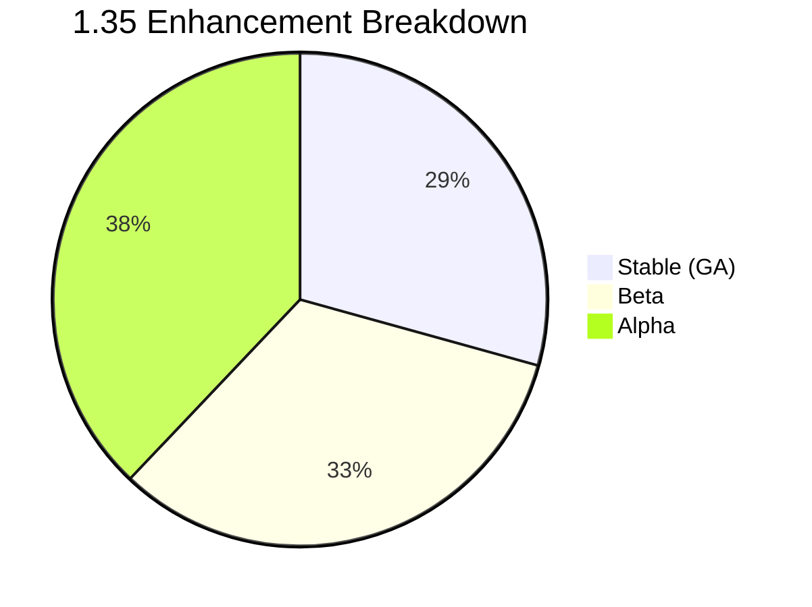
```mermaid
pie title 1.35 Enhancement Breakdown
    "Stable (GA)" : 17
    "Beta" : 19
    "Alpha" : 22
```

#### 关键毕业功能（GA）

**In-Place Pod Vertical Scaling (GA)**

期待已久的 in-place pod resize 毕业。现在 Pods 可以在不重启的情况下调整大小（CPU 和 memory），并具备完整稳定性保证。

| 版本 | 状态 | 关键变化 |
|---------|--------|-------------|
| 1.27 | Alpha | 初始实现，仅 CPU resize |
| 1.33 | Beta | Memory resize、resize policies、默认启用 |
| 1.35 | **GA** | 完全稳定、扩展 status、生产就绪 |

```yaml
# Production-ready in-place scaling with VPA integration
apiVersion: autoscaling.k8s.io/v1
kind: VerticalPodAutoscaler
metadata:
  name: app-vpa
spec:
  targetRef:
    apiVersion: apps/v1
    kind: Deployment
    name: web-app
  updatePolicy:
    updateMode: "InPlace"           # Use in-place resize (requires 1.35+)
  resourcePolicy:
    containerPolicies:
      - containerName: app
        minAllowed:
          cpu: 100m
          memory: 128Mi
        maxAllowed:
          cpu: "4"
          memory: 4Gi
        controlledResources:
          - cpu
          - memory
```

```yaml
# Resize policy controlling restart behavior
apiVersion: v1
kind: Pod
metadata:
  name: production-app
spec:
  containers:
    - name: app
      image: myapp:latest
      resources:
        requests:
          cpu: "1"
          memory: 1Gi
        limits:
          cpu: "2"
          memory: 2Gi
      resizePolicy:
        - resourceName: cpu
          restartPolicy: NotRequired       # CPU: resize in-place
        - resourceName: memory
          restartPolicy: NotRequired       # Memory: also in-place (GA!)
```

```bash
# Resize workflow
kubectl patch pod production-app --subresource resize --patch '{
  "spec": {
    "containers": [{
      "name": "app",
      "resources": {
        "requests": {"cpu": "2", "memory": "2Gi"},
        "limits": {"cpu": "4", "memory": "4Gi"}
      }
    }]
  }
}'

# Monitor resize progress
kubectl get pod production-app -o json | jq '{
  resize: .status.resize,
  allocated: .status.containerStatuses[0].allocatedResources,
  requested: .spec.containers[0].resources.requests
}'
```

> **对 EKS 用户的影响**: In-place pod resize 消除了为调整资源而重启 pods 的需要。这对以下场景具有变革性：
> - **Stateful workloads**（databases、caches），重启成本高
> - **Long-running batch jobs**，需要在执行过程中获得更多资源
> - **VPA adoption**，此前需要 pod 重启
> - **Cost optimization**，无需中断即可 right-size

**1.35 中其他 GA 功能**:
- `CRDValidationRatcheting` -- 渐进式 CRD validation
- `DeviceHealthConditions` -- DRA device health reporting
- `PodLifecycleSleepActionGracePeriod` -- sleep actions 的可配置 grace period
- `ContextualLogging` -- 完全毕业的 structured logging

#### 关键 Beta 功能

**KYAML（Beta，默认启用）**

KYAML 达到 beta 并默认启用，这意味着提交到 API server 的所有 YAML 都会根据更安全的子集进行 validation。无效 YAML patterns 会产生 warnings（beta 阶段不会拒绝）。

```bash
# With KYAML enabled, these warnings appear on apply:
$ kubectl apply -f deployment.yaml
Warning: KYAML: line 15: implicit boolean coercion; use "true" instead of "yes"
Warning: KYAML: line 23: YAML anchor detected; anchors are not supported in KYAML
deployment.apps/my-app created
```

**Gang Scheduling（Alpha 向 Beta 推进）**

Gang scheduling 确保一组 pods 以原子方式调度 -- 要么组内所有 pods 都被调度，要么一个都不调度。这对 distributed training 和 tightly-coupled HPC workloads 至关重要。

```yaml
# PodGroup for gang scheduling
apiVersion: scheduling.k8s.io/v1alpha1
kind: PodGroup
metadata:
  name: distributed-training
  namespace: ml-team
spec:
  minMember: 4                    # All 4 pods must be schedulable
  scheduleTimeoutSeconds: 300     # Timeout if group can't be scheduled
---
apiVersion: batch/v1
kind: Job
metadata:
  name: pytorch-distributed
  namespace: ml-team
spec:
  completions: 4
  parallelism: 4
  template:
    metadata:
      labels:
        pod-group.scheduling.k8s.io/name: distributed-training
    spec:
      schedulerName: default-scheduler
      containers:
        - name: trainer
          image: pytorch-dist:latest
          resources:
            limits:
              nvidia.com/gpu: 8
```

**1.35 中其他 Beta 功能**:
- `AnonymousAuthConfigurableEndpoints` -- 按 endpoint 配置 anonymous access
- `InPlacePodVerticalScalingAllocatedStatus` -- 详细的 resize status reporting
- `SELinuxMount` 改进
- `NodeInclusionPolicyInPodTopologySpread` -- topology spread 的 node inclusion control

#### 关键 Alpha 功能

- **PodLevelInPlaceScaling** -- 在 pod 级别（聚合）resize，而不仅是 container 级别
- **LeaderMigration** -- 迁移 controller-manager leader election
- **SchedulerQueueingHints** 改进
- **RecoverVolumeExpansionFailure** -- 从 volume expansion 失败中恢复

---

### 4.8 Kubernetes 1.36 "ハル (Haru)" (April 2026)

**主题**: 以日语中表示“春天”的词（ハル/Haru）命名，象征新的开始与成长。

**发布统计**: 68 项增强 -- 18 项 Stable、25 项 Beta、25 项 Alpha。主要主题包括安全加固、AI/ML workload 支持和 API extensibility。EKS 在包括 GovCloud (US) 在内的所有可用区域支持 1.36。

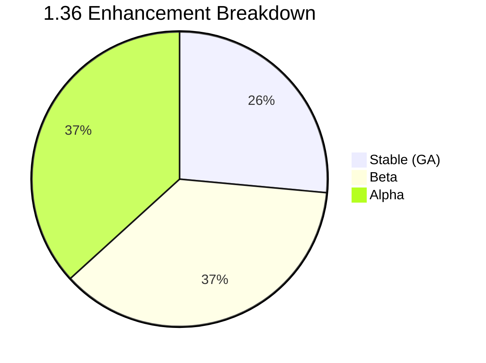
```mermaid
pie title 1.36 Enhancement Breakdown
    "Stable (GA)" : 18
    "Beta" : 25
    "Alpha" : 25
```

**关键功能概览**:

| 功能 | 阶段 | 核心价值 |
|---------|-------|-----------|
| Mutating Admission Policies | **GA** | 消除 webhook servers -- 运维简单、性能更好、可用性更高 |
| In-Place Pod Vertical Scaling | **Enhanced** | 零停机资源调整 -- 成本效率、SLA 保护 |
| User Namespaces | **GA** | Container root ≠ node root -- 权限隔离 |
| Fine-Grained Kubelet API Authorization | **GA** | 最小权限 kubelet API access |
| Legacy ServiceAccount Token Cleanup | **GA** | 自动清理未使用 tokens -- 降低攻击面 |
| Resource Health Status (DRA) | Improved | GPU device health -- 更快识别故障根因 |

#### 关键毕业功能（GA）

**Mutating Admission Policies (GA)**

Mutating Admission Policies（MAP）为原生 Kubernetes objects 带来基于 CEL 的 mutation，消除了对外部 webhook servers 的需求。通过 MAP，mutation 逻辑使用 `MutatingAdmissionPolicy` 和 `MutatingAdmissionPolicyBinding` resources 以声明方式定义，并由 API server 在进程内评估。

关键特征：

- **进程内 API server 评估**: 无 webhook 网络往返、无外部 server 延迟。Mutation 在 API server 进程内部执行。
- **运维简单**: 无 certificate management、无 high-availability deployment、无 webhook servers 的扩展顾虑。API server 处理所有事项。
- **保证幂等**: CEL expressions 产生确定性结果，消除顺序和重新调用的边界情况。
- **限制**: 需要外部数据查询的 mutations（例如咨询 OPA server 或 image registry）仍然需要传统 webhooks。MAP 适用于自包含、策略驱动的 mutations。

> **影响**: Admission control 的 webhook servers 一直是 Kubernetes clusters 中的单点故障。配置错误或不可用的 webhook 可能阻塞整个 cluster 中所有 pod 创建。MAP 为大多数 mutation 用例消除了这一类运维风险。

下面的示例演示一个 `MutatingAdmissionPolicy`，它会向标注为启用 in-place resize 的 pods 自动注入 `resizePolicy`。这是一个将 MAP（1.36 中 GA）与 In-Place Pod Vertical Scaling（1.35 中 GA）结合的实用模式：

```yaml
apiVersion: admissionregistration.k8s.io/v1
kind: MutatingAdmissionPolicy
metadata:
  name: inject-resizepolicy
spec:
  failurePolicy: Fail
  reinvocationPolicy: Never
  matchConstraints:
    resourceRules:
      - apiGroups: [""]
        apiVersions: ["v1"]
        operations: ["CREATE"]
        resources: ["pods"]
  matchConditions:
    - name: only-resize-enabled
      expression: >-
        has(object.metadata.annotations) &&
        ("resize.example.com/enabled" in object.metadata.annotations) &&
        object.metadata.annotations["resize.example.com/enabled"] == "true"
  mutations:
    - patchType: JSONPatch
      jsonPatch:
        expression: >-
          object.spec.containers.map(c, JSONPatch{
            op: "add",
            path: "/spec/containers/" + string(object.spec.containers.indexOf(c)) + "/resizePolicy",
            value: [
              {"resourceName": "cpu",    "restartPolicy": "NotRequired"},
              {"resourceName": "memory", "restartPolicy": "RestartContainer"}
            ]
          })
---
apiVersion: admissionregistration.k8s.io/v1
kind: MutatingAdmissionPolicyBinding
metadata:
  name: inject-resizepolicy-binding
spec:
  policyName: inject-resizepolicy
  matchResources:
    namespaceSelector:
      matchLabels:
        map-demo: "true"
```

> **安全注意事项**: MAP `matchConstraints` 默认是 cluster-wide。务必在 binding 中使用 `namespaceSelector` 限定 mutation 范围，以防止对整个 cluster 产生非预期修改。

> **技术说明**: `resizePolicy` 在 Kubernetes API schema 中定义为 atomic list。这意味着你必须使用 `JSONPatch`（如上所示）。尝试使用 `ApplyConfiguration` 会失败，并显示 `"may not mutate atomic arrays"`。

**In-Place Pod Vertical Scaling 增强**

在 1.35 中 per-container in-place resize 毕业到 GA 的基础上，Kubernetes 1.36 增加了多项增强：

- **Pod-level shared budget resize**: Pod-level resources 现在可以在不重启 pod 的情况下 resize，从而允许跨 pod 中所有 containers 调整 aggregate resources。
- **CPUManager checkpoint tracking**: CPUManager 现在在 live resize operations 期间跟踪 checkpoint state，为性能敏感 workloads 维持 NUMA alignment。
- **CPU resize (NotRequired)**: 带 `restartPolicy: NotRequired` 的 CPU 更改通过 cgroup updates 应用，实现零停机 -- 无 container 重启、无连接中断。
- **Memory shrink behavior**: Memory shrink operations 可能会根据 resize 时的实际 memory usage 触发 `RestartContainer`。在生产环境启用 memory resize 前，必须针对每个 workload 进行验证。

**User Namespaces（Feature Gate Removed）**

User Namespaces 已达到完整生产就绪状态，并在 1.36 中移除了 feature gate。Container UID 0（container 内的 root）会映射到非特权 host UID，从而在不需要任何应用变更的情况下提供权限隔离。

随着 gate 移除，user namespaces 在所有运行 1.36 的 clusters 上可用，无需任何 feature gate 配置。这消除了为实现 container-to-host 权限隔离而依赖第三方解决方案的需要。

**KYAML (GA)**

KYAML 已达到 GA，使更安全的 YAML 子集成为所有 Kubernetes manifests 的标准。KYAML validation 现在默认拒绝（不只是 warning）危险 YAML patterns。

| YAML 功能 | KYAML 中允许？ | 原因 |
|-------------|-------------------|--------|
| Anchors & Aliases | 否 | 注入风险、混淆 |
| Merge Keys (`<<`) | 否 | 行为不可预测 |
| Implicit booleans (`yes`/`no`) | 否 | 类型强制转换 bug |
| Non-string map keys | 否 | 歧义 |
| Duplicate keys | 否 | 静默覆盖 |
| Comments | 是 | 文档必需 |
| Multi-line strings (`|`, `>`) | 是 | 常见需求 |
| Flow sequences/mappings | 是 | 标准 YAML 用法 |

```bash
# KYAML is now enforced by default
$ kubectl apply -f bad-manifest.yaml
Error from server: error parsing bad-manifest.yaml: KYAML validation failed:
  line 5: YAML anchors are not permitted
  line 12: implicit boolean value "yes" is not permitted; use "true" or "false"
```

**Gang Scheduling (GA)**

Atomic pod group scheduling 毕业到 GA。

```yaml
# GA-level gang scheduling
apiVersion: scheduling.k8s.io/v1
kind: PodGroup
metadata:
  name: mpi-job
spec:
  minMember: 8
  scheduleTimeoutSeconds: 600
  priorityClassName: high-priority
```

**1.36 中其他 GA 功能**:
- `AnonymousAuthConfigurableEndpoints` -- per-endpoint anonymous auth control
- `SELinuxMount` -- volumes 的 SELinux label management
- `NodeInclusionPolicyInPodTopologySpread` -- topology spread node inclusion
- `RecoverVolumeExpansionFailure` -- 从 failed expansions 自动恢复
- `FineGrainedKubeletAPIAuthorization` -- 最小权限 kubelet API access，限制哪些 nodes 可以访问哪些 kubelet endpoints
- `LegacyServiceAccountTokenCleanUp` -- 自动清理未使用的基于 Secret 的 ServiceAccount tokens，降低长期凭证带来的攻击面

#### Phase-Aware Resource Management Pattern

本节展示一种实用模式，将 In-Place Pod Vertical Scaling（1.35 中 GA）与 Mutating Admission Policies（1.36 中 GA）结合，实现 phase-aware resource management -- 根据 application lifecycle phase 自动调整 container resources。

**问题定义**

许多容器化 workloads 有不同的 lifecycle phases，需要不同的资源配置：

- **Startup (warmup) phase**: JVM JIT compilation、LLM model loading、index/cache prefill 需要较高 CPU
- **Steady-state (serving) phase**: 正常请求处理只需要较低 CPU

在 Kubernetes 中，这两个阶段都会显示 container 为 `Running`。当应用从 warmup 转为 serving 时，没有原生机制自动切换资源。常见变通方案 -- 为 startup phase 过度预置 -- 会在持续时间更长的 steady-state phase 浪费资源。

目标 workloads 包括具有 JIT warmup 的 JVM applications、将 models 加载进 memory 的 ML inference servers，以及启动时构建 caches 或 indexes 的 services。

**流程**:

```
Pod Create (startup: large CPU, req==limit -> Guaranteed QoS)
  -> Controller watches pod.status.containerStatuses[].started
  -> started:true detected (= startup probe passed)
  -> Resize via pods/resize subresource to steady-state CPU (zero-downtime)
```

**关键洞察 -- QoS 保持**

QoS class 在 Pod 创建时确定，并且不会因 resize 而改变（KEP-1287）。通过在 startup 和 steady-state phases 都设置 `requests == limits`，pod 在整个生命周期中保持 `Guaranteed` QoS。Memory 保持固定（避免重启风险）；只有 CPU 变化。

**基于 Annotation 的方法（无需 CRD）**

该模式不定义 Custom Resource，而是在现有 workloads 上使用 annotations。一个轻量级 controller watch pods，并基于 annotations 执行动作：

```yaml
apiVersion: apps/v1
kind: Deployment
metadata:
  name: phase-aware-app
spec:
  replicas: 2
  selector:
    matchLabels:
      app: phase-aware-app
  template:
    metadata:
      annotations:
        resize.example.com/enabled:          "true"
        resize.example.com/trigger:          "StartupProbePassed"
        resize.example.com/steady-resources: |
          {"app":{"requests":{"cpu":"50m"},"limits":{"cpu":"50m"}}}
      labels:
        app: phase-aware-app
    spec:
      containers:
        - name: app
          image: myapp:latest
          resizePolicy:
            - resourceName: cpu
              restartPolicy: NotRequired
            - resourceName: memory
              restartPolicy: RestartContainer
          resources:
            requests:
              cpu: "200m"
              memory: 64Mi
            limits:
              cpu: "200m"
              memory: 64Mi
          startupProbe:
            httpGet:
              path: /healthz
              port: 8080
            initialDelaySeconds: 5
            periodSeconds: 3
            failureThreshold: 30
```

**Controller Implementation (Go)**

下面的 controller 会 watch 带 annotation 的 pods，并在 startup probe 通过时将其 patch 到 steady-state resources。它对 Deployments、StatefulSets、DaemonSets 和 Argo Rollouts 的工作方式完全相同，因为它只 watch Pods -- 不需要按 workload 类型分支。

```go
// pod-resizer — annotation-based zero-downtime in-place downscale controller.
// Watches Pods only — works identically for Deployment/StatefulSet/DaemonSet/Rollout.
// On startup probe pass, patches to steady resources via pods/resize subresource.
// Maintains req==limit on both phases to preserve Guaranteed QoS (KEP-1287).
package main

import (
	"context"
	"encoding/json"
	"fmt"
	"log"
	"strconv"
	"sync"
	"time"

	corev1 "k8s.io/api/core/v1"
	metav1 "k8s.io/apimachinery/pkg/apis/meta/v1"
	"k8s.io/apimachinery/pkg/types"
	"k8s.io/client-go/informers"
	"k8s.io/client-go/kubernetes"
	"k8s.io/client-go/rest"
	"k8s.io/client-go/tools/cache"
)

const (
	annEnabled = "resize.example.com/enabled"
	annTrigger = "resize.example.com/trigger"
	annDelay   = "resize.example.com/delay-seconds"
	annSteady  = "resize.example.com/steady-resources"
	annResized = "resize.example.com/resized"
)

type resVals struct {
	Requests map[string]string `json:"requests,omitempty"`
	Limits   map[string]string `json:"limits,omitempty"`
}

var clientset *kubernetes.Clientset
var processed sync.Map

func main() {
	cfg, err := rest.InClusterConfig()
	if err != nil {
		log.Fatalf("in-cluster config: %v", err)
	}
	clientset, err = kubernetes.NewForConfig(cfg)
	if err != nil {
		log.Fatalf("clientset: %v", err)
	}

	factory := informers.NewSharedInformerFactory(clientset, 15*time.Second)
	podInformer := factory.Core().V1().Pods().Informer()
	podInformer.AddEventHandler(cache.ResourceEventHandlerFuncs{
		AddFunc:    func(obj interface{}) { handle(obj) },
		UpdateFunc: func(_, obj interface{}) { handle(obj) },
	})

	stop := make(chan struct{})
	defer close(stop)
	log.Printf("pod-resizer starting; watching pods annotated %s=true", annEnabled)
	factory.Start(stop)
	factory.WaitForCacheSync(stop)
	log.Printf("informer cache synced; ready")
	select {}
}

func handle(obj interface{}) {
	pod, ok := obj.(*corev1.Pod)
	if !ok {
		return
	}
	a := pod.Annotations
	if a == nil || a[annEnabled] != "true" || a[annResized] == "true" {
		return
	}
	if pod.DeletionTimestamp != nil || pod.Status.Phase != corev1.PodRunning {
		return
	}

	trigger := a[annTrigger]
	if trigger == "" {
		trigger = "StartupProbePassed"
	}
	if !triggerMet(pod, trigger, a[annDelay]) {
		return
	}

	steady := map[string]resVals{}
	if err := json.Unmarshal([]byte(a[annSteady]), &steady); err != nil {
		log.Printf("ERROR %s/%s: bad %s: %v", pod.Namespace, pod.Name, annSteady, err)
		return
	}
	patch := buildResizePatch(steady)
	if patch == nil {
		return
	}
	pb, _ := json.Marshal(patch)

	key := string(pod.UID)
	if _, loaded := processed.LoadOrStore(key, true); loaded {
		return
	}

	if _, err := clientset.CoreV1().Pods(pod.Namespace).Patch(
		context.TODO(), pod.Name, types.StrategicMergePatchType, pb,
		metav1.PatchOptions{}, "resize"); err != nil {
		processed.Delete(key)
		log.Printf("ERROR %s/%s: resize patch failed: %v", pod.Namespace, pod.Name, err)
		return
	}
	log.Printf("RESIZED %s/%s [%s] trigger=%s patch=%s",
		pod.Namespace, pod.Name, ownerKind(pod), trigger, string(pb))

	mark := []byte(fmt.Sprintf(`{"metadata":{"annotations":{%q:"true"}}}`, annResized))
	if _, err := clientset.CoreV1().Pods(pod.Namespace).Patch(
		context.TODO(), pod.Name, types.MergePatchType, mark, metav1.PatchOptions{}); err != nil {
		log.Printf("WARN %s/%s: marker patch failed: %v", pod.Namespace, pod.Name, err)
	}
}

func triggerMet(pod *corev1.Pod, trigger, delayStr string) bool {
	switch trigger {
	case "Ready":
		for _, c := range pod.Status.Conditions {
			if c.Type == corev1.PodReady {
				return c.Status == corev1.ConditionTrue
			}
		}
		return false
	case "Delay":
		delay, _ := strconv.Atoi(delayStr)
		for _, cs := range pod.Status.ContainerStatuses {
			if cs.State.Running != nil {
				return time.Since(cs.State.Running.StartedAt.Time) >= time.Duration(delay)*time.Second
			}
		}
		return false
	default:
		if len(pod.Status.ContainerStatuses) == 0 {
			return false
		}
		for _, cs := range pod.Status.ContainerStatuses {
			if cs.Started == nil || !*cs.Started {
				return false
			}
		}
		return true
	}
}

func buildResizePatch(steady map[string]resVals) map[string]interface{} {
	var containers []map[string]interface{}
	for name, rv := range steady {
		res := map[string]interface{}{}
		if len(rv.Requests) > 0 {
			res["requests"] = rv.Requests
		}
		if len(rv.Limits) > 0 {
			res["limits"] = rv.Limits
		}
		containers = append(containers, map[string]interface{}{"name": name, "resources": res})
	}
	if len(containers) == 0 {
		return nil
	}
	return map[string]interface{}{"spec": map[string]interface{}{"containers": containers}}
}

func ownerKind(pod *corev1.Pod) string {
	if len(pod.OwnerReferences) > 0 {
		return pod.OwnerReferences[0].Kind
	}
	return "Pod"
}
```
**Controller RBAC**

该 controller 需要访问 `pods/resize` subresource 以执行 patching，并需要标准的 pod watch/list 权限：

```yaml
apiVersion: v1
kind: ServiceAccount
metadata:
  name: pod-resizer
  namespace: pod-resizer-system
---
apiVersion: rbac.authorization.k8s.io/v1
kind: ClusterRole
metadata:
  name: pod-resizer
rules:
  - apiGroups: [""]
    resources: ["pods"]
    verbs: ["get", "list", "watch", "patch"]
  - apiGroups: [""]
    resources: ["pods/resize"]          # Required for resize subresource
    verbs: ["patch"]
---
apiVersion: rbac.authorization.k8s.io/v1
kind: ClusterRoleBinding
metadata:
  name: pod-resizer
subjects:
  - kind: ServiceAccount
    name: pod-resizer
    namespace: pod-resizer-system
roleRef:
  apiGroup: rbac.authorization.k8s.io
  kind: ClusterRole
  name: pod-resizer
```

**Demo Workload**

用于测试 phase-aware resize pattern 的最小 workload：

```yaml
apiVersion: v1
kind: Namespace
metadata:
  name: resize-demo
  labels:
    map-demo: "true"        # Enables MAP resizePolicy injection
---
apiVersion: apps/v1
kind: Deployment
metadata:
  name: busybox-resize-demo
  namespace: resize-demo
spec:
  replicas: 2
  selector:
    matchLabels:
      app: busybox-resize-demo
  template:
    metadata:
      labels:
        app: busybox-resize-demo
      annotations:
        resize.example.com/enabled:          "true"
        resize.example.com/trigger:          "StartupProbePassed"
        resize.example.com/steady-resources: |
          {"busybox":{"requests":{"cpu":"50m"},"limits":{"cpu":"50m"}}}
    spec:
      containers:
        - name: busybox
          image: busybox:1.36
          command: ["sh", "-c", "echo 'starting warmup'; sleep 10; echo 'ready'; while true; do sleep 3600; done"]
          resources:
            requests:
              cpu: "200m"
              memory: 64Mi
            limits:
              cpu: "200m"
              memory: 64Mi
          startupProbe:
            exec:
              command: ["sh", "-c", "test -f /tmp/ready || (sleep 8 && touch /tmp/ready)"]
            initialDelaySeconds: 2
            periodSeconds: 3
            failureThreshold: 10
```

**Argo Rollouts 兼容性**

该 controller 无需修改即可与 Argo Rollouts 配合使用。Ownership chain 是 Rollout -> ReplicaSet -> Pod，结构上与 Deployment -> ReplicaSet -> Pod 相同。由于 controller 只 watch Pods，并且不会针对特定类型逻辑检查 owner references，因此任何创建带适当 annotations 的 pods 的 workload controller 都受支持。

**测试结果（EKS 1.36.1）**

在 EKS v1.36.1、containerd 2.2.3、Amazon Linux 2023（cgroup v2、arm64/Graviton）上测试。

Controller log output:

```
2026/06/28 09:12:03 pod-resizer starting; watching pods annotated resize.example.com/enabled=true
2026/06/28 09:12:03 informer cache synced; ready
2026/06/28 09:12:41 RESIZED resize-demo/busybox-resize-demo-7f8b9c6d4-k2xnm [ReplicaSet] trigger=StartupProbePassed patch={"spec":{"containers":[{"name":"busybox","resources":{"limits":{"cpu":"50m"},"requests":{"cpu":"50m"}}}]}}
2026/06/28 09:12:41 RESIZED resize-demo/busybox-resize-demo-7f8b9c6d4-p9wvj [ReplicaSet] trigger=StartupProbePassed patch={"spec":{"containers":[{"name":"busybox","resources":{"limits":{"cpu":"50m"},"requests":{"cpu":"50m"}}}]}}
2026/06/28 09:13:05 RESIZED resize-demo/busybox-resize-ds-xq7zt [DaemonSet] trigger=StartupProbePassed patch={"spec":{"containers":[{"name":"busybox","resources":{"limits":{"cpu":"50m"},"requests":{"cpu":"50m"}}}]}}
2026/06/28 09:13:22 RESIZED resize-demo/busybox-resize-sts-0 [StatefulSet] trigger=StartupProbePassed patch={"spec":{"containers":[{"name":"busybox","resources":{"limits":{"cpu":"50m"},"requests":{"cpu":"50m"}}}]}}
```

In-place resize 验证：

| Workload | QoS | CPU (req/lim) | restartCount | containerID |
|----------|-----|---------------|--------------|-------------|
| Deployment (x2) | Guaranteed -> **Guaranteed** | 200m -> **50m** | 0 -> **0** | **相同** |
| DaemonSet | Guaranteed -> **Guaranteed** | 200m -> **50m** | 0 -> **0** | **相同** |
| StatefulSet | Guaranteed -> **Guaranteed** | 200m -> **50m** | 0 -> **0** | **相同** |

> **关键证据**: resize 前后 `restartCount=0` 且 `containerID` 相同，确认了真正的 in-place cgroup CPU reallocation。没有 container 被重新创建。QoS class 在整个 resize 过程中保持为 `Guaranteed`。

**MAP Injection 测试结果**

验证 `MutatingAdmissionPolicy` 是否基于 annotation 存在正确注入 `resizePolicy`：

| Case | Annotation Present | Injected resizePolicy | Verdict |
|------|-------------------|----------------------|---------|
| with-annotation | Yes | `[{cpu:NotRequired},{memory:RestartContainer}]` | 已注入（无需 webhook） |
| without-annotation | No | `[]`（无） | 未注入（matchCondition 生效） |

**基于 Annotation 方法的优势**

| 方面 | 收益 |
|--------|---------|
| 运维开销 | 无 CRD/CR -- 只需向现有 workloads 添加 annotations |
| Workload 通用性 | Controller 只 watch Pods -- 对 Deployment/StatefulSet/DaemonSet/Rollout 行为相同 |
| 代码复杂度 | 无类型分支、子对象创建或 owner-reference handling |
| 现有 workloads | 通过 annotation patch 应用（无需重写 manifest） |
| resizePolicy 自动化 | MAP (GA) 在 pod 创建时自动注入 -- 无需 webhooks 即可完全自动化 |

**注意事项**

- CPU-only 零停机 resize 是安全且已验证的。Memory shrink 可能会根据实际使用情况触发 container restart -- 启用前需按 workload 验证。
- `kubectl` 1.32 或更高版本才支持 `--subresource resize`（仅调试用；controller 使用 client-go，原生处理 subresources）。
- 与 HPA 和 CPUManager static NUMA alignment policy 的交互需要按 workload 验证。并发的 HPA scaling 和 in-place resize 可能产生冲突的 resource targets。
- 对于生产部署，请向 controller 添加 leader election，以支持多副本高可用。

#### 升级检查清单

- **Ingress-NGINX 已退役（2026-03-24）**: 安全补丁已停止。迁移到兼容 Gateway API 的 controller（例如 Envoy Gateway、Istio Gateway、Cilium Gateway API）。
- **IPVS mode / externalIPs service audit**: 审查使用 IPVS mode 或 `externalIPs` 的 services，确认与 1.36 networking changes 的兼容性。升级前建议审计。
- **EKS Cluster Insights**: 在启动升级前运行 EKS Cluster Insights，以识别已弃用 API 使用、不兼容 add-on versions 和其他兼容性问题。

#### 关键 Beta 功能

**Pod-Level In-Place Scaling（Beta）**

在 1.35 中 per-container in-place resize GA 的基础上，pod-level in-place scaling 允许在 pod 级别设置 aggregate resource limits 并对其 resize。

```yaml
apiVersion: v1
kind: Pod
metadata:
  name: multi-container-app
spec:
  resources:                          # Pod-level resource limits
    limits:
      cpu: "4"
      memory: 8Gi
    requests:
      cpu: "2"
      memory: 4Gi
  containers:
    - name: app
      image: myapp:latest
      resources:
        requests:
          cpu: "1"
          memory: 2Gi
    - name: sidecar
      image: sidecar:latest
      resources:
        requests:
          cpu: 500m
          memory: 512Mi
    # Remaining resources available for burst
```

**Improved DRA Partitioning**

用于 GPUs 等 devices 的 DRA partitioning 达到 beta，允许细粒度 resource sharing。

```yaml
# Request a GPU partition (MIG-like)
apiVersion: resource.k8s.io/v1
kind: ResourceClaim
metadata:
  name: gpu-partition
spec:
  devices:
    requests:
      - name: gpu-slice
        deviceClassName: gpu-partition
        selectors:
          - cel:
              expression: >-
                device.capacity["gpu.nvidia.com"].memory.compareTo(quantity("10Gi")) >= 0
```

#### 关键 Alpha 功能

- **MultipleSCTPAssociations** -- 每个 pod 多个 SCTP associations
- **SchedulerFIFO** -- FIFO scheduling queue option
- **CPUManagerPolicyAlpha** 增强

---
## 5. 关键功能毕业时间线

下表提供主要功能毕业的跨版本综合视图。用它来理解你计划采用的功能的完整生命周期。

### Core Features

| Feature | KEP | Alpha | Beta | GA | Description |
|---------|-----|-------|------|-----|-------------|
| Sidecar Containers | KEP-753 | 1.28 | 1.29/1.31 | **1.33** | 通过带 `restartPolicy: Always` 的 init containers 提供原生 sidecar 支持 |
| In-Place Pod Vertical Scaling | KEP-1287 | 1.27 | 1.33 | **1.35** | 无需重启即可 resize pod CPU/memory |
| Pod Scheduling Readiness | KEP-3521 | 1.26 | 1.27 | **1.30** | 用 scheduling gates 延迟 pod scheduling |
| Job Success Policy | KEP-3998 | 1.28 | 1.31 | **1.33** | Jobs 的自定义成功条件 |
| Pod-Level Resources | KEP-2837 | 1.32 | 1.33 | **1.34** | Pod 级别的 aggregate resource limits |

### Security Features

| Feature | KEP | Alpha | Beta | GA | Description |
|---------|-----|-------|------|-----|-------------|
| ValidatingAdmissionPolicy (CEL) | KEP-3488 | 1.26 | 1.28 | **1.30** | 使用 CEL 的原生 admission control |
| MutatingAdmissionPolicy (CEL) | KEP-3962 | 1.33 | 1.34/1.35 | **1.36** | 使用 CEL 的原生 mutation |
| StructuredAuthorizationConfiguration | KEP-3221 | 1.29 | 1.30 | **1.32** | 有序 authorization chain 配置 |
| AppArmor GA | KEP-24 | 1.4 | 1.28 | **1.31** | 原生 AppArmor profile API field |
| User Namespaces | KEP-127 | 1.25 | 1.30/1.33 | **1.34** | 用于安全隔离的 UID/GID remapping |
| KYAML | KEP-4222 | 1.33 | 1.34/1.35 | **1.36** | Kubernetes manifests 的更安全 YAML 子集 |

### Networking Features

| Feature | KEP | Alpha | Beta | GA | Description |
|---------|-----|-------|------|-----|-------------|
| Gateway API (CRD) | KEP-1897 | 1.18 | 1.22 | **1.26+** | 下一代 Ingress API（基于 CRD，与版本无关） |
| ServiceCIDR / IPAddress API | KEP-1880 | 1.27 | 1.31 | **1.33** | 动态 Service IP range management |
| Topology Aware Routing | KEP-2433 | 1.21 | 1.23 | **1.33** | 区域感知 traffic routing |
| nftables kube-proxy | KEP-3866 | 1.29 | 1.31 | **1.34** | 基于 nftables 的 Service routing |
| Traffic Distribution | KEP-4444 | 1.30 | 1.31 | **1.34** | Service traffic distribution preferences |

### Storage Features

| Feature | KEP | Alpha | Beta | GA | Description |
|---------|-----|-------|------|-----|-------------|
| ReadWriteOncePod | KEP-2485 | 1.22 | 1.27 | **1.29** | 单 pod RW access mode |
| VolumeAttributesClass | KEP-3751 | 1.29 | 1.31 | **1.34** | 可变 volume attributes（IOPS、throughput） |
| PV Last Phase Transition | KEP-3762 | 1.28 | 1.29 | **1.31** | PV phase changes 的 timestamp tracking |
| RecoverVolumeExpansionFailure | KEP-1790 | 1.23 | 1.35 | **1.36** | 从 volume expansion 失败中恢复 |

### Scheduling Features

| Feature | KEP | Alpha | Beta | GA | Description |
|---------|-----|-------|------|-----|-------------|
| Gang Scheduling | KEP-4818 | 1.35 | 1.35 | **1.36** | 分布式 workloads 的 atomic group scheduling |
| Pod Scheduling Readiness | KEP-3521 | 1.26 | 1.27 | **1.30** | 用于 deferred scheduling 的 scheduling gates |
| MinDomainsInPodTopologySpread | KEP-3022 | 1.24 | 1.25 | **1.30** | topology spread 的 minimum domain count |

### Resource Management Features

| Feature | KEP | Alpha | Beta | GA | Description |
|---------|-----|-------|------|-----|-------------|
| DRA Core APIs | KEP-3063 | 1.26 | 1.31 | **1.34** | Accelerators 的 Dynamic Resource Allocation |
| HPA Container Metrics | KEP-2273 | 1.20 | 1.27 | **1.30** | Per-container HPA metrics |
| OCI Images as Volumes | KEP-4639 | 1.31 | 1.33 | **1.34** | 将 OCI images 挂载为只读 volumes |

### 综合时间线可视化

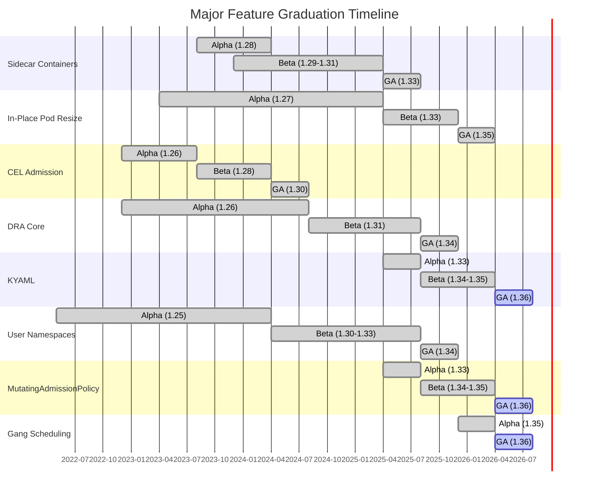
```mermaid
gantt
    title Major Feature Graduation Timeline
    dateFormat  YYYY-MM
    axisFormat  %Y-%m

    section Sidecar Containers
    Alpha (1.28)              :done, s1, 2023-08, 2024-04
    Beta (1.29-1.31)          :done, s2, 2023-12, 2025-04
    GA (1.33)                 :done, s3, 2025-04, 2025-08

    section In-Place Pod Resize
    Alpha (1.27)              :done, r1, 2023-04, 2025-04
    Beta (1.33)               :done, r2, 2025-04, 2025-12
    GA (1.35)                 :done, r3, 2025-12, 2026-04

    section CEL Admission
    Alpha (1.26)              :done, c1, 2022-12, 2023-08
    Beta (1.28)               :done, c2, 2023-08, 2024-04
    GA (1.30)                 :done, c3, 2024-04, 2024-08

    section DRA Core
    Alpha (1.26)              :done, d1, 2022-12, 2024-08
    Beta (1.31)               :done, d2, 2024-08, 2025-08
    GA (1.34)                 :done, d3, 2025-08, 2025-12

    section KYAML
    Alpha (1.33)              :done, k1, 2025-04, 2025-08
    Beta (1.34-1.35)          :done, k2, 2025-08, 2026-04
    GA (1.36)                 :active, k3, 2026-04, 2026-08

    section User Namespaces
    Alpha (1.25)              :done, u1, 2022-05, 2024-04
    Beta (1.30-1.33)          :done, u2, 2024-04, 2025-08
    GA (1.34)                 :done, u3, 2025-08, 2025-12

    section MutatingAdmissionPolicy
    Alpha (1.33)              :done, m1, 2025-04, 2025-08
    Beta (1.34-1.35)          :done, m2, 2025-08, 2026-04
    GA (1.36)                 :active, m3, 2026-04, 2026-08

    section Gang Scheduling
    Alpha (1.35)              :done, g1, 2025-12, 2026-04
    GA (1.36)                 :active, g2, 2026-04, 2026-08
```

---

## 6. 弃用和移除

理解弃用和移除对于升级规划至关重要。弃用意味着某个 API 或功能将在未来版本中移除，让团队有时间迁移。移除则是 API 或功能的实际删除。

### Kubernetes API 弃用策略

- **GA APIs**: 仅在有替代 GA API 可用时弃用。移除前至少 12 个月或 3 个版本。
- **Beta APIs**: 弃用后移除前至少 9 个月或 3 个版本。
- **Alpha APIs**: 可能在任何版本中无通知移除。

### 按版本划分的 API 弃用和移除

#### 1.29 中移除

| API/Feature | Replaced By | Migration Path |
|------------|-------------|----------------|
| `SecurityContextDeny` admission plugin | Pod Security Standards (PSS) | 迁移到 `PodSecurity` admission controller |

#### 1.32 中移除

| API/Feature | Replaced By | Migration Path |
|------------|-------------|----------------|
| `flowcontrol.apiserver.k8s.io/v1beta2` | `flowcontrol.apiserver.k8s.io/v1beta3` -> `v1` | 更新 FlowSchema 和 PriorityLevelConfiguration resources 中的 API version |
| `autoscaling/v2beta1` HPA API | `autoscaling/v2` | 更新所有 HPA manifests，使用 `autoscaling/v2` |

#### 1.34 中移除

| API/Feature | Replaced By | Migration Path |
|------------|-------------|----------------|
| 旧式 `--authorization-mode` flag patterns | StructuredAuthorizationConfiguration | 迁移到结构化 authorization config file |
| `flowcontrol.apiserver.k8s.io/v1beta3` | `flowcontrol.apiserver.k8s.io/v1` | 更新到 stable API version |

#### 已弃用（尚未移除）

| API/Feature | Deprecated In | Expected Removal | Migration Path |
|------------|--------------|-----------------|----------------|
| In-tree cloud provider (AWS, GCP, Azure) | 1.26+ | Ongoing | 迁移到 external cloud controller managers |
| Annotation-based AppArmor profiles | 1.31 | 1.35 | 使用 `securityContext.appArmorProfile` field |
| `batch/v1beta1` CronJob | 1.21 | 1.25 (removed) | 使用 `batch/v1` |
| `policy/v1beta1` PodDisruptionBudget | 1.21 | 1.25 (removed) | 使用 `policy/v1` |
| kube-proxy iptables mode | 1.33 (soft) | TBD | 规划迁移到 nftables 或 IPVS |

### 按版本移除的 Feature Gates

当一个功能达到 GA 时，其 feature gate 通常会在 2 个版本后移除。这意味着你无法禁用 GA 功能。

```bash
# Check for feature gates that reference removed gates
# This would cause kubelet startup failure after upgrade

# Feature gates removed in 1.33:
# - SidecarContainers (GA in 1.33, gate removed in 1.35)
# - ServiceCIDR (GA in 1.33, gate removed in 1.35)

# Feature gates removed in 1.34:
# - UserNamespacesSupport (GA in 1.34, gate removed in 1.36)
# - VolumeAttributesClass (GA in 1.34, gate removed in 1.36)

# If you have explicit feature gate overrides, check them:
kubectl get cm kubelet-config -n kube-system -o yaml | grep featureGates -A 20
```

### 已弃用 API 迁移检查清单

```bash
#!/bin/bash
# deprecation-check.sh - Check for deprecated API usage

echo "=== Kubernetes Deprecation Audit ==="

# Check for deprecated API versions in cluster resources
echo ""
echo "--- Checking for deprecated APIs in running resources ---"

# FlowSchema (v1beta2/v1beta3 deprecated)
echo "FlowSchemas using deprecated API versions:"
kubectl get flowschemas -o json | jq -r '.items[] | select(.apiVersion != "flowcontrol.apiserver.k8s.io/v1") | "\(.metadata.name): \(.apiVersion)"'

# Check for AppArmor annotations (deprecated in 1.31)
echo ""
echo "Pods using deprecated AppArmor annotations:"
kubectl get pods -A -o json | jq -r '.items[] | select(.metadata.annotations // {} | keys[] | test("apparmor.security.beta")) | "\(.metadata.namespace)/\(.metadata.name)"'

# Check for deprecated admission webhooks
echo ""
echo "Admission webhooks using deprecated API versions:"
kubectl get validatingwebhookconfigurations -o json | jq -r '.items[] | select(.apiVersion | test("v1beta1")) | .metadata.name'
kubectl get mutatingwebhookconfigurations -o json | jq -r '.items[] | select(.apiVersion | test("v1beta1")) | .metadata.name'

# Check Helm releases for deprecated APIs
echo ""
echo "Checking Helm releases for deprecated API versions:"
for release in $(helm list -A -q); do
  helm get manifest $release -n $(helm list -A -f "^${release}$" -o json | jq -r '.[0].namespace') 2>/dev/null | \
    grep "apiVersion:" | sort -u | while read line; do
      case "$line" in
        *v1beta1*|*v1beta2*|*v2beta1*)
          echo "  $release: $line (DEPRECATED)"
          ;;
      esac
    done
done

echo ""
echo "=== Audit Complete ==="
```

### API 兼容性矩阵

在升级前，使用此表验证你的 manifests 与目标 Kubernetes 版本兼容。

| Resource | Stable API | Deprecated APIs | Safe Since |
|----------|-----------|-----------------|------------|
| HorizontalPodAutoscaler | `autoscaling/v2` | `v2beta1` (removed 1.26), `v2beta2` (removed 1.26) | 1.23 |
| CronJob | `batch/v1` | `v1beta1` (removed 1.25) | 1.21 |
| PodDisruptionBudget | `policy/v1` | `v1beta1` (removed 1.25) | 1.21 |
| CSIDriver | `storage.k8s.io/v1` | `v1beta1` (removed 1.22) | 1.18 |
| FlowSchema | `flowcontrol.apiserver.k8s.io/v1` | `v1beta2` (removed 1.32), `v1beta3` (removed 1.34) | 1.29 |
| ValidatingAdmissionPolicy | `admissionregistration.k8s.io/v1` | `v1beta1` (deprecated 1.30) | 1.30 |
| ResourceClaim (DRA) | `resource.k8s.io/v1` | `v1alpha3` (removed 1.34), `v1beta1` (removed 1.34) | 1.34 |
| VolumeAttributesClass | `storage.k8s.io/v1` | `v1beta1` (removed 1.36) | 1.34 |

---

## 7. EKS 特定注意事项

### EKS 版本相对 Upstream 的滞后

EKS 发布通常比 upstream Kubernetes 滞后约 2-4 个月。这种滞后带来：

| 收益 | 描述 |
|---------|-------------|
| **稳定性** | AWS 使用 EKS 特定集成验证该版本 |
| **Add-on Compatibility** | Managed add-ons 会经过测试和更新 |
| **AMI Availability** | 优化的 EKS AMIs 会被构建和测试 |
| **Security Patches** | 已知 CVEs 会在发布前处理 |

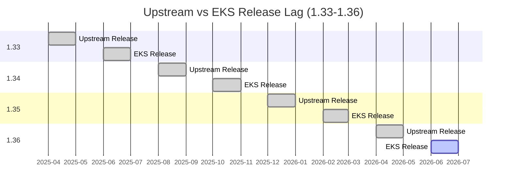
```mermaid
gantt
    title Upstream vs EKS Release Lag (1.33-1.36)
    dateFormat YYYY-MM
    axisFormat %Y-%m

    section 1.33
    Upstream Release    :done, u33, 2025-04, 2025-05
    EKS Release         :done, e33, 2025-06, 2025-07

    section 1.34
    Upstream Release    :done, u34, 2025-08, 2025-09
    EKS Release         :done, e34, 2025-10, 2025-11

    section 1.35
    Upstream Release    :done, u35, 2025-12, 2026-01
    EKS Release         :done, e35, 2026-02, 2026-03

    section 1.36
    Upstream Release    :done, u36, 2026-04, 2026-05
    EKS Release         :active, e36, 2026-06, 2026-07
```

### EKS Feature Gate 可用性

并非所有 upstream Kubernetes feature gates 都可在 EKS 上使用。AWS 控制 control plane 配置，因此：

- **GA features**: 始终启用（与 upstream 相同）
- **Beta features（默认启用）**: 通常在 EKS 上可用
- **Beta features（默认禁用）**: 可能需要提交 EKS support ticket，或不可用
- **Alpha features**: EKS 上不可用（EKS 从不启用 alpha features）

```bash
# Check which feature gates are active on your EKS cluster's nodes
kubectl get --raw "/api/v1/nodes/$(kubectl get nodes -o jsonpath='{.items[0].metadata.name}')/proxy/configz" | \
  jq '.kubeletconfig.featureGates'

# Check API server feature gates via metrics
kubectl get --raw /metrics 2>/dev/null | grep kubernetes_feature_enabled | head -30
```

### EKS Managed Add-on 兼容性矩阵

升级 EKS clusters 时，add-on compatibility 至关重要。每个 Kubernetes 版本都有特定 add-on version 要求。

| Add-on | K8s 1.31 | K8s 1.32 | K8s 1.33 | K8s 1.34 | K8s 1.35 | K8s 1.36 |
|--------|----------|----------|----------|----------|----------|----------|
| **VPC CNI** | v1.18+ | v1.19+ | v1.19+ | v1.20+ | v1.20+ | v1.21+ |
| **CoreDNS** | v1.11.1+ | v1.11.3+ | v1.12.0+ | v1.12.0+ | v1.12.1+ | v1.12.1+ |
| **kube-proxy** | v1.31.x | v1.32.x | v1.33.x | v1.34.x | v1.35.x | v1.36.x |
| **EBS CSI** | v1.35+ | v1.36+ | v1.37+ | v1.38+ | v1.39+ | v1.40+ |
| **EFS CSI** | v2.0+ | v2.1+ | v2.1+ | v2.2+ | v2.2+ | v2.3+ |
| **ADOT** | v0.102+ | v0.104+ | v0.106+ | v0.108+ | v0.110+ | v0.112+ |

> **注意**: 升级前务必检查最新的 [EKS add-on version compatibility](https://docs.aws.amazon.com/eks/latest/userguide/managing-add-ons.html)，因为可能需要特定 patch versions。

```bash
# Check current add-on versions
aws eks describe-addon-versions --kubernetes-version 1.36 \
  --addon-name vpc-cni --query 'addons[].addonVersions[].addonVersion' --output table

# List all installed add-ons and their versions
aws eks list-addons --cluster-name my-cluster --output table
for addon in $(aws eks list-addons --cluster-name my-cluster --query 'addons[]' --output text); do
  version=$(aws eks describe-addon --cluster-name my-cluster --addon-name $addon \
    --query 'addon.addonVersion' --output text)
  echo "$addon: $version"
done
```

### EKS Auto Mode 版本支持

EKS Auto Mode 通过自动管理 node groups 简化 cluster 管理，但它有自己的版本注意事项：

| 功能 | Auto Mode 下的行为 |
|---------|------------------------|
| **Control plane upgrades** | 由 EKS 管理（可通过 API/console 触发） |
| **Node upgrades** | Auto Mode 自动处理 |
| **Version skew** | Auto Mode 在 control plane 和 nodes 之间维持 n-1 skew |
| **Add-on updates** | Core add-ons 自动管理 |
| **Feature gates** | Node-level feature gates 由 Auto Mode 管理 |

```bash
# Check Auto Mode status
aws eks describe-cluster --name my-cluster \
  --query 'cluster.computeConfig' --output json

# Verify Auto Mode node version alignment
kubectl get nodes -o custom-columns=\
NAME:.metadata.name,\
VERSION:.status.nodeInfo.kubeletVersion,\
INSTANCE_TYPE:.metadata.labels.'node\.kubernetes\.io/instance-type'
```

> **重要**: 使用 EKS Auto Mode 时，请确保任何自定义 NodePool configurations 与目标 Kubernetes 版本兼容。Auto Mode NodePools 会在升级期间自动采用新 AMIs，但自定义配置可能需要手动验证。

### Extended Support 成本分析

理解 extended support 的财务影响有助于团队确定升级规划优先级。

```
Cost Comparison: Standard vs Extended Support (per cluster)

Standard Support:  $0.10/hour  x  24 hours  x  365 days  =  $876/year
Extended Support:  $0.60/hour  x  24 hours  x  365 days  =  $5,256/year

Additional cost per cluster in extended support:  $4,380/year
```

| Extended Support 中的 Clusters | 额外年度成本 |
|-----------------------------|----------------------|
| 1 cluster | $4,380 |
| 5 clusters | $21,900 |
| 10 clusters | $43,800 |
| 25 clusters | $109,500 |
| 50 clusters | $219,000 |
| 100 clusters | $438,000 |

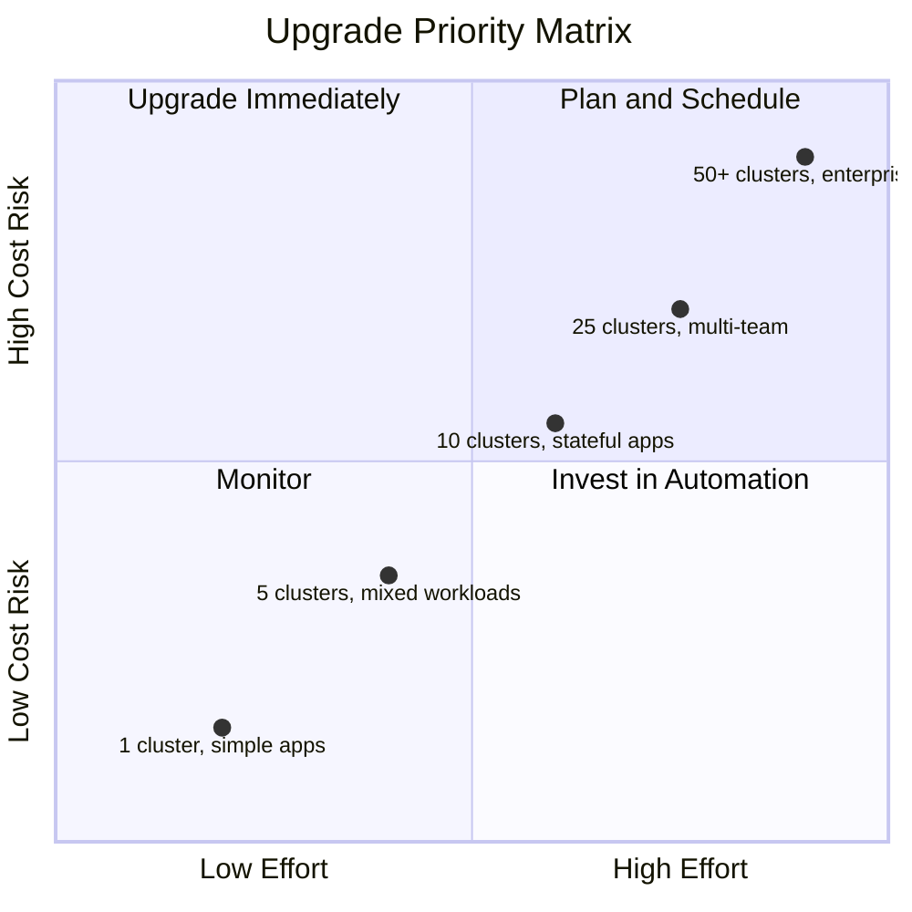
```mermaid
quadrantChart
    title Upgrade Priority Matrix
    x-axis Low Effort --> High Effort
    y-axis Low Cost Risk --> High Cost Risk
    quadrant-1 Plan and Schedule
    quadrant-2 Upgrade Immediately
    quadrant-3 Monitor
    quadrant-4 Invest in Automation
    "1 cluster, simple apps": [0.2, 0.15]
    "5 clusters, mixed workloads": [0.4, 0.35]
    "10 clusters, stateful apps": [0.6, 0.55]
    "25 clusters, multi-team": [0.75, 0.7]
    "50+ clusters, enterprise": [0.9, 0.9]
```

---

## 8. 版本升级规划

### Feature Gate 测试策略

升级前，在 staging 环境中测试新的 feature gates，以确保兼容性。

```yaml
# Step 1: Enable feature gates in staging
# For EKS managed node groups, use a custom launch template
apiVersion: eksctl.io/v1alpha5
kind: ClusterConfig
metadata:
  name: staging-cluster
  region: us-west-2
managedNodeGroups:
  - name: test-nodes
    instanceType: m6i.xlarge
    desiredCapacity: 3
    kubelet:
      featureGates:
        InPlacePodVerticalScaling: true
        UserNamespacesSupport: true
```

```bash
# Step 2: Verify feature gates are active
kubectl get --raw "/api/v1/nodes/$(kubectl get nodes -o jsonpath='{.items[0].metadata.name}')/proxy/configz" | \
  jq '.kubeletconfig.featureGates'

# Step 3: Run feature-specific tests
# Example: Test in-place pod resize
cat <<EOF | kubectl apply -f -
apiVersion: v1
kind: Pod
metadata:
  name: resize-test
spec:
  containers:
    - name: test
      image: nginx:latest
      resources:
        requests:
          cpu: 100m
          memory: 128Mi
        limits:
          cpu: 200m
          memory: 256Mi
      resizePolicy:
        - resourceName: cpu
          restartPolicy: NotRequired
        - resourceName: memory
          restartPolicy: NotRequired
EOF

# Attempt resize
kubectl patch pod resize-test --subresource resize --patch '{
  "spec": {"containers": [{"name": "test", "resources": {"requests": {"cpu": "200m"},"limits": {"cpu": "400m"}}}]}
}'

# Verify resize succeeded
kubectl get pod resize-test -o jsonpath='{.status.resize}'
kubectl get pod resize-test -o jsonpath='{.status.containerStatuses[0].allocatedResources}'
```

### 按版本跨度的升级前检查清单

规划每次版本升级时使用此检查清单框架。根据源版本和目标版本填写具体项目。

#### 通用升级前检查清单（所有版本）

```markdown
## Pre-Upgrade Checklist: v1.X -> v1.Y

### Phase 1: Assessment (1-2 weeks before)
- [ ] Review Kubernetes changelog for target version
- [ ] Review EKS release notes for target version
- [ ] Check deprecated API usage with `kubectl convert` or Pluto
- [ ] Verify add-on compatibility matrix
- [ ] Check third-party operator compatibility (cert-manager, Istio, ArgoCD, etc.)
- [ ] Review feature gate changes (new, graduated, removed)
- [ ] Test upgrade in staging/dev environment

### Phase 2: Preparation (1 week before)
- [ ] Back up etcd (EKS manages this, but verify backup schedule)
- [ ] Document current cluster state (versions, add-ons, node groups)
- [ ] Update IaC templates (Terraform, CDK, CloudFormation)
- [ ] Prepare rollback plan
- [ ] Schedule maintenance window
- [ ] Notify stakeholders

### Phase 3: Execution
- [ ] Upgrade control plane
- [ ] Verify API server health
- [ ] Upgrade managed add-ons (CoreDNS, kube-proxy, VPC CNI)
- [ ] Upgrade EBS CSI driver
- [ ] Upgrade node groups (rolling update)
- [ ] Verify node health and version
- [ ] Run smoke tests

### Phase 4: Validation
- [ ] Verify all workloads are running
- [ ] Check HPA/VPA functionality
- [ ] Validate ingress/networking
- [ ] Test service mesh (if applicable)
- [ ] Verify monitoring and alerting
- [ ] Check storage operations (PVC create, attach, resize)
- [ ] Run integration tests
```

#### 版本特定升级说明

**升级到 1.33（从 1.32）**:
```markdown
Additional checks:
- [ ] Sidecar containers GA: Verify init containers with restartPolicy: Always work as expected
- [ ] In-Place Pod Resize beta: Test resize behavior with existing VPA configurations
- [ ] ServiceCIDR GA: If using custom Service CIDR, verify compatibility
- [ ] Topology Aware Routing GA: Review Service traffic distribution settings
```

**升级到 1.34（从 1.33）**:
```markdown
Additional checks:
- [ ] DRA GA: If using device plugins, plan migration to DRA
- [ ] KYAML beta: Audit YAML manifests for anchor/alias usage
- [ ] VolumeAttributesClass GA: Test volume modification workflows
- [ ] Namespace deletion changes: Verify namespace cleanup procedures
- [ ] User Namespaces GA: Test workloads with hostUsers: false
```

**升级到 1.35（从 1.34）**:
```markdown
Additional checks:
- [ ] In-Place Pod Resize GA: Full production use now safe
- [ ] KYAML enabled by default: Fix any YAML warnings before upgrade
- [ ] Gang Scheduling alpha: Not available on EKS (alpha)
- [ ] Remove deprecated feature gate overrides for 1.33 GA features
- [ ] Verify sidecar container feature gate is not explicitly set (removed in 1.35)
```

**升级到 1.36（从 1.35）**:
```markdown
Additional checks:
- [ ] KYAML GA: All YAML must pass KYAML validation (strict enforcement)
- [ ] Gang Scheduling GA: Evaluate for distributed workloads
- [ ] Pod-level In-Place Scaling beta: Test pod-level resource limits
- [ ] Remove deprecated feature gate overrides for 1.34 GA features
```

### API 兼容性验证

```bash
#!/bin/bash
# api-compat-check.sh - Verify API compatibility before upgrade

TARGET_VERSION=${1:-"1.36"}
echo "=== API Compatibility Check for Kubernetes $TARGET_VERSION ==="

# Tool 1: Use kubectl convert (if available)
echo ""
echo "--- Checking with kubectl convert ---"
# Install convert plugin if not present
# kubectl krew install convert

# Tool 2: Use Pluto for deprecated API detection
echo ""
echo "--- Checking with Pluto ---"
if command -v pluto &> /dev/null; then
  echo "Scanning cluster for deprecated APIs..."
  pluto detect-all-in-cluster --target-versions k8s=v${TARGET_VERSION}
  
  echo ""
  echo "Scanning Helm releases..."
  pluto detect-helm --target-versions k8s=v${TARGET_VERSION}
else
  echo "Pluto not installed. Install with:"
  echo "  brew install FairwindsOps/tap/pluto"
  echo "  or: kubectl krew install deprecations"
fi

# Tool 3: Check with kubent (kube-no-trouble)
echo ""
echo "--- Checking with kubent ---"
if command -v kubent &> /dev/null; then
  kubent --target-version ${TARGET_VERSION}
else
  echo "kubent not installed. Install from: https://github.com/doitintl/kube-no-trouble"
fi

# Manual checks
echo ""
echo "--- Manual API Version Checks ---"

# Check for v1beta1 usage
echo "Resources using v1beta1 APIs:"
kubectl api-resources -o wide 2>/dev/null | grep v1beta1

# Check CRDs for deprecated API versions
echo ""
echo "CRDs with deprecated conversion webhooks:"
kubectl get crds -o json | jq -r '.items[] | select(.spec.conversion.webhook != null) | .metadata.name'

echo ""
echo "=== Compatibility Check Complete ==="
```

### Add-on 版本对齐

```bash
#!/bin/bash
# addon-alignment.sh - Verify add-on compatibility for target K8s version

CLUSTER_NAME=${1:-"my-cluster"}
TARGET_K8S_VERSION=${2:-"1.36"}

echo "=== Add-on Alignment Check ==="
echo "Cluster: $CLUSTER_NAME"
echo "Target K8s Version: $TARGET_K8S_VERSION"
echo ""

# Get current add-on versions
echo "--- Current Add-on Versions ---"
for addon in $(aws eks list-addons --cluster-name $CLUSTER_NAME --query 'addons[]' --output text); do
  current_version=$(aws eks describe-addon --cluster-name $CLUSTER_NAME --addon-name $addon \
    --query 'addon.addonVersion' --output text 2>/dev/null)
  echo "$addon: $current_version"
done

# Get compatible versions for target
echo ""
echo "--- Compatible Versions for K8s $TARGET_K8S_VERSION ---"
for addon in vpc-cni coredns kube-proxy aws-ebs-csi-driver; do
  echo ""
  echo "$addon:"
  aws eks describe-addon-versions \
    --addon-name $addon \
    --kubernetes-version $TARGET_K8S_VERSION \
    --query 'addons[].addonVersions[?compatibilities[?defaultVersion==`true`]].addonVersion' \
    --output text 2>/dev/null | head -5
  
  default_version=$(aws eks describe-addon-versions \
    --addon-name $addon \
    --kubernetes-version $TARGET_K8S_VERSION \
    --query 'addons[].addonVersions[?compatibilities[?defaultVersion==`true`]].addonVersion | [0]' \
    --output text 2>/dev/null)
  echo "  Default: $default_version"
done

echo ""
echo "=== Alignment Check Complete ==="
```

### 升级执行工作流

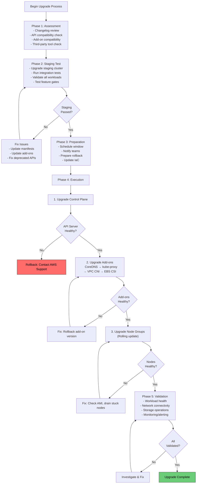
```mermaid
flowchart TD
    Start["Begin Upgrade Process"] --> Assess["Phase 1: Assessment
    - Changelog review
    - API compatibility check
    - Add-on compatibility
    - Third-party tool check"]
    
    Assess --> Staging["Phase 2: Staging Test
    - Upgrade staging cluster
    - Run integration tests
    - Validate all workloads
    - Test feature gates"]
    
    Staging --> StagePass{"Staging
    Passed?"}
    StagePass -->|No| Fix["Fix Issues
    - Update manifests
    - Update add-ons
    - Fix deprecated APIs"]
    Fix --> Staging
    
    StagePass -->|Yes| Prepare["Phase 3: Preparation
    - Schedule window
    - Notify teams
    - Prepare rollback
    - Update IaC"]
    
    Prepare --> Execute["Phase 4: Execution"]
    
    Execute --> CP["1. Upgrade Control Plane"]
    CP --> CPCheck{"API Server
    Healthy?"}
    CPCheck -->|No| CPRollback["Rollback: Contact AWS Support"]
    CPCheck -->|Yes| Addons["2. Upgrade Add-ons
    CoreDNS → kube-proxy → VPC CNI → EBS CSI"]
    
    Addons --> AddonCheck{"Add-ons
    Healthy?"}
    AddonCheck -->|No| AddonFix["Fix: Rollback add-on version"]
    AddonFix --> Addons
    AddonCheck -->|Yes| Nodes["3. Upgrade Node Groups
    (Rolling update)"]
    
    Nodes --> NodeCheck{"Nodes
    Healthy?"}
    NodeCheck -->|No| NodeFix["Fix: Check AMI, drain stuck nodes"]
    NodeFix --> Nodes
    NodeCheck -->|Yes| Validate["Phase 5: Validation
    - Workload health
    - Network connectivity
    - Storage operations
    - Monitoring/alerting"]
    
    Validate --> Pass{"All
    Validated?"}
    Pass -->|No| Investigate["Investigate & Fix"]
    Investigate --> Validate
    Pass -->|Yes| Complete["Upgrade Complete"]

    style Complete fill:#6bcb77,stroke:#333,color:black
    style CPRollback fill:#ff6b6b,stroke:#333,color:black
```

### 回滚策略

> **更新（2026-07-01）**: Amazon EKS 宣布支持 Kubernetes 版本回滚。在升级后的 7 天内，你可以将 control plane 回滚到上一个 minor version。系统会先运行自动化 Rollback Readiness 检查，涵盖 API 兼容性、version skew、add-on 兼容性和 cluster 健康状况。EKS Auto Mode clusters 会自动回滚 -- worker nodes 会自行还原，control plane 会按顺序恢复。此功能不收取额外费用，并在所有区域可用。下面的策略适用于超过 7 天或该功能不可用时的兜底场景。（Source: [Amazon EKS announces Kubernetes version rollback](https://aws.amazon.com/about-aws/whats-new/2026/07/amazon-eks-version-rollback)）

```yaml
# Upgrade rollback strategy
rollback_strategy:

  control_plane:
    note: "Within 7 days: use EKS native version rollback / Beyond 7 days: blue-green cluster strategy"
    mitigation:
      - "Use EKS version rollback to restore the previous minor version immediately (within 7 days, no additional cost)"
      - "Beyond 7 days, fall back to a blue/green cluster strategy established before the upgrade"
      - "Shift traffic via Route 53 weighted routing"
      - "Migrate workloads to the new cluster"

  node_groups:
    strategy: "Create new node group + retain previous node group"
    steps:
      - "Do not immediately delete the previous version's node group"
      - "If issues arise, remove the taint from the previous node group"
      - "Add a taint to the new node group to shift traffic"

  workloads:
    strategy: "GitOps-based rollback"
    steps:
      - "Roll back to the previous commit in ArgoCD/Flux"
      - "Run a Helm rollback"

  addons:
    strategy: "Downgrade to the previous version"
    command: |
      aws eks update-addon \
        --cluster-name my-cluster \
        --addon-name vpc-cni \
        --addon-version <previous-version> \
        --resolve-conflicts OVERWRITE
```

---

## 9. 未来展望

### 正在积极开发的功能

Kubernetes 社区持续推进 container orchestration 的边界。以下是在积极开发中的关键功能和趋势，可能出现在即将到来的版本中。

#### 近期（预计 1.37 - 1.38）

| Feature | Current State | Expected Timeline | Impact |
|---------|--------------|-------------------|--------|
| **Pod-Level In-Place Scaling GA** | Beta (1.36) | 1.37 | Aggregate pod resource management |
| **MutatingAdmissionPolicy enhancements** | GA (1.36) | Ongoing | 更丰富的 CEL mutation patterns |
| **Improved DRA partitioning** | Beta (1.36) | 1.37 | 细粒度 GPU sharing |
| **Scheduler improvements** | Various | Ongoing | 更好的 bin-packing、queue management |

#### 中期趋势

**AI/ML Workload 优化**

Kubernetes 正在快速演进，以更好支持 AI/ML workloads：

- **DRA ecosystem growth**: 更多面向专用硬件（TPUs、custom ASICs）的 device drivers
- **Gang scheduling maturity**: 更好支持具有严格 co-scheduling 要求的 distributed training
- **GPU time-slicing and MIG**: Kubernetes 原生支持 GPU partitioning
- **Network-aware scheduling**: 为 distributed training placement 考虑 network topology

**安全加固**

- **Sigstore integration**: Container images 的原生 supply chain security
- **Policy as Code maturity**: 基于 CEL 的 admission 覆盖更复杂场景
- **Confidential containers**: 基于 TEE 的 container isolation
- **Improved audit logging**: 结构化、可查询的 audit events

**开发者体验**

- **KYAML ecosystem**: 更安全 YAML 子集的 tooling 改进
- **Improved CRD experience**: 更好的 validation、defaulting 和 conversion
- **Enhanced kubectl**: 更强大的 query、filtering 和 formatting 选项

### CNCF 生态趋势

| Trend | Key Projects | Kubernetes Impact |
|-------|-------------|-------------------|
| **Platform Engineering** | Backstage, Crossplane, KRO | Kubernetes 作为构建平台的平台 |
| **eBPF Networking** | Cilium, Calico eBPF | 完全取代 iptables/nftables |
| **Service Mesh Evolution** | Istio Ambient, Cilium SM | 无 sidecar 的 mesh 架构 |
| **GitOps Maturity** | ArgoCD, FluxCD | 声明式运维成为默认方式 |
| **Observability** | OpenTelemetry | 统一 telemetry collection standard |
| **WebAssembly (Wasm)** | SpinKube, wasmCloud | 更轻量级的 workload execution |
| **AI Infrastructure** | KubeAI, vLLM operator | Kubernetes-native AI serving |

### 面向未来的规划

对于正在规划 Kubernetes 策略的团队：

1. **保持在最新版本 n-1 范围内**: 目标是运行的版本最多落后最新 EKS release 一个版本
2. **每季度升级**: 与 Kubernetes 发布节奏（每 4 个月）对齐
3. **尽早测试**: 在 EKS 可用后的数周内使用 staging clusters 验证新版本
4. **自动化升级**: 投资于包含 cluster upgrade testing 的 CI/CD pipelines
5. **监控弃用**: 订阅 Kubernetes release announcements，并主动 review changelogs
6. **及时采用 GA 功能**: 达到 GA 的功能已生产就绪，并将永久启用

---

## 10. 参考资料

### 官方 Kubernetes 资源

- [Kubernetes 发布页面](https://kubernetes.io/releases/)
- [Kubernetes Changelog (GitHub)](https://github.com/kubernetes/kubernetes/blob/master/CHANGELOG/)
- [Kubernetes Feature Gates Reference](https://kubernetes.io/docs/reference/command-line-tools-reference/feature-gates/)
- [Kubernetes Enhancement Proposals (KEPs)](https://github.com/kubernetes/enhancements)
- [KEP Tracking Board](https://www.kubernetes.dev/resources/keps/)
- [Kubernetes Deprecation Policy](https://kubernetes.io/docs/reference/using-api/deprecation-policy/)
- [API Migration Guide](https://kubernetes.io/docs/reference/using-api/deprecation-guide/)
- [Kubernetes Blog - Release Announcements](https://kubernetes.io/blog/)
- [SIG Release](https://github.com/kubernetes/sig-release)

### Amazon EKS 资源

- [EKS Kubernetes Versions](https://docs.aws.amazon.com/eks/latest/userguide/kubernetes-versions.html)
- [EKS Release Calendar](https://docs.aws.amazon.com/eks/latest/userguide/kubernetes-versions.html#kubernetes-release-calendar)
- [EKS Extended Support](https://docs.aws.amazon.com/eks/latest/userguide/extended-support-control.html)
- [EKS Add-on Versions](https://docs.aws.amazon.com/eks/latest/userguide/managing-add-ons.html)
- [EKS Auto Mode](https://docs.aws.amazon.com/eks/latest/userguide/automode.html)
- [EKS Best Practices Guide](https://aws.github.io/aws-eks-best-practices/)
- [EKS Upgrade Guide](https://docs.aws.amazon.com/eks/latest/userguide/update-cluster.html)

### 升级规划工具

- [Pluto - Deprecated API Detector](https://github.com/FairwindsOps/pluto)
- [kubent (kube-no-trouble)](https://github.com/doitintl/kube-no-trouble)
- [kubectl-convert Plugin](https://kubernetes.io/docs/tasks/tools/install-kubectl-linux/#install-kubectl-convert-plugin)
- [Nova - Helm Chart Version Checker](https://github.com/FairwindsOps/nova)
- [eksctl](https://eksctl.io/)

### 社区资源

- [Kubernetes Slack](https://kubernetes.slack.com) - #sig-release, #eks channels
- [CNCF Calendar](https://www.cncf.io/calendar/) - KubeCon and community events
- [The Kubernetes Podcast](https://kubernetespodcast.com/)
- [Release Team Shadows Program](https://github.com/kubernetes/sig-release/blob/master/release-team/shadows.md)

## 测验

要测试你在本文档中学到的内容，请尝试 [Kubernetes 版本功能与路线图测验](../quizzes/eks/12-kubernetes-version-roadmap-quiz.md)。

---

< [上一篇：EKS 高级调试](./11-eks-advanced-debugging.md) | [目录](./README.md) >
