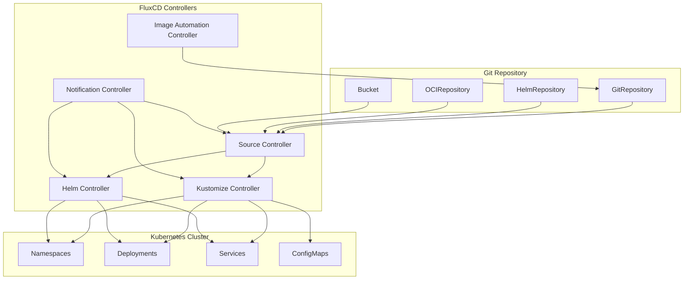

# FluxCD

> **支持的版本**: FluxCD v2.2+
> **最后更新**: February 22, 2026

FluxCD 是一套面向 Kubernetes 的开放且可扩展的持续交付与渐进式交付解决方案。FluxCD 于 2022 年 11 月从 CNCF 毕业，成为云原生生态系统中最成熟的 GitOps 工具之一。

## 简介

FluxCD 通过使用 Git 仓库作为定义 Kubernetes 集群期望状态的事实来源来实现 GitOps 原则。它会自动确保集群状态与 Git 中的配置一致。

### 主要特性

- **GitOps 原生**：从底层为 GitOps 工作流构建
- **多租户**：支持拥有隔离配置的多个团队
- **多集群**：从单个 Git 仓库管理多个集群
- **可扩展**：采用具有专用 Controller 的模块化架构
- **Kubernetes 原生**：使用 Custom Resource Definitions (CRDs) 进行配置

## 架构概览

FluxCD 由一组专用 Controller 组成，它们协同工作以实现 GitOps 工作流：



## 核心组件

### Source Controller

Source Controller 负责从外部来源获取制品。它支持多种来源类型：

#### GitRepository

跟踪 Git 仓库，并使其可供其他 Controller 使用：

```yaml
apiVersion: source.toolkit.fluxcd.io/v1
kind: GitRepository
metadata:
  name: my-app
  namespace: flux-system
spec:
  interval: 1m
  url: https://github.com/my-org/my-app
  ref:
    branch: main
  secretRef:
    name: git-credentials
```

#### HelmRepository

跟踪 Helm chart 仓库：

```yaml
apiVersion: source.toolkit.fluxcd.io/v1
kind: HelmRepository
metadata:
  name: bitnami
  namespace: flux-system
spec:
  interval: 1h
  url: https://charts.bitnami.com/bitnami
```

#### OCIRepository

跟踪存储在符合 OCI 标准的注册表（包括容器注册表）中的制品：

```yaml
apiVersion: source.toolkit.fluxcd.io/v1beta2
kind: OCIRepository
metadata:
  name: my-artifacts
  namespace: flux-system
spec:
  interval: 5m
  url: oci://ghcr.io/my-org/my-artifacts
  ref:
    tag: latest
```

#### Bucket

跟踪存储在兼容 S3 的存储中的制品：

```yaml
apiVersion: source.toolkit.fluxcd.io/v1beta2
kind: Bucket
metadata:
  name: my-bucket
  namespace: flux-system
spec:
  interval: 5m
  provider: aws
  bucketName: my-flux-bucket
  endpoint: s3.amazonaws.com
  region: us-east-1
  secretRef:
    name: aws-credentials
```

### Kustomize Controller

Kustomize Controller 从来源应用 Kustomize overlay 和普通 Kubernetes manifest。

#### Kustomization CRD

```yaml
apiVersion: kustomize.toolkit.fluxcd.io/v1
kind: Kustomization
metadata:
  name: my-app
  namespace: flux-system
spec:
  interval: 10m
  targetNamespace: production
  sourceRef:
    kind: GitRepository
    name: my-app
  path: ./deploy/production
  prune: true
  healthChecks:
    - apiVersion: apps/v1
      kind: Deployment
      name: my-app
      namespace: production
  timeout: 2m
```

#### 变量替换

FluxCD 支持使用 `postBuild` 进行变量替换：

```yaml
apiVersion: kustomize.toolkit.fluxcd.io/v1
kind: Kustomization
metadata:
  name: my-app
  namespace: flux-system
spec:
  interval: 10m
  sourceRef:
    kind: GitRepository
    name: my-app
  path: ./deploy
  postBuild:
    substitute:
      ENVIRONMENT: production
      REPLICAS: "3"
    substituteFrom:
      - kind: ConfigMap
        name: cluster-config
      - kind: Secret
        name: cluster-secrets
```

#### 健康检查

为已部署资源定义自定义健康检查：

```yaml
spec:
  healthChecks:
    - apiVersion: apps/v1
      kind: Deployment
      name: frontend
      namespace: production
    - apiVersion: apps/v1
      kind: StatefulSet
      name: database
      namespace: production
  timeout: 5m
```

### Helm Controller

Helm Controller 以声明式方式管理 Helm chart release。

#### HelmRelease CRD

```yaml
apiVersion: helm.toolkit.fluxcd.io/v2
kind: HelmRelease
metadata:
  name: nginx
  namespace: flux-system
spec:
  interval: 5m
  chart:
    spec:
      chart: nginx
      version: ">=15.0.0"
      sourceRef:
        kind: HelmRepository
        name: bitnami
        namespace: flux-system
  targetNamespace: web
  install:
    createNamespace: true
    remediation:
      retries: 3
  upgrade:
    remediation:
      retries: 3
  values:
    replicaCount: 2
    service:
      type: LoadBalancer
```

#### Values 覆盖

从多个来源覆盖 Helm values：

```yaml
spec:
  valuesFrom:
    - kind: ConfigMap
      name: nginx-values
      valuesKey: values.yaml
    - kind: Secret
      name: nginx-secrets
      valuesKey: credentials.yaml
  values:
    replicaCount: 3
```

#### 漂移检测

启用漂移检测，以确保已部署资源与期望状态一致：

```yaml
spec:
  driftDetection:
    mode: enabled
    ignore:
      - paths: ["/spec/replicas"]
        target:
          kind: Deployment
```

### Notification Controller

Notification Controller 处理入站和出站事件。

#### Provider

为告警配置通知 Provider：

```yaml
apiVersion: notification.toolkit.fluxcd.io/v1beta3
kind: Provider
metadata:
  name: slack
  namespace: flux-system
spec:
  type: slack
  channel: flux-alerts
  secretRef:
    name: slack-webhook
```

支持的 Provider 包括：
- Slack
- Microsoft Teams
- Discord
- PagerDuty
- Opsgenie
- GitHub
- GitLab
- Grafana
- 通用 webhook

#### Alert

为 FluxCD 事件定义告警：

```yaml
apiVersion: notification.toolkit.fluxcd.io/v1beta3
kind: Alert
metadata:
  name: on-call
  namespace: flux-system
spec:
  summary: "Cluster alerts"
  providerRef:
    name: slack
  eventSeverity: error
  eventSources:
    - kind: GitRepository
      name: '*'
    - kind: Kustomization
      name: '*'
    - kind: HelmRelease
      name: '*'
```

#### Receiver（Webhook）

为外部事件配置 webhook：

```yaml
apiVersion: notification.toolkit.fluxcd.io/v1
kind: Receiver
metadata:
  name: github-receiver
  namespace: flux-system
spec:
  type: github
  events:
    - ping
    - push
  secretRef:
    name: github-webhook-token
  resources:
    - kind: GitRepository
      name: my-app
```

### 镜像自动化

FluxCD 可以自动更新 Git 仓库中的容器镜像 tag。

#### ImageRepository

扫描容器注册表以查找新 tag：

```yaml
apiVersion: image.toolkit.fluxcd.io/v1beta2
kind: ImageRepository
metadata:
  name: my-app
  namespace: flux-system
spec:
  image: ghcr.io/my-org/my-app
  interval: 1m
  secretRef:
    name: registry-credentials
```

#### ImagePolicy

定义用于选择镜像 tag 的策略：

```yaml
apiVersion: image.toolkit.fluxcd.io/v1beta2
kind: ImagePolicy
metadata:
  name: my-app
  namespace: flux-system
spec:
  imageRepositoryRef:
    name: my-app
  policy:
    semver:
      range: ">=1.0.0"
```

#### ImageUpdateAutomation

检测到新镜像时自动创建 Git commit：

```yaml
apiVersion: image.toolkit.fluxcd.io/v1beta2
kind: ImageUpdateAutomation
metadata:
  name: my-app
  namespace: flux-system
spec:
  interval: 30m
  sourceRef:
    kind: GitRepository
    name: my-app
  git:
    checkout:
      ref:
        branch: main
    commit:
      author:
        email: flux@my-org.com
        name: Flux
      messageTemplate: |
        Automated image update

        Automation: {{ .AutomationObject }}

        Files:
        {{ range $filename, $_ := .Changed.FileChanges -}}
        - {{ $filename }}
        {{ end -}}

        Objects:
        {{ range $resource, $changes := .Changed.Objects -}}
        - {{ $resource.Kind }} {{ $resource.Name }}
          {{- range $_, $change := $changes }}
          {{ $change.OldValue }} -> {{ $change.NewValue }}
          {{- end }}
        {{ end -}}
    push:
      branch: main
  update:
    path: ./deploy
    strategy: Setters
```

## 安装

### 使用 Flux CLI

安装 Flux CLI：

```bash
# macOS
brew install fluxcd/tap/flux

# Linux
curl -s https://fluxcd.io/install.sh | sudo bash

# Windows (Chocolatey)
choco install flux
```

### Bootstrap

在集群上 Bootstrap FluxCD：

```bash
# Bootstrap with GitHub
flux bootstrap github \
  --owner=my-org \
  --repository=fleet-infra \
  --branch=main \
  --path=clusters/production \
  --personal

# Bootstrap with GitLab
flux bootstrap gitlab \
  --owner=my-org \
  --repository=fleet-infra \
  --branch=main \
  --path=clusters/production
```

### 验证安装

```bash
# Check Flux components
flux check

# Get all Flux resources
flux get all

# Watch for changes
flux get kustomizations --watch
```

## 使用 Flux 管理多集群

FluxCD 支持从单个仓库管理多个集群。

### Fleet 仓库结构

```
fleet-infra/
├── clusters/
│   ├── production/
│   │   ├── flux-system/
│   │   │   └── gotk-sync.yaml
│   │   └── apps.yaml
│   ├── staging/
│   │   ├── flux-system/
│   │   │   └── gotk-sync.yaml
│   │   └── apps.yaml
│   └── development/
│       ├── flux-system/
│       │   └── gotk-sync.yaml
│       └── apps.yaml
├── infrastructure/
│   ├── base/
│   │   ├── cert-manager/
│   │   ├── ingress-nginx/
│   │   └── monitoring/
│   └── overlays/
│       ├── production/
│       └── staging/
└── apps/
    ├── base/
    │   ├── frontend/
    │   └── backend/
    └── overlays/
        ├── production/
        └── staging/
```

### 跨集群依赖关系

```yaml
apiVersion: kustomize.toolkit.fluxcd.io/v1
kind: Kustomization
metadata:
  name: infrastructure
  namespace: flux-system
spec:
  interval: 1h
  sourceRef:
    kind: GitRepository
    name: fleet-infra
  path: ./infrastructure/overlays/production
  prune: true
---
apiVersion: kustomize.toolkit.fluxcd.io/v1
kind: Kustomization
metadata:
  name: apps
  namespace: flux-system
spec:
  dependsOn:
    - name: infrastructure
  interval: 10m
  sourceRef:
    kind: GitRepository
    name: fleet-infra
  path: ./apps/overlays/production
  prune: true
```

## Amazon EKS 上的 FluxCD

### IRSA 集成

为 FluxCD 配置 IAM Roles for Service Accounts (IRSA)：

```yaml
apiVersion: v1
kind: ServiceAccount
metadata:
  name: source-controller
  namespace: flux-system
  annotations:
    eks.amazonaws.com/role-arn: arn:aws:iam::ACCOUNT_ID:role/flux-source-controller
```

用于访问 ECR 的 IAM Policy：

```json
{
  "Version": "2012-10-17",
  "Statement": [
    {
      "Effect": "Allow",
      "Action": [
        "ecr:GetAuthorizationToken",
        "ecr:BatchCheckLayerAvailability",
        "ecr:GetDownloadUrlForLayer",
        "ecr:BatchGetImage"
      ],
      "Resource": "*"
    }
  ]
}
```

### ECR 集成

配置 FluxCD 以从 Amazon ECR 拉取镜像：

```yaml
apiVersion: source.toolkit.fluxcd.io/v1beta2
kind: OCIRepository
metadata:
  name: my-app
  namespace: flux-system
spec:
  interval: 5m
  url: oci://ACCOUNT_ID.dkr.ecr.us-east-1.amazonaws.com/my-app
  ref:
    tag: latest
  provider: aws
```

### S3 Bucket 来源

使用 S3 作为制品来源：

```yaml
apiVersion: source.toolkit.fluxcd.io/v1beta2
kind: Bucket
metadata:
  name: artifacts
  namespace: flux-system
spec:
  interval: 5m
  provider: aws
  bucketName: my-flux-artifacts
  endpoint: s3.us-east-1.amazonaws.com
  region: us-east-1
```

### CodeCommit 集成

使用 AWS CodeCommit Bootstrap FluxCD：

```bash
flux bootstrap git \
  --url=ssh://git-codecommit.us-east-1.amazonaws.com/v1/repos/fleet-infra \
  --branch=main \
  --path=clusters/production \
  --ssh-key-algorithm=rsa \
  --ssh-rsa-bits=4096
```

## 最佳实践

### 仓库结构

- 小型团队使用 monorepo
- 大型组织为基础设施和应用程序使用独立仓库
- 使用 Kustomize 实现特定环境的 overlay

### 安全性

- 使用 sealed secret 或外部 secret operator
- 为多租户场景实施 RBAC
- 为 Receiver 启用 webhook 验证

### 监控

- 为协调失败配置告警
- 将指标导出到 Prometheus
- 为 Flux 组件设置 dashboard

### 性能

- 根据变更频率调整协调间隔
- 为 Helm 仓库使用缓存
- 使用适当的 timeout 实现健康检查

## 测验

要测试所学内容，请尝试 [FluxCD 测验](../quizzes/gitops/02-fluxcd-quiz.md)。
