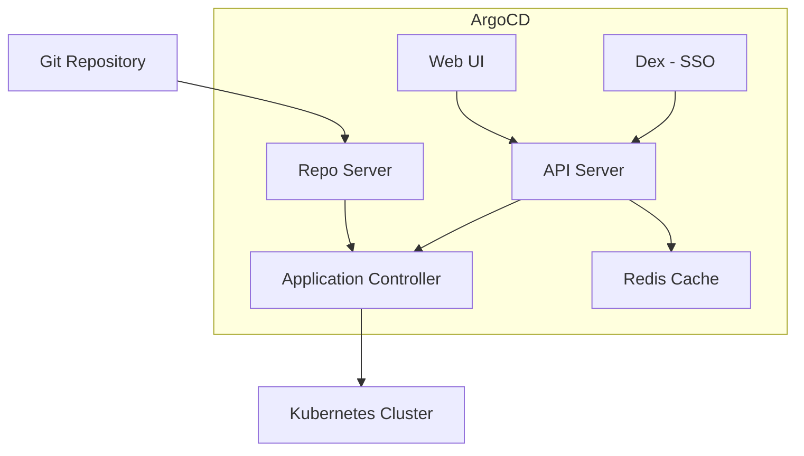
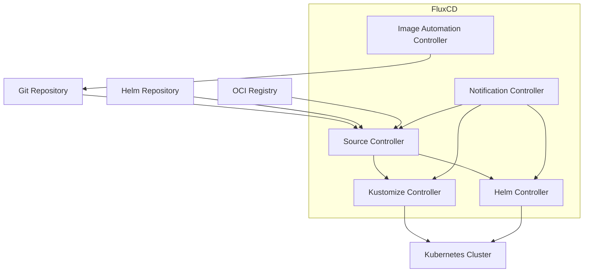

# GitOps 工具对比

> **最后更新**: February 22, 2026

本指南全面对比 GitOps 工具，重点介绍 Kubernetes 生态系统中最受欢迎的两种选择：ArgoCD 和 FluxCD。

## 概述

GitOps 是一种运维框架，它将用于应用开发的 DevOps 最佳实践应用于基础设施自动化。CNCF 生态系统中领先的两种 GitOps 工具是：

- **ArgoCD**：面向 Kubernetes 的声明式 GitOps 持续交付工具
- **FluxCD**：一组面向 Kubernetes 的持续交付和渐进式交付解决方案

两者都是 CNCF 毕业项目，这表明它们已经成熟并被广泛采用。

## ArgoCD 与 FluxCD：正面对比

### 理念与设计

| 方面 | ArgoCD | FluxCD |
|--------|--------|--------|
| **架构** | 带 UI 的单体应用 | 由 Controller 组成的模块化工具集 |
| **配置** | 以 Application 为中心的 CRD | 以 Source 为中心的 CRD |
| **用户界面** | 包含功能丰富的 Web UI | 以 CLI 为先，不含内置 UI |
| **学习曲线** | 对初学者更友好 | 更陡峭，但更灵活 |
| **部署模型** | 基于拉取的 GitOps | 基于拉取的 GitOps |

### 功能对比

| 功能 | ArgoCD | FluxCD |
|---------|--------|--------|
| **Web UI** | 内置且功能丰富 | 未包含（使用 Weave GitOps） |
| **CLI** | `argocd` CLI | `flux` CLI |
| **多租户** | 带 RBAC 的项目 | Namespace 隔离 |
| **多 Cluster** | 原生支持 | 原生支持 |
| **Helm 支持** | 完整支持 | 通过 Helm Controller 提供完整支持 |
| **Kustomize 支持** | 完整支持 | 通过 Kustomize Controller 提供完整支持 |
| **OCI 支持** | 仅 Helm chart | 完整的 OCI artifact 支持 |
| **通知** | 内置通知系统 | Notification Controller |
| **RBAC** | 全面的 RBAC | Kubernetes 原生 RBAC |
| **SSO 集成** | OIDC、SAML、LDAP | Kubernetes 身份验证 |
| **健康检查** | 内置资源健康状态 | 自定义健康检查 |
| **渐进式交付** | 通过 Argo Rollouts | 通过 Flagger |
| **镜像自动化** | 通过 Argo Image Updater | 内置 Image Automation |
| **差异预览** | UI 中的可视化差异 | CLI 差异 |
| **同步波次** | 原生支持 | 通过依赖关系实现 |
| **Hook** | PreSync、Sync、PostSync | 非原生支持（使用 Job） |

### 架构对比

#### ArgoCD 架构



#### FluxCD 架构



### 社区与生态系统

| 指标 | ArgoCD | FluxCD |
|--------|--------|--------|
| **GitHub 星标数** | ~17,000+ | ~6,500+ |
| **CNCF 状态** | 毕业（2022 年 12 月） | 毕业（2022 年 11 月） |
| **首次发布** | 2018 | 2016（v1）、2020（v2） |
| **主要维护者** | Intuit、Red Hat | Weaveworks、CNCF |
| **生态系统工具** | Argo Workflows、Rollouts、Events | Flagger、Weave GitOps |

## 何时选择 ArgoCD

当你需要以下能力时，ArgoCD 是理想选择：

### 用例

1. **可视化管理**：偏好通过图形界面管理部署的团队
2. **集中式控制**：希望通过单一视图管理多个 Cluster 的组织
3. **全面的 RBAC**：跨团队的复杂访问控制需求
4. **SSO 集成**：需要 OIDC/SAML 身份验证的企业环境
5. **同步波次与 Hook**：具有顺序要求的复杂部署编排

### 优势

- **丰富的 Web UI**：用于部署管理的直观可视化界面
- **以 Application 为中心**：与开发人员思考部署的方式自然对应
- **成熟的生态系统**：与 Argo Workflows、Rollouts 和 Events 紧密集成
- **企业功能**：开箱即用的 SSO、RBAC 和审计日志
- **易于调试**：UI 中提供可视化差异和同步状态

### 示例场景

```
Scenario: Enterprise with 50+ microservices
- Multiple teams need self-service deployments
- Security team requires audit logs and RBAC
- Developers want visual feedback on sync status
- Need SSO integration with corporate identity provider

Recommendation: ArgoCD
- Projects per team with role-based access
- Application Sets for template-driven deployments
- Web UI for developer self-service
- Dex integration for SSO
```

## 何时选择 FluxCD

当你需要以下能力时，FluxCD 是理想选择：

### 用例

1. **模块化架构**：仅选择所需的 Controller
2. **以 CLI 为先的工作流**：不依赖 UI 的 GitOps 原生工作流
3. **镜像自动化**：自动更新 Git 中的容器镜像
4. **OCI artifact**：从 OCI registry 存储和部署
5. **轻量级占用**：资源消耗最小

### 优势

- **模块化设计**：只使用所需的功能
- **原生镜像自动化**：内置容器镜像更新
- **OCI 支持**：一流的 OCI artifact 支持
- **Kubernetes 原生**：使用标准 Kubernetes RBAC
- **较低资源使用量**：更小的内存和 CPU 占用

### 示例场景

```
Scenario: Platform team building internal developer platform
- Need automated image updates when CI builds new versions
- Want to store deployment artifacts in container registry
- Prefer CLI-driven GitOps workflows
- Multiple clusters with different configurations

Recommendation: FluxCD
- Image automation for continuous deployment
- OCI repositories for artifact storage
- Kustomize overlays for environment differences
- Multi-cluster management with fleet repo
```

## 它们可以一起使用吗？

可以，ArgoCD 和 FluxCD 可以通过互补模式一起使用：

### 模式 1：FluxCD 用于基础设施，ArgoCD 用于应用

```
Git Repository
├── infrastructure/     # Managed by FluxCD
│   ├── cert-manager/
│   ├── ingress-nginx/
│   └── monitoring/
└── applications/       # Managed by ArgoCD
    ├── app-a/
    ├── app-b/
    └── app-c/
```

- FluxCD 管理 Cluster 基础设施（Operator、Controller）
- ArgoCD 通过面向开发人员的 UI 管理应用部署

### 模式 2：FluxCD 镜像自动化与 ArgoCD 部署

```
1. CI builds new image → pushes to registry
2. FluxCD Image Automation detects new tag
3. FluxCD commits updated manifest to Git
4. ArgoCD syncs the change to cluster
```

### 模式 3：不同的 Cluster，不同的工具

- 生产 Cluster：ArgoCD（满足 UI 和审计要求）
- 开发 Cluster：FluxCD（支持快速迭代）

## 迁移注意事项

### 从 FluxCD 迁移到 ArgoCD

1. 将 FluxCD Kustomization 导出为 ArgoCD Application
2. 将 FluxCD Source 映射到 ArgoCD repository
3. 将 HelmRelease 转换为 ArgoCD Helm Application
4. 在 ArgoCD 中配置 RBAC 和 SSO

### 从 ArgoCD 迁移到 FluxCD

1. 将 ArgoCD Application 转换为 Kustomization/HelmRelease
2. 使用 Git/Helm repository 设置 Source Controller
3. 配置 Notification Controller 以发送告警
4. 必要时实施 Image Automation

## 其他 GitOps 工具

虽然 ArgoCD 和 FluxCD 主导着 GitOps 领域，但仍有其他工具：

### Jenkins X

- 专注于 CI/CD pipeline 自动化
- 内置预览环境
- 基于 Tekton 的 pipeline
- 最适合：希望获得集成 CI/CD 和 GitOps 的团队

### Rancher Fleet

- 专为管理数千个 Cluster 而设计
- 大规模 GitOps
- 与 Rancher 集成
- 最适合：大规模边缘部署

### Weave GitOps

- 基于 FluxCD 构建的商业产品
- 为 Flux 添加 UI 和企业功能
- 最适合：希望使用 UI 的 FluxCD 用户

## 决策矩阵

| 需求 | 最佳选择 |
|-------------|-------------|
| 需要 Web UI | ArgoCD |
| 以 CLI 为先的工作流 | FluxCD |
| 镜像自动化 | FluxCD |
| 复杂 RBAC | ArgoCD |
| SSO 集成 | ArgoCD |
| 最少资源 | FluxCD |
| OCI artifact | FluxCD |
| 同步波次/Hook | ArgoCD |
| 可视化差异 | ArgoCD |
| 模块化部署 | FluxCD |
| 企业审计 | ArgoCD |
| 大规模多 Cluster | 两者皆可 |

## 结论

ArgoCD 和 FluxCD 都是实施 GitOps 的优秀选择。决策通常取决于：

- 如果你看重丰富的 UI、企业功能和以 Application 为中心的管理，**选择 ArgoCD**
- 如果你偏好模块化、CLI 工作流和内置镜像自动化，**选择 FluxCD**

许多组织成功地将两种工具用于不同用途，在最重要的场景中发挥各自的优势。

## 测验

为检验你的学习成果，请尝试 [GitOps 工具对比测验](../quizzes/gitops/03-gitops-comparison-quiz.md)。
