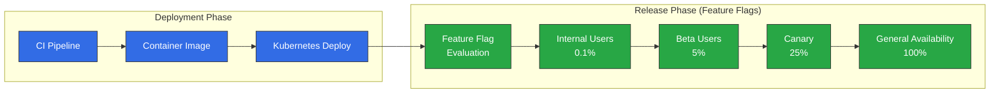
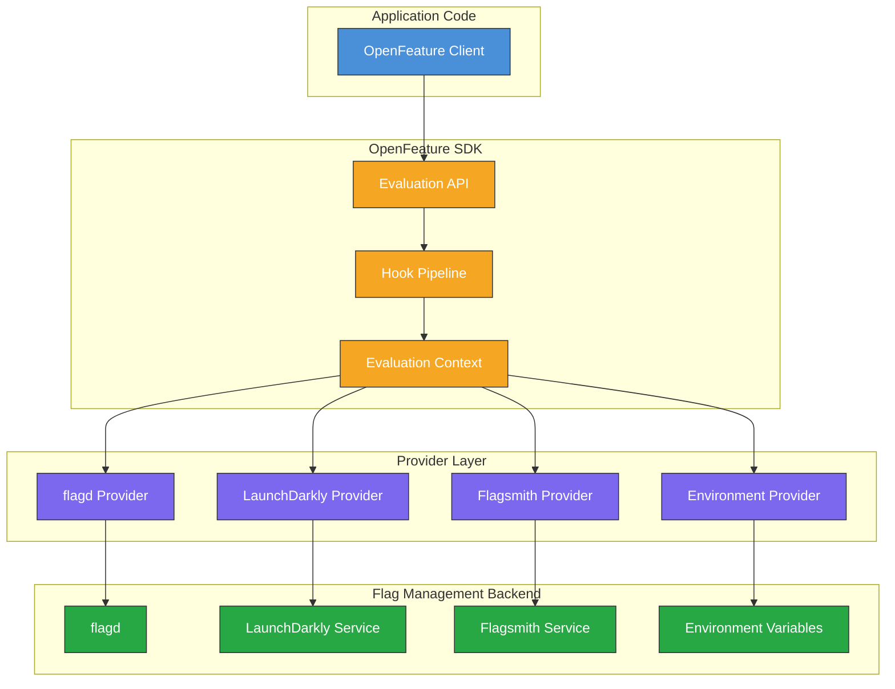
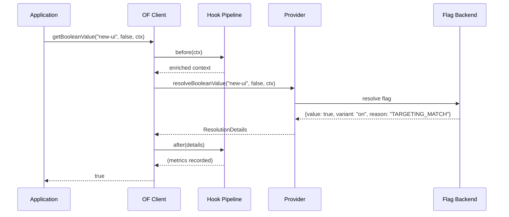
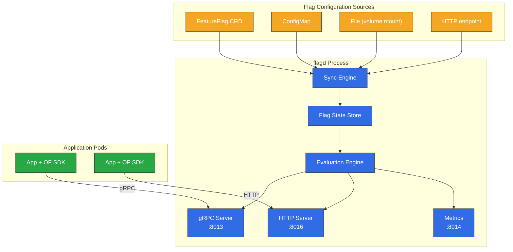
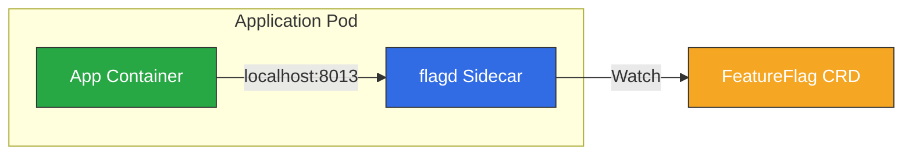
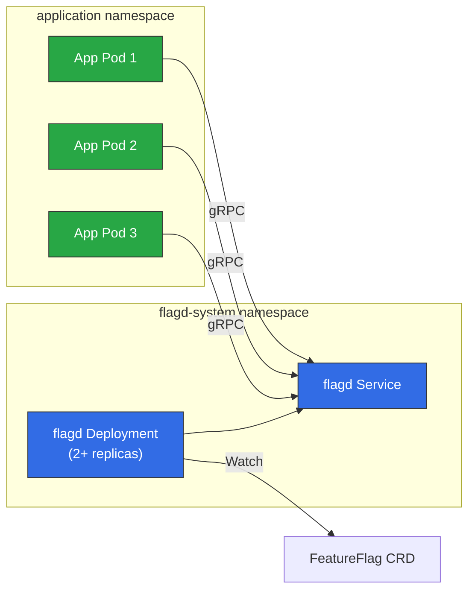
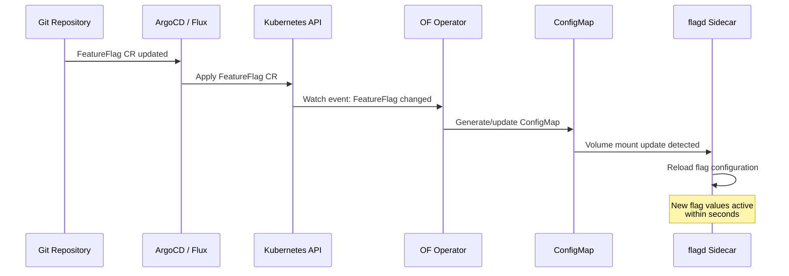
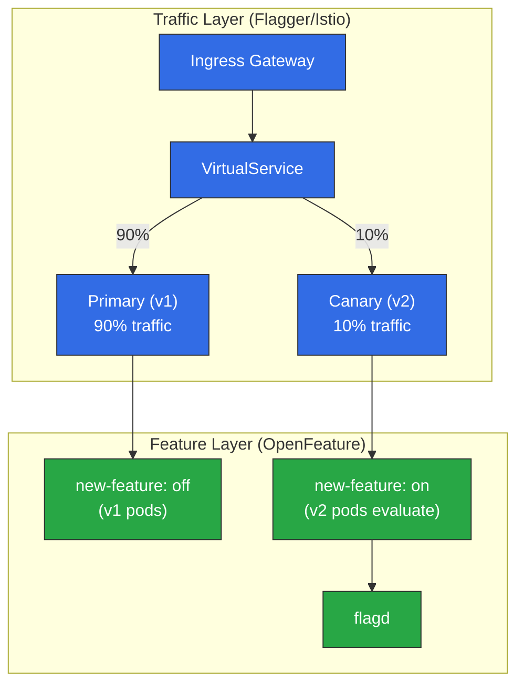
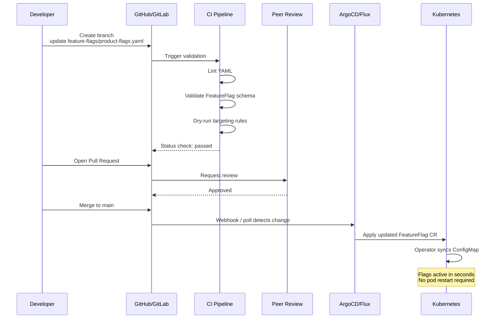
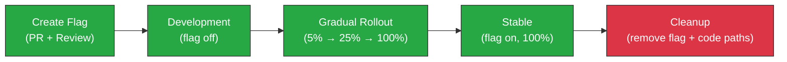

# 功能标志与 OpenFeature

> **支持的版本**: OpenFeature SDK v1.x, flagd v0.11+
> **最后更新**: June 2025

功能标志是 Kubernetes 上现代渐进式交付的基础技术。它让工程团队能够将部署与发布解耦，无需重新部署代码即可实现安全推出、定向实验和即时回滚。本指南介绍 OpenFeature 标准、flagd 参考实现、适用于 Kubernetes 的 OpenFeature Operator，以及适用于 GitOps 工作流的生产级集成模式。

---

## 目录

- [概述和学习目标](#overview-and-learning-objectives)
- [OpenFeature 架构](#openfeature-architecture)
- [Kubernetes 上的 flagd](#flagd-on-kubernetes)
- [OpenFeature Operator](#openfeature-operator)
- [应用程序集成](#application-integration)
- [Canary 发布与功能标志组合](#canary-release-and-feature-flag-combination)
- [GitOps 集成](#gitops-integration)
- [可观测性](#observability)
- [生产最佳实践](#production-best-practices)
- [参考资料](#references)

---

## 概述和学习目标

### 学习目标

完成本节后，您将能够：

- 说明功能标志在渐进式交付和持续部署中的作用
- 比较功能标志平台，并为您的环境选择合适的工具
- 使用 OpenFeature Operator 在 Kubernetes 上部署 flagd
- 在 Go、Java、Python 和 Node.js 应用程序中集成 OpenFeature SDK
- 将功能标志与 Canary 发布结合，以实现复杂的推出策略
- 通过 GitOps 工作流以代码方式管理功能标志配置
- 使用 Prometheus 和 Grafana 监控标志求值

### 什么是功能标志？

功能标志（也称为功能切换或功能开关）是一种无需部署新代码即可在运行时启用或禁用功能的机制。其核心思想很简单：用检查标志值的条件语句包装代码路径，并从外部控制该值。

```
if featureEnabled("new-checkout-flow"):
    renderNewCheckout()
else:
    renderLegacyCheckout()
```

功能标志在软件交付中有若干不同用途：

| 类别 | 用途 | 生命周期 | 示例 |
|----------|---------|----------|---------|
| **发布标志** | 将部署与发布解耦 | 数天到数周 | 开发期间将未完成的功能隐藏在标志后面 |
| **实验标志** | A/B 测试和数据驱动的决策 | 数周到数月 | 向 10% 的用户展示定价页面的 B 变体 |
| **运维标志** | 运维控制和熔断器 | 永久 | 非关键下游依赖的终止开关 |
| **权限标志** | 授权和访问控制 | 永久 | 仅为付费客户启用高级功能 |

### 渐进式交付中的功能标志

渐进式交付通过增加对哪些用户何时看到新功能的细粒度控制来扩展持续交付。功能标志是此模型中的关键构建块：



借助功能标志，您可以同时将代码部署到所有 Pod，但在应用程序层控制谁能看到新行为。这与流量拆分方法（如 Canary 部署）有本质区别；后者控制请求命中哪个 Pod 版本。这两种技术相辅相成，如 [Canary 发布与功能标志组合](#canary-release-and-feature-flag-combination)一节所述。

### 功能标志工具比较

下表比较 Kubernetes 生态系统中使用最广泛的功能标志平台：

| 功能 | LaunchDarkly | Flagsmith | flagd | Split.io | Unleash |
|---------|-------------|-----------|-------|----------|---------|
| **部署模型** | SaaS（本地部署使用 Relay Proxy） | SaaS 或自托管 | 自托管（K8s 原生） | SaaS（可提供混合模式） | 自托管或 SaaS |
| **OpenFeature 支持** | 官方 Provider | 官方 Provider | 参考实现 | 官方 Provider | 官方 Provider |
| **Kubernetes Operator** | 否（使用 Relay Proxy） | 否 | 是（OpenFeature Operator） | 否 | 否 |
| **基于 CRD 的配置** | 否 | 否 | 是（FeatureFlag CR） | 否 | 否 |
| **定向规则** | 高级（分段、规则） | 高级（分段、规则） | 基于 JSON 的规则 | 高级（属性） | 基于策略 |
| **审计日志** | 内置 | 内置 | 通过 Kubernetes + OTel | 内置 | 内置 |
| **实时更新** | 流式（SSE） | 流式（SSE/WS） | gRPC 同步 / K8s watch | 流式（SSE） | 轮询或 webhook |
| **定价** | 商业版 | 免费层 + 商业版 | 免费（OSS、CNCF） | 商业版 | 免费（OSS）+ 商业版 |
| **最适合** | 大规模企业 | 自托管灵活性 | 云原生 K8s 工作负载 | 专注实验 | 简单的自托管需求 |

### OpenFeature 标准

OpenFeature 是一个 CNCF 孵化项目，提供与厂商无关、由社区驱动的功能标志求值 API。它通过定义可与任何后端 Provider 配合使用的标准接口，解决了厂商锁定问题。

OpenFeature 的主要优势：

- **与厂商无关的 API**：无需更改应用程序代码即可切换 Provider
- **一致的求值模型**：布尔、字符串、数字和对象标志类型使用统一的求值 API
- **Hooks**：用于日志、指标、验证和追踪的生命周期 Hook
- **求值上下文**：传递给每次求值的结构化上下文（用户属性、环境信息）
- **多语言支持**：提供 Go、Java、Python、Node.js、.NET、PHP 等语言的官方 SDK

---

## OpenFeature 架构

### SDK 结构

OpenFeature SDK 采用分层架构，将求值 API 与标志管理后端分离：



### 核心组件

**求值 API**：应用程序代码交互的主要接口。它提供类型化的求值方法（`getBooleanValue`、`getStringValue`、`getNumberValue`、`getObjectValue`）和用于限定求值范围的 `Client` 抽象。

**Provider**：Provider 是将 OpenFeature SDK 连接到特定标志管理后端的具体实现。任何时候（每个 domain）仅有一个 Provider 处于活动状态，SDK 将所有标志解析委托给它。

**求值上下文**：为标志求值提供上下文的一组键值属性。常见属性包括 `targetingKey`（用户 ID）、`email`、`region`、`environment` 和自定义属性。该上下文会流经整个求值管道。

**Hooks**：Hooks 在四个阶段拦截标志求值生命周期：

| 阶段 | 时机 | 常见用例 |
|-------|--------|-----------------|
| `before` | 求值前 | 丰富上下文、验证输入 |
| `after` | 成功求值后 | 记录指标、记录决策 |
| `error` | 求值失败时 | 错误报告、回退逻辑 |
| `finally` | 始终运行（类似 try/finally） | 清理、span 完成 |

### Provider 模型

Provider 抽象使 OpenFeature 能够保持与厂商无关。每个 Provider 都实现一个标准接口：

```
Provider Interface:
  - resolveBooleanValue(flagKey, defaultValue, context) -> ResolutionDetails
  - resolveStringValue(flagKey, defaultValue, context) -> ResolutionDetails
  - resolveNumberValue(flagKey, defaultValue, context) -> ResolutionDetails
  - resolveObjectValue(flagKey, defaultValue, context) -> ResolutionDetails
  - initialize(context) -> void
  - shutdown() -> void
  - onContextChange(oldCtx, newCtx) -> void
```

从一个 Provider 切换到另一个 Provider 只需更改一行配置代码：

```go
// Switch from flagd to LaunchDarkly by changing only the provider
openfeature.SetProvider(flagd.NewProvider())        // Option A: flagd
openfeature.SetProvider(launchdarkly.NewProvider())  // Option B: LaunchDarkly
```

### 求值流程

一次完整的标志求值遵循以下顺序：



---

## Kubernetes 上的 flagd

### 什么是 flagd？

flagd 是一个轻量级开源功能标志守护进程，也是兼容 OpenFeature 的标志求值引擎的参考实现。它专为云原生环境设计，并在 Kubernetes 上原生运行。

主要特性：

- **轻量**：单个 Go 二进制文件，资源占用极小（空闲时约 20 MB 内存）
- **Kubernetes 原生**：从 FeatureFlag CRD、ConfigMap 或文件读取标志配置
- **gRPC 和 HTTP**：通过 gRPC（端口 8013）和 HTTP（端口 8016）公开求值端点
- **实时同步**：监视 Kubernetes 资源变更并立即更新标志状态
- **比例求值**：内置支持使用一致性哈希的基于百分比的推出
- **定向规则**：基于 JSON Logic 的定向规则，可用于复杂受众分群

### flagd 架构



### Helm 安装

使用 Helm 将 flagd 安装为独立 Deployment：

```bash
# Add the OpenFeature Helm repository
helm repo add openfeature https://open-feature.github.io/open-feature-operator/
helm repo update

# Install flagd standalone (without the operator)
helm install flagd openfeature/flagd \
  --namespace flagd-system \
  --create-namespace \
  --set replicas=2 \
  --set resources.requests.cpu=100m \
  --set resources.requests.memory=64Mi \
  --set resources.limits.cpu=500m \
  --set resources.limits.memory=256Mi \
  --set metrics.enabled=true
```

对于大多数生产环境，推荐的方法是安装 OpenFeature Operator（参见下一节），由其自动管理 flagd 实例。

### FeatureFlag CRD

OpenFeature Operator 引入了 `FeatureFlag` Custom Resource Definition，可让您将功能标志声明为 Kubernetes 资源。这是在 Kubernetes 原生方式中管理标志配置的主要机制。

以下是一个完整的 `FeatureFlag` CR 示例，演示所有主要标志类型和定向规则：

```yaml
apiVersion: core.openfeature.dev/v1beta1
kind: FeatureFlag
metadata:
  name: product-flags
  namespace: default
  labels:
    app: product-service
    environment: production
spec:
  flagSpec:
    # --- Boolean flag: simple on/off toggle ---
    flags:
      new-checkout-flow:
        state: ENABLED
        variants:
          "on": true
          "off": false
        defaultVariant: "off"
        targeting:
          # Enable for internal users and 10% of external users
          if:
            - or:
              - in:
                - "@company.com"
                - var: email
              - in:
                - var: targetingKey
                - fractional:
                  - - "on"
                    - 10
                  - - "off"
                    - 90
            - "on"
            - "off"

      # --- String flag: multi-variant feature ---
      checkout-theme:
        state: ENABLED
        variants:
          classic: "classic-v1"
          modern: "modern-v2"
          experimental: "modern-v3-beta"
        defaultVariant: classic
        targeting:
          if:
            - in:
              - var: region
              - - "us-east-1"
                - "eu-west-1"
            - "modern"
            - "classic"

      # --- Number flag: configuration tuning ---
      api-rate-limit:
        state: ENABLED
        variants:
          low: 100
          standard: 500
          high: 2000
          unlimited: 10000
        defaultVariant: standard
        targeting:
          if:
            - "=="
              - var: tier
              - "premium"
            - "high"
            - "standard"

      # --- Object flag: complex configuration ---
      recommendation-config:
        state: ENABLED
        variants:
          default:
            algorithm: "collaborative-filtering"
            maxResults: 10
            includeSponsored: false
          enhanced:
            algorithm: "deep-learning-v2"
            maxResults: 20
            includeSponsored: true
            modelVersion: "2025-06"
        defaultVariant: default
        targeting:
          if:
            - in:
              - var: targetingKey
              - fractional:
                - - "enhanced"
                  - 25
                - - "default"
                  - 75
            - "enhanced"
            - "default"

      # --- Ops flag: emergency kill switch ---
      enable-external-recommendations:
        state: ENABLED
        variants:
          "on": true
          "off": false
        defaultVariant: "on"
        # No targeting rules: controlled purely by defaultVariant.
        # Set defaultVariant to "off" to disable the feature globally.
```

### Sidecar 注入与独立 Deployment

flagd 可以在 Kubernetes 上以两种模式运行。选择取决于您的延迟要求、运维模型和资源预算。

**Sidecar 模式**（由 OpenFeature Operator 注入）：



**独立模式**（集中式 Deployment）：



| 方面 | Sidecar | 独立模式 |
|--------|---------|------------|
| **延迟** | 最低（localhost） | 略高（网络跳转） |
| **资源使用量** | 每个 Pod 一个 flagd | 在 Pod 间共享 |
| **影响范围** | 每 Pod 隔离 | 共享；故障影响所有消费者 |
| **扩缩容** | 随应用 Pod 扩缩容 | 独立扩缩容 |
| **配置** | 通过 Operator annotation 自动完成 | 手动 Helm/YAML 管理 |
| **最适合** | 对延迟敏感的关键工作负载 | 成本敏感、许多小型服务 |

---

## OpenFeature Operator

OpenFeature Operator 是一个 Kubernetes operator，用于管理 flagd 实例的生命周期并同步功能标志配置。它是在生产 Kubernetes 环境中运行 flagd 的推荐方式。

### 安装

```bash
# Install the OpenFeature Operator via Helm
helm repo add openfeature https://open-feature.github.io/open-feature-operator/
helm repo update

helm install open-feature-operator openfeature/open-feature-operator \
  --namespace open-feature-operator-system \
  --create-namespace \
  --set sidecarConfiguration.resources.requests.cpu=50m \
  --set sidecarConfiguration.resources.requests.memory=32Mi \
  --set sidecarConfiguration.resources.limits.cpu=200m \
  --set sidecarConfiguration.resources.limits.memory=128Mi
```

### Operator 引入的 CRD

该 operator 引入多个用于管理功能标志的 CRD：

| CRD | 用途 |
|-----|---------|
| `FeatureFlag` | 内联声明功能标志定义（标志键、变体、定向规则） |
| `FeatureFlagSource` | 指向工作负载的标志配置源（CRD、文件、HTTP） |

### FeatureFlagSource CRD

`FeatureFlagSource` 资源告诉 operator flagd 应从哪里读取配置。单个 `FeatureFlagSource` 可以引用多个源，operator 会将其合并。

```yaml
apiVersion: core.openfeature.dev/v1beta1
kind: FeatureFlagSource
metadata:
  name: product-service-flags
  namespace: default
spec:
  sources:
    # Source 1: FeatureFlag CR in the same namespace
    - source: product-flags          # Name of the FeatureFlag CR
      provider: kubernetes           # Read from Kubernetes CRD
    # Source 2: Shared flags from another namespace
    - source: global-flags
      provider: kubernetes
    # Source 3: External HTTP source (for third-party flag data)
    - source: https://flags.internal.company.com/api/v1/flags
      provider: http
      httpSyncBearerToken: "flag-sync-token"  # Token for auth
  # Port configuration for the injected flagd sidecar
  port: 8013
  metricsPort: 8014
  # flagd management port
  managementPort: 8015
  # Evaluation log format
  evaluator: json
  # Default sync provider
  defaultSyncProvider: kubernetes
```

### Pod 自动注入

operator 使用 annotation 将 flagd Sidecar 容器注入应用程序 Pod。当 operator 的 mutating webhook 检测到 annotation 时，它会自动将 flagd 容器添加到 Pod spec。

```yaml
apiVersion: apps/v1
kind: Deployment
metadata:
  name: product-service
  namespace: default
spec:
  replicas: 3
  selector:
    matchLabels:
      app: product-service
  template:
    metadata:
      labels:
        app: product-service
      annotations:
        # This annotation triggers flagd sidecar injection
        openfeature.dev/enabled: "true"
        # Reference the FeatureFlagSource to use
        openfeature.dev/flagsourcename: "product-service-flags"
    spec:
      containers:
        - name: product-service
          image: myregistry/product-service:v1.4.0
          ports:
            - containerPort: 8080
          env:
            # The flagd provider connects to localhost because the sidecar
            # runs in the same pod
            - name: FLAGD_HOST
              value: "localhost"
            - name: FLAGD_PORT
              value: "8013"
```

operator 处理此 Deployment 后，生成的 Pod 将包含两个容器：应用程序容器和 flagd Sidecar；标志配置来自引用的 `FeatureFlagSource`。

### ConfigMap 和 CRD 同步

operator 监视 `FeatureFlag` CR 的变化，并生成或更新 flagd 读取的相应 ConfigMap。此同步流程如下：



更新 `FeatureFlag` CR 时，operator 通过 Kubernetes watch API 检测变更，重新生成包含标志规范的 ConfigMap；flagd 则通过其文件监视器获取变更——全程无需重启 Pod。

---

## 应用程序集成

### Go SDK

```go
package main

import (
    "context"
    "fmt"
    "log"

    "github.com/open-feature/go-sdk/openfeature"
    flagd "github.com/open-feature/go-sdk-contrib/providers/flagd/pkg"
)

func main() {
    // Initialize the flagd provider
    provider := flagd.NewProvider(
        flagd.WithHost("localhost"),
        flagd.WithPort(8013),
        flagd.WithResolverType(flagd.GRPC),
    )
    openfeature.SetProvider(provider)

    // Create a client scoped to a domain
    client := openfeature.NewClient("product-service")

    // Build evaluation context with user and environment attributes
    ctx := openfeature.NewEvaluationContext(
        "user-12345",  // targetingKey
        map[string]interface{}{
            "email":   "alice@company.com",
            "region":  "us-east-1",
            "tier":    "premium",
            "env":     "production",
        },
    )

    // Boolean flag evaluation
    newCheckout, _ := client.BooleanValue(
        context.Background(), "new-checkout-flow", false, ctx,
    )
    fmt.Printf("New checkout enabled: %v\n", newCheckout)

    // String flag evaluation
    theme, _ := client.StringValue(
        context.Background(), "checkout-theme", "classic-v1", ctx,
    )
    fmt.Printf("Theme: %s\n", theme)

    // Number flag evaluation
    rateLimit, _ := client.FloatValue(
        context.Background(), "api-rate-limit", 500, ctx,
    )
    fmt.Printf("Rate limit: %.0f\n", rateLimit)

    // Object flag evaluation (returns interface{})
    recoConfig, _ := client.ObjectValue(
        context.Background(), "recommendation-config",
        map[string]interface{}{"algorithm": "collaborative-filtering", "maxResults": 10},
        ctx,
    )
    fmt.Printf("Recommendation config: %v\n", recoConfig)

    // Detailed evaluation (includes reason, variant, metadata)
    details, _ := client.BooleanValueDetails(
        context.Background(), "new-checkout-flow", false, ctx,
    )
    fmt.Printf("Value: %v, Variant: %s, Reason: %s\n",
        details.Value, details.Variant, details.Reason)
}
```

### Java SDK

```java
import dev.openfeature.sdk.*;
import dev.openfeature.contrib.providers.flagd.FlagdProvider;
import dev.openfeature.contrib.providers.flagd.FlagdOptions;

public class ProductService {

    private final Client featureClient;

    public ProductService() {
        // Configure the flagd provider
        FlagdOptions options = FlagdOptions.builder()
            .host("localhost")
            .port(8013)
            .resolverType(FlagdOptions.ResolverType.GRPC)
            .deadline(500)  // evaluation timeout in ms
            .build();

        OpenFeatureAPI api = OpenFeatureAPI.getInstance();
        api.setProvider(new FlagdProvider(options));
        this.featureClient = api.getClient("product-service");
    }

    public void handleCheckout(User user) {
        // Build evaluation context
        MutableContext ctx = new MutableContext(user.getId());
        ctx.add("email", user.getEmail());
        ctx.add("region", user.getRegion());
        ctx.add("tier", user.getTier());

        // Boolean evaluation
        boolean newCheckout = featureClient.getBooleanValue(
            "new-checkout-flow", false, ctx
        );

        if (newCheckout) {
            processNewCheckout(user);
        } else {
            processLegacyCheckout(user);
        }

        // String evaluation
        String theme = featureClient.getStringValue(
            "checkout-theme", "classic-v1", ctx
        );
        renderWithTheme(theme);

        // Number evaluation
        int rateLimit = featureClient.getIntegerValue(
            "api-rate-limit", 500, ctx
        );
        applyRateLimit(rateLimit);

        // Object evaluation
        Value recoConfig = featureClient.getObjectValue(
            "recommendation-config",
            new Value(Structure.mapToStructure(
                Map.of("algorithm", new Value("collaborative-filtering"))
            )),
            ctx
        );
        configureRecommendations(recoConfig.asStructure());
    }

    // Detailed evaluation with reason and variant
    public void logFlagDecision(String flagKey, User user) {
        MutableContext ctx = new MutableContext(user.getId());
        FlagEvaluationDetails<Boolean> details =
            featureClient.getBooleanDetails(flagKey, false, ctx);

        logger.info("Flag: {}, Value: {}, Variant: {}, Reason: {}",
            flagKey, details.getValue(),
            details.getVariant(), details.getReason());
    }
}
```

### Python SDK

```python
from openfeature import api
from openfeature.evaluation_context import EvaluationContext
from openfeature.contrib.provider.flagd import FlagdProvider
from openfeature.contrib.provider.flagd.config import ResolverType

# Initialize the provider
provider = FlagdProvider(
    host="localhost",
    port=8013,
    resolver_type=ResolverType.GRPC,
    deadline_ms=500,
)
api.set_provider(provider)

# Create a client
client = api.get_client("product-service")


def handle_request(user: dict):
    """Handle an incoming request with feature flag evaluation."""

    # Build evaluation context
    ctx = EvaluationContext(
        targeting_key=user["id"],
        attributes={
            "email": user["email"],
            "region": user.get("region", "us-east-1"),
            "tier": user.get("tier", "free"),
            "env": "production",
        },
    )

    # Boolean flag
    new_checkout = client.get_boolean_value("new-checkout-flow", False, ctx)
    if new_checkout:
        return render_new_checkout(user)

    # String flag
    theme = client.get_string_value("checkout-theme", "classic-v1", ctx)

    # Number flag
    rate_limit = client.get_integer_value("api-rate-limit", 500, ctx)

    # Object flag
    reco_config = client.get_object_value(
        "recommendation-config",
        {"algorithm": "collaborative-filtering", "maxResults": 10},
        ctx,
    )

    # Detailed evaluation
    details = client.get_boolean_details("new-checkout-flow", False, ctx)
    print(
        f"Flag: new-checkout-flow, Value: {details.value}, "
        f"Variant: {details.variant}, Reason: {details.reason}"
    )

    return render_legacy_checkout(user, theme, rate_limit, reco_config)
```

### Node.js SDK

```typescript
import { OpenFeature, EvaluationContext } from '@openfeature/server-sdk';
import { FlagdProvider } from '@openfeature/flagd-provider';

// Initialize the provider
const provider = new FlagdProvider({
  host: 'localhost',
  port: 8013,
  resolverType: 'grpc',
  deadlineMs: 500,
});

OpenFeature.setProvider(provider);

// Create a client
const client = OpenFeature.getClient('product-service');

interface User {
  id: string;
  email: string;
  region: string;
  tier: string;
}

async function handleCheckout(user: User): Promise<void> {
  // Build evaluation context
  const ctx: EvaluationContext = {
    targetingKey: user.id,
    email: user.email,
    region: user.region,
    tier: user.tier,
    env: 'production',
  };

  // Boolean flag
  const newCheckout = await client.getBooleanValue(
    'new-checkout-flow',
    false,
    ctx,
  );

  if (newCheckout) {
    await processNewCheckout(user);
  } else {
    await processLegacyCheckout(user);
  }

  // String flag
  const theme = await client.getStringValue(
    'checkout-theme',
    'classic-v1',
    ctx,
  );

  // Number flag
  const rateLimit = await client.getNumberValue(
    'api-rate-limit',
    500,
    ctx,
  );

  // Object flag
  const recoConfig = await client.getObjectValue(
    'recommendation-config',
    { algorithm: 'collaborative-filtering', maxResults: 10 },
    ctx,
  );

  // Detailed evaluation with metadata
  const details = await client.getBooleanDetails(
    'new-checkout-flow',
    false,
    ctx,
  );
  console.log(
    `Flag: new-checkout-flow, Value: ${details.value}, ` +
    `Variant: ${details.variant}, Reason: ${details.reason}`,
  );
}
```

### 定向规则深入解析

flagd 使用 JSON Logic 处理定向规则。以下是常见的定向模式：

**基于百分比的推出（一致性哈希）**：

`fractional` 运算符将 `targetingKey` 用作哈希函数输入，确保同一用户始终看到相同的变体：

```yaml
targeting:
  if:
    - in:
      - var: targetingKey
      - fractional:
        - - "on"
          - 20    # 20% of users
        - - "off"
          - 80    # 80% of users
    - "on"
    - "off"
```

**基于属性的定向（region、tier 等）**：

```yaml
targeting:
  if:
    - and:
      - "=="
        - var: region
        - "us-east-1"
      - in:
        - var: tier
        - - "premium"
          - "enterprise"
    - "enhanced"
    - "default"
```

**组合定向（内部用户 OR 百分比）**：

```yaml
targeting:
  if:
    - or:
      - ends_with:
        - var: email
        - "@company.com"
      - in:
        - var: targetingKey
        - fractional:
          - - "on"
            - 5
          - - "off"
            - 95
    - "on"
    - "off"
```

---

## Canary 发布与功能标志组合

功能标志和 Canary 发布是互补策略。Canary 发布在基础设施层控制流量（哪个 Pod 版本为请求提供服务），而功能标志在应用程序层控制行为（执行哪个代码路径）。二者结合可提供最高级别的发布安全性。

### 架构：Flagger + 功能标志



### Flagger + 功能标志工作流

以下工作流使用 Flagger 管理流量，使用功能标志在 Canary Pod 内进行细粒度控制：

**阶段 1 -- 在标志关闭的情况下部署**：发布在标志后具有新功能的 v2（默认：关闭）。Flagger 开始将少量流量路由到 v2。

**阶段 2 -- 为内部用户启用标志**：更新 `FeatureFlag` CR，以便为匹配 `@company.com` 的用户启用功能。命中 v2 Pod 的内部用户将看到新功能；v2 上的其他用户仍将看到旧行为。

**阶段 3 -- 百分比推出**：将定向规则扩展到所有用户的 10%。通过 Flagger 的分析监控错误率和延迟。

**阶段 4 -- 完全推出**：如果指标健康，Flagger 将 v2 提升为 primary，功能标志向 100% 用户开放。

示例 Flagger Canary 资源：

```yaml
apiVersion: flagger.app/v1beta1
kind: Canary
metadata:
  name: product-service
  namespace: default
spec:
  targetRef:
    apiVersion: apps/v1
    kind: Deployment
    name: product-service
  service:
    port: 8080
  analysis:
    interval: 1m
    threshold: 5
    maxWeight: 50
    stepWeight: 10
    metrics:
      - name: request-success-rate
        thresholdRange:
          min: 99
        interval: 1m
      - name: request-duration
        thresholdRange:
          max: 500
        interval: 1m
      # Custom metric: feature flag error rate
      - name: feature-flag-error-rate
        templateRef:
          name: feature-flag-errors
          namespace: flagger-system
        thresholdRange:
          max: 1
        interval: 1m
```

### 使用功能标志进行 A/B 测试

功能标志可实现真正的 A/B 测试，其中用户分配是确定性的，并且独立于基础设施路由：

```yaml
apiVersion: core.openfeature.dev/v1beta1
kind: FeatureFlag
metadata:
  name: ab-test-pricing
  namespace: default
spec:
  flagSpec:
    flags:
      pricing-page-variant:
        state: ENABLED
        variants:
          control: "pricing-v1"
          variant-a: "pricing-v2-annual-first"
          variant-b: "pricing-v2-monthly-first"
        defaultVariant: control
        targeting:
          if:
            - in:
              - var: targetingKey
              - fractional:
                - - "control"
                  - 34
                - - "variant-a"
                  - 33
                - - "variant-b"
                  - 33
            - fractional:
              - - "control"
                - 34
              - - "variant-a"
                - 33
              - - "variant-b"
                - 33
```

由于 `fractional` 对 `targetingKey` 使用一致性哈希，每个用户在各会话中始终看到相同变体，这对有效的 A/B 测试结果至关重要。

### 暗发布模式

暗发布会将新功能部署到生产环境，但只向内部用户或影子管道公开。功能标志使其易于实现：

```yaml
apiVersion: core.openfeature.dev/v1beta1
kind: FeatureFlag
metadata:
  name: dark-launch-payment-v2
  namespace: default
spec:
  flagSpec:
    flags:
      payment-engine-v2:
        state: ENABLED
        variants:
          "on": true
          "off": false
        defaultVariant: "off"
        targeting:
          # Only enable for specific internal test accounts
          if:
            - in:
              - var: targetingKey
              - - "test-user-001"
                - "test-user-002"
                - "qa-bot-001"
            - "on"
            - "off"
```

应用程序代码同时处理新旧路径，但仅当标志开启时才返回新路径的结果：

```go
func processPayment(order Order, ctx openfeature.EvaluationContext) Result {
    // Always run the legacy path
    legacyResult := legacyPaymentEngine.Process(order)

    // Check if the new engine should be used
    useV2, _ := client.BooleanValue(context.Background(), "payment-engine-v2", false, ctx)

    if useV2 {
        newResult := paymentEngineV2.Process(order)
        // Compare results for validation (optional)
        compareResults(legacyResult, newResult)
        return newResult
    }

    return legacyResult
}
```

### 基于指标的自动推出

将 Flagger 分析与功能标志指标结合，可自动推进或中止推出：

```yaml
apiVersion: flagger.app/v1beta1
kind: MetricTemplate
metadata:
  name: feature-flag-errors
  namespace: flagger-system
spec:
  provider:
    type: prometheus
    address: http://prometheus.monitoring:9090
  query: |
    100 - (
      sum(rate(
        flagd_impression_total{
          key="new-checkout-flow",
          reason!="ERROR"
        }[1m]
      )) /
      sum(rate(
        flagd_impression_total{
          key="new-checkout-flow"
        }[1m]
      )) * 100
    )
```

---

## GitOps 集成

### 将功能标志作为代码

通过 Git 管理功能标志可获得与基础设施 GitOps 相同的优势：版本历史、Pull Request 审核、自动部署和审计跟踪。`FeatureFlag` CRD 让这一过程很自然——标志配置只是存储在 Git 中的另一份 Kubernetes manifest。

推荐的仓库布局：

```
gitops-repo/
├── base/
│   ├── namespaces.yaml
│   └── ...
├── apps/
│   ├── product-service/
│   │   ├── deployment.yaml
│   │   ├── service.yaml
│   │   ├── feature-flags/
│   │   │   ├── product-flags.yaml       # FeatureFlag CR
│   │   │   └── flag-source.yaml         # FeatureFlagSource CR
│   │   └── kustomization.yaml
│   └── checkout-service/
│       ├── deployment.yaml
│       ├── feature-flags/
│       │   └── checkout-flags.yaml
│       └── kustomization.yaml
├── platform/
│   └── open-feature-operator/
│       ├── helmrelease.yaml
│       └── values.yaml
└── environments/
    ├── dev/
    │   └── patches/
    │       └── feature-flags-dev.yaml    # Dev-specific flag overrides
    ├── staging/
    │   └── patches/
    │       └── feature-flags-staging.yaml
    └── production/
        └── patches/
            └── feature-flags-prod.yaml
```

### ArgoCD FeatureFlag CR 部署

定义一个管理功能标志资源的 ArgoCD Application：

```yaml
apiVersion: argoproj.io/v1alpha1
kind: Application
metadata:
  name: product-service-flags
  namespace: argocd
spec:
  project: default
  source:
    repoURL: https://github.com/org/gitops-repo.git
    targetRevision: main
    path: apps/product-service/feature-flags
  destination:
    server: https://kubernetes.default.svc
    namespace: default
  syncPolicy:
    automated:
      prune: true
      selfHeal: true
    syncOptions:
      - CreateNamespace=true
    retry:
      limit: 3
      backoff:
        duration: 5s
        factor: 2
        maxDuration: 1m
```

### Flux FeatureFlag CR 部署

对于 FluxCD，请使用 Kustomization 资源：

```yaml
apiVersion: kustomize.toolkit.fluxcd.io/v1
kind: Kustomization
metadata:
  name: product-service-flags
  namespace: flux-system
spec:
  interval: 5m
  sourceRef:
    kind: GitRepository
    name: gitops-repo
  path: ./apps/product-service/feature-flags
  prune: true
  targetNamespace: default
  healthChecks:
    - apiVersion: core.openfeature.dev/v1beta1
      kind: FeatureFlag
      name: product-flags
      namespace: default
```

### 基于 PR 的标志变更工作流

功能标志变更的 Pull Request 工作流可提供安全性和可追溯性：



**CI 验证示例**（GitHub Actions）：

```yaml
name: Validate Feature Flags
on:
  pull_request:
    paths:
      - '**/feature-flags/**'

jobs:
  validate:
    runs-on: ubuntu-latest
    steps:
      - uses: actions/checkout@v4

      - name: Validate YAML syntax
        run: |
          find . -path '*/feature-flags/*.yaml' -exec yamllint -d relaxed {} +

      - name: Validate FeatureFlag schema
        run: |
          # Use kubeconform with the OpenFeature CRD schema
          find . -path '*/feature-flags/*.yaml' \
            -exec kubeconform \
              -schema-location 'https://raw.githubusercontent.com/open-feature/open-feature-operator/main/config/crd/bases/core.openfeature.dev_featureflags.yaml' \
              {} +

      - name: Check targeting rules
        run: |
          # Custom script to validate JSON Logic targeting rules
          python scripts/validate-targeting-rules.py \
            --flags-dir apps/*/feature-flags/
```

### 使用 Kustomize 进行环境特定覆盖

使用 Kustomize patch 为每个环境维护不同标志状态：

```yaml
# environments/production/patches/feature-flags-prod.yaml
apiVersion: core.openfeature.dev/v1beta1
kind: FeatureFlag
metadata:
  name: product-flags
spec:
  flagSpec:
    flags:
      new-checkout-flow:
        # Production: conservative 5% rollout
        defaultVariant: "off"
        targeting:
          if:
            - in:
              - var: targetingKey
              - fractional:
                - - "on"
                  - 5
                - - "off"
                  - 95
            - "on"
            - "off"
```

```yaml
# environments/dev/patches/feature-flags-dev.yaml
apiVersion: core.openfeature.dev/v1beta1
kind: FeatureFlag
metadata:
  name: product-flags
spec:
  flagSpec:
    flags:
      new-checkout-flow:
        # Dev: always on
        defaultVariant: "on"
```

---

## 可观测性

### 标志求值指标（Prometheus）

flagd 在其指标端口（默认：8014）公开 Prometheus 指标。监控功能标志行为的关键指标如下：

| 指标 | 类型 | 说明 |
|--------|------|-------------|
| `flagd_impression_total` | Counter | 标志求值总数，按 `key`、`variant` 和 `reason` 标记 |
| `flagd_evaluation_error_total` | Counter | 求值错误总数，按 `key` 和 `error_code` 标记 |
| `flagd_evaluation_duration_seconds` | Histogram | 标志求值的延迟分布 |
| `flagd_flag_syncs_total` | Counter | 从源同步标志配置的次数 |

Prometheus 抓取配置：

```yaml
apiVersion: monitoring.coreos.com/v1
kind: ServiceMonitor
metadata:
  name: flagd-metrics
  namespace: monitoring
  labels:
    release: prometheus
spec:
  namespaceSelector:
    any: true
  selector:
    matchLabels:
      app.kubernetes.io/name: flagd
  endpoints:
    - port: metrics
      interval: 15s
      path: /metrics
```

如果使用 Sidecar 模式，请配置 Pod 级抓取：

```yaml
apiVersion: monitoring.coreos.com/v1
kind: PodMonitor
metadata:
  name: flagd-sidecar-metrics
  namespace: monitoring
spec:
  namespaceSelector:
    any: true
  selector:
    matchLabels:
      openfeature.dev/enabled: "true"
  podMetricsEndpoints:
    - port: "8014"
      interval: 15s
      path: /metrics
```

### Grafana 仪表板

功能标志 Grafana 仪表板的关键面板：

**面板 1 -- 按变体划分的标志求值速率**：

```promql
sum by (key, variant) (
  rate(flagd_impression_total[5m])
)
```

**面板 2 -- 每个标志的错误率**：

```promql
sum by (key) (rate(flagd_evaluation_error_total[5m]))
/
sum by (key) (rate(flagd_impression_total[5m]))
* 100
```

**面板 3 -- 求值延迟（p99）**：

```promql
histogram_quantile(0.99,
  sum by (le) (
    rate(flagd_evaluation_duration_seconds_bucket[5m])
  )
)
```

**面板 4 -- 推出进度（"on" 求值所占百分比）**：

```promql
sum(rate(flagd_impression_total{key="new-checkout-flow", variant="on"}[5m]))
/
sum(rate(flagd_impression_total{key="new-checkout-flow"}[5m]))
* 100
```

**面板 5 -- 配置同步状态**：

```promql
sum by (source) (rate(flagd_flag_syncs_total[5m]))
```

### 变更历史跟踪

由于功能标志通过 GitOps 作为 Kubernetes 资源管理，每次变更都会在两个地方被跟踪：

1. **Git 历史**：包含 diff、作者、时间戳和 PR 链接的完整 commit 日志
2. **Kubernetes events**：功能标志配置变更时，OpenFeature Operator 会发出事件

查询功能标志变更的 Kubernetes events：

```bash
kubectl get events --field-selector reason=FlagConfigurationUpdated \
  --sort-by='.metadata.creationTimestamp' -n default
```

### 审计日志

为了进行合规和安全审计，请结合多个数据源：

| 数据源 | 捕获内容 | 保留策略 |
|-------------|-----------------|-------------------|
| Git commits | 谁在何时为何变更了什么（PR 描述） | 永久（Git 历史） |
| Kubernetes 审计日志 | 对 FeatureFlag 资源的 API server 调用 | 集中式日志记录（90+ 天） |
| flagd 求值日志 | 包含上下文和结果的每次标志求值 | 基于采样（高容量标志） |
| Prometheus 指标 | 聚合求值计数和错误率 | 时间序列保留（15-30 天） |

在 flagd 中启用求值日志记录以获得详细审计跟踪：

```yaml
apiVersion: core.openfeature.dev/v1beta1
kind: FeatureFlagSource
metadata:
  name: audited-flags
spec:
  sources:
    - source: product-flags
      provider: kubernetes
  # Enable structured evaluation logging
  evaluator: json
  logFormat: json
```

---

## 生产最佳实践

### 标志生命周期管理

每个功能标志都应有明确的生命周期。超出预期用途仍然存在的标志会成为技术债务，增加代码复杂性、测试范围和认知负担。



推荐的生命周期规则：

| 标志类型 | 最长生命周期 | 到期时的操作 |
|-----------|-----------------|-----------------|
| 发布标志 | 100% 推出后 30 天 | 移除标志，删除旧代码路径 |
| 实验标志 | 90 天 | 分析结果，选择获胜者，移除标志 |
| 运维标志 | 无到期日（永久） | 每季度审核 |
| 权限标志 | 无到期日（永久） | 每季度审核 |

### 防止技术债务

陈旧的功能标志是技术债务的重要来源。请实施以下保障措施：

**1. 包含到期日期的标志元数据**：

```yaml
apiVersion: core.openfeature.dev/v1beta1
kind: FeatureFlag
metadata:
  name: product-flags
  annotations:
    # Metadata for lifecycle tracking
    openfeature.dev/owner: "checkout-team"
    openfeature.dev/created: "2025-06-01"
    openfeature.dev/expires: "2025-07-15"
    openfeature.dev/jira: "CHECKOUT-1234"
    openfeature.dev/type: "release"
spec:
  flagSpec:
    flags:
      new-checkout-flow:
        state: ENABLED
        # ...
```

**2. 自动检测陈旧标志**（CronJob）：

```yaml
apiVersion: batch/v1
kind: CronJob
metadata:
  name: stale-flag-detector
  namespace: open-feature-operator-system
spec:
  schedule: "0 9 * * 1"  # Every Monday at 9 AM
  jobTemplate:
    spec:
      template:
        spec:
          containers:
            - name: detector
              image: bitnami/kubectl:latest
              command:
                - /bin/sh
                - -c
                - |
                  echo "Checking for expired feature flags..."
                  TODAY=$(date +%Y-%m-%d)
                  kubectl get featureflags --all-namespaces -o json | \
                    jq -r --arg today "$TODAY" \
                    '.items[] |
                     select(.metadata.annotations["openfeature.dev/expires"] != null) |
                     select(.metadata.annotations["openfeature.dev/expires"] < $today) |
                     "\(.metadata.namespace)/\(.metadata.name) expired on \(.metadata.annotations["openfeature.dev/expires"])"'
          restartPolicy: OnFailure
```

**3. 代码级 linting**：使用静态分析检测代码中的标志引用，并将其与实时标志定义交叉比对。代码中引用但不存在于 CRD 中的标志（或反之）表明存在陈旧工件。

### 紧急终止开关

将关键功能标志设计为可立即禁用有问题功能的终止开关：

```yaml
apiVersion: core.openfeature.dev/v1beta1
kind: FeatureFlag
metadata:
  name: kill-switches
  namespace: default
  labels:
    openfeature.dev/type: ops
spec:
  flagSpec:
    flags:
      # Kill switch for external payment provider
      enable-stripe-payments:
        state: ENABLED
        variants:
          "on": true
          "off": false
        defaultVariant: "on"   # Change to "off" to disable Stripe globally

      # Kill switch for recommendation engine
      enable-recommendations:
        state: ENABLED
        variants:
          "on": true
          "off": false
        defaultVariant: "on"

      # Kill switch for real-time notifications
      enable-push-notifications:
        state: ENABLED
        variants:
          "on": true
          "off": false
        defaultVariant: "on"
```

对于紧急情况，请使用 `kubectl` 立即切换终止开关，而无需等待 GitOps pipeline：

```bash
# Emergency: disable Stripe payments
kubectl patch featureflag kill-switches -n default --type='json' \
  -p='[{
    "op": "replace",
    "path": "/spec/flagSpec/flags/enable-stripe-payments/defaultVariant",
    "value": "off"
  }]'
```

紧急情况解决后，将更改 commit 到 Git 以保持 source of truth 同步，或还原手动 patch，让 GitOps 恢复原始状态。

### 渐进式推出策略

使用 `fractional` 运算符实现安全、增量式推出：

| 阶段 | 百分比 | 持续时间 | 准入标准 |
|-------|-----------|----------|---------------|
| 内部 | 0.1%（仅公司邮箱） | 1-2 天 | 无 P0/P1 bug |
| 早期采用者 | 5% | 2-3 天 | 错误率 < 0.1%，延迟 p99 < 500ms |
| Canary | 25% | 3-5 天 | 业务指标无下降 |
| 广泛 | 50% | 2-3 天 | 转化率稳定 |
| 正式可用 | 100% | -- | 在 30 天内移除标志 |

在每个阶段更新定向规则：

```bash
# Stage: Canary (25%)
kubectl patch featureflag product-flags -n default --type='json' \
  -p='[{
    "op": "replace",
    "path": "/spec/flagSpec/flags/new-checkout-flow/targeting",
    "value": {
      "if": [
        {"in": [{"var": "targetingKey"},
          {"fractional": [["on", 25], ["off", 75]]}]},
        "on", "off"
      ]
    }
  }]'
```

### 尽量降低性能影响

功能标志求值会为每个请求增加延迟。请使用以下技术尽量降低影响：

**1. 将 gRPC streaming 与 flagd Provider 一起使用**：flagd Provider 支持 gRPC streaming，标志值会被推送到 SDK 并在本地缓存。求值从进程内缓存解析，延迟低于一毫秒。

```go
provider := flagd.NewProvider(
    flagd.WithResolverType(flagd.IN_PROCESS), // In-process evaluation
)
```

**2. 批量求值**：当单个请求需要多个标志时，请一起求值以减少往返次数（适用于非流式 Provider）。

**3. 避免在热循环中使用标志**：应在请求边界而非紧密循环中求值功能标志。将结果缓存在请求范围变量中。

```go
// Good: evaluate once per request
newCheckout, _ := client.BooleanValue(ctx, "new-checkout-flow", false, evalCtx)
for _, item := range cart.Items {
    if newCheckout {
        processItemV2(item)
    } else {
        processItemV1(item)
    }
}

// Bad: evaluate inside the loop
for _, item := range cart.Items {
    newCheckout, _ := client.BooleanValue(ctx, "new-checkout-flow", false, evalCtx)
    // ...
}
```

**4. 设置求值截止时间**：配置超时，避免标志求值失败级联为请求失败。超时时始终返回默认值。

**5. flagd Sidecar 的资源限制**：设置适当的 CPU 和内存限制，避免 Sidecar 与应用程序容器争用：

```yaml
# Recommended resource settings for flagd sidecar
resources:
  requests:
    cpu: 50m
    memory: 32Mi
  limits:
    cpu: 200m
    memory: 128Mi
```

---

## 参考资料

### 官方文档

- [OpenFeature 规范](https://openfeature.dev/specification/)
- [OpenFeature SDK 文档](https://openfeature.dev/docs/reference/intro)
- [flagd 文档](https://flagd.dev/)
- [OpenFeature Operator](https://github.com/open-feature/open-feature-operator)
- [CNCF OpenFeature 项目](https://www.cncf.io/projects/openfeature/)

### Provider 文档

- [flagd Provider（Go）](https://github.com/open-feature/go-sdk-contrib/tree/main/providers/flagd)
- [flagd Provider（Java）](https://github.com/open-feature/java-sdk-contrib/tree/main/providers/flagd)
- [flagd Provider（Python）](https://github.com/open-feature/python-sdk-contrib/tree/main/providers/openfeature-provider-flagd)
- [flagd Provider（Node.js）](https://github.com/open-feature/js-sdk-contrib/tree/main/libs/providers/flagd)
- [LaunchDarkly OpenFeature Providers](https://docs.launchdarkly.com/sdk/openfeature)
- [Flagsmith OpenFeature Providers](https://docs.flagsmith.com/clients/openfeature)

### 相关内部文档

- [GitOps 概述](./README.md) -- GitOps 原则和工具选择
- [ArgoCD](./argocd/README.md) -- ArgoCD 安装、应用程序和同步策略
- [FluxCD](./02-fluxcd.md) -- FluxCD controller 和镜像自动化
- [ArgoCD 流量管理](./argocd/05-traffic-management.md) -- Argo Rollouts 和渐进式交付
- [Istio 流量拆分](../service-mesh/istio/traffic-management/04-traffic-splitting.md) -- Service mesh 流量管理
- [Prometheus](../observability/metrics/01-prometheus.md) -- 指标收集和告警
- [Grafana](../observability/grafana/README.md) -- 仪表板创建和可视化

### 社区资源

- [OpenFeature GitHub Organization](https://github.com/open-feature)
- [OpenFeature Ecosystem](https://openfeature.dev/ecosystem) -- Provider、Hooks 和集成的完整列表
- [功能标志最佳实践（Martin Fowler）](https://martinfowler.com/articles/feature-toggles.html)
- [使用功能标志进行渐进式交付（CNCF）](https://www.cncf.io/blog/2023/01/31/progressive-delivery/)
