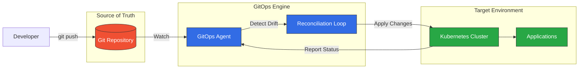
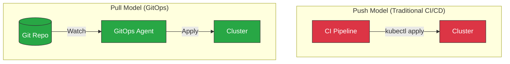
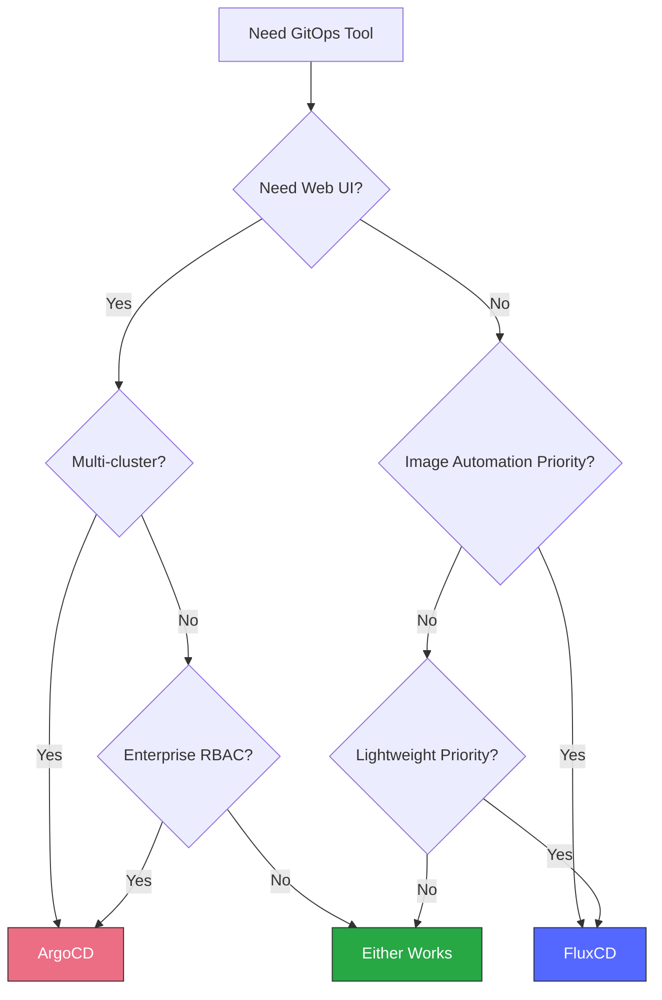
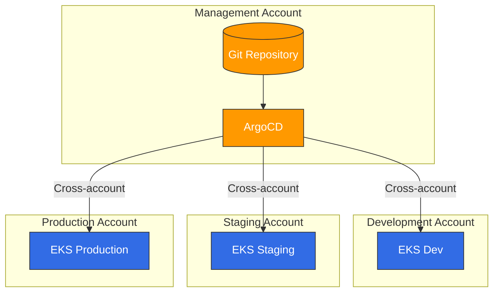

# GitOps

> **最后更新**: February 23, 2026

## 目录
- [什么是 GitOps？](#what-is-gitops)
- [核心原则](#core-principles)
- [Push 与 Pull 模型](#push-vs-pull-model)
- [GitOps 工具概览](#gitops-tools-overview)
- [工具选择指南](#tool-selection-guide)
- [Amazon EKS 上的 GitOps](#gitops-on-amazon-eks)
- [快速入门](#getting-started)

## 什么是 GitOps？

GitOps 是一个运营框架，将版本控制、协作、合规性和 CI/CD 等用于基础设施自动化的 DevOps 最佳实践应用于基础设施管理。该术语由 Weaveworks 于 2017 年提出，此后已成为 CNCF 认可的云原生应用部署方法论。

GitOps 的核心是使用 Git 仓库作为声明式基础设施和应用配置的唯一事实来源。通过 Git 提交对期望状态进行更改，自动化流程确保实际系统状态与声明状态一致。



### 历史与演进

| 年份 | 里程碑 |
|------|-----------|
| 2017 | Weaveworks 提出“GitOps”术语 |
| 2019 | Flux v1 发布，ArgoCD 开始流行 |
| 2020 | CNCF 接纳 Flux 为孵化项目 |
| 2021 | ArgoCD 成为 CNCF 毕业项目 |
| 2022 | GitOps 工作组发布原则 |
| 2023 | OpenGitOps 项目正式确立标准 |
| 2024 | GitOps 成为主流 K8s 部署模式 |

### CNCF OpenGitOps 定义

OpenGitOps 项目通过四项原则定义 GitOps：

1. **声明式**：由 GitOps 管理的系统必须以声明式方式表达其期望状态
2. **已版本控制且不可变**：期望状态以强制不可变性和版本控制的方式存储，并保留完整的版本历史记录
3. **自动拉取**：软件代理自动从源拉取期望状态声明
4. **持续协调**：软件代理持续观察实际系统状态，并尝试应用期望状态

## 核心原则

### 声明式配置

所有内容都定义为代码——基础设施、应用、策略和配置。这带来：

- **可复现性**：可从 Git 仓库重新创建任何环境
- **可审计性**：完整记录所有变更，包括谁、做了什么、何时以及为什么
- **一致性**：跨环境使用相同的配置

```yaml
# Example: Declarative application state
apiVersion: apps/v1
kind: Deployment
metadata:
  name: web-app
  labels:
    app: web-app
    version: v1.2.3
spec:
  replicas: 3
  selector:
    matchLabels:
      app: web-app
  template:
    metadata:
      labels:
        app: web-app
    spec:
      containers:
      - name: web-app
        image: myregistry/web-app:v1.2.3
        ports:
        - containerPort: 8080
```

### Git 作为唯一事实来源

Git 仓库存储整个系统的期望状态：

- **应用配置**
- **基础设施定义**
- **安全策略**
- **特定于环境的设置**

### 自动协调

GitOps 代理持续：

1. 监控 Git 仓库中的变更
2. 比较期望状态与实际状态
3. 应用更改，使系统符合期望状态
4. 报告状态和偏移

### 自愈系统

当实际状态偏离期望状态时（手动更改、故障等），GitOps 代理会自动恢复正确状态。

## Push 与 Pull 模型

GitOps 支持两种部署模型：



### Push 模型

在传统的 Push 模型中：
- CI/CD 流水线可直接访问集群
- 凭证存储在 CI 系统中
- 从集群外部推送更改

**缺点：**
- CI 系统中需要集群凭证
- 难以审计谁进行了更改
- 没有自动偏移检测

### Pull 模型（推荐）

在 GitOps Pull 模型中：
- 代理在集群内部运行
- 代理从 Git 拉取更改
- 无需外部集群访问

**优点：**
- 增强安全性（无外部凭证）
- Git 中保留完整审计记录
- 自动检测并修正偏移
- 可在防火墙后运行

## GitOps 工具概览

### ArgoCD

[ArgoCD](argocd/README.md) 是 Kubernetes 的声明式 GitOps 持续交付工具。

**主要功能：**
- 用于可视化的 Web UI
- 多集群支持
- SSO 集成
- 回滚功能
- 健康状态监控
- 用于集群管理的 ApplicationSet

**最适合：** 希望进行可视化管理、多集群部署以及需要企业功能的团队

### FluxCD

FluxCD 是一组面向 Kubernetes、开放且可扩展的持续交付解决方案。

**主要功能：**
- 轻量且模块化
- 原生 Helm 和 Kustomize 支持
- 镜像自动化
- 多租户
- 通知控制器

**最适合：** 偏好 CLI 优先的轻量级解决方案和镜像自动化工作流的团队

### Jenkins X

Jenkins X 为 Kubernetes 上的云原生应用提供 CI/CD。

**主要功能：**
- 自动化 CI/CD 流水线
- 预览环境
- GitOps 推进
- 基于 Tekton 的流水线

**最适合：** 深度投入 Jenkins 生态系统的团队

### 对比矩阵

| 功能 | ArgoCD | FluxCD | Jenkins X |
|---------|--------|--------|-----------|
| Web UI | ✅ 丰富 | ❌ 仅 CLI | ✅ 基础 |
| 多集群 | ✅ 原生 | ✅ 通过 Flux | ✅ 有限 |
| Helm 支持 | ✅ 完整 | ✅ 完整 | ✅ 完整 |
| Kustomize | ✅ 完整 | ✅ 完整 | ✅ 有限 |
| 镜像自动化 | ⚠️ 有限 | ✅ 原生 | ✅ 原生 |
| RBAC | ✅ 精细 | ⚠️ 基础 | ⚠️ 基础 |
| 通知 | ✅ 丰富 | ✅ 丰富 | ✅ 基础 |
| 学习曲线 | 中等 | 低 | 高 |
| 资源使用量 | 中等 | 低 | 高 |
| CNCF 状态 | 毕业 | 毕业 | Sandbox |

## 工具选择指南

### 在以下情况选择 ArgoCD：

- 需要用于运营的可视化仪表板
- 需要多集群管理
- 企业 SSO/RBAC 很重要
- 团队偏好基于 UI 的工作流
- 需要 ApplicationSet 进行集群管理

### 在以下情况选择 FluxCD：

- 偏好轻量、模块化的架构
- 镜像自动化是主要需求
- 偏好 CLI 优先的工作流
- 关注资源限制
- 需要与 Helm controller 紧密集成

### 决策框架



## Amazon EKS 上的 GitOps

### EKS 特定注意事项

在 Amazon EKS 上实施 GitOps 时：

#### IAM 集成

使用 IAM Roles for Service Accounts (IRSA) 进行安全的 AWS API 访问：

```yaml
apiVersion: v1
kind: ServiceAccount
metadata:
  name: gitops-controller
  annotations:
    eks.amazonaws.com/role-arn: arn:aws:iam::123456789012:role/GitOpsRole
```

#### 多账户架构



#### AWS 服务集成

GitOps 可通过以下方式管理 AWS 资源：

- **AWS Controllers for Kubernetes (ACK)**：用于 AWS 服务的原生 K8s CRD
- **Crossplane**：多云资源预置
- **Terraform Controller**：通过 GitOps 管理 Terraform 状态

### 推荐架构

```
├── infrastructure/
│   ├── base/                    # Shared infrastructure
│   │   ├── vpc/
│   │   ├── eks/
│   │   └── iam/
│   └── environments/
│       ├── dev/
│       ├── staging/
│       └── production/
├── applications/
│   ├── base/                    # Application base configs
│   └── overlays/
│       ├── dev/
│       ├── staging/
│       └── production/
└── platform/
    ├── argocd/                  # GitOps tooling
    ├── monitoring/              # Observability stack
    └── security/                # Security policies
```

## 快速入门

### ArgoCD 快速入门

1. **安装 ArgoCD：**
   ```bash
   kubectl create namespace argocd
   kubectl apply -n argocd -f https://raw.githubusercontent.com/argoproj/argo-cd/stable/manifests/install.yaml
   ```

2. **访问 UI：**
   ```bash
   kubectl port-forward svc/argocd-server -n argocd 8080:443
   ```

3. **获取初始密码：**
   ```bash
   kubectl -n argocd get secret argocd-initial-admin-secret -o jsonpath="{.data.password}" | base64 -d
   ```

有关 ArgoCD 设置的详细信息，请参阅 [ArgoCD 文档](argocd/README.md)。

### FluxCD 快速入门

1. **安装 Flux CLI：**
   ```bash
   curl -s https://fluxcd.io/install.sh | sudo bash
   ```

2. **引导 Flux：**
   ```bash
   flux bootstrap github \
     --owner=<org> \
     --repository=<repo> \
     --path=clusters/my-cluster
   ```

有关 FluxCD 设置的详细信息，请参阅 FluxCD 文档。

## 章节导航

| 主题 | 描述 |
|-------|-------------|
| [ArgoCD](argocd/README.md) | 包含安装、应用、同步策略等内容的完整 ArgoCD 指南 |
| [FluxCD](02-fluxcd.md) | FluxCD 设置、源控制器和镜像自动化 |

## 延伸阅读

- [CNCF GitOps 工作组](https://github.com/cncf/tag-app-delivery/tree/main/gitops-wg)
- [OpenGitOps 项目](https://opengitops.dev/)
- [GitOps 原则](https://www.gitops.tech/)

## 测验

为测试您的学习成果，请尝试以下测验：
- [ArgoCD 测验](../quizzes/gitops/01-argocd-quiz.md)
- [FluxCD 测验](../quizzes/gitops/02-fluxcd-quiz.md)
- [GitOps 对比测验](../quizzes/gitops/03-gitops-comparison-quiz.md)
