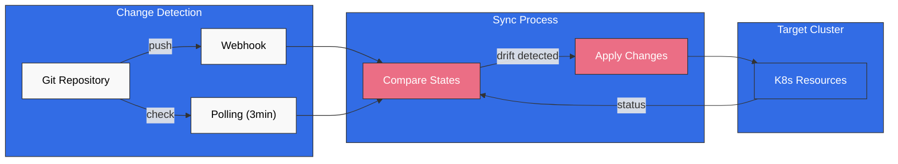
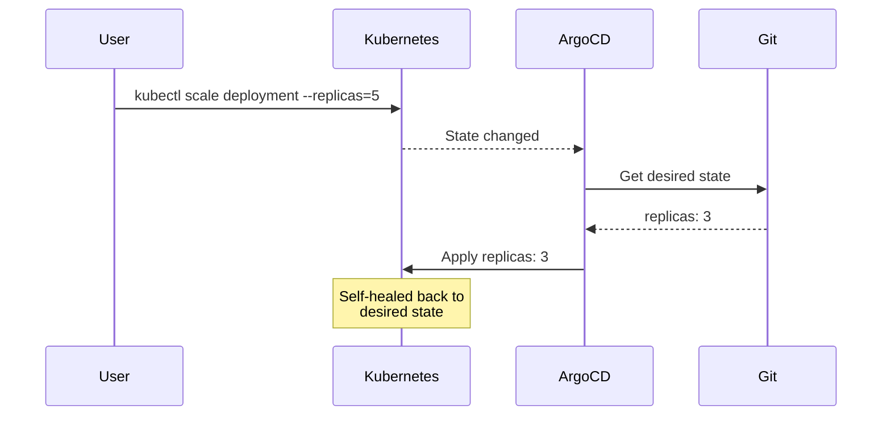
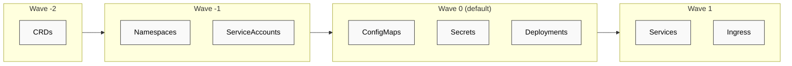
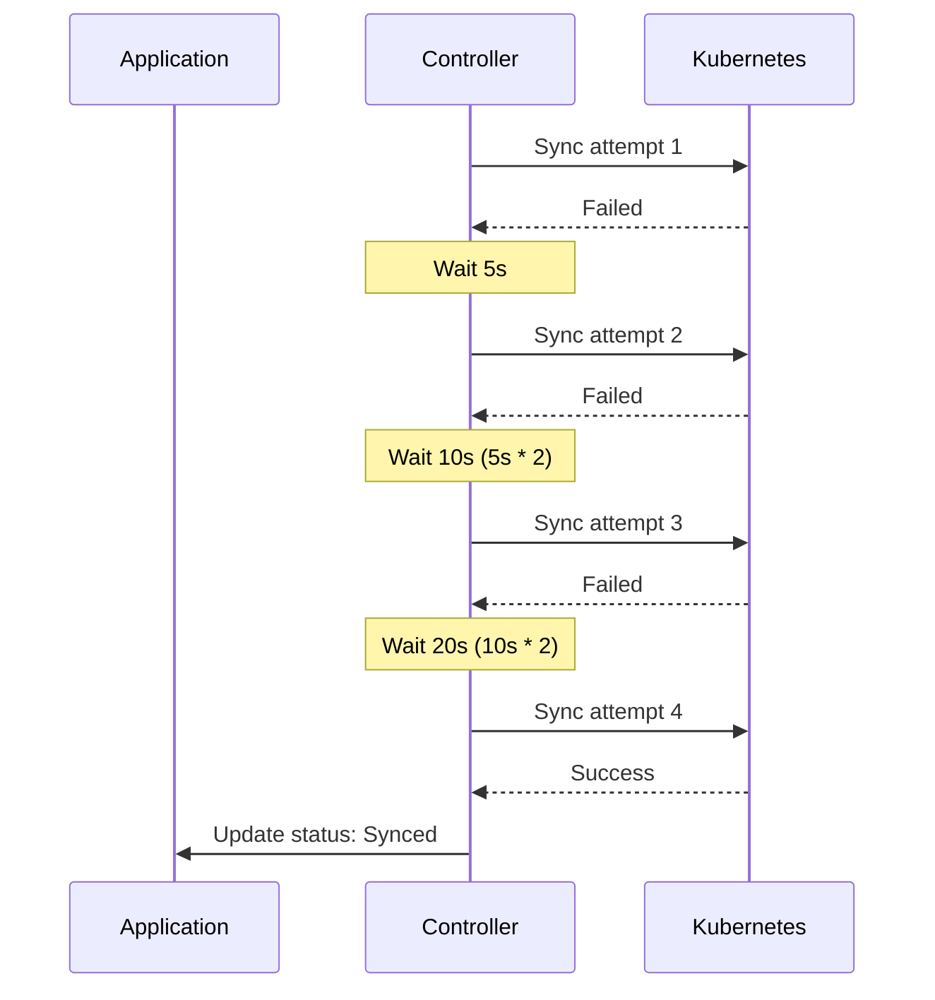

# ArgoCD 同步策略

> **支持的版本**: ArgoCD v2.9+
> **最后更新**: February 22, 2026

## 目录
- [手动同步与自动同步](#manual-vs-automated-sync)
- [自动同步策略](#auto-sync-policies)
- [同步选项](#sync-options)
- [同步波次和阶段](#sync-waves-and-phases)
- [同步窗口](#sync-windows)
- [差异比较自定义](#diffing-customization)
- [重试策略](#retry-policies)
- [选择性同步](#selective-sync)

## 手动同步与自动同步

ArgoCD 支持两种同步模式：手动和自动。

### 手动同步

在手动模式下，用户必须显式触发同步：

```yaml
apiVersion: argoproj.io/v1alpha1
kind: Application
metadata:
  name: manual-sync-app
  namespace: argocd
spec:
  project: default
  source:
    repoURL: https://github.com/myorg/myrepo.git
    targetRevision: HEAD
    path: manifests
  destination:
    server: https://kubernetes.default.svc
    namespace: my-app
  # No syncPolicy.automated = manual sync
```

触发手动同步：

```bash
# Via CLI
argocd app sync my-app

# Sync specific resources only
argocd app sync my-app --resource ':Deployment:my-deployment'

# Sync with options
argocd app sync my-app --prune --force
```

### 自动同步

在自动模式下，ArgoCD 会在检测到变更时自动同步：

```yaml
apiVersion: argoproj.io/v1alpha1
kind: Application
metadata:
  name: auto-sync-app
  namespace: argocd
spec:
  project: default
  source:
    repoURL: https://github.com/myorg/myrepo.git
    targetRevision: HEAD
    path: manifests
  destination:
    server: https://kubernetes.default.svc
    namespace: my-app
  syncPolicy:
    automated: {}  # Enable auto-sync with defaults
```



## 自动同步策略

### 清理

自动删除 Git 中不再存在的资源：

```yaml
syncPolicy:
  automated:
    prune: true
```

**使用场景**：确保集群状态与 Git 仓库完全一致。删除孤立资源。

**警告**：处理集群范围资源时需谨慎。使用 `PruneLast` 选项可实现更安全的清理。

### 自愈

自动还原对集群所做的手动更改：

```yaml
syncPolicy:
  automated:
    selfHeal: true
```

**使用场景**：防止手动 kubectl 更改或其他工具造成配置漂移。



### 允许为空

允许没有资源的应用程序：

```yaml
syncPolicy:
  automated:
    allowEmpty: true
```

**使用场景**：资源按条件生成的应用程序，或在初始设置期间使用。

### 完整自动同步配置

```yaml
apiVersion: argoproj.io/v1alpha1
kind: Application
metadata:
  name: fully-automated-app
  namespace: argocd
spec:
  project: default
  source:
    repoURL: https://github.com/myorg/myrepo.git
    targetRevision: HEAD
    path: manifests
  destination:
    server: https://kubernetes.default.svc
    namespace: my-app
  syncPolicy:
    automated:
      prune: true        # Remove orphaned resources
      selfHeal: true     # Revert manual changes
      allowEmpty: false  # Fail if no resources
```

## 同步选项

同步选项可对同步行为进行精细控制。

### 可用同步选项

| 选项 | 描述 | 默认值 |
|--------|-------------|---------|
| `Validate` | 根据架构验证资源 | true |
| `CreateNamespace` | 如果 namespace 不存在则创建 | false |
| `PrunePropagationPolicy` | 删除传播策略 | foreground |
| `PruneLast` | 在其他所有同步之后清理 | false |
| `Replace` | 使用 replace 而非 apply | false |
| `FailOnSharedResource` | 如果资源由其他位置管理则失败 | false |
| `ApplyOutOfSyncOnly` | 仅应用不同步的资源 | false |
| `ServerSideApply` | 使用服务器端 apply | false |
| `RespectIgnoreDifferences` | 在同步时遵循 ignoreDifferences | false |

### 应用程序级选项

```yaml
apiVersion: argoproj.io/v1alpha1
kind: Application
metadata:
  name: my-app
  namespace: argocd
spec:
  syncPolicy:
    syncOptions:
      - CreateNamespace=true
      - PrunePropagationPolicy=foreground
      - PruneLast=true
      - Validate=true
      - ApplyOutOfSyncOnly=true
```

### 资源级选项

通过注解将同步选项应用于特定资源：

```yaml
apiVersion: apps/v1
kind: Deployment
metadata:
  name: my-deployment
  annotations:
    argocd.argoproj.io/sync-options: Replace=true,Validate=false
spec:
  # ...
```

### 服务器端 Apply

使用 Kubernetes 服务器端 apply 以获得更好的冲突检测：

```yaml
syncPolicy:
  syncOptions:
    - ServerSideApply=true
```

或者按资源配置：

```yaml
metadata:
  annotations:
    argocd.argoproj.io/sync-options: ServerSideApply=true
```

**优势**：
- 更好的字段所有权跟踪
- 由 API server 检测合并冲突
- 可与 CRD 和 webhook 良好配合

### 强制替换

强制替换资源（适用于不可变字段）：

```yaml
metadata:
  annotations:
    argocd.argoproj.io/sync-options: Replace=true
```

**使用场景**：
- Job（不可变 spec）
- 更改 PVC storage class
- 不可变的 ConfigMap/Secret 字段

## 同步波次和阶段

同步波次控制资源的应用顺序。

### 波次的工作方式

资源按波次编号分组并依次同步：
1. 最低波次编号优先（可以为负数）
2. 在同一波次内，hook 先运行，然后是资源
3. 仅在前一波次完成后，才会开始下一波次



### 设置同步波次

```yaml
apiVersion: v1
kind: Namespace
metadata:
  name: my-app
  annotations:
    argocd.argoproj.io/sync-wave: "-2"
---
apiVersion: v1
kind: ServiceAccount
metadata:
  name: my-app
  namespace: my-app
  annotations:
    argocd.argoproj.io/sync-wave: "-1"
---
apiVersion: v1
kind: ConfigMap
metadata:
  name: my-config
  namespace: my-app
  annotations:
    argocd.argoproj.io/sync-wave: "0"
---
apiVersion: apps/v1
kind: Deployment
metadata:
  name: my-app
  namespace: my-app
  annotations:
    argocd.argoproj.io/sync-wave: "1"
---
apiVersion: v1
kind: Service
metadata:
  name: my-app
  namespace: my-app
  annotations:
    argocd.argoproj.io/sync-wave: "2"
```

### 将波次与 Hook 结合使用

```yaml
# PreSync hook in wave -5
apiVersion: batch/v1
kind: Job
metadata:
  name: db-init
  annotations:
    argocd.argoproj.io/hook: PreSync
    argocd.argoproj.io/sync-wave: "-5"
    argocd.argoproj.io/hook-delete-policy: HookSucceeded
spec:
  template:
    spec:
      containers:
        - name: init
          image: myapp/db-init:latest
          command: ["./init-db.sh"]
      restartPolicy: Never
---
# PreSync hook in wave -3 (runs after db-init)
apiVersion: batch/v1
kind: Job
metadata:
  name: db-migrate
  annotations:
    argocd.argoproj.io/hook: PreSync
    argocd.argoproj.io/sync-wave: "-3"
    argocd.argoproj.io/hook-delete-policy: HookSucceeded
spec:
  template:
    spec:
      containers:
        - name: migrate
          image: myapp/migrations:latest
          command: ["./migrate.sh"]
      restartPolicy: Never
```

### 完整排序示例

```yaml
# Order: CRDs -> Namespaces -> RBAC -> ConfigMaps -> Deployments -> Services -> Ingress

# Wave -5: Custom Resource Definitions
apiVersion: apiextensions.k8s.io/v1
kind: CustomResourceDefinition
metadata:
  name: myresources.example.com
  annotations:
    argocd.argoproj.io/sync-wave: "-5"
spec:
  group: example.com
  names:
    kind: MyResource
    plural: myresources
  scope: Namespaced
  versions:
    - name: v1
      served: true
      storage: true
      schema:
        openAPIV3Schema:
          type: object
---
# Wave -4: Namespace
apiVersion: v1
kind: Namespace
metadata:
  name: my-app
  annotations:
    argocd.argoproj.io/sync-wave: "-4"
---
# Wave -3: RBAC
apiVersion: v1
kind: ServiceAccount
metadata:
  name: my-app
  namespace: my-app
  annotations:
    argocd.argoproj.io/sync-wave: "-3"
---
apiVersion: rbac.authorization.k8s.io/v1
kind: Role
metadata:
  name: my-app
  namespace: my-app
  annotations:
    argocd.argoproj.io/sync-wave: "-3"
rules:
  - apiGroups: [""]
    resources: ["configmaps", "secrets"]
    verbs: ["get", "list", "watch"]
---
# Wave -2: Configuration
apiVersion: v1
kind: ConfigMap
metadata:
  name: my-config
  namespace: my-app
  annotations:
    argocd.argoproj.io/sync-wave: "-2"
data:
  config.yaml: |
    server:
      port: 8080
---
# Wave 0: Application (default)
apiVersion: apps/v1
kind: Deployment
metadata:
  name: my-app
  namespace: my-app
  # No wave annotation = wave 0
spec:
  replicas: 3
  selector:
    matchLabels:
      app: my-app
  template:
    metadata:
      labels:
        app: my-app
    spec:
      serviceAccountName: my-app
      containers:
        - name: app
          image: myapp:v1.0.0
          ports:
            - containerPort: 8080
---
# Wave 1: Networking
apiVersion: v1
kind: Service
metadata:
  name: my-app
  namespace: my-app
  annotations:
    argocd.argoproj.io/sync-wave: "1"
spec:
  selector:
    app: my-app
  ports:
    - port: 80
      targetPort: 8080
---
# Wave 2: External access
apiVersion: networking.k8s.io/v1
kind: Ingress
metadata:
  name: my-app
  namespace: my-app
  annotations:
    argocd.argoproj.io/sync-wave: "2"
spec:
  ingressClassName: nginx
  rules:
    - host: myapp.example.com
      http:
        paths:
          - path: /
            pathType: Prefix
            backend:
              service:
                name: my-app
                port:
                  number: 80
```

## 同步窗口

同步窗口限制应用程序可以进行同步的时间。

### 允许窗口

仅允许在特定时间内同步：

```yaml
apiVersion: argoproj.io/v1alpha1
kind: AppProject
metadata:
  name: production
  namespace: argocd
spec:
  syncWindows:
    # Allow sync weekdays 9am-5pm UTC
    - kind: allow
      schedule: '0 9 * * 1-5'
      duration: 8h
      applications:
        - '*'
      namespaces:
        - 'production'
      clusters:
        - 'https://production-cluster'

    # Allow emergency sync window (can be manually activated)
    - kind: allow
      schedule: '0 0 * * *'
      duration: 24h
      applications:
        - '*'
      manualSync: true
```

### 拒绝窗口

在特定时间内阻止同步：

```yaml
apiVersion: argoproj.io/v1alpha1
kind: AppProject
metadata:
  name: production
  namespace: argocd
spec:
  syncWindows:
    # Deny sync during peak hours
    - kind: deny
      schedule: '0 12 * * *'
      duration: 2h
      applications:
        - 'critical-*'

    # Deny sync during weekends
    - kind: deny
      schedule: '0 0 * * 0,6'
      duration: 24h
      applications:
        - '*'
      namespaces:
        - 'production'
```

### 窗口配置

```yaml
syncWindows:
  - kind: allow                    # allow or deny
    schedule: '0 22 * * *'         # Cron expression (UTC)
    duration: 1h                   # Duration: Ns, Nm, Nh
    applications:                  # Application name patterns
      - 'prod-*'
      - 'frontend'
    namespaces:                    # Target namespaces
      - 'production'
    clusters:                      # Target clusters
      - 'https://production.k8s'
    manualSync: false              # Allow manual sync override
    timeZone: 'America/New_York'   # Optional timezone (default UTC)
```

### 覆盖同步窗口

对于紧急情况，手动同步可以覆盖拒绝窗口：

```bash
# Force sync even in deny window (requires manualSync: true in allow window)
argocd app sync my-app --force
```

## 差异比较自定义

### 忽略差异

配置 ArgoCD 以忽略特定字段：

```yaml
apiVersion: argoproj.io/v1alpha1
kind: Application
metadata:
  name: my-app
  namespace: argocd
spec:
  ignoreDifferences:
    # Ignore all annotations
    - group: ""
      kind: Service
      jsonPointers:
        - /metadata/annotations

    # Ignore specific field by JQ expression
    - group: apps
      kind: Deployment
      jqPathExpressions:
        - .spec.template.spec.containers[].resources

    # Ignore for specific named resource
    - group: apps
      kind: Deployment
      name: my-deployment
      namespace: production
      jsonPointers:
        - /spec/replicas

    # Ignore managed fields from specific controllers
    - group: "*"
      kind: "*"
      managedFieldsManagers:
        - kube-controller-manager
        - cluster-autoscaler
```

### 全局差异比较配置

在 `argocd-cm` 中：

```yaml
apiVersion: v1
kind: ConfigMap
metadata:
  name: argocd-cm
  namespace: argocd
data:
  # Ignore aggregated cluster roles
  resource.compareoptions: |
    ignoreAggregatedRoles: true

  # Global ignore patterns
  resource.customizations.ignoreDifferences.all: |
    managedFieldsManagers:
      - kube-controller-manager
    jsonPointers:
      - /metadata/annotations/kubectl.kubernetes.io~1last-applied-configuration

  # Ignore for specific resource type
  resource.customizations.ignoreDifferences.admissionregistration.k8s.io_MutatingWebhookConfiguration: |
    jqPathExpressions:
      - .webhooks[]?.clientConfig.caBundle
```

### 忽略资源状态

忽略所有 status 字段：

```yaml
resource.compareoptions: |
  ignoreResourceStatusField: all
```

或者针对特定 kind：

```yaml
resource.compareoptions: |
  ignoreResourceStatusField: crd
```

## 重试策略

配置在同步失败时自动重试。

### 基本重试配置

```yaml
apiVersion: argoproj.io/v1alpha1
kind: Application
metadata:
  name: my-app
  namespace: argocd
spec:
  syncPolicy:
    retry:
      limit: 5          # Maximum retry attempts
      backoff:
        duration: 5s    # Initial delay
        factor: 2       # Multiplier for each retry
        maxDuration: 3m # Maximum delay
```

### 重试流程



### 仅针对特定错误重试

目前，ArgoCD 会在所有同步失败时重试。如需精细控制，请使用 hook：

```yaml
apiVersion: batch/v1
kind: Job
metadata:
  name: check-prerequisites
  annotations:
    argocd.argoproj.io/hook: PreSync
    argocd.argoproj.io/hook-delete-policy: BeforeHookCreation
spec:
  backoffLimit: 5  # Job-level retries
  template:
    spec:
      containers:
        - name: check
          image: busybox
          command:
            - sh
            - -c
            - |
              # Check if external dependency is ready
              until nc -z external-service 443; do
                echo "Waiting for external-service..."
                sleep 5
              done
              echo "Prerequisites met"
      restartPolicy: Never
```

## 选择性同步

仅同步应用程序中的特定资源。

### 通过 CLI

```bash
# Sync specific resource by kind and name
argocd app sync my-app --resource ':Deployment:my-deployment'

# Sync resources by group
argocd app sync my-app --resource 'apps:Deployment:*'

# Sync multiple resources
argocd app sync my-app \
  --resource ':ConfigMap:my-config' \
  --resource ':Secret:my-secret' \
  --resource 'apps:Deployment:my-deployment'

# Sync by label
argocd app sync my-app --label 'app.kubernetes.io/component=backend'
```

### 选择性同步的同步选项

```bash
# Apply only out-of-sync resources
argocd app sync my-app --apply-out-of-sync-only

# Preview what would be synced
argocd app sync my-app --dry-run

# Sync with prune
argocd app sync my-app --prune
```

### 资源路径格式

```
<group>:<kind>:<name>

Examples:
:ConfigMap:my-config                 # Core API group
apps:Deployment:my-deployment        # apps API group
networking.k8s.io:Ingress:my-ingress # networking.k8s.io group
*:*:*                                # All resources
```

## 测验

要测试所学知识，请尝试 [ArgoCD 同步策略测验](../../quizzes/gitops/argocd/03-sync-strategies-quiz.md)。
