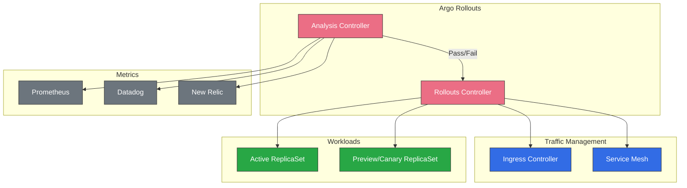
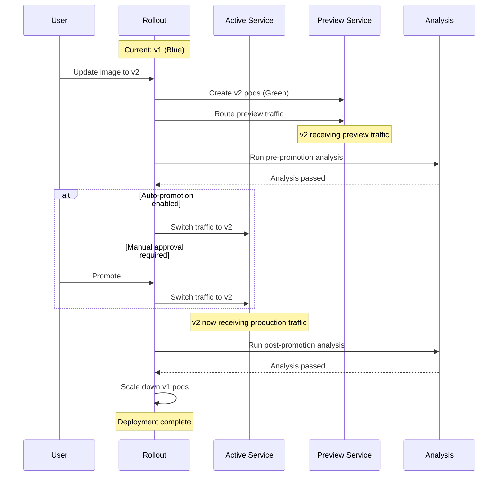
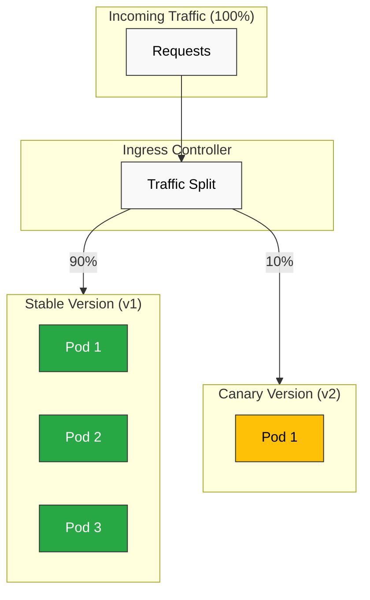

# ArgoCD 流量管理

> **支持的版本**：Argo Rollouts v1.6+，ArgoCD v2.9+
> **最后更新**：July 15, 2026

## 目录
- [Argo Rollouts 概述](#argo-rollouts-overview)
- [安装](#installation)
- [蓝绿部署](#blue-green-deployments)
- [金丝雀部署](#canary-deployments)
- [分析与验证](#analysis-and-verification)
- [Ingress 集成](#ingress-integration)
- [回滚策略](#rollback-strategies)
- [实验](#experiments)
- [通知](#notifications)

## Argo Rollouts 概述

Argo Rollouts 是一个 Kubernetes 控制器，提供高级部署功能，包括蓝绿部署、金丝雀部署和渐进式交付功能。

### 为什么选择 Argo Rollouts？

标准 Kubernetes Deployment 仅支持滚动更新。Argo Rollouts 在此基础上扩展了以下功能：

| 功能 | K8s Deployment | Argo Rollouts |
|---------|----------------|---------------|
| 滚动更新 | 是 | 是 |
| 蓝绿 | 否 | 是 |
| 金丝雀 | 否 | 是 |
| 流量分割 | 否 | 是 |
| 自动回滚 | 否 | 是 |
| 分析/验证 | 否 | 是 |
| 暂停/恢复 | 否 | 是 |
| 实验 | 否 | 是 |

### 架构



## 安装

### 安装 Argo Rollouts Controller

```bash
# Create namespace
kubectl create namespace argo-rollouts

# Install controller
kubectl apply -n argo-rollouts -f https://github.com/argoproj/argo-rollouts/releases/latest/download/install.yaml

# Verify installation
kubectl get pods -n argo-rollouts
```

### 安装 kubectl 插件

```bash
# macOS
brew install argoproj/tap/kubectl-argo-rollouts

# Linux
curl -LO https://github.com/argoproj/argo-rollouts/releases/latest/download/kubectl-argo-rollouts-linux-amd64
chmod +x kubectl-argo-rollouts-linux-amd64
sudo mv kubectl-argo-rollouts-linux-amd64 /usr/local/bin/kubectl-argo-rollouts

# Verify
kubectl argo rollouts version
```

### 通过 Helm 安装

```bash
helm repo add argo https://argoproj.github.io/argo-helm
helm repo update

helm install argo-rollouts argo/argo-rollouts \
  --namespace argo-rollouts \
  --create-namespace \
  --set dashboard.enabled=true
```

### 用于生产环境的 Helm Values

```yaml
controller:
  replicas: 2
  metrics:
    enabled: true
    serviceMonitor:
      enabled: true

dashboard:
  enabled: true
  ingress:
    enabled: true
    ingressClassName: nginx
    hosts:
      - rollouts.example.com
```

## 蓝绿部署

蓝绿部署维护两个相同的环境，并在它们之间切换流量。

### 基础蓝绿 Rollout

```yaml
apiVersion: argoproj.io/v1alpha1
kind: Rollout
metadata:
  name: myapp
  namespace: myapp
spec:
  replicas: 5
  revisionHistoryLimit: 3
  selector:
    matchLabels:
      app: myapp
  template:
    metadata:
      labels:
        app: myapp
    spec:
      containers:
        - name: myapp
          image: myregistry/myapp:v1.0.0
          ports:
            - containerPort: 8080
          readinessProbe:
            httpGet:
              path: /health
              port: 8080
            initialDelaySeconds: 5
            periodSeconds: 10
          resources:
            requests:
              cpu: 100m
              memory: 128Mi
            limits:
              cpu: 500m
              memory: 512Mi
  strategy:
    blueGreen:
      activeService: myapp-active
      previewService: myapp-preview
      autoPromotionEnabled: false
      scaleDownDelaySeconds: 30
      previewReplicaCount: 2
      prePromotionAnalysis:
        templates:
          - templateName: smoke-tests
        args:
          - name: service-name
            value: myapp-preview
      postPromotionAnalysis:
        templates:
          - templateName: success-rate
---
apiVersion: v1
kind: Service
metadata:
  name: myapp-active
  namespace: myapp
spec:
  selector:
    app: myapp
  ports:
    - port: 80
      targetPort: 8080
---
apiVersion: v1
kind: Service
metadata:
  name: myapp-preview
  namespace: myapp
spec:
  selector:
    app: myapp
  ports:
    - port: 80
      targetPort: 8080
```

### 蓝绿流程



### 启用自动提升的蓝绿部署

```yaml
strategy:
  blueGreen:
    activeService: myapp-active
    previewService: myapp-preview
    autoPromotionEnabled: true
    autoPromotionSeconds: 60  # Wait 60s before auto-promoting
    previewReplicaCount: 3
```

## 金丝雀部署

金丝雀部署会逐步将流量转移到新版本。

### 基础金丝雀 Rollout

```yaml
apiVersion: argoproj.io/v1alpha1
kind: Rollout
metadata:
  name: myapp-canary
  namespace: myapp
spec:
  replicas: 10
  selector:
    matchLabels:
      app: myapp
  template:
    metadata:
      labels:
        app: myapp
    spec:
      containers:
        - name: myapp
          image: myregistry/myapp:v1.0.0
          ports:
            - containerPort: 8080
  strategy:
    canary:
      canaryService: myapp-canary
      stableService: myapp-stable
      trafficRouting:
        nginx:
          stableIngress: myapp-ingress
      steps:
        # Step 1: 5% traffic to canary
        - setWeight: 5
        - pause: {duration: 2m}

        # Step 2: 10% traffic, run analysis
        - setWeight: 10
        - analysis:
            templates:
              - templateName: success-rate
            args:
              - name: service-name
                value: myapp-canary

        # Step 3: 25% traffic
        - setWeight: 25
        - pause: {duration: 5m}

        # Step 4: 50% traffic
        - setWeight: 50
        - pause: {duration: 5m}

        # Step 5: 75% traffic
        - setWeight: 75
        - analysis:
            templates:
              - templateName: success-rate
              - templateName: latency-check

        # Step 6: 100% traffic (full promotion)
        - setWeight: 100
---
apiVersion: v1
kind: Service
metadata:
  name: myapp-stable
  namespace: myapp
spec:
  selector:
    app: myapp
  ports:
    - port: 80
      targetPort: 8080
---
apiVersion: v1
kind: Service
metadata:
  name: myapp-canary
  namespace: myapp
spec:
  selector:
    app: myapp
  ports:
    - port: 80
      targetPort: 8080
```

### 金丝雀步骤说明

| 步骤类型 | 说明 |
|-----------|-------------|
| `setWeight` | 将流量百分比设置为金丝雀 |
| `pause` | 等待指定时长或手动批准 |
| `analysis` | 运行 AnalysisTemplate |
| `setCanaryScale` | 设置金丝雀副本数 |
| `setHeaderRoute` | 按请求头路由（适用于流量路由器） |

### 带手动关卡的金丝雀部署

```yaml
strategy:
  canary:
    steps:
      - setWeight: 10
      - pause: {}  # Indefinite pause - requires manual promotion

      - setWeight: 50
      - pause: {duration: 10m}

      - setWeight: 100
```

手动提升：

```bash
# Promote to next step
kubectl argo rollouts promote myapp-canary

# Promote fully (skip remaining steps)
kubectl argo rollouts promote myapp-canary --full
```

### 金丝雀流量流程



## 分析与验证

AnalysisTemplate 定义了如何验证部署健康状况。

### Prometheus 分析

```yaml
apiVersion: argoproj.io/v1alpha1
kind: AnalysisTemplate
metadata:
  name: success-rate
  namespace: myapp
spec:
  args:
    - name: service-name
  metrics:
    - name: success-rate
      interval: 1m
      count: 5
      successCondition: result[0] >= 0.95
      failureLimit: 3
      provider:
        prometheus:
          address: http://prometheus.monitoring:9090
          query: |
            sum(rate(
              http_requests_total{
                service="{{args.service-name}}",
                status=~"2.."
              }[5m]
            )) /
            sum(rate(
              http_requests_total{
                service="{{args.service-name}}"
              }[5m]
            ))
```

### 延迟分析

```yaml
apiVersion: argoproj.io/v1alpha1
kind: AnalysisTemplate
metadata:
  name: latency-check
  namespace: myapp
spec:
  args:
    - name: service-name
  metrics:
    - name: p99-latency
      interval: 2m
      count: 3
      successCondition: result[0] < 500  # 500ms threshold
      failureLimit: 2
      provider:
        prometheus:
          address: http://prometheus.monitoring:9090
          query: |
            histogram_quantile(0.99,
              sum(rate(
                http_request_duration_seconds_bucket{
                  service="{{args.service-name}}"
                }[5m]
              )) by (le)
            ) * 1000
```

### Web 分析（HTTP 端点）

```yaml
apiVersion: argoproj.io/v1alpha1
kind: AnalysisTemplate
metadata:
  name: smoke-tests
  namespace: myapp
spec:
  args:
    - name: service-name
  metrics:
    - name: smoke-test
      interval: 30s
      count: 3
      successCondition: result.status == "healthy"
      failureLimit: 1
      provider:
        web:
          url: "http://{{args.service-name}}/health"
          jsonPath: "{$.status}"
          timeoutSeconds: 10
```

### Datadog 分析

```yaml
apiVersion: argoproj.io/v1alpha1
kind: AnalysisTemplate
metadata:
  name: datadog-success-rate
  namespace: myapp
spec:
  args:
    - name: service-name
  metrics:
    - name: error-rate
      interval: 5m
      count: 3
      successCondition: result < 0.05
      failureLimit: 2
      provider:
        datadog:
          apiVersion: v2
          interval: 5m
          query: |
            sum:http.requests{service:{{args.service-name}},status:5xx}.as_count() /
            sum:http.requests{service:{{args.service-name}}}.as_count()
```

### 基于 Job 的分析

```yaml
apiVersion: argoproj.io/v1alpha1
kind: AnalysisTemplate
metadata:
  name: integration-tests
  namespace: myapp
spec:
  args:
    - name: service-url
  metrics:
    - name: integration-tests
      provider:
        job:
          spec:
            backoffLimit: 1
            template:
              spec:
                restartPolicy: Never
                containers:
                  - name: test-runner
                    image: myregistry/integration-tests:latest
                    env:
                      - name: TARGET_URL
                        value: "{{args.service-url}}"
                    command:
                      - /bin/sh
                      - -c
                      - |
                        npm run test:integration
                        if [ $? -eq 0 ]; then
                          exit 0
                        else
                          exit 1
                        fi
```

### ClusterAnalysisTemplate

在命名空间之间共享分析模板：

```yaml
apiVersion: argoproj.io/v1alpha1
kind: ClusterAnalysisTemplate
metadata:
  name: global-success-rate
spec:
  args:
    - name: service-name
    - name: namespace
  metrics:
    - name: success-rate
      interval: 1m
      count: 5
      successCondition: result[0] >= 0.95
      provider:
        prometheus:
          address: http://prometheus.monitoring:9090
          query: |
            sum(rate(
              http_requests_total{
                namespace="{{args.namespace}}",
                service="{{args.service-name}}",
                status=~"2.."
              }[5m]
            )) /
            sum(rate(
              http_requests_total{
                namespace="{{args.namespace}}",
                service="{{args.service-name}}"
              }[5m]
            ))
```

## Ingress 集成

Argo Rollouts 支持超过 10 种流量提供商。对于没有原生集成的提供商（例如 Kong），则通过 **Gateway API plugin** 提供支持。

| 提供商 | 集成 | 说明 |
|---|---|---|
| NGINX Ingress | 原生（`trafficRouting.nginx`） | 直接操作 `canary-weight` annotation |
| AWS ALB | 原生（`trafficRouting.alb`） | Ingress backend port 必须为 `use-annotation` —— 请参阅[验证结果](#verification-results-on-eks) |
| Istio | 原生（`trafficRouting.istio`） | 直接操作 VirtualService/DestinationRule |
| SMI | 原生（`trafficRouting.smi`） | SMI 项目本身实际上已无人维护——不建议新项目采用 |
| Ambassador、Apache APISIX、Traefik、Google Cloud | 原生 | 本文未涵盖——请参阅[官方文档](https://argo-rollouts.readthedocs.io/en/stable/features/traffic-management/) |
| **Kong** 和其他符合 Gateway API 的实现（kgateway 等） | **Gateway API plugin**（`trafficRouting.plugins`） | 没有原生的 `trafficRouting.kong` 字段 |

### NGINX Ingress

```yaml
apiVersion: argoproj.io/v1alpha1
kind: Rollout
metadata:
  name: myapp
  namespace: myapp
spec:
  strategy:
    canary:
      stableService: myapp-stable
      canaryService: myapp-canary
      trafficRouting:
        nginx:
          stableIngress: myapp-ingress
          additionalIngressAnnotations:
            canary-by-header: X-Canary
            canary-by-header-value: "true"
      steps:
        - setWeight: 10
        - pause: {duration: 5m}
        - setWeight: 50
        - pause: {duration: 5m}
        - setWeight: 100
---
apiVersion: networking.k8s.io/v1
kind: Ingress
metadata:
  name: myapp-ingress
  namespace: myapp
  annotations:
    nginx.ingress.kubernetes.io/rewrite-target: /
spec:
  ingressClassName: nginx
  rules:
    - host: myapp.example.com
      http:
        paths:
          - path: /
            pathType: Prefix
            backend:
              service:
                name: myapp-stable
                port:
                  number: 80
```

### AWS ALB Ingress

```yaml
apiVersion: argoproj.io/v1alpha1
kind: Rollout
metadata:
  name: myapp
  namespace: myapp
spec:
  strategy:
    canary:
      stableService: myapp-stable
      canaryService: myapp-canary
      trafficRouting:
        alb:
          ingress: myapp-ingress
          rootService: myapp-root
          servicePort: 80
      steps:
        - setWeight: 10
        - pause: {duration: 5m}
        - setWeight: 50
        - pause: {duration: 5m}
        - setWeight: 100
---
apiVersion: networking.k8s.io/v1
kind: Ingress
metadata:
  name: myapp-ingress
  namespace: myapp
  annotations:
    kubernetes.io/ingress.class: alb
    alb.ingress.kubernetes.io/scheme: internet-facing
    alb.ingress.kubernetes.io/target-type: ip
    alb.ingress.kubernetes.io/actions.myapp-root: |
      {
        "type": "forward",
        "forwardConfig": {
          "targetGroups": [
            {
              "serviceName": "myapp-stable",
              "servicePort": 80,
              "weight": 100
            },
            {
              "serviceName": "myapp-canary",
              "servicePort": 80,
              "weight": 0
            }
          ]
        }
      }
spec:
  rules:
    - host: myapp.example.com
      http:
        paths:
          - path: /
            pathType: Prefix
            backend:
              service:
                name: myapp-root
                port:
                  name: use-annotation
```

> ⚠️ **已在测试中验证**：如果 Ingress backend port 被意外设置为真实端口号（例如 `number: 80`），而不是 `name: use-annotation`，AWS Load Balancer Controller 会**静默忽略** `alb.ingress.kubernetes.io/actions.*` annotation——不会报错，也不会警告。它会保留普通的单 target group 规则，而不是加权转发规则，因此 `kubectl get rollout` 会显示 `SetWeight` 正常递增，但实际 ALB 流量实际上从未转移。务必使用 `aws elbv2 describe-rules` 对照实时 listener rule 的 `ForwardConfig.TargetGroups` 权重。

### Istio 流量分割

```yaml
apiVersion: argoproj.io/v1alpha1
kind: Rollout
metadata:
  name: myapp
  namespace: myapp
spec:
  strategy:
    canary:
      stableService: myapp-stable
      canaryService: myapp-canary
      trafficRouting:
        istio:
          virtualService:
            name: myapp-vsvc
            routes:
              - primary
          destinationRule:
            name: myapp-destrule
            canarySubsetName: canary
            stableSubsetName: stable
      steps:
        - setWeight: 10
        - pause: {duration: 5m}
        - setWeight: 50
        - pause: {duration: 5m}
        - setWeight: 100
---
apiVersion: networking.istio.io/v1beta1
kind: VirtualService
metadata:
  name: myapp-vsvc
  namespace: myapp
spec:
  hosts:
    - myapp.example.com
  gateways:
    - myapp-gateway
  http:
    - name: primary
      route:
        - destination:
            host: myapp-stable
          weight: 100
        - destination:
            host: myapp-canary
          weight: 0
---
apiVersion: networking.istio.io/v1beta1
kind: DestinationRule
metadata:
  name: myapp-destrule
  namespace: myapp
spec:
  host: myapp
  subsets:
    - name: stable
      labels:
        app: myapp
    - name: canary
      labels:
        app: myapp
```

### Gateway API Plugin（通用）

没有原生 Argo Rollouts 集成、但符合 Gateway API 的实现——Kong、Traefik、kgateway 及其他实现——可通过由 argoproj-labs 维护的 [Gateway API plugin](https://github.com/argoproj-labs/rollouts-plugin-trafficrouter-gatewayapi) 获得支持。该 plugin 直接操作标准 `HTTPRoute` 的 `backendRefs[].weight` 字段，因此它同样适用于实现 Gateway API 的任何控制器。它还支持 TLSRoute 和基于请求头的路由；截至 2026 年，最新版本为 v0.16.0。

通过在 `argo-rollouts-config` ConfigMap 中注册 plugin 来安装它，以便 Controller 在启动时下载二进制文件：

```yaml
apiVersion: v1
kind: ConfigMap
metadata:
  name: argo-rollouts-config
  namespace: argo-rollouts
data:
  trafficRouterPlugins: |-
    - name: "argoproj-labs/gatewayAPI"
      location: "https://github.com/argoproj-labs/rollouts-plugin-trafficrouter-gatewayapi/releases/download/v0.16.0/gatewayapi-plugin-linux-amd64"
---
apiVersion: rbac.authorization.k8s.io/v1
kind: ClusterRole
metadata:
  name: argo-rollouts-gateway-api-plugin
rules:
  - apiGroups: [""]
    resources: ["services"]
    verbs: ["get"]
  - apiGroups: ["gateway.networking.k8s.io"]
    resources: ["httproutes", "grpcroutes", "tcproutes", "tlsroutes"]
    verbs: ["get", "list", "update", "patch"]
---
apiVersion: rbac.authorization.k8s.io/v1
kind: ClusterRoleBinding
metadata:
  name: argo-rollouts-gateway-api-plugin
roleRef:
  apiGroup: rbac.authorization.k8s.io
  kind: ClusterRole
  name: argo-rollouts-gateway-api-plugin
subjects:
  - kind: ServiceAccount
    name: argo-rollouts
    namespace: argo-rollouts
```

Rollout 通过 `trafficRouting.plugins` 引用 HTTPRoute：

```yaml
apiVersion: argoproj.io/v1alpha1
kind: Rollout
metadata:
  name: myapp
  namespace: myapp
spec:
  replicas: 5
  selector:
    matchLabels:
      app: myapp
  template:
    metadata:
      labels:
        app: myapp
    spec:
      containers:
        - name: app
          image: myapp:v2.0.0
          ports:
            - containerPort: 8080
  strategy:
    canary:
      stableService: myapp-stable
      canaryService: myapp-canary
      trafficRouting:
        plugins:
          argoproj-labs/gatewayAPI:
            httpRoute: myapp-route
            namespace: myapp
      steps:
        - setWeight: 20
        - pause: {duration: 1m}
        - setWeight: 50
        - pause: {duration: 1m}
        - setWeight: 100
---
apiVersion: gateway.networking.k8s.io/v1
kind: HTTPRoute
metadata:
  name: myapp-route
  namespace: myapp
spec:
  parentRefs:
    - name: myapp-gateway
  rules:
    - backendRefs:
        - name: myapp-stable
          kind: Service
          port: 80
          weight: 100
        - name: myapp-canary
          kind: Service
          port: 80
          weight: 0
```

在每个 `setWeight` 步骤中，plugin 会直接更新这两个 `backendRefs[].weight` 值。

### Kong（通过 Gateway API Plugin）

Kong Ingress Controller（KIC）没有原生 Argo Rollouts 集成——它使用上面的 Gateway API plugin。在 Gateway API 模式下安装 KIC 后，必须将 GatewayClass 标记为**非托管 Gateway**：

```yaml
apiVersion: gateway.networking.k8s.io/v1
kind: GatewayClass
metadata:
  name: kong
  annotations:
    konghq.com/gatewayclass-unmanaged: "true"   # required — without it the Gateway stays stuck on "Waiting for controller"
spec:
  controllerName: konghq.com/kic-gateway-controller   # note: different from KIC's IngressClass controller string
```

接下来，应用与上述相同的 [Gateway API plugin](#gateway-api-plugin-universal) 配置——Rollout 和 HTTPRoute YAML 完全相同。

### EKS 上的验证结果

我们在 EKS 1.36 集群（Argo Rollouts v1.9.0、AWS Load Balancer Controller v3.2.1、Istio 1.30、Kong Ingress Controller 3.5 + Gateway API plugin v0.16.0）的隔离测试命名空间中验证了全部四种提供商。验证完成后，所有测试资源（命名空间、Helm release、ALB、GatewayClass）均已拆除。

| 提供商 | 检查内容 | 结果 |
|---|---|---|
| NGINX | `canary-weight` annotation 从 20→50→100% 的转换 | ✅ 已确认——实时 curl 流量比例与 annotation 值一致 |
| Istio | VirtualService weight 从 20→50→100% 的转换，以及执行 `abort` 时立即恢复至 0% | ✅ 已确认——curl 比例与 weight 一致，且中止后流量立即回退到此前的稳定版本 |
| AWS ALB | listener rule forward weight 转换，并通过 `aws elbv2 describe-rules` 与实时 AWS 状态交叉核对 | ✅ 已确认（但需要注意上述 [`use-annotation` 限制](#aws-alb-ingress)） |
| Kong（Gateway API plugin） | `HTTPRoute.backendRefs[].weight` 转换，以及通过 Kong data plane 的真实流量 | ✅ 已确认——但 `gatewayclass-unmanaged` annotation 和精确的 `controllerName` 很容易配置错误（见上文） |

## 回滚策略

### 分析失败时自动回滚

```yaml
strategy:
  canary:
    steps:
      - setWeight: 10
      - analysis:
          templates:
            - templateName: success-rate
          args:
            - name: service-name
              value: myapp-canary
    # Analysis failure automatically triggers rollback
```

### 手动回滚

```bash
# Abort current rollout and rollback
kubectl argo rollouts abort myapp

# Undo to previous version
kubectl argo rollouts undo myapp

# Undo to specific revision
kubectl argo rollouts undo myapp --to-revision=2
```

### 回滚配置

```yaml
spec:
  strategy:
    canary:
      abortScaleDownDelaySeconds: 30
      dynamicStableScale: true
      steps:
        - setWeight: 10
        - analysis:
            templates:
              - templateName: success-rate
            # Analysis runs continuously
            # Failure at any point triggers rollback
```

## 实验

同时使用多个版本运行 A/B 测试。

```yaml
apiVersion: argoproj.io/v1alpha1
kind: Experiment
metadata:
  name: myapp-experiment
  namespace: myapp
spec:
  duration: 1h
  progressDeadlineSeconds: 300
  templates:
    - name: baseline
      replicas: 2
      selector:
        matchLabels:
          app: myapp
          variant: baseline
      template:
        metadata:
          labels:
            app: myapp
            variant: baseline
        spec:
          containers:
            - name: myapp
              image: myregistry/myapp:v1.0.0
              ports:
                - containerPort: 8080
    - name: canary
      replicas: 2
      selector:
        matchLabels:
          app: myapp
          variant: canary
      template:
        metadata:
          labels:
            app: myapp
            variant: canary
        spec:
          containers:
            - name: myapp
              image: myregistry/myapp:v2.0.0
              ports:
                - containerPort: 8080
  analyses:
    - name: compare-metrics
      templateName: compare-experiment
      args:
        - name: baseline-hash
          valueFrom:
            podTemplateHashValue: baseline
        - name: canary-hash
          valueFrom:
            podTemplateHashValue: canary
```

## 通知

将 Rollout 事件与通知系统集成。

### 在 Rollout 中配置通知

```yaml
apiVersion: argoproj.io/v1alpha1
kind: Rollout
metadata:
  name: myapp
  namespace: myapp
  annotations:
    notifications.argoproj.io/subscribe.on-rollout-completed.slack: deployments
    notifications.argoproj.io/subscribe.on-rollout-aborted.slack: deployments
    notifications.argoproj.io/subscribe.on-analysis-run-failed.slack: alerts
spec:
  # ...
```

### 通知触发器和模板

```yaml
apiVersion: v1
kind: ConfigMap
metadata:
  name: argo-rollouts-notification-configmap
  namespace: argo-rollouts
data:
  service.slack: |
    token: $slack-token

  trigger.on-rollout-completed: |
    - when: rollout.status.phase == 'Healthy'
      send: [rollout-completed]

  trigger.on-rollout-aborted: |
    - when: rollout.status.phase == 'Degraded'
      send: [rollout-aborted]

  template.rollout-completed: |
    message: |
      Rollout {{.rollout.metadata.name}} completed successfully!
      Revision: {{.rollout.status.currentPodHash}}
      Image: {{(index .rollout.spec.template.spec.containers 0).image}}

  template.rollout-aborted: |
    message: |
      Rollout {{.rollout.metadata.name}} was aborted!
      Reason: {{.rollout.status.message}}
```

## 测验

要测试所学内容，请尝试 [ArgoCD 流量管理测验](../../quizzes/gitops/argocd/05-traffic-management-quiz.md)。
