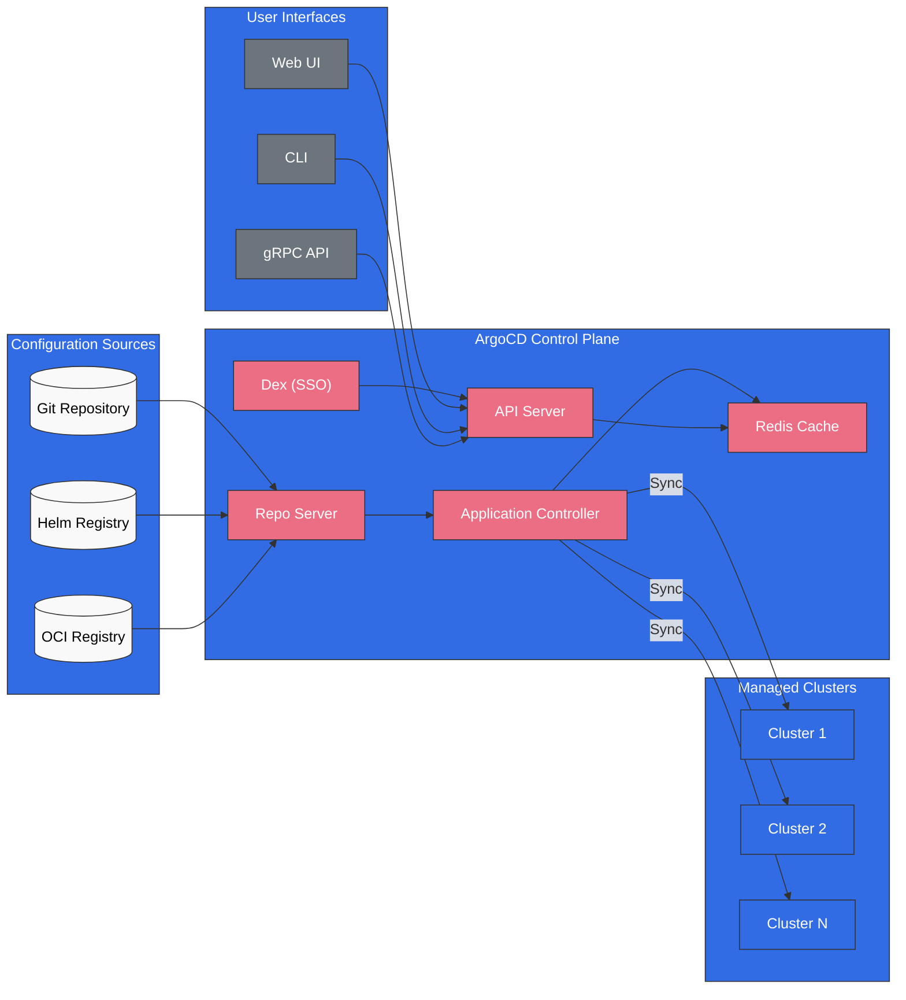
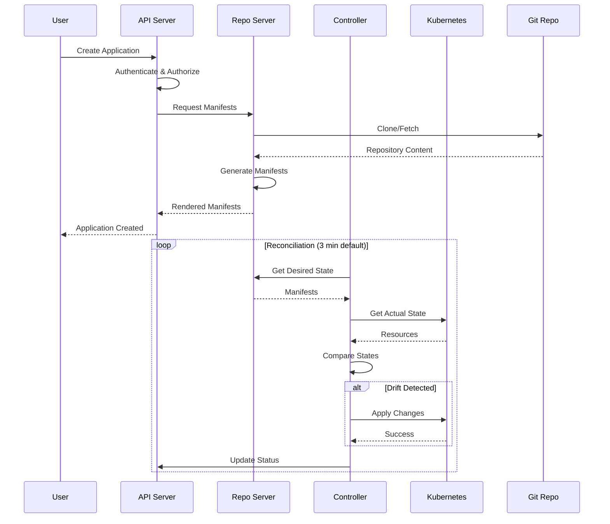

# ArgoCD

> **支持的版本**: ArgoCD v2.9+, Argo Rollouts v1.6+
> **最后更新**: August 10, 2026

## 目录
- [什么是 ArgoCD？](#what-is-argocd)
- [主要优势](#key-benefits)
- [架构概览](#architecture-overview)
- [核心概念](#core-concepts)
- [子指南导航](#sub-guide-navigation)
- [快速开始](#quick-start)
- [版本兼容性](#version-compatibility)

## 什么是 ArgoCD？

ArgoCD 是 Kubernetes 的声明式 GitOps 持续交付工具。它通过将 Git 仓库中定义的期望状态与集群中的实际状态同步，自动将应用程序部署到 Kubernetes 集群。

作为 CNCF 毕业项目，ArgoCD 已成为基于 GitOps 的 Kubernetes 部署的事实标准，被全球数千家组织采用。



## 主要优势

### GitOps 原生

- **Git 作为单一事实来源**: 所有应用程序配置都存储在 Git 中
- **声明式部署**: 定义期望状态，其余工作由 ArgoCD 完成
- **审计轨迹**: 通过 Git 提交提供所有变更的完整历史记录
- **回滚**: 即时回滚到任意先前状态

### 多集群管理

- **集中式控制**: 通过单个 ArgoCD 实例管理数百个集群
- **ApplicationSet**: 基于模板的多集群部署
- **Cluster Generator**: 基于标签动态定位集群

### 企业就绪

- **RBAC**: 细粒度的基于角色的访问控制
- **SSO 集成**: 支持 OIDC、SAML、LDAP
- **多租户**: 基于项目的隔离
- **高可用性**: 生产就绪的 HA 部署

### 开发者体验

- **Web UI**: 可视化的应用程序管理与监控
- **CLI**: 功能完备的命令行界面
- **通知**: Slack、Teams、电子邮件、webhook 集成
- **健康监控**: 内置和自定义健康检查

## 架构概览

### 核心组件

| 组件 | 描述 | 副本数（HA） |
|-----------|-------------|---------------|
| **API Server** | 处理所有 API 请求、认证和 RBAC | 2+ |
| **Repository Server** | 克隆仓库、生成 manifests、缓存结果 | 2+ |
| **Application Controller** | 监控应用程序、协调状态 | 2+（分片） |
| **Redis** | Repo Server 和 Controller 的缓存层 | 3（HA） |
| **Dex** | 用于 SSO 集成的 OIDC 提供程序 | 2+ |
| **Notification Controller** | 在事件发生时发送通知 | 1+ |
| **ApplicationSet Controller** | 管理 ApplicationSet 资源 | 1+ |

### 数据流



## 核心概念

### Application

Application CRD 是 ArgoCD 中的主要资源。它定义：
- **Source**: 获取 manifests 的位置（Git 仓库、Helm chart、OCI）
- **Destination**: 部署位置（集群和 namespace）
- **Sync Policy**: 处理同步的方式

### Project

Project 提供逻辑分组和访问控制：
- 限制可使用的仓库
- 限制目标集群和 namespace
- 定义允许/拒绝的资源

### ApplicationSet

ApplicationSet 支持使用 generators 通过单一定义管理多个应用程序：
- **List Generator**: 静态值列表
- **Cluster Generator**: 定位已注册集群
- **Git Generator**: 扫描仓库目录/文件
- **Matrix/Merge**: 合并多个 generators

### Sync

同步使集群状态与期望状态保持一致：
- **Manual Sync**: 由用户触发
- **Auto Sync**: 在 Git 变更时自动执行
- **Self-Heal**: 自动修正漂移
- **Prune**: 移除孤立资源

## 子指南导航

| 指南 | 描述 |
|-------|-------------|
| [Installation](01-installation.md) | 安装方法、CLI 设置、HA 配置、EKS 集成 |
| [Applications](02-applications.md) | Application CRD、源类型、健康检查、hooks、App of Apps |
| [Sync Strategies](03-sync-strategies.md) | 同步策略、waves、windows、差异比较、重试配置 |
| [ApplicationSets](04-applicationsets.md) | 所有 generators、模板化、渐进式同步、多集群模式 |
| [Traffic Management](05-traffic-management.md) | Argo Rollouts、蓝绿、金丝雀、分析、ingress 集成 |
| [Projects & RBAC](06-projects-rbac.md) | AppProject、RBAC 策略、多租户、JWT tokens |
| [Security](07-security.md) | SSO 集成、Secret 管理、TLS、审计日志 |
| [Notifications](08-notifications.md) | 通知服务、触发器、模板、订阅 |
| [Best Practices](09-best-practices.md) | 仓库模式、性能调优、故障排除、EKS 提示 |
| [Rollouts Experiments Deep Dive](10-rollouts-experiment.md) | Experiment CRD、临时 ReplicaSet 验证、AnalysisRun 判定 |

## 快速开始

### 1. 安装 ArgoCD

```bash
# Create namespace
kubectl create namespace argocd

# Install ArgoCD
kubectl apply -n argocd -f https://raw.githubusercontent.com/argoproj/argo-cd/stable/manifests/install.yaml

# Wait for pods to be ready
kubectl wait --for=condition=Ready pods --all -n argocd --timeout=300s
```

### 2. 访问 UI

```bash
# Port forward to access locally
kubectl port-forward svc/argocd-server -n argocd 8080:443
```

### 3. 获取初始密码

```bash
# Retrieve the initial admin password
kubectl -n argocd get secret argocd-initial-admin-secret \
  -o jsonpath="{.data.password}" | base64 -d && echo
```

### 4. 通过 CLI 登录

```bash
# Install CLI (macOS)
brew install argocd

# Login
argocd login localhost:8080

# Change password (recommended)
argocd account update-password
```

### 5. 部署您的第一个应用程序

```bash
# Create application via CLI
argocd app create guestbook \
  --repo https://github.com/argoproj/argocd-example-apps.git \
  --path guestbook \
  --dest-server https://kubernetes.default.svc \
  --dest-namespace default

# Sync the application
argocd app sync guestbook
```

或者以声明式方式：

```yaml
apiVersion: argoproj.io/v1alpha1
kind: Application
metadata:
  name: guestbook
  namespace: argocd
spec:
  project: default
  source:
    repoURL: https://github.com/argoproj/argocd-example-apps.git
    targetRevision: HEAD
    path: guestbook
  destination:
    server: https://kubernetes.default.svc
    namespace: default
  syncPolicy:
    automated:
      prune: true
      selfHeal: true
```

## 版本兼容性

### 2026 年 7 月更新：ArgoCD 3.x 补丁版本

ArgoCD v3.4.5 于 2026 年 7 月 9 日发布。下表基于 2.x 时代编写——请查阅 [ArgoCD releases page](https://github.com/argoproj/argo-cd/releases)，获取最新的逐版本支持信息。

在于 2026 年 7 月 28 日于横滨举办、作为 KubeCon + CloudNativeCon Japan 同期活动的 ArgoCon Japan 上，Argo CD 首席维护者分享了下一个版本（3.5）的提案（[CNCF blog](https://www.cncf.io/blog/2026/07/20/argocon-japan-2026-meeting-the-maintainers-enterprise-insights-and-the-road-to-argo-cd-3-5/)）。

### 2026 年 8 月更新：ArgoCD v3.5.0 已发布

[ArgoCD v3.5.0](https://github.com/argoproj/argo-cd/releases/tag/v3.5.0) 于 2026 年 8 月 4 日正式发布（GA），使 3.5 成为当前稳定发布线。值得注意的变更包括：

- **Helm 3 → Helm 4 迁移**: manifest 渲染现在使用 Helm 4
- **源完整性验证（Alpha）**: 在 source hydrator 中为 dry sources 提供可选的签名验证，并新增对 Source Integrity 配置的 CLI 支持
- **ApplicationSet 改进**: 并发应用程序管理，以及按归档状态筛选仓库
- **Webhook 抖动**: 可为 webhook 触发的应用程序刷新配置抖动，以缓解惊群刷新峰值
- **UI**: New App 面板中的多源应用程序创建、ApplicationSet Preview Apps 选项卡，以及资源树中的 AppSet 节点
- **新增健康检查**: GatewayClass、`BackendTLSPolicy`（Gateway API）、VictoriaMetrics、Gardener Shoot 等

上一发布线的补丁版本 v3.4.6 和 v3.3.13 也于 2026 年 7 月 31 日发布。

### Kubernetes 兼容性

| ArgoCD 版本 | Kubernetes 版本 |
|----------------|---------------------|
| 2.13.x | 1.28 - 1.31 |
| 2.12.x | 1.27 - 1.30 |
| 2.11.x | 1.26 - 1.29 |
| 2.10.x | 1.25 - 1.28 |
| 2.9.x | 1.24 - 1.27 |

### Amazon EKS 兼容性

| EKS 版本 | 推荐的 ArgoCD |
|-------------|-------------------|
| 1.31 | 2.13.x |
| 1.30 | 2.12.x - 2.13.x |
| 1.29 | 2.11.x - 2.12.x |
| 1.28 | 2.10.x - 2.11.x |

### Argo Rollouts 兼容性

| Rollouts 版本 | ArgoCD 版本 | 功能 |
|------------------|----------------|----------|
| 1.7.x | 2.10+ | 分析改进 |
| 1.6.x | 2.9+ | 通知集成 |
| 1.5.x | 2.8+ | 渐进式交付 |

## 后续步骤

1. **[Installation Guide](01-installation.md)**: 为生产环境设置 ArgoCD
2. **[Applications Guide](02-applications.md)**: 了解 Application CRD
3. **[ApplicationSets Guide](04-applicationsets.md)**: 多集群部署

## 资源

- [ArgoCD Official Documentation](https://argo-cd.readthedocs.io/)
- [ArgoCD GitHub Repository](https://github.com/argoproj/argo-cd)
- [Argo Rollouts Documentation](https://argoproj.github.io/argo-rollouts/)
- [CNCF ArgoCD Project Page](https://www.cncf.io/projects/argo/)

## 测验

为测试您的学习成果，请尝试 [ArgoCD installation quiz](../../quizzes/gitops/argocd/01-installation-quiz.md)。
