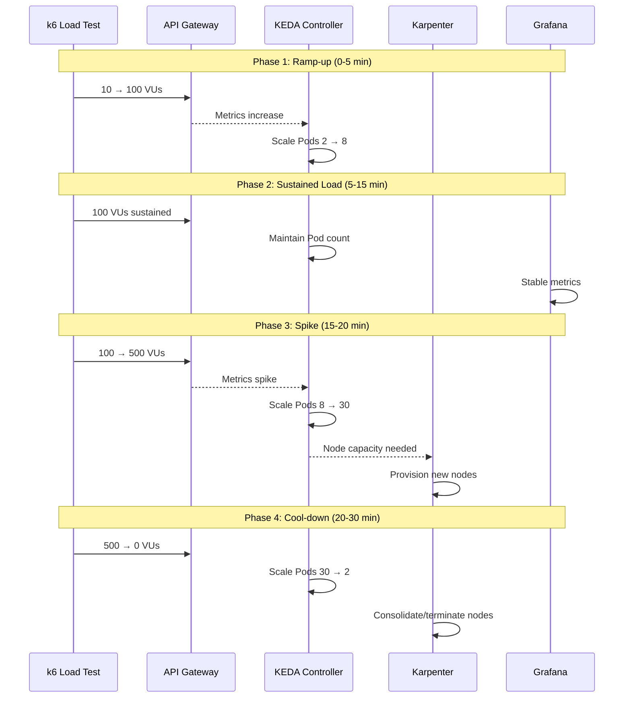

# 第 4 部分：负载测试与自动扩缩容

> **难度**：中级
> **预计时间**：45 分钟
> **最后更新**：February 22, 2026

## 学习目标

- 使用 k6 和 Locust 设计并执行负载测试场景
- 实时观察 KEDA 驱动的 Pod 自动扩缩容
- 在负载突增期间监控 Karpenter Node 自动扩缩容
- 构建用于可视化扩缩容事件的 Grafana 仪表板

## 前提条件

- [ ] 已完成[第 3 部分：MSA 部署](./03-msa-deployment-lab.md)
- [ ] 正在运行已配置 OTel 插桩的 MSA 服务
- [ ] 已配置 KEDA 和 Karpenter
- [ ] 已在本地安装 k6（`brew install k6` 或 `apt install k6`）

---

## 负载测试与扩缩容时间线



---

## 练习 1：k6 负载测试场景

### 步骤

**步骤 1.1：创建 k6 负载测试脚本**

```bash
cat > ~/obs-lab/k6-load-test.js << 'EOF'
import http from 'k6/http';
import { check, sleep } from 'k6';
import { Rate, Trend } from 'k6/metrics';

// Custom metrics
const errorRate = new Rate('errors');
const orderLatency = new Trend('order_latency', true);

// Test configuration
export const options = {
  stages: [
    // Phase 1: Ramp-up
    { duration: '2m', target: 50 },   // Warm up
    { duration: '3m', target: 100 },  // Ramp to 100 VUs

    // Phase 2: Sustained load
    { duration: '10m', target: 100 }, // Hold at 100 VUs

    // Phase 3: Spike
    { duration: '2m', target: 300 },  // Spike to 300 VUs
    { duration: '3m', target: 500 },  // Peak at 500 VUs
    { duration: '2m', target: 500 },  // Hold peak

    // Phase 4: Cool-down
    { duration: '3m', target: 100 },  // Ramp down
    { duration: '2m', target: 50 },   // Further down
    { duration: '3m', target: 0 },    // Complete cool-down
  ],
  thresholds: {
    http_req_duration: ['p(95)<500', 'p(99)<1000'],
    errors: ['rate<0.1'],
    order_latency: ['p(95)<800'],
  },
};

const BASE_URL = __ENV.API_URL || 'http://api-gateway.msa.svc.cluster.local:8080';

// Test data
const products = ['PROD-001', 'PROD-002', 'PROD-003', 'PROD-004', 'PROD-005'];
const quantities = [1, 2, 3, 5, 10];

function randomItem(arr) {
  return arr[Math.floor(Math.random() * arr.length)];
}

function generateOrder() {
  return {
    customer_id: `CUST-${Math.floor(Math.random() * 10000)}`,
    product_id: randomItem(products),
    quantity: randomItem(quantities),
    payment_method: Math.random() > 0.5 ? 'credit_card' : 'debit_card',
  };
}

export default function () {
  // Scenario 1: Create Order (60% of traffic)
  if (Math.random() < 0.6) {
    const orderPayload = JSON.stringify(generateOrder());
    const orderStart = Date.now();

    const orderRes = http.post(`${BASE_URL}/api/v1/orders`, orderPayload, {
      headers: {
        'Content-Type': 'application/json',
        'X-Request-ID': `req-${Date.now()}-${Math.random().toString(36).substr(2, 9)}`,
      },
      tags: { name: 'CreateOrder' },
    });

    orderLatency.add(Date.now() - orderStart);

    const orderSuccess = check(orderRes, {
      'order created': (r) => r.status === 201,
      'order has id': (r) => r.json('order_id') !== undefined,
    });
    errorRate.add(!orderSuccess);
  }

  // Scenario 2: Get Order Status (30% of traffic)
  else if (Math.random() < 0.9) {
    const orderId = `ORD-${Math.floor(Math.random() * 100000)}`;
    const statusRes = http.get(`${BASE_URL}/api/v1/orders/${orderId}`, {
      tags: { name: 'GetOrderStatus' },
    });

    const statusSuccess = check(statusRes, {
      'status retrieved': (r) => r.status === 200 || r.status === 404,
    });
    errorRate.add(!statusSuccess);
  }

  // Scenario 3: List Orders (10% of traffic)
  else {
    const listRes = http.get(`${BASE_URL}/api/v1/orders?limit=10`, {
      tags: { name: 'ListOrders' },
    });

    const listSuccess = check(listRes, {
      'list retrieved': (r) => r.status === 200,
    });
    errorRate.add(!listSuccess);
  }

  // Think time
  sleep(Math.random() * 2 + 0.5);
}

export function handleSummary(data) {
  return {
    'stdout': textSummary(data, { indent: ' ', enableColors: true }),
    '/tmp/k6-summary.json': JSON.stringify(data),
  };
}
EOF
```

**步骤 1.2：负载测试阶段说明**

| 阶段 | 时长 | VU | 目的 |
|-------|----------|-----|---------|
| 预热 | 5 分钟 | 10 → 100 | 逐步预热，触发初始扩缩容 |
| 持续负载 | 10 分钟 | 100 | 稳态，观察稳定指标 |
| 突增 | 7 分钟 | 100 → 500 | 压力测试，触发快速扩缩容 |
| 冷却 | 8 分钟 | 500 → 0 | 观察缩容，清理资源 |

**步骤 1.3：获取 API Gateway URL**

```bash
kubectl config use-context $(kubectl config get-contexts -o name | grep obs-service)

API_URL=$(kubectl -n msa get svc api-gateway \
  -o jsonpath='{.status.loadBalancer.ingress[0].hostname}')

echo "API Gateway URL: http://$API_URL:8080"
```

**步骤 1.4：运行 k6 负载测试**

```bash
# Run load test
k6 run --env API_URL=http://$API_URL:8080 ~/obs-lab/k6-load-test.js

# Or run with output to Prometheus
k6 run --env API_URL=http://$API_URL:8080 \
  --out experimental-prometheus-rw \
  ~/obs-lab/k6-load-test.js
```

---

## 练习 2：Locust 替代方案（基于 Python）

### 步骤

**步骤 2.1：创建 Locust Deployment**

```bash
cat <<'EOF' | kubectl apply -f -
apiVersion: v1
kind: ConfigMap
metadata:
  name: locust-script
  namespace: msa
data:
  locustfile.py: |
    from locust import HttpUser, task, between
    import random
    import json

    class OrderUser(HttpUser):
        wait_time = between(0.5, 2)

        products = ['PROD-001', 'PROD-002', 'PROD-003', 'PROD-004', 'PROD-005']

        @task(6)
        def create_order(self):
            order = {
                'customer_id': f'CUST-{random.randint(1, 10000)}',
                'product_id': random.choice(self.products),
                'quantity': random.choice([1, 2, 3, 5, 10]),
                'payment_method': random.choice(['credit_card', 'debit_card']),
            }
            with self.client.post(
                '/api/v1/orders',
                json=order,
                headers={'Content-Type': 'application/json'},
                catch_response=True
            ) as response:
                if response.status_code == 201:
                    response.success()
                else:
                    response.failure(f'Status: {response.status_code}')

        @task(3)
        def get_order_status(self):
            order_id = f'ORD-{random.randint(1, 100000)}'
            self.client.get(f'/api/v1/orders/{order_id}')

        @task(1)
        def list_orders(self):
            self.client.get('/api/v1/orders?limit=10')
---
apiVersion: apps/v1
kind: Deployment
metadata:
  name: locust-master
  namespace: msa
spec:
  replicas: 1
  selector:
    matchLabels:
      app: locust
      role: master
  template:
    metadata:
      labels:
        app: locust
        role: master
    spec:
      containers:
        - name: locust
          image: locustio/locust:2.22.0
          ports:
            - containerPort: 8089
            - containerPort: 5557
          command:
            - locust
            - --master
            - --host=http://api-gateway:8080
          volumeMounts:
            - name: locust-script
              mountPath: /home/locust
          resources:
            requests:
              cpu: 100m
              memory: 256Mi
      volumes:
        - name: locust-script
          configMap:
            name: locust-script
---
apiVersion: apps/v1
kind: Deployment
metadata:
  name: locust-worker
  namespace: msa
spec:
  replicas: 4
  selector:
    matchLabels:
      app: locust
      role: worker
  template:
    metadata:
      labels:
        app: locust
        role: worker
    spec:
      containers:
        - name: locust
          image: locustio/locust:2.22.0
          command:
            - locust
            - --worker
            - --master-host=locust-master
          volumeMounts:
            - name: locust-script
              mountPath: /home/locust
          resources:
            requests:
              cpu: 500m
              memory: 512Mi
      volumes:
        - name: locust-script
          configMap:
            name: locust-script
---
apiVersion: v1
kind: Service
metadata:
  name: locust-master
  namespace: msa
spec:
  selector:
    app: locust
    role: master
  ports:
    - name: web
      port: 8089
      targetPort: 8089
    - name: master
      port: 5557
      targetPort: 5557
  type: LoadBalancer
EOF
```

**步骤 2.2：访问 Locust Web UI**

```bash
LOCUST_URL=$(kubectl -n msa get svc locust-master \
  -o jsonpath='{.status.loadBalancer.ingress[0].hostname}')

echo "Locust UI: http://$LOCUST_URL:8089"
```

---

## 练习 3：在负载期间观察自动扩缩容

### 步骤

**步骤 3.1：打开多个用于监控的终端窗口**

```bash
# Terminal 1: Watch Pod scaling
watch -n 2 'kubectl get pods -n msa -l app=order-service -o wide'

# Terminal 2: Watch HPA status
watch -n 5 'kubectl get hpa -n msa'

# Terminal 3: Watch Node scaling (Karpenter)
watch -n 10 'kubectl get nodes -l workload-type=msa'

# Terminal 4: Watch Karpenter logs
kubectl logs -n karpenter -l app.kubernetes.io/name=karpenter -f
```

**步骤 3.2：负载测试期间的观察要点**

| 指标 | 观察位置 | 预期行为 |
|--------|-----------------|-------------------|
| Pod 数量 | `kubectl get pods -n msa` | 2 → 8 → 30 → 2 |
| HPA 指标 | `kubectl get hpa -n msa` | CPU/请求速率增加 |
| Node 数量 | `kubectl get nodes` | 配置新的 Node |
| SQS 队列深度 | AWS Console / CloudWatch | 峰值期间突增 |
| Prometheus 指标 | Grafana Explore | 请求速率、延迟 |
| Trace | Tempo / Grafana | 端到端延迟 |

**步骤 3.3：KEDA 扩缩容事件**

```bash
# Watch KEDA events
kubectl get events -n msa --field-selector reason=KEDAScaleTargetActivated -w

# Check ScaledObject status
kubectl describe scaledobject -n msa order-service-scaler
```

**步骤 3.4：Karpenter 配置事件**

```bash
# Watch node provisioning
kubectl get events -A --field-selector reason=Provisioned -w

# Check NodePool status
kubectl describe nodepool msa-workloads
```

---

## 练习 4：冷却与缩容观察

### 步骤

**步骤 4.1：在负载测试完成后监控缩容**

```bash
# Watch Pod termination
kubectl get pods -n msa -l app=order-service -w

# Watch node consolidation
kubectl get events -A --field-selector reason=Consolidated -w
```

**步骤 4.2：缩容时间线**

| 负载结束后的时间 | Pod 数量 | Node 数量 | 说明 |
|-----------------|-----------|------------|-------|
| 0 分钟 | 30 | 8+ | 峰值状态 |
| 2 分钟 | 20 | 8+ | HPA 冷却开始 |
| 5 分钟 | 10 | 6 | Pod 正在终止 |
| 10 分钟 | 4 | 4 | Karpenter 正在整合 |
| 15 分钟 | 2 | 3 | 接近基准状态 |
| 20 分钟 | 2 | 2 | 已恢复基准状态 |

**步骤 4.3：验证成本优化**

```bash
# Check spot instance usage
kubectl get nodes -o custom-columns=NAME:.metadata.name,TYPE:.metadata.labels.karpenter\\.sh/capacity-type,INSTANCE:.metadata.labels.node\\.kubernetes\\.io/instance-type

# Expected: Mix of spot and on-demand instances
```

---

## 练习 5：Grafana 扩缩容仪表板

### 步骤

**步骤 5.1：创建扩缩容仪表板面板**

| 面板 | 指标查询 | 可视化 |
|-------|-------------|---------------|
| Pod 数量 | `sum(kube_deployment_status_replicas{namespace="msa"}) by (deployment)` | 时间序列 |
| Node 数量 | `count(kube_node_info{node=~".*msa.*"})` | 统计 |
| CPU 使用率 | `sum(rate(container_cpu_usage_seconds_total{namespace="msa"}[5m])) by (pod)` | 时间序列 |
| 内存使用率 | `sum(container_memory_working_set_bytes{namespace="msa"}) by (pod)` | 时间序列 |
| SQS 队列深度 | `aws_sqs_approximate_number_of_messages_visible_average{queue_name="obs-lab-orders"}` | 时间序列 |
| 请求速率 | `sum(rate(http_server_request_count{namespace="msa"}[1m])) by (service)` | 时间序列 |
| 错误率 | `sum(rate(http_server_request_count{namespace="msa",http_status_code=~"5.."}[1m])) / sum(rate(http_server_request_count{namespace="msa"}[1m]))` | 仪表盘 |
| P99 延迟 | `histogram_quantile(0.99, sum(rate(http_server_request_duration_seconds_bucket{namespace="msa"}[5m])) by (le, service))` | 时间序列 |

**步骤 5.2：导入仪表板 JSON**

```bash
cat > /tmp/scaling-dashboard.json << 'EOF'
{
  "dashboard": {
    "title": "MSA Scaling Dashboard",
    "tags": ["obs-lab", "scaling", "k6"],
    "timezone": "browser",
    "panels": [
      {
        "title": "Pod Replicas by Deployment",
        "type": "timeseries",
        "gridPos": {"h": 8, "w": 12, "x": 0, "y": 0},
        "targets": [{
          "expr": "sum(kube_deployment_status_replicas{namespace=\"msa\"}) by (deployment)",
          "legendFormat": "{{deployment}}"
        }]
      },
      {
        "title": "Node Count",
        "type": "stat",
        "gridPos": {"h": 4, "w": 6, "x": 12, "y": 0},
        "targets": [{
          "expr": "count(kube_node_info)"
        }]
      },
      {
        "title": "Request Rate",
        "type": "timeseries",
        "gridPos": {"h": 8, "w": 12, "x": 0, "y": 8},
        "targets": [{
          "expr": "sum(rate(http_server_request_count{namespace=\"msa\"}[1m])) by (service)",
          "legendFormat": "{{service}}"
        }]
      },
      {
        "title": "P99 Latency (ms)",
        "type": "timeseries",
        "gridPos": {"h": 8, "w": 12, "x": 12, "y": 8},
        "targets": [{
          "expr": "histogram_quantile(0.99, sum(rate(http_server_request_duration_seconds_bucket{namespace=\"msa\"}[5m])) by (le, service)) * 1000",
          "legendFormat": "{{service}}"
        }]
      }
    ]
  }
}
EOF

# Import via Grafana API
curl -X POST -H "Content-Type: application/json" \
  -u admin:ObsLab2026! \
  -d @/tmp/scaling-dashboard.json \
  "http://$GRAFANA_URL/api/dashboards/db"
```

**步骤 5.3：为扩缩容事件创建注释**

```bash
# Add Prometheus recording rules for scaling events
cat <<'EOF' | kubectl apply -f -
apiVersion: monitoring.coreos.com/v1
kind: PrometheusRule
metadata:
  name: scaling-events
  namespace: monitoring
spec:
  groups:
    - name: scaling-events
      rules:
        - record: scaling:pod_scale_up
          expr: |
            changes(kube_deployment_status_replicas{namespace="msa"}[5m]) > 0
            and
            delta(kube_deployment_status_replicas{namespace="msa"}[5m]) > 0

        - record: scaling:pod_scale_down
          expr: |
            changes(kube_deployment_status_replicas{namespace="msa"}[5m]) > 0
            and
            delta(kube_deployment_status_replicas{namespace="msa"}[5m]) < 0

        - record: scaling:node_added
          expr: |
            changes(kube_node_created{node=~".*msa.*"}[10m]) > 0
EOF
```

### 验证

```bash
# Open Grafana dashboard
echo "Grafana URL: http://$GRAFANA_URL"
echo "Dashboard: MSA Scaling Dashboard"

# Verify metrics are populated
curl -s -u admin:ObsLab2026! \
  "http://$GRAFANA_URL/api/datasources/proxy/1/api/v1/query?query=kube_deployment_status_replicas" | jq
```

---

## 总结

在本实验中，你已完成：

| 任务 | 状态 |
|------|--------|
| k6 负载测试脚本 | 已创建 |
| Locust Deployment | 已部署 |
| Pod 自动扩缩容（KEDA） | 已观察 |
| Node 自动扩缩容（Karpenter） | 已观察 |
| 缩容行为 | 已验证 |
| 扩缩容仪表板 | 已创建 |

### 关键观察结果

| 指标 | 基准 | 峰值 | 恢复后 |
|--------|----------|------|----------|
| Order Service Pod | 2 | 30 | 2 |
| Node 总数 | 3 | 8+ | 3 |
| 请求速率 | 0 | 500+ RPS | 0 |
| P99 延迟 | <100ms | <500ms | <100ms |
| 错误率 | 0% | <1% | 0% |

## 清理

清理工作将在[第 6 部分](./06-distributed-tracing-lab.md#cleanup)中执行。

## 故障排除

<details>
<summary>k6 无法访问 API Gateway</summary>

- 验证 LoadBalancer 是否具有外部 IP：`kubectl get svc -n msa api-gateway`
- 检查安全组是否允许入站流量
- 测试连通性：`curl http://$API_URL:8080/health`
</details>

<details>
<summary>Pod 未扩缩容</summary>

- 检查 HPA 状态：`kubectl describe hpa -n msa`
- 验证 KEDA ScaledObject：`kubectl describe scaledobject -n msa`
- 检查指标是否可用：`kubectl top pods -n msa`
</details>

<details>
<summary>Node 未配置</summary>

- 检查 Karpenter 日志：`kubectl logs -n karpenter -l app.kubernetes.io/name=karpenter`
- 验证 NodePool 限制：`kubectl describe nodepool msa-workloads`
- 检查 AWS 账户中的 EC2 实例限制
</details>

## 后续步骤

继续学习[第 5 部分：告警与 AIOps](./05-alerting-aiops-lab.md)，以配置告警和 AI 驱动的事件响应。

## 参考资料

- [k6 文档](https://k6.io/docs/)
- [Locust 文档](https://docs.locust.io/)
- [KEDA 文档](../../autoscaling/01-keda.md)
- [Karpenter 文档](../../autoscaling/02-karpenter.md)
